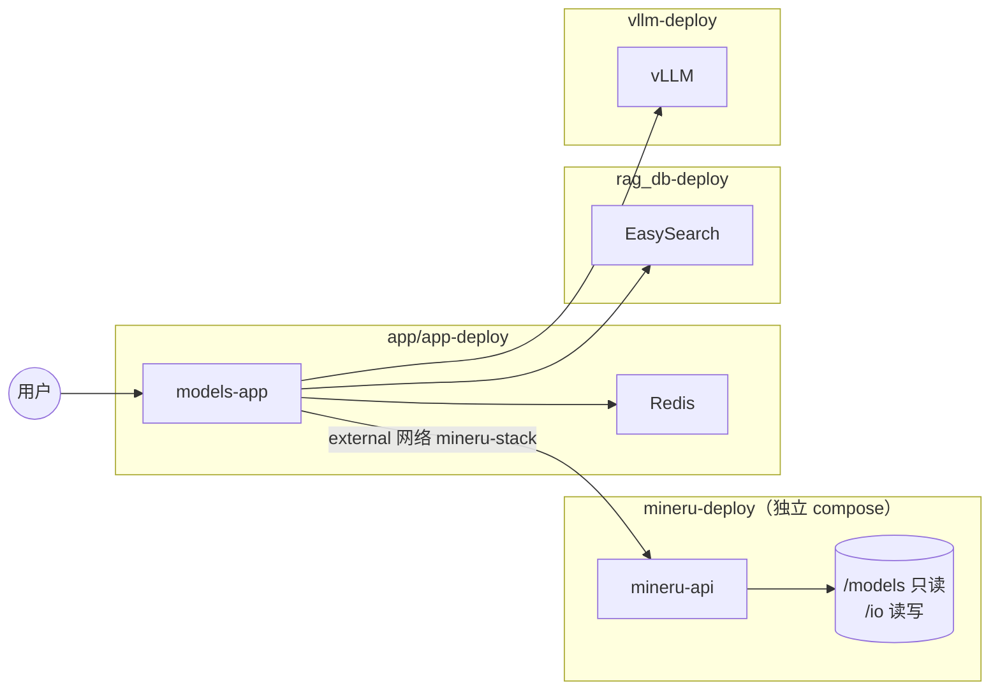

# MinerU 独立部署 + RAG 摄入：技术方案与实施清单（可执行版）

本文档面向：**同一台服务器部署本仓库全套在线栈**（`models-app`、Redis、EasySearch、vLLM 等），并 **外挂独立 MinerU 栈**（与 **rag_db-deploy、vllm-deploy 同级管理**），用于扫描类大 PDF → Markdown，再接入现有 RAG 异步摄入。

**硬性要求（已落实到仓库）**

| 要求 | 实现位置 |
|------|----------|
| MinerU **独立管理** | 仓库根目录 **`mineru-deploy/`**（自有 `docker-compose.yml`，不并入 `app/app-deploy`） |
| **CPU / GPU 可切换** | 默认 **CPU**：仅 `docker-compose.yml`；**GPU**：叠加 **`docker-compose.gpu.yml`** + `.env` 中 `MINERU_DEVICE_MODE=gpu` |
| **离线模型** | 模型宿主机目录 + `config/mineru-tools.json` + 环境变量；**下载与配置步骤**见 **`mineru-deploy/README.md` §3** |

---

## 1. 背景与约束

| 约束 | 说明 |
|------|------|
| 共部署 | 与 vLLM、应用 API、ES 等 **共享 CPU / 内存 /（可选）GPU** |
| 文档规模 | 单文件约 **300 页** 扫描 PDF |
| 网络 | **内网**；镜像与权重 **离线或私有镜像仓** |
| 算力默认 | **CPU 异步解析**（`MINERU_DEVICE_MODE=cpu`），避免与 vLLM **默认同卡争抢** |
| 调用方式 | `models-app` → **HTTP** → `mineru-api`（容器名，同 Docker 网络） |

---

## 2. 仓库内交付物（已创建，实施时按需改镜像与配置）

```
mineru-deploy/
  docker-compose.yml          # CPU 默认，cpus/mem_limit，网络 mineru-stack
  docker-compose.gpu.yml      # 仅 GPU 相关叠加（gpus + 环境变量）
  .env.example
  config/mineru-tools.json.example
  README.md                   # 启动命令、CPU/GPU 切换、离线模型、models-app 调用与端口说明
docs/
  MinerU-RAG-技术方案与实施清单.md   # 本文
```

**运维启动顺序（建议）**

1. `rag_db-deploy`（EasySearch）  
2. `vllm-deploy`（若需要）  
3. **`mineru-deploy`**（按 README 选择 CPU 或 GPU 命令）  
4. `app/app-deploy`（`models-app` 加入 **external 网络 `mineru-stack`** 后再启动或 `compose up` 重载）

---

## 3. CPU / GPU 模式（配置与命令对照）

### 3.1 配置项

| 变量（`.env`） | 默认 | 含义 |
|----------------|------|------|
| `MINERU_DEVICE_MODE` | `cpu` | 文档/运维标记；GPU 模式时请设为 `gpu` |
| `MINERU_NVIDIA_VISIBLE_DEVICES` | `0` | GPU 模式下的可见设备（避免与 vLLM 同卡时请改为空闲卡号） |
| `MINERU_IMAGE` | 无默认 | **必填**，内网镜像地址与标签 |
| `MINERU_MODELS_HOST_PATH` | 无默认 | **必填**，离线模型根目录（只读挂载 `/models`） |
| `MINERU_IO_HOST_PATH` | 无默认 | **必填**，PDF/MD 等读写目录（挂载 `/io`，**须与 app 约定一致**） |
| `MINERU_PORT` | `8009` | 宿主机映射到容器 `8000` |
| `MINERU_NETWORK_NAME` | `mineru-stack` | Docker 网络名；`models-app` 须 `external: true` 同名接入 |
| `MINERU_CPU_LIMIT` / `MINERU_MEM_LIMIT` | `4` / `16g` | compose 中 `cpus` / `mem_limit`，可按机器调整 |

### 3.2 启动命令（必须严格执行）

```bash
cd mineru-deploy
cp .env.example .env
# 编辑 .env：MINERU_IMAGE、路径、MINERU_DEVICE_MODE 等

# --- CPU（默认）---
docker compose --env-file .env up -d

# --- GPU ---
# .env: MINERU_DEVICE_MODE=gpu
docker compose --env-file .env -f docker-compose-mx.yml -f docker-compose.gpu.yml up -d
```

**禁止**：在未叠加 `docker-compose.gpu.yml` 时仅改 `MINERU_DEVICE_MODE=gpu` 却期望使用 NVIDIA——**不会**自动注入 `gpus`。

---

## 4. 离线模型：下载方法与配置方法（摘要）

**权威细节以所选 MinerU 版本官方文档为准**；运维执行步骤以 **`mineru-deploy/README.md` §3** 为准。摘要如下：

1. **下载**：在可联网环境通过 **ModelScope / HuggingFace CLI / 官方脚本** 获取与版本匹配的权重，打包或 `rsync` 到服务器 **`MINERU_MODELS_HOST_PATH`**。  
2. **配置**：复制 `config/mineru-tools.json.example` → `config/mineru-tools.json`，按官方 schema 填写 **`models-dir`**（容器内路径指向 `/models/...`）。  
3. **Compose**：已挂载只读 `/models`、可写 `/io`，并设置 `MINERU_TOOLS_CONFIG_JSON=/config/mineru-tools.json`、`HF_HOME=/io/.hf_cache`、`HF_HUB_OFFLINE=1` 等（见 `docker-compose.yml`）。  
4. **验证**：断网启动后跑最小 PDF，确认无拉取外网且解析成功。

---

## 5. 与 `models-app` 的网络与配置

1. **网络**：`mineru-deploy` 创建 **`mineru-stack`**（或 `.env` 自定义名）。  
2. **models-app**：在 `app/app-deploy/docker-compose.yml` 增加 **external 网络**，与 EasySearch / vLLM 并列；**不要**把 MinerU 写进 app 的 build context。  
3. **应用环境变量**（已部分落地，见 `app/core/config.py` 的 `MinerUConfig` 与 `app/app-deploy/.env.example`）：  
   - `MINERU_BASE_URL=http://mineru-api:8000`（容器内端口 **8000**；与 vLLM 容器内端口不冲突，详见 **`mineru-deploy/README.md` §7**）  
   - `MINERU_ENABLED`、`MINERU_TIMEOUT_S`、`MINERU_MAX_CONCURRENT`、`MINERU_IO_CONTAINER_PATH`（默认 `/workspace/mineru-io`）  
   - **Compose**：`MINERU_IO_HOST_PATH` 与 mineru-deploy 相同宿主目录 → 挂载到应用容器 `MINERU_IO_CONTAINER_PATH`（`docker-compose.yml` 已配置）

---

## 6. 单机共部署下的 SLA 与并发（不变，供产品承诺参考）

| 运行模式 | 300 页扫描 PDF（首版建议对外口径） |
|----------|--------------------------------------|
| MinerU **CPU** + 全栈同机 | **45～120 分钟 / 本**（单 Worker、并发 1） |
| MinerU **独立 GPU**（不与 vLLM 同卡） | **15～45 分钟 / 本**（压测后收紧） |
| 与 vLLM **同卡并行** | **不作为基线 SLA** |

| 参数 | 建议初值 |
|------|----------|
| MinerU 容器内解析并发 | **1** |
| 应用侧全局 MinerU 调用并发 | **1～2** |

---

## 7. 总体架构（更新）



---

## 8. RAG 摄入衔接（实现阶段目标）

- 在异步 Job 中增加 **`mineru_parse`**：`source_type=pdf` 且策略命中时，将 PDF 写入 **`/io`** 约定路径 → 调 MinerU API → 得到 Markdown → 后续按 **`markdown`** 走 `DocumentParser` / clean / chunk / 索引。  
- 失败错误码示例：`MINERU_TIMEOUT`、`MINERU_OFFLINE_MODEL_MISSING`。  
- `MINERU_ENABLED=false` 时回退现有 **pypdf 文本层** 或仅接受已 Markdown。

---

## 9. 实施 Todo List（按顺序执行，可打勾）

### 阶段 A — `mineru-deploy` 落地与联调

- [ ] **A1**：从内网镜像仓确定 **`MINERU_IMAGE` 标签**，写入 `.env`。  
- [ ] **A2**：按 **`mineru-deploy/README.md` §3** 完成离线模型落盘与 **`config/mineru-tools.json`**。  
- [ ] **A3**：**CPU 模式** `docker compose --env-file .env up -d`，`curl`/Swagger 验证服务与最小 PDF。  
- [ ] **A4**（可选）：在 **独立 GPU** 上执行 **GPU 叠加启动**，对比耗时；记录是否与 vLLM 同卡。  
- [ ] **A5**：修正 `docker-compose.yml` 中 **`command`**（若官方镜像入口非 `mineru-api`），并写入 README 变更说明。

### 阶段 B — `models-app` 接入网络

- [ ] **B1**：修改 **`app/app-deploy/docker-compose.yml`**：`models-app` 加入 **external 网络** `mineru-stack`（名与 `MINERU_NETWORK_NAME` 一致）。  
- [ ] **B2**：`app/app-deploy/.env.example` 增加 `MINERU_BASE_URL=http://mineru-api:8000` 等（与 `mineru-deploy` 文档一致）。  
- [x] **B3**：`models-app` / `models-app-gpu` 已通过 **`MINERU_IO_HOST_PATH`** 挂载 **`/workspace/mineru-io`**（未配置时使用占位卷 `mineru-io-dummy`）；`app/core/config.py` 中 **`MinerUConfig.io_path`** 与之一致。

### 阶段 C — 应用配置与 MinerU 客户端

- [x] **C1**：`app/core/config.py` 已提供 **`MinerUConfig`**（`enabled`、`base_url`、`timeout_s`、`max_concurrent`、`io_path`）；待实现 **`MinerUClient`** 消费上述配置。  
- [ ] **C2**：实现 **`MinerUClient`**（`httpx`），与当前 MinerU 版本 API 对齐（异步任务 + 轮询或同步接口）。  
- [ ] **C3**：单元测试 **mock HTTP**。

### 阶段 D — RAG 编排集成

- [ ] **D1**：在 **`ingestion_orchestrator`**（或等价）插入 **`mineru_parse`**，仅 PDF + 开关开启时调用。  
- [ ] **D2**：全局并发 **Semaphore**（多 worker 时考虑 Redis 锁），上限 = `MINERU_MAX_CONCURRENT`。  
- [ ] **D3**：Job **metrics**：`mineru_parse_ms`、`output_md_chars`、错误码。

### 阶段 E — 验收与文档

- [ ] **E1**：300 页级样张 + 含公式/表格样张，**CPU/GPU** 各至少一轮，记录耗时与检索抽样。  
- [ ] **E2**：更新 **`app/app-deploy/README.md`** 或 **`framework-guide`** 中的启动顺序：**rag → vllm → mineru-deploy → app**。  
- [ ] **E3**：Runbook：重启 MinerU、清理 `/io` 临时文件、磁盘告警阈值。

---

## 10. 风险与降级

| 风险 | 应对 |
|------|------|
| 镜像 `command` 与官方不一致 | A5 修正；保留一次成功启动的 compose 片段在 README |
| 离线路径与 config 不一致 | 启动前脚本校验 `models-dir` 目录存在 |
| GPU 与 vLLM OOM | 默认 CPU；GPU 必须 **分卡** 或错时 |
| MinerU 宕机 | `MINERU_ENABLED` 关闭，走 pypdf / 人工 MD |

---

## 11. 文档维护

- 技术方案与清单：**`docs/MinerU-RAG-技术方案与实施清单.md`**（本文）  
- 运维操作与离线模型、**models-app 调用与端口**：**`mineru-deploy/README.md`**  
- MinerU 大版本升级：**先对齐官方 Docker 与 config 字段**，再更新 compose、`mineru-tools.json` 示例与 A5/B 步骤。

---

**结论**：MinerU 以 **`mineru-deploy` 独立 compose** 管理；**默认 CPU** 通过仅使用 `docker-compose.yml` 实现；**GPU** 通过 **叠加 `docker-compose.gpu.yml` + `.env`** 显式开启；**离线模型** 通过 **宿主机目录 + `mineru-tools.json` + README §3** 固化。后续实现按 **阶段 A→E Todo** 顺序执行即可。
