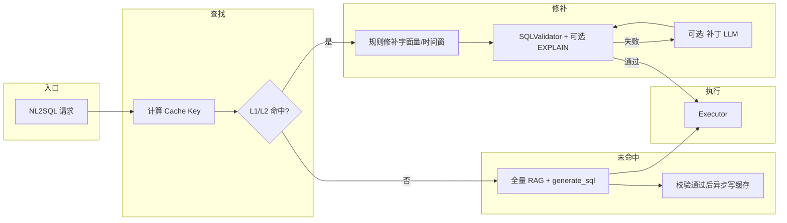

# NL2SQL 缓存实现方案（分层缓存 + 命中后修补）

本文档描述在现有 NL2SQL 链路与综合分析（含 **`analysis_type=overheat_guidance`** 及模板 **`analysis_plan_overheat_guidance`**）之上，引入 **分层缓存** 与 **命中后修补** 的总体设计，用于降低 **`acquire_data`（生成 SQL + 执行）** 耗时，进而缩短流式合成前的首字延迟。

**关联文档**：`docs/NL2SQL系统概要设计.md`（NL2SQL 总体链路）；综合分析数据计划模板见 `configs/prompts.yaml` · `analysis_plan_overheat_guidance`。

---

## 一、目标与范围

### 1.1 目标

- **缩短重复或近似重复问询**下的端到端取数时间：命中缓存路径优先走 **校验 + 执行**，避免或减少 **全长 RAG + 生成 SQL 的大模型调用**。
- **不牺牲正确性**：任何缓存命中结果必须经过 **既有 SQLValidator / 白名单**（及可选 EXPLAIN）再放入执行。
- **可演进**：首版可采用 **纯规则命中 + 规则修补**；后续按需叠加 **向量近似召回** 或 **轻量 SQL 补丁 LLM**。

### 1.2 范围

| 纳入 | 不纳入（首版） |
|------|----------------|
| 直连 **`NL2SQLService.query` / `NL2SQLChain.generate_sql`** 的路径 | 改写合成阶段管线顺序（「先流式后取数」属另一类方案） |
| 综合分析内 **`plan_item_id`（q1～q4）** 维度的分桶缓存 | 跨分析类型通用语义检索平台（可二期） |
| **SELECT** 只读 SQL | INSERT/UPDATE/DELETE |

---

## 二、设计原则

1. **分层存储**：**结构化骨架**（优）与 **可执行 SQL 文本**（次）并存；优先命中骨架以减少「整条 SQL 过时」风险。
2. **命中判定可规则化**：默认使用 **规范化问题文本 + 业务键 + schema 指纹** 的确定性哈希；**不必**为「是否命中」调用对话 LLM。
3. **修补递进**：**规则替换字面量 / 时间窗** → 失败再 **可选** 走短链路补丁 LLM（配置开关）。
4. **版本敏感**：缓存键绑定 **catalog/schema 策略版本**，配置或 DDL 变更自动失效。
5. **失败即降级**：校验或执行失败 → **剔除或降级该条目**，回退现有全量 NL2SQL；禁止持久化「坏 SQL」。

---

## 三、分层缓存模型

### 3.1 L1：结构化查询骨架（Structured Skeleton）

**含义**：与具体字面量无关的「意图级」描述，用于稳定复用。

建议字段（示例，可按实现裁剪）：

```json
{
  "version": 1,
  "analysis_type": "overheat_guidance",
  "plan_item_id": "q2",
  "tables": ["monitor_hotarea_temp", "account_boiler", "base_temp_point"],
  "join_graph": [
    {"left": "m.boiler_id", "right": "ab.boiler_id", "join_type": "inner"}
  ],
  "select_slots": ["start_time", "end_time", "highest_temp", "limit_temp"],
  "filter_slots": {
    "boiler_id": "${BOILER_ID}",
    "time_range": "${TIME_RANGE_SQL}"
  },
  "schema_fp": "sha256:...",
  "nl2sql_policy_fp": "sha256:..."
}
```

**命中后**：由确定性渲染器或极简模板引擎生成 SQL，再校验执行。

**适用**：表/JOIN 形态高度稳定、变化多在 **WHERE 参数** 的超温子任务（如 q2 运行参数联动）。

### 3.2 L2：可执行 SQL 快照（SQL Snapshot）

**含义**：已通过 **校验**（及可选 EXPLAIN）后的 **完整 SELECT 语句**。

建议关联元数据：

| 字段 | 说明 |
|------|------|
| `sql_normalized` | 规范化空格/注释后的文本，便于比对 |
| `params_extracted` | 若解析出的字面量：机组、起止时间等 |
| `created_at` / `ttl_seconds` | 生命周期 |

**命中后**：先做 **规则修补**（替换日期、`boiler_id` 等已知槽位）；修补失败再降级全量生成。

**适用**：骨架难以抽象但同一用户重复问法完全一致的场景。

---

## 四、缓存键（Cache Key）设计

### 4.1 键组成（建议）

| 维度 | 说明 |
|------|------|
| `tenant_ds_fp` | 租户或数据源指纹（防串库） |
| `analysis_type` | 如 `overheat_guidance` |
| `plan_item_id` | 综合分析模板任务 id：`q1`～`q4`（直连 NL2SQL 可为空或 `default`） |
| `question_norm_fp` | 用户问题与模板子句拼接后 **规范化** 再 **SHA-256**（见 §4.2） |
| `schema_fp` | 当前白名单 / 反射 catalog 的版本摘要 |
| `nl2sql_policy_fp` | prompt 版本、table_scope、校验规则集的哈希 |

**存储 Key 示例**：  
`nl2sql_cache:v1:{tenant_ds_fp}:{analysis_type}:{plan_item_id}:{question_norm_fp}:{schema_fp}:{nl2sql_policy_fp}`

键过长时可对上述片段再做一层 **SHA-256** 作为 Redis field。

### 4.2 问题规范化（纯规则，无 LLM）

目的：提高「同一意图、措辞略变」的命中率。

示例规则（可配置）：

- 全半角、空白、标点统一；
- 日期口径统一为 `YYYY-MM-DD`（若在正则可捕获范围内）；
- 机组号、`UNIT-xx` 大小写统一；
- 可选：**停用词表**、业务同义词表（极保守，避免过度合并）。

规范化后的字符串参与 **`question_norm_fp`**。

---

## 五、失效策略

| 类型 | 策略 |
|------|------|
| **TTL** | 全局默认 TTL（如 1～24h）；高频变更库可缩短 |
| **版本 bump** | `schema_fp` / `nl2sql_policy_fp` 变更 → 旧键天然 miss |
| **主动剔除** | 校验失败、执行错误、连续修补失败 |
| **运维** | 提供按 `analysis_type` / 前缀 flush（脚本或管理接口） |

---

## 六、命中与未命中流程

### 6.1 总流程（逻辑）



### 6.2 命中后修补（递进）

1. **规则修补（必选实现）**  
   - 基于请求上下文已知字段（如结构化 **`unit_id`**、会话内时间窗）替换 SQL 中对应占位或已知字面量模式。  
   - 时间宏：`DATE_SUB(CURDATE(), INTERVAL 7 DAY)` 等可按策略重写（需与白名单一致）。

2. **校验**  
   - 走现有 **`SQLValidator`**；失败则 **不执行** 本条缓存，进入降级。

3. **可选：补丁 LLM（配置关闭默认 off）**  
   - 输入：旧 SQL + 新问题 + 校验错误摘要；输出：仅修订 SQL；**短 prompt**，严格约束表名列名来自 catalog。

### 6.3 未命中

- 走现有 **`generate_sql`** 全链路；**成功后**：
  - **异步**写入 L2（SQL 快照）；
  - 若骨架抽取模块可用，再写入 L1（骨架）（避免阻塞响应路径）。

---

## 七、与现有代码的集成点（建议）

| 位置 | 职责 |
|------|------|
| **`app/services/nl2sql_service.py`** 或 **`app/nl2sql/chain.py`** 中 **`generate_sql` / `query` 入口向前** | 统一 **lookup → repair → validate**；未命中调用原逻辑 |
| **`AnalysisGraphRunner._run_single_nl2sql_plan_task`** | 可选：向下传入 **`plan_item_id`**（已有），确保 Key 含 **`q1`～`q4`** |
| **配置 `app/core/config.py`** | 新增开关：`NL2SQL_CACHE_ENABLED`、`TTL`、`PATCH_LLM_ENABLED` 等 |

**原则**：缓存层对上层透明；**不改变** `AnalysisNL2SQLCall` 对外语义（可在 `attempts` 或扩展字段标记 `cache_hit` 便于观测）。

---

## 八、综合分析 · 超温模板（`analysis_plan_overheat_guidance`）

- 模板见 `configs/prompts.yaml`，子任务 **q1～q4** 的 **`question`** 与用户 **`req.query`** 组合后形成最终 NL2SQL 问题串。  
- **缓存必须按 `plan_item_id` 分桶**：同一用户一次分析中，**q1 与 q2 的缓存条目不得混用**。  
- **与依赖关系解耦**：`dependency_ids` 只影响调度顺序；缓存 Key 仍由 **规范化后的完整 task.question** 与 **schema_fp** 决定。  
- **可选优化**：若未来将 q2～q4 改为与 q1 无依赖并行，缓存命中率与 wave 并行可同时受益（调度变更独立于缓存设计）。

---

## 九、安全与多租户

- **禁止**跨租户复用同一条物理 SQL；**Key 必须含租户或数据源指纹**。  
- **可选**：敏感条件下仅缓存 **骨架 L1**，不缓存含具体机组条件的 L2。  
- **审计**：日志中记录 `cache_hit`、`schema_fp`、`plan_item_id`（可与现有 `analysis_request_id` 关联）。

---

## 十、存储选型

| 方案 | 适用 |
|------|------|
| **Redis** | 推荐：TTL、并发好、易横向扩展 |
| **进程内 LRU** | **当前 P0 已落地**（`app/nl2sql/sql_cache.py`）；多 worker 不共享，进程重启失效 |
| **外部文档库** | 二期：向量近似检索（embedding）辅助 L2 候选召回 |

### 10.1 已实现的环境变量（开关与容量）

| 变量 | 含义 | 默认 |
|------|------|------|
| `NL2SQL_CACHE_ENABLED` | `true` 时启用 L2 SQL 快照缓存；`false` 与未实现前行为一致 | `false` |
| `NL2SQL_CACHE_TTL_SECONDS` | 条目 TTL（秒），代码下限 60 | `3600` |
| `NL2SQL_CACHE_MAX_ENTRIES` | 进程内 LRU 上限，代码下限 16 | `512` |

对应配置模型：`app/core/config.py` · `AnalysisConfig.nl2sql_cache_*`。

---

## 十一、监控与验收

- 指标建议：`nl2sql_cache_hit_total`、`nl2sql_cache_miss_total`、`nl2sql_cache_repair_fail_total`、`nl2sql_cache_validation_fail_total`。  
- 验收：**相同规范化 Key 第二次请求**取数阶段耗时显著下降；**错误率**与关闭缓存时对齐（抽样对比）。

---

## 十二、实施阶段建议

| 阶段 | 内容 |
|------|------|
| **P0** | L2 SQL 快照 + 规则 Key + 规则修补 + Validator；Redis TTL；配置开关 |
| **P1** | L1 骨架抽取与渲染；schema/policy 指纹自动化 |
| **P2** | 向量近似召回 Top-K + 人工阈值；可选补丁 LLM |

---

## 十三、修订记录

| 日期 | 版本 | 说明 |
|------|------|------|
| 2026-05-06 | v0.1 | 初稿：分层缓存 + 命中修补 + 集成点与超温模板约束 |
| 2026-05-06 | v0.2 | P0：进程内 L2 + `NL2SQL_CACHE_*` 开关；命中跳过 LLM，仍走规范化与校验 |
