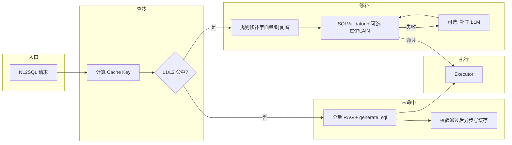

# NL2SQL 缓存实现方案（分层缓存 + 命中后修补）

本文档描述在现有 NL2SQL 链路与综合分析（含 **`analysis_type=overheat_guidance`** 及模板 **`analysis_plan_overheat_guidance`**）之上，引入 **分层缓存** 与 **命中后修补** 的总体设计，用于降低 **`acquire_data`（生成 SQL + 执行）** 耗时，进而缩短流式合成前的首字延迟。

**关联文档**：`docs/NL2SQL系统概要设计.md`（NL2SQL 总体链路）；综合分析数据计划模板见 `configs/prompts.yaml` · `analysis_plan_overheat_guidance`。

### 当前实现摘要（与代码同步）

1. **按时间口径维度的生成期缓存（环境变量开关）**  
   - **L2**：完整问句键（`normalize_nl2sql_question`），适用于「同一 `question` 字节级一致」的重复问询。  
   - **L1**：在时间语义上与 **天（相对日）/ ISO 周（本周·上周）/ 月（本月·上月）/ 近 N 天** 等说法对齐：查找键通过 **`normalize_nl2sql_question_intent`** 折叠上述口径；存储值为 **`extract_time_skeleton_from_sql`** 抽出占位后的 SQL 骨架，命中后按当前问句 **`resolve_time_intent`** 再渲染字面量或 `DATE_SUB`。  
   - **开关**：总开关 **`NL2SQL_CACHE_ENABLED`**；L1 开关 **`NL2SQL_L1_CACHE_ENABLED`**（依赖总开关）；TTL/容量见 **`NL2SQL_CACHE_TTL_SECONDS`**、**`NL2SQL_CACHE_MAX_ENTRIES`**（见 §七 bis、§10.1、`app/app-deploy/.env.example`）。  
   - **查找顺序（单次 `generate_sql` 内）**：先完成 **NL2SQL 专用 RAG**（schema/biz/qa 片段与白名单上下文），再 **L2 → L1**；命中则 **跳过 Prompt 构建与 LLM**，仍走 TiDB/过滤器改写与 **`SQLValidator`**（见 §七）。

2. **校验通过的 SQL + 问题写入 `nl2sql_qa_examples`（与 L2/L1 并列、独立）**  
   - 开启 **`NL2SQL_QA_FEEDBACK_ENABLED`** 后，在 **本轮经 LLM 生成且校验通过**（默认 **`NL2SQL_QA_FEEDBACK_ONLY_FRESH_SQL=true`** 时不包含纯 L2/L1 缓存返回路径）时，将压缩后的问句 + SQL 等 **幂等 upsert** 至向量库命名空间 **`nl2sql_qa_examples`**（元数据含数据源/schema/policy 指纹，检索侧可过滤）。  
   - **运维与 RAG 管理接口**：可通过 **`GET /rag/nl2sql-auto-qa`** 查询系统自动写入条目，**`PATCH /rag/nl2sql-auto-qa`** 按 `doc_name` 删后重建以更新问答内容（见 §七 ter、`app/api/rag_admin.py`）。

---

## 一、目标与范围

### 1.1 目标

- **缩短重复或近似重复问询**下的端到端取数时间：命中 L2/L1 后 **跳过 LLM 生成 SQL**，仍执行 **NL2SQL RAG（片段检索与白名单）**、TiDB/过滤器改写与 **校验后再执行**（首版不因缓存跳过 RAG；减少的是 **大模型写 SQL** 的耗时）。
- **不牺牲正确性**：任何缓存命中结果必须经过 **既有 SQLValidator / 白名单**（及可选 EXPLAIN）再放入执行。
- **可演进**：首版可采用 **纯规则命中 + 规则修补**；后续按需叠加 **向量近似召回** 或 **轻量 SQL 补丁 LLM**。

### 1.2 范围

| 纳入 | 不纳入（首版） |
|------|----------------|
| 直连 **`NL2SQLService.query` / `NL2SQLChain.generate_sql`** 的路径 | 改写合成阶段管线顺序（「先流式后取数」属另一类方案） |
| 综合分析内 **`plan_item_id`（q1～q4）** 维度的分桶缓存 | 跨分析类型通用语义检索平台（可二期） |
| **SELECT** 只读 SQL | INSERT/UPDATE/DELETE |

---

## 二、设计原则

1. **分层存储**：**结构化骨架**（优）与 **可执行 SQL 文本**（次）并存；优先命中骨架以减少「整条 SQL 过时」风险。
2. **命中判定可规则化**：默认使用 **规范化问题文本 + 业务键 + schema 指纹** 的确定性哈希；**不必**为「是否命中」调用对话 LLM。
3. **修补递进**：**规则替换字面量 / 时间窗** → 失败再 **可选** 走短链路补丁 LLM（配置开关）。
4. **版本敏感**：缓存键绑定 **catalog/schema 策略版本**，配置或 DDL 变更自动失效。
5. **失败即降级**：校验或执行失败 → **剔除或降级该条目**，回退现有全量 NL2SQL；禁止持久化「坏 SQL」。

---

## 三、分层缓存模型

### 3.1 L1：结构化查询骨架（Structured Skeleton）

**含义**：与具体字面量无关的「意图级」描述，用于稳定复用。

**当前仓库已实现形态（首版）**：并非下述完整 JSON 血缘模型，而是 **`app/nl2sql/sql_skeleton.py`** 中的 **「时间相关 SQL 模板」**：从已通过校验的 SQL 中抽取 `DATE_SUB(CURDATE(), INTERVAL n DAY)` 与单引号日期/日期时间字面量，替换为占位符形成 **payload（version 1 兼容旧条目 / version 2 当前默认）**；L1 **查找键**使用 **`normalize_nl2sql_question_intent`** 折叠中文时间说法（相对日、本周/上周、本月/上月、近 N 天等，见 §4.2），命中后按 **`resolve_time_intent`** 将占位符渲染回新的字面量或 `DATE_SUB`。超出抽取能力（如跨度 >62 天且无法分类、多组不一致 `DATE_SUB` 间隔等）**不写 L1**。完整「表/JOIN 图骨架」可作为后续演进。

建议字段（中长期参考示例，可按实现裁剪）：

```json
{
  "version": 1,
  "analysis_type": "overheat_guidance",
  "plan_item_id": "q2",
  "tables": ["monitor_hotarea_temp", "account_boiler", "base_temp_point"],
  "join_graph": [
    {"left": "m.boiler_id", "right": "ab.boiler_id", "join_type": "inner"}
  ],
  "select_slots": ["start_time", "end_time", "highest_temp", "limit_temp"],
  "filter_slots": {
    "boiler_id": "${BOILER_ID}",
    "time_range": "${TIME_RANGE_SQL}"
  },
  "schema_fp": "sha256:...",
  "nl2sql_policy_fp": "sha256:..."
}
```

**命中后**：由确定性渲染器或极简模板引擎生成 SQL，再校验执行。

**适用**：表/JOIN 形态高度稳定、变化多在 **WHERE 参数** 的超温子任务（如 q2 运行参数联动）。

### 3.2 L2：可执行 SQL 快照（SQL Snapshot）

**含义**：已通过 **校验**（及可选 EXPLAIN）后的 **完整 SELECT 语句**。

建议关联元数据：

| 字段 | 说明 |
|------|------|
| `sql_normalized` | 规范化空格/注释后的文本，便于比对 |
| `params_extracted` | 若解析出的字面量：机组、起止时间等 |
| `created_at` / `ttl_seconds` | 生命周期 |

**命中后**：先做 **规则修补**（替换日期、`boiler_id` 等已知槽位）；修补失败再降级全量生成。

**适用**：骨架难以抽象但同一用户重复问法完全一致的场景。

---

## 四、缓存键（Cache Key）设计

### 4.1 键组成（建议）

**说明**：实际进程内缓存 **不以 Redis 前缀字符串为 Key**，而是对上述维度拼接字符串再做 **SHA-256（hex）**；逻辑上等价于下表。

| 层级 | 维度 | 说明 |
|------|------|------|
| **L2** | `data_source_fp` | **业务库数据源指纹**（`DB_HOST` + `DB_PORT` + `DB_NAME`；**不按 user_id 分桶**） |
| **L2** | `analysis_type` | 如 `overheat_guidance` |
| **L2** | `plan_item_id` | 综合分析子任务 id：`q1`～`q4`（直连 NL2SQL 可为空） |
| **L2** | 问题文本 | **`normalize_nl2sql_question(question)`**（空白折叠）后的完整 `question`，参与哈希 |
| **L2** | `schema_fp` | 反射表名集合摘要 |
| **L2** | `nl2sql_policy_fp` | Prompt 版本、table_scope、JOIN 白名单、实体规则等环境摘要 |
| **L1** | 同上 | **`data_source_fp`、`analysis_type`、`plan_item_id`、`schema_fp`、`nl2sql_policy_fp` 与 L2 一致** |
| **L1** | 意图文本 | **`normalize_nl2sql_question_intent(question)`**（§4.2 意图折叠），与 L2 **不同** |

**存储 Key 示例（逻辑分解）**：  
`nl2sql_cache:v1:{data_source_fp}:{analysis_type}:{plan_item_id}:{question_norm_fp}:{schema_fp}:{nl2sql_policy_fp}`

其中 **`question_norm_fp`**：L2 为整句规范化文本的哈希；L1 为 **意图折叠后**文本的哈希。

键过长时可对上述片段再做一层 **SHA-256** 作为 Redis field（若未来改为 Redis 存储）。

### 4.2 问题规范化（纯规则，无 LLM）

目的：提高「同一意图、措辞略变」的命中率。

示例规则（可配置）：

- 全半角、空白、标点统一；
- 日期口径统一为 `YYYY-MM-DD`（若在正则可捕获范围内）；
- 机组号、`UNIT-xx` 大小写统一；
- 可选：**停用词表**、业务同义词表（极保守，避免过度合并）。

规范化后的字符串参与 **`question_norm_fp`**。

**L1 专用意图折叠**（与 L2 整句键独立；实现：`app/nl2sql/sql_skeleton.py` · `normalize_nl2sql_question_intent`）：

- 相对日：`大前天` / `前天` / `昨天` / `昨日` / `今天` / `今日` → `<R>`；
- `本周` / `这周` / `上周` → 均折叠为 `<ISO_WEEK>`（命中后由 `resolve_time_intent` 按当前问句区分本周 vs 上周并渲染区间）；
- `本月` → `<MONTH_0>`；`上月` / `上个月` → `<MONTH_-1>`；
- `近\s*(\d+)\s*天` → `<ROLLING_N:N>`（**N 不同则缓存键不同**）；
- 问句语义解析优先级（`resolve_time_intent`）：**近 N 天** → **本周/这周/上周** → **本月** → **上月/上个月** → **相对日词**。

---

## 五、失效策略

| 类型 | 策略 |
|------|------|
| **TTL** | 全局默认 TTL（如 1～24h）；高频变更库可缩短 |
| **版本 bump** | `schema_fp` / `nl2sql_policy_fp` 变更 → 旧键天然 miss |
| **主动剔除** | 校验失败、执行错误、连续修补失败 |
| **运维** | 提供按 `analysis_type` / 前缀 flush（脚本或管理接口） |

---

## 六、命中与未命中流程

### 6.1 总流程（逻辑）



### 6.2 命中后修补（递进）

1. **规则修补（必选实现）**  
   - 基于请求上下文已知字段（如结构化 **`unit_id`**、会话内时间窗）替换 SQL 中对应占位或已知字面量模式。  
   - 时间宏：`DATE_SUB(CURDATE(), INTERVAL 7 DAY)` 等可按策略重写（需与白名单一致）。

2. **校验**  
   - 走现有 **`SQLValidator`**；失败则 **不执行** 本条缓存，进入降级。

3. **可选：补丁 LLM（配置关闭默认 off）**  
   - 输入：旧 SQL + 新问题 + 校验错误摘要；输出：仅修订 SQL；**短 prompt**，严格约束表名列名来自 catalog。

### 6.3 未命中

- 走现有 **`generate_sql`** 全链路（RAG + Prompt + LLM）；**校验通过后**：
  - **同步**写入 **L2**（完整 SQL 文本，进程内 LRU）；
  - 若 **`extract_time_skeleton_from_sql`** 成功且 **`NL2SQL_L1_CACHE_ENABLED`** 为真，**同步**写入 **L1**（骨架 JSON 字符串，独立 LRU；与文档初稿「异步写」不同，当前实现为同线程写入以避免重复生成路径分支）。

---

## 七、与现有代码的集成点（已实现）

| 位置 | 职责 |
|------|------|
| **`app/nl2sql/chain.py`** · **`generate_sql_with_validation_context`** | **单线程顺序**：**NL2SQL RAG 检索片段 → 白名单/`validation_ctx` →（若启用缓存）L2 → L1 →**；未命中再走 Prompt + LLM。命中后仍执行 **`normalize_sql`、TiDB 兼容改写、`_rewrite_query_filters`、`_validate_sql`**；失败则 **delete** 对应缓存条目并降级 |
| **`app/nl2sql/sql_cache.py`** | **`get_nl2sql_sql_cache` / `get_nl2sql_l1_cache`**：两套进程内 **TTL + LRU**（实现类共用 `NL2SQLSqlCache`，存储分区隔离） |
| **`app/nl2sql/sql_skeleton.py`** | L1：**意图键、`extract_time_skeleton_from_sql`、`render_sql_time_skeleton`** |
| **`app/services/nl2sql_service.py`** | 传入 **`plan_item_id` / `analysis_type`**（综合分析子任务聚合至此链路） |
| **`app/llm/graphs/analysis_graph_runner.py`** · **`_run_single_nl2sql_plan_task`** | 组装 **`task.question`**（用户 query + 模板子句），保证 **`plan_item_id`** 参与缓存键 |

**原则**：缓存层对上层透明；**不改变** `AnalysisNL2SQLCall` 对外语义；LangSmith 元数据中 **`sql_cache`**：`hit`（L2）、**`l1_hit`**（L1）。

---

## 七 bis、落地对照摘要（运维速查）

| 项目 | 说明 |
|------|------|
| **总开关** | **`NL2SQL_CACHE_ENABLED=true`** 且 **`get_app_config().db`** 存在时才参与缓存键与后端初始化 |
| **L1 开关** | **`NL2SQL_L1_CACHE_ENABLED`**（默认 `true`）；关闭后仅保留 L2 |
| **查找顺序** | 单次调用内：**NL2SQL RAG 片段检索完成后**再 **L2 → L1**；均未命中则 **Prompt + LLM** |
| **写入条件** | LLM 路径生成 SQL **且校验通过**后写 L2；骨架抽取成功则写 L1 |
| **失效** | TTL 过期、LRU 驱逐、命中后校验/方言失败 **`delete`** |
| **多 worker** | 进程内缓存 **不跨进程**；扩容多副本时缓存命中率为实例本地 |
| **日志关键字** | `NL2SQLChain sql_cache hit`、`NL2SQLChain sql_l1_cache hit`、`stale_or_invalid evict` |

---

## 七 ter、NL2SQL QA 向量闭环（`nl2sql_qa_examples` 自动补充 + 检索侧过滤）

与 **L2/L1 进程内缓存**独立：本能力将 **校验通过** 的「用户问题 + 预制提示摘要 + SQL」**写入默认向量库** 的命名空间 **`nl2sql_qa_examples`**，供后续 RAG 作为 Few-shot 样例召回；并默认按 **数据源指纹**、**schema 指纹**（及可选 **policy / analysis_type**）在检索侧过滤，避免 **跨库 / 换表结构** 时误命中历史样例。

| 项目 | 说明 |
|------|------|
| **实现位置** | `app/nl2sql/qa_feedback.py`（元数据键、过滤规则、幂等 `upsert`、列表/更新辅助）；`NL2SQLRAGService.retrieve` / `retrieve_chunks` 增加 `nl2sql_qa_context`；`NL2SQLChain` 在 **非 L2/L1 缓存短路径** 的 LLM 成功 + 校验通过后 **异步** `upsert`（`asyncio.to_thread`） |
| **元数据** | `ingest_source=auto`、`nl2sql_auto_kind=nl2sql_system_feedback_v1`、`doc_version=auto_v1`，以及 `data_source_fp` / `schema_fp` / `policy_fp` 等（与 `sql_cache.compute_*` 一致） |
| **检索过滤** | `NL2SQL_QA_FILTER_ENABLED=true`（默认）时，对 **仅** `nl2sql_qa_examples` 命中的 chunk 校验上述指纹；无指纹的 **历史人工** QA 由 `NL2SQL_QA_INCLUDE_LEGACY_UNSCOPED`（默认 `true`）控制是否仍进入 Prompt |
| **prefetch** | 过滤会丢掉部分 Top-K，故对 QA 命名空间先放大召回再截断：``NL2SQL_QA_RAG_PREFETCH_MULT``（默认 `4`） |
| **管理面（查询 / 更新问答对）** | **`GET /rag/nl2sql-auto-qa`**：分页列出命名空间 **`nl2sql_qa_examples`** 下系统自动写入的 QA（支持筛选）；**`PATCH /rag/nl2sql-auto-qa`**：按 `doc_name` 指定条目 **删后重建**，用于修正问答文本或 SQL（见 **`app/api/rag_admin.py`**）。底层存储为 **Elasticsearch / EasySearch** 时列表依赖 `metadata.nl2sql_auto_kind` 等字段检索（见 `ElasticsearchVectorStore.metadata_search`）；进程内 Faiss 则为全量扫描 `_items`。 |

**环境变量（另见 `app/app-deploy/.env.example`）**

| 变量 | 含义 | 默认 |
|------|------|------|
| `NL2SQL_QA_FEEDBACK_ENABLED` | `true` 时启用成功后的自动写入 | `false` |
| `NL2SQL_QA_FEEDBACK_ONLY_FRESH_SQL` | `true` 时仅 **本轮走 LLM 生成** 成功后写入（**不**在 L2/L1 缓存直接返回路径写库） | `true` |
| `NL2SQL_QA_FILTER_ENABLED` | 检索时是否对 QA 命名空间做指纹过滤 | `true` |
| `NL2SQL_QA_INCLUDE_LEGACY_UNSCOPED` | 无 `data_source_fp` 的旧人工 QA 是否仍保留在上下文中 | `true` |
| `NL2SQL_QA_RAG_PREFETCH_MULT` | QA 命名空间检索放大系数 | `4` |

配置模型：`app/core/config.py` · `AnalysisConfig.nl2sql_qa_feedback_enabled`（环境变量 `NL2SQL_QA_FEEDBACK_ENABLED`）。

---

## 八、综合分析 · 超温模板（`analysis_plan_overheat_guidance`）

- 模板见 `configs/prompts.yaml`，子任务 **q1～q4** 的 **`question`** 与用户 **`req.query`** 组合后形成最终 NL2SQL 问题串。  
- **缓存必须按 `plan_item_id` 分桶**：同一用户一次分析中，**q1 与 q2 的缓存条目不得混用**。  
- **与依赖关系解耦**：`dependency_ids` 只影响调度顺序；缓存 Key 仍由 **规范化后的完整 task.question** 与 **schema_fp** 决定。  
- **可选优化**：若未来将 q2～q4 改为与 q1 无依赖并行，缓存命中率与 wave 并行可同时受益（调度变更独立于缓存设计）。

---

## 九、安全与多租户

- **禁止**跨租户复用同一条物理 SQL；**Key 必须含租户或数据源指纹**。  
- **可选**：敏感条件下仅缓存 **骨架 L1**，不缓存含具体机组条件的 L2。  
- **审计**：日志中记录 `cache_hit`、`schema_fp`、`plan_item_id`（可与现有 `analysis_request_id` 关联）。

---

## 十、存储选型

| 方案 | 适用 |
|------|------|
| **Redis** | 推荐：TTL、并发好、易横向扩展 |
| **进程内 LRU** | **当前 P0 已落地**（`app/nl2sql/sql_cache.py`）；多 worker 不共享，进程重启失效 |
| **外部文档库** | 二期：向量近似检索（embedding）辅助 L2 候选召回 |

### 10.1 已实现的环境变量（开关与容量）

| 变量 | 含义 | 默认 |
|------|------|------|
| `NL2SQL_CACHE_ENABLED` | `true` 时启用 L2 SQL 快照缓存；`false` 与未实现前行为一致 | `false` |
| `NL2SQL_CACHE_TTL_SECONDS` | 条目 TTL（秒），代码下限 60 | `3600` |
| `NL2SQL_CACHE_MAX_ENTRIES` | 进程内 LRU 上限，代码下限 16 | `512` |
| `NL2SQL_L1_CACHE_ENABLED` | 为 `true` 时启用 **L1 时间骨架**（与 L2 共用 TTL/容量；**总开关**仍为 `NL2SQL_CACHE_ENABLED`） | `true` |
| `NL2SQL_QA_FEEDBACK_ENABLED` | 校验通过后向 **`nl2sql_qa_examples`** 写入自动 QA（与 L2/L1 独立；详见 **§七 ter**） | `false` |

对应配置模型：`app/core/config.py` · `AnalysisConfig.nl2sql_cache_*` / `nl2sql_l1_cache_enabled` / **`nl2sql_qa_feedback_enabled`**。

---

## 十一、监控与验收

- 指标建议：`nl2sql_cache_hit_total`、`nl2sql_cache_miss_total`、`nl2sql_cache_repair_fail_total`、`nl2sql_cache_validation_fail_total`。  
- 验收：**相同规范化 Key 第二次请求**取数阶段耗时显著下降；**错误率**与关闭缓存时对齐（抽样对比）。

---

## 十二、实施阶段建议

| 阶段 | 内容 |
|------|------|
| **P0** | L2 SQL 快照 + 规则 Key + 规则修补 + Validator；Redis TTL；配置开关 |
| **P1** | L1 骨架抽取与渲染；schema/policy 指纹自动化（**已落地首版**：`app/nl2sql/sql_skeleton.py` — 意图键折叠相对日词 + `DATE_SUB`/`'YYYY-MM-DD[ HH:MM:SS]'` 占位与重渲染；与 L2 进程内缓存叠加，lookup 顺序 **L2 → L1 → LLM**） |
| **P2** | 向量近似召回 Top-K + 人工阈值；可选补丁 LLM |
| **（并行）QA 闭环** | **`nl2sql_qa_examples` 自动写入 + 检索指纹过滤**（§七 ter），管理接口 **`GET/PATCH /rag/nl2sql-auto-qa`** |

---

## 十三、修订记录

| 日期 | 版本 | 说明 |
|------|------|------|
| 2026-05-06 | v0.1 | 初稿：分层缓存 + 命中修补 + 集成点与超温模板约束 |
| 2026-05-06 | v0.2 | P0：进程内 L2 + `NL2SQL_CACHE_*` 开关；命中跳过 LLM，仍走规范化与校验 |
| 2026-05-06 | v0.3 | L1 时间骨架落地；§4.1 区分 L2/L1 键；§七～七 bis 集成点与运维速查；§3.1 已实现形态说明 |
| 2026-05-06 | v0.4 | §七 ter：QA 向量闭环（`NL2SQL_QA_*`、`qa_feedback.py`、RAG 检索过滤、`/rag/nl2sql-auto-qa`）；§10.1 增补 `NL2SQL_QA_FEEDBACK_ENABLED` |
| 2026-05-09 | v0.5 | 文首「当前实现摘要」：时间口径（天/周/月/近 N 天）与 L1/L2、环境变量；`nl2sql_qa_examples` 写入与 **`GET`/`PATCH` 管理端**；§七 修正链内顺序（先 NL2SQL RAG，再 L2→L1）；§1.1 澄清命中后仍跑 RAG、仅跳过 LLM |
