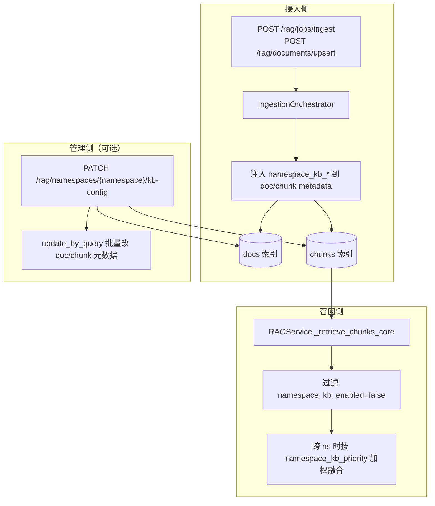

# RAG 基于 namespace 的状态与优先级改造实现方案

> **目标**：在知识摄入时将 `namespace_kb_enabled`、`namespace_kb_priority` 写入文档级与分块级元数据；召回时按启用状态过滤，并在跨 namespace 场景下按优先级（**数字越小越优先**）参与排序。  
> **配套文档**：`framework-guide/RAG整体实现技术说明.md`、`docs/RAG知识库增加图片存储和召回实现方案.md`  
> **文档版本**：v1.1（2026-07-02）｜**代码状态**：**已落地**（见 §8）

---

## 8. 实现状态（已落地）

| 模块 | 路径 | 状态 |
|------|------|------|
| 公共逻辑 | `app/rag/namespace_kb.py` | ✅ |
| 摄入注入 | `IngestionOrchestrator`、`POST /rag/jobs/ingest`、`POST /rag/documents/upsert` | ✅ |
| 召回过滤/优先级 | `RAGService._retrieve_chunks_core` → 全项目委托链路生效 | ✅ |
| 管理 API | `GET /rag/namespaces`、`PATCH /rag/namespaces/{ns}/kb-config` | ✅ |
| 整库清空 | `POST /rag/namespaces/{ns}/purge` | ✅ |
| 单篇删除 | `POST /rag/documents/delete`（保留，与 purge 互补） | ✅ |
| 配置 | `RAG_NAMESPACE_PRIORITY_BOOST`、`RAG_NAMESPACE_PRIORITY_TIERED` | ✅ |
| 测试 | `tests/test_rag_namespace_kb.py`、`tests/test_rag_namespace_purge.py` | ✅ |

**默认分区**：URL 路径参数使用 `__default__`（与 `namespace=null` 等价）。

---

## 1. 需求确认（已定稿）

| 项 | 约定 |
|----|------|
| 启用字段 | `namespace_kb_enabled`（`bool`） |
| 优先级字段 | `namespace_kb_priority`（`int`，**数值越小优先级越高**） |
| 作用域 | 针对 **namespace**（同一 namespace 下所有文档、切块使用相同值） |
| 摄入来源 | **接口入参**，不建 namespace 配置表 |
| 默认值 | 未传时：`namespace_kb_enabled=true`，`namespace_kb_priority=1` |
| 历史数据 | **不考虑回填**，全量重新摄入 |
| 召回范围 | 在 `RAGService` 公共封装中实现，全项目 RAG 召回生效 |

### 1.1 与现有 `status` 字段的区分

docs 索引已有 `status` 表示**摄入结果**（`SUCCESS` / `FAILED`），与本需求的「知识库启用」无关。本方案统一使用 `namespace_kb_enabled` / `namespace_kb_priority`，避免语义冲突。

---

## 2. 总体架构



**元数据落点**：

| 层级 | 存储位置 | 字段 |
|------|----------|------|
| 文档 | docs 索引 `metadata`（或顶层冗余字段） | `namespace_kb_enabled`、`namespace_kb_priority` |
| 分块 | chunks 索引 `metadata` | `namespace_kb_enabled`、`namespace_kb_priority` |

召回以 **chunk `metadata`** 为准（ES `term` 过滤 + 后处理加权）；docs 索引字段供管理台展示与 PATCH 时遍历。

---

## 3. 实现 / 修改项清单

### 3.1 API 层（`app/api/rag_admin.py`）

| # | 修改项 | 实现策略 |
|---|--------|----------|
| 1 | `IngestionJobDocumentRequest` 增加可选字段 | 新增 `namespace_kb_enabled: bool \| None = None`、`namespace_kb_priority: int \| None = None`；Swagger description 说明 namespace 级语义与默认值 |
| 2 | `UpsertDocumentRequest` 同步增加同上字段 | 与异步摄入保持一致 |
| 3 | 请求 example / 文档注释更新 | example 中补充字段示例；强调同 namespace 应传一致值 |
| 4 | **（建议）** `PATCH /rag/namespaces/{namespace}/kb-config` | ✅ 已实现 |
| 5 | **（建议）** `GET /rag/namespaces` | ✅ 已实现 |

**入参解析默认值**（建议在 orchestrator 或统一 helper 中处理，避免 API 与 sync 路径不一致）：

```python
def resolve_namespace_kb_fields(
    enabled: bool | None,
    priority: int | None,
) -> tuple[bool, int]:
    return (
        True if enabled is None else bool(enabled),
        1 if priority is None else int(priority),
    )
```

---

### 3.2 数据模型（`app/rag/models.py`）

| # | 修改项 | 实现策略 |
|---|--------|----------|
| 6 | `DocumentSource` 增加字段 | `namespace_kb_enabled: bool = True`、`namespace_kb_priority: int = 1` |
| 7 | API → `DocumentSource` 映射 | `submit_job` / `upsert` 构造 `DocumentSource` 时传入解析后的值 |

---

### 3.3 摄入编排（`app/rag/ingestion_orchestrator.py`）

| # | 修改项 | 实现策略 |
|---|--------|----------|
| 8 | 索引前注入 chunk metadata | ✅ `build_chunk_metadatas()`：`doc.metadata` 合并后 **API 字段 `ns_kb` 最后覆盖** |
| 9 | `_save_doc_record` 写入 docs 索引 | `payload["metadata"]` 合并 `namespace_kb_enabled`、`namespace_kb_priority`；或增加顶层字段便于聚合查询 |
| 10 | 失败文档记录 | `status=FAILED` 的 doc 记录同样写入 namespace_kb_*，便于管理台展示 |

---

### 3.4 同步摄入路径（`app/api/rag_admin.py` → `build_chunks_for_document` 链路）

| # | 修改项 | 实现策略 |
|---|--------|----------|
| 11 | `POST /rag/documents/upsert` | 与 orchestrator 共用同一注入逻辑；建议抽取 `inject_namespace_kb_metadata(doc, chunks)` 到 `app/rag/namespace_kb.py`（或 `document_pipeline/enrichers.py`）避免双份实现 |

---

### 3.5 向量写入（`app/rag/ingestion.py`、`app/rag/vector_store.py`）

| # | 修改项 | 实现策略 |
|---|--------|----------|
| 12 | `ingest_texts` | 无需改签名；`metadatas` 已含 `namespace_kb_*`，随 `add_texts` 写入 ES |
| 13 | ES mapping | `metadata` 为 dynamic object，`namespace_kb_enabled` / `namespace_kb_priority` 自动映射；若需显式聚合可在 index template 增加 `metadata.namespace_kb_priority` 为 `integer` |
| 14 | InMemory / FAISS 后端 | 元数据随 `metadata` 字典存储，无额外改动 |

---

### 3.6 Namespace 配置修改（管理 API，对应原需求 §3）

| # | 修改项 | 实现策略 |
|---|--------|----------|
| 15 | `ElasticsearchVectorStore.update_namespace_kb_config` | 新增方法：对 chunks 索引 `update_by_query`，painless 脚本更新 `metadata.namespace_kb_enabled`、`metadata.namespace_kb_priority`；`query` 为 `term namespace`（含默认分区 `null`/`""` 的 bool should，复用 `reassign_namespace_for_doc` 写法） |
| 16 | `DocumentRepository.update_namespace_kb_config` | 对 docs 索引同样 `update_by_query` 更新 `metadata` 内字段 |
| 17 | 大 namespace 异步化 | chunk 数超过阈值（如 1 万）时提交后台 job，返回 `job_id`；复用 `IngestionJobQueue` 或轻量 task 表 |
| 18 | 其他 VectorStore 实现 | InMemory/FAISS：内存遍历 patch；与 ES 行为对齐 |

**无配置表说明**：修改后**以 ES 中 doc/chunk 元数据为事实来源**；前端改 namespace 后必须走 PATCH 批量更新，或对该 namespace 全量重新摄入。

**无配置表说明**：修改后**以 ES 中 doc/chunk 元数据为事实来源**；前端改 namespace 后走 PATCH 批量更新，或对该 namespace 全量重新摄入。

### 3.7 按 namespace 整库清空（已实现）

| # | 修改项 | 实现 |
|---|--------|------|
| 19 | `POST /rag/namespaces/{namespace}/purge` | 删除该 namespace 全部 chunk + docs 登记；`confirm=true` 必填 |
| 20 | `VectorStore.delete_by_namespace` | InMemory / FAISS / ES 三后端 |
| 21 | `DocumentRepository.delete_by_namespace` | docs 索引 `delete_by_query` |
| 22 | `RAGIngestionService.delete_by_namespace` | 逐篇清理 figure / GraphRAG 后删索引 |

与 `POST /rag/documents/delete`（单 `doc_name`）互补。

---

### 3.8 召回公共封装（`app/rag/rag_service.py`）— **核心**

| # | 修改项 | 实现策略 |
|---|--------|----------|
| 19 | ES 查询层过滤 `namespace_kb_enabled` | 扩展 `VectorStore` 三路检索 `similarity_search_by_vector` / `keyword_search` / `metadata_search`，增加可选参数 `metadata_filters: dict \| None`；ES bool query `filter` 追加 `{"term": {"metadata.namespace_kb_enabled": true}}` |
| 20 | 指定 `namespace` 检索 | 仍传 `namespace` term；叠加 `namespace_kb_enabled=true` filter；若该 ns 下 chunk 均为 `false`，自然返回空 |
| 21 | **未指定 `namespace`（全库检索）** | 同上 filter 排除所有禁用 chunk；再按 priority 融合（见下） |
| 22 | 优先级融合（跨 namespace） | 在 RRF 融合后、CrossEncoder 重排前（或重排后二次排序，可配置）：`adjusted_score = base_score - β * (priority - 1)`（**priority 越小越优先，故用减号**）；`β` 由环境变量 `RAG_NAMESPACE_PRIORITY_BOOST` 控制（默认如 `0.05`），避免压过语义相关性 |
| 23 | 单 namespace 检索 | 该 ns 内 priority 相同，**不做** priority 重排，仅做 enabled 过滤 |
| 24 | `exclude_namespaces` 兼容 | 保持现有后过滤逻辑；与 `namespace_kb_enabled` 过滤叠加 |
| 25 | `retrieve_context` / `retrieve_chunks` | 仅委托 `_retrieve_chunks_core`，改一处即可 |
| 26 | `HybridRAGService` / `AgenticRAGService` | 均委托 `RAGService`，无需单独改召回逻辑；GraphRAG 侧若按 namespace 查询，禁用 ns 应在图查询入口跳过 |

**跨 namespace 优先级（可选增强）**：当 `namespace=None` 且开启 `RAG_NAMESPACE_PRIORITY_TIERED=true` 时，按 distinct `namespace_kb_priority` 升序分层召回（先 priority=1 的 ns 填满 top_k，不足再 priority=2…）；默认关闭，使用 §22 加权即可。

---

### 3.9 特殊召回路径审计

| # | 修改项 | 实现策略 |
|---|--------|----------|
| 27 | `NL2SQLRAGService.retrieve_chunks` | 内部循环 `self._rag.retrieve_chunks(namespace=ns)`，自动继承 `RAGService` 过滤；确认 `nl2sql_*` namespace 摄入时写入正确默认值 |
| 28 | `qa_feedback.fetch_nl2sql_qa_chunks_by_slot` | 直查 VectorStore 的路径需手动加 `namespace_kb_enabled` 过滤，或统一走 `RAGService` |
| 29 | `figure_retrieval_expand.expand_related_figures` | 扩展拉取的 figure chunk 若 `namespace_kb_enabled=false`，应跳过 |
| 30 | `POST /rag/query` 调试接口 | 无需新参；行为随 `RAGService` 变更自动生效 |

---

### 3.10 配置与环境变量（`app/core/config.py`、`app/app-deploy/.env.example`）

| # | 修改项 | 实现策略 |
|---|--------|----------|
| 31 | `RAG_NAMESPACE_PRIORITY_BOOST` | float，RRF/重排分上 priority 加权系数 β |
| 32 | `RAG_NAMESPACE_PRIORITY_TIERED` | bool，是否启用分层召回（默认 `false`） |
| 33 | `.env.example` 注释 | 补充上述变量说明 |

---

### 3.11 测试

| # | 修改项 | 实现策略 |
|---|--------|----------|
| 34 | `tests/test_rag_namespace_kb.py`（新建） | 覆盖：默认值注入、禁用 ns 召回为空、跨 ns priority 排序、PATCH 批量更新 |
| 35 | 扩展现有 `tests/test_metadata_recall.py` | VectorStore `metadata_filters` 参数 |
| 36 | E2E | 扩展 `app/test_scripts/rag/rag_doc_lifecycle_e2e.py`：摄入带 `namespace_kb_enabled=false` 后 query 无结果 |

---

## 4. 关键实现细节

### 4.1 同 namespace 多文档入参不一致

无配置表时，若同一 namespace 不同请求传入不同 `namespace_kb_*`：

- **摄入时**：以**当前文档**传入值写入该文档及其 chunks（会出现同 ns 不同 doc 元数据不一致）。
- **约定**：运维 / 前端应保证同 namespace 传相同值；若已不一致，以 **PATCH 批量更新** 或 **全量重灌** 纠正。

### 4.2 默认 namespace（`null` / `""`）

与现有逻辑一致：存储与查询时默认分区用 `None`；`update_by_query` 使用与 `delete_by_doc_name` 相同的 bool should（`must_not exists` + `term ""`）。

### 4.3 优先级语义示例

| namespace | namespace_kb_priority | 含义 |
|-----------|----------------------|------|
| `Power_plant_knowledge` | 1 | 最高优先 |
| `事故案例` | 2 | 次之 |
| `hr` | 10 | 较低 |

全库检索时，在相关性接近的情况下，priority=1 的 chunk 应排在 priority=10 之前。

### 4.4 推荐抽取的公共函数

建议在 `app/rag/namespace_kb.py` 集中：

```python
NS_KB_ENABLED_KEY = "namespace_kb_enabled"
NS_KB_PRIORITY_KEY = "namespace_kb_priority"

def resolve_namespace_kb_fields(enabled, priority) -> tuple[bool, int]: ...
def build_namespace_kb_metadata(enabled, priority) -> dict: ...
def chunk_passes_kb_enabled_filter(metadata: dict) -> bool: ...
def apply_priority_score_adjustment(score: float, metadata: dict, beta: float) -> float: ...
```

---

## 5. 实施顺序建议

| 阶段 | 内容 | 依赖 |
|------|------|------|
| **P0** | 模型 + API 字段 + 摄入注入 + `_save_doc_record` | — |
| **P1** | `VectorStore` metadata filter + `RAGService` enabled 过滤 | P0 |
| **P2** | 跨 namespace priority 加权 / 分层召回 | P1 |
| **P3** | PATCH 批量更新 API + `update_by_query` | P0 |
| **P4** | 测试 + E2E + `.env.example` | P1–P3 |

---

## 6. 不在本方案范围内

- 历史数据回填（已确认全量重灌）
- Namespace 配置表 / 独立注册中心
- GraphRAG 节点上的 priority 属性（若图侧无 chunk 元数据，仅向量召回路径生效）
- 摄入接口以外自动推断 priority（如按 dataset_id）

---

## 7. 验收要点

1. 摄入不传字段时，chunk `metadata.namespace_kb_enabled=true`、`metadata.namespace_kb_priority=1`。
2. `namespace_kb_enabled=false` 的 namespace，任意 scene 下 `retrieve_chunks` 无命中。
3. 全库检索（`namespace=None`）时，禁用 namespace 不参与结果；启用 namespace 间小 priority 更靠前（在 β 调参合理时）。
4. PATCH 修改 namespace 后，该 ns 下所有 docs/chunks 元数据一致更新，召回行为即时变化。
5. `HybridRAGService`、`NL2SQLRAGService`、chatbot 主链路无需改调用方代码即可生效。
6. `POST /rag/namespaces/{namespace}/purge`（`confirm=true`）清空该 namespace 全部数据；`POST /rag/documents/delete` 仍为单篇删除。
