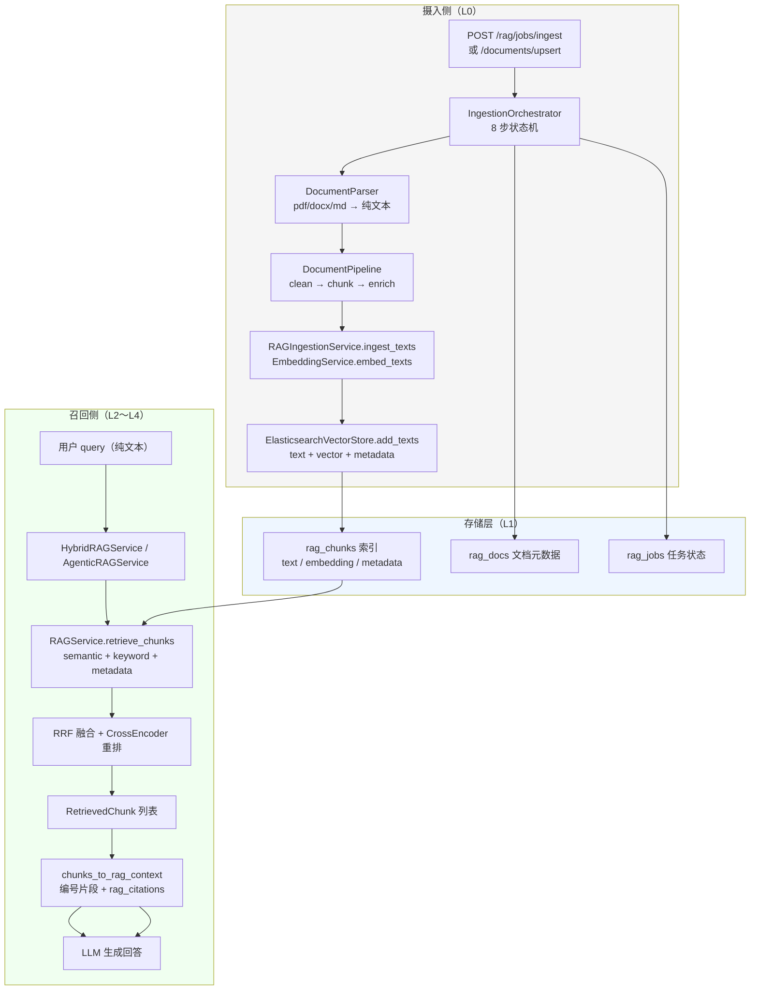
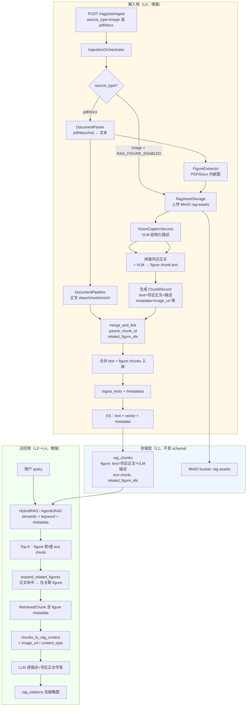
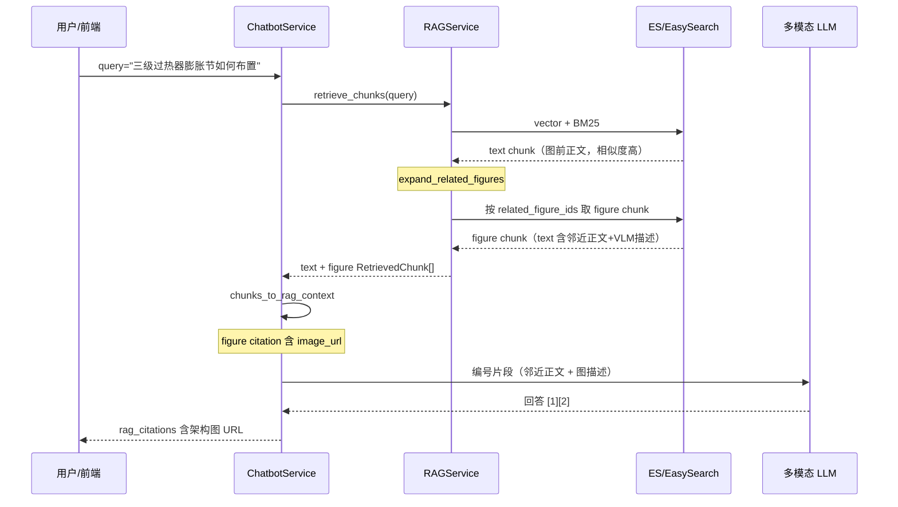
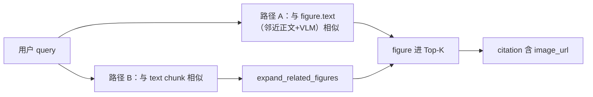

# RAG 知识库增加图片存储与召回实现方案

> **方案选型**：VLM 语义描述 + 文本向量（企业落地首选）  
> **配置**：`RAG_FIGURE_ENABLED` 主开关 + 若干 **`RAG_FIGURE_*` 可调参数**（均有默认值），详见 §4。  
> **目标**：在**不更换现有文本嵌入模型与 ES/EasySearch 索引结构**的前提下，支持图片、图纸等非文本知识资产的**单独入库、与正文关联、文本召回命中后回传图片**。  
> **配套文档**：`framework-guide/RAG整体实现技术说明.md`、`docs/MinerU-RAG-技术方案与实施清单.md`、`enterprise-level_transformation_docs/企业级 RAG 文档摄入与检索一体化改造设计稿-20260327.md`、`docs/RAG基于namespace的状态和优先级的改造实现方案.md`  
> **文档版本**：v1.4（2026-06-29）｜**代码状态**：阶段 1～4 已落地，见 §13

---

## 1. 背景与现状

### 1.1 能力总览（`RAG_FIGURE_ENABLED=true` 时）

| 环节 | 实现位置 | 现状 |
|------|----------|------|
| 摄入入口 | `POST /rag/jobs/ingest`、`POST /rag/documents/upsert` | 支持 text/md/html/pdf/docx/xlsx/**image** |
| 统一切块 | `app/rag/document_pipeline/ingest_document.py` | `build_chunks_for_document`：正文 + figure 合并 |
| 编排 | `app/rag/ingestion_orchestrator.py` | 8 步；`image` 走 `vision_caption`；figure 指标写入 job.metrics |
| 独立图 | `figure_pipeline.py` | MinIO 存图 + VLM/`manual_caption`/`description` → figure chunk |
| 内嵌图 | `figure_extractor.py` + `figure_link.py` | Markdown/MinerU PDF、Docx 抽图；`merge_and_link` |
| 存储 | `asset_storage.py` + ES | `text` + vector + `metadata.image_url`（无 Base64） |
| 召回 | `rag_service.py` + `figure_retrieval_expand.py` | 混合检索后 **expand_related_figures**（缓解 1） |
| 引用 | `chatbot_rag_citations.py` | `content_type=figure`、`image_url`、`asset_type` |
| 扫描 PDF | `mineru_ingest.py` + `mineru_response_parse.py` | MinerU → Markdown；zip/磁盘 **images/** + `mineru_image_base` |
| 查询增强 | `query_vision_augment.py` | 可选 `query_image_url`（`RAG_QUERY_VISION_AUGMENT_*`） |
| 运维 | `GET /rag/assets/presign` | 预签名 URL 刷新；删文档联动 MinIO 前缀 |
| namespace 治理 | `GET/PATCH /rag/namespaces/*`、`POST .../purge` | kb 启用/优先级；整库清空（见 namespace 改造方案） |

### 1.1.1 基线能力（`RAG_FIGURE_ENABLED=false`，与现网一致）

| 环节 | 说明 |
|------|------|
| 摄入 | text/md/html/pdf/docx/xlsx；**不**抽内嵌图、**拒绝** `source_type=image`（`E_FIGURE_DISABLED`） |
| 召回 | 不执行 `expand_related_figures` |
| 索引 schema | 不变（figure 仍为普通 text chunk + metadata） |

### 1.2 原缺口（v1.0）与当前状态

| 原缺口 | 状态 |
|--------|------|
| 无 `source_type=image` / VLM 步骤 | ✅ 已实现 |
| PDF/Docx 内嵌图未单独索引 | ✅ 已实现（需开 `RAG_FIGURE_ENABLED`） |
| 无 figure↔正文双向关联与 expand | ✅ `merge_and_link` + `expand_related_figures` |
| 漏召（问法像图前正文） | ✅ 缓解 1+2；Docx 按段落顺序 `[FIG:n]` 锚点截取邻近正文 |
| `rag_citations` 无 `image_url` | ✅ 已实现 |
| 图片未统一 MinIO | ✅ `RagAssetStorage`（bucket：`RAG_FIGURE_MINIO_BUCKET`） |

### 1.3 设计原则

1. **图块在索引层仍是 text chunk**：可检索字段为 VLM 生成的描述文本，图片只存对象存储 + metadata URL。  
2. **不存 Base64 进 ES**：metadata 仅保存 `image_url` / `image_object_key`。  
3. **关联靠 metadata + 文档主键**：`doc_name`、`section_path`、`parent_chunk_id`、`related_figure_ids` 等，不引入新索引类型。  
4. **双路径防漏召（缓解 1+2，§5.4）**：figure chunk 的 `text` **拼接邻近正文**（摄入侧）；正文 chunk 命中时 **扩展关联 figure**（召回侧）。  
5. **分阶段交付**：先独立图片文档（MVP），再 PDF/Docx 内嵌图（含图—文关联与召回扩展），最后可选查询侧多模态增强。  
6. **配置**：主开关 + 可调参数均走 **环境变量**（`RAG_FIGURE_*`，带默认值与 `.env` 注释）；MinIO 连接与 VLM 模型仍复用现有配置。

---

## 2. 方案概述

### 2.1 核心思路

```
【摄入】图片/图纸 → MinIO → 取图前/后邻近正文 + VLM 描述 → 拼入 figure chunk.text → 向量化
                              → image_url、parent_chunk_id、related_figure_ids 写入 metadata
                              → 正文 text chunk.metadata.related_figure_ids 反向指向 figure

【召回】用户 query → 语义/BM25 检索
        路径 A：query 与 figure chunk.text（含邻近正文+描述）相似 → 直接命中 figure
        路径 B：query 与正文相似、与 VLM 描述相似度低 → 命中 text chunk
                → expand_related_figures(related_figure_ids) → 并入关联 figure chunk
        → LLM 读编号片段作答 → rag_citations 带 image_url
```

**为何需要路径 A+B（§5.4）**：用户问法常接近图前说明文字（「膨胀节如何布置」），而与 VLM 视觉描述（「图中 A/B 管排箭头…」）相似度偏低；仅依赖 figure 描述向量易漏图，需邻近正文入库 + 正文命中后扩展 figure。

### 2.2 与「纯多模态向量」对比

| 方案 | 成本 | 适用 |
|------|------|------|
| **VLM 描述 + 文本向量（本方案）** | 低，复用现有栈 | 架构图、流程图、规程附图、说明性图纸 |
| CLIP 图文联合 embedding | 需新模型与双塔检索 | 以图搜图、视觉相似 |
| 查询时把候选图送 VLM rerank | 延迟与 token 成本高 | Top-3 精排（可选阶段 4） |

---

## 3. 链路逻辑图

### 3.1 原有链路（仅文本）



**要点**：全链路数据形态为**字符串**；PDF 扫描经 MinerU 转 Markdown 后仍只索引文字，图片引用 `` 不会变成可召回的图块节点。

---

### 3.2 增强链路（VLM 描述 + 文本向量 + 图片 metadata）



**要点**：

- figure chunk 的 **`text` = 邻近正文摘要 + VLM 描述**（缓解 2，§5.4.2），向量/BM25 可同时匹配用户问法与图说明。  
- 正文 text chunk 写入 **`related_figure_ids`**；召回后对 Top-K 正文做 **`expand_related_figures`**（缓解 1，§5.4.3），避免「只命中文字、不带图」。  
- PDF/Docx 产生 **text + figure 两类 chunk**，经 `merge_and_link` 建立双向关联。

---

### 3.3 召回时序（智能客服示例）



---

## 4. 配置项

图块摄入是 **「上传资产 → VLM 描述 → 当 text chunk 入库」** 一条链路：  
- **主开关**对齐 `MINERU_ENABLED`，一个 env 管整条 figure 管线；  
- **VLM / 邻近正文 / 召回扩展** 等细项从原「代码内常量」改为 **`RAG_FIGURE_*` 环境变量**，默认值与现设计一致，**不配 env 也能跑**；  
- `.env.example` 中集中一段并附**简短中文注释**，便于运维调参。

### 4.1 主开关与存储

| 变量 | 默认值 | 必填 | 说明 |
|------|--------|------|------|
| **`RAG_FIGURE_ENABLED`** | `false` | 是 | 图块能力总开关。`true`：MinIO 存图 + VLM 描述 + figure chunk 入库 +（阶段 2）召回扩展；`false`：见 §4.5 |
| **`RAG_FIGURE_MINIO_BUCKET`** | `rag-assets` | 否 | 知识库图片 bucket，与 `chatbot-images` 分离 |

### 4.2 复用现有配置（不新增 env）

| 能力 | 复用来源 | 说明 |
|------|----------|------|
| MinIO 连接 | `CHATBOT_IMAGE_MINIO_ENDPOINT` / `ACCESS_KEY` / `SECRET_KEY` / `SECURE` 等 | 与客服图片同一集群，仅 bucket 不同 |
| 存储后端 | `CHATBOT_IMAGE_STORAGE_BACKEND` | `minio` / `local`，`RagAssetStorage` 与客服逻辑一致 |
| 多模态模型 | 应用默认 VLM 基座（vLLM） | 与看图诊断、客服 vision 共用，**不单独配 `RAG_FIGURE_*_MODEL`** |
| LLM 超时 | 全局 LLM / vLLM 客户端超时 | 不单独暴露 figure 专用 timeout env |

### 4.3 可调参数（环境变量）

以下变量写入 `app/app-deploy/.env.example`（及部署用 `.env`），**均有默认值**；一般环境保持默认即可，仅在描述质量、召回扩展量、URL 有效期需调优时修改。

| 变量 | 默认值 | 说明 |
|------|--------|------|
| **`RAG_FIGURE_CAPTION_PROMPT_VERSION`** | `rag_figure_caption_v1` | VLM 描述用的 prompt 模板版本（对应 `configs/prompts_bak_new.yaml`） |
| **`RAG_FIGURE_CAPTION_MAX_TOKENS`** | `2048` | 单张图 VLM 描述最大 token 数 |
| **`RAG_FIGURE_CAPTION_TEMPERATURE`** | `0.2` | VLM 描述温度；越低越稳定，越高越发散 |
| **`RAG_FIGURE_PRESIGN_TTL_SECONDS`** | `86400` | MinIO 预签名 URL 有效期（秒）；知识库图建议长于客服会话图（900s） |
| **`RAG_FIGURE_OBJECT_KEY_PREFIX`** | `rag-assets/` | 对象 key 路径前缀，便于按文档分目录 |
| **`RAG_FIGURE_NEIGHBOR_TEXT_MAX_CHARS`** | `400` | 缓解 2：拼入 figure chunk.text 的「图前+图后」邻近正文总字符上限 |
| **`RAG_FIGURE_NEIGHBOR_TEXT_BEFORE_RATIO`** | `0.7` | 邻近正文预算中「图前」占比（0～1），其余分给图后 |
| **`RAG_FIGURE_EXPAND_MAX_PER_TEXT`** | `2` | 缓解 1：单条正文 chunk 命中后，最多扩展几张关联 figure |
| **`RAG_FIGURE_EXPAND_MAX_TOTAL`** | `6` | 缓解 1：单次 `retrieve_chunks` 扩展 figure 的总数上限 |

**.env 示例（含注释，建议原样放入 `.env.example`）**：

```bash
# ---------- RAG 知识库图块（figure）----------
# 总开关：false=不存图、不 VLM、不扩展；true=完整 figure 管线（阶段 1 起）
RAG_FIGURE_ENABLED=false
# 知识库图片 bucket（与 CHATBOT_IMAGE_MINIO_BUCKET 分离）
RAG_FIGURE_MINIO_BUCKET=rag-assets

# VLM 生成图描述
RAG_FIGURE_CAPTION_PROMPT_VERSION=rag_figure_caption_v1
RAG_FIGURE_CAPTION_MAX_TOKENS=2048
RAG_FIGURE_CAPTION_TEMPERATURE=0.2

# MinIO 对象路径与链接有效期
RAG_FIGURE_OBJECT_KEY_PREFIX=rag-assets/
RAG_FIGURE_PRESIGN_TTL_SECONDS=86400

# 缓解 2（摄入）：图前/图后正文拼入 figure chunk，降低「问法像正文、不像图描述」漏召
RAG_FIGURE_NEIGHBOR_TEXT_MAX_CHARS=400
RAG_FIGURE_NEIGHBOR_TEXT_BEFORE_RATIO=0.7

# 缓解 1（召回）：正文 chunk 命中后，按 related_figure_ids 扩展关联 figure
RAG_FIGURE_EXPAND_MAX_PER_TEXT=2
RAG_FIGURE_EXPAND_MAX_TOTAL=6

# 查询侧多模态增强（与 RAG_FIGURE_ENABLED 独立）
RAG_QUERY_VISION_AUGMENT_ENABLED=false
RAG_QUERY_VISION_AUGMENT_MODE=vision_augmented
```

### 4.4 `config.py` 映射

在 **`RAGIngestionConfig`** 上扩展字段（不必单独 `RAGVisionCaptionConfig` dataclass）：

```python
@dataclass
class RAGIngestionConfig:
    # ... 现有字段 ...
    figure_enabled: bool = False
    figure_minio_bucket: str = "rag-assets"
    figure_caption_prompt_version: str = "rag_figure_caption_v1"
    figure_caption_max_tokens: int = 2048
    figure_caption_temperature: float = 0.2
    figure_presign_ttl_seconds: int = 86400
    figure_object_key_prefix: str = "rag-assets/"
    figure_neighbor_text_max_chars: int = 400
    figure_neighbor_text_before_ratio: float = 0.7
    figure_expand_max_per_text: int = 2
    figure_expand_max_total: int = 6
```

`_load_from_env()` 加载示例（注释与 env 名一一对应）：

```python
figure_enabled=os.getenv("RAG_FIGURE_ENABLED", "false").lower() == "true",
figure_minio_bucket=(os.getenv("RAG_FIGURE_MINIO_BUCKET") or "rag-assets").strip(),
figure_caption_prompt_version=(
    os.getenv("RAG_FIGURE_CAPTION_PROMPT_VERSION") or "rag_figure_caption_v1"
).strip(),
figure_caption_max_tokens=max(256, int(os.getenv("RAG_FIGURE_CAPTION_MAX_TOKENS", "2048"))),
figure_caption_temperature=max(0.0, min(1.0, float(os.getenv("RAG_FIGURE_CAPTION_TEMPERATURE", "0.2")))),
figure_presign_ttl_seconds=max(60, int(os.getenv("RAG_FIGURE_PRESIGN_TTL_SECONDS", "86400"))),
figure_object_key_prefix=(os.getenv("RAG_FIGURE_OBJECT_KEY_PREFIX") or "rag-assets/").strip(),
figure_neighbor_text_max_chars=max(64, int(os.getenv("RAG_FIGURE_NEIGHBOR_TEXT_MAX_CHARS", "400"))),
figure_neighbor_text_before_ratio=max(0.0, min(1.0, float(os.getenv("RAG_FIGURE_NEIGHBOR_TEXT_BEFORE_RATIO", "0.7")))),
figure_expand_max_per_text=max(0, int(os.getenv("RAG_FIGURE_EXPAND_MAX_PER_TEXT", "2"))),
figure_expand_max_total=max(0, int(os.getenv("RAG_FIGURE_EXPAND_MAX_TOTAL", "6"))),
```

业务代码通过 `get_app_config().rag.ingestion` 读取，**不要**在模块内硬编码上述默认值。

### 4.5 开关行为

| `RAG_FIGURE_ENABLED` | 行为 |
|----------------------|------|
| `false`（默认） | `source_type=image` 请求返回明确错误（如 `E_FIGURE_DISABLED`）；PDF/Docx **仅文本**，与现网一致 |
| `true` | 执行完整 figure 管线：**存储 + VLM 描述**（二者绑定，无「只存不描述」子开关） |

**无需 env、由业务数据驱动的例外**（代码约定）：

| 场景 | 行为 |
|------|------|
| `content` 已是 `http(s)://` 可访问图链 | **跳过重复上传**，直接写 `metadata.image_url`，仍走 VLM（除非有 manual caption / description） |
| 请求带 `metadata.manual_caption` | **跳过 VLM**，`chunk.text` 用人工描述，`caption_source=manual` |
| 请求带 `description`（无 `manual_caption`） | **跳过 VLM**，`description` 作为 figure 描述文本，`caption_source=manual` |
| 请求带 `metadata.manual_context` | 作为 VLM 上下文或 manual 路径下的【邻近正文-前】；**不**单独触发跳过 VLM |
| VLM 调用失败 | 占位描述 + `caption_source=failed`；全部文档成功但存在失败 caption 时 job 可为 `PARTIAL`（`FIGURE_CAPTION_DEGRADED`） |

**不单独配置的来源类型**：独立图（`source_type=image`）与 PDF/Docx 内嵌图（阶段 2）**共用** `RAG_FIGURE_ENABLED`，由 `source_type` 与 orchestrator 分支决定，不再设 `STANDALONE` / `EMBEDDED` 开关。

### 4.6 查询侧（阶段 4，与摄入分离）

用户**提问时带图**、增强 RAG query 属于在线推理，**不合并进 `RAG_FIGURE_ENABLED`**：

| 变量 | 默认值 | 说明 |
|------|--------|------|
| **`RAG_QUERY_VISION_AUGMENT_ENABLED`** | `false` | 查询时附图增强 RAG；与 `RAG_FIGURE_*` 独立 |
| **`RAG_QUERY_VISION_AUGMENT_MODE`** | `vision_augmented` | `vision_augmented`：VLM 描述附图后增强 query；`hybrid`：原 query + 增强 query 双路合并去重 |

### 4.7 刻意不暴露的配置

以下项**不建议**作为 env，避免配置膨胀：

| 不暴露项 | 处理方式 |
|----------|----------|
| `RAG_VISION_CAPTION_ENABLED` / `RAG_ASSET_STORAGE_ENABLED` | 并入 `RAG_FIGURE_ENABLED` |
| `RAG_FIGURE_STANDALONE_*` / `RAG_FIGURE_EMBEDDED_*` | 由 `source_type` 决定 |
| MinIO endpoint / 密钥 / backend | 复用 `CHATBOT_IMAGE_*` |
| `RAG_VISION_CAPTION_MODEL` / 独立 VLM 模型 env | 走默认多模态基座 |
| `public_path` / `local_store_dir`（RAG 专用） | 与客服共用 `CHATBOT_IMAGE_*` 路径约定，或代码内按 backend 推导 |

---

## 5. 数据模型

### 5.1 Figure Chunk metadata 约定

每个图块在 ES 中仍为一条 chunk 文档；**`text` = 邻近正文 + VLM 描述**（§5.4.2），`metadata` 扩展如下：

| 字段 | 类型 | 必填 | 说明 |
|------|------|------|------|
| `content_type` | string | 是 | figure chunk 固定 `figure`；正文 chunk 为 `text` 或省略 |
| `image_url` | string | 是（figure） | 可访问 URL（MinIO 预签名或网关静态路径） |
| `image_object_key` | string | 推荐 | MinIO object key，便于删除与换签 |
| `asset_type` | string | 否 | `architecture_diagram` / `flowchart` / `cad` / `photo` |
| `figure_index` | int | 否 | 文档内序号 |
| `parent_doc_name` | string | 推荐 | 所属逻辑文档名 |
| `parent_section_path` | string | 否 | 如 `3.2 总体架构` |
| `parent_chunk_id` | string | 推荐（内嵌图） | figure → 最近邻正文 chunk UUID（图前优先） |
| `neighbor_text_before` | string | 否 | 图前截取原文（审计/调试；与拼入 text 一致） |
| `neighbor_text_after` | string | 否 | 图后截取原文 |
| `related_figure_ids` | string[] | 否 | **正文 chunk** 反向引用关联 figure 的 `chunk_id`（缓解 1 必需） |
| `caption_source` | string | 否 | `vlm` / `alt_text` / `manual` |
| `vlm_model` | string | 否 | 描述所用模型名 |
| `source_uri` | string | 否 | 原文档溯源（与现有一致） |

### 5.2 figure chunk.text 格式（邻近正文 + VLM 描述）

**缓解 2**：将向量化字段扩展为「图前/图后邻近正文 + VLM 描述」，使用户问法更接近图前说明时仍能直接命中 figure chunk。

```text
【邻近正文-前】三级过热器膨胀节布置如下图所示，应注意预留热膨胀补偿量……
【邻近正文-后】安装完成后需进行通球试验，详见下表……

【图块-架构图】文档《XX系统设计说明书》§3.2

摘要：三层架构，订单经 Kafka 进入风控服务。

组件：API Gateway、订单服务、Kafka、风控服务、MySQL。

数据流：客户端 → Gateway → 订单服务 → Kafka → 风控 → 落库。
```

**独立图（`source_type=image`）**：无内嵌正文时，用 `doc.description` 或 `metadata.manual_context` 作为【邻近正文-前】；皆无则仅 VLM 描述。

### 5.3 rag_citations 扩展字段

在 `chunks_to_rag_context` 输出中增加（**不写入 LLM prompt**）：

```json
{
  "ref_index": 1,
  "doc_name": "boiler_arch_v2",
  "namespace": "diagrams",
  "chunk_id": "...",
  "section_path": "3.2 总体架构",
  "text_preview": "【图块-架构图】三层架构...",
  "content_type": "figure",
  "image_url": "https://minio.example/rag-assets/.../fig_003.png",
  "asset_type": "architecture_diagram",
  "original_content_url": "https://kb.example/source.pdf"
}
```

---

### 5.4 图—文关联与双路径防漏召（缓解 1 + 2）

#### 5.4.1 问题：仅 VLM 描述向量时的漏召

| 用户 query | 图前正文 | VLM 图描述 | 仅检索 figure 描述 |
|------------|----------|------------|-------------------|
| 「膨胀节如何布置」 | 相似度**高** | 相似度**低**（偏视觉要素） | **易漏召 figure** |

若只命中正文 text chunk 且不做扩展，回答可能有文字但 **citation 无 `image_url`**。

#### 5.4.2 缓解 2（摄入侧）：邻近正文拼入 figure chunk.text

**时机**：生成 figure chunk 时（`figure_pipeline` / `figure_extractor`）。

**截取规则**（`RAGIngestionConfig`，env 见 §4.3）：

1. 在 MinerU Markdown / Docx 解析流中定位 `` 或抽图锚点；  
2. 取**图前**、**图后**纯文本（去掉其它图片行），总长约 `figure_neighbor_text_max_chars`；  
3. 预算分配：图前约占 `figure_neighbor_text_before_ratio`（默认 0.7），其余给图后；  
4. 与 VLM 描述按 §5.2 模板拼接后 **整体 embed**；  
5. 原文片段副本写入 `metadata.neighbor_text_before` / `neighbor_text_after`（可选，便于审计）。

**VLM 调用**：`caption_figure(image_url, context=neighbor_text_before)`，使描述用语与正文一致（辅助，不替代拼接）。

**`merge_and_link` 绑定规则**（已实现，`figure_link.py`）：

```
解析流:  ... [text chunk A] ... 「如下图所示」 ...  ... [text chunk B] ...
figure3.parent_chunk_id  = 图前最近 text chunk，且优先同 parent_section_path / section_path
text A.related_figure_ids += [figure3.chunk_id]
若图前无 text（章首即图）→ 取同 section 第一个 text chunk，否则全文第一个 text chunk
```

- Markdown/MinerU：`parent_section_path` 由图前最近 `## 标题` 解析。  
- Docx：按文档顺序遍历段落，inline 图处写入 `[FIG:n]` 锚点；Heading 样式写入 `parent_section_path`；邻近正文在 **Docx 线性正文流** 上截取（与 `DocumentParser` 纯文本输出分离）。

#### 5.4.3 缓解 1（召回侧）：正文命中后扩展关联 figure

**时机**：`RAGService.retrieve_chunks` 在 RRF + CrossEncoder **之后**、返回 `RetrievedChunk[]` **之前**。

**伪代码**：

```python
def retrieve_chunks(query, top_k, ...) -> list[RetrievedChunk]:
    cfg = get_app_config().rag.ingestion
    hits = _hybrid_rerank(...)  # 现有逻辑
    chunks = [_hit_to_chunk(h) for h in hits]
    chunks = expand_related_figures(
        chunks,
        store,
        max_per_text=cfg.figure_expand_max_per_text,
        max_total=cfg.figure_expand_max_total,
    )
    return _dedupe_and_truncate(chunks, top_k)
```

**`expand_related_figures` 规则**：

| 规则 | 说明 |
|------|------|
| 触发条件 | Top-K 内存在 **text chunk** 且 `metadata.related_figure_ids` 非空 |
| 拉取方式 | 按 `chunk_id`（ES `ext_id`）批量 `get_chunks_by_ids`；未命中则跳过 |
| 插入策略 | figure 紧挨在触发它的 text chunk **之后**；保留 text 原有 score，figure score = text.score × 0.95（略降，避免喧宾夺主） |
| 去重 | 若 figure 已在 Top-K，不重复插入 |
| 上限 | 每条 text 最多扩展 `figure_expand_max_per_text` 张；全局 `figure_expand_max_total` |
| 开关 | `RAG_FIGURE_ENABLED=false` 时不扩展；无 `related_figure_ids` 的旧数据行为不变 |

**新建**：`app/rag/figure_retrieval_expand.py`（纯函数 + 单元测试）。

**向量库**：`VectorStore` 增加 `get_chunks_by_ext_ids(ids, namespace)`（或在 ES store 用 `terms` 查询 `ext_id`）；FAISS 从 `faiss_meta.json` 按 id 查。

#### 5.4.4 组合效果



| 场景 | 路径 A（缓解 2） | 路径 B（缓解 1） |
|------|------------------|------------------|
| query 像图前正文 | 邻近正文在 figure.text 中，**易直接命中** | 命中 text 后 **扩展 figure** |
| query 像 VLM 描述 | **直接命中 figure** | 若 text 也相关，扩展冗余 figure（去重） |
| 独立图无邻近正文 | 仅 VLM / description | 无 related_figure_ids，不扩展 |

#### 5.4.5 对 LLM 上下文的影响

- 注入 prompt 的编号片段：figure chunk 含【邻近正文】+【图块描述】，LLM 可同时理解业务表述与图内容。  
- `image_url` 仍**仅出现在 rag_citations**，不写入 prompt URL 字符串。  
- 扩展 figure 会增加 token；受 `top_k` 与 `figure_expand_max_total`（env `RAG_FIGURE_EXPAND_MAX_TOTAL`）约束。

---

## 6. 分阶段实施步骤（可执行清单）

以下步骤按**推荐实施顺序**排列；每步标明主要改动文件与验收标准。

---

### 阶段 0：准备（0.5 天）

| # | 任务 | 说明 |
|---|------|------|
| 0.1 | 确认 VLM 可用 | 与客服/看图诊断共用 vLLM 多模态基座；内网可访问 `image_url` 或本地路径 |
| 0.2 | 创建 MinIO bucket | 建议 `rag-assets`（与 `chatbot-images` 分离）；配置生命周期与备份策略 |
| 0.3 | 约定 metadata 字段 | 本文 §5.1、§5.4（含 `related_figure_ids`） |
| 0.4 | 配置 figure | `.env` 设 `RAG_FIGURE_ENABLED=true`，其余 `RAG_FIGURE_*` 见 §4.3（可先用默认） |

**验收**：手动上传一张 PNG 到 MinIO，预签名 URL 可在浏览器打开。

---

### 阶段 1：MVP — 独立图片文档摄入（3～5 天）

**目标**：`source_type=image` 单图入库，可被文本 query 召回，`rag_citations` 带 `image_url`。

#### 步骤 1.1 配置项

按 **§4 配置项** 实施，要点：

1. 在 `RAGIngestionConfig` 增加 §4.4 所列字段，`_load_from_env()` 读取 `RAG_FIGURE_*`；  
2. `app/app-deploy/.env.example` 增加 §4.3 **带注释的完整块**；  
3. `RagAssetStorage` **复用** `ChatbotConfig` 的 MinIO 连接；bucket / presign / key 前缀读 `rag.ingestion`；  
4. `VisionCaptionService` 读 `figure_caption_*` 与 `figure_caption_prompt_version`。

#### 步骤 1.2 图片资产存储

**新建**：`app/rag/asset_storage.py`

- 接口：`upload_image(local_path | bytes, *, doc_name, figure_index) -> {image_url, image_object_key}`  
- 实现：参考 `app/services/chatbot_image_preprocessor.py`；MinIO **连接参数读 ChatbotConfig**，bucket 读 `RAGIngestionConfig.figure_minio_bucket`  
- 预签名 TTL 读 `figure_presign_ttl_seconds`（env `RAG_FIGURE_PRESIGN_TTL_SECONDS`）  
- 删除：`delete_prefix(doc_name, doc_version)` 供文档删除时联动（阶段 1 可先留 stub）

#### 步骤 1.3 VLM 描述服务

**新建**：`app/rag/vision_caption_service.py`

- 依赖：`VLLMHttpClient` 或现有 `LLMInferenceService`  
- 方法：`caption_figure(image_url: str, *, context: str | None) -> str`  
- 消息体：与 `app/llm/graphs/chatbot_similar_cases.py` 中 `classify_fault_with_llm` 相同的多模态 blocks 格式  
- Prompt 版本读 `figure_caption_prompt_version`（env `RAG_FIGURE_CAPTION_PROMPT_VERSION`），写入 `configs/prompts_bak_new.yaml`

**Prompt 模板要点**：

- 输出图类型、组件列表、关系/数据流、图例与关键数值、50 字摘要  
- 要求中文、禁止 Markdown 表格（避免切块噪音）

#### 步骤 1.4 图片解析与 figure pipeline

**修改**：`app/rag/models.py`

- `DocumentSource.source_type` 注释增加 `image`  
- 可选：`FigureRecord` dataclass（`image_path`, `caption_text`, `metadata`）

**新建**：`app/rag/document_pipeline/figure_pipeline.py`

```python
def process_image_document(source: DocumentSource) -> list[ChunkRecord]:
    # 1. resolve local path / download URL
    # 2. asset_storage.upload_image
    # 3. neighbor = doc.description 或 metadata.manual_context（§5.4.2）
    # 4. caption = vision_caption_service.caption_figure(url, context=neighbor)
    # 5. text = format_figure_chunk_text(neighbor_before=neighbor, caption=caption)
    # 6. 返回 ChunkRecord（metadata.content_type=figure, image_url=...）
```

**修改**：`app/rag/document_pipeline/parsers.py`

- `parse()` 对 `source_type=image` 返回空字符串或占位，避免把二进制当文本

#### 步骤 1.5 接入 Orchestrator

**修改**：`app/rag/ingestion_orchestrator.py` — `_run_job` 内，`process_document_staged` 之前：

```python
cfg = get_app_config().rag.ingestion
if not cfg.figure_enabled:
    if (doc.source_type or "").lower() == "image":
        raise ValueError("E_FIGURE_DISABLED: set RAG_FIGURE_ENABLED=true to ingest images")
    # pdf/docx：阶段 2 前不抽内嵌图；阶段 2 后 figure_enabled=false 时同样跳过抽图
elif (doc.source_type or "").lower() == "image":
    self._set_job_step(job, "vision_caption")
    figure_chunks = figure_pipeline.process_image_document(doc)
    # 跳过常规 parse/clean/chunk，直接进入 index
    chunk_metadatas = [{**(doc.metadata or {}), **(c.metadata or {})} for c in figure_chunks]
    self._ingestion.ingest_texts(..., texts=[c.text for c in figure_chunks], metadatas=chunk_metadatas)
    continue
```

**修改**：`app/rag/content_url_fetch.py`

- `_should_fetch_as_file` 增加图片 MIME / 后缀（`.png`, `.jpg`, `.webp`）

#### 步骤 1.6 API Schema

**修改**：`app/api/rag_admin.py`

- `IngestionJobDocumentRequest.source_type` 的 Field description 增加 `image`  
- OpenAPI example 增加图片摄入样例

#### 步骤 1.7 召回 citation 扩展

**修改**：`app/llm/graphs/chatbot_rag_citations.py` — `chunks_to_rag_context`：

```python
meta = c.metadata or {}
if meta.get("content_type") == "figure" and meta.get("image_url"):
    item["content_type"] = "figure"
    item["image_url"] = meta["image_url"]
    if meta.get("asset_type"):
        item["asset_type"] = meta["asset_type"]
```

#### 步骤 1.8 测试

**新建**：`tests/test_rag_figure_ingest.py`

- Mock VLM 返回固定描述  
- Mock MinIO 上传  
- 断言 `ingest_texts` 被调用且 metadata 含 `content_type=figure`、`image_url`  
- 断言 `chunks_to_rag_context` 输出含 `image_url`

**E2E 脚本（可选）**：扩展 `app/test_scripts/rag/rag_doc_lifecycle_e2e.py` 增加 image 用例

**验收标准**：

1. `POST /rag/jobs/ingest` 提交 `source_type=image` + 本地 PNG 路径 → job SUCCESS  
2. `POST /rag/query` 或客服 `enable_rag=true` 提问与描述相关 → 命中 figure chunk  
3. 响应 `rag_citations[].image_url` 可访问  

---

### 阶段 2：PDF / Docx 内嵌图 + 图—文关联与召回扩展（5～8 天）

**目标**：内嵌图成为 figure chunk；**缓解 2** 邻近正文入库；**缓解 1** 正文命中扩展 figure；双向 metadata 关联。

#### 步骤 2.1 MinerU 输出抽图

**修改**：`app/rag/mineru_response_parse.py` / `mineru_client.py`

- 解析 zip 或磁盘 fallback 中的 `images/` 目录  
- 返回 `(markdown, list[ExtractedFigure(path, page_no, md_ref)])`

#### 步骤 2.2 Docx 抽图

**新建**：`app/rag/document_pipeline/figure_extractor.py`

- 遍历 `python-docx` 内联图片与关系部件  
- 导出为临时文件 → `RagAssetStorage.upload_image`

#### 步骤 2.3 Markdown 图引用关联与邻近正文截取

- 解析 `` 与 `ExtractedFigure` 对齐；  
- 在**解析流**上截取图前/图后文本（§5.4.2，`figure_neighbor_text_max_chars` / `figure_neighbor_text_before_ratio`）；  
- 按 MinerU 标题结构填 `parent_section_path`；  
- 实现 `format_figure_chunk_text(neighbor_before, neighbor_after, caption)`。

#### 步骤 2.4 merge_and_link 合并索引

**修改**：`app/rag/document_pipeline/figure_link.py`（新建，或置于 `figure_extractor.py`）

```python
def merge_and_link(text_chunks: list[ChunkRecord], figure_chunks: list[ChunkRecord]) -> list[ChunkRecord]:
    """
    - figure.parent_chunk_id = 图前最近 text chunk（同 doc、优先同 section）
    - text.metadata.related_figure_ids += [figure.chunk_id]
    - 返回 text_chunks + figure_chunks（顺序：保持 text 原序，figure 不插入正文流，仅 metadata 关联）
    """
```

**修改**：`app/rag/ingestion_orchestrator.py`（`figure_enabled=true`）

```python
staged = pipeline.process_document_staged(doc)
text_chunks = staged["chunks"]
figure_chunks = figure_extractor.extract_from_parsed(staged["parsed"], doc, staged)
all_chunks = merge_and_link(text_chunks, figure_chunks)
# ingest 全部 chunk texts + metadatas
```

#### 步骤 2.5 召回扩展 expand_related_figures（缓解 1）

**新建**：`app/rag/figure_retrieval_expand.py`

- `expand_related_figures(chunks, store, ...) -> list[RetrievedChunk]`（§5.4.3）

**修改**：`app/rag/rag_service.py` — `retrieve_chunks` 重排后调用 expand。

**修改**：`app/rag/vector_store.py` — `VectorStore` 抽象 + ES/FAISS 实现 `get_chunks_by_ext_ids`。

#### 步骤 2.6 指标与测试

- job.metrics：`figure_count`、`neighbor_text_chars`、`vlm_caption_ms`、`figure_expand_count`（在线 debug 可选）  
- **新建** `tests/test_figure_retrieval_expand.py`：mock text chunk 带 `related_figure_ids`，断言扩展后含 figure 且 `image_url` 在 citation 路径可用

**验收标准**：

1. 含架构图的 PDF 摄入后：ES 中 figure.text 含【邻近正文】+ VLM 描述；正文 chunk 含 `related_figure_ids`。  
2. query **仅与图前正文相似**、与 VLM 描述相似度低 → Top-K 含 text，扩展后 **含 figure**，`rag_citations[].image_url` 可访问。  
3. query 与 VLM 描述相似 → 可直接命中 figure（路径 A），无需依赖扩展。  

---

### 阶段 3：删除一致性与运维（2～3 天）

| # | 任务 | 文件 |
|---|------|------|
| 3.1 | 删文档时删 MinIO 前缀 | `asset_storage.delete_by_doc` + `RAGIngestionService.delete_by_doc_name` 钩子 |
| 3.2 | 预签名 TTL 与前端刷新策略 | 文档说明 + 可选 `GET /rag/assets/presign?key=` |
| 3.3 | VLM 失败降级 | figure chunk 写 `caption_source=failed` + 占位描述或 `job.status=PARTIAL` |
| 3.4 | 更新 `framework-guide/RAG整体实现技术说明.md` | 增加 figure 摄入一节 |

---

### 阶段 4（可选）：查询侧多模态增强

**场景**：用户提问时**附带图片**，希望与知识库图块匹配。

**参考**：`app/llm/graphs/analysis_img_diag_runner.py` 中 `vision_augmented` RAG 模式。

| 模式 | 行为 |
|------|------|
| `text_only`（默认） | 仅文本检索，与现网一致 |
| `vision_augmented` | 先用 VLM 描述用户上传图 → 拼接 query → 再走文本检索 |
| `hybrid` | 文本检索 + vision_augmented 双路合并（按 chunk_id 去重，保留较高 score） |

**配置**：见 **§4.6** — `RAG_QUERY_VISION_AUGMENT_ENABLED`（默认 `false`）与 `RAG_QUERY_VISION_AUGMENT_MODE`，与 `RAG_FIGURE_*` 无关。  
**接口**：`POST /rag/query` 请求体可选 `query_image_url`。

---

## 7. 接口示例

### 7.1 异步摄入独立图片

> 前提：`RAG_FIGURE_ENABLED=true`

```http
POST /rag/jobs/ingest
Content-Type: application/json
Authorization: Bearer <SERVICE_API_KEY>
```

```json
{
  "operator": "kb_admin",
  "documents": [
    {
      "dataset_id": "engineering_kb",
      "doc_name": "boiler_superheater_arch_v1",
      "doc_version": "v1",
      "namespace": "diagrams",
      "source_type": "image",
      "content": "file:///data/kb/boiler_arch.png",
      "source_uri": "https://intranet/kb/originals/boiler_arch.png",
      "description": "锅炉三级过热器系统架构图",
      "metadata": {
        "asset_type": "architecture_diagram",
        "dept": "热机"
      }
    }
  ]
}
```

### 7.2 同步 upsert（小图）

```http
POST /rag/documents/upsert
```

字段同上（无 `doc_version` / `tenant_id`，固定覆盖同名）。

### 7.3 调试检索

```http
POST /rag/query
```

```json
{
  "query": "三级过热器架构图中 Kafka 数据流",
  "namespace": "diagrams",
  "top_k": 5
}
```

期望：直接命中 figure，或命中正文后经扩展得到 figure；`metadata.content_type=figure` 且 `text` 含邻近正文 + VLM 描述。

**漏召回归用例**（阶段 2 必测）：

```json
{
  "query": "三级过热器膨胀节如何布置",
  "namespace": "docs"
}
```

构造数据：图前正文含「膨胀节布置如下图所示」，VLM 描述仅含管排编号。期望 Top-K 经 **expand_related_figures** 含 figure chunk。

---

## 8. 文件改动总览

| 操作 | 路径 |
|------|------|
| 新建 | `app/rag/asset_storage.py` |
| 新建 | `app/rag/vision_caption_service.py` |
| 新建 | `app/rag/query_vision_augment.py`（阶段 4） |
| 新建 | `app/rag/figure_retrieval_expand.py` |
| 新建 | `app/rag/document_pipeline/ingest_document.py` |
| 新建 | `app/rag/document_pipeline/figure_pipeline.py` |
| 新建 | `app/rag/document_pipeline/figure_extractor.py` |
| 新建 | `app/rag/document_pipeline/figure_link.py` |
| 新建 | `app/rag/document_pipeline/figure_text.py` |
| 新建 | `tests/test_rag_figure_ingest.py` |
| 新建 | `tests/test_figure_retrieval_expand.py` |
| 新建 | `tests/test_query_vision_augment.py` |
| 修改 | `app/core/config.py`（`RAGIngestionConfig.figure_*`、`RAGQueryVisionConfig`） |
| 修改 | `app/rag/ingestion_orchestrator.py`、`ingestion.py` |
| 修改 | `app/rag/rag_service.py`、`vector_store.py` |
| 修改 | `app/rag/mineru_client.py`、`mineru_response_parse.py`、`mineru_ingest.py` |
| 修改 | `app/rag/models.py`、`content_url_fetch.py`、`parsers.py` |
| 修改 | `app/api/rag_admin.py`（image、`/rag/assets/presign`、`query_image_url`） |
| 修改 | `app/llm/graphs/chatbot_rag_citations.py` |
| 修改 | `configs/prompts.yaml`、`configs/prompts_bak_new.yaml` |
| 修改 | `app/app-deploy/.env.example` |
| 修改 | `app/test_scripts/rag/rag_doc_lifecycle_e2e.py`（`--figure`） |
| 修改 | `framework-guide/RAG整体实现技术说明.md`（§3.4.1～3.4.2） |

**阶段 1 无需改动**：`embedding_service.py`、ES mapping、`rag_service.retrieve_chunks` 核心检索。  
**阶段 2 增量改动**：`rag_service.py`（扩展 hook）、`vector_store.py`（按 id 回查）；embedding 仍对 figure 整条 `text` 做向量，**不新增 embedding 模型**。

---

## 9. 测试计划

| 类型 | 用例 | 状态 |
|------|------|------|
| 单元 | `RAG_FIGURE_ENABLED=false` 时 image → `E_FIGURE_DISABLED` | ✅ `test_build_chunks_for_document_rejects_image_when_disabled` |
| 单元 | VLM mock、metadata、citation、`description` 跳过 VLM | ✅ `tests/test_rag_figure_ingest.py` |
| 单元 | 邻近正文截取、`merge_and_link` 同 section 优先 | ✅ 同上 |
| 单元 | `expand_related_figures` | ✅ `tests/test_figure_retrieval_expand.py` |
| 单元 | `query_vision_augment` | ✅ `tests/test_query_vision_augment.py` |
| 单元 | MinerU zip 解压与 images 目录 | ✅ `tests/test_mineru_client_extract.py` |
| E2E | 独立图摄入/查询/删除 | ✅ `rag_doc_lifecycle_e2e.py --figure`（需服务端 `RAG_FIGURE_ENABLED=true`） |
| 集成 | figure.text 含【邻近正文】；ES `related_figure_ids` 一致 | 待 staging 实测 |
| 漏召回归 | §7.3 图前正文 query → expand 后 citation 含 `image_url` | 待 staging 实测 |
| E2E | 客服 SSE `rag_citations` 展示图 | 待补（与 chatbot 联调） |
| 性能 | VLM 耗时、expand mget 延迟 | 待压测 |

---

## 10. 风险与限制

| 项 | 说明 | 缓解 |
|----|------|------|
| query 与 VLM 描述相似度低 | 用户问法贴近图前正文时原方案易漏图 | **缓解 1+2**（§5.4）：邻近正文入库 + 正文扩展 figure |
| 邻近正文过长 | 稀释 figure 向量、增加 token | 调低 `RAG_FIGURE_NEIGHBOR_TEXT_MAX_CHARS` |
| 扩展 figure 过多 | Top-K 膨胀、延迟增加 | 调低 `RAG_FIGURE_EXPAND_MAX_PER_TEXT` / `RAG_FIGURE_EXPAND_MAX_TOTAL` |
| 描述质量 | 复杂 CAD 可能描述不全 | 分图切块、领域 prompt、人工抽检 |
| 非视觉相似检索 | 无法「找长得像的图」 | 阶段 4 或未来 CLIP |
| VLM 成本与延迟 | 大图/批量摄入慢 | 异步 job、并发上限 |
| URL 过期 | MinIO 预签名 TTL | 换签或网关永久路径 |
| 安全 | 图片 URL 泄露 | bucket ACL、租户隔离 |

---

## 11. 里程碑建议

| 里程碑 | 内容 | 状态 |
|--------|------|------|
| M1 | 阶段 0 + 阶段 1 MVP | ✅ 已完成 |
| M2 | 阶段 2 内嵌图 + 缓解 1+2 | ✅ 已完成 |
| M3 | 阶段 3 运维与文档 | ✅ 已完成 |
| M4 | 阶段 4 查询侧增强 | ✅ 已实现（默认关闭） |

---

## 13. 实施与验收（代码同步）

### 13.1 启用 checklist

1. `.env`：`RAG_FIGURE_ENABLED=true`，配置 `CHATBOT_IMAGE_MINIO_*` 与 `RAG_FIGURE_MINIO_BUCKET`  
2. 确认 VLM 多模态基座可用（与客服/看图诊断共用）  
3. MinerU 扫描 PDF：共享卷 `MINERU_IO_*` 与 `mineru_image_base` 可解析 ``  
4. 可选：`RAG_QUERY_VISION_AUGMENT_ENABLED=true` 开启查询附图增强  

### 13.2 本地验证命令

```bash
# 单元测试
pytest tests/test_rag_figure_ingest.py tests/test_figure_retrieval_expand.py tests/test_query_vision_augment.py tests/test_mineru_client_extract.py -q

# E2E（服务已启动且 RAG_FIGURE_ENABLED=true）
python app/test_scripts/rag/rag_doc_lifecycle_e2e.py --figure --base-url http://127.0.0.1:8000
```

### 13.3 已知限制（仍适用）

- 表格单元格内 Docx 图片、复杂 CAD「以图搜图」、客服 SSE 图引用 E2E 见 §9 待办。  
- 阶段 4 `hybrid` 模式为双路检索 **score 去重合并**，非 RRF（语义等价，实现更轻）。

---

## 12. 附录：与现有模块对照

| 能力 | 现有模块 | 本方案复用方式 |
|------|----------|----------------|
| 多模态 LLM 调用 | `VLLMHttpClient`、`chatbot_similar_cases` | 同款 `image_url` content blocks；**不单独配 model env** |
| 对象存储 | `ChatbotImagePreprocessor` + `CHATBOT_IMAGE_MINIO_*` | 同集群连接，bucket 用 `RAG_FIGURE_MINIO_BUCKET` |
| 功能总开关 | `MINERU_ENABLED`（参照） | `RAG_FIGURE_ENABLED` 管存储+VLM 一体 |
| 扫描 PDF 文本 | `mineru_ingest.py` | 阶段 2 在其后增加抽图（受同一 `RAG_FIGURE_ENABLED` 控制） |
| 引用展示 | `chatbot_rag_citations.py` | 扩展 `image_url` 字段 |
| 摄入编排 | `ingestion_orchestrator.py` | 新增 `vision_caption` step + 开关校验 |
| 图—文关联 | `figure_link.merge_and_link` | `parent_chunk_id` + `related_figure_ids` |
| 防漏召扩展 | `figure_retrieval_expand.py` | `rag_service.retrieve_chunks` 重排后 expand |
| 向量检索 | `rag_service.py` | 阶段 2 增加 expand hook；语义检索字段仍为 chunk.text |

---

**文档版本**：v1.4  
**编写日期**：2026-06-29  
**变更说明**：v1.4 同步代码落地状态、P1 行为（description 跳过 VLM、Docx 锚点、section 优先 link）、测试与文件清单；v1.3 `RAG_FIGURE_*` env；v1.2 缓解 1+2  
**状态**：**已实施**（阶段 1～4；运维见 §13；遗留测试见 §9）
