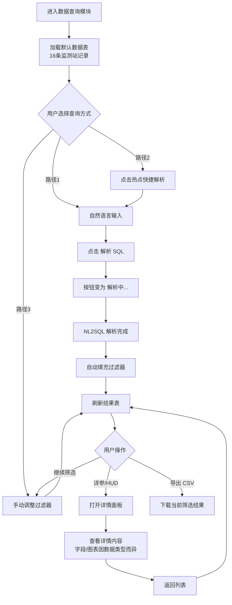

# 智能数据查询及分析 — 需求剖析

> **来源原型**：[北京市沉降监测大模型 | Google AI Studio](https://aistudio.google.com/apps/13d167ab-5245-4b70-b706-133e8d723e82?showPreview=true&showAssistant=true&fullscreenApplet=true)  
> **部署地址**：`https://ais-pre-6olqxdqey6dy3cjljwozif-596480797968.asia-east1.run.app/`  
> **分析日期**：2026-07-07  
> **分析方式**：基于 Google AI Studio 原型页面实际交互操作（Chrome DevTools MCP + autoConnect）

---

## 1. 系统背景

原型系统名称为 **「京地沉降监测智算 G-RAG」**，副标题为「北京市空间遥感协同网」，出品单位为北京市规划自然防灾中心 / 北京市地质工程防灾减灾中心。

系统采用 **左侧导航 + 右侧主工作区** 布局，包含四大核心模块：

| 模块 | 说明 |
|------|------|
| 智能问答 | RAG 增强对话（GRAG-Core） |
| 自动报告生成 | 应急/周报/月报编制与 PDF 导出 |
| **数据查询** | 遥感干涉观测数据库 + NL2SQL（本文重点） |
| 知识库 | 法规/规范文档管理与向量化 |

本文档聚焦 **「数据查询」** 模块的需求剖析与交互流程梳理。

---

## 2. 模块定位

**模块名称**：遥感干涉观测数据库 (SQL Data Console)

**核心能力**：

- 展示北京市地面沉降监测哨点综合数据
- 支持 **自然语言 → SQL** 条件解析（NL2SQL）
- 支持 **多维过滤器** 组合筛选
- 支持 **详参/HUD 详情** 查看（内容随查询数据类型变化，如时序图表、防灾策略等）
- 支持当前筛选结果 **CSV 导出**

**顶部状态栏**（全模块共用）：

- 星地数据协同链路就绪
- [应急响应机制: 自动备用运行]
- API Status: Host Active

---

## 3. 页面结构

```
┌─────────────────────────────────────────────────────────────┐
│ 顶部状态栏：星地数据协同链路 | 应急响应机制 | API Status     │
├──────────┬──────────────────────────────────────────────────┤
│ 左侧导航  │  🔍 遥感干涉观测数据库 (SQL Data Console)        │
│ ·智能问答 │                                                  │
│ ·自动报告 │  ① 星地灾害综合感知树（信息展示）                 │
│ ▶数据查询 │  ② 自然语言条件查询解析 (SQL 编译器)             │
│ ·知识库   │  ③ 多维关联交互过滤器                            │
│          │  ④ 星地干涉测得地盘位移记录表 + 导出              │
└──────────┴──────────────────────────────────────────────────┘
```

---

## 4. 主交互流程



---

## 5. 分步交互流程

### 5.1 流程 0：进入模块（初始化）

| 步骤 | 用户操作 | 系统响应 |
|------|----------|----------|
| 0.1 | 点击左侧 **「数据查询」** | 主标题切换为「遥感干涉观测数据库 (SQL Data Console)」 |
| 0.2 | — | 展示 **星地灾害综合感知树**（只读统计） |
| 0.3 | — | 加载 **位移记录表**，默认 16 条监测站 |
| 0.4 | — | 过滤器默认：所有行政区、所有岩性、速度阈值 = 0 |
| 0.5 | — | 「解析 SQL」按钮 **禁用**（输入框为空时） |

#### 星地灾害综合感知树（只读，不可点击筛选）

| 分类 | 子项 | 数量 |
|------|------|------|
| 北京市综合位移数据池 | — | 148 哨点 |
| 岩土本底层压实系统 | 基岩标静力水准 | 34 点 |
| | 分层标静力水准 | 677 点 |
| 流体赋存及应力监测 | 地下水位标定点 | 302 点 |
| | 孔隙水压力监测 | 50 点 |
| 星地干涉宏观天网组 | GNSS 连续监测点 | 97 点 |
| | 气象监测点 | 36 点 |

页面底部说明文案：「当前正调阅首都规划防灾主数据池，联合 148 星地相干及自适应探头对朝阳、通州深部土体受压段进行高频物理切向扫描。」

---

### 5.2 流程 1：自然语言查询（NL2SQL）

**区块标题**：自然语言条件查询解析 (SQL 编译器)

**实测用例**：`查询朝阳区年沉降率大于60的监测点`

| 步骤 | 用户操作 | 系统响应 |
|------|----------|----------|
| 1.1 | 在输入框输入自然语言 | 「解析 SQL」按钮 **启用** |
| 1.2 | 点击 **「解析 SQL」** | 按钮文案变为 **「解析中...」**，期间禁用 |
| 1.3 | 等待解析完成 | 按钮恢复为「解析 SQL」 |
| 1.4 | — | **自动填充过滤器**：行政区 → 朝阳区；速度阈值 → 60 mm/yr |
| 1.5 | — | **刷新结果表**：16 条 → **2 条**（BJ-CY-01、BJ-CY-02） |

**输入框占位示例**：

- `查询朝阳区年沉降率大于60的监测点`
- `大兴区有哪些层位监测点？`

**需求要点**：

- NL2SQL 解析结果需 **反向映射** 到前端过滤器控件，便于用户二次微调
- 解析过程中需有 loading 态，防止重复提交
- 空输入时解析按钮保持禁用

---

### 5.3 流程 2：热点快捷解析

| 步骤 | 用户操作 | 系统响应 |
|------|----------|----------|
| 2.1 | 点击热点标签 | 将预设 query 填入输入框 |
| 2.2 | 点击「解析 SQL」（或自动触发） | 触发 NL2SQL 解析并刷新表 |

**预设热点**：

- `通州绝对下限大于50`
- `昌平孔隙粘土层站`
- `大兴区多孔粘土监测点`

**需求要点**：热点标签作为 **常用查询模板**，降低 NL2SQL 使用门槛。

---

### 5.4 流程 3：手动多维过滤

**区块标题**：多维关联交互过滤器

| 步骤 | 用户操作 | 系统响应 |
|------|----------|----------|
| 3.1 | 修改 **行政划分** 下拉 | **即时刷新**结果表，无需确认按钮 |
| 3.2 | 修改 **多孔优势持力地层** | 即时刷新 |
| 3.3 | 调整 **绝对年速度限界**（≥ N mm/yr） | 即时刷新 |

**实测组合过滤**：

- 条件：通州区 + 速度 ≥ 60 mm/yr
- 结果：仅 **1 条** — BJ-TZ-01 通州宋庄监测站（-68.4 mm/yr）

#### 过滤器选项

| 过滤器 | 选项 |
|--------|------|
| 行政划分 | 所有 / 朝阳 / 通州 / 昌平 / 大兴 / 海淀 / 顺义 / 房山 / 城六区 |
| 优势层岩性 | 所有 / 第四系冲洪积层 / 多孔压缩粉质粘土 / 松散砂砾层 / 软弱可塑黏性土 / 卵砾持力层 |
| 速度限界 | 数值输入，单位 mm/yr，按绝对值 ≥ 过滤 |

**需求要点**：

- 多条件 **AND** 组合
- 过滤器变更 **即时生效**，无需「查询/搜索」按钮
- 可与 NL2SQL 解析结果叠加使用

---

### 5.5 流程 4：查看详情（详参/HUD）

> **说明**：详情面板并非固定为「监测站详情」。不同查询所返回的数据实体类型不同（如监测站、层位、区域汇总等），详情面板的 **标题、字段、图表、策略建议** 均随当前查询结果类型而变化。原型中以监测站位移记录为例，操作入口列名为「详参 / HUD」，按钮文案为「加载 HUD」。

| 步骤 | 用户操作 | 系统响应 |
|------|----------|----------|
| 4.1 | 点击某行 **「详参/HUD」** 操作（原型中为「加载 HUD」） | 弹出详情面板，覆盖/浮于列表之上 |
| 4.2 | — | 展示 **当前行对应实体** 的完整信息（字段结构因数据类型而异） |
| 4.3 | 点击 **「已校对并返回数据库列表」**（或同类返回操作） | 关闭详情面板，回到当前筛选结果表 |

#### 详情面板内容示例（监测站位移记录 · BJ-CY-01）

以下为原型中 **监测站类查询结果** 的详情展示样例；其他数据类型需单独定义详情 schema。

| 区块 | 字段 |
|------|------|
| 标题 | 【BJ-CY-01】测定站星地联动雷格雷归纳研判 |
| 基本信息 | 站名、行政区、岩性、关联基础设施 |
| 关键指标 | 年形变速率、历史累计下陷量、地下水位埋深 |
| 时序图表 | 2020–2025 星地干涉历史演进曲线 |
| 防灾策略 | 地下水压限采、地铁墩梁顶升、管线防断卡盖等建议 |
| 关闭 | 「已校对并返回数据库列表」 |

**BJ-CY-01 详情字段示例**：

| 字段 | 值 |
|------|-----|
| 物理观测站名称 | 朝阳金盏监测站 (InSAR-T12) |
| 所属行政地盘区 | 朝阳区 |
| 优势层地层岩性组分 | 第四系冲洪积孔隙压缩粉质粘土、松散砂砾石层 |
| 重大关键地面基础设施 | 京平高速、金盏金融商务区高层建筑、在建轨道交通 3 号线 |
| 年形变下沉速率 | -84.2 mm/yr |
| 历史累计下陷量 | -418.5 mm（自 2020 起） |
| 今日深部承压水位埋深 | -48.2 m |

**防灾策略示例（3 条）**：

1. **地下水压限采对策**：周边 2.5 km 深度低于 35 m 的采砂和降水工程严格禁审
2. **临近地铁墩梁顶升抬高**：在建轨道交通 3 号线架设静力水准传感器，24 小时突变量超 5 mm 时注浆顶升
3. **中高压市政供气管自顺防断卡盖**：垂直切变坡降梯度超 3.5‰ 时加装防拉脱变位卡箍

---

### 5.6 流程 5：导出数据

| 步骤 | 用户操作 | 系统响应 |
|------|----------|----------|
| 5.1 | 点击 **「导出 CSV 文档」** | 下载 **当前筛选结果** 的 CSV 文件 |

> 导出范围 = 当前过滤器生效后的表格数据，非全量 16 条。

---

## 6. 结果表字段定义

**表格标题**：星地干涉测得地盘位移记录表

| 列名 | 含义 | 示例 |
|------|------|------|
| 测位 ID | 监测站编码 | BJ-CY-01 |
| 监测站名称 (InSAR ID) | 站名 + 雷达 ID | 朝阳金盏监测站 (InSAR-T12) |
| 行政区 | 所属区 | 朝阳区 |
| 年滑速 (mm/yr) | 年沉降速率（负值表示下沉） | -84.2 |
| 历史累计变形 (mm) | 累计位移 | -418.5 |
| 地下水位埋深 (m) | 水位深度 | -48.2 |
| 优势层岩土特征 | 地质描述 | 第四系冲洪积孔隙压缩粉质粘土… |
| 详参 / HUD | 操作列，打开详情面板 | 「加载 HUD」等（文案可随数据类型配置） |

#### 原型内置监测站清单（16 条）

| 测位 ID | 监测站名称 | 行政区 | 年滑速 |
|---------|-----------|--------|--------|
| BJ-CY-01 | 朝阳金盏监测站 (InSAR-T12) | 朝阳区 | -84.2 |
| BJ-CY-02 | 朝阳双桥监测站 (InSAR-T15) | 朝阳区 | -76.5 |
| BJ-TZ-01 | 通州宋庄监测站 (InSAR-K03) | 通州区 | -68.4 |
| BJ-TZ-02 | 通州台湖监测站 (InSAR-K08) | 通州区 | -59.8 |
| BJ-CP-01 | 昌平沙河监测站 (InSAR-H01) | 昌平区 | -48.2 |
| BJ-SY-01 | 顺义李桥监测站 (InSAR-S05) | 顺义区 | -42.8 |
| BJ-DX-01 | 大兴榆垡监测站 (InSAR-D02) | 大兴区 | -35.4 |
| BJ-FS-01 | 房山良乡监测站 (InSAR-L11) | 房山区 | -28.4 |
| BJ-CY-03 | 朝阳奥森公园监测点 (InSAR-T05) | 朝阳区 | -24.8 |
| BJ-TZ-03 | 通州环球度假区监测站 (InSAR-K15) | 通州区 | -22.5 |
| BJ-FT-01 | 丰台卢沟桥监测站 (InSAR-F01) | 丰台区 | -15.4 |
| BJ-DX-02 | 大兴国际机场监测端 (InSAR-D10) | 大兴区 | -14.2 |
| BJ-HD-01 | 海淀中关村监测站 (InSAR-W01) | 海淀区 | -12.1 |
| BJ-SJS-01 | 石景山古城监测站 (InSAR-F05) | 石景山区 | -9.5 |
| BJ-DC-01 | 东城王府井监测站 (InSAR-C05) | 东城区 | -7.8 |
| BJ-XC-01 | 西城金融街监测站 (InSAR-C01) | 西城区 | -5.2 |

---

## 7. 交互规则小结

| 规则 | 说明 |
|------|------|
| 过滤器联动 | 多条件 **AND** 组合，改一项即刷新 |
| NL2SQL → 过滤器 | 解析成功后 **反向填充** 过滤器，用户可再手动微调 |
| 感知树 | **只读展示**，不参与筛选 |
| 空输入 | 「解析 SQL」禁用 |
| 解析中 | 按钮禁用，防重复提交 |
| 详参/HUD | 模态/浮层，不离开当前模块；**内容与当前查询数据类型绑定**，非固定监测站模板 |
| CSV 导出 | 导出当前视图，非全库 |

---

## 8. 功能需求清单

### 8.1 必须实现（P0）

| 编号 | 功能 | 描述 |
|------|------|------|
| F-01 | 监测数据列表 | 分页/滚动展示监测站位移记录 |
| F-02 | 多维过滤器 | 行政区、岩性、速度阈值三维度 AND 筛选 |
| F-03 | NL2SQL 解析 | 自然语言输入 → 解析为 SQL 条件 → 填充过滤器 |
| F-04 | 热点快捷查询 | 预设常用 NL 查询模板 |
| F-05 | 详参/HUD 详情 | 按数据类型展示详情面板（字段、图表、策略等可配置；监测站为其中一种） |
| F-06 | CSV 导出 | 导出当前筛选结果 |

### 8.2 建议实现（P1）

| 编号 | 功能 | 描述 |
|------|------|------|
| F-07 | 感知树统计 | 只读展示各类哨点数量统计 |
| F-08 | 解析过程可视化 | 展示 NL2SQL 生成的 SQL 语句（调试/透明） |
| F-09 | 详情图表交互 | 详情内时序/统计图支持缩放、tooltip、多指标切换（视数据类型有无图表） |

### 8.3 可选实现（P2）

| 编号 | 功能 | 描述 |
|------|------|------|
| F-10 | 感知树点击筛选 | 点击树节点自动设置对应过滤器 |
| F-11 | 地图联动 | 表格与 GIS 地图双向联动 |
| F-12 | 查询历史 | 保存用户最近 NL 查询记录 |

---

## 9. 与现有项目的映射建议

| 原型能力 | 现有项目对应 | 说明 |
|----------|-------------|------|
| NL2SQL 解析 | `analysis-nl2sql-stream-v2` 流式接口 | 可复用 NL2SQL 链路，需适配地降所 schema |
| 多维过滤 | 前端 filter state + SQL WHERE | 参考 `docs/NL2SQL系统概要设计.md` |
| 结果表 | 分页表格 + 查询 API | 新建地降所监测数据 API |
| 详参/HUD 详情 | 按实体类型的详情 API + 可选时序图 | 监测站类可参考超温分析 v2；其他类型需独立详情接口与前端模板 |
| CSV 导出 | 后端生成或前端导出 | 轻量实现可用前端 `json2csv` |
| 数据库结构 | `docs/地降所需求及数据相关/数据库结构及逻辑/` | 待与客户 schema 对齐 |

---

## 10. 待澄清事项

1. **真实数据源**：原型为演示数据（16 条），实际是否对接 InSAR/GNSS/地下水位等多源数据库？
2. **NL2SQL schema**：监测站表结构、字段枚举（行政区、岩性）需客户提供
3. **详参/HUD 内容模型**：除监测站外还有哪些查询结果类型？各类型的详情字段、图表、策略内容由规则引擎还是 LLM 生成？
4. **感知树与过滤器**：后续是否需要树节点点击联动筛选？
5. **权限控制**：不同角色（勘测员/管理员）是否有不同的查询/导出权限？

---

## 11. 附录：原型访问说明

由于 Google 账号安全策略，自动化浏览器（MCP 独立启动 Chrome）无法完成登录，需通过以下方式访问原型：

1. 在 Chrome 中打开 `chrome://inspect/#remote-debugging`，开启远程调试
2. MCP 配置使用 `--autoConnect=true` 连接已打开的 Chrome
3. 手动打开 AI Studio 链接，点击「Continue to the app」进入原型

相关 MCP 配置见项目 `.cursor/mcp.json` 中 `chrome-devtools-auto` 条目。
