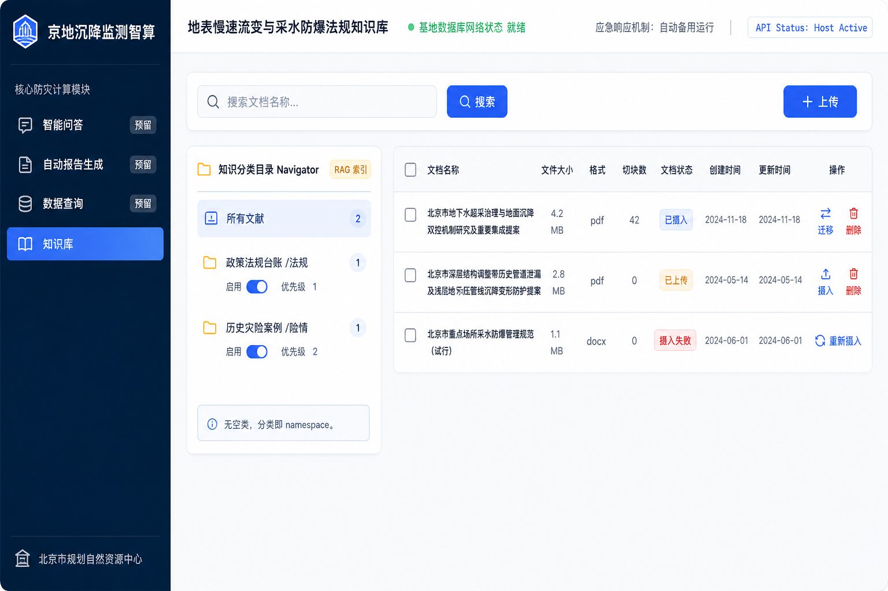
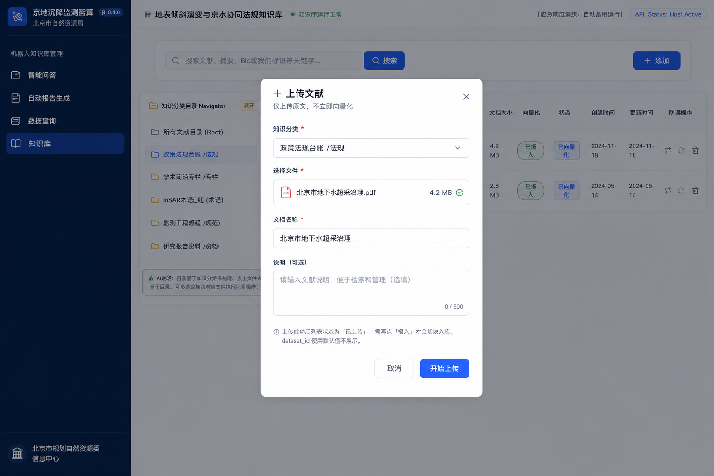
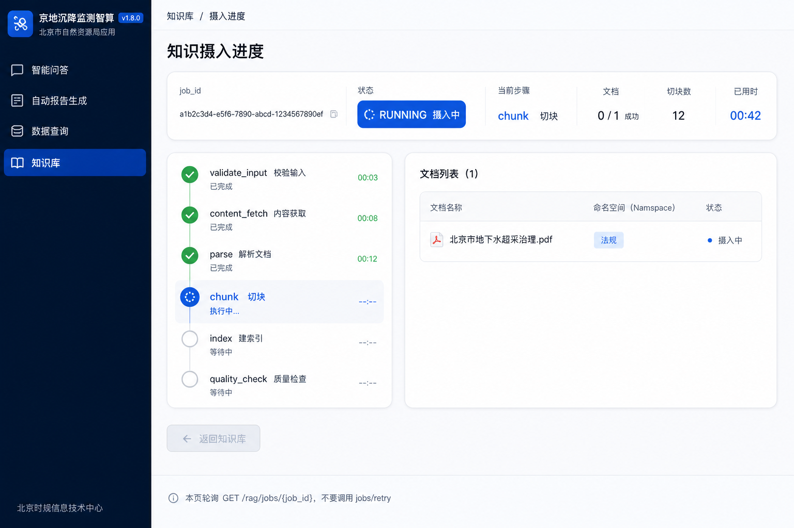

# 地降所项目 — 前端 UI 及对应接口调用说明

> **版本**：2026-09-01  
> **结构**：与左侧导航四大板块对齐。第三块 **数据查询**、第四块 **知识库** 为当前实现。第一、二块本期预留。  
> **后台契约**（数据查询）：`docs/基于地降所项目改造/数据查询智能体实现方案.md`  
> **后台契约**（知识库）：`docs/基于地降所项目改造/RAG基座改造和前端功能及接口调用说明.md`  
> **本目录资源**：原型与改造后线框图均放在本文件夹内。

| 文件 | 说明 |
|------|------|
| `prototype-kb-original.png` | 原始知识库原型截图 |
| `kb-page-redesign.png` | 改造后：知识管理主页面 |
| `kb-upload-dialog.png` | 改造后：上传对话框（只上传、不摄入） |
| `kb-ingest-progress.png` | 改造后：摄入进度页 |

线框图中的中文可能有绘制误差，**以本文表格与接口为准**。

---

## 一、智能问答

---

## 二、自动报告生成

---

## 三、数据查询

本期落地。侧栏「数据查询」为可进入页面；路由建议 `/data-query`（浏览器地址，点侧栏后打开这一页）。主工作区标题可用「遥感干涉观测数据库」或产品名「数据查询」，以导航为准。

下文 **括号内** 是对应的界面/操作说明（用户看见什么、点什么）；括号外仍是前后端字段与接口名。

**两条路径共用右侧表格与 HUD 浮层（点某一行弹出的详情：曲线、指标），数据来源不同：**

| 路径 | 何时 | 谁提供列表 | HUD（行详情） |
|------|------|------------|-----|
| **浏览**（点树看表，不说人话） | 进页默认表、点树刷新 | **Java**（业务后端）读库（默认全北京最新分层标+基岩标） | 没有历史曲线就隐藏「详参」按钮，或点行再请求 `GET /data-query-agent/hud`（按这一行补拉详情） |
| **解析 SQL**（用一句话查） | 顶栏有问句并点「解析 SQL」 | `POST /data-query-agent/run-stream`（开始解析）推来的 `data_query_result`（最终结果：表+详情） | **同一包结果里**就有 `hud_by_entity`（按行找详情的字典；站点找不到时再用 `hud_by_station`），**不要**再请求 `GET /hud` |

鉴权：请求头带 `Authorization: Bearer <SERVICE_API_KEY>`（访问算法接口的口令）。算法端接口都在 `/data-query-agent/*`（数据查询智能体）。开关：`DATA_QUERY_AGENT_ENABLED`（总闸；关掉时返回 **503**「服务未开」，不是 **404**「没有这个地址」）。  
进程须 `NL2SQL_BUSINESS_DOMAIN=subsidence`（告诉系统按地降所监测库工作，不要当成锅炉等其它业务）。`library_id`（监测库编号，如分层标=`fcb`）必须与 Java 左侧树、`GET /data-query-agent/libraries`（七库名单）**三方写成一样**。

SSE（服务端边算边往浏览器推消息，像直播，不用等全部算完才一次性返回）：类型是 `text/event-stream`，每一帧是 `data: {JSON}\n\n`，消息种类写在 JSON 的 **`event`** 字段（和综合分析、看图诊断同一套写法，方便网关转发）。不要把报告类的 `summary_delta`（逐字吐报告）当成查询结果表。

---

### 3.0 与原始原型的差异（必须按改造方案改）

原始原型（需求剖析中的 Google AI Studio 页）保留壳层：左侧四模块、顶栏自然语言、「解析 SQL」、左侧感知树、右侧表、行内「详参/HUD」。以下按落地口径调整：

| 原始原型 | 改造后（本期） |
|----------|----------------|
| 多维过滤器（行政区 / 岩性 / 速度阈值）且解析后反向填充 | **不做过滤器**（页面上没有「再筛一遍」的控件）。区/站/时间只从问句（或树上明确传来的 `district`/`station_id`）写进 SQL 的 WHERE（查询条件） |
| 感知树只读、不可点 | 树 **可点**：点库/区/站刷新列表走 **Java**（业务后端直接读库），**不要**再调 `run-stream`（解析 SQL） |
| 进页固定 16 条演示站 | Java 默认表：分层标表 `t_data_wash_fcb` + 基岩标表 `t_data_wash_jyb`，全北京每站最新一条 `data_time`（观测时间） |
| 列「年滑速 mm/yr」、岩性、InSAR ID | **不造列**（库里没有就不要编一列出来）。年变化用「这一年最后一次读数减去最早一次」（`annual_settle_mm` 等）；岩性/层位在 HUD 里标记 `unavailable`（没有这块数据，别画空卡片）；**不弹选库** |
| 解析即出表，无选库 | 问不清查哪类监测数据时 **HITL 选库**（人机协同：先暂停，弹出「请选择分层标/地下水/…」，选完再继续；技术上是中断 SSE → 调 `resume-stream`） |
| HUD 固定「监测站」模板，可编造策略/岩性 | HUD（行详情）跟 **这一行代表谁**（一个站 / 一个区 / 全市），不是跟「当前点了哪个库」死绑；`blocks` 不是 `ok` 就 **不画**（没有岩性/策略就留空，不要写假的）；解析一次把列表和详情 **同一包数据** 给齐 |
| 服务端 CSV | 导出可由前端对 **当前表格** 做（浏览器里另存为）；不是算法必须提供的下载接口 |

不要调用：`POST /nl2sql/query` 当查询台主入口（那是给其它模块直接问数用的，会绕过「锁死只查一张监测表」和选库弹窗）、`/analysis-agent/*`（综合分析出报告）、智能客服里的 `data_query`（对话答疑，不是这张表）、已砍的过滤器专用接口、`/rag/kb-tree`（知识库目录树）。

---

### 3.1 页面 — 数据查询主工作台

布局：顶栏（标题 + 输入框 +「解析 SQL」）｜左侧感知树 ｜右侧结果表 ｜点行弹出的详情（不跳走）。

```text
┌ 顶栏：说人话的输入框    [解析 SQL]  热点标签（点一下填进输入框）  导出(可选) ┐
├ 左侧树（监测类型→区→站） ┼ 右侧表（列随类型变；行上有「详参」）           ┤
└────────────────────────┴ 详情浮层（曲线/指标，盖在表上或右侧）          ┘
```

#### 进入页面

1. 画左侧树：数据来自 **Java**（库→行政区→站点及点数；界面上就是左边那棵可展开的树）。库节点 `id` 必须用下表 `library_id`（程序用的英文代号），不要用中文当稳定 ID（树上可以写「分层标」，请求里必须传 `fcb`）。  
2. 右侧默认表：打 **Java 列表 API**（全北京最新 fcb+jyb；刚进页右侧那张表，分层标和基岩标拼在一起）。**不**打 `run-stream`（用户还没点「解析 SQL」，不要当成人话查询）。  
3. 可选预加载：`GET /data-query-agent/libraries`（拉一份「七种监测类型」名单），供 HITL 选库弹窗与树上中文名校验。  
4. 输入框为空：「解析 SQL」**禁用**（灰掉，点不了）。

#### 顶栏

| UI | 行为 | 接口 |
|----|------|------|
| 输入框 | 自然语言（「朝阳区沉降比较大的点」这种）；有字才点得了按钮 | 不单独请求（还没点解析，不必调接口） |
| 「解析 SQL」 | 文案改「解析中…」并禁用（防连点）；打开 SSE（页面边等边收进度） | `POST /data-query-agent/run-stream`（开始解析） |
| 解析中再次点击 | 忽略或保持禁用 | 不要并行开第二路流（不要同时跑两次解析） |
| 热点标签（通州… / 昌平…） | **只把文案填进输入框**（跟用户手打一样） | **不另做接口** |
| 离开页 / 取消解析 | 协作取消（告诉后台别再算了） | `POST /data-query-agent/stream/stop` |
| 导出 CSV（可选） | 导 **当前表格** 行，非全库 | 前端本地另存；不打算法 |

空 `query`（输入框没字）发请求会 **422**（参数不合法），应拦在按钮上，不要弹出系统报错。

`run-stream` 必填 `user_id`（谁在用）、`session_id`（哪一次会话）、`query`（输入框里的话）；`library_id` = 树当前点中的 **库**（分层标/地下水等；没点库就省略）。树已经点到某个区或某个站、同时又点「解析 SQL」时，可传 `district` / `station_id`（**以树上点的为准**，不要和问句里的区/站再做「两个条件同时满足」）。

#### 左侧感知树

树数据与点选刷新列表由 **Java** 实现（点树 = 换右侧那张表）。算法端 **只认库这一级** `library_id`（点「分层标」才会带进解析；点「朝阳区」本身不会让算法换库）。点到朝阳区/某站且 **不点「解析 SQL」** 时不要打 `run-stream`。

展示名与稳定 ID（与 `GET /libraries`、配置 `device_type.yaml` 同源；树上中文、程序英文必须对得上）：

| 分组（树上一组标题） | 展示名（树节点上写的字） | `library_id`（请求里传这个） | 物理表（数据库表名，界面可不展示） |
|------|--------|--------------|--------|
| 岩土本底层压实 | 分层标 | `fcb` | `t_data_wash_fcb` |
| 岩土本底层压实 | 基岩标 | `jyb` | `t_data_wash_jyb` |
| 流体赋存及应力 | 地下水 | `dxswj` | `t_data_wash_dxswj` |
| 流体赋存及应力 | 孔隙水压力 | `kxsylj` | `t_data_wash_kxsylj` |
| 星地综合观测 | GNSS | `gnss` | `t_data_wash_gnss` |
| 星地综合观测 | 气象站 | `qxz` | `t_data_wash_qxz` |
| 星地综合观测 | 光纤 | `gq` | `t_data_wash_gq` |

| UI | 行为 | 接口 |
|----|------|------|
| 点 **库** 节点（如「分层标」） | 该节点高亮；右侧换成这一类监测点的表 | **Java** 列表 API（带 `library_id`） |
| 点 **区 / 站** 节点 | 右侧只显示该区或该站 | **Java** 列表 API；不打 `run-stream`（不是「解析 SQL」） |
| 收到 `data_query_library_hit`（解析已经锁定哪一类库） | 高亮/选中对应 **库** 节点（即使用户没先点树，解析出「地下水」也要把树点到地下水） | SSE，见 §3.2 |
| 树选库后再点「解析 SQL」 | 请求带上该 `library_id`（告诉算法：按树上这种类型查） | `run-stream` |

解析时树选的库和问句说的库不一致（例如树点了基岩标，问句却写「查 GNSS」）：**仍以树为准**，`warnings` 含 `library_conflict_nl_ignored`（后台记一笔「问句里的库被忽略了」），**不弹选库窗**（不要打断用户）。

#### 右侧结果表

表头 **禁止写死**「测位 / 年沉降 / 累计沉降」（查地下水时应出现「埋深」，查气象应出现「气温/降水」，列是跟着监测类型变的）。浏览路径（点树出来的表）列名尽量和解析路径的 `columns`（结果里下发的表头清单）对齐，好用同一套表格。

| 列来源 | 规则 |
|--------|------|
| 解析 SQL | `data_query_result.columns[].title` 当表头（用户看见的列名）；单元格取 `list[row][columns[i].key]`（这一格的值）；缺 key 显示空，不要自己猜列 |
| 浏览（Java） | Java 自己带列；建议 key 与下表对齐（同样的英文字段，表头可以是中文） |

站点列表典型度量列（除测位 ID / 站名 / 行政区 / 数据时间外；即表上多出来的「数」）：

| `library_id`（哪类监测） | 度量列（表上的数，界面用中文表头） |
|--------------|--------|
| `fcb` / `jyb` / `gq`（分层标/基岩标/光纤） | `annual_settle_mm`（年沉降量）、`total_settle_mm`（累计沉降） |
| `dxswj`（地下水） | `deep`（埋深）、`annual_deep`、`elevation`（水位标高） |
| `kxsylj`（孔压） | `pressure`、`annual_pressure` |
| `gnss` | `displacement_3d`（三维位移）、`annual_displacement_3d`、`displacement_2d` |
| `qxz`（气象） | `temp`（气温）、`real_time_rain`（降水） |

`result_grain=district`（问的是「各区平均」时）：表是一行一个区，列为行政区 / 指标 / 站点数。`city`（问「全市平均」）：只有「全市」一行。沉降 **负值表示下沉**，不要改成绝对值（界面不要把 −12 显示成 12）。

**行上 HUD（解析路径；表格最右「详参」列）：**

| 字段 | 含义（界面） |
|------|------|
| `hud_enabled`（整次结果） | `false`：整张表都没有「详参」按钮，也没有详情数据 |
| `hud_entity_type` | 这一行是站、区还是全市（决定详情里画什么） |
| `hud_entity_id` | 打开详情时用哪把钥匙：站=`station_id`（测位编号）；区=`area`（如朝阳区）；市固定 `beijing` |
| `hud_available` | `false` 时这一行不显示按钮（站太多只给前 50 个、区只给前 16 个，或这一行对不上实体） |

**行操作：**

| 路径 | 按钮 | 行为 |
|------|------|------|
| 解析成功，且整表开了 HUD、这一行 `hud_available` | **详参 / HUD** | 在已经收到的结果里查 `hud_by_entity[这一行的 hud_entity_id]`（点哪行就打开哪行的详情，不必再等网络）；站点找不到时再用 `hud_by_station[测位编号]` |
| 浏览（点树出来的 Java 表） | **详参 / HUD** | 再请求一次 `GET /data-query-agent/hud?...`（默认表里本来没有曲线，点一下再拉这条的详情），把返回的 `hud` 交给和解析路径同一套详情面板 |
| 解析刚出表 | — | **不要**再请求 `GET /hud`（详情已经在结果包里，再拉是重复） |

#### 选库对话框（HITL）（人没说清查哪类数据时，先请用户选）

仅「锁定监测类型」失败时出现（例如只打「查数据」、一句里对比分层标和 GNSS、树上传来的库编号非法）。问句没写区/站/时间 **不要弹窗**（空 = 不限制，直接查）。

收到 `data_query_library_input_required`（需要用户选库）后 **这一轮推送结束**（右侧还没有新表）。弹出选库窗：

| 字段 | 说明（界面） |
|------|------|
| 提示文案 | 事件 `prompt`（窗顶部那句「请选择要查询的数据类型」） |
| 选项 | 事件 `library_options`（窗里的卡片/下拉：分层标、地下水…按分组排列）；**不要在代码里写死七个名字**，以后加库只改配置 |
| 建议高亮 | `candidates` 对应项 `suggested=true`（系统觉得比较像的那几个可以描边） |
| 确认 | 用户点某一种类型后 `POST /resume-stream`（带着刚才的 `resume_token` 和选中的库，继续出表） |
| 放弃 | 点取消：`abort=true` 或离开页走 `stream/stop`（按钮恢复成「解析 SQL」，表保持点选库之前的样子） |

`user_id` / `session_id` 必须与点「解析 SQL」时同一套（同一人、同一会话）。查数失败（SQL 出错）走 `data_query_error`（页面提示失败即可），**不要再弹选库**（库已经定了，是取数失败不是类型不清）。

#### HUD 详情浮层（点「详参」后盖在表上或右侧滑出，不离开本页）

标题用面板 `title`（如「金盏公交 · 分层标」），不要写死「监测站详情」（各区平均时标题应是区名）。

| UI | 规则 |
|----|------|
| 核心指标（面板上方几个大数字） | `core_metrics[]`（名称、数值、单位，如累计沉降 −418.5 mm） |
| 折线（中间的时间曲线） | `series.points[]` 的时间 `t`、数值 `v`；`series.agg==="avg"` 表示 **这个区/全市每天的平均**，不能拿某一个站的曲线冒充「朝阳区」 |
| 多度量（气象） | `series_list[]` 可做「气温 / 降水」切换；还是同一个站，不是新的一种列表 |
| 岩性 / 层位 / 防灾策略 | `blocks.*.status` 不是 `ok` → **整块不画**（不要留一块空白标题「防灾策略」） |
| 全市 | 内部 id 固定 `beijing`（界面仍显示「全市」） |

只有曲线没拉到、列表已经出来时：表还在，详情里折线为空，`warnings` 含 `hud_series_failed`（可在详情里提示「时序暂不可用」，不要当成整次查询失败）。

---

### 3.2 解析 SQL 接口（算法端；点「解析 SQL」之后走这里）

#### 3.2.1 HTTP 一览

| 方法 | 路径 | 谁调用（界面） | 说明 |
|------|------|--------|------|
| GET | `/data-query-agent/libraries` | 选库弹窗 / 联调 | 七种监测类型名单；和弹窗选项同一份 |
| POST | `/data-query-agent/run-stream` | 点「解析 SQL」 | 主入口，边解析边推消息 |
| POST | `/data-query-agent/resume-stream` | 选库弹窗点确定之后 | 接着出表；用同一次查询的编号把前后两段连起来 |
| POST | `/data-query-agent/stream/stop` | 离开本页 / 点取消 | 带上开始解析时记下的 `stream_id`（这一路解析的编号） |
| GET | `/data-query-agent/hud` | **仅点树出来的表**上点「详参」 | 按这一行补拉详情；解析出的表不要用 |
| GET | `/data-query-agent/traces` | 运维后台，用户页不做 | 查询记录 |
| GET | `/data-query-agent/traces/stats` | 运维 | 汇总 |
| GET | `/data-query-agent/trace/{request_id}` | 运维 | 查一次解析的详情 |

`run-stream` 请求（点「解析 SQL」时提交）：

```json
{
  "user_id": "u1",
  "session_id": "s1",
  "query": "朝阳区年沉降比较大的监测点",
  "library_id": "fcb",
  "district": null,
  "station_id": null,
  "options": { "include_hud": true, "expose_sql": false, "max_rows": null }
}
```

| 字段 | 必填 | 说明（界面） |
|------|------|------|
| `user_id` / `session_id` | 是 | 登录用户和本次会话；禁止含 `:` |
| `query` | 是 | 顶栏输入框；不能空 |
| `library_id` | 否 | 左侧树当前点中的库；没点库就不要传 |
| `district` / `station_id` | 否 | 树点到了某个区或某个站，同时又解析；以树为准，覆盖问句里的区/站 |
| `options.include_hud` | 否 | 默认要详情；`false` 则表上没有「详参」（只要名单、不要曲线） |
| `options.expose_sql` | 否 | 默认不展示 SQL；联调打开才在结果里带出语句 |
| `options.max_rows` | 否 | 表最多多少行，默认 500 |

`resume-stream`：必须带选库弹窗里记下的 `resume_token`（这一次暂停的凭证）；`library_id` 是用户点中的那种监测类型；`abort=true` 表示点了「放弃」。  
`stream/stop`：`{ "user_id", "session_id", "stream_id" }` → 按钮恢复可点。

#### 3.2.2 SSE 事件序（解析过程中页面依次收到的消息）

每一帧都有 `event`（这是哪一种消息）、`request_id`（这一次点「解析 SQL」的编号，选库前后相同）。需要选库时这一轮连接先结束；用户选完再开一条新连接（和看图诊断选范围的体验一样：先弹窗，再继续转圈）。

不需要选库（树已点库，或问句已经能判断是分层标/地下水等）时，用户看到的顺序大约是：按钮变「解析中…」→ 左侧树跳到对应库 →（可选）出表前的等待 → 右侧换表 → 按钮恢复。对应消息：

```text
started                         { request_id, stream_id }          # 开始转圈，记下 stream_id 以便取消
data_query_library_hit          { library_id, display_name, ... } # 树高亮「分层标」等
data_query_scope_parsed         { scope, time, result_grain }     # 可选：芯片展示「朝阳区 / 近一年」（不做过滤器也可忽略）
data_query_nl2sql_progress      { q_list, q_hud_series }          # 可选：底部「正在查列表 / 正在查曲线」
data_query_result               { columns, list, hud_by_entity }  # 换表 + 详情已在包里
finished                        { status=success }                # 按钮恢复「解析 SQL」
```

记下 `started.stream_id` 供取消。`library_hit.source`（库是怎么定下来的，界面上都是高亮树）：

| `source` | 含义 | 界面 |
|----------|------|------|
| `request` | 请求里已经带了树上的库 | 树可能本来就亮着，确认即可 |
| `parsed` | 问句里写出了「分层标」「水位井」等 | **把树点到**那一类 |
| `default` | 只说「沉降」，系统默认分层标 | 高亮分层标，可轻提示「已按分层标查询」 |
| `llm` | 口语（如「水位井」）由模型补上 | 同 parsed，高亮对应库 |
| `hitl` | 用户刚在弹窗里选的 | 高亮所选 |

需要选库时：`started` → `data_query_library_input_required`（弹出「请选择数据类型」，含选项和 `resume_token`）→ 本轮结束、表还没换 → 用户点一种类型 → `resume-stream` → 再走高亮树 → 出表 → 结束。

`interrupt_reason`（为何弹窗，可用来换提示语）：`library_unresolved`（完全看不出查哪类，如「查数据」）/ `library_ambiguous`（一句里两类，如「对比分层标和 GNSS」）/ `library_id_invalid`（树上传来的代号系统不认识）。

取消：`data_query_cancelled` + 结束状态 cancelled（按钮恢复；**不要**把转圈时闪过的半截表当成查成功）。  
失败：`data_query_error`（页面 toast/横幅展示失败原因即可）+ 结束状态 error。

#### 3.2.3 `data_query_result` 示例（右侧表 + 点行详情的数据都在这里）

`columns` = 表头；`list` = 每一行；`hud_by_entity` = 点「详参」时用的详情字典（示例里写成 `{}`，真实有数据时 key 是测位号或区名）。

`warnings` 常见值（可做成表下小字，不必弹窗）：`library_defaulted`（已默认分层标）、`library_conflict_nl_ignored`（问句里的库被树覆盖了）、`scope_nl_overridden`（树上的区/站覆盖了问句）、`hud_series_truncated`（站太多，后面的行没有详参按钮）、`hud_series_failed`（表有了但曲线没有）、`lithology_unsupported` / `layer_unsupported`（问了岩性/第几层，库里没有，详情里不画该块）。

HUD 面板与 `GET /hud` 返回的 `hud` 同一套结构。区行：钥匙是「朝阳区」这种区名，折线为该区日平均（`series.agg=avg`）。

字段对照（实现时仍读这些名字）：`columns[].title` = 表头中文；`list[]` = 行；点详参用 `hud_by_entity[行.hud_entity_id]`。

```json
{
  "event": "data_query_result",
  "library_id": "fcb",
  "result_grain": "station",
  "hud_enabled": true,
  "columns": [{ "key": "station_id", "title": "测位 ID" }, { "key": "total_settle_mm", "title": "历史累计沉降(mm)" }],
  "list": [{ "station_id": "JZGZ", "total_settle_mm": -418.5, "hud_entity_id": "JZGZ", "hud_available": true }],
  "hud_by_entity": { "JZGZ": { "title": "金盏公交 · 分层标", "series": { "points": [{ "t": "2020-01-01", "v": -10.2 }] } } }
}
```

#### 3.2.4 `GET /hud`（仅浏览路径；点树出来的表上点「详参」）

```text
GET /data-query-agent/hud?library_id=fcb&entity_type=station&entity_id=JZGZ
```

（含义：打开「分层标、测位 JZGZ」这一行的详情。）

| 参数 | 必填 | 说明（界面） |
|------|------|------|
| `library_id` | 是 | 这一行是哪类监测（默认表里可能上一行分层标、下一行基岩标，各传各的） |
| `entity_type` | 是 | 点的是站、区还是全市。层位暂不支持 |
| `entity_id` | 是 | 站=测位编号；区=「朝阳区」；全市传 `beijing`（也可写「全市」） |
| `user_id` / `session_id` | 否 | 浏览表点详情时可以不传 |
| `expose_sql` | 否 | 联调才打开 |

成功后把返回的 `hud` 交给和解析路径同一套详情浮层。失败时按状态码提示（库不存在、参数错、查不到曲线等），不要当成「解析 SQL」失败。

---

### 3.3 功能 × 接口速查

| 功能（用户在页面上做什么） | 方法 | 路径 |
|------|------|------|
| 刚进页看到的表 / 点左侧树刷新右侧表 | — | **Java** 列表 API（本仓库不提供路径） |
| 左侧感知树有哪些库、区、站 | — | **Java** 树 API；库代号用 `fcb` 等，不要传「分层标」 |
| 选库弹窗里的选项 / 核对七种监测类型 | GET | `/data-query-agent/libraries` |
| 顶栏点「解析 SQL」 | POST | `/data-query-agent/run-stream`（边解析边推消息） |
| 选库弹窗点确定后继续出表 | POST | `/data-query-agent/resume-stream` |
| 离开页或取消「解析中」 | POST | `/data-query-agent/stream/stop` |
| 点树出来的表上点「详参」 | GET | `/data-query-agent/hud` |
| 解析完成后的表和详参数据 | SSE | 事件 `data_query_result`（同一次解析里就带齐） |
| 运维看历史解析记录 | GET | `/data-query-agent/traces` 等（用户页不做） |

本页可不做（界面上也不要做）：多维过滤器、点地图筛点、向算法要 CSV 文件、第 N 层详情、把 `POST /nl2sql/query` 当「解析 SQL」、跳去综合分析报告、走智能客服查数。

---

### 3.4 联调注意

- 查询台进程：`NL2SQL_BUSINESS_DOMAIN=subsidence`（按地降监测库工作），`DATA_QUERY_AGENT_ENABLED=true`（数据查询页能打开）。  
- `library_id` 三方一致：树上的代号、解析高亮、算法名单都用 `fcb` 这种英文；**不要把「分层标」三个字当作请求 id**（树上可以显示中文）。  
- 点「解析 SQL」出的表和详参已经在这一包结果里；只有点树出来的表，点「详参」才再请求 `GET /hud`。  
- 用户只说「沉降」、树上也没点库时，解析 **只查分层标**（树会亮到分层标）；进页那张「分层标+基岩标」拼表是点树/默认浏览，不是解析 SQL 的结果。  
- 选库弹窗的选项必须用推送过来的名单（或 `GET /libraries`），不要在页面里写死七个类型。  
- 「各区平均 / 全市平均」的折线是该区或全市的日平均；**不要拿某一个站的曲线**画成朝阳区或全市。  
- 输入框没字不要点解析（会 422）；取消解析要带上开始时记下的流编号。

---

## 四、知识库

本期落地。侧栏「知识库」为可进入页面；路由建议 `/kb`（管理）、`/kb/ingest-jobs/:jobId`（摄入进度）。

### 4.0 与原始原型的差异（必须按改造方案改）

原始原型（`prototype-kb-original.png`）保留壳层：左侧四模块、顶栏标题、分类导航 + 右侧表格。以下按基座方案调整：

| 原始原型 | 改造后（本期） |
|----------|----------------|
| 「+ 添加」一次完成 | 「+ **上传**」只落对象存储；再点行内「**摄入**」 |
| 「已录入 / 已向量化」两列徽章 | 单列 **文档状态**：已上传 / 摄入中 / 已摄入 / 摄入失败 |
| 搜索「文献、规范、Biot…」像语义搜 | 顶栏仅为 **文档名包含** 匹配 |
| 分类无启用/优先级 | 分类行可配置 **启用、优先级**（整 namespace） |
| 操作偏刷新/删除 | **摄入 / 重新摄入 / 查看进度 / 迁移 / 删除** |
| 无进度页 | 点摄入后 **跳转进度页**，本页不转圈 |
| 空分类也展示（count=0） | **无空类**：有 docs 登记才出现；新分类靠第一次上传带 namespace |

分类仍是扁平 `namespace`（如 `法规`），不是多级目录树。侧栏排除 `nl2sql_*` 三库。不要调用 `/rag/kb-tree`、废弃 `/rag/ingest/*`、`POST /rag/query`（顶栏不是语义检索）、不要新增 `POST /rag/documents/ingest`。

### 4.1 页面 A — 知识管理



布局：顶栏搜索 +「+ 上传」｜左侧分类 ｜右侧文档表。

#### 进入页面

`GET /rag/namespaces` → 画左侧分类（丢掉 NL2SQL 三库）。  
默认选中「所有文献」，再 `GET /rag/documents/overview?limit=20&offset=0`（不传 `namespace`）。

#### 顶栏

| UI | 行为 | 接口 |
|----|------|------|
| 搜索框 +「搜索」 | 当前分类下文档名**包含**；「全部」不传 ns | `GET /rag/documents/overview?doc_name_contains={q}&namespace={可选}&limit=&offset=` |
| + 上传 | 打开上传对话框，成功后留在本页刷新列表 | 见下方「上传对话框」 |

占位符改为「搜索文档名称…」，不要做成语义检索。

#### 左侧分类

数据：`GET /rag/namespaces` 的 `namespace`、`document_count`、`namespace_kb_enabled`、`namespace_kb_priority`。

展示名可用前端映射（后台仍用键）：

| 展示名 | namespace |
|--------|-----------|
| 政策法规台账 | `法规` |
| 学术前沿专著 | `专著` |
| InSAR术语词汇 | `术语` |
| 施工勘测规程 | `规程` |
| 历史灾险案例 | `险情` |

未在映射表中的 ns 直接显示键名。无文档的分类不出现。

| UI | 行为 | 接口 |
|----|------|------|
| 所有文献 | 不传 ns；count = 业务分类 `document_count` 之和 | `GET /rag/documents/overview?limit&offset` |
| 点某分类 | 右侧按该 ns 过滤 | `GET /rag/documents/overview?namespace={ns}` |
| 启用开关 / 优先级数字 | 作用该 ns 下全部文档与 chunk | `PATCH /rag/namespaces/{namespace}/kb-config` |
| 清空本类（可选，二次确认） | 危险操作 | `POST /rag/namespaces/{namespace}/purge` `{ "confirm": true }` |

关闭启用 = 不参与召回，列表仍在；与「未摄入 / 失败」分开显示。

`PATCH` 请求体：

```json
{ "namespace_kb_enabled": true, "namespace_kb_priority": 1 }
```

默认分区路径参数为 `__default__`；本期上传禁止空 ns，侧栏一般不会出现默认分区。

#### 上传对话框



| 字段 | 说明 |
|------|------|
| 知识分类 | 必填；默认=当前左侧分类；在「所有文献」则必选 |
| 文件 | 必填 |
| 文档名称 | 默认文件名去扩展名 |
| 说明 | 可选 |
| dataset_id | 用环境默认，**不展示** |

`POST /rag/documents/upload`（`multipart/form-data`）

- `file`、`namespace` 必填  
- 可选：`doc_name`、`description`、`dataset_id`、`doc_version`

成功：`document.status=UPLOADED`，记住 `object_key` / `source_uri` / `file_size`。列表刷新，**不跳转进度页**。

进行中任务再传同名 → 409，提示等待或查看进度。

#### 右侧表格

主列表只用 overview，不必再调 `GET /rag/documents/meta`。分页：`limit` / `offset` / `total_documents`。

| 列 | 字段 |
|----|------|
| 文档名称 | `doc_name` |
| 文件大小 | `metadata.file_size`（字节，前端格式化；无则 —） |
| 格式 | `source_type` |
| 切块数 | `chunk_count`（未摄入为 0） |
| 文档状态 | 见下表 |
| 失败原因 | `error`（仅失败显示） |
| 分类 | `namespace`（在「所有文献」下显示） |
| 创建 / 更新 | `created_at` / `updated_at` |
| 操作 | 见下表 |

**状态判定（不要用原型「已录入 / 已向量化」）：**

| 判定 | 展示 |
|------|------|
| `last_job_status` 为 `PENDING` / `RUNNING` | 摄入中 |
| `status=UPLOADED` | 已上传 |
| `status=SUCCESS` | 已摄入 |
| `status=FAILED` | 摄入失败 |

**行操作：**

| 状态 | 按钮 | 接口 |
|------|------|------|
| 已上传 | **摄入** → 跳转页面 B | `POST /rag/jobs/ingest` |
| 摄入中 | **查看进度** | 用 `last_job_id` 打开 `/kb/ingest-jobs/{jobId}`，禁用再摄入 |
| 摄入失败 | **重新摄入** → 跳转页面 B | 同上 `POST /rag/jobs/ingest`（用 docs 上的对象键，不要 `jobs/retry`） |
| 非进行中 | 删除 | `POST /rag/documents/delete` |
| 已上传 / 已摄入 | 迁移 | `POST /rag/documents/namespace/move`（目标 ns 非空） |

摄入请求示例（`content` = 行内 `metadata.object_key` 或 `source_uri`）：

```json
{
  "documents": [{
    "dataset_id": "<行内 dataset_id 或默认>",
    "doc_name": "<doc_name>",
    "namespace": "<namespace>",
    "source_type": "pdf",
    "content": "minio://<bucket>/<key>",
    "source_uri": "minio://<bucket>/<key>",
    "replace_if_exists": true
  }]
}
```

无 `object_key`：禁用摄入，提示重新上传。返回 `job_id` 后立即跳转页面 B。

### 4.2 页面 B — 摄入进度



从「摄入 / 重新摄入 / 查看进度」进入。

| UI | 接口 |
|----|------|
| 进度主数据（PENDING/RUNNING 轮询，建议 1～2s） | `GET /rag/jobs/{job_id}` |
| 本任务文档清单（可选） | `GET /rag/jobs/{job_id}/documents` |

展示：`status`、当前 `step`、成功/失败文档数、`chunks_total`、`error_message`。  
终态：按钮「返回知识库」。失败后回页面 A 再点「重新摄入」。**不要**调用 `POST /rag/jobs/{id}/retry`。

### 4.3 功能 × 接口速查

| 功能 | 方法 | 路径 |
|------|------|------|
| 侧栏分类 / 启用 / 优先级 / 文档数 | GET | `/rag/namespaces` |
| 改启用与优先级 | PATCH | `/rag/namespaces/{namespace}/kb-config` |
| 文档列表 / 分页 / 按分类 | GET | `/rag/documents/overview` |
| 顶栏名称模糊 | GET | `/rag/documents/overview?doc_name_contains=` |
| 上传（不摄入） | POST | `/rag/documents/upload` |
| 摄入 / 失败后重灌 | POST | `/rag/jobs/ingest`（`content`=对象键） |
| 进度页 | GET | `/rag/jobs/{job_id}` |
| 进度页文档明细 | GET | `/rag/jobs/{job_id}/documents` |
| 迁移分类 | POST | `/rag/documents/namespace/move` |
| 删除文档 | POST | `/rag/documents/delete` |
| 清空分类 | POST | `/rag/namespaces/{namespace}/purge` |

本页可不做：`GET /rag/jobs`（任务中心）、`GET /rag/knowledge/trends`、`POST /rag/query`、`GET /rag/assets/presign`、NL2SQL 管理接口。

### 4.4 联调注意

- 地降所：`RAG_REQUIRE_NAMESPACE=true`，上传与摄入 namespace 必填。  
- `object_key` 为 `minio://...` 或 `local:...`，禁止把预签名 URL 当 `content`。  
- 侧栏 count 含「仅上传未摄入」的 docs 登记。
