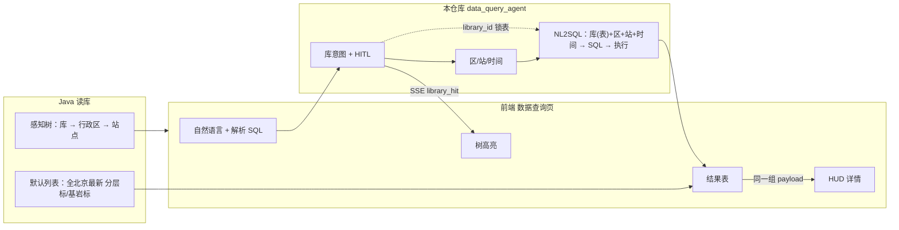
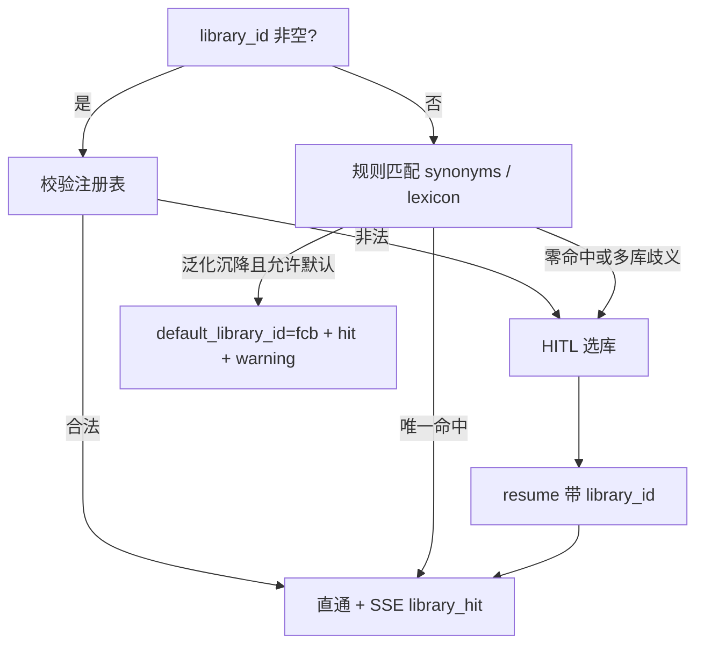

# 数据查询智能体实现方案

> **版本**：2026-09-01  
> **状态**：P0 已落地；**P1 已落地**；**P2-2 / P2-4 已落地**（`GET /hud` 供 Java 默认表补拉；前端第三节全文）  
> **修订**：  
> 1. NL2SQL 入参由「行政区/站点/时间」明确为 **「库 + 行政区 + 站点 + 时间」**（库锁定物理表，例如分层标 → `t_data_wash_fcb`）。  
> 3. §12 改为按方案拆开的完整开发计划（P0 依赖顺序与工作项、P1/P2、与 Java/前端并行分工）。  
> 4. P0 已实现：可选 `forced_tables`、`/data-query-agent/*` run/resume/stop/libraries、意图1+HITL、意图2、q_list+HUD、SSE。  
> 5. 补齐生产口径：年沉降为窗内终值−初值（无时间则近 365 天，不用「昨天」）；HITL session 与 checkpointer 双写（默认 redis checkpoint，session 未命中可回读）；`on_link_failure=refuse`；结构化日志含区/站/时间；地降 PG 集成测默认 skip（`NL2SQL_PG_SMOKE=1`）。查询台进程须 `NL2SQL_BUSINESS_DOMAIN=subsidence`。  
> 7. P1：库意图 LLM 默认开；session / trace 默认 redis（无 Redis 运行时回落 memory）。  
> 8. P2-2：`GET /data-query-agent/hud`；P2-4：前端第三节改为与实现零差的全文。解析路径仍一组 payload，不打该 GET。  
> **范围**：地降所前端「数据查询」模块中 **自然语言解析查询** 的算法端编排；**不含**左侧树加载、默认列表加载（由 Java 读库实现）。  
> **原型**：北京市沉降监测大模型 · 数据查询页；**「多维关联交互过滤器」本期不做**。  
> **关联**：  
> - 需求剖析：`docs/地降所需求及数据相关/需求梳理/智能数据查询及分析-需求剖析.md`  
> - 库表：`docs/地降所需求及数据相关/数据库结构及逻辑/数据库说明.md`  
> - NL2SQL 基座：`docs/基于地降所项目改造/NL2SQL基座改造.md`  
> - 综合分析智能体（模块形态对照，**不复用主链路**）：`docs/基于地降所项目改造/综合分析智能体改造.md`  
> - 看图诊断 HITL（interrupt/resume 对照）：`docs/看图诊断用户问题结构化解析人机协同实现方案.md`  
> - 前端四大板块：`docs/基于地降所项目改造/改造后前端UI及对应接口调用说明/地降所项目前端UI及对应接口调用说明.md`

---

## 0. 结论与决策摘要

### 0.1 产品定位

数据查询智能体是地降所四大板块中 **「数据查询」的算法臂**：把「树节点库（可空）+ 自然语言」解析为 **库 / 行政区 / 站点 / 时间** 四元约束，再调用 **NL2SQL 基座** 生成 SQL 并执行。其中 **库决定物理表**（分层标 → `t_data_wash_fcb`，基岩标 → `t_data_wash_jyb`，其余见 §2），禁止在未锁定库时让基座自行扫多表。同一条 SSE 依次下发「库命中 / HITL / 范围解析 / 列表+HUD」。

它 **不是** 综合分析报告，也 **不是** 智能客服 `data_query`（后者把 SQL 结果收成自然语言回答）。

| 板块 | 算法侧归属 | 说明 |
|------|------------|------|
| 智能问答 | 智能客服 `/chatbot` | RAG / 对话 |
| 自动报告生成 | 综合分析智能体 `/analysis-agent` | 取数 → 按章合成报告 |
| **数据查询（解析 SQL）** | **本模块 `/data-query-agent`** | 意图 → HITL? → NL2SQL → 结构化列表+HUD |
| 数据查询（树 / 默认表） | **Java 读库** | 算法端不实现 |
| 知识库 | RAG 管理面 `/rag` | 已有改造方案 |

### 0.2 框架决策（为何不套现网两套「综合分析」）

| 候选 | 结论 | 原因 |
|------|------|------|
| 综合分析 `/analysis/*` 主链路 | **不采用** | `intent_llm`→`plan_llm`→`acquire_data`→**synthesis 写报告**；`/analysis` 冻结维护 |
| 综合分析智能体 `/analysis-agent/*` 主链路 | **不采用主图** | `intent_rag`→全量 plan→**chapter_pipeline 写报告**；主路径已 **去掉 HITL** |
| 智能客服 `data_query` | **不采用** | 对话收口，无树命中、无选库 HITL、无列表/HUD 契约 |
| **本方案** | **新建独立编排** | 见下表「参考什么」 |

**参考、不整段搬代码：**

| 能力 | 参考对象 | 用法 |
|------|----------|------|
| 独立产品线（API / Graph / Trace / Stop，不 import 旧 runner） | 综合分析智能体 | 模块边界与 SSE 分事件、配置化清单 |
| 解析失败 interrupt → SSE → resume | 综合分析 · **看图诊断 scope HITL** | 仅抄交互形态；不接视觉臂、不接报告合成 |
| **库 / 行政区 / 站点 / 时间** + 生成 SQL + 执行 | **NL2SQL 基座** `NL2SQLService.query` | 四元约束注入后再 `query`；查询台 **显式传可选 `forced_tables`** 锁主表（§5.4）；不传则基座与现网一致 |
| 监测类型 ↔ 表 | `configs/nl2sql_business/subsidence/semantic/dimensions/device_type.yaml` + `scope_lexicon.json` | 「库」配置的事实源，与树节点、NL2SQL `device_type` / 表白名单对齐 |

**禁止：** 把数据查询做成某个 `analysis_type` / `subsidence_*` 报告类型，再「关掉 synthesis 凑合」。

### 0.3 目标主图

```text
POST /data-query-agent/run-stream
  → initialize
  → library_intent          ★ 意图1：库（树传入则直通）
        ├─ 成功 → SSE data_query_library_hit（前端高亮树）
        └─ 失败 → interrupt SSE data_query_library_input_required
                 → POST /resume-stream（用户选库）→ 再推 library_hit
  → scope_intent            ★ 意图2：行政区 / 监测站点 / 时间
        → SSE data_query_scope_parsed
  → acquire_data            ★ NL2SQL：【库(表)+区+站+时间】+ 可选锁表 forced_tables → 生成 SQL + 执行
                             列表（+ 按行实体 HUD 时序；两路 SQL 均带同一库表）
  → assemble_result         ★ hud_enabled + 列表 + hud_by_entity（站点另拷 hud_by_station）
        → SSE data_query_result
  → finalize                → finished
```

协作中断：`POST /data-query-agent/stream/stop`（`stream_id`）。

### 0.4 明确不做（本期）

1. 左侧感知树的加载、点击树节点后的 **非 NL 列表刷新**（Java）。  
2. 进入页面时 **默认全北京最新分层标/基岩标列表**（Java）。  
3. 原型中的 **多维关联交互过滤器**（行政区/岩性/速度阈值下拉）。  
4. 报告合成、章节 RAG、客服式自然语言收口。  
5. 地图联动、CSV 导出服务端实现（导出可由前端对当前表格做；非本模块必做）。  
6. 看图诊断视觉臂、综合分析 `analysis_plan_*` 多 q 报告计划。  
7. **不把锁表做成全局开关**，不改未传 `forced_tables` 的客服 / 综合分析 / 智能体 / 直连 `/nl2sql/query` / 看图诊断行为（基座仅增加可选入参，见 §5.4）。

### 0.5 HUD 按列表粒度（已拍板）

HUD 跟 **列表行实体** 走，不跟监测库走。七库站点列表本来就能 HUD；区/市行要 **SQL 内按日 AVG**，禁止用某站曲线冒充。岩性/层位/防灾策略无物理列：面板 `blocks` 占位 `unavailable`，不编造、不跨库拼水位。权威字典 **`hud_by_entity`**；`hud_by_station` 仅站点过渡（与 entity 同对象）。全市实体 id 固定 **`beijing`**。`include_hud=false` 仍只跑 `q_list`。契约见 §7。

---

## 1. 职责边界：Java vs 算法端 vs 前端



| 能力 | 实现方 | 算法端是否实现 |
|------|--------|----------------|
| 树：基岩标/分层标/地下水/孔压/GNSS/气象/光纤 + 行政区 + 站点及点数 | Java，对齐 `t_station` 与各 `t_data_wash_*` | **否** |
| 点击树节点展示对应列表（无自然语言） | Java | **否** |
| 默认列表（全北京最新分层标+基岩标） | Java | **否** |
| 「解析 SQL」：树库字段可空 + 自然语言 | **本模块** | **是** |
| 结果表 / HUD / 导出按钮渲染 | 前端；数据来自本模块 SSE（解析路径）或 Java（浏览路径） | 提供契约 |

**联调契约（必须一致）：** Java 树节点「库」的稳定 ID 必须与算法端库注册表 `library_id` 相同（见 §3），例如 `fcb` / `jyb`。前端点树后再点「解析 SQL」时，把该 ID 放入请求字段 `library_id`。

---

## 2. 库表与「库」对齐

与 `数据库说明.md`、NL2SQL 地降配置包一致：

| `library_id` | 展示名 | 物理表 | HUD 主序列（站=原始点；区/市=该列日 AVG） | 核心指标（HUD） |
|--------------|--------|--------|-------------------|-----------------|
| `fcb` | 分层标 | `t_data_wash_fcb` | `data_time` + `total_settle` | 最新累计沉降、年沉降量（窗内差值） |
| `jyb` | 基岩标 | `t_data_wash_jyb` | 同上 | 同上 |
| `dxswj` | 地下水 | `t_data_wash_dxswj` | `data_time` + `deep`（辅 `elevation`） | 最新埋深、年度变化 |
| `kxsylj` | 孔隙水压力 | `t_data_wash_kxsylj` | `data_time` + `pressure` | 最新孔压、年度变化 |
| `gnss` | GNSS | `t_data_wash_gnss` | `data_time` + `displacement_3d`（辅 2d） | 最新位移、年度变化 |
| `qxz` | 气象站 | `t_data_wash_qxz` | `data_time` + `temp` / `real_time_rain` | 气温、降水时序 |
| `gq` | 光纤 | `t_data_wash_gq` | `data_time` + `total_settle` | 同分层标口径 |

**库与表是一对一约束（查询台硬前置）：** 一次解析查询只锁定 **一个** `library_id`，SQL 的 FROM/JOIN 主事实表必须是上表对应行，禁止跨库 UNION（双库默认列表只属于 Java 浏览路径，见 §15）。落实方式：智能体在 `query` 时传入可选 **`forced_tables`**，基座将该请求 catalog 收到该表 + `t_station`（§5.4）；**其它调用方不传此字段，基座仍用全量地降表白名单。**

行政区：事实表 `project_name` = `t_station.name` → `t_station.area`。  
时间列：各事实表 `data_time`。

**与原型列名差异（必须写进前后端约定）：**

| 原型列 | 物理库 | 本模块策略 |
|--------|--------|------------|
| 年滑速 (mm/yr) | **无此列** | **不造列**。问「年沉降/年速率」用近 12 个月（或解析出的年窗）`total_settle` 终值−初值；展示字段名用 `annual_settle_mm`（或库对应年度变化） |
| 岩性 / 优势层 | **无此列** | 不查、不编造；问句出现岩性/第 N 层 → `lithology_unsupported`/`layer_unsupported`，HUD `blocks.geology=unavailable`，不 HITL |
| InSAR ID 等演示字段 | 演示数据 | 以 `station_id` / `station_name` / `t_station` 为准 |

未指明库且问「沉降/监测点」时，库解析 **默认 `fcb`（分层标）**，与 NL2SQL 语义层一致；若产品要求「默认分层标+基岩标双库」，见 **§15 开放问题**（建议 P1/P2，P0 单库以免 SQL 跨表）。

---

## 3. 库注册表（配置化，意图 1 + HITL 共用）

### 3.1 原则

**一份配置两用：**

1. 自然语言 → `library_id` 的匹配（同义词、表名、中文名）。  
2. HITL 下拉/卡片选项（`id` + `display_name` + 可选分组）。

不在 Python 里写死七库枚举。优先 **复用** 已有资产，再包一层查询台视图：

```text
configs/nl2sql_business/subsidence/semantic/dimensions/device_type.yaml
configs/nl2sql_business/subsidence/scope_lexicon.json   # device_types 短语
        ↓ 加载/校验
configs/data_query_agent/libraries.yaml                 # 查询台视图：排序、分组、HITL 文案、默认库
```

`libraries.yaml` 示意：

```yaml
version: "2026.08.27"
default_library_id: fcb          # 仅「泛化沉降」且未选手动树时
hitl_prompt: "未能确定监测库，请选择要查询的数据类型。"
groups:
  - id: geotech
    title: 岩土本底层压实
    libraries: [jyb, fcb]
  - id: fluid
    title: 流体赋存及应力
    libraries: [dxswj, kxsylj]
  - id: network
    title: 星地综合观测
    libraries: [gnss, qxz, gq]
libraries:
  - id: fcb
    display_name: 分层标
    table: t_data_wash_fcb
    device_type: fcb
    hud_supported: true
    core_metric: total_settle
    series_column: total_settle
    synonyms: [分层标, 分层, 层位监测]
  # … jyb / dxswj / kxsylj / gnss / qxz / gq
```

`id` **必须** 与 `device_type.yaml` 的 `id`、Java 树「库」节点 ID 三方一致。

### 3.2 只读配置接口（供前端 HITL 与联调）

`GET /data-query-agent/libraries` → 返回分组 + 库列表（无密钥侧仍走统一 `SERVICE_API_KEY`）。  
Java/前端树也可直接内置同一 ID，不必强依赖该接口；HITL 选项 **必须** 以该接口或请求中断事件里的 `library_options` 为准，避免前后端词表漂移。

---

## 4. 输入模型与两种查询路径

### 4.1 请求字段

`POST /data-query-agent/run-stream` 核心字段：

| 字段 | 必填 | 说明 |
|------|------|------|
| `user_id` / `session_id` | 是 | 与现网会话规范一致 |
| `query` | 是 | 自然语言；空串拒绝 |
| `library_id` | 否 | 左侧树当前选中的 **库** 节点；未选树或不选库则为 `null` |
| `options.max_rows` | 否 | 列表截断，默认对齐 `NL2SQL` / 分析侧行数上限 |
| `options.include_hud` | 否 | 默认 `true`：按列表行实体附带 HUD（站/区/市）；`false` 仅列表 |
| `options.expose_sql` | 否 | 默认 `false`；联调可在结果中带 `sql` |
| `district` / `station_id` | 否 | P1：树点到区/站且走解析 SQL 时传入；**显式入参优先于问句解析（覆盖，非 AND）** |

**树节点粒度：** 本期算法 **只消费「库」一级**（`fcb` 等）。用户点到「朝阳区 / 某站点」且 **不走解析 SQL** 时由 Java 过滤列表。若后续要把树的区/站也传给解析臂，可扩展 `district` / `station_id` 可选字段（P1），P0 区/站只从 `query` 解析。

### 4.2 路径 1：树选库 + 自然语言

```text
library_id = "fcb"
query = "朝阳区年沉降比较大的监测点"
```

- 意图 1 **直通**（不再用 NL 猜库）。  
- 仍推 `data_query_library_hit`，便于前端确认高亮（即使用户已点过树）。  
- 若 NL 明显指向另一库（如「查 GNSS」），**树选优先**，SSE `warnings` 增加 `library_conflict_nl_ignored`（不 HITL）。

### 4.3 路径 2：仅自然语言

```text
library_id = null
query = "大兴区有哪些分层监测点？"
```

- 意图 1 必须解析；成功则 `library_hit` 驱动前端高亮对应库节点。  
- 失败（无命中 / 多库歧义且无法默认）→ HITL。

热点标签（「通州…」「昌平…」）只是前端把文案填进输入框，**不另做接口**。

---

## 5. 两次意图识别

两次意图都在 **调用 NL2SQL 生成 SQL 之前** 完成，并作为 **同一条流** 的前置事件。不要等 SQL 跑完再给前端树高亮。

NL2SQL 基座的入参不是「只有区/站/时间」，而是四元约束一并注入后再生成并执行 SQL：

```text
【库 library_id → 物理表】 + 【行政区】 + 【监测站点】 + 【时间范围】
        ↓
  NL2SQLService.query（查询台带 forced_tables；生成 SQL + 执行）
```

例：库=`fcb`（分层标）⇒ 主表必须是 `t_data_wash_fcb`；库=`gnss` ⇒ `t_data_wash_gnss`。区/站/时间只决定 WHERE，**不能**反过来决定查哪张表。意图 1 未成功（含 HITL 未完成）时 **禁止** 进入 `acquire_data`。

### 5.1 意图 1：库



**规则优先级（P0，与基座 `intent_parse_mode=rule` 对齐）：**

1. 请求 `library_id` 合法 → 采用。  
2. `query` 命中注册表同义词 / `scope_lexicon.device_types` → 唯一则采用。  
3. 未命中库词，但命中泛化沉降词（沉降、下沉、监测点等）且未出现 GNSS/水位等冲突词 → `default_library_id`。  
4. 命中 **两个及以上** 库 → HITL（`interrupt_reason=library_ambiguous`）。  
5. 完全无法判定 → HITL（`interrupt_reason=library_unresolved`）。

P1 可加轻量 LLM 补全，结果必须回写注册表校验，未入表不得采用。

**成功事件（前端高亮树）：**

```json
{
  "event": "data_query_library_hit",
  "request_id": "…",
  "library_id": "fcb",
  "display_name": "分层标",
  "table": "t_data_wash_fcb",
  "source": "request | parsed | default | hitl",
  "warnings": []
}
```

`source=parsed|default` 时前端应选中/高亮对应库节点；`source=request` 可只做确认。

### 5.2 意图 2：行政区、监测站点、时间范围

在 **库已确定** 后执行（库已在意图 1 锁定表，本步只补齐 WHERE 维）。**不因区/站/时间为空而 HITL**（空 = 该维不限制：全区 / 全站 / 时间按 §7.3 默认「每站最新」；时间规则与基座现网一致，地降当前 `anchor_fallback_now_enabled=false`）。

**实现：** 直接调用基座 `resolve_question_intent(query)`（`app/nl2sql/question_intent.py`），读取已有地降字段：

| 解析项 | 来源 | 基座字段 |
|--------|------|----------|
| 行政区 | `scope_parser_subsidence` + `scope_lexicon.districts` | `scope.district` |
| 监测站点 | 词表 `stations[]` | `scope.station_id` / `station_name` |
| 时间窗 | 现网时间规则 | `time_window` / `time_anchor` / `statistical_time_range` |

意图 2 **不得**改写意图 1 的库/表。组装给 NL2SQL 的 `confirmed_scope` 时，`device_type` **必须**来自意图 1 的 `library_id`，即使问句里的监测类型词与树选不一致（树选优先，见 §4.2）。

**事件：**

```json
{
  "event": "data_query_scope_parsed",
  "request_id": "…",
  "library_id": "fcb",
  "table": "t_data_wash_fcb",
  "scope": {
    "district": "朝阳区",
    "station_id": null,
    "station_name": null,
    "device_type": "fcb"
  },
  "time": {
    "time_window_tag": null,
    "statistical_time_range": {"start": "…", "end": "…"}
  },
  "parse_mode": "rule"
}
```

前端本期可以只消费 `library_hit`；`scope_parsed` 供调试、后续芯片展示或 Java 侧同步筛选（过滤器已砍，不强制 UI）。

### 5.3 注入 NL2SQL：库 + 行政区 + 站点 + 时间（生成 SQL + 执行）

**硬规则：** `acquire_data` 每次调用 `NL2SQLService.query` 前，四元约束必须已齐（库必填；区/站/时间可空）。

| 约束 | 必填 | 作用 | 未填时 |
|------|------|------|--------|
| **库** `library_id` → 物理表 | **是** | 决定 FROM 主表与指标列（分层标=`t_data_wash_fcb`，基岩标=`t_data_wash_jyb`，地下水=`t_data_wash_dxswj`，…） | **不得调 NL2SQL**（回 HITL 或失败） |
| **行政区** | 否 | WHERE `t_station.area` | 不限制行政区 |
| **监测站点** | 否 | WHERE `station_id` / `station_name` | 不限制站点（仍按库表查该类型全部站） |
| **时间** | 否 | WHERE `data_time` 窗口 | 列表默认每站最新一条；HUD 序列用配置回溯窗 |

`q_list` 与 `q_hud_series` **共用同一套四元约束**（同一张库表），只是 SELECT 粒度不同（代表值 vs 时序）。

调用 `NL2SQLQueryRequest`：

| 字段 | 赋值 |
|------|------|
| `question` | 用户原句；可追加一句程序合成的约束短句（见下） |
| `time_intent_text` | 用户原句（与综合分析一致，避免附录污染时间） |
| `original_query` | 用户原句 |
| **`forced_tables`** | **查询台必传**（库已锁定后）：如 `["t_data_wash_fcb"]`。**现网其它调用方不传**（`null`/省略）。见 §5.4 |
| `confirmed_scope` | **必含** `device_type=library_id`；另含已解析的 `district` / `station_id` / `station_name`（有则填）。须在意图 1+2 都完成后整包传入（一旦传入基座不再从问句解析区/站） |
| `structured_filters` | 区/站有则写入，与 chain 内 `scope_literals` 合并。**不能**用这里的 `table=` 代替 `forced_tables`（现网改写无 `@table`，不会收窄 catalog） |
| `sql_gen_extra_hint` / `scope_intent_text` | 显式写「主表为该库表」；锁表以 `forced_tables` 为准，hint 只辅助生成 |
| `analysis_type` | 固定 `data_query`（**不要**用 `subsidence_quarterly` 等报告类型，以免 QA 五元组串库） |
| `plan_item_id` | `q_list` / `q_hud_series` |
| `record_conversation` | `false` 或由服务层关闭中间轮（对齐分析内嵌） |
| `disable_qa_slot_replay` | `true`（查询台问句长尾，禁止报告槽 SQL 回放） |

合成短句示例（拼进 `scope_intent_text` 或 `sql_gen_extra_hint`）：

```text
【库】分层标 library_id=fcb，主表必须是 t_data_wash_fcb，禁止查询 jyb/gnss/地下水等其它监测表。
【行政区】朝阳区；【站点】未指定；【时间】未指定则每站取最新 data_time。
查询各监测站点最新记录。
```

语义链接保持地降 `linked_only` + `refuse`。查询台在传入 `forced_tables` 后：链接主事实表 **必须等于** 该列表中的库表（可另 JOIN `t_station`）；链到其它 `t_data_wash_*` 或 `refuse` 时，本模块视为取数失败，SSE `data_query_error`，**不再**为此 HITL（库已确认，属于生成/链接错误而非选库问题）。

### 5.4 NL2SQL 基座：可选锁表（兼容不锁表）

现网基座 **不能**仅靠 `confirmed_scope.device_type` 或问句语义保证「只查一张库表」：

- `table_scope.txt` 是 **全量** `t_data_wash_*` + `t_station`；`_resolve_table_scope` 无「本请求只准一张事实表」入参。  
- `align_semantics()` 按 **问句文本** 匹配监测类型；含「沉降/监测点」且未写库名时默认 `fcb`，**不读取** `intent.scope.device_type`。  
- 因此：树选 `jyb` 但问句是「朝阳区沉降大的点」，现网仍可能链到 `t_data_wash_fcb`。

**实现策略（已拍板）：锁表 = 请求级可选增强，非全局开关。**

| 调用 | `forced_tables` | 行为 |
|------|-----------------|------|
| 客服 / 综合分析 / 综合分析智能体 / `POST /nl2sql/query` / 看图诊断 | **不传**（`null` 或省略） | **与改造前完全一致**：全表白名单、按问句语义链接、可多表候选 |
| 数据查询智能体（库已锁定） | **必传**，如 `["t_data_wash_fcb"]` | **仅本请求** catalog = 这些表 + `t_station`；不得链到其它 `t_data_wash_*` |

开关只看 **本字段是否非空**，不要用下列信号自动开锁表（否则会改掉「没传锁表」的旧链路）：

- 已传入 `confirmed_scope`（看图诊断已在用，且是锅炉字段）；  
- 问句或 `confirmed_scope` 里出现了 `device_type`（地降现网解析本来就会带上）。

#### 5.4.1 基座改动面（小、默认可关）

| 位置 | 改法 | 不传 `forced_tables` 时 |
|------|------|-------------------------|
| `NL2SQLQueryRequest` | 新增可选 `forced_tables: list[str] \| None = None` | 字段缺省，旧调用方零改动 |
| `NL2SQLChain.generate_sql_with_validation_context` | 把该列表传到 table_scope / link | 走现网 `_resolve_table_scope`（profile 全量白名单） |
| `_resolve_table_scope` | 非空则 `allowed = forced ∪ {t_station}`（表名须仍在 profile 白名单内，防乱传） | 现网逻辑 |
| `align_semantics` | **仅当本请求 forced 非空** 时：用 `intent.scope.device_type`（及 forced 表）覆盖问句别名 / 「沉降→fcb」默认 | **禁止**无条件改成「有 device_type 就锁表」 |
| `link_schema` | forced 非空时候选主表只来自 forced；辅助表不得再挂其它 `t_data_wash_*`；链出范围则 `failed` + 现网 `on_link_failure`（查询台用 `refuse`） | 现网最多 3 候选 + 辅助表 |

**明确不改：** Prompt 主模板结构、SQL 执行器、时间规则、区/站词表与 `@district` 等改写、为 HUD 单独做流式 SQL、全局 `NL2SQL_*` 默认值。

#### 5.4.2 智能体侧约定

1. 意图 1 未成功（含 HITL 未完成）→ **不调用** `query`，也就 **不传** `forced_tables`。  
2. 意图 1 成功后，`forced_tables = [注册表中该 library 的 table]`（P0 一库一张表）；`q_list` 与 `q_hud_series` **同一列表**。  
3. 同时传齐 `confirmed_scope`（库 + 已解析区/站）与 `time_intent_text`/`original_query`。  
4. 不把 `structured_filters.table` 当作锁表实现。

过渡期若基座尚未合入本字段：可用问句前缀 + `sql_gen_extra_hint` + 生成后检查 FROM 兜底，**仅作联调**，不能替代 §5.4.1（冲突问句仍会选错表）。

---

## 6. HITL（仅意图 1）

### 6.1 为何抄看图诊断而不是智能体

综合分析智能体 T1 已删除主路径缺数 HITL；现网完整 interrupt/resume 在 **看图诊断**。本模块只复用：

- checkpoint + `resume_token`  
- SSE 中断事件（流在 `finished` 之前结束本轮，前端改调 resume）  
- resume 后续流事件与首流同一套

不复用机组/受热面字段、视觉预览、二次 DB existence 校验循环（库选项来自配置，无需查 `t_station` 证明库存在）。

### 6.2 中断事件

```json
{
  "event": "data_query_library_input_required",
  "request_id": "…",
  "resume_token": "dq_…",
  "interrupt_reason": "library_unresolved | library_ambiguous | library_id_invalid",
  "prompt": "未能确定监测库，请选择要查询的数据类型。",
  "candidates": ["fcb", "gnss"],
  "library_options": [
    {"id": "fcb", "display_name": "分层标", "group": "岩土本底层压实"},
    {"id": "jyb", "display_name": "基岩标", "group": "岩土本底层压实"}
  ],
  "query": "原始问句",
  "suggested_actions": ["select_library", "abort"]
}
```

`library_options` = 注册表全量（分组后），与 `GET /libraries` 同源。`candidates` 为歧义时的建议子集，前端可高亮。

### 6.3 恢复

`POST /data-query-agent/resume-stream`

```json
{
  "user_id": "…",
  "session_id": "…",
  "resume_token": "dq_…",
  "library_id": "fcb"
}
```

校验 `library_id` ∈ 注册表后：推 `library_hit`（`source=hitl`）→ `scope_intent` → 用 **该库表 + 区/站/时间** 调 NL2SQL → 结果。  
非法 ID 再次 interrupt（限次，如 5 次，防死循环）。  
用户放弃：前端 stop 或 resume 带 `abort=true` → `data_query_cancelled` + `finished`。

Checkpoint：`DATA_QUERY_AGENT_CHECKPOINT_BACKEND` **默认 `redis`**（多 worker HITL 可 resume）；本地无 Redis 时可显式设 `memory`。

---

## 7. 数据展示逻辑与取数计划

### 7.1 同一组查询数据

列表与 HUD **不二次请求**。一次 `run-stream`（含 resume）的终局同时包含 `list`、`hud_enabled`，以及（当 `hud_enabled=true`）**`hud_by_entity`**。站点查询额外保留 **`hud_by_station`**（与 `hud_by_entity` 同对象，供旧前端）。

HUD 跟 **列表行实体** 走，不跟监测库走。七库在站点维均已支持 HUD；区/市行要 **聚合时序**，不能把某站曲线当成该区/市。库表只有「监测点 × `data_time` × 该库指标」；区来自 `t_station.area`，无区日表/市日表/层位表。

Java 默认表若要 HUD：自组同等结构，或 **`GET /data-query-agent/hud?library_id=&entity_type=&entity_id=`**；解析路径仍一组 payload，点行不打该接口。

### 7.2 实体粒度与 `hud_enabled`

| `result_grain` | `hud_entity_type` | `hud_entity_id` | 时序含义 | 按钮 |
|----------------|-------------------|-----------------|----------|------|
| `station` / `station_series` | `station` | `station_id` | 该站该库原始序列 | 有 |
| `district` | `district` | `t_station.area`（如朝阳区） | 该区该库 **日 AVG** | 有 |
| `city` | `city` | 固定 `beijing` | 全市该库日 AVG | 有（`HUD_CITY_ENABLED`，默认 true） |
| `unknown` | — | — | — | 无 |
| 层位（无表） | `layer` 预留 | `{station_id}:{layer_no}` | 有层表后再取 | **不启用** |

```text
hud_enabled = include_hud ∧ library.hud_supported
            ∧ grain ∈ {station, station_series, district, city}
            ∧ 至少 1 个可解析 entity_id
```

行上：`hud_entity_type` / `hud_entity_id` / `hud_available`。超实体上限（站 50 / 区 16）的行 `hud_available=false`，`warnings: hud_series_truncated`。

**禁止：** `type=district|city` 却填某个 `station_id` 的 `points`。

计划侧仍按意图选 `q_list` 形态；结果侧：计划站点但行只有区 → 校正为 `district`。

### 7.3 取数：`q_list` + `q_hud_series`（按 grain 分叉）

| `plan_item_id` | 何时 | 目的 |
|----------------|------|------|
| `q_list` | 每次 | 站点一行一站；区/市为聚合表 |
| `q_hud_series` | `include_hud` 且 grain 在 §7.2 时序计划中 | **站点**：`station_id, data_time, 序列列`；**区**：`area, 日桶, AVG(序列列)`；**市**：`日桶, AVG` |

并行 max 2；`include_hud=false` 只跑 `q_list`。两路同一 `forced_tables` 与区/站/时间。`q_list` 站点约束同前（每站最新、库度量列、年变化窗内终值−初值、LIMIT）。

区/市 HUD **在 SQL 内聚合**，禁止先拉全区所有站原始点再在进程里平均。时间桶默认日（PG `date_trunc('day', data_time)`）。点数上限共用 `HUD_MAX_POINTS_PER_STATION`（200）。仅序列失败：列表仍成功，`warnings: hud_series_failed`，对应实体 `points=[]`。

### 7.4 终局契约

站点示例在 `hud_by_station` / `hud_by_entity` 均出现；区示例只在 `hud_by_entity`。

```json
{
  "event": "data_query_result",
  "library_id": "fcb",
  "result_grain": "station",
  "hud_enabled": true,
  "columns": [{"key": "station_id", "title": "测位 ID"}],
  "list": [{
    "station_id": "JZGZ",
    "hud_available": true,
    "hud_entity_type": "station",
    "hud_entity_id": "JZGZ"
  }],
  "hud_by_entity": {
    "JZGZ": {
      "entity_type": "station",
      "entity_id": "JZGZ",
      "title": "金盏公交 · 分层标",
      "library_id": "fcb",
      "identity": {"station_id": "JZGZ", "area": "朝阳区", "grain": "station"},
      "core_metrics": [{"id": "total_settle_mm", "name": "历史累计沉降", "value": -418.5, "unit": "mm"}],
      "series": {"metric": "total_settle", "unit": "mm", "agg": null, "points": [{"t": "2020-01-01", "v": -10.2}]},
      "blocks": {
        "geology": {"status": "unavailable", "reason": "no_column", "layer": null, "lithology": null},
        "strategy": {"status": "unavailable", "reason": "no_source", "items": []}
      }
    }
  },
  "hud_by_station": {"JZGZ": "（与 hud_by_entity.JZGZ 同一对象）"}
}
```

区行：`hud_entity_id=朝阳区`，`series.agg=avg`，`time_bucket=day`。`hud_enabled=false` 时无 `hud_by_*`。`columns` 随库变化。`sql` 仅 `expose_sql`。负值下沉口径不变。

前端：优先 `hud_by_entity[row.hud_entity_id]`；否则回退 `hud_by_station[station_id]`。`blocks.*.status` 为 `unavailable` / `unsupported` 则 **不渲染该块**（不要画空「防灾策略」）。

### 7.5 面板占位（无物理列则永不编造）

| 块 | 站点/区/市（有库） | 层位 |
|----|-------------------|------|
| identity / core_metrics / series | `ok`（区市 series 为聚合） | 不启用 HUD |
| geology（岩性/层位） | `unavailable` `no_column`；问句含岩性/第 N 层另 `warnings: lithology_unsupported, layer_unsupported` | 有 `layered_fcb` 表后再做 `entity_type=layer` |
| strategy（防灾策略） | `unavailable` `no_source` | 同左 |
| 跨库指标（如分层标 HUD 里的水位） | 一请求一库，占位 `cross_library_not_in_scope`（本期不输出该块） | — |

气象双序列（温/雨）仍是同一实体上的多度量，不是新 grain（P1 配 `series_columns`）。

### 7.6 非站点维

「各区分层标最新平均沉降」→ `result_grain=district`，`hud_enabled=true`，折线为 **朝阳区等各区的日平均**，不是区内某站。全市一行实体 `beijing`。

---

## 8. SSE 与前端监听

### 8.1 事件序（无 HITL）

```text
started { request_id, stream_id }
data_query_library_hit
data_query_scope_parsed
data_query_nl2sql_progress        # 可选，q_list / q_hud_series done
data_query_result
finished { trace_id, status }
```

编码对齐现网：`text/event-stream`，每帧 JSON；`event` 字段在 JSON 内（与 analysis / analysis_agent 一致，便于网关）。

### 8.2 有 HITL

```text
started
data_query_library_input_required   # 本轮流结束；无 finished 或 finished.status=interrupted
        → 用户选库
POST resume-stream
started                             # 或续流无第二 started，实现时二选一，建议与看图诊断对齐：续流继续推事件
data_query_library_hit              # source=hitl
data_query_scope_parsed
data_query_result
finished
```

**推荐与看图诊断一致：** 中断帧出现后连接结束；resume 新开 SSE。前端用同一 `request_id` 关联。

### 8.3 前端逻辑（对应需求 d.iii）

1. 监听 `data_query_library_hit` → 高亮/选中左侧树对应 **库** 节点。  
2. 监听 `data_query_library_input_required` → 弹出库选择（选项用事件内 `library_options`）→ `resume-stream`。  
3. 监听 `data_query_result` → 渲染表；`hud_enabled` 控制操作列；点 HUD 优先读 `hud_by_entity[hud_entity_id]`，否则 `hud_by_station[station_id]`。`blocks` 非 `ok` 不渲染。区/市折线须展示为平均（`series.agg=avg`）。  
4. `stream/stop`：用户离开页或取消解析。

不要用报告类 `summary_delta` 当列表；列表只来自 `data_query_result`。

### 8.4 HTTP 一览

| 方法 | 路径 | 说明 |
|------|------|------|
| POST | `/data-query-agent/run-stream` | 主入口 SSE |
| POST | `/data-query-agent/resume-stream` | 选库后续流 |
| POST | `/data-query-agent/stream/stop` | 协作取消 |
| GET | `/data-query-agent/libraries` | 库注册表 |
| GET | `/data-query-agent/hud` | P2-2：Java 默认表按实体补拉 HUD（`library_id`+`entity_type`+`entity_id`） |
| GET | `/data-query-agent/traces`、`/traces/stats`、`/trace/{request_id}` | P1 trace（`data_query_agent:trace:*`） |

鉴权：`Authorization: Bearer <SERVICE_API_KEY>`。开关：`DATA_QUERY_AGENT_ENABLED`（关闭时路由 503，与智能体一致）。

---

## 9. 代码与模块边界

### 9.1 建议目录

```text
app/
├── api/data_query_agent.py
├── models/data_query_agent.py
├── services/data_query_agent_service.py      # SSE 门面、stop、trace
├── services/data_query_agent_trace_store.py  # 可先 memory，P1 redis
└── data_query_agent/
    ├── catalog.py           # 加载 libraries.yaml + 与 device_type 校验
    ├── library_intent.py    # 意图1：锁定 library_id ↔ 物理表
    ├── scope_intent.py      # 意图2：区/站/时间（不改库）
    ├── acquire.py           # 四元约束 + forced_tables 后 NL2SQLService.query × 1～2
    ├── assemble.py          # grain / 按实体 HUD / hud_by_entity
    ├── hitl.py              # resume_token，抄 session_store 模式
    └── graph/
        ├── state.py
        ├── builder.py
        ├── nodes.py
        └── runner.py
configs/data_query_agent/
    libraries.yaml
    plan.yaml
```

**禁止 import：** `AnalysisGraphRunner`、`AnalysisSynthesisV2Engine`、`AnalysisAgentGraphRunner` / `SlotOrchestrator`。  
**允许调用：** `NL2SQLService`、`resolve_question_intent`、`VLLMHttpClient`（仅 P1 库意图 LLM）、`ConversationManager`（可选落用户原问）、现有 checkpoint/redis 工具（可拷贝精简，避免和智能体 HITL 开关缠在一起）。  
**允许改基座（仅 §5.4）：** `NL2SQLQueryRequest.forced_tables` 及 chain 在该字段非空时的 catalog / 语义链接收窄；未传时路径禁止行为变化。

LangGraph 不可用时：`sequential_fallback` 同序执行；HITL 仍需要 checkpointer ≠ none。

### 9.2 主图节点

| 节点 | 职责 |
|------|------|
| `initialize` | 校验 ID、空 query、生成 `request_id`/`stream_id` |
| `library_intent` | §5.1；置 `library_id` 或 `needs_library_hitl` |
| `library_hitl` | `interrupt`；仅条件边进入 |
| `scope_intent` | §5.2 |
| `acquire_data` | 注入 **库(表)+区+站+时间** 且 **必带 `forced_tables`** 后 `q_list`（+ 条件 `q_hud_series`） |
| `assemble_result` | 契约组装，push `data_query_result` |
| `finalize` | trace、会话 |

条件边：`library_intent` → `library_hitl` | `scope_intent`。

**不做：** `intent_rag`、`chapter_pipeline`、synthesis、业务 RAG。

---

## 10. 配置与环境变量

部署前置：`NL2SQL_BUSINESS_DOMAIN=subsidence`（与报告/基座同一进程）。

建议增量（写入 `.env.example` 「G3. 数据查询智能体」）：

| 变量 | 默认 | 说明 |
|------|------|------|
| `DATA_QUERY_AGENT_ENABLED` | `true` | 总开关；`false` 时路由 503（与智能体一致） |
| `DATA_QUERY_AGENT_CHECKPOINT_BACKEND` | `redis` | HITL checkpointer；无 Redis 的本地/单测可设 `memory`。生产与 session_store 双写，resume 可回读 checkpoint |
| `DATA_QUERY_AGENT_SESSION_STORE_BACKEND` | `redis` | resume_token；无 Redis 时运行时回落 memory。单测可设 `memory` |
| `DATA_QUERY_AGENT_LIBRARY_LLM_ENABLED` | `true` | 规则零命中时 LLM 补召回；结果必须 ∈ 注册表。单测可关 |
| `DATA_QUERY_AGENT_TRACE_BACKEND` | `redis` | 键前缀 `data_query_agent:trace:*`，不写入 analysis 索引；无 Redis 回落 memory |
| `DATA_QUERY_AGENT_TRACE_TTL_MINUTES` | `1440` | |
| `DATA_QUERY_AGENT_HUD_LAYER_ENABLED` | `false` | 无层位表则永不点亮 |
| `DATA_QUERY_AGENT_STRATEGY_BLOCK_ENABLED` | `false` | 防灾策略块默认关 |
| `NL2SQL_BUSINESS_DOMAIN` | （部署既有） | 查询台须为 `subsidence`，与报告同进程可共用 |
| `DATA_QUERY_AGENT_ACQUIRE_MAX_PARALLEL` | `2` | |
| `DATA_QUERY_AGENT_HUD_MAX_STATIONS` | `50` | 站点 HUD 实体上限 |
| `DATA_QUERY_AGENT_HUD_MAX_DISTRICTS` | `16` | 区 HUD 实体上限（北京 16 区） |
| `DATA_QUERY_AGENT_HUD_MAX_POINTS_PER_STATION` | `200` | 站/区/市序列降采样点数 |
| `DATA_QUERY_AGENT_HUD_CITY_ENABLED` | `true` | 全市行是否给 HUD |
| `DATA_QUERY_AGENT_DEFAULT_MAX_ROWS` | `500` | |
| `DATA_QUERY_AGENT_LIBRARIES_FILE` | `configs/data_query_agent/libraries.yaml` | |

不复用 `ANALYSIS_*` / `ANALYSIS_AGENT_*` 开关，避免查询台误开报告 HITL/RAG。

---

## 11. 可观测性

P0：结构化日志（`library_id`、对应 `table`、区/站/时间快照、`source`、HITL reason、`result_grain`、`hud_enabled`、NL2SQL `error_code`）。  
P1：独立 trace 前缀 `data_query_agent:trace:*`，字段含四元约束、两路 SQL 摘要（须能看出 FROM 表）、行数、降级 warning；**不要**写入综合分析 / 智能体 trace 索引以免混查。

指标建议：`data_query_agent_runs_total{status,hitl}`、`data_query_agent_library_hitl_total{reason}`、NL2SQL 复用基座计数即可。

---

## 12. 开发计划（分期）

原则：

- **P0** 交付「解析 SQL」可联调闭环（意图 → HITL → 锁表 NL2SQL → 列表+HUD SSE）。  
- **Java 树 / 默认列表与 P0 并行**，不阻塞算法；但 `library_id` 三方约定（§3）须在 P0 开工前锁定。  
- 基座 **可选 `forced_tables` 必须先于** 查询台 `acquire_data` 合入（否则锁表无硬保证）。  
- 不做 §0.4 清单（过滤器、报告合成、树加载等）。

建议节奏（可按人力压缩，**依赖顺序不可反**）：

```text
P0-A 基座锁表 ─┐
P0-B 配置/骨架 ─┼─→ P0-C 意图1+HITL ─→ P0-D 意图2+取数+组装 ─→ P0-E SSE/Stop/联调
                └─→ （并行）Java 树与默认表、前端监听契约
P1 增强    P2 扩展
```

---

### 12.1 P0 — 可联调闭环（算法端必做）

#### 12.1.0 前置（开工前 0.5～1 天，无代码也可）

| 编号 | 事项 | 产出 | 验收 |
|------|------|------|------|
| P0-0.1 | 与 Java/前端锁定七库 `library_id` 与展示名 | 对照表（同 §2 / `device_type.yaml`） | 三方 ID 一致，无「分层标/fcb」混用 |
| P0-0.2 | 拍板 §15：泛化沉降默认 `fcb`；无时间则每站最新；HUD 一组数据+上限 | 纪要或本节默认即方案默认 | 开发不返工口径 |
| P0-0.3 | 确认部署 `NL2SQL_BUSINESS_DOMAIN=subsidence` | 环境说明 | 查询台与报告同进程可连地降库 |

#### 12.1.1 P0-A：NL2SQL 基座可选锁表（§5.4）— **查询台取数的前置**

| 编号 | 工作项 | 主要改动 | 验收 |
|------|--------|----------|------|
| P0-A.1 | 请求模型增加可选 `forced_tables` | `app/models/nl2sql.py`；字段说明：省略=现网行为 | 旧调用方不传即可编译运行 |
| P0-A.2 | chain 透传至 table_scope / link | `generate_sql_with_validation_context` 增加参数；`NL2SQLService.query` 传入 | 不传时调用链与现网一致 |
| P0-A.3 | `_resolve_table_scope`：非空则 `forced ∪ {t_station}`，且须 ⊆ profile 白名单 | `app/nl2sql/chain.py` | 乱传表名被拒；合法 fcb 时 catalog 不含其它 wash 表 |
| P0-A.4 | `align_semantics`：**仅 forced 非空** 时用 `device_type`/forced 表覆盖问句「沉降→fcb」 | `semantic_layer.py`（或 chain 在 forced 时覆写 binding） | 不传 forced：泛化沉降仍默认 fcb（现网） |
| P0-A.5 | `link_schema`：forced 时禁止辅助其它 `t_data_wash_*`；链出则 failed + `refuse` | `schema_linker.py` | 树选 jyb + 问句含「沉降」仍主表 jyb |
| P0-A.6 | 基座单测 + **不传 forced 回归** | `tests/test_nl2sql_*`：锁表用例 + 现网 golden/直连 query 不传字段 | CI：客服/分析相关 NL2SQL 单测不红 |

**本阶段不做：** 改 Prompt 主模板、执行器、时间规则、全局 env。

#### 12.1.2 P0-B：查询台模块骨架与配置

| 编号 | 工作项 | 主要改动 | 验收 |
|------|--------|----------|------|
| P0-B.1 | 配置 `libraries.yaml`（七库、分组、同义词、表、core_metric/series、默认 fcb、HITL 文案） | `configs/data_query_agent/libraries.yaml` | 与 `device_type.yaml` 校验通过 |
| P0-B.2 | 配置 `plan.yaml`（`q_list` / `q_hud_series` 问句模板占位） | `configs/data_query_agent/plan.yaml` | 按库可替换主表与度量列 |
| P0-B.3 | `AnalysisConfig` 风格的 `DataQueryAgentConfig` + `.env.example` G3 | `app/core/config.py`、`.env.example` | `DATA_QUERY_AGENT_ENABLED` 默认 **true**；`DATA_QUERY_AGENT_CHECKPOINT_BACKEND` 默认 **redis** |
| P0-B.4 | 目录与模型：Run/Resume/Stop 请求响应 | §9.1；`app/models/data_query_agent.py` | `query` 必填；`library_id` 可选 |
| P0-B.5 | `catalog.py` 加载+与 device_type 交叉校验 | 非法配置启动失败或 503 说明 | 缺表/错 id 可发现 |
| P0-B.6 | 路由挂载：开关关闭 503；鉴权同现网 | `app/api/data_query_agent.py`、`main.py` tag | OpenAPI 可见；未开开关不 404 |
| P0-B.7 | `GET /data-query-agent/libraries` | 分组 + `library_options` 同源 | 前端 HITL 可只用此接口或中断事件 |

#### 12.1.3 P0-C：意图 1 + HITL + Stop（尚不取数也可先测事件）

| 编号 | 工作项 | 对应方案 | 验收 |
|------|--------|----------|------|
| P0-C.1 | `library_intent`：树传入直通；规则匹配；默认 fcb；歧义/未解析/非法 id → HITL | §5.1、§4.2～4.3 | §13 表：路径1/2、查数据、对比两库、非法 id |
| P0-C.2 | 树选与 NL 库冲突：树优先 + `library_conflict_nl_ignored` | §4.2 | warning 出现且不 HITL |
| P0-C.3 | SSE `data_query_library_hit`（含 `table`、`source`） | §5.1 | 前端可高亮库节点 |
| P0-C.4 | LangGraph `interrupt` + `resume_token`；事件 `data_query_library_input_required`（全量 `library_options` + `candidates`） | §6.2 | 与看图诊断一样：中断后断流，resume 新开 SSE |
| P0-C.5 | `POST /resume-stream`：合法库续跑；非法再 interrupt（上限 5）；`abort` 取消 | §6.3 | resume 后 `source=hitl` 再进入意图 2 |
| P0-C.6 | checkpoint 默认 redis；无 Redis 环境可改 memory | §6.3、§10 | HITL resume 可测通；生产与默认一致走 redis |
| P0-C.7 | `POST /stream/stop` + `started.stream_id` | §8.3 | acquire 前 stop → `cancelled`，无成功 result |
| P0-C.8 | 图：`initialize` → `library_intent` →（条件）`library_hitl`；无 langgraph 时 sequential + HITL 仍要 checkpointer | §9.2 | 空 query 422；未锁库不进 acquire |

#### 12.1.4 P0-D：意图 2 + 锁表取数 + 列表/HUD 组装

| 编号 | 工作项 | 对应方案 | 验收 |
|------|--------|----------|------|
| P0-D.1 | `scope_intent`：调用 `resolve_question_intent(query)`；**不改** library | §5.2 | SSE `data_query_scope_parsed` 含区/站/时间快照 + `library_id`/`table` |
| P0-D.2 | 组装 `confirmed_scope`（device_type 仅来自意图1）+ `time_intent_text`/`original_query` | §5.3 | 只传 device_type、漏区/站的情况不允许发生 |
| P0-D.3 | `q_list`：`forced_tables` + 程序问句（每站最新或窗末日、JOIN `t_station.area`、库度量列、LIMIT） | §7.3 | fcb/jyb 有累计与年沉降口径；其它库用 §2 列 |
| P0-D.4 | `result_grain` / `hud_enabled`：计划侧+结果侧；按实体开 HUD | §7.2 | 站点/区/市 true（city 可关）；unknown false |
| P0-D.5 | `q_hud_series` 按 grain 分叉；站数/区数/点数上限；assemble 对齐 | §7.3 | 区序列按 area；禁止站曲线冒充区 |
| P0-D.6 | 两路并行（max 2）；`include_hud=false` 只跑 q_list | §7.3、§4.1 | 并行结果按实体对齐 |
| P0-D.7 | `assemble`：`list` + `hud_by_entity`（站点兼 `hud_by_station`）+ `blocks` 占位 | §7.4～7.5 | 同一 payload；地质/策略 unavailable |
| P0-D.8 | NL2SQL 失败 / 链错表：`data_query_error`，不 HITL | §5.3 | `analysis_type=data_query`，`disable_qa_slot_replay=true` |
| P0-D.9 | 七库至少：fcb、jyb、gnss 三套模板烟测；其余四库列映射可用 | §2 | 水位/孔压/气象/光纤不串用 `total_settle` 冒充 GNSS |

#### 12.1.5 P0-E：SSE 契约、可观测、测试与文档

| 编号 | 工作项 | 对应方案 | 验收 |
|------|--------|----------|------|
| P0-E.1 | 无 HITL 事件序：`started` → `library_hit` → `scope_parsed` →（可选 progress）→ `result` → `finished` | §8.1 | 前端按 d.iii 监听即可渲染 |
| P0-E.2 | 有 HITL 事件序与看图诊断对齐 | §8.2 | `request_id` 贯穿 resume |
| P0-E.3 | 结构化日志：library/table/source/HITL reason/grain/hud/nl2sql error | §11 | 可按 request_id 排查 |
| P0-E.4 | 指标：`data_query_agent_runs_total`、`library_hitl_total` | §11 | Prometheus 能刮 |
| P0-E.5 | 单测：意图1、HITL、assemble grain、forced_tables 注入；mock `NL2SQLService.query` | §13 | 不依赖 PG 的图测通过 |
| P0-E.6 | 集成：地降 PG 上 §13 主路径（含 jyb+「沉降」锁表） | §13 | FROM 表正确 |
| P0-E.7 | 回写：前端第三节占位（事件名+字段）；`.env.example`；本方案状态可改为「P0 开发中」 | §16 | 前端可按文档接 SSE |
| P0-E.8 | 联调页或脚本（可选）：跑 run-stream / resume / stop | 对齐 analysis-agent 联调习惯 | 手工走通路径1/2/HITL |

**P0 总验收（算法）：**

1. 路径1（带 `library_id`）无 HITL，树确认 hit，结果锁在该库表。  
2. 路径2 解析库成功则 `library_hit` 可驱动前端高亮；失败 HITL 选库后续出表。  
3. `forced_tables` 使「选 jyb + 问沉降」不落到 fcb；**不传该字段的 `/nl2sql/query` 回归不变**。  
4. 站点/区/市 `hud_enabled=true` 且详情在同一 `data_query_result`（`hud_by_entity`）；unknown 无 HUD。区折线为聚合而非某站。  
5. stop / 空输入 / 未开开关行为符合契约。  
6. Java 未完成时，算法仍可用固定 `library_id` + NL 自测。

**P0 明确不做：** 库意图 LLM、trace 列表 API、树上传入区/站、双库 UNION、Java 列表补拉 HUD、CSV 服务端、多维过滤器。

---

### 12.2 P1 — 增强（P0 联调稳定后）

| 编号 | 工作项 | 对应方案 | 验收 |
|------|--------|----------|------|
| P1-1 | 库意图轻量 LLM，结果必须 ∈ 注册表，否则仍 HITL | §5.1 | 口语化「水位井」等补召回；幻觉库名不得采用 |
| P1-2 | `options.expose_sql=true` 时 result 带 `sql.q_list` / `q_hud_series` | §4.1、§7.4 | 默认 false 不泄漏 SQL |
| P1-3 | 请求可选 `district` / `station_id`（树点到区/站且走解析 SQL） | §4.1 | 与 NL 解析合并：显式入参优先或 AND，需在实现时写死一条规则 |
| P1-4 | Trace：`data_query_agent:trace:*`；list/stats；backend memory→redis | §8.4、§10、§11 | **不写入** analysis / analysis_agent 索引 |
| P1-5 | HITL session store 默认 redis（与 checkpoint 对齐）；无 Redis 回落 memory | §6.3、§10 | 多 worker resume 不丢 |
| P1-6 | HUD 上限可配并在 result.warnings 中可观测 | §7.3、§10 | 截断策略可运维调整 |
| P1-7 | 七库 HUD 文案配置化；气象双序列 `series[]` | §7.4～7.5 | 温/雨可切换 |
| P1-8 | `data_query_nl2sql_progress` 正式事件 | §8.1 | 长查询前端可展示阶段 |
| P1-9 | 查询台黄金问句集（可复用/扩展 nl2sql golden，带 `library_id`） | §13 扩展 | 锁表+区/站回归可重复跑 |
| P1-10 | 交叉文档：`企业级NL2SQL基座实现方案.md`、`NL2SQL基座改造.md` 写入 `forced_tables` | §16 | 运维知道可选锁表 |
| P1-11 | 层位表到位后 `entity_type=layer` + 专用序列 | §7.5 | 无表则永不点亮 |
| P1-12 | （可选，默认关）`blocks.strategy` 规则/RAG，与 NL2SQL 隔离 | §7.5 | 失败不影响列表 |

---

### 12.3 P2 — 扩展（按产品决定是否做）

| 编号 | 工作项 | 对应方案 | 验收 |
|------|--------|----------|------|
| P2-1 | 泛化沉降 **fcb+jyb 双列表**（若 §15 改口） | 开放问题 1、5 | 与「一请求一 `forced_tables` 单表」冲突时需新设计（两次 query 合并或基座允许多表），**不得破坏**未传 forced 的现网 |
| P2-2 | `GET /data-query-agent/hud?library_id=&entity_type=&entity_id=` 供 Java 默认表 | §7.1、§14 | **已落地**：解析路径仍一组数据；浏览路径点行补拉；面板字段与 `hud_by_entity` 单块一致 |
| P2-3 | 与 NL2SQL golden 对齐的查询台回归集 | §12 原 P2 | 地降 PG 可自动跑 |
| P2-4 | 前端第三节全文（事件、HITL、动态列、HUD） | §16、§14 | **已落地**：`地降所项目前端UI及对应接口调用说明.md` 第三节与实现零差 |
| P2-5 | （可选）服务端 CSV；地图联动 — **非本方案范围，单独立项** | §0.4 | 不纳入查询台 P2 必做 |

---

### 12.4 并行分工（非算法排期，需对齐）

| 角色 | P0 同步做什么 | 依赖算法 |
|------|----------------|----------|
| **Java** | 树（库→区→站）、默认全北京最新 fcb+jyb 列表；点树刷新列表 **不打** run-stream | `library_id` 与 §3 一致；列尽量靠 §7.4 |
| **前端** | 解析按钮、空输入禁用、SSE 监听 hit/HITL/result、HUD 读 `hud_by_entity`（回退 `hud_by_station`）；**不做过滤器** | P0-E.1 事件名冻结后即可接；HITL 选项用中断事件 |
| **算法** | 本 §12.1 | 基座 P0-A 先合入 |

过滤器、报告、知识库、智能问答不在本计划内。

---

### 12.5 阶段总表（对照）

| 阶段 | 目标 | 关键交付 | 退出标准 |
|------|------|----------|----------|
| **P0** | 解析 SQL 闭环 | `forced_tables`；`/data-query-agent/*` run/resume/stop/libraries；意图1+HITL；意图2；q_list+HUD；SSE | §12.1 总验收 1～6 |
| **P1** | 可运维、问句更稳 | LLM 库意图；trace；redis HITL；expose_sql；树区/站入参 | P0 回归不破；多 worker HITL |
| **P2** | 产品扩展 | P2-2 `GET /hud`、P2-4 前端第三节全文已落地；双库 UNION（P2-1）与 golden 回归（P2-3）仍按产品排期 | P2-1/P2-3/P2-5 单独立项 |

P0 **不阻塞** Java 树与默认表开发。

---

## 13. 测试要点

| 用例 | 期望 |
|------|------|
| `library_id=fcb` + 「朝阳区监测点」 | 无 HITL；`library_hit source=request`；NL2SQL 主表 `t_data_wash_fcb` + district=朝阳区；grain=station；hud_enabled |
| 无 library + 「大兴区有哪些分层监测点」 | `library_id=fcb` parsed；SQL FROM `t_data_wash_fcb`；前端高亮分层标 |
| 无 library + 「查一下位移」 | GNSS → `t_data_wash_gnss`；禁止落到 fcb |
| `library_id=jyb` + 问句含「沉降」 | `forced_tables=["t_data_wash_jyb"]`；SQL **不得** FROM `t_data_wash_fcb` |
| 直连 `/nl2sql/query` 不传 `forced_tables` | 与改造前相同（回归：泛化「沉降」仍可默认 fcb 等现网行为） |
| 无 library + 「查数据」 | HITL `library_unresolved`；**不调** NL2SQL |
| 「对比分层标和 GNSS」 | HITL `library_ambiguous`；**不调** NL2SQL |
| 非法 `library_id` | HITL `library_id_invalid` |
| 「各区平均沉降」（已锁定 fcb） | 仍查 `t_data_wash_fcb`；`hud_enabled=true`；`hud_entity_type=district`；序列按 area 聚合，不得出现站曲线冒充 |
| 「全市平均沉降」（已锁定 fcb） | `result_grain=city`；`hud_entity_id=beijing`；日 AVG；`hud_by_station` 空 |
| 问句含岩性 / 第 N 层 | `warnings: lithology_unsupported, layer_unsupported`；不 HITL；`blocks.geology` 仍 `unavailable` |
| resume 选 `jyb` | 后续 SQL 主表必须是 `t_data_wash_jyb` |
| stop 在 acquire 前 | `cancelled`，无半截 result 当成功 |

Mock `NL2SQLService.query` 单测图节点；集成测依赖地降 PG。

---

## 14. 前端 / Java 对接清单（算法不实现的部分）

| 项 | 建议 |
|----|------|
| 树数据 | Java 按库分组，节点 `library_id` 用 §3 的 id；子节点行政区、站点来自 `t_station` 与各事实表 distinct |
| 默认表 | Java：`t_data_wash_fcb`+`t_data_wash_jyb` 全北京每站最新 `data_time`；列尽量向 §7.4 `columns` 靠拢，便于同一套表格组件 |
| 点树不解析 | 只打 Java 列表 API，**不**打 `run-stream` |
| 解析 SQL | 只打本模块；`library_id` 取当前树选中库，未选则省略 |
| 过滤器 | 不做 |
| HUD | 解析路径：`hud_by_entity[hud_entity_id]`；站点可回退 `hud_by_station`。Java 列表无序列时隐藏或 `GET /data-query-agent/hud` 补拉 |

解析过程中按钮「解析中…」、空输入禁用：纯前端，与需求剖析一致。

---

## 15. 开放问题（实施前拍板）

1. **泛化「沉降」默认只 fcb，还是 fcb+jyb 双列表？** 建议 P0 单库 `fcb`，与基座一致；默认页双库仍由 Java 做。  
2. **意图 2 完全空（无区无站无时间）** 是否限制「仅最新一条/每站最新」写死在 `q_list` 模板？建议 **是**，避免全历史扫表。  
3. **列表很大时 HUD 成本**：站点上限 50、区上限 16、点 200；超限行 `hud_available=false`。不改为点击再拉（违反一组数据）。区 HUD 不得套用「只前 50 站再平均」。  
4. **`analysis_type=data_query` 是否写入 `nl2sql_qa_examples`？** 建议 P0 允许写入但 `disable_qa_slot_replay=true`，避免污染报告槽。  
5. **`forced_tables` 是否允许传入多表？** P0 查询台只传 **一张** 库表（外加基座内部并入 `t_station`）。多表 UNION 属 P2 双库，另议，避免与「一库一表」冲突。  
6. **HUD 是否仅站点？** 已拍板：按行实体（站/区/市）；层位/岩性/策略无表则只占位，不编造。  

---

## 16. 与现网文档的交叉引用（落地时改）

实施完成后应回写：

- `地降所项目前端UI及对应接口调用说明.md` **第三节 数据查询**（解析 SQL 事件/HITL/动态列/HUD + 浏览路径 `GET /hud`）。  
- `企业级NL2SQL基座实现方案.md` 接入形态表：增加「数据查询智能体内嵌」；请求模型增加可选 **`forced_tables`**（§5.4）。  
- `docs/基于地降所项目改造/NL2SQL基座改造.md`：补充锁表兼容说明。  
- `app/main.py` OpenAPI tag `data-query-agent`。  
- `app/models/nl2sql.py`：`forced_tables` 字段说明须写清「省略=现网行为」。  

本文是算法端实现的直接依据；Java 树/默认表另立接口文档，但 `library_id` 必须与本文 §3 锁定。
