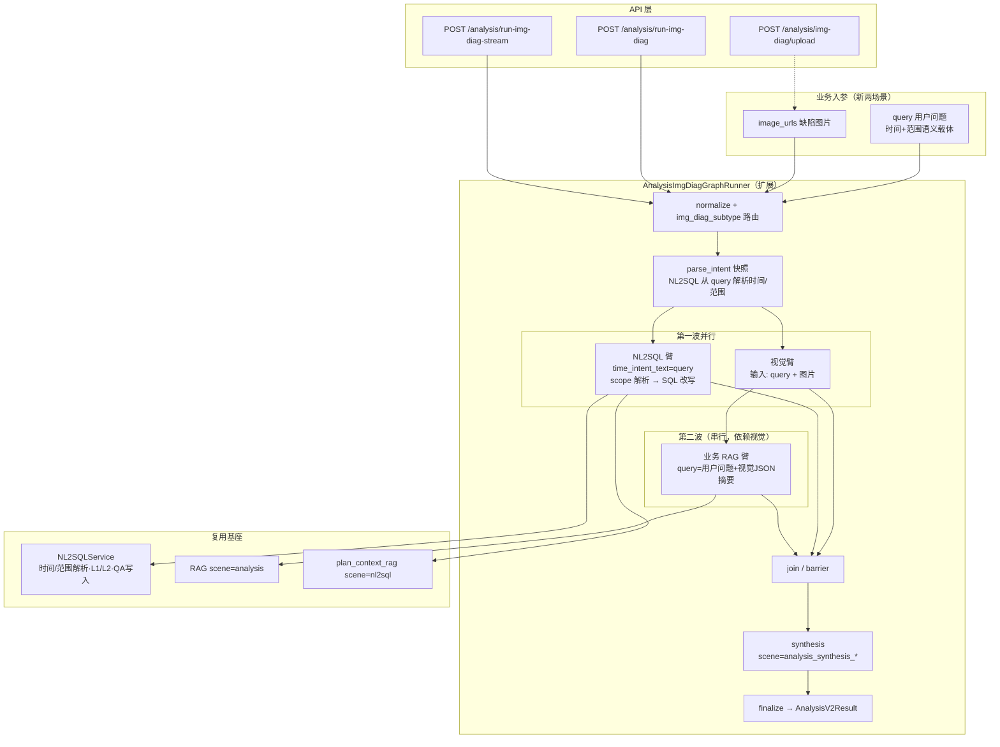

# 泄爆分析与缺陷识别 — 看图诊断链路实现方案大纲

> **版本**：2026-06-16（rev.2 — 入参简化为「用户问题 + 缺陷图片」）  
> **定位**：在现有「看图诊断（img_diag）」三臂编排上扩展 **泄爆分析**、**缺陷识别** 两个业务场景；原综合分析专项 **`leakage_burst_analysis` 保持不变**。  
> **关联代码**：`app/llm/graphs/analysis_img_diag_runner.py`、`app/llm/graphs/analysis_graph_runner.py`、`app/nl2sql/chain.py`、`configs/prompts.yaml`  
> **关联文档**：`framework-guide/综合分析-看图诊断实现方案.md`、`docs/NL2SQL自然语言时间和范围窗口解析&改写改造落地方案.md`

---

## 0. 方案评估结论（对你六点策略的回应）

| # | 你的判断 | 评估 | 说明 |
|---|----------|------|------|
| 1 | 两需求均含图片分析 + NL2SQL + RAG，可复用看图诊断三臂链路 | **合适** | 与现网 `AnalysisImgDiagGraphRunner`（视觉 ‖ NL2SQL ‖ 业务 RAG → synthesis）高度契合；两场景差异主要在 **提示词、数据计划、合成结构**，而非再造一套编排框架。 |
| 2 | 原 `leakage_burst_analysis` 专项保留；新泄爆分析在看图诊断链路全新实现 | **合适** | 旧专项走 **`/analysis/run-with-nl2sql`**，无图像、以履历/测厚/超温台账为主；新需求 **强依赖图像 + 事故时刻近 3 天运行数据 + 三层归因**，入口与证据链不同，分离可避免污染现有 QA 槽位与报告口径。 |
| 3 | RAG 是否应从「三臂并行」改为「视觉 + NL2SQL 并行后，再串行 RAG」 | **需要调整（推荐混合两阶段）** | 澄清需求明确：RAG 检索条件 = **用户问题 + 缺陷/图像分析结果**（泄爆：同位置/同类型事故案例；缺陷：同类型缺陷处置案例）。现网业务 RAG 仅用「问题 + 独立机组/位置字段」并行检索（见 `business_rag_query`），**无法满足**「基于视觉结论扩检」的产品要求。新版两场景的 **位置/机组信息均来自用户问题解析结果**，RAG 亦不再依赖独立位置入参。建议见 §3。 |
| 4 | 视觉 / NL2SQL / RAG / 合成各臂单独配置系统提示词 | **合适** | 与现有 `scene=analysis_img_diag_vision`、`analysis_plan_<type>`、`analysis_synthesis_<type>`、`analysis_report_<type>` 机制一致；两场景各一套模板即可。 |
| 5 | NL2SQL 使用基座「时间 + 范围窗口」解析与 SQL 改写 | **合适，有一处现网缺口需补齐** | 父类 `acquire_data` 已传 `plan_item_id`、`plan_template_version`，可走 L1/L2 缓存与 QA 五元组；新版两场景 **唯一语义入参为 `query`**，`time_intent_text` 与 scope 解析源均指向 **`req.query`（用户原句）**，不再经 bridge 拼接或独立位置字段注入。与 `docs/NL2SQL自然语言时间和范围窗口解析&改写改造落地方案.md` 对齐。 |
| 6 | 成功且校验通过的 SQL 自动写入 `nl2sql_qa_examples`，并支持 L1/L2 缓存与五元组匹配 | **合适，需扩展 analysis_type 粒度** | 基座能力已具备（`NL2SQLService.query` + `qa_feedback`）；建议新增 `img_diag_leakage_burst`、`img_diag_defect_ident` 作为 **真实 analysis_type**，使 QA 沉淀与缓存键按场景隔离，避免与通用 `img_diag` 占位计划混写。 |

**总评**：整体路线 **正确且可落地**；相对现网看图诊断的 **核心改造** 是：(1) 引入 **场景子类型** 与 **精简入参契约**；(2) **RAG 二阶段化**（可选保留轻量并行预检）；(3) **时间/范围完全由 NL2SQL 基座从用户问题解析**；(4) **按场景重写数据计划与合成结构**；(5) 客户 SQL 到位前以占位 plan + 降级说明交付。

---

## 1. 需求摘要

### 1.0 入参契约（新版两场景统一）

**泄爆分析、缺陷识别** 的业务入参 **仅包括**：

| 字段 | 泄爆分析 | 缺陷识别 | 说明 |
|------|----------|----------|------|
| `query` | **必填** | **必填** | 用户自然语言问题；承载 **时间、位置、范围** 全部语义 |
| `image_urls` | 可选 | **必填** | 缺陷/现场图片 URL（可先 upload） |

**不包含**（相对现网 `AnalysisImgDiagRequest` 的差异）：

- ~~`unit_id`~~
- ~~`leak_location_text`~~
- ~~`leak_location_struct`~~

上述 **机组/锅炉、设备/受热面、管排名称、排数、管数** 以及 **时间窗口**（含泄爆「事故时刻 + 近 3 天」），一律由 **NL2SQL 基座** 从 `query` 解析（`time_intent_display` / `QuestionScopeIntent` / SQL 改写），并在 trace 的 `parsed_intent` 中可审计。

> **兼容说明**：现网 `img_diag_subtype=generic` 仍可保留 `unit_id`、`leak_location_text` 等字段服务旧客户端；**新两场景走精简契约**，Runner 内不得再依赖独立位置字段拼 plan 或 RAG。

### 1.1 泄爆分析（新 · 看图诊断）

| 维度 | 要点 |
|------|------|
| 入参 | **用户问题**（须含或可解析 **管段位置、事故发生时间**）+ **缺陷图片（可选）** |
| 时间与范围 | 全部由 **`query` → NL2SQL 意图解析**：事故时刻锚点 → 向前 3 天；锅炉/受热面/管排/排数/管数 scope 改写 SQL |
| 取数窗口 | 以解析得到的 **事故时刻为锚点，向前 3 天**（运行参数、设备状态、历史事件、检修数据四类；**客户 SQL 暂缺，plan 占位**） |
| 分析结构 | 五大类方向 × 三层逻辑：**直接爆口原因 → 中期劣化因素 → 底层根因** |
| 知识增强 | RAG：**用户问题 + 图像/缺陷分析结果** → 同位置/同类型事故、典型处理经验、规程条文、防控资料 |
| 合成依据 | 图像分析 + NL2SQL 查库 + RAG 片段，输出三层泄爆溯源报告 + 延伸问题推荐 |

**用户问题示例**（位置与时间均在句内，无独立字段）：

> 「#2 炉高温过热器 B 侧第 4 排于 2025-03-01 14:00 发生泄爆，请分析原因」

### 1.2 缺陷识别（新 · 看图诊断）

| 维度 | 要点 |
|------|------|
| 入参 | **缺陷图片（必填）** + **用户问题**（须含或可解析 **区域/管段位置**；时间窗按业务默认或句内表述） |
| 时间与范围 | 同 §1.0，**仅来自 `query` 的 NL2SQL 解析** |
| 视觉输出 | 受热面典型缺陷类型判定（冲刷沟槽、点蚀、胀粗、裂纹、焊口缺陷、防磨瓦、氧化皮等）及风险等级 |
| 取数 | 与泄爆分析同源的数据维度（**客户 SQL 暂缺**） |
| 知识增强 | RAG：**用户问题 + 图像分析结果** → 同类型缺陷历史处置案例 |
| 合成输出 | 分风险等级的 **现场处置方案**（运行监护/复测周期/检修工序：打磨补焊、换管、防磨瓦等） |
| 长期 | 视觉能力依赖通用多模态，后续需 **缺陷图像数据集微调**（本阶段标注为能力边界） |

**用户问题示例**：

> 「请识别图片缺陷并给出处置建议，位置是 1 号锅炉低温过热器 A 侧第 2 排第 3 根」

### 1.3 与旧专项 `leakage_burst_analysis` 的边界

| 项 | 旧专项（保留） | 新看图诊断泄爆 |
|----|----------------|----------------|
| 入口 | `POST /analysis/run-with-nl2sql` | `POST /analysis/run-img-diag`（或 stream） |
| 业务入参 | `query`（+ `analysis_type`） | **`query` + `image_urls`（可选）** |
| 位置/机组 | 写在 `query` 或 plan 上下文 | **仅 `query`，NL2SQL 解析 scope** |
| 图像 | 无 | 有（可选但产品主路径有图） |
| 时间语义 | 用户问题 / plan 内时间 | **事故时刻 + 近 3 天**（NL2SQL 从 `query` 解析并改写） |
| 报告结构 | 事实-归因-建议-风险（六段式） | **三层溯源 × 五大类** + 案例/规程 RAG |
| analysis_type | `leakage_burst_analysis` | `img_diag_leakage_burst`（建议新增） |

---

## 2. 总体架构



---

## 3. 编排拓扑：RAG 何时并行、何时串行

### 3.1 推荐拓扑（满足澄清需求）

```
normalize（校验 query + image_urls）
  ├─ 视觉臂（query + 图片）
  └─ NL2SQL 臂（plan → acquire_data → quality_gate；time/scope 均来自 query）
        ↓（等待视觉完成）
  业务 RAG 臂（串行；检索 query = 用户问题 + vision_findings 摘要）
        ↓
  join → synthesis → finalize
```

**理由**：

1. 产品澄清要求 RAG 条件含 **缺陷/图像分析结果**；位置/机组 **不再作为独立 API 字段**，若需参与 RAG，应使用 **已从 `query` 解析出的 scope 摘要**（写入 trace，可选拼入 RAG query）。
2. NL2SQL **不依赖** 视觉结论（取数由 **query 解析得到的时间窗 + 范围** 决定），可与视觉 **第一波并行**。
3. 端到端耗时近似 **`max(T_vision, T_nl2sql) + T_rag + T_synthesis`**。

### 3.2 可选增强（二期）

- **RAG 预检（并行）**：第一波用 **仅含用户问题的轻量 RAG**（规程/通识），与 **视觉增强 RAG** 在 synthesis 前合并去重。
- 配置开关：`IMG_DIAG_RAG_MODE=parallel|vision_augmented|hybrid`（默认 `vision_augmented`）。

### 3.3 相对现网代码改动点

| 文件 | 改动 |
|------|------|
| `analysis_img_diag_runner.py` | 新 subtype 下 **`bridge_nl2sql_query` 简化为透传/轻量前缀 + `query`**，不再拼接 `unit_id`/`leak_location_*`；`_substitute_img_diag_placeholders` 对新场景 **停用或改为注入 parsed scope**；RAG 串行化 |
| `AnalysisImgDiagRequest`（或新模型） | 新场景 **`unit_id`/`leak_location_*` 非必填或弃用**；新增 `img_diag_subtype` |
| `analysis_graph_runner.py` | img_diag 新 subtype：`time_intent_text=img_req.query`；可选 `scope_intent_text=img_req.query` |
| trace | 增加 `parsed_time_intent`、`parsed_scope_intent`、`rag_query_with_vision=true` |

---

## 4. 场景子类型与 API 设计

### 4.1 建议请求模型（新两场景）

**方案 A（推荐）**：扩展 `AnalysisImgDiagRequest`，按 subtype 切换校验规则。

```python
img_diag_subtype: Literal[
    "generic",              # 现网：仍要求 unit_id + leak_location_text + image_urls
    "leakage_burst",        # 新泄爆：仅 query + image_urls（图片可选）
    "defect_ident",         # 新缺陷识别：query + image_urls（图片必填）
] = "generic"

query: str          # 必填；时间、机组、受热面、管排等语义均在此
image_urls: list  # 泄爆可选；缺陷识别必填

# 以下仅 generic 必填；leakage_burst / defect_ident 忽略或不传
unit_id: str | None = None
leak_location_text: str | None = None
leak_location_struct: dict | None = None
```

**方案 B**：独立路由 + 独立 Request 体（`AnalysisLeakageBurstRequest` / `AnalysisDefectIdentRequest`），字段仅 `query` + `image_urls` + 会话字段 + `options`。

| subtype | `query` | `image_urls` | 独立位置字段 |
|---------|---------|--------------|--------------|
| `leakage_burst` | 必填；含事故时间与管段位置 | 可选 | **不使用** |
| `defect_ident` | 必填；含区域/管段位置 | 必填 | **不使用** |
| `generic` | 必填 | 必填 | 现网仍可用 |

### 4.2 analysis_type 与模板命名

| img_diag_subtype | NL2SQL analysis_type | 模板前缀 |
|------------------|----------------------|----------|
| `generic` | `img_diag` | 现网 `*_img_diag` |
| `leakage_burst` | `img_diag_leakage_burst` | `*_img_diag_leakage_burst` |
| `defect_ident` | `img_diag_defect_ident` | `*_img_diag_defect_ident` |

Runner 内根据 `subtype` 选择 `analysis_type`、vision/synthesis/plan 模板 scene。

### 4.3 用户问题 → NL2SQL 时间/范围（唯一语义源）

| 解析项 | 来源 | NL2SQL 能力 | 消费点 |
|--------|------|-------------|--------|
| 时间窗 / 事故锚点 | **`req.query`** | `extract_time_window_from_question`；泄爆场景扩展 **锚点前 3 天** | `_rewrite_dynamic_time_window`、`@t_start`/`@t_end` |
| 机组/锅炉 | **`req.query`** | `_extract_boiler_scope_label_from_question` → `QuestionScopeIntent.boiler` | `@unit_keyword`、`boiler_name LIKE` |
| 设备/受热面 | **`req.query`** | `QuestionScopeIntent.device` / scope 规则或 LLM | scope SQL 改写 Phase 2 |
| 管排名称 | **`req.query`** | `QuestionScopeIntent.piperow_name` | scope SQL 改写 Phase 2 |
| 排数 / 管数 | **`req.query`** | `QuestionScopeIntent.row_no` / `pipe_no` | scope SQL 改写 Phase 2 |

**调用约定（P0）**：

```python
NL2SQLQueryRequest(
    question=plan_task_question,           # 数据计划子任务问句（可含业务说明，非 scope 主源）
    time_intent_text=img_req.query.strip(), # 用户原句 — 时间解析唯一权威源
    # scope 解析链路与 time_intent 相同：_resolve_entity_scope_question → query
    analysis_type="img_diag_leakage_burst",  # 或 img_diag_defect_ident
    plan_item_id=task.item_id,
    plan_template_version=...,
)
```

**泄爆专用时间逻辑**：从 `query` 解析事故时刻 `anchor_time`；若句内仅有相对时间（「昨天」），按解析规则落锚；plan 问句说明「以解析窗口为准」，SQL 改写注入 **\[anchor − 3d, anchor\]**（客户 SQL 到位后启用占位符）。

**plan 任务 question 写法（新场景）**：不再使用 `{unit_id}`、`{location}` 占位符；改为 **「根据用户问题已识别的时间窗与设备范围，查询……」** 类自然语言，由 NL2SQL 链在生成/改写 SQL 时消费 `parsed_intent`。

---

## 5. 分场景提示词与输出契约（大纲）

### 5.1 视觉臂

输入：**`query` + `image_urls`**（不传独立位置字段；位置线索可来自用户问题文案，供模型作辅助上下文）。

| scene | 输出重点 |
|-------|----------|
| `analysis_img_diag_vision_leakage_burst` | 爆口形貌、邻管牵连、热应力/冲刷/腐蚀 **可见线索**；`defect_signals`、`severity`、`failure_mode_hints[]` |
| `analysis_img_diag_vision_defect_ident` | 缺陷类型枚举（水冷壁/过热器/再热器/省煤器典型项）、`defect_type`、`risk_level`、`affected_surface` |

### 5.2 NL2SQL 数据计划（占位 → 客户 SQL 替换）

两场景共用数据域骨架；plan 内 **不预置机组/位置占位符**，依赖基座从 `query` 解析后的 intent 改写 SQL。

| item_id | 数据域 | 泄爆 | 缺陷识别 | 状态 |
|---------|--------|------|----------|------|
| q_run | 运行参数类（负荷、汽温汽压、燃料、吹灰、烟温、氧量） | ✓ | ✓ | SQL 待客户提供 |
| q_equip | 设备状态类（阀门、配风、支吊架） | ✓ | 可选 | **库表可能缺失** |
| q_event | 历史事件类（超温时长、泄爆档案、缺陷整改） | ✓ | ✓ | SQL 待提供 |
| q_maint | 检修数据类（近 3 次测厚、无损、处置） | ✓ | ✓ | SQL 待提供 |

模板文件：`configs/prompts.yaml` → `analysis_plan_img_diag_leakage_burst`、`analysis_plan_img_diag_defect_ident`。

### 5.3 业务 RAG 检索 query 构造

```text
{user_query}
[可选] 已解析范围:{boiler}|{device}|{piperow}|{row_no}|{pipe_no}   ← 来自 NL2SQL parsed_scope，非 API 字段
视觉结论:{defect_type}|{defect_signals}|{failure_mode_hints}
场景:{leakage_burst|defect_ident}
检索意图:{同类事故案例|处置案例|规程条文|防控技术}
```

### 5.4 合成（synthesis）输出结构

**泄爆分析 `analysis_synthesis_img_diag_leakage_burst`**

1. 结论摘要  
2. 三层溯源（每类均按五大方向表格化）：直接爆口原因 / 中期劣化因素 / 底层根因  
3. 证据链（图像可见 | 库表事实 | 知识库）  
4. 同类案例与规程引用  
5. 延伸问题推荐（同类爆管预防、同区域改造案例等）  
6. 解析范围说明（引用 NL2SQL 从用户问题识别的时间窗与位置，便于审计）  
7. 数据缺口与免责声明  

**缺陷识别 `analysis_synthesis_img_diag_defect_ident`**

1. 缺陷类型判定与风险等级  
2. 证据链（三类）  
3. **处置方案**（按 general / moderate / critical 分级）  
   - 运行监护要求、复测周期、检测方式  
   - 检修工序：打磨补焊 / 换管 / 防磨瓦等工艺要点  
4. 历史同类处置案例摘要（来自 RAG）  
5. 解析范围说明 + 免责声明  

---

## 6. NL2SQL 基座集成清单

| 能力 | 实现要点 |
|------|----------|
| 时间窗 | **`time_intent_text = req.query`**；泄爆：事故锚点 + **向前 3 天** |
| 范围窗 | **`QuestionScopeIntent` 全量字段均从 `req.query` 解析**（锅炉、受热面、管排、排数、管数）；无独立 API 位置字段 |
| SQL 改写 | `@t_start`/`@t_end`、scope 占位符随客户 SQL 分批启用 |
| plan 占位符 | **新场景废弃** `{unit_id}`/`{location}`/`{location_struct}`；与现网 generic 隔离 |
| L1/L2 缓存 | `analysis_type` + 规范化 question（含 parsed intent 指纹时更稳） |
| QA 五元组 | 成功 SQL 写入 `nl2sql_qa_examples`；`analysis_type` 用场景专用值 |
| plan_context_rag | 保持 NL2SQL 臂内 `scene=nl2sql` 三库检索 |
| trace 可审计 | 每条 NL2SQL call 回写 `question_intent`（时间 + scope），供 synthesis 与前端展示 |

**与现网 img_diag 差异（P0）**：

```python
# 新 subtype：不再 bridge 拼接 unit_id / leak_location
nl2sql_user_question = img_req.query.strip()

# acquire_data
time_intent_text=nl2sql_user_question
# scope 解析默认同源（_resolve_entity_scope_question）
```

---

## 7. 实施分期

### Phase 0 — 骨架（无客户 SQL）

- [ ] 精简入参：`img_diag_subtype` + 校验规则（仅 query + image_urls）  
- [ ] Runner：去独立位置字段依赖；RAG 串行化；`time_intent_text=query`  
- [ ] 四套提示词占位（vision / plan / synthesis / report × 2 场景）  
- [ ] plan 模板移除 `{unit_id}`/`{location}` 占位符  
- [ ] trace：`parsed_time_intent`、`parsed_scope_intent`、`img_diag_subtype`  

### Phase 1 — 客户 SQL 接入

- [ ] 替换 `analysis_plan_*` 中 q_run / q_event / q_maint 问句与参考 SQL  
- [ ] 泄爆：锚点前 3 天窗口 SQL 改写  
- [ ] scope 字段（受热面/管排/排数/管数）SQL 改写按 NL2SQL 改造方案 Phase 2 启用  
- [ ] 设备状态类 q_equip：库表就绪后接入  

### Phase 2 — 知识与质量

- [ ] RAG 知识库：事故案例、处置案例、规程条文  
- [ ] QA 沉淀：按 subtype 运营 `nl2sql_qa_examples`  
- [ ] 视觉缺陷数据集微调（独立项目）  

### Phase 3 — 产品化

- [ ] 前端：入口仅收集 **问题 + 图片**；引导用户在问题中写清位置与时间  
- [ ] 延伸问题 chips、结构化报告导出  
- [ ] `IMG_DIAG_RAG_MODE=hybrid`（可选）  

---

## 8. 风险、依赖与能力边界

| 风险 | 缓解 |
|------|------|
| 用户问题未写清位置/时间 | synthesis 与 trace 标明解析缺口；strict 模式可阻断；前端 placeholder 引导完整问句 |
| scope 解析误识别 | 回显 `parsed_scope_intent` 供用户确认；后续可多轮补问（非本阶段） |
| 客户 SQL 未提供 | 占位 plan + 合成硬约束「库表未接入」 |
| 设备状态类无表 | q_equip optional + 降级说明 |
| 视觉通用模型识别率 | `confidence_notes` + 现场复核声明 |
| 与 generic img_diag 混淆 | subtype 分流；文档与 OpenAPI 分 schema 描述 |

---

## 9. 测试要点（提纲）

1. **入参**：`leakage_burst` / `defect_ident` 仅传 `query` + `image_urls` 可正常 200；不传 `unit_id` 不报错。  
2. **时间**：`query`「2025-03-01 14:00 #2炉…泄爆」→ `parsed_intent` 含锚点及近 3 天窗。  
3. **范围**：`query`「1号锅炉低温过热器A侧第2排第3根」→ `QuestionScopeIntent` 各字段正确 / 空值符合预期。  
4. **编排**：vision+nl 并行 → RAG 含 vision 摘要；RAG query **不依赖** API 级位置字段。  
5. **QA / 缓存**：成功 SQL 写入 `nl2sql_qa_examples`；L1/L2 命中。  
6. **降级**：泄爆无图、scope 未识别、RAG 超时 → 结构完整 + `degrade_reasons`。  
7. **兼容**：`img_diag_subtype=generic` 仍支持现网 `unit_id` + `leak_location_text` 行为。  

---

## 10. 相关文件索引

| 类型 | 路径 |
|------|------|
| 看图诊断 Runner | `app/llm/graphs/analysis_img_diag_runner.py` |
| 请求模型 | `app/models/analysis.py`（`AnalysisImgDiagRequest`） |
| NL2SQL 取数 | `app/llm/graphs/analysis_graph_runner.py` |
| 时间/范围解析 | `app/nl2sql/chain.py`、`app/nl2sql/scope_*.py`、`docs/NL2SQL自然语言时间和范围窗口解析&改写改造落地方案.md` |
| QA 写入 | `app/nl2sql/qa_feedback.py` |
| 提示词 | `configs/prompts.yaml` |
| 原泄爆专项 | `analysis_*_leakage_burst_analysis` |
| 看图诊断原方案（含旧入参） | `framework-guide/综合分析-看图诊断实现方案.md` |

---

## 11. 待决事项（需产品/客户确认）

1. 新场景用 **扩展 `AnalysisImgDiagRequest`** 还是 **独立 Request + 路由**？  
2. 泄爆 **无图** 是否允许（仅 query + NL2SQL + RAG）？  
3. 用户问题 **未提及时间** 时：拒识、默认当前时刻、还是追问？（泄爆近 3 天强依赖锚点）  
4. 用户问题 **scope 部分缺失**（仅有受热面无排号）时，SQL 过滤策略：放宽 OR 阻断？  
5. 设备状态类数据表接入时间表。  
6. 前端引导文案：如何在单框问题内规范「位置 + 时间」写法。  
