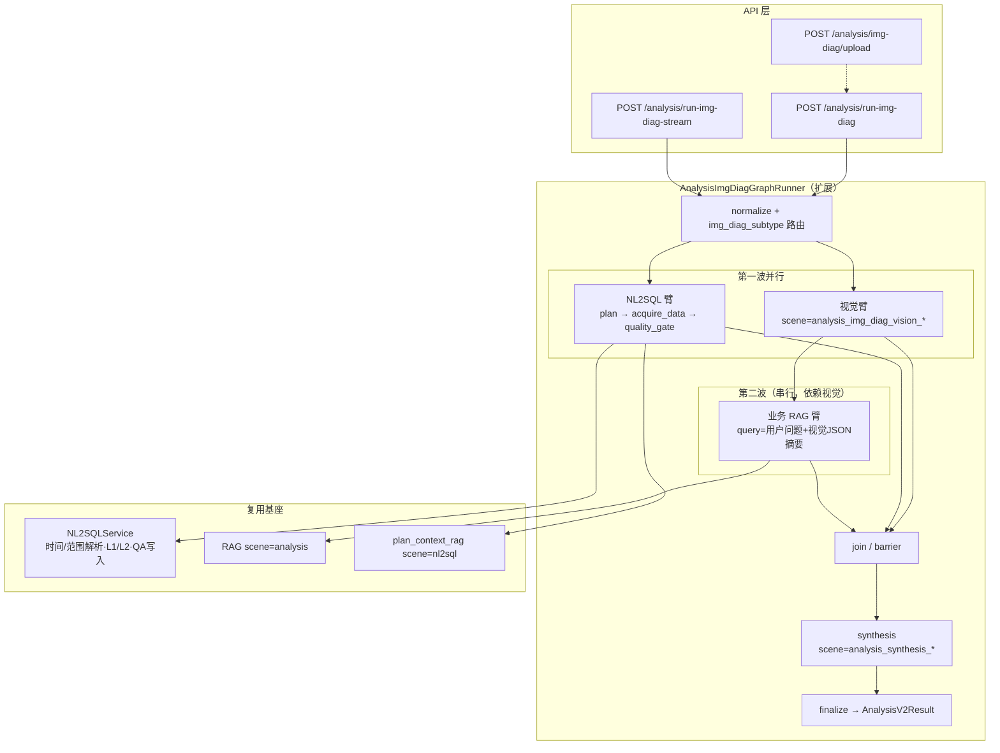

# 泄爆分析与缺陷识别 — 看图诊断链路实现方案大纲

> **版本**：2026-06-16  
> **定位**：在现有「看图诊断（img_diag）」三臂编排上扩展 **泄爆分析**、**缺陷识别** 两个业务场景；原综合分析专项 **`leakage_burst_analysis` 保持不变**。  
> **关联代码**：`app/llm/graphs/analysis_img_diag_runner.py`、`app/llm/graphs/analysis_graph_runner.py`、`app/nl2sql/chain.py`、`configs/prompts.yaml`  
> **关联文档**：`framework-guide/综合分析-看图诊断实现方案.md`、`docs/NL2SQL自然语言时间和范围窗口解析&改写改造落地方案.md`

---

## 0. 方案评估结论（对你六点策略的回应）

| # | 你的判断 | 评估 | 说明 |
|---|----------|------|------|
| 1 | 两需求均含图片分析 + NL2SQL + RAG，可复用看图诊断三臂链路 | **合适** | 与现网 `AnalysisImgDiagGraphRunner`（视觉 ‖ NL2SQL ‖ 业务 RAG → synthesis）高度契合；两场景差异主要在 **提示词、数据计划、合成结构**，而非再造一套编排框架。 |
| 2 | 原 `leakage_burst_analysis` 专项保留；新泄爆分析在看图诊断链路全新实现 | **合适** | 旧专项走 **`/analysis/run-with-nl2sql`**，无图像、以履历/测厚/超温台账为主；新需求 **强依赖图像 + 事故时刻近 3 天运行数据 + 三层归因**，入口与证据链不同，分离可避免污染现有 QA 槽位与报告口径。 |
| 3 | RAG 是否应从「三臂并行」改为「视觉 + NL2SQL 并行后，再串行 RAG」 | **需要调整（推荐混合两阶段）** | 澄清需求明确：RAG 检索条件 = **用户问题 + 缺陷/图像分析结果**（泄爆：同位置/同类型事故案例；缺陷：同类型缺陷处置案例）。现网业务 RAG 仅用「问题 + 机组 + 位置」并行检索（见 `business_rag_query`），**无法满足**「基于视觉结论扩检」的产品要求。建议见 §3。 |
| 4 | 视觉 / NL2SQL / RAG / 合成各臂单独配置系统提示词 | **合适** | 与现有 `scene=analysis_img_diag_vision`、`analysis_plan_<type>`、`analysis_synthesis_<type>`、`analysis_report_<type>` 机制一致；两场景各一套模板即可。 |
| 5 | NL2SQL 使用基座「时间 + 范围窗口」解析与 SQL 改写 | **合适，有一处现网缺口需补齐** | 父类 `acquire_data` 已传 `plan_item_id`、`plan_template_version`，可走 L1/L2 缓存与 QA 五元组；但 img_diag 当前 `time_intent_text` 取自 **拼接后的 bridge 问句** 而非用户原句，范围解析同理。改造时需 **`time_intent_text = req.query`（用户自然语言）** 单独传入，与超温链路及 `docs/NL2SQL自然语言时间和范围窗口解析&改写改造落地方案.md` 对齐。 |
| 6 | 成功且校验通过的 SQL 自动写入 `nl2sql_qa_examples`，并支持 L1/L2 缓存与五元组匹配 | **合适，需扩展 analysis_type 粒度** | 基座能力已具备（`NL2SQLService.query` + `qa_feedback`）；建议新增 `img_diag_leakage_burst`、`img_diag_defect_ident` 作为 **真实 analysis_type**，使 QA 沉淀与缓存键按场景隔离，避免与通用 `img_diag` 占位计划混写。 |

**总评**：整体路线 **正确且可落地**；相对现网看图诊断的 **核心改造** 是：(1) 引入 **场景子类型**；(2) **RAG 二阶段化**（可选保留轻量并行预检）；(3) **time_intent 问句来源修正**；(4) **按场景重写数据计划与合成结构**；(5) 客户 SQL 到位前以占位 plan + 降级说明交付。

---

## 1. 需求摘要

### 1.1 泄爆分析（新 · 看图诊断）

| 维度 | 要点 |
|------|------|
| 入参 | 用户自然语言（**管段位置、事故发生时间**）、缺陷图片（可选）、机组/结构化位置 |
| 取数窗口 | 以 **事故发生时间为锚点，向前 3 天**（运行参数、设备状态、历史事件、检修数据四类；**客户 SQL 暂缺，plan 占位**） |
| 分析结构 | 五大类方向 × 三层逻辑：**直接爆口原因 → 中期劣化因素 → 底层根因** |
| 知识增强 | RAG：**用户问题 + 图像/缺陷分析结果** → 同位置/同类型事故、典型处理经验、规程条文、防控资料 |
| 合成依据 | 图像分析 + NL2SQL 查库 + RAG 片段，输出三层泄爆溯源报告 + 延伸问题推荐 |

### 1.2 缺陷识别（新 · 看图诊断）

| 维度 | 要点 |
|------|------|
| 入参 | 缺陷图片（必需）、用户问题（**区域位置**）、机组/结构化位置 |
| 视觉输出 | 受热面典型缺陷类型判定（冲刷沟槽、点蚀、胀粗、裂纹、焊口缺陷、防磨瓦、氧化皮等）及风险等级 |
| 取数 | 与泄爆分析同源的数据维度（**客户 SQL 暂缺**）；位置/时间经 NL2SQL 意图解析改写 |
| 知识增强 | RAG：**用户问题 + 图像分析结果** → 同类型缺陷历史处置案例 |
| 合成输出 | 分风险等级的 **现场处置方案**（运行监护/复测周期/检修工序：打磨补焊、换管、防磨瓦等） |
| 长期 | 视觉能力依赖通用多模态，后续需 **缺陷图像数据集微调**（本阶段标注为能力边界） |

### 1.3 与旧专项 `leakage_burst_analysis` 的边界

| 项 | 旧专项（保留） | 新看图诊断泄爆 |
|----|----------------|----------------|
| 入口 | `POST /analysis/run-with-nl2sql` | `POST /analysis/run-img-diag`（或 stream） |
| 图像 | 无 | 有（可选但产品主路径有图） |
| 时间语义 | 用户问题 / plan 内时间 | **事故时刻 + 近 3 天**（NL2SQL 改写） |
| 报告结构 | 事实-归因-建议-风险（六段式） | **三层溯源 × 五大类** + 案例/规程 RAG |
| analysis_type | `leakage_burst_analysis` | `img_diag_leakage_burst`（建议新增） |

---

## 2. 总体架构



---

## 3. 编排拓扑：RAG 何时并行、何时串行

### 3.1 推荐拓扑（满足澄清需求）

```
normalize
  ├─ 视觉臂（必须）
  └─ NL2SQL 臂（必须；plan_context_rag 在臂内，与现网一致）
        ↓（等待视觉完成）
  业务 RAG 臂（串行；检索 query 含 vision_findings 结构化摘要）
        ↓
  join → synthesis → finalize
```

**理由**：

1. 产品澄清要求 RAG 条件含 **缺陷/图像分析结果**，与现网 `business_rag_query()` 仅含「问题+机组+位置」不一致。
2. NL2SQL **不依赖** 视觉结论（取数由位置 + 事故时间窗决定），可与视觉 **第一波并行**，不增加 RAG 串行带来的额外 NL2SQL 延迟。
3. 端到端耗时近似 **`max(T_vision, T_nl2sql) + T_rag + T_synthesis`**，通常仍优于三臂完全串行。

### 3.2 可选增强（二期）

- **RAG 预检（并行）**：第一波仍保留轻量「问题+位置」并行 RAG， synthesis 时与 **视觉增强 RAG** 合并去重；用于规程/通识类文献，不替代案例精检。
- 配置开关：`IMG_DIAG_RAG_MODE=parallel|vision_augmented|hybrid`（默认 `vision_augmented`）。

### 3.3 相对现网代码改动点

| 文件 | 改动 |
|------|------|
| `analysis_img_diag_runner.py` | `_gather_img_diag_pack`：`asyncio.gather(vision, nl)` 后再 `await rag(vision)`；`business_rag_query` 增加 vision 摘要参数 |
| `AnalysisImgDiagRequest` | 新增 `img_diag_subtype: Literal["leakage_burst","defect_ident",...]`（或独立 API 路由） |
| trace | `parallel_lane_trace` 增加 `rag_depends_on_vision=true`、`rag_query_mode` |

---

## 4. 场景子类型与 API 设计

### 4.1 建议扩展请求模型

在 `AnalysisImgDiagRequest` 上增加：

```python
img_diag_subtype: Literal[
    "generic",              # 现网默认，兼容旧客户端
    "leakage_burst",        # 新泄爆分析
    "defect_ident",         # 缺陷识别
] = "generic"
```

- **泄爆分析**：`query` 必须可解析 **事故发生时间**（显式日期或「昨天 14:00」等）；`image_urls` 可选。
- **缺陷识别**：`image_urls` 必填；`query` 侧重 **区域位置** 描述。

### 4.2 analysis_type 与模板命名

| img_diag_subtype | NL2SQL analysis_type | 模板前缀 |
|------------------|----------------------|----------|
| `generic` | `img_diag` | 现网 `*_img_diag` |
| `leakage_burst` | `img_diag_leakage_burst` | `*_img_diag_leakage_burst` |
| `defect_ident` | `img_diag_defect_ident` | `*_img_diag_defect_ident` |

Runner 内根据 `subtype` 选择 `analysis_type`、vision/synthesis/plan 模板 scene。

### 4.3 用户问题 → NL2SQL 时间/范围

| 字段 | 用途 |
|------|------|
| `req.query` | **time_intent_text**、**scope 解析源**（用户原句，禁止用 bridge 全文替代） |
| `bridge_nl2sql_query(req)` | 仅作为 plan 任务 `question` 的业务上下文拼接 |
| `req.leak_location_text` / `leak_location_struct` | 范围解析补充；与 NL2SQL `QuestionScopeIntent` 字段对齐 |

**泄爆专用**：从事故时间解析 `anchor_time`，plan 问句统一注入「以 {anchor_time} 为锚点、向前 3 天」；实现可复用 `extract_time_window_from_question` + 自定义 `rolling_3d_before(anchor)` 改写（Phase 2，客户 SQL 到位后启用 `@t_start`/`@t_end` 占位符）。

---

## 5. 分场景提示词与输出契约（大纲）

### 5.1 视觉臂

| scene | 输出重点 |
|-------|----------|
| `analysis_img_diag_vision_leakage_burst` | 爆口形貌、邻管牵连、热应力/冲刷/腐蚀 **可见线索**；`defect_signals`、`severity`、`failure_mode_hints[]` |
| `analysis_img_diag_vision_defect_ident` | 缺陷类型枚举（水冷壁/过热器/再热器/省煤器典型项）、`defect_type`、`risk_level`、`affected_surface` |

### 5.2 NL2SQL 数据计划（占位 → 客户 SQL 替换）

两场景可先 **共用数据域骨架**，按 subtype 调整 mandatory 与 question 文案：

| item_id | 数据域 | 泄爆 | 缺陷识别 | 状态 |
|---------|--------|------|----------|------|
| q_run | 运行参数类（负荷、汽温汽压、燃料、吹灰、烟温、氧量） | ✓ | ✓ | SQL 待客户提供 |
| q_equip | 设备状态类（阀门、配风、支吊架） | ✓ | 可选 | **库表可能缺失** |
| q_event | 历史事件类（超温时长、泄爆档案、缺陷整改） | ✓ | ✓ | SQL 待提供 |
| q_maint | 检修数据类（近 3 次测厚、无损、处置） | ✓ | ✓ | SQL 待提供 |

模板文件：`configs/prompts.yaml` → `analysis_plan_img_diag_leakage_burst`、`analysis_plan_img_diag_defect_ident`。

### 5.3 业务 RAG 检索 query 构造

```text
{user_query}
机组:{unit_id} 位置:{leak_location_text}
视觉结论:{defect_type}|{defect_signals}|{failure_mode_hints}
场景:{leakage_burst|defect_ident}
检索意图:{同类事故案例|处置案例|规程条文|防控技术}
```

### 5.4 合成（synthesis）输出结构

**泄爆分析 `analysis_synthesis_img_diag_leakage_burst`**

1. 结论摘要  
2. 三层溯源（每类均按五大方向表格化）：直接爆口原因 / 中期劣化因素 / 底层根因  
3. 证据链（图像可见 | 库表事实 | 知识库）  
4. 同类案例与规程引用  
5. 延伸问题推荐（同类爆管预防、同区域改造案例等）  
6. 数据缺口与免责声明  

**缺陷识别 `analysis_synthesis_img_diag_defect_ident`**

1. 缺陷类型判定与风险等级  
2. 证据链（三类）  
3. **处置方案**（按 general / moderate / critical 分级）  
   - 运行监护要求、复测周期、检测方式  
   - 检修工序：打磨补焊 / 换管 / 防磨瓦等工艺要点  
4. 历史同类处置案例摘要（来自 RAG）  
5. 免责声明  

---

## 6. NL2SQL 基座集成清单

| 能力 | 实现要点 |
|------|----------|
| 时间窗 | `time_intent_text=用户 query`；泄爆场景从事故时刻推导 **近 3 天** |
| 范围窗 | 复用/扩展 `QuestionScopeIntent`（锅炉、受热面、管排、排数、管数）；与 `leak_location_struct` 互为补充 |
| SQL 改写 | plan SQL 逐步引入 `@t_start`/`@t_end`、scope 占位符（客户 SQL 到位后分批启用） |
| L1/L2 缓存 | 无额外改造；`analysis_type` + 规范化 question 即入缓存键 |
| QA 五元组 | `(analysis_type, plan_item_id, plan_template_version, schema_fingerprint, …)`；`NL2SQL_QA_FEEDBACK_ENABLED=true` 时成功 SQL 写入 `nl2sql_qa_examples` |
| plan_context_rag | 保持 NL2SQL 臂内 `scene=nl2sql` 三库检索，与业务 RAG 分离 |

**img_diag 专项修复（P0）**：

```python
# acquire_data 调用 NL2SQLService.query 时（img_diag 路径）
time_intent_text=img_req.query.strip(),          # 用户原句
# 而非 AnalysisNL2SQLRequest.query（bridge 全文）
```

---

## 7. 实施分期

### Phase 0 — 骨架（无客户 SQL）

- [ ] 扩展 `img_diag_subtype` + `analysis_type` 枚举  
- [ ] Runner：RAG 串行化 + `time_intent_text` 修正  
- [ ] 四套提示词占位（vision / plan / synthesis / report × 2 场景）  
- [ ] 合成报告结构按 §5.4 落地；数据缺失显式降级  
- [ ] trace / evidence 字段：`img_diag_subtype`、`rag_query_with_vision=true`

### Phase 1 — 客户 SQL 接入

- [ ] 替换 `analysis_plan_*` 中 q_run / q_event / q_maint 问句与参考 SQL  
- [ ] 启用时间锚点 + 3 天窗口 SQL 改写  
- [ ] 设备状态类 q_equip：库表就绪后接入，未就绪保持 skip + 降级说明  

### Phase 2 — 知识与质量

- [ ] RAG 知识库：事故案例、处置案例、规程条文分 collection / 标签  
- [ ] QA 沉淀运营：按 subtype 清理与抽检 `nl2sql_qa_examples`  
- [ ] 可选：视觉缺陷数据集微调（独立项目，不阻塞 Phase 0/1）

### Phase 3 — 产品化

- [ ] 前端：AI 问答入口区分「泄爆分析」「缺陷识别」  
- [ ] 延伸问题 chips、结构化报告导出  
- [ ] `IMG_DIAG_RAG_MODE=hybrid` 预检 RAG（若延迟可接受）

---

## 8. 风险、依赖与能力边界

| 风险 | 缓解 |
|------|------|
| 客户 SQL 未提供 | Phase 0 用占位 plan + synthesis 硬约束「库表未接入」；strict 模式可配置为阻断 |
| 设备状态类无表 | plan 标记 optional；quality_gate 不因 q_equip skip 失败 |
| 视觉通用模型识别率 | 输出 `confidence_notes`；文档声明需后续微调；高风险结论要求现场复核 |
| RAG 串行增加延迟 | NL2SQL 与视觉并行抵消；RAG Top-K 限制；hybrid 模式可选 |
| QA 五元组混用 | 独立 `analysis_type`，禁止与新场景共用 `img_diag` 泛型键 |
| 旧泄爆专项混淆 | API、文档、前端文案区分「专项复盘」vs「看图泄爆」 |

---

## 9. 测试要点（提纲）

1. **编排**：vision+nl 并行完成后 RAG query 含 vision 字段；trace 时序正确。  
2. **时间**：用户句「2025-03-01 14:00 发生泄爆」→ 近 3 天窗口进入 `parsed_intent` / SQL 改写。  
3. **范围**：`leak_location_struct` + 自然语言位置 → scope 解析与 plan 占位符一致。  
4. **QA**：成功 SQL 写入 `nl2sql_qa_examples`，二次请求 RAG 命中；L1/L2 缓存命中。  
5. **降级**：无图泄爆、无 SQL 表、RAG 超时 → 合成仍输出结构完整 + degrade_reasons。  
6. **兼容**：`img_diag_subtype=generic` 行为与现网一致。

---

## 10. 相关文件索引

| 类型 | 路径 |
|------|------|
| 看图诊断 Runner | `app/llm/graphs/analysis_img_diag_runner.py` |
| NL2SQL 取数 | `app/llm/graphs/analysis_graph_runner.py`（`_run_single_nl2sql_plan_task`） |
| 时间/范围解析 | `app/nl2sql/chain.py`、`app/nl2sql/scope_*.py`、`docs/NL2SQL自然语言时间和范围窗口解析&改写改造落地方案.md` |
| QA 写入 | `app/nl2sql/qa_feedback.py` |
| 提示词 | `configs/prompts.yaml` |
| 原泄爆专项 | `analysis_*_leakage_burst_analysis`、`analysis_plan_leakage_burst_analysis` |
| 看图诊断原方案 | `framework-guide/综合分析-看图诊断实现方案.md` |

---

## 11. 待决事项（需产品/客户确认）

1. 两场景是 **同一 API + subtype 字段**，还是 **独立路由**（如 `/run-img-diag-leakage-burst`）？  
2. 泄爆 **无图** 是否允许仅 NL2SQL+RAG+synthesis（跳过视觉臂或视觉返回 empty）？  
3. 「事故发生时间」是否必须由用户输入，还是可从图片 EXIF/默认当前时间回退？  
4. 设备状态类数据表预计接入时间表。  
5. 前端入口与旧 `leakage_burst_analysis` 专项的并存展示策略。
