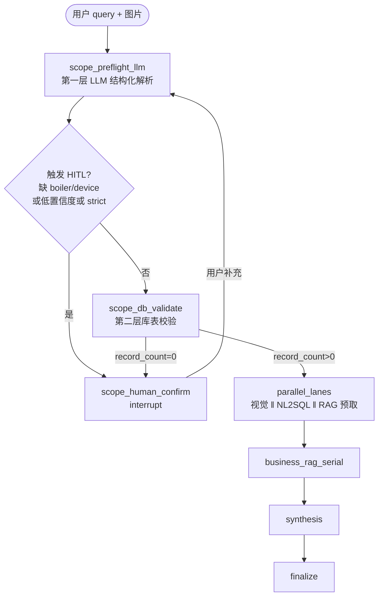

# 看图诊断 · 用户问题结构化解析人机协同实现方案

> **版本**：2026-06-16  
> **范围**：仅 **看图诊断**（`img_diag_defect_ident` / `img_diag_leakage_burst`）；在视觉臂与 NL2SQL 臂之前，通过 **LangGraph HITL** 获取并校验机组/受热面等范围信息。  
> **关联代码**：`app/llm/graphs/analysis_img_diag_runner.py`、`app/nl2sql/scope_parser_llm.py`、`app/nl2sql/question_intent.py`、`app/analysis_agent/graph/`（HITL 参考）  
> **关联文档**：`docs/NL2SQL自然语言时间和范围窗口解析&改写改造落地方案.md`

---

## 0. 可行性结论
### 0.1 结论

**整体可行**，与现有 NL2SQL 基座、词表、范围 LLM 提示词高度复用；需 **img_diag 专用 LangGraph + HITL 基础设施**，并在 NL2SQL 侧增加 **可选结构化注入**（默认不启用，不影响超温分析等其它模块）。

| 维度 | 评估 |
|------|------|
| 业务价值 | 高：在 9 次 NL2SQL 取数前锁定管段范围，避免静默「全厂查询」 |
| 技术复用 | 高：`nl2sql_scope_parse` 提示词、`finalize_llm_scope`、机组规则解析、时间规则解析均可复用 |
| 改造面 | 中：img_diag 从 asyncio 并行编排升级为可 checkpoint 的 LangGraph；新增 resume SSE |
| 风险 | 可控：NL2SQL 改动限于 **可选入参 + 合并策略**；其它 `analysis_type` 行为不变 |

### 0.2 前置条件（当前缺口）

1. **img_diag 尚无完整 LangGraph**：现为 `asyncio.gather(vision, nl2sql, …)`，无 `interrupt/resume`（HITL 仅在 `analysis_agent` 链路）。
2. **NL2SQL 无结构化 scope 注入**：`time_intent_text` 仅传用户原句字符串，无 `confirmed_scope` 对象。
3. **第二层校验 SQL 需 guard**：`piperow_name` / `row_no` 为空时，不能用硬 `AND` 等值，否则合法「仅机组+受热面」也会判失败（见 §4.2）。

---

## 1. 目标与原则

### 1.1 目标

| 编号 | 目标 |
|------|------|
| G1 | 在 **视觉臂、NL2SQL 臂之前** 完成范围人机协同，快速得到精准 scope |
| G2 | 两层协同：**LLM 结构化解析 + 人机补全** → **库表 existence 校验** |
| G3 | 校验通过后，将 **最终结构化意图** 作为 NL2SQL 时间/范围解析输入（结构化优先，原规则兜底） |
| G4 | img_diag 流式 API 支持 **checkpoint + interrupt SSE + resume** |
| G5 | **零影响** 超温分析、独立 NL2SQL API、其它 `analysis_type` 的现有解析与改写逻辑 |

### 1.2 非目标

- 不改造 NL2SQL SQL 生成 Prompt 主链路结构；
- 不强制所有分析类型启用 HITL；
- 不在本阶段实现 vision 模型从图片反推管段（可后续增强第一层 LLM 输入）。

---

## 2. 总体架构

### 2.1 LangGraph 节点顺序（img_diag 专用）



**与原链路关系**：`parallel_lanes` 及之后与现 `AnalysisImgDiagGraphRunner._gather_img_diag_pack` 逻辑一致；仅在最前增加 scope 子图，且 **NL2SQL 臂启动前** 必须已有 `confirmed_scope_intent`。

### 2.2 状态字段（`ImgDiagGraphState` 示意）

| 字段 | 说明 |
|------|------|
| `query` | 用户原始问题（全程保留，供 synthesis / trace） |
| `scope_parse_attempts` | 第一层循环次数（上限如 5，防死循环） |
| `scope_draft` | 当前 LLM+规则合并后的 scope JSON |
| `scope_time` | 程序侧时间解析结果（可为空，不触发 HITL） |
| `scope_confidence` | `high` / `low`（rule vs llm 不一致、无词表命中等） |
| `confirmed_scope_intent` | 第二层校验通过后的最终结构化意图 |
| `scope_intent_text` | 由结构化数据 **合成** 的解析用文本（见 §5） |
| `human_interactions` | HITL 问答记录（checkpoint 持久化） |

---

## 3. 第一层：LLM 结构化解析 + 人机补全

### 3.1 解析输出 schema

```json
{
  "boiler": "2号锅炉",
  "device_name": "高温过热器",
  "piperow_name": "第一屏",
  "row_no": 4,
  "tube_no": null,
  "time_window": null,
  "time_anchor": null
}
```

- **范围字段**：`boiler`、`device_name`、`piperow_name`、`row_no`、`tube_no`（后三者可为空）。
- **时间字段**：由 **程序规则** 从当前累积问句（原 query + 用户补充）解析，写入 `time_window` / `time_anchor`；**缺失不触发 HITL**（与需求一致；泄爆锚点可在 synthesis 阶段再提示）。

### 3.2 LLM 与规则分工（复用 NL2SQL 基座）

| 步骤 | 实现 | 说明 |
|------|------|------|
| LLM scope | `build_scope_parse_prompt` + scene=`nl2sql_scope_parse` | 与 `scope_parser_llm.py` 共用模板 |
| 锅炉后处理 | `NL2SQLChain._extract_unit_keyword_from_question` | **程序规则覆盖 LLM 的 boiler**（与 `finalize_llm_scope` 一致） |
| 设备/管排/排/管 | LLM 输出经 `finalize_llm_scope` 归一化 | 简称展开、水冷壁默认 `row_no=1` 等 |
| 时间 | `extract_time_window_from_question` / `extract_time_anchor_from_question` | 不走 LLM；不触发 HITL |

**人机协同专用提示词（可选）**：在 `nl2sql_scope_parse` 基础上增加 scene=`img_diag_scope_confirm`（v1），追加「已有部分解析结果 + 用户本轮补充」上下文，减少重复提问。

### 3.3 HITL 循环逻辑

1. 对 **累积文本** `scope_question = original_query + 用户各轮补充` 调用 LLM + 规则合并 → `scope_draft`。
2. 若 `boiler` 或 `device_name` 为空 → **`interrupt`**，提示用户补充缺失项；已解析字段写入 checkpoint。
3. 用户 resume 后，在 **原 draft 基础上** 带补充文本 **再次解析**（非从零开始）。
4. 循环直到 `boiler` 与 `device_name` 均有值，或达到 `scope_parse_attempts` 上限 → 降级失败/abort。

### 3.4 触发机制

| 条件 | 行为 |
|------|------|
| `boiler` 或 `device_name` 为空 | **必须** interrupt（第一层） |
| 低置信度 | rule 与 llm 的 `device_name` 不一致；或设备名未命中 `nl2sql_scope_device_aliases.json` | **建议** interrupt |
| `options.strict=true` | 上述任一为真即 interrupt；非 strict 可配置为「仅缺关键字段才问」 |
| 时间缺失 | **不触发**；写入空值，后续 NL2SQL / synthesis 按现有告警处理 |

**配置项（img_diag 专用，建议）**：

- `ANALYSIS_IMG_DIAG_SCOPE_HITL_ENABLED`（默认 `true`）
- `ANALYSIS_IMG_DIAG_SCOPE_HITL_MAX_ROUNDS`（默认 `5`）
- `ANALYSIS_IMG_DIAG_SCOPE_LOW_CONFIDENCE_HITL`（默认 `true`）

---

## 4. 第二层：库表 existence 校验

### 4.1 目的

确认解析出的 **机组 + 受热面** 在账册表中 **真实存在**，避免「LLM 填了看似合理但库中无记录」的组合进入 NL2SQL。

### 4.2 校验 SQL（环境变量可配置）

**默认模板**（`ANALYSIS_IMG_DIAG_SCOPE_VALIDATE_SQL`）：

```sql
SELECT COUNT(*) AS record_count
FROM account_boiler ab
INNER JOIN account_static_device asd ON ab.boiler_id = asd.boiler_id
WHERE ab.boiler_name = :boiler
  AND asd.device_name = :device_name
```

**设计要点**：

1. **仅校验机组 + 受热面**：与看图诊断 plan SQL 范围过滤一致；`piperow_name` / `row_no` / `tube_no` 不参与本层校验（解析层仍可保留）。
2. **通过条件**：`record_count > 0` → 进入并行臂；`= 0` → interrupt，提示「业务库中未匹配到下面台账信息…」。
3. **执行**：只读 COUNT；超时/连接失败 → 可配置为「跳过校验继续」（degrade）或 strict 失败。

### 4.3 循环

- 校验失败 → 回到 **第一层 interrupt**（保留 checkpoint 中已有 draft，让用户修正）。
- 校验成功 → 写入 `confirmed_scope_intent`，冻结 `scope_intent_text`，进入 `parallel_lanes`。

---

## 5. 与 NL2SQL 基座衔接（结构化优先 + 原逻辑兜底）

### 5.1 原则：**仅 img_diag 传入扩展字段**

在 `NL2SQLQueryRequest`（或 analysis 内部等价结构）增加 **可选** 字段：

```python
confirmed_scope: dict[str, Any] | None = None   # 第二层通过后的 scope
scope_intent_text: str | None = None            # 合成解析文本
```

- **超温分析、独立 `/nl2sql/query`、其它 analysis_type**：不传上述字段 → **行为与现网完全一致**。
- **img_diag**：每条 plan 调用传入 `scope_intent_text` 与 `confirmed_scope`。

### 5.2 `scope_intent_text` 合成规则

将结构化结果转为 NL2SQL 现有解析器可消费的 **短句**（示例）：

```
2号锅炉 高温过热器 第一屏 第4排
2025-03-01 14:00
```

- 仅拼接非空字段；时间来自 `scope_time`（程序解析）。
- 作为 `time_intent_source` / `resolve_question_intent` 的 **优先输入**。

### 5.3 `resolve_question_intent` 合并策略（新增，默认关闭）

```text
若 confirmed_scope 存在：
  1) scope 五元组以 confirmed_scope 为准（parse_mode = "human_confirmed"）
  2) time_window / time_anchor：优先从 scope_intent_text 程序解析；
     若为空，回落到 original_query 解析（兜底）
否则：
  保持现有逻辑（question + time_intent_source）
```

**不改** `_rewrite_query_filters`、占位符改写、超温 plan 优先级；仅 **意图解析入口** 多一条 img_diag 分支。

### 5.4 对用户原 query 的保留

- `req.query` **始终保留** 供 synthesis、trace、RAG 语义检索。
- NL2SQL **仅** 将 `scope_intent_text` 作为时间/范围解析源；避免 plan 长问句污染机制仍适用（plan `question` 不变）。

---

## 6. LangGraph HITL 与 API

### 6.1 基础设施（对齐 analysis_agent）

| 能力 | 参考 | img_diag 需新增 |
|------|------|-----------------|
| Checkpointer | `app/analysis_agent/checkpoint.py` | img_diag 专用 namespace 或共用 backend |
| interrupt | `langgraph.types.interrupt` | `scope_human_confirm` 节点 |
| resume | `POST /analysis-agent/resume-stream` | `POST /analysis/run-img-diag-resume-stream` |
| resume_token | `session_store` redis/memory | 同上模式 |
| SSE 事件 | `analysis_agent_user_input_required` | `img_diag_scope_input_required` |

### 6.2 interrupt payload 示例

```json
{
  "event": "img_diag_scope_input_required",
  "request_id": "anl_xxx",
  "resume_token": "rt_xxx",
  "prompt": "请补充缺失的机组或受热面信息",
  "scope_draft": {
    "boiler": null,
    "device_name": "高温过热器",
    "piperow_name": null,
    "row_no": null,
    "tube_no": null
  },
  "missing_fields": ["boiler"],
  "validation_error": null,
  "suggested_actions": ["confirm_scope", "edit_scope", "abort"]
}
```

### 6.3 resume 请求体

```json
{
  "resume_token": "rt_xxx",
  "action": "confirm_scope",
  "payload": {
    "user_supplement": "2号锅炉",
    "scope_patch": { "boiler": "2号锅炉" }
  }
}
```

- 支持 **自然语言补充**（再走 LLM 合并）或 **结构化 patch**（前端表单直接改字段）。
- `abort` → 终止分析，返回可读错误。

### 6.4 流式时序

```text
(可选) img_diag_scope_input_required  … 用户 resume …
meta  …  summary_delta  …  finished
```

scope HITL 发生在 **meta 之前**；前端需支持「先确认范围，再等取数」。

---

## 7. 配置清单（`.env` / `app/app-deploy/.env.example`）

| 变量 | 默认（运行时） | 说明 |
|------|----------------|------|
| `ANALYSIS_IMG_DIAG_USE_LANGGRAPH` | `true` | 是否启用 scope LangGraph 子图 |
| `ANALYSIS_IMG_DIAG_SCOPE_HITL_ENABLED` | `true` | 是否启用两层人机协同 |
| `ANALYSIS_IMG_DIAG_SCOPE_HITL_MAX_ROUNDS` | `5` | interrupt 循环上限 |
| `ANALYSIS_IMG_DIAG_SCOPE_LOW_CONFIDENCE_HITL` | `true` | 低置信度是否 interrupt |
| `ANALYSIS_IMG_DIAG_SCOPE_VALIDATE_SQL` | **见 `.env.example` 单行默认** | 库表校验 SQL；留空则用代码内置 |
| `ANALYSIS_IMG_DIAG_SCOPE_VALIDATE_TIMEOUT_S` | `10` | 校验超时（秒） |
| `ANALYSIS_IMG_DIAG_SCOPE_VALIDATE_SKIP_ON_ERROR` | `false` | DB 异常是否跳过校验 |
| `ANALYSIS_IMG_DIAG_CHECKPOINT_BACKEND` | **`redis`**（有 `REDIS_URL` 或生产环境） | LangGraph 断点 |
| `ANALYSIS_IMG_DIAG_SESSION_STORE_BACKEND` | **`redis`**（同上） | `resume_token` 存储 |
| `ANALYSIS_IMG_DIAG_CHECKPOINT_REDIS_URL` | 回落 `REDIS_URL` | 可选独立 Redis DB |
| `ANALYSIS_IMG_DIAG_SESSION_STORE_REDIS_URL` | 回落 `REDIS_URL` | 可选独立 Redis DB |

### 7.1 `ANALYSIS_IMG_DIAG_SCOPE_VALIDATE_SQL` 格式

1. **`.env` 单行 + 双引号包裹**（推荐，见 `app/app-deploy/.env.example`）。
2. **占位符**（必须保留）：`:boiler`、`:device_name`、`:piperow_name`。
3. **返回列**：`record_count`（`COUNT(*) AS record_count`）。
4. **管排可选**：须含 `(:piperow_name IS NULL OR …)`，未指定管排时程序 bind 为 `NULL`。
5. **未配置或留空**：使用 `app/llm/graphs/img_diag_scope_validate.py` 中 `_DEFAULT_VALIDATE_SQL`。

### 7.2 Redis 与多 worker

- 已配置全局 **`REDIS_URL`** 或 **`APP_ENV=production`** 时，checkpoint / session **默认 `redis`**。
- 单机无 Redis 调试：显式设 `ANALYSIS_IMG_DIAG_CHECKPOINT_BACKEND=memory` 与 `ANALYSIS_IMG_DIAG_SESSION_STORE_BACKEND=memory`。
- 多 worker 生产：**必须** `redis` + 可用 `REDIS_URL`（或独立 `ANALYSIS_IMG_DIAG_*_REDIS_URL`）。

---

## 8. 不影响其它模块的保障

| 模块 | 保障措施 |
|------|----------|
| 超温分析 / 其它 NL2SQL analysis | 不传 `confirmed_scope` / `scope_intent_text`；`resolve_question_intent` 默认分支不变 |
| 独立 `POST /nl2sql/query` | 请求体无新必填字段；新字段 Optional |
| `NL2SQL_INTENT_PARSE_MODE` 全局配置 | img_diag HITL **独立**于该开关；HITL 路径固定「LLM+规则+人工」 |
| img_diag 关闭 HITL | `SCOPE_HITL_ENABLED=false` 或 `USE_LANGGRAPH=false` → 回退现网行为 |
| QA 缓存 / SQL 指纹 | 仅当 `scope_intent_text` 变化时意图键变化；其它类型无影响 |

---

## 9. 实施阶段建议

| 阶段 | 内容 | 预估 |
|------|------|------|
| **P0** | `confirmed_scope` + `scope_intent_text` + `resolve_question_intent` 合并；单测；仅 img_diag 传入 | 2–3 人日 |
| **P1** | 第一层 LLM 循环（无 LangGraph，同步 API 两阶段 `/scope-parse` + `/run-img-diag`）快速验证 | 2 人日 |
| **P2** | img_diag LangGraph + checkpoint + interrupt/resume SSE | 4–5 人日 |
| **P3** | 第二层库表校验 SQL + 失败回流 HITL；联调前端表单 | 2–3 人日 |
| **P4** | 灰度、`USE_LANGGRAPH` 默认开启、文档与 web 测试页 | 1–2 人日 |

---

## 10. 风险与对策

| 风险 | 对策 |
|------|------|
| 校验 SQL 与现场库表结构不一致 | SQL 可配置；上线前用只读账号验证 |
| HITL 轮次过多体验差 | `MAX_ROUNDS` + 前端结构化表单减少 LLM 误判 |
| 并行臂启动时 scope 未就绪 | 图编排强制 `scope_db_validate` → `parallel_lanes` 边，禁止跳过 |
| 结构化文本合成丢失时间语义 | 时间单独程序解析并拼入 `scope_intent_text`；并保留 `original_query` 兜底 |
| 与现 img_diag 流式契约冲突 | 文档化新 SSE 事件；meta 前允许长时间等待用户 |

---

## 11. 验收标准

1. 用户 query 缺机组/受热面时，流式接口发出 `img_diag_scope_input_required`，resume 后 scope 完整。
2. 库表不存在组合触发二次 HITL，修正后 `record_count > 0` 才启动 NL2SQL。
3. img_diag 的 `parsed_intent.scope` 与 `confirmed_scope_intent` 一致，`parse_mode=human_confirmed`。
4. 超温分析、独立 NL2SQL 回归用例 **零 diff**。
5. HITL 关闭或 LangGraph 关闭时，行为与当前线上一致。

---

**结论**：方案在架构与复用面上 **可行**；实施时需修正第二层 SQL 对可选 `piperow_name` 的处理，并通过 **可选 NL2SQL 入参 + img_diag 专用 LangGraph** 保证对其它模块 **零侵入**。
