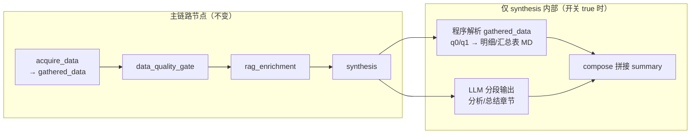
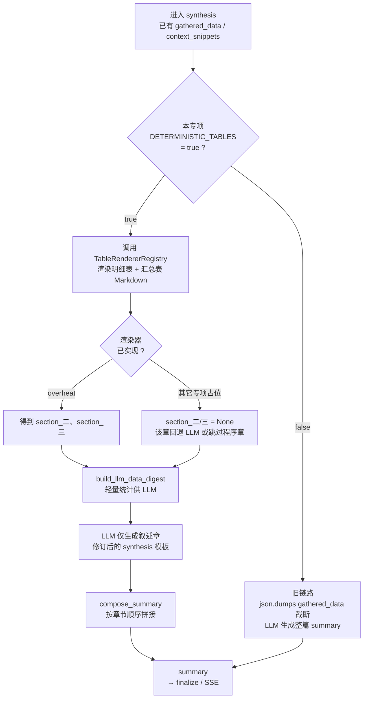

# 综合分析优化版本实现方案（v2）

> **版本**：v2  
> **状态**：待实施  
> **适用范围**：`POST /analysis/run-with-nl2sql`、`POST /analysis/run-with-nl2sql-stream`（`data_mode=nl2sql`）  
> **不涉及**：`payload` 模式、`img_diag`、`custom`（保持现链路，除非后续单独立项）

---

## 0. 改造边界与定位（必读）

### 0.1 改造方向确认（与主链路关系）

**结论：你的理解正确。** v2 的改造方向可以概括为：

1. **`acquire_data`（NL2SQL 数据计划执行）完成之后**，内存中已有 `gathered_data[item_id] → list[dict]`（如 `q0`、`q1` 等），**逻辑与现网完全一致，不新增取数节点、不改动 NL2SQL 生成 SQL/执行 SQL 的流程**。  
2. **在 `synthesis` 节点内**（`data_quality_gate`、`rag_enrichment` 已结束之后），按专项配置对指定 `item_id` 的查库结果做 **程序化解析与 Markdown 表渲染**（明细表、汇总表）。  
3. **LLM 仍负责分析性、总结性章节**（如结论摘要、关键依据、原因与建议、风险与限制等）；**数据报表章节不再由 LLM 逐格生成**，改为 **填入上述程序渲染的 Markdown 表**。  
4. 最终将「程序表章节」与「LLM 叙述章节」**按报告模板顺序拼接**为对外 `summary`（同步/流式均如此）。  
5. **主链路图不变**：不增加 `plan_context_rag` / `acquire_data` / `rag_enrichment` 之间的节点，不新增对外 API；整体改造面 **集中在 `synthesis` 内部 + 配置/提示词**，以保证改动最小、可灰度、可回滚。



### 0.2 改造边界（In Scope / Out of Scope）

| 类别 | 边界说明 |
|------|----------|
| **In：时机** | 仅当 **`acquire_data` 已结束** 且 `gathered_data` 已就绪之后，在 **`synthesis` 入口** 消费查库结果。 |
| **In：数据来源** | 仅读取本次请求已产生的 `gathered_data[detail_item_id]`、`gathered_data[summary_item_id]`（如超温 `q1`、`q0`），及对应 `nl2sql_calls` 元数据（状态、行数）。 |
| **In：输出形态** | 生成固定结构的 **Markdown 表格章节**（明细表、汇总表），行数受 `ANALYSIS_DETERMINISTIC_TABLE_MAX_ROWS` 限制；超出附说明脚注。 |
| **In：LLM 职责** | **叙述章**仍调用现有 LLM 客户端；输入改为 **轻量 digest**（统计摘要），而非全量 `gathered_data` JSON 截断；**不要求 LLM 输出明细/汇总表**（修订 `analysis_synthesis_*` 模板）。 |
| **In：开关** | 四类专项各自环境变量：`true` = 程序表 + LLM 叙述 + 拼接；`false` = **与现网完全相同**（整篇 LLM + `json.dumps(gathered_data)[:ANALYSIS_SYNTHESIS_GATHERED_JSON_MAX_CHARS]`，当前默认 16000；见 `AnalysisConfig`）。 |
| **In：实施范围** | P0 完整实现 **超温** `overheat_guidance` 的 q1/q0 渲染；其它三类 **占位**（开关可预留，渲染未实现时该表章回退 LLM）。 |
| **Out：数据计划** | 不修改 `analysis_plan_*` JSON 语义（除可选后续 `report_section` 元数据）；不修改 `_execute_data_plan`、并行调度、`NL2SQLChain`、SQL 缓存。 |
| **Out：前置节点** | 不修改 `normalize_request`、`plan_context_rag`、`intent_llm`、`plan_llm`、`acquire_data` 行为。 |
| **Out：后置检索** | 不修改 `data_quality_gate` 规则；不修改 `rag_enrichment` 检索逻辑（与 v2 正交）。 |
| **Out：其它模式** | 默认不改造 `payload`、`img_diag`、`custom` 的 synthesis（除非单独立项）。 |
| **Out：新接口** | 不新增 HTTP 路径；不改变 `AnalysisNL2SQLRequest` 必填字段契约（仅新增可选 env 配置）。 |

### 0.3 数据流（开关 `true` 时的一次请求）

```text
plan_tasks (q0,q1,…)
    → acquire_data → gathered_data["q0"], gathered_data["q1"], …
    → data_quality_gate（不变）
    → rag_enrichment → context_snippets（不变）
    → synthesis:
          ① 程序：render(gathered_data["q1"]) → 「二、超温明细统计」Markdown 表
          ② 程序：render(gathered_data["q0"]) → 「三、超温汇总统计」Markdown 表
          ③ LLM：digest + RAG → 「一、四、五、六、七」叙述 Markdown
          ④ 程序：compose → 完整 summary → finalize / SSE finished
```

**开关 `false` 时**：`synthesis` 内无 ①②④ 的程序表逻辑，仅保留现网「全量 JSON 截断 + LLM 一次生成整篇」。

### 0.4 「最小改造」的含义

| 维度 | 说明 |
|------|------|
| 图拓扑 | 节点数、边、顺序与 [framework-guide/综合分析整体实现技术说明.md](../framework-guide/综合分析整体实现技术说明.md) 一致。 |
| 代码触点 | 主要为 `AnalysisGraphRunner` 的 `_build_summary_messages` / `_build_summary_user_content`、`_generate_summary`、`_stream_summary_text`、`iter_nl2sql_stream_events`、`_finalize_nl2sql_sequential_v2`；新增独立表渲染模块，**不扩散到** `nl2sql/chain.py`。 |
| 风险面 | 取数与 RAG 回归面小；回滚 = 专项 env 置 `false`。 |
| 产品行为 | 对外仍是一个 `summary` 字符串；`evidence.nl2sql_calls` 不变；可选增强 `structured_report.tables`。 |

### 0.5 非本方案内容（避免误解）

- **不是**在 `acquire_data` 里增加「程序解析」步骤（解析发生在 **`acquire_data` 之后、`synthesis` 之内**）。  
- **不是**让 LLM 分多次 HTTP 调用对应多个图节点（仍是 **一个 synthesis 节点** 内的「程序 + LLM + 拼接」）。  
- **不是**替换整个综合分析编排框架或 LangGraph 图定义。  
- **不是**保证 LLM 叙述章与程序表行级一一对应校验（P0 仅保证 **表章与 `gathered_data` 一致**；叙述章仍依赖 digest 与 prompt 约束）。

---

## 1. 实施范围与优先级清单（完整实现 / 占位 / 后续）

> **状态说明**：下文「当前实现」指 **v2 方案待开发项**（非指现网已上线）。现网在开关全部为 `false` 时行为与改造前一致。

### 1.1 总览对照表

| 类别 | analysis_type | 程序明细表 | 程序汇总表 | 专项 env 开关 | renderer | 默认开关值 |
|------|---------------|------------|------------|---------------|----------|------------|
| **P0 完整实现** | `overheat_guidance` | q1 → 二、超温明细统计 | q0 → 三、超温汇总统计 | 有 | `overheat` | `false`（灰度时改 `true`） |
| **P0 占位** | `maintenance_strategy` | 未实现 | 未实现 | 有 | `stub` | `false` |
| **P0 占位** | `four_tube_health_interpretation` | 未实现 | 未实现 | 有 | `stub` | `false` |
| **P0 占位** | `leakage_burst_analysis` | 未实现 | 未实现 | 有 | `stub` | `false` |
| **不纳入 v2** | `custom` / `img_diag` / `payload` | — | — | 无 | — | — |

**占位（P0）含义**：注册表中有 profile + env + `StubTableRenderer`；开关为 `true` 时 **不程序出表**，明细/汇总章 **回退为 LLM 生成**（与改造前该章行为一致），并打日志 `deterministic_tables stub fallback`。

---

### 1.2 当前完整实现项（按优先级，P0）

以下为 **本版本必须交付** 的能力；建议按优先级顺序开发与联调。

| 优先级 | 编号 | 交付项 | 说明 | 依赖 |
|--------|------|--------|------|------|
| **P0** | R0 | 改造边界落地 | `synthesis` 内分支；开关 `false` 时零行为变化（§0） | — |
| **P0** | R1 | 配置与 env | 四个 `ANALYSIS_DETERMINISTIC_TABLES_*` + `ANALYSIS_DETERMINISTIC_TABLE_MAX_ROWS`（默认 100） | R0 |
| **P0** | R2 | 表渲染基础库 | `analysis_table_render.py`：列解析、Markdown 表、截断脚注、`build_llm_data_digest` | R1 |
| **P0** | R3 | 注册表 + Stub | `analysis_table_profiles.py`：四类 profile；`StubTableRenderer` | R2 |
| **P0** | R4 | 超温渲染器 | `analysis_overheat_tables.py`：`q1` 明细列、`q0` 汇总列（§9） | R2、R3 |
| **P0** | R5 | 编排接入（同步） | `compose_nl2sql_summary`、`_build_summary_messages` user 分支、`_generate_summary` / `_finalize_nl2sql_sequential_v2` | R3、R4 |
| **P0** | R6 | 编排接入（流式） | `iter_nl2sql_stream_events`：拼接完整 `summary` 后 `summary_delta`（§9.5 流式） | R5 |
| **P0** | R7 | 超温 prompt 拆分 | `analysis_synthesis_overheat_guidance`（或 `_narrative`）：LLM 不写二、三章 | R5 |
| **P0** | R8 | structured_report | 超温开关 `true` 时 `tables[]` 与 Markdown 同源（§9.5） | R4、R5 |
| **P0** | R9 | 单测与验收 | 超温 golden、截断 100 行、stub 不崩溃、开关 false 回归 | R5、R6 |

**P0 不包含（明确不做）**：

- 检修 / 四管 / 泄爆的 **真实** 程序表渲染（仅 R3 Stub）。  
- 修改 `acquire_data`、NL2SQL Chain、主链路图节点。  
- `payload` / `img_diag` 的程序出表。

---

### 1.3 当前占位实现项（P0 仅搭台）

| 优先级 | 编号 | 交付项 | 行为（开关 `true` 时） | 行为（开关 `false` 时） |
|--------|------|--------|------------------------|-------------------------|
| **P0** | S1 | `maintenance_strategy` env + profile | `renderer_id=stub` → 明细/汇总 **LLM 回退** | 全 LLM 旧链路 |
| **P0** | S2 | `four_tube_health_interpretation` env + profile | 同上 | 同上 |
| **P0** | S3 | `leakage_burst_analysis` env + profile | 同上 | 同上 |
| **P0** | S4 | 占位单测 | 三项 `analysis_type` 开关 `true` 不抛错、`summary` 非空 | S1～S3 |

**运维提示（写入 `.env.example`）**：

```text
# 截至 P0：仅 overheat_guidance 在 true 时有程序表；其余 true 仍为 LLM 出表，无程序表收益。
ANALYSIS_DETERMINISTIC_TABLES_MAINTENANCE_STRATEGY=false
ANALYSIS_DETERMINISTIC_TABLES_FOUR_TUBE_HEALTH_INTERPRETATION=false
ANALYSIS_DETERMINISTIC_TABLES_LEAKAGE_BURST_ANALYSIS=false
```

---

### 1.4 后续完整实现路线（占位三项 → 与超温同级）

占位专项升级为 **完整实现** 时，**不改动主链路**；在既有框架上 **新增 `XxxTableRenderer` + 修订 profile + 修订 synthesis 模板**，步骤统一如下。


#### 1.4.1 检修策略 `maintenance_strategy`（建议 P2a）

| 步骤 | 内容 |
|------|------|
| 产品对齐 | 现 synthesis「二、检修优先级清单」为 **分级叙述**，与超温「明细+汇总」不同。需约定：程序 **明细表** 是否 = `q1`（`overhaul_record` + `overhaul_record_tubes` 检测记录）；**汇总表** 是否 = 按锅炉/风险等级聚合（可能需 **程序聚合 q1** 或单独 `item_id`，不一定有现成 q0）。 |
| profile | `detail_item_id=q1`；`summary_item_id` 待定（或 `program_aggregate_from_q1`）；列名与 `analysis_plan_maintenance_strategy` 稳定 SQL 别名对齐。 |
| 模板 | `analysis_synthesis_maintenance_strategy`：程序负责「可表格化」章节；LLM 负责一、三～七。 |
| 实现 | `MaintenanceStrategyTableRenderer`；registry `renderer_id=maintenance`。 |
| 验收 | 壁厚/管段标识与库一致；禁止臆造管号。 |

#### 1.4.2 四管健康解读 `four_tube_health_interpretation`（建议 P2b）

| 步骤 | 内容 |
|------|------|
| 产品对齐 | 现结构为「运行简报 + 检修建议书」，非超温二、三章。建议：**明细表** = `q1` 健康评估结果行；**汇总表** = `q2` 测厚/缺陷摘要或按风险等级汇总。 |
| profile | `detail_item_id=q1`，`summary_item_id=q2`（或 q5 台账映射表，按 catalog 定）。 |
| 模板 | 拆分 `analysis_synthesis_four_tube_health_interpretation`：表格章系统插入；简报/建议书主体仍 LLM。 |
| 实现 | `FourTubeHealthTableRenderer`。 |
| 验收 | 健康指数/风险等级字段与查库一致。 |

#### 1.4.3 泄爆分析 `leakage_burst_analysis`（建议 P2c）

| 步骤 | 内容 |
|------|------|
| 产品对齐 | 「二、泄爆/泄漏事件与履历」≈ **事件明细表**，建议 `detail_item_id=q1`（`overhaul_leakage`）；**汇总表** = 按锅炉/区域/时段计数（程序聚合 q1 或新增计划项）。 |
| profile | `detail_item_id=q1`；`summary_item_id` 待定。 |
| 模板 | 修订 `analysis_synthesis_leakage_burst_analysis`，LLM 不写第二章表格。 |
| 实现 | `LeakageBurstTableRenderer`。 |
| 验收 | 事件时间/位置与库一致。 |

#### 1.4.4 横切增强（可与 P2 并行，见 §13）

| 项 | 说明 |
|----|------|
| P1 | `ANALYSIS_LLM_DIGEST_MAX_CHARS`；流式分阶段推送优化；灰度运维手册。 |
| 可选 | `analysis_plan_*` 增加 `report_section: detail_table \| summary_table` 元数据，减少硬编码 item_id。 |
| 可选 | 图表 `structured_report.charts` 仅消费指定 `item_id` 行，避免 q2/q3 重复行干扰。 |

---

### 1.5 分期与 §1 清单的对应关系

| 分期 | 包含 §1.2 编号 | 包含 §1.3 编号 | 目标 |
|------|----------------|----------------|------|
| **P0（本版）** | R0～R9 | S1～S4 | 框架 + **超温完整** + 三类 **占位** |
| **P1** | — | — | 可观测性、digest 上限、流式体验 |
| **P2a/b/c** | — | — | 检修 / 四管 / 泄爆 **逐项** 按 §1.4.1～1.4.3 完整实现 |

---

## 2. 背景与问题

### 2.1 现象

超温分析（`overheat_guidance`）在 NL2SQL 取数成功（如 q1 返回千余行、含真实 `测点名称`）后，最终 Markdown 报告「二、超温明细统计」中出现 **测点1、测点2** 等占位行，与库表结果不一致。

### 2.2 根因（已确认）

| 环节 | 现状 | 问题 |
|------|------|------|
| `acquire_data` | `gathered_data[item_id]` 保存完整查库行 | 数据正确 |
| `synthesis` | `json.dumps(gathered_data)[:N]` 注入 LLM（**历史**固定 N=4000；**当前代码** N=`ANALYSIS_SYNTHESIS_GATHERED_JSON_MAX_CHARS` 默认 16000） | 聚合前：全量明细 q0～qn 易超 4KB；聚合后 q1～q4×~20 行在 16KB 内通常可完整入模，但仍为整包截断 |
| 报告生成 | 整篇由 LLM 按 `analysis_synthesis_*` 撰写 | 模板要求「二、三」出表，模型在缺数时 **编造示意表** |

### 2.3 v2 目标

（边界定义见 **§0**；实施清单见 **§1**；以下为摘要。）

- **主链路图不变**；**`acquire_data` 之后**在 `synthesis` 内对 `q0`/`q1` 等做程序出表，LLM 只写分析总结段。  
- **四类专项可配置**；`False` = 现网全 LLM。  
- **P0 超温完整实现**；其它三类占位。

---

## 3. 设计原则

1. **事实表 = 程序渲染，叙述 = LLM**（方案 A）。  
2. **节点不变、行为可切换**：通过 `AnalysisConfig` + 环境变量控制，不 fork 一套新 API。  
3. **查库上限 ≠ 展示上限**：`max_rows_per_query`（默认 2000）仍控制 NL2SQL 拉取；报告表展示由 `ANALYSIS_DETERMINISTIC_TABLE_MAX_ROWS`（默认 100）控制。  
4. **可回滚**：任一项专项开关置 `false` 即恢复「全 LLM + 4KB 截断」旧行为。  
5. **可扩展**：每专项一份「表渲染配置」（`item_id`、列、章节标题），避免四个专项硬编码同一套「二、三」。

---

## 4. 主链路（保持不变）

下列节点 **名称、顺序、对外接口均不变**；v2 仅在 **`synthesis` 节点内部** 增加「条件分支 + 报告拼接」。

```mermaid
flowchart LR
    A["POST run-with-nl2sql\n或 run-with-nl2sql-stream"] --> N["normalize_request"]
    N --> PR["plan_context_rag\nscene=nl2sql"]
    PR --> I["intent_llm\n可选"]
    I --> PL["plan_llm\n模板/内置/LLM合并"]
    PL --> AC["acquire_data\n分层并行 NL2SQL"]
    AC --> Q["data_quality_gate"]
    Q --> R2["rag_enrichment\nscene=analysis"]
    R2 --> S["synthesis\n★ v2 增强点"]
    S --> F["finalize / 流式 finished"]
```



### 4.1 synthesis 节点内部（v2 逻辑展开）



**说明**：

- `plan_context_rag`、`acquire_data`、`rag_enrichment` **不做结构性改动**（已有 `rag_enrichment` 排除 `nl2sql_*` namespace 等与 v2 正交）。  
- 流式路径仍在 **同一 `synthesis` 阶段** 完成拼接；可先拼完整 `summary` 再按块推送 `summary_delta`，或按 §8.5 策略分阶段推送。

---

## 5. 功能需求对照（三项具体要求）

| # | 要求 | 方案落点 |
|---|------|----------|
| 1 | 四类专项各一套 env；`true` = 表程序 + 总结 LLM；`false` = 全 LLM | §6 环境变量 + §8 编排分支 |
| 2 | 优先实现超温明细/汇总渲染；其它占位 | §1.2～§1.3、§9 超温、§10 占位 |
| 3 | 表最多展示 100 行，超出说明；可配置 | §6 `ANALYSIS_DETERMINISTIC_TABLE_MAX_ROWS` + §9.3 |

---

## 6. 配置项（环境变量）

在 `app/core/config.py` · `AnalysisConfig` 中新增（名称可微调，需与 `.env.example` 同步）：

### 6.1 专项开关（默认建议）

| 环境变量 | 配置字段 | 默认值 | 说明 |
|----------|----------|--------|------|
| `ANALYSIS_DETERMINISTIC_TABLES_OVERHEAT_GUIDANCE` | `deterministic_tables_overheat_guidance` | `false` | 超温：程序渲染二、三 + LLM 写一、四～七 |
| `ANALYSIS_DETERMINISTIC_TABLES_MAINTENANCE_STRATEGY` | `deterministic_tables_maintenance_strategy` | `false` | 检修策略（占位） |
| `ANALYSIS_DETERMINISTIC_TABLES_FOUR_TUBE_HEALTH_INTERPRETATION` | `deterministic_tables_four_tube_health_interpretation` | `false` | 四管健康解读（占位） |
| `ANALYSIS_DETERMINISTIC_TABLES_LEAKAGE_BURST_ANALYSIS` | `deterministic_tables_leakage_burst_analysis` | `false` | 泄爆分析（占位） |

**判定函数**（建议）：

```python
def deterministic_tables_enabled(analysis_type: str) -> bool:
    return getattr(analysis_cfg, f"deterministic_tables_{analysis_type}", False)
```

`analysis_type` 与枚举一致：`overheat_guidance`、`maintenance_strategy`、`four_tube_health_interpretation`、`leakage_burst_analysis`。

### 6.2 全局展示行数上限

| 环境变量 | 配置字段 | 默认值 | 说明 |
|----------|----------|--------|------|
| `ANALYSIS_DETERMINISTIC_TABLE_MAX_ROWS` | `deterministic_table_max_rows` | `100` | 明细表、汇总表 Markdown 最多展示行数 |

**脚注模板**（行数 `total > max_rows` 时追加）：

```text
共 {total} 条记录，数据量较大，仅展示前 {max_rows} 条。
```

### 6.3 可选后续配置（P2）

| 环境变量 | 说明 |
|----------|------|
| `ANALYSIS_LLM_DIGEST_MAX_CHARS` | v2 叙述章 digest 字符上限（建议默认 8000）；与现网 **`ANALYSIS_SYNTHESIS_GATHERED_JSON_MAX_CHARS`**（整包 JSON，默认 16000）分工不同 |

---

## 7. 专项表渲染注册表

### 7.1 概念

每个 `analysis_type` 对应一份 **`AnalysisTableRenderProfile`**：

| 字段 | 含义 |
|------|------|
| `detail_item_id` | `gathered_data` 中用于「明细表」的 plan 项，如 `q1` |
| `summary_item_id` | 用于「汇总表」的 plan 项，如 `q0` |
| `detail_section_title` | Markdown 二级标题，如 `二、超温明细统计` |
| `summary_section_title` | 如 `三、超温汇总统计` |
| `detail_columns` | 规范列名有序列表（与 SQL 中文别名对齐） |
| `summary_columns` | 汇总表列顺序 |
| `column_aliases` | 可选：`pi_code` → `测点号` 等 |
| `renderer_id` | `overheat` \| `stub` |

### 7.2 当前 prompts 与推荐映射（实施参考）

#### 超温 `overheat_guidance`（P0 完整实现）

数据计划见 `configs/prompts.yaml` · `analysis_plan_overheat_guidance`：

| plan item | purpose（摘要） | 报告章节 |
|-----------|-----------------|----------|
| **q1** | 超温明细事实基线 | **二、超温明细统计** |
| **q0** | 超温汇总事实基线 | **三、超温汇总统计** |
| q2 | 运行参数联动 | 无独立程序表（供 LLM「四、关键依据」digest） |
| q3 | 设备状态与告警 | 同上 |

**明细表列顺序**（与 synthesis 模板一致）：

`测点名称`、`测点号`、`超限开始时间`、`超限结束时间`、`最高温度`、`超限持续时长`、`负荷`、`主汽压力`

**汇总表列顺序**：

`锅炉名称`、`超温测试点数量`（若 q0 SQL 含时间列，按 catalog 增列并更新 profile）

#### 检修 `maintenance_strategy`（占位）

- synthesis 现为「二、检修优先级清单」（分级叙述），**非**超温式明细/汇总。  
- 占位阶段：`renderer_id=stub`。  
- P2 建议：明细 ← `q1`（检测记录与管段明细）；汇总 ← 自定义聚合（按锅炉/风险等级计数），需产品确认。

#### 四管 `four_tube_health_interpretation`（占位）

- synthesis 为「运行简报 + 检修建议书」，无「二、三」表格式。  
- 占位阶段：`renderer_id=stub`。  
- P2 建议：程序表 ← `q1` 评估结果 + 可选 `q2` 测厚摘要表。

#### 泄爆 `leakage_burst_analysis`（占位）

- 「二、泄爆/泄漏事件与履历」≈ 事件明细，可映射 `q1`。  
- 汇总需产品定义（按锅炉/区域统计次数）。  
- 占位阶段：`renderer_id=stub`。

### 7.3 占位策略（要求 2）

当 **专项开关 = `true`** 且 **`renderer_id=stub`** 时：

1. **推荐（默认）**：`render_detail` / `render_summary` 返回 `None`；`compose_summary` 时 **缺失章节仍由 LLM 按旧 synthesis 模板生成**（与 `false` 时该章行为一致），并打日志：  
   `deterministic_tables stub fallback analysis_type=... section=detail|summary`  
2. **可选（严格）**：若任一章无法程序渲染，**整专项回退旧链路**（等价开关 `false`），便于运维理解。

**文档与 `.env.example` 必须注明**：`true` 且非 `overheat_guidance` 时，**截至 P0 不会程序出表**。

---

## 8. 编排层改造（`AnalysisGraphRunner`）

### 8.1 新增模块

| 路径 | 职责 |
|------|------|
| `app/llm/graphs/analysis_table_render.py` | 列解析、`markdown_table()`、行数截断与脚注、digest 构建 |
| `app/llm/graphs/analysis_table_profiles.py` | 四类专项 `AnalysisTableRenderProfile` 注册表 |
| `app/llm/graphs/analysis_overheat_tables.py` | 超温 `OverheatTableRenderer`（P0） |

### 8.2 核心 API（建议）

```python
# 渲染
def render_deterministic_tables(
    analysis_type: str,
    gathered_data: dict[str, list[dict]],
    nl2sql_calls: list[AnalysisNL2SQLCall],
    *,
    max_rows: int,
) -> DeterministicTableSections:
    """返回 detail_md, summary_md（可为 None）, tables_meta（供 structured_report）"""

# LLM 输入
def build_llm_data_digest(
    analysis_type: str,
    gathered_data: dict[str, list[dict]],
    nl2sql_calls: list[AnalysisNL2SQLCall],
    profile: AnalysisTableRenderProfile,
    *,
    max_chars: int = 8000,
) -> str: ...

# 拼接
def compose_nl2sql_summary(
    analysis_type: str,
    llm_narrative: str,
    sections: DeterministicTableSections,
    profile: AnalysisTableRenderProfile,
) -> str: ...
```

### 8.3 `_build_summary_messages` / user 内容分支

> **现网（v2 前）**：已实现 `_build_summary_messages`（system + user）与 `llm.chat`；user 内 `gathered_data` 为 `json.dumps(data_blob)[:ANALYSIS_SYNTHESIS_GATHERED_JSON_MAX_CHARS]`。

```text
if deterministic_tables_enabled(analysis_type) and data_mode == "nl2sql":
    使用 build_llm_data_digest(...) 作为「数据摘要」
    使用 analysis_synthesis_{type}_narrative 模板（不含二、三表格要求）
else:
    保持现逻辑：json.dumps(data_blob)[:ANALYSIS_SYNTHESIS_GATHERED_JSON_MAX_CHARS]
```

### 8.4 同步路径

`_run_with_nl2sql_sequential` / `_finalize_nl2sql_sequential_v2`：

1. 若开关开启 → `sections = render_deterministic_tables(...)`  
2. `llm_narrative = await _generate_summary(..., digest)`  
3. `summary = compose_nl2sql_summary(...)`  
4. `_build_structured_report` 增加 `tables` 条目（§9.5）

### 8.5 流式路径

`iter_nl2sql_stream_events`：

1. 前半段至 `rag_enrichment` **不变**。  
2. `synthesis` 阶段：  
   - 开关 `false`：现有 `_stream_summary_text` 流式 LLM。  
   - 开关 `true`：  
     - **方案 A（推荐 P0）**：内存中 `compose` 完整 `summary`，再按固定大小切块 `summary_delta`（实现简单、章节顺序正确）。  
     - **方案 B（P1）**：先推送程序生成的「二、三」块，再流式 LLM「一、四～七」（需拆分 prompt 或两次 LLM 调用）。

`finished.meta` 字段不变；`summary` 全文在 `summary_complete` 后由拼接结果计数。

---

## 9. 超温专项实现细则（P0）

### 9.1 列值解析

- 从 `gathered_data["q1"]` / `["q0"]` 每行 `dict` 取值。  
- 优先匹配 `detail_columns` / `summary_columns` 规范名。  
- 支持别名：`pi_code`、`point_name`、`boiler_name` 等（与 NL2SQL SQL `AS` 对齐）。  
- 时间列统一格式化为 `yyyy-MM-dd HH:mm:ss`。  
- 数值列保留合理小数位。

### 9.2 排序

- 明细表：按 `超限开始时间` 升序（与 q1 SQL `ORDER BY` 一致，程序侧再排序保底）。

### 9.3 行数限制（要求 3）

```python
display_rows = rows[:max_rows]  # max_rows 来自 ANALYSIS_DETERMINISTIC_TABLE_MAX_ROWS
if len(rows) > max_rows:
    footer = f"\n\n共 {len(rows)} 条记录，数据量较大，仅展示前 {max_rows} 条。\n"
```

### 9.4 q1 / q0 失败或空集

- 无 `gathered_data[item_id]` 或 `status != success` 或 `row_count == 0`：  
  输出说明性 Markdown（含 `item_id`、状态），**禁止编造数据行**。

### 9.5 `structured_report.tables` 扩展

在 `_build_structured_report` 中，当超温开关开启时追加：

```json
{
  "title": "超温明细统计",
  "source_item_id": "q1",
  "columns": ["测点名称", "测点号", "..."],
  "rows": [...],
  "total_rows": 1327,
  "displayed_rows": 100,
  "truncated": true
}
```

`summary` Markdown 与 `tables[].rows` **同源**，便于前端表格组件展示。

### 9.6 修订 `analysis_synthesis_overheat_guidance`

在 `configs/prompts.yaml` 中拆分职责：

**【系统已插入，禁止输出】**

- 二、超温明细统计  
- 三、超温汇总统计  

**【由你输出】**

- 一、结论摘要  
- 四、关键依据  
- 五、可能原因与置信度  
- 六、处置建议（可执行）  
- 七、风险与限制  

**硬约束补充**：

- 禁止输出「测点1」「测点2」等占位测点；  
- 禁止重复输出第二、三章表格。

可选：新增独立 scene `analysis_synthesis_overheat_guidance_narrative`，便于 AB 对比。

---

## 10. 其它三类专项占位（P0）

| 专项 | 开关默认 | renderer | P0 行为 |
|------|----------|----------|---------|
| maintenance_strategy | `false` | `stub` | 开关 `true` 时二/三章回退 LLM |
| four_tube_health_interpretation | `false` | `stub` | 同上 |
| leakage_burst_analysis | `false` | `stub` | 同上 |

实现要点：

- `analysis_table_profiles.py` 中注册 profile，`renderer_id="stub"`。  
- `StubTableRenderer.render_*` 返回 `(None, None)`。  
- 单元测试：开关 `true` + stub 不抛异常、summary 非空。

---

## 11. 与现网能力的关系

| 能力 | v2 是否改动 |
|------|-------------|
| NL2SQL 取数 / SQL 缓存 / L1 | 否 |
| `plan_context_rag` | 否 |
| `rag_enrichment` + `exclude_namespaces` | 否（正交） |
| `rag_citations` 过滤 `nl2sql_*` | 否（正交） |
| `ANALYSIS_NL2SQL_LLM_PLANNER_ENABLED` | 否 |
| `max_rows_per_query` | 否（仍 2000 等） |
| payload / img_diag | 否 |

---

## 12. 实施分期

（与 **§1.5** 清单对应；细节见 **§1.2～§1.4**。）

| 阶段 | 内容 | 交付物 |
|------|------|--------|
| **P0** | §1.2 R0～R9 + §1.3 S1～S4 | 框架 + **超温程序出表** + 三类占位；详见 §1 |
| **P1** | `ANALYSIS_LLM_DIGEST_MAX_CHARS`；流式体验优化；运维文档 | 生产可灰度 |
| **P2a/b/c** | §1.4.1～§1.4.3 逐项实现 Renderer + narrative 模板 | 检修 / 四管 / 泄爆与超温同级 |

---

## 13. 涉及文件清单

| 文件 | 变更类型 |
|------|----------|
| `docs/综合分析优化版本实现方案(v2版本).md` | 本文档 |
| `app/core/config.py` | 新增配置字段 |
| `app/app-deploy/.env.example` | 环境变量说明 |
| `app/llm/graphs/analysis_table_render.py` | 新建 |
| `app/llm/graphs/analysis_table_profiles.py` | 新建 |
| `app/llm/graphs/analysis_overheat_tables.py` | 新建 |
| `app/llm/graphs/analysis_graph_runner.py` | synthesis / stream / structured_report 分支 |
| `configs/prompts.yaml` | 修订 `analysis_synthesis_overheat_guidance`（或新增 narrative） |
| `tests/test_analysis_deterministic_tables.py` | 新建 |
| `tests/test_analysis_overheat_tables.py` | 新建 |
| `framework-guide/综合分析整体实现技术说明.md` | 可选：补充 synthesis v2 小节 |

---

## 14. 测试与验收

### 14.1 单元测试

- 列别名解析、空 rows、101 行截断与脚注文案。  
- 超温样例行（含 `#1机组螺旋管...`）→ Markdown 快照（golden）。  
- stub + 开关 `true` 不崩溃。

### 14.2 集成 / 手工

- 用例：`query=请分析昨天超温情况`，开关 `ANALYSIS_DETERMINISTIC_TABLES_OVERHEAT_GUIDANCE=true`。  
- 断言：报告「二」中含真实 `测点名称`，不含正则 `测点[0-9]+` 占位（除非库中确有）。  
- 断言：`测点号` 与 q1 结果 `pi_code` 一致。  
- 行数 > 100 时脚注含「共 N 条」「仅展示前 100 条」。  
- 开关 `false` 时与改造前行为一致（可对比一次 diff）。

### 14.3 验收标准（P0）

1. 主链路节点与 API 契约不变。  
2. 超温开关 `true` 时，二、三由程序生成且与 `gathered_data[q1|q0]` 一致（展示行内）。  
3. 超温开关 `false` 时，全 LLM 旧链路。  
4. 其它三类开关 `true` 时占位回退，不报错。  
5. `ANALYSIS_DETERMINISTIC_TABLE_MAX_ROWS` 生效且可配置。

---

## 15. 风险与缓解

| 风险 | 缓解 |
|------|------|
| 非超温开关误开 `true` 期望出表 | 文档 + 日志 + 默认 `false` |
| q0 列与模板不一致 | P0 前对齐 q0 SQL 与 `summary_columns` |
| 1327 行 Markdown 过大 | 仅展示 `MAX_ROWS` + 脚注 |
| 流式章节顺序 | P0 完整拼接后切块推送 |
| 图表仍用混合 records | P2 可改为仅 q1 驱动图表 |

---

## 16. 附录：旧链路 vs v2 开关开启对比

| 项目 | 旧链路（开关 false） | v2（开关 true，超温） |
|------|----------------------|------------------------|
| synthesis 数据输入 | `gathered_data` JSON 截断（可配置，默认 16000 字符） | `build_llm_data_digest` 统计摘要 |
| 二、超温明细 | LLM 生成 | **程序渲染 q1** |
| 三、超温汇总 | LLM 生成 | **程序渲染 q0** |
| 一、四～七 | LLM 生成 | LLM 生成（修订模板） |
| 占位测点风险 | 高 | 明细/汇总章显著降低 |
| 主链路节点 | 不变 | 不变 |

---

## 17. 修订记录

| 日期 | 版本 | 说明 |
|------|------|------|
| 2026-05-18 | v2.0 | 初稿：方案 A + 三项具体需求 + 主链路不变 |
| 2026-05-18 | v2.1 | 新增 §0 改造边界与定位：明确 acquire_data 后/synthesis 内程序出表 + LLM 分段拼接 |
| 2026-05-18 | v2.2 | 新增 §1 实施范围清单：P0 完整实现（R0～R9）/ 占位（S1～S4）/ P2 后续路线 |
