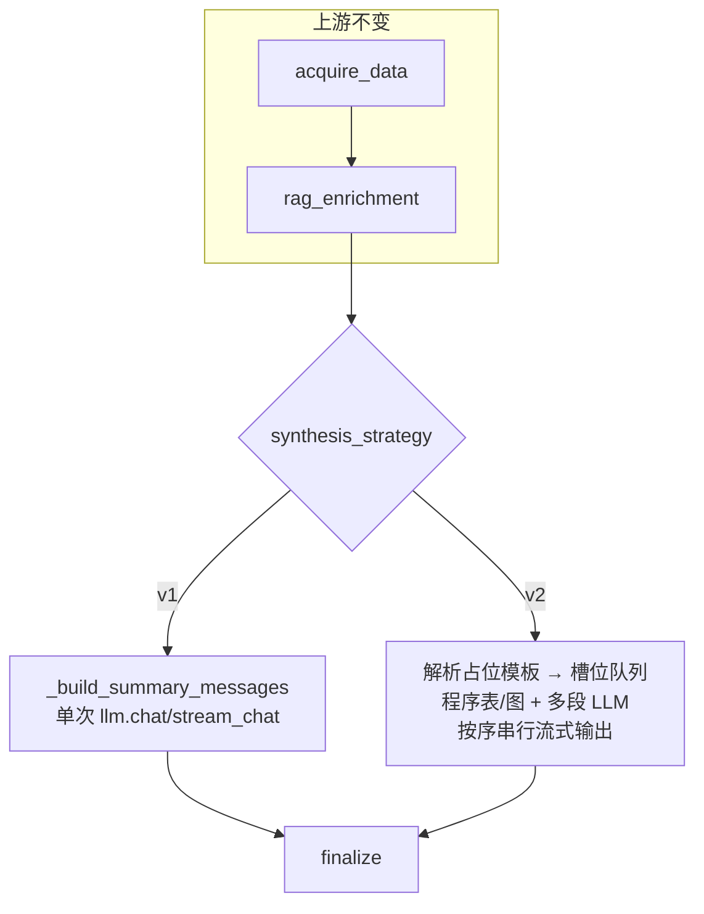

# 综合分析 synthesis 多段生成与流式输出 — 实现方案（v2）

> 版本：2026-05 修订  
> 范围：**以 `synthesis` 节点改造为主**，超温 `overheat_guidance` 为研发入口；与 v1 单 LLM 整篇生成并存，由配置切换。

---

## 0. 可行性结论

**可行。** 前置节点（`normalize_request` → `plan_context_rag` → `intent/plan` → `acquire_data` → `data_quality_gate` → `rag_enrichment`）可保持不变；在 **`gathered_data` / `context_snippets` / `planning_context` 已就绪** 的前提下，将 `synthesis` 拆为「占位模板 + 多槽位（程序表/图 + 多段 LLM）+ **按槽位顺序串行流式输出**」在工程上可落地，且与现有 `iter_nl2sql_stream_events`（`summary_delta` SSE）兼容扩展。

不建议采用「多段 LLM 谁先结束谁先推给前端」的**无序流式**（会破坏九章节报告阅读顺序）；应采用：**段内可并行生成，段间按模板顺序串行推送**（见 §4）。

---

## 1. 改造范围说明（对应问题 1）

| 节点 | 是否必须改 | 说明 |
|------|------------|------|
| `normalize_request` ~ `rag_enrichment` | **否（默认）** | 仍产出同一套 `gathered_data`、`context_snippets`、`planning_context` |
| **`synthesis`** | **是（核心）** | v1/v2 策略分支、多 LLM/程序槽位、有序流式拼装 |
| **`finalize` / 流式后处理** | **小改** | `summary` 改为各槽位拼接全文；`structured_report.tables/charts` 接入 v2 结构化块；trace 记录 `synthesis_strategy` |
| **SSE 协议** | **小改（建议）** | 保留 `summary_delta`；可选增加 `table_payload` / `chart_payload`（见 §5） |
| **`analysis_plan_*` 版本选择** | **建议联动** | v2 策略下应固定或显式选用 **`analysis_plan_<type>` v2**（超温为 q1～q3），否则 `gathered_data` 与九章节模板不匹配 |
| **API 请求体** | 否 | 可不新增字段；策略走环境变量 / `AnalysisConfig` |

结论：**理解正确——主要是 synthesis 改造**；为闭环还需 **计划模板版本联动 + finalize/structured_report +（可选）SSE 事件扩展**，改动面可控且集中在 `AnalysisGraphRunner` 及少量配置。

---

## 2. 双策略总览



| 策略 | 配置值 | 行为 |
|------|--------|------|
| **v1（现网）** | `v1` | 单模板 `analysis_synthesis_*` v1 + 整包 `gathered_data` + RAG + 可选 `planning_context` → **一次** `chat`/`stream_chat` |
| **v2（本方案）** | `v2` | 占位模板 `analysis_synthesis_*` **v2**（九章节骨架）+ **槽位编排**（程序表/图 + 多段 LLM）→ **按章节顺序** 流式输出 |

**切换方式（建议）：**

```text
ANALYSIS_SYNTHESIS_STRATEGY=v1                         # 全局默认
ANALYSIS_SYNTHESIS_STRATEGY_OVERHEAT_GUIDANCE=v2       # 专项覆盖 synthesis 策略
ANALYSIS_PLAN_TEMPLATE_VERSION=v2                      # 全局 plan 模板 version（专项可用 _OVERHEAT_GUIDANCE 等覆盖）
ANALYSIS_PLAN_TEMPLATE_VERSION_OVERHEAT_GUIDANCE=v2
ANALYSIS_SYNTHESIS_TEMPLATE_VERSION=v2                 # 全局 synthesis 整篇模板 version（v2 叙述主用 narrative 子场景）
ANALYSIS_SYNTHESIS_V2_MAX_PARALLEL_LLM=3               # v2 性能项见 .env.example
```

未配置专项 v2 模板时：**回退 v1**（见 §7）。

---

## 3. v2 占位模板与槽位模型

### 3.1 模板来源

- **报告骨架**：`configs/prompts.yaml` → `analysis_synthesis_overheat_guidance` **version: v2**（九章节 + 附件描述）。
- **取数计划**：`analysis_plan_overheat_guidance` **version: v2**（当前 q1～q3，与九章节中「数据表/趋势」诉求对应）。

模板中 **不** 再要求 LLM 在附录手写四张大表（v1 问题）；改为槽位：

| 槽位类型 | 典型章节 | 数据来源 | 生成方式 |
|----------|----------|----------|----------|
| `llm_narrative` | 一、二、四、五、六、八 等叙述章 | `gathered_data` 摘要 + RAG + 可选 `planning_context` | 每章（或合并 2～3 章）**独立** `chat`/`stream_chat`，专用 **narrative 子提示词**（从 v2 骨架拆出，不含表） |
| `table_deterministic` | 三、七、九 及附录表 | `gathered_data[q1]` 等 | **程序渲染** Markdown 表 + 同步写 `structured_report.tables[]` |
| `chart_structured` | 九、附件 / 可选嵌入章 | 同上或聚合指标 | 程序生成 **图表 spec JSON** + 可选 Markdown 说明 |

槽位定义建议放在 YAML 或代码注册表 `SYNTHESIS_V2_SLOT_REGISTRY[analysis_type]`，例如：

```yaml
# 示例（可放 configs/analysis_synthesis_slots_overheat.yaml）
slots:
  - id: s01_meta
    kind: llm_narrative
    title: "一、报告基础信息"
    prompt_scene: analysis_synthesis_overheat_narrative_s01
  - id: s03_stats_table
    kind: table_deterministic
    source_item_ids: [q1]
    table_id: overheat_device_summary
  # ...
```

### 3.2 并行 vs 串行（生成侧）

| 维度 | 建议 | 理由 |
|------|------|------|
| **程序表/图** | **并行**（`asyncio.gather`） | 纯 CPU，无 GPU；与 LLM 同时进行可缩短总耗时 |
| **多段 LLM** | **有限并行**（如 `Semaphore(3)`） | 多路 `chat` 占 vLLM 并发；全并行可能打满 GPU；全串行耗时长 |
| **流式推送** | **严格串行**（按 `slots` 顺序） | 保证前端章节顺序；与用户「按占位模板顺序串行流式加载」一致 |

**结论（对应问题 2）：**  
- **分析/生成可以并行**（表 + 多段 LLM 预生成到缓冲区）。  
- **响应必须串行**：槽位 1 流式推完 → 槽位 2（若已就绪则整块或流式推）→ …  
- **第一章若接 LLM 流式**：该槽执行时边生成边 `summary_delta`；后续槽位在后台并行算完后**排队**，轮到顺序时再推送（可整块 `summary_delta` 或短流式）。

不推荐「谁先算完谁先返回」的全局无序流式。

---

## 4. 流式实现要点（对应问题 2、3）

### 4.1 与现网衔接

现网：`iter_nl2sql_stream_events` → `meta` → 多次 `summary_delta` → `summary_complete` → `finished` → 后台 `_finalize_nl2sql_sequential_v2`。

v2 改造：**复用** `summary_delta` 推送 Markdown 片段；完整 `summary` 仍为各槽位文本拼接，供 `summary_complete` 与 `structured_report.sections` 使用。

### 4.2 推荐实现（单协程 + 槽位队列）

```text
1. 解析 v2 占位模板 → ordered_slots[]
2. 启动后台 Task：并行填充 slot_buffers[i]（表/图/LLM 完整或流式写入 buffer）
3. 主循环 i = 0..n-1：
     - 若 slots[i] 为当前章 LLM 且策略为 live_stream：async for chunk in stream_chat → yield summary_delta
     - 否则：await slot_ready[i] → 将 buffer[i] 分块 yield summary_delta（可选 table/chart 事件）
4. yield summary_complete；后台 finalize 不变
```

### 4.3 结构化表/图返回（对应问题 3）

| 产物 | 流式（SSE） | 结构化（`AnalysisV2Result`） |
|------|-------------|------------------------------|
| 叙述 Markdown | `summary_delta` | `structured_report.sections[]` |
| 表格 | 默认 `summary_delta` 内嵌 Markdown 表；可选 `table_payload` | `structured_report.tables[]`：`{id, title, format:"markdown", content, source_item_ids}` |
| 图表 | 可选 `chart_payload` | `structured_report.charts[]`：`{id, chart_type, spec}`（spec 为 ECharts/plotly 等 JSON） |

**原则：** 表/图 **以程序根据 `gathered_data` 生成为准**，LLM 只写分析句，不「画表」；避免 v1 附录幻觉表。

---

## 5. v1 与 v2 对比（超温）

| 项目 | v1 | v2 |
|------|----|----|
| 数据计划 | q1～q4 聚合 | q1～q3（v2 plan，偏基础信息+SIS+检修佐证） |
| synthesis | 单次 LLM，六章+附录表 | 九章节槽位；表程序出、叙述多段 LLM |
| 流式 | 单次 `stream_chat` | 按槽位顺序串行流式 |
| 输出 token 压力 | 高（附录 4 表易触顶） | 分散到多段，单段更可控 |
| 结构化报告 | 主要从 summary 拆 | 表/图显式写入 `tables`/`charts` |

---

## 6. 其他专项是否需 v2 模板（对应问题 2 延伸）

| 专项 | 是否必须先配 v2 synthesis/plan | 说明 |
|------|------------------------------|------|
| `overheat_guidance` | **是（P0）** | 已有 `analysis_synthesis_overheat_guidance` v2 + `analysis_plan_overheat_guidance` v2 |
| `maintenance_strategy` | **否（可后补）** | 启用 v2 策略且无 v2 模板时 → **回退 v1** 或返回明确 degrade 提示 |
| `four_tube_health_interpretation` | 同上 | 槽位注册表可按类型扩展 |
| `leakage_burst_analysis` | 同上 | 同上 |
| `img_diag` | **独立** | 继续走 `analysis_synthesis_img_diag`，不纳入本 v2 双策略 |

**框架要求：** `synthesis_strategy=v2` 时按 `analysis_type` 查找 `SYNTHESIS_V2_SLOT_REGISTRY`；**无注册则 fallback v1**（日志 + trace 标记 `synthesis_strategy_effective=v1`）。

**不必一次性补全所有专项 v2 提示词**；只需 **超温** 的 v2 plan + v2 槽位/narrative 子提示词 + 表渲染映射。

---

## 7. 配置项汇总（建议）

| 环境变量 | 默认 | 作用 |
|----------|------|------|
| `ANALYSIS_SYNTHESIS_STRATEGY` | `v1` | 全局 synthesis 策略 |
| `ANALYSIS_SYNTHESIS_STRATEGY_<TYPE>` | 空 | 专项覆盖；无槽位注册表时 **effective 回退 v1** |
| `ANALYSIS_PLAN_TEMPLATE_VERSION` / `_*_<TYPE>` | 空 | plan 模板 version；专项 **>** 全局；effective v2 且未配时默认 `v2` |
| `ANALYSIS_SYNTHESIS_TEMPLATE_VERSION` / `_*_<TYPE>` | 空 | synthesis 整篇模板 version（v2 叙述多用 `analysis_synthesis_*_narrative`） |
| `ANALYSIS_SYNTHESIS_V2_*` | 见 `.env.example` | 并行 LLM、单槽 max_tokens、表行数、SSE 结构化事件等 |
| `ANALYSIS_SYNTHESIS_GATHERED_JSON_MAX_CHARS` | `16000` | v1 整包 / v2 各槽 user 数据摘要截断 |
| `ANALYSIS_SYNTHESIS_MAX_TOKENS` | `8192` | **v1** 整篇输出；v2 单槽见 `ANALYSIS_SYNTHESIS_V2_SEGMENT_MAX_TOKENS` |

**与 QA 闭环对齐**：`acquire_data` 将同一 **`plan_template_version`** 传入 `NL2SQLQueryRequest`；自动写入 `nl2sql_qa_examples` 按五元组去重（见 `docs/NL2SQL缓存实现方案.md` §七 ter）。

---

## 8. 代码触点（实现时）

| 模块 | 改动 |
|------|------|
| `app/core/config.py` | `AnalysisConfig` 增加 strategy / template version / v2 并行度 |
| `app/llm/graphs/analysis_graph_runner.py` | `synthesis` 分支；`iter_nl2sql_stream_events` 接 v2 迭代器 |
| **新建** `app/llm/graphs/analysis_synthesis_v2.py`（推荐） | 槽位解析、表渲染、多 LLM 调度、有序流式 |
| `configs/prompts.yaml` | 超温 v2 narrative 子 scene（按章拆分，可选） |
| `configs/analysis_synthesis_slots_overheat.yaml`（可选） | 槽位注册表 |
| `tests/test_analysis_synthesis_v2.py` | 槽位顺序、流式顺序、fallback |

**不宜改动：** `NL2SQLChain`、`acquire_data` 执行逻辑（除非显式切换 `analysis_plan` 版本）。

---

## 9. 风险与约束

1. **vLLM 并发**：多段 LLM 并行受 GPU 并发限制，需 `Semaphore` + 监控 `finish_reason=length`。  
2. **plan v1/v2 与 gathered_data 键**：v2 策略必须配 v2 plan（q1～q3），否则槽位 `source_item_ids` 错位。  
3. **首章流式 + 后续排队**：前端需按顺序拼接 `summary_delta`；若增加 `table_payload`，前端需约定渲染器。  
4. **总耗时**：并行可低于单段超长生成，但多段调用有固定开销；表确定性渲染可显著降低附录 token。

---

## 10. 开发计划（精简）

### 阶段 A：策略路由与版本联动（约 1～2 人日）

- `AnalysisConfig` + 环境变量；`synthesis` 入口 `if strategy==v2` 分发。  
- v2 时 `analysis_plan_*` / `analysis_synthesis_*` **显式 version=v2**（避免 user_id 哈希命中 v1）。  
- trace 增加 `synthesis_strategy`、`template_versions.plan/synthesis`。

### 阶段 B：超温 v2 核心（约 5～8 人日）

- 槽位注册表（九章节 → 表/图/LLM 段映射 q1～q3）。  
- 程序表 Markdown + `structured_report.tables`。  
- 3～5 段 narrative 子提示词 + 有限并行 LLM。  
- **按槽位顺序串行** `iter_v2_synthesis_stream` → 对接 `summary_delta`。  
- 单测：顺序、空数据、并行上限。

### 阶段 C：结构化图表与 SSE 扩展（约 2～3 人日）

- `structured_report.charts` spec 生成（对接现有 `chart_mode`）。  
- 可选 SSE：`table_payload` / `chart_payload`；文档更新 API 说明。  
- `_finalize_nl2sql_sequential_v2` 合并 v2 表/图。

### 阶段 D：其它专项与生产化（按需）

- 为 maintenance 等增加 slot registry + v2 模板；或保持 fallback v1。  
- 压测、默认策略仍为 v1；超温灰度 `ANALYSIS_SYNTHESIS_STRATEGY_OVERHEAT_GUIDANCE=v2`。

---

## 11. 附录：与旧版「程序出表 + digest」方案关系

早期 v2 草案（单 LLM + `build_llm_data_digest` + 去掉附录表）仍有效，可作为 v2 策略下的 **简化子模式**（`v2_lite`）：  
- 表仍程序出，但叙述仍 **单次 LLM**；  
- 本方案为 **完整 v2**：**多段 LLM + 九章节占位 + 有序流式**，更适合长报告与前端分章展示。

二者可并存为 `ANALYSIS_SYNTHESIS_STRATEGY=v2_full|v2_lite|v1`，P0 建议先实现 **v2_full 串行流式** 主路径。

---

## 12. 问题答复摘要

| 问题 | 答复 |
|------|------|
| 是否只改 synthesis？ | **主要是**；需少量联动 plan 版本、finalize/structured_report、SSE。 |
| 流式是否可按模板顺序串行？ | **可以且推荐**；生成可并行，推送必须有序。 |
| 分析并行、输出串行？ | **推荐**；首章可真流式，其余槽位就绪后排队推送。 |
| 图表结构化？ | **可以**；表/图程序生成，SSE + `structured_report` 双写。 |
| 其他专项要 v2 模板吗？ | **不必须一次配齐**；框架 + 超温 P0；无注册回退 v1。 |
