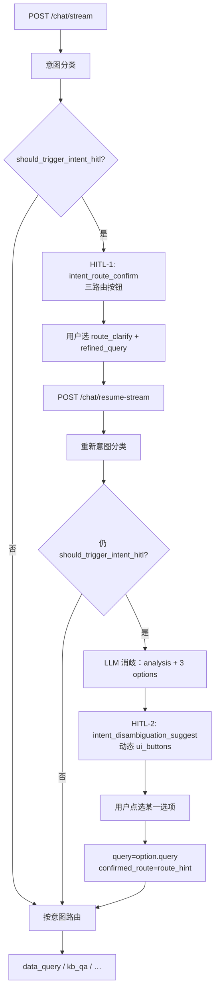

# 智能客服：意图识别失败时人机协同深度改造

> 状态：方案设计（未实施）  
> 背景：在已实现「意图路由确认 HITL（`intent_route_confirm`）+ `route_clarify` 必填 `refined_query` 并重新意图分类」基础上，针对 **补充问句后仍意图失败** 的二次人机协同交互做深度改造。

---

## 1. 背景与问题

### 1.1 现状（方案 A 已落地）

意图边界不清时触发 HITL（`hitl_kind=intent_route_confirm`），用户可选：

| action | 行为 |
|--------|------|
| `route_data_query` | 强制走 NL2SQL |
| `route_kb_qa` | 强制走 RAG |
| `route_clarify` | **必填** `payload.refined_query`，更新 `query` 后 **重新意图分类** 再路由 |

### 1.2 现存缺口

`route_clarify` 续跑路径会先 `_node_intent_classify`，分类结果会覆盖 `intent_prev_task_type`，导致 `after_intent_confirm` 防循环短路在二次失败场景下 **实际未生效**。

因此当 `refined_query` 与原问句相同或仍模糊时：

- 仍可能再次满足 `should_trigger_intent_hitl`；
- 若再次中断，当前会 **重复返回** 同一组三按钮（`route_data_query` / `route_kb_qa` / `route_clarify`）；
- 用户体验差：已补充过问题，仍被要求做「路由方式」选择，而非更具体的问题消歧。

### 1.3 改造目标

```
首轮 intent HITL（三路由按钮）
  → 用户选 route_clarify + refined_query
  → 重新意图分类
  → 若仍意图失败（应触发 HITL）
  → 不再返回三路由按钮
  → 改为：LLM 基于用户问题做简短分析，生成 3 个相关问题选项
     （含偏数据查询、偏知识库检索等）
  → 以同类 HITL SSE（chatbot_hitl_required + ui_buttons）让用户点选
  → 点选后按选项对应 query + route 直接续跑
```

---

## 2. 可行性结论

**结论：可行，且与现有架构契合度高。**

现有智能客服 HITL 已具备「中断 → 动态按钮 → `resume_token` 续跑」完整链路；前端测试页按 SSE `ui_buttons` 动态渲染，**不必大改协议**。

主要增量：

1. 新增一种 HITL 场景（`hitl_kind`）；
2. 一次 LLM 消歧调用（分析 + 三选项 JSON）；
3. 续跑时将选项映射为 `query + confirmed_route` 并直接执行。

### 2.1 可复用能力

| 能力 | 现状 | 对本需求的支持 |
|------|------|----------------|
| HITL 中断 | `pending_hitl` + SSE `chatbot_hitl_required` | 直接复用 |
| 多场景 | `intent_route_confirm` / `nl2sql_gen_failed` | 可新增第 3 种 `hitl_kind` |
| 动态按钮 | `ui_buttons: [{id, label}]` | 不必固定三枚路由按钮 |
| 续跑 API | `action` + `payload`，action 仅非空校验 | 可支持动态 action 或统一 action + index |
| LLM 结构化输出 | `chatbot_follow_up.py` 已有 JSON 解析模式 | 可仿照做「分析 + 三选项」 |
| 会话快照 | `state_snapshot` + `interrupt_payload` | 可存 LLM 生成的选项明细 |

---

## 3. 产品语义与触发边界

### 3.1 触发条件（窄）

同时满足：

1. 来自 **意图 HITL** 的 `route_clarify` 续跑（已带有效 `refined_query`）；
2. 重新意图分类后仍满足 `should_trigger_intent_hitl(state) == True`；
3. 意图 HITL 轮次未超上限（建议 `intent_hitl_round < 2` 时进入本消歧场景，进入后记为 round=2）。

### 3.2 不触发 LLM 消歧（维持现状或直接路由）

- 首轮意图 HITL（仍用现有三路由按钮）；
- 用户直接选 `route_data_query` / `route_kb_qa`；
- `route_clarify` 后分类已成功（高置信、可路由）；
- 已达最大 HITL 轮次（防死循环，见 §6）。

### 3.3 建议默认产品决策（实施前可再拍板）

| 议题 | 建议 |
|------|------|
| 三选项是否必须覆盖「查数 + 知识库」各至少一条 | **是** |
| 用户选完后是否再跑意图分类 | **否**，直接用选项的 `route_hint` 强制路由 |
| 二轮消歧后是否再提供「手动输入」退路 | 可不做新控件；可选后续用 `#query` + 特殊 action |
| 按钮文案 | 短 `title`；完整问句写入 `prompt` / `context` |

---

## 4. 推荐技术方案（简要）

### 4.1 新增 HITL 场景

建议新增：

- `hitl_kind = intent_disambiguation_suggest`（名称可调整）
- 状态位：`intent_hitl_round`（1=首轮路由确认，2=消歧建议）或 `hitl_from_clarify_retry=true`

与首轮 `intent_route_confirm` 分离，便于：

- 不同 prompt / 按钮 / 续跑逻辑；
- 前端按 `hitl_kind` 区分展示；
- 文档与监控单独统计。

### 4.2 新增 LLM 消歧节点

新建模块，例如：`app/llm/graphs/chatbot_intent_disambiguation.py`。

**输入：**

- `query`（即 `refined_query`）
- 本轮 / 上轮 `intent_label`、`intent_confidence`、`intent_reason`
- 可选：简短 history 摘要

**输出 JSON（示例）：**

```json
{
  "analysis": "您的问题同时涉及实时数据和原理说明，系统难以直接判断处理方式。",
  "options": [
    {
      "title": "查1号炉当前负荷",
      "query": "1号炉当前负荷是多少？",
      "route_hint": "data_query"
    },
    {
      "title": "查过热器超温原因",
      "query": "过热器超温的常见原因有哪些？",
      "route_hint": "kb_qa"
    },
    {
      "title": "查负荷与汽温关系",
      "query": "锅炉负荷与主蒸汽温度的一般关系是什么？",
      "route_hint": "kb_qa"
    }
  ]
}
```

**Prompt 约束：**

- 必须 3 条，且至少 1 条偏 `data_query`、至少 1 条偏 `kb_qa`；
- 问句具体、可执行，不要简单复述用户原话；
- 只输出 JSON，便于解析；
- 失败时走规则兜底（见 §6）。

可参考现有 `build_suggested_questions`（`chatbot_follow_up.py`）的 JSON 解析与 LLM 调用方式，但语义不同：本节点是 **消歧候选问句 + 路由提示**，不是回答后的关联推荐。

### 4.3 动态 HITL 按钮与话术

扩展 `build_hitl_interrupt_payload`（或按 `hitl_kind` 分支）：

- **prompt**：LLM 的 `analysis` + 列举三个选项（完整问句可在正文列出，按钮用 `title` 短文案）；
- **ui_buttons**（动态生成），示例：

```json
[
  {"id": "pick_disambiguation_0", "label": "查1号炉当前负荷"},
  {"id": "pick_disambiguation_1", "label": "查过热器超温原因"},
  {"id": "pick_disambiguation_2", "label": "查负荷与汽温关系"}
]
```

- **context** 附带：`disambiguation_options`（含完整 `query` + `route_hint`），供前端 tooltip / 详情展示。

前端测试页（`tests/web/chatbot-stream.html`）**基本不用新控件**：仍渲染 `ui_buttons`。注意：`DEFAULT_HITL_BUTTONS` 回落逻辑需区分新 `hitl_kind`，避免空按钮时错误回落到三路由。

### 4.4 续跑处理

涉及：`apply_chatbot_hitl_action` + `_run_graph_resume`。

**Action 设计（二选一，推荐 A）：**

| 方案 | 说明 |
|------|------|
| **A（推荐）** | 统一 `action=pick_disambiguation_option`，`payload={ "option_index": 0 }` |
| B | 按钮 id 即 action（如 `pick_disambiguation_0`），从 snapshot 查选项 |

**续跑后 state 更新：**

```text
query = options[i].query
confirmed_route = options[i].route_hint   # 直接路由，不再二次意图 HITL
intent_prev_task_type = after_intent_confirm
intent_hitl_round = 2（已完成）
pending_hitl = false
```

**执行：**

- 不再调用 `should_trigger_intent_hitl`；
- 直接 `_execute_route(state, confirmed_route)`。

用户点选后行为清晰：**选哪条问句，就走哪条链路**。

### 4.5 插入图编排的位置

在 `_run_graph_resume` 的 `route_clarify` 分支：

```text
apply(route_clarify)                    # 已实现：必填 refined_query，清空 confirmed_route
→ intent_classify
→ fault_case_gate
→ if should_trigger_intent_hitl:
      if 来自 clarify 续跑且 round 允许:
          LLM 消歧 → prepare_intent_disambiguation_hitl_patch → pending_hitl
          （hitl_kind = intent_disambiguation_suggest）
      else:
          prepare_intent_hitl_patch     # 首轮，维持现状（一般不会走到这里）
→ else:
      route & execute
```

首轮 `_run_graph_sequential`（首次 `intent_route_confirm`）逻辑 **不变**。

### 4.6 端到端时序



---

## 5. 状态与接口草案（字段级）

### 5.1 图状态建议字段

| 字段 | 含义 |
|------|------|
| `intent_hitl_round` | 意图相关 HITL 轮次（1 / 2） |
| `hitl_kind` | `intent_route_confirm` / `intent_disambiguation_suggest` / `nl2sql_gen_failed` |
| `disambiguation_analysis` | LLM 分析正文 |
| `disambiguation_options` | `list[{title, query, route_hint}]` |
| `confirmed_route` | 用户确认或选项强制路由 |
| `hitl_original_query` | 触发链路上的原问 / 补充问 |

### 5.2 SSE `chatbot_hitl_required`（二轮）

与现有帧兼容，额外约定：

```json
{
  "type": "chatbot_hitl_required",
  "hitl_kind": "intent_disambiguation_suggest",
  "resume_token": "cb_rt_xxx",
  "prompt": "分析说明…\n1. …\n2. …\n3. …",
  "ui_buttons": [
    {"id": "pick_disambiguation_0", "label": "短标题1"},
    {"id": "pick_disambiguation_1", "label": "短标题2"},
    {"id": "pick_disambiguation_2", "label": "短标题3"}
  ],
  "context": {
    "original_query": "…",
    "disambiguation_options": [
      {"title": "…", "query": "…", "route_hint": "data_query"}
    ]
  }
}
```

### 5.3 续跑请求示例

```json
{
  "user_id": "u1",
  "session_id": "s1",
  "resume_token": "cb_rt_xxx",
  "action": "pick_disambiguation_option",
  "payload": { "option_index": 0 }
}
```

---

## 6. 兜底与防循环

| 风险 | 对策 |
|------|------|
| LLM 超时 / 解析失败 | 规则模板生成 3 条（基于关键词拆「查数版 / 知识版 / 混合版」） |
| 二轮消歧后仍模糊 | **禁止第三轮意图 HITL**；默认 `kb_qa` 或固定澄清话术 |
| `route_clarify` 无限循环 | `intent_hitl_round` 上限 = 2 |
| 延迟增加 | **仅二轮失败时**调 LLM；可配置开关 + 超时（如 8s） |
| 前端空按钮回落 | 新 `hitl_kind` 勿回落到默认三路由 |

---

## 7. 配置建议

写入 `.env.example` / `app.core.config`（名称可微调）：

| 配置项 | 建议默认 | 说明 |
|--------|----------|------|
| `CHATBOT_INTENT_DISAMBIGUATION_ENABLED` | `true`（在 HITL 总开前提下） | 总开关 |
| `CHATBOT_INTENT_DISAMBIGUATION_TIMEOUT_SEC` | `8` | LLM 消歧超时 |
| `CHATBOT_INTENT_HITL_MAX_ROUNDS` | `2` | 意图 HITL 最大轮次 |

依赖既有：`CHATBOT_HITL_ENABLED`、`CHATBOT_INTENT_HITL_ENABLED`。

---

## 8. 代码落点（实施清单）

| 模块 | 改动要点 |
|------|----------|
| `chatbot_hitl_display.py` | 新 `hitl_kind`、动态按钮构建、prompt 模板 |
| `chatbot_hitl.py` | `prepare_*_patch`、`apply_chatbot_hitl_action` 支持消歧选项 |
| `chatbot_intent_disambiguation.py`（新建） | LLM 调用 + JSON 解析 + 规则兜底 |
| `chatbot_graph_state.py` | 新增状态字段 |
| `chatbot_graph_runner.py` | `_run_graph_resume` clarify 二次失败分支；消歧续跑直路由 |
| `app/models/chatbot.py` | 可选：校验 `pick_disambiguation_option` 的 `option_index` |
| `app/api/chatbot.py` | OpenAPI / docstring 补充新 kind 与 action |
| `configs/prompts.yaml` | 消歧专用 prompt |
| `tests/test_chatbot_hitl.py` | 单测：二次失败 → 新 kind；选项续跑；LLM 失败兜底；禁止第三轮 |
| `tests/web/chatbot-stream.html` | 兼容动态按钮；修正 `DEFAULT_HITL_BUTTONS` 回落 |
| `framework-guide/智能客服整体实现技术说明.md` §12 | 同步文档 |
| `enterprise-level_transformation_docs/…实现方案.md` §17 | 同步文档 |

---

## 9. 测试要点

1. `route_clarify` 后仍模糊 → 返回 `intent_disambiguation_suggest`，按钮 **非** 三路由；
2. 选项 0/1/2 续跑 → `query` 与 `confirmed_route` 正确，且不再弹意图 HITL；
3. LLM 失败 → 兜底选项仍可用并可续跑；
4. 第三轮不再意图 HITL；
5. 前端：新 `hitl_kind` 不错误回落到默认三按钮；
6. 首轮 HITL 行为回归：仍为 `route_data_query` / `route_kb_qa` / `route_clarify`。

---

## 10. 工作量粗估

| 模块 | 量级 |
|------|------|
| 后端 HITL 新 kind + LLM 节点 + resume | 中（约 2–3 个核心文件 + prompt） |
| 测试 | 小～中（单测 + 1 条集成路径） |
| 前端测试页 | 小（mostly 兼容，微调 fallback） |
| 文档 | 小 |

**总体：中等改造，风险可控，建议做。**

---

## 11. 与当前实现的衔接

- 方案 A（`route_clarify` + 必填 `refined_query` + 重分类）已为「二次失败」提供了入口；
- 本改造 **替换二次失败时的交互形态**，而不是简单重复同一套三路由按钮；
- 技术落点自然落在 `_run_graph_resume` 的 `route_clarify` 分支中「`should_trigger_intent_hitl` 仍为真」的路径上。

---

## 12. 实施前待确认清单

1. 三选项是否强制「至少 1 条 data_query + 1 条 kb_qa」？
2. 点选后是否强制 `route_hint`、不再重跑意图分类？（建议：是）
3. 二轮是否保留「我再手动改问句」退路？
4. 按钮展示：短 title + 正文完整问句，还是按钮即完整问句？
5. `hitl_kind` 最终命名确认。

确认后可进入编码实施；本文件作为设计基线。
