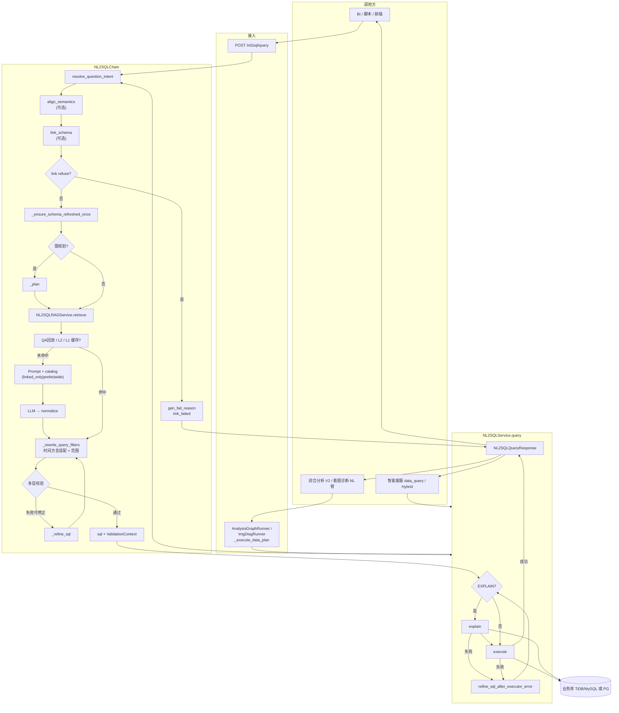
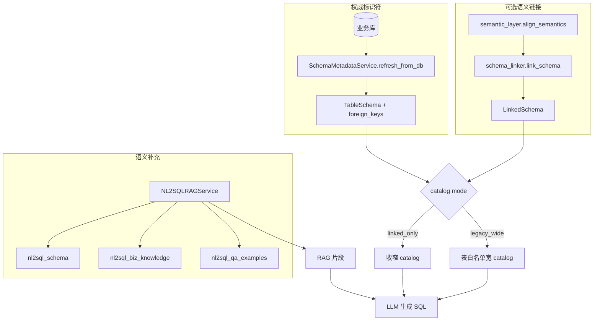
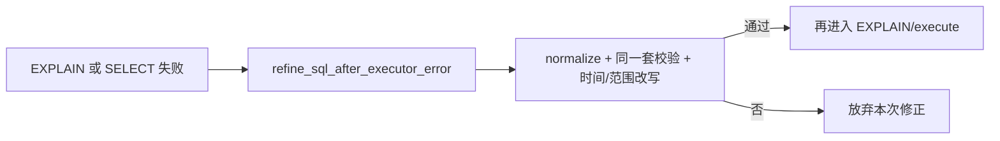

# 企业级 NL2SQL 基座实现方案

> **版本**：2026-08-25（对齐地降所域配置包 + 语义建模 + Schema 链接落地）  
> 本文档描述本仓库 **当前已实现** 的 NL2SQL 基座：与 **RAG** 并列的 **AI 应用基础能力**；接入形态包括 **独立 HTTP**、**智能客服内嵌**、**综合分析 V2（`run-with-nl2sql` / `run-with-nl2sql-stream`）** 与 **综合分析看图诊断（`run-img-diag` / `run-img-diag-stream`，NL2SQL 并行臂）** 等，底层均复用同一 `NL2SQLService`。  
> **域差异原则**：不设运行时双管线分流；锅炉四管 / 地面沉降共用「意图 →（可选）语义对齐 →（可选）Schema 链接 → RAG/缓存 → Prompt → LLM → 时间·范围改写 → 校验 → 执行」；差异仅在 `NL2SQL_BUSINESS_DOMAIN` + `configs/nl2sql_business/<domain>/` 配置包。  
> 地降改造总方案（设计与验收）：`docs/基于地降所项目改造/NL2SQL基座改造.md`。  
> 实现细节与文件映射见 `framework-guide/NL2SQL整体实现技术说明.md`；代码行为明细见 `enterprise-level_transformation_docs/NL2SQL当前完整实现逻辑说明-代码对照版.md`；问句时间/范围详设见 `docs/NL2SQL自然语言时间和范围窗口解析&改写改造落地方案.md`。  
> **流程图体例**对齐 `enterprise-level_transformation_docs/企业级智能客服 LangGraph 框架实现方案.md` §4.0：先 **业务视角（文字流程）**，再 **实现视角（代码级流程图）**（框内优先 `file:` / 类·函数 + `说明:`）。

> 当前 NL2SQL 已实现 L2/L1 生成阶段缓存、校验通过后可选写入 **`nl2sql_qa_examples`**（**五元组**去重，含 **`plan_template_version`**）；运维 **`GET`/`PATCH /rag/nl2sql-auto-qa`** 支持按类型/q*/plan 版本筛选。缓存 `policy_fp` 含 domain、表白名单指纹、catalog mode、**semantic_version**，避免跨业务/跨语义版本脏命中。

---

## 0. 前提重要说明

> 效果较好的 NL2SQL 前提：知识库摄入较完善（表结构、字段、表间关系认知 = **RAG 知识库 + 数据库反射**；地降开启语义链接后，**语义资产 + LinkedSchema** 进一步收窄表列）。

1. 部署级选定业务域：`NL2SQL_BUSINESS_DOMAIN=boiler_four_tube | subsidence` → 加载 `configs/nl2sql_business/<domain>/profile.yaml`（表白名单、JOIN、方言、词表、实体规则、Prompt 版本、语义开关等）。  
2. 业务库连接：host/port/库名/用户默认来自 profile `db.*`；**密码仅** `DB_PASSWORD` / `DB_URL`（勿把明文密码写入 git）。显式 `DB_*` / `NL2SQL_*` 仍优先于 profile。  
3. RAG 摄入须覆盖命名空间：`nl2sql_schema`、`nl2sql_biz_knowledge`、`nl2sql_qa_examples`（同 namespace，靠摄入内容区分业务；地降源文件见 `configs/nl2sql_business/subsidence/rag/`）。  
4. 换业务域时：同步 **配置包 + 业务库 + RAG 内容 + Prompt 版本**（编排代码复用）；地降 PG 须镜像内已装 **asyncpg**（有网机构建）。

**效果优化方向（摘要）**：

```text
启用 nl2sql_qa_examples（强烈建议）——「问法 → 标准 SQL」样例通常比堆表结构更提准确率。
启用 nl2sql_biz_knowledge（建议）——术语、统计口径、时间字段叙述。
地降：语义资产 + Schema 链接（NL2SQL_SEMANTIC_LINK_ENABLED，profile 默认开启）——主表/度量列选对率主杠杆。
库内补外键（若允许）——catalog 出现 FK: 提示；地降另有 join_whitelist（project_name=t_station.name）。
图检索（若已部署 GraphRAG）——补充实体关系召回（与 FK、文档组合）。
```

---

## 1. 文档目的与范围

| 项 | 说明 |
|----|------|
| **目的** | 为企业集成、运维排障、二次开发提供 **统一叙述 + 可对照代码的双视角流程图**（含多业务域配置包与语义链接）。 |
| **范围** | `app/nl2sql/*`、`app/services/nl2sql_service.py`、`app/api/nl2sql.py`；`configs/nl2sql_business/**`；客服 `data_query`；综合分析 `run-with-nl2sql*` / `run-img-diag*` / 地降五类 `subsidence_*`；相关配置与日志。 |
| **不在范围** | 业务库建模规范、黄金集可执行率联调报告细节；一期不做基座内多轮澄清 / 查询类型五阶段 / 图表引擎。演进设计见 `docs/基于地降所项目改造/NL2SQL基座改造.md`。 |

---

## 2. 基座定位：与 RAG 并列的基础能力

- **共性**：共用向量检索基座、`scene="nl2sql"` 检索策略、大模型 endpoint、`PromptTemplateRegistry`、日志与 Prometheus 指标。  
- **差异**：  
  - **RAG**：非结构化知识 → 片段 → 自然语言回答。  
  - **NL2SQL**：自然语言 → **受控只读 SQL** → **结构化 `rows`**，强依赖 **DB 反射**、**SQL 安全校验**；地降部署可叠加 **语义对齐 + 显式 Schema 链接** 收窄 catalog。  
- **多业务域（一套进程一个 domain）**：

  | domain | 方言 | 语义链接（默认） | Prompt | 典型表白名单 |
  |--------|------|------------------|--------|--------------|
  | `boiler_four_tube` | TiDB/MySQL | 关（`legacy_wide`） | `v2` | 锅炉台账/监测表集 |
  | `subsidence` | PostgreSQL | 开（`linked_only`） | `v2_subsidence` | 8 表 `t_data_wash_*` + `t_station` |

- **接入形态**（均复用 `NL2SQLService.query`）：  

  | # | 形态 | 入口 | 要点 |
  |---|------|------|------|
  | 1 | 直连问数 | `POST /nl2sql/query` | 返回 `sql` + `rows`（可选 `parsed_intent`、`gen_fail_reason`） |
  | 2 | 智能客服 | 图节点 `nl2sql_answer` | `record_conversation=False`；可读顶层 `gen_fail_reason`（如 `link_failed:…`） |
  | 3 | 综合分析 V2 | `POST /analysis/run-with-nl2sql*` | `acquire_data` 按 plan **多次** `query`；地降五类 `subsidence_*` |
  | 4 | 看图诊断 | `POST /analysis/run-img-diag*` | NL 并行臂同源；可传 `confirmed_scope`（HITL） |
  | 5 | **数据查询智能体** | `POST /data-query-agent/run-stream` | 库锁定后传可选 **`forced_tables`**（一张 `t_data_wash_*`）；**省略该字段 = 现网全量白名单行为** |

---

## 2.1 配置包驱动（部署级）

```text
显式环境变量 NL2SQL_* / DB_* / ANALYSIS_NL2SQL_*
    ＞  profile.yaml（由 NL2SQL_BUSINESS_DOMAIN 选定）
    ＞ 代码默认值
```

配置包目录（摘要）：

```text
configs/nl2sql_business/
  boiler_four_tube/   # profile、table_scope、join_whitelist、语义占位（默认关）
  subsidence/         # profile、8 表白名单、JOIN、scope_lexicon、entity_rules、
                      # semantic/*、rag/*、eval/golden_set.json
```

`profile.yaml` 典型字段：`db.*`（无密码）、`nl2sql.semantic_link_enabled`、`sql_dialect`、`prompt_default_version`、`schema_link_catalog_mode`、`on_link_failure`、词表/实体规则路径、表白名单文件等。运维极简见企业级简版 §4.4 与 `app/app-deploy/.env.example` NL2SQL 段。

---

## 3. 核心模块一览

| 模块 | 路径 | 职责摘要 |
|------|------|-----------|
| HTTP 直连 | `app/api/nl2sql.py` | 鉴权后转发 `NL2SQLService` |
| HTTP 分析 | `app/api/analysis.py` | `run-with-nl2sql*` / `run-img-diag*` |
| 分析编排 | `analysis_graph_runner.py`、`analysis_img_diag_runner.py` | `_execute_data_plan`；地降 `subsidence_*` plan/synthesis |
| 客服查数成文 | `chatbot_nl2sql_answer.py` | `run_chatbot_nl2sql_query`；消费 `gen_fail_reason` |
| 服务层 | `app/services/nl2sql_service.py` | Chain + Executor + EXPLAIN/执行 refine；填充 `gen_fail_reason` |
| 业务配置包 | `nl2sql_business_profile.py` + `intent_config.py` | domain → profile；与 `app/core/config.py` 合并 DB/NL2SQL 默认 |
| 生成链路 | `app/nl2sql/chain.py` | 意图 → **语义对齐** → **Schema 链接** → Schema/RAG → 缓存 → Prompt → LLM → **时间·范围改写（含 PG 适配）** → 校验/refine |
| 语义层 | `semantic_layer.py` | 加载 `semantic/*`；`align_semantics` → `parsed_intent.semantic` |
| Schema 链接 | `schema_linker.py` | `link_schema` → LinkedSchema；catalog 收窄；`refuse`/`best_effort` |
| SQL 方言 | `sql_dialect.py` | MySQL 时间表达式 → PostgreSQL（`adapt_time_window`） |
| 问句意图 | `question_intent.py`、`time_intent_display.py`、`scope_parser_rule.py`、`scope_parser_llm.py`、`scope_parser_subsidence.py` | 时间 **始终规则**（输出后按方言适配）；范围默认 **rule**；subsidence 走地降解析器；`confirmed_scope` → `human_confirmed` |
| 意图展示 | `question_intent_display.py` | Prompt 注入时间/范围 + **语义指标摘要 / 链接主表** |
| Schema | `schema_service.py` | DB 反射；PG/MySQL 共用 `_create_business_engine` |
| 专用 RAG | `rag_service.py` | 三命名空间检索 |
| 缓存 / QA | `sql_cache.py`、`sql_skeleton.py`、`qa_feedback.py` | L2/L1；`policy_fp` 含 domain / semantic_version |
| Prompt | `prompt_builder.py` + `configs/prompts.yaml` | `nl2sql`（`v2` / `v2_subsidence`）；`analysis_*_subsidence_*` |
| 校验/执行 | `validator.py`、`executor.py` | 只读、白名单；PG 建连不加 MySQL `charset` |
| 实体规则 | `entity_rules.py` | 可选否定规则（可从 profile `entity_rules_file` 加载） |
| 范围改写 | `scope_sql_rewrite.py` | 锅炉 `@device_keyword` 等；地降 `@district` / `@station_*` |

---

## 4. 业务逻辑流程图

> 体例同智能客服方案 §4.0：**业务视角**不出现文件名，便于产品/运维对齐；**实现视角**每个框标 `file:` / 类·函数 + `说明:`，与当前仓库调用链一致。

### 4.0 端到端主路径（`POST /nl2sql/query` 与所有内嵌复用的同一基座闭环）

#### 业务视角（文字流程）

从**业务与使用方**看，一次「自然语言 → 查库结果」主线如下（客服/综合分析只是**多次或包装后**调用同一闭环）。

```text
                    【调用方发起自然语言问数】
                                  │
                                  ▼
              ┌───────────────────────────────────┐
              │ 接入：用户、会话、自然语言问题；     │
              │ 部署已选定业务域（锅炉 / 地降等）   │
              │ 可选：分析场景、计划子任务、时间意图 │
              │ 文本、人工确认范围（看图诊断 HITL） │
              └───────────────────┬───────────────┘
                                  ▼
              ┌───────────────────────────────────┐
              │ 问句意图解析（基座内、先于生成 SQL） │
              │ · 时间：程序规则（近一周/昨天/季度…）│
              │ · 范围：锅炉＝机组/设备/管排等；     │
              │   地降＝行政区/测站等；可选 LLM；    │
              │   若已人工确认则直接采用范围        │
              └───────────────────┬───────────────┘
                                  ▼
              ┌───────────────────────────────────┐
              │（可选，地降默认开）语义对齐         │
              │ 问句 → 业务指标/实体绑定            │
              └───────────────────┬───────────────┘
                                  ▼
              ┌───────────────────────────────────┐
              │（可选，地降默认开）Schema 链接      │
              │ 绑定 → 主表/列/建议过滤；            │
              │ 链接失败：拒绝生成 或 宽 catalog 降级│
              └───────────────────┬───────────────┘
                                  ▼
              ┌───────────────────────────────────┐
              │ 认识库表：反射业务库；按链接结果收窄 │
              │ catalog（或传统宽表白名单）；        │
              │ Schema/业务/样例三类 RAG 补语义     │
              └───────────────────┬───────────────┘
                                  ▼
              ┌───────────────────────────────────┐
              │（可选）命中生成缓存或 QA 样例回放 → │
              │ 仍须过校验与时间/范围改写           │
              │ 未命中 → 拼装 Prompt → 大模型出 SQL │
              └───────────────────┬───────────────┘
                                  ▼
              ┌───────────────────────────────────┐
              │ 程序改写：时间窗占位符（按方言适配   │
              │ MySQL↔PostgreSQL）、范围占位符 →     │
              │ 安全校验（失败可让模型按错误再验）  │
              └───────────────────┬───────────────┘
                                  ▼
              ┌───────────────────────────────────┐
              │ 执行：可选先 EXPLAIN，再只读 SELECT；│
              │ 执行失败可再修正（有次数上限）      │
              └───────────────────┬───────────────┘
                                  ▼
              ┌───────────────────────────────────┐
              │【结束】返回 SQL + 结果行；          │
              │ 可选 parsed_intent（含 semantic /   │
              │ linked_schema）；失败可读           │
              │ gen_fail_reason（如 link_failed）   │
              └───────────────────────────────────┘
```

补充说明（业务口径）：

- **时间**始终由基座规则解析；可用 `time_intent_text` 指定抽文本；**不能**靠 `confirmed_scope` 覆盖时间窗。地降执行前会把时间表达式适配为 **PostgreSQL**。  
- **范围**：默认规则；可开 LLM；看图诊断等可传 **`confirmed_scope`** → `human_confirmed`。地降范围词表/解析器与锅炉不同（行政区、测站等）。  
- **语义链接**：仅当配置包/`NL2SQL_SEMANTIC_LINK_ENABLED` 开启时生效（地降默认开、锅炉默认关）；链接失败策略见 `on_link_failure`（`refuse` / `best_effort`）。  
- **呈现**：基座返回 `sql`/`rows`（及可选意图/失败原因）；客服收紧分析、综合分析报告合成均在**调用方**完成。

---

#### 实现视角（代码级流程图）

对齐 **当前仓库** 基座闭环。框内优先 **Python 路径**、**类 / 函数**，并附 **`说明:`**。客服 / 综合分析在入口处分岔后，均进入同一 `NL2SQLService.query`。

```text
         【入口 A】POST /nl2sql/query
         【入口 B】客服 nl2sql_answer / Hybrid 查数臂
         【入口 C】分析 acquire_data → 多次 query
         【入口 D】看图诊断 NL 臂（可带 confirmed_scope）
                                  │
                                  ▼
┌─────────────────────────────────────────────────────────────────┐
│ 【HTTP 直连入口】（仅入口 A）                                   │
│ file: app/api/nl2sql.py                                         │
│ fn:   nl2sql_query                                              │
│ 说明: 鉴权后转发；502 封装执行错误                               │
└───────────────────────────────┬─────────────────────────────────┘
                                  ▼
┌─────────────────────────────────────────────────────────────────┐
│ 【服务编排】                                                    │
│ file:  app/services/nl2sql_service.py                           │
│ class: NL2SQLService                                            │
│ meth:  query                                                    │
│ 说明: 可选写会话 → Chain 生成 → EXPLAIN?/execute → 执行失败 refine│
│       填充 gen_fail_reason；指标 NL2SQL_QUERY_COUNT / ERROR；    │
│       可选返回 parsed_intent（含 semantic / linked_schema）     │
│ req:  app/models/nl2sql.py · NL2SQLQueryRequest                 │
│       （question / time_intent_text / confirmed_scope / …）     │
└───────────────────────────────┬─────────────────────────────────┘
                                  ▼
┌─────────────────────────────────────────────────────────────────┐
│ 【Chain：意图 → 语义对齐 → Schema 链接】                        │
│ file:  app/nl2sql/chain.py · NL2SQLChain                        │
│ meth:  generate_sql_with_validation_context                     │
│ ① resolve_question_intent — 时间规则 + 范围 rule/LLM/HITL       │
│    └─ question_intent.py；地降另走 scope_parser_subsidence      │
│       · confirmed_scope → parse_mode=human_confirmed（仅范围）  │
│ ①b align_semantics（semantic_link 开启时）                      │
│    └─ semantic_layer.py → parsed_intent.semantic                │
│ ①c link_schema（semantic_link 开启时）                          │
│    └─ schema_linker.py → linked_schema；catalog 模式收窄        │
│       refuse → 提前结束（gen_fail_reason=link_failed:…）        │
│ ② _ensure_schema_refreshed_once — DB 反射（PG/MySQL）           │
│    └─ schema_service.py                                         │
└───────────────────────────────┬─────────────────────────────────┘
                                  ▼
┌─────────────────────────────────────────────────────────────────┐
│ 【Chain：规划 → RAG → 缓存 / QA 回放】                          │
│ ③ _plan（可选；真实库默认跳过 NL2SQL_DISABLE_PLANNER_…）        │
│ ④ NL2SQLRAGService.retrieve — schema/biz/qa 三命名空间          │
│    └─ rag_service.py                                            │
│ ⑤ 可选 QA 槽位严格回放（qa_feedback）                           │
│ ⑥ 可选 L2 / L1（policy_fp 含 domain、semantic_version、…）     │
│ 说明: 意图/语义/链接在缓存查找之前；命中后仍走改写+校验         │
└───────────────────────────────┬─────────────────────────────────┘
                                  ▼
┌─────────────────────────────────────────────────────────────────┐
│ 【Chain：生成 → 改写 → 校验】（缓存未命中或需重生）             │
│ ⑦ PromptBuilder + scene=nl2sql（v2 / v2_subsidence）            │
│    catalog 来自 linked_only / linked_prefer / legacy_wide       │
│    可注入 semantic / linked_schema 摘要（INJECT_PARSED_INTENT） │
│ ⑧ LLM → normalize_sql                                           │
│ ⑨ _rewrite_* + _rewrite_query_filters                           │
│    · 时间占位符 + sql_dialect.adapt_time_window（PG）           │
│    · 范围：锅炉 @unit/@device…；地降 @district / @station_*     │
│ ⑩ SQLValidator + 白名单 + 列–表绑定 + entity_rules；可 refine   │
│ 返回 (sql, NL2SQLValidationContext)                             │
└───────────────────────────────┬─────────────────────────────────┘
                                  ▼
┌─────────────────────────────────────────────────────────────────┐
│ 【服务层执行闭环】NL2SQLService.query 续                        │
│ file: app/nl2sql/executor.py · SQLExecutor                      │
│  · NL2SQL_EXPLAIN_BEFORE_EXECUTE → explain                      │
│  · execute(SELECT)（PG 经 asyncpg / SQLAlchemy）                │
│  · 失败且可 refine → chain.refine_sql_after_executor_error      │
│    （次数 ≤ NL2SQL_MAX_EXEC_REFINES）                           │
└───────────────────────────────┬─────────────────────────────────┘
                                  ▼
┌─────────────────────────────────────────────────────────────────┐
│ 【响应】NL2SQLQueryResponse(sql, rows[, parsed_intent,          │
│         gen_fail_reason])                                       │
│ 直连回客户端；客服可读 gen_fail_reason；分析消费 rows 合成报告  │
└─────────────────────────────────────────────────────────────────┘
```

**图注（调用约定）**：

- 框内优先 **`file:` + 类/方法**，其后 **`说明:`** 为职责摘要。  
- **所有接入形态**在 `NL2SQLService.query` 汇合；差异在请求字段与是否 `record_conversation`；**业务差异靠部署 domain 配置包**，不靠请求内切换。  
- **`confirmed_scope` 只覆盖范围**；时间仍规则解析，再按方言适配。

**实现落点速查（文件 → 职责）**

| 环节 | 文件 | 符号（简练） |
|------|------|----------------|
| HTTP 直连 | `app/api/nl2sql.py` | `nl2sql_query` |
| 请求/响应模型 | `app/models/nl2sql.py` | `NL2SQLQueryRequest` / `Response`（含 `gen_fail_reason`） |
| 业务配置包 | `nl2sql_business_profile.py`、`intent_config.py` | domain → profile 合并 |
| 服务 | `app/services/nl2sql_service.py` | `query` |
| Chain | `app/nl2sql/chain.py` | `generate_sql_with_validation_context`、改写、refine |
| 语义 / 链接 | `semantic_layer.py`、`schema_linker.py` | `align_semantics`、`link_schema` |
| 方言 | `sql_dialect.py` | `adapt_time_window` |
| 意图门面 | `question_intent.py` | `resolve_question_intent` |
| 时间规则 | `time_intent_display.py` | `extract_time_window_*`、锚点 lookback |
| 范围规则/LLM/地降 | `scope_parser_rule.py`、`scope_parser_llm.py`、`scope_parser_subsidence.py` | |
| 范围改写 | `scope_sql_rewrite.py` | 锅炉 + 地降占位符 |
| Schema / RAG | `schema_service.py`、`rag_service.py` | `refresh_from_db`、`retrieve` |
| 缓存 / QA | `sql_cache.py`、`sql_skeleton.py`、`qa_feedback.py` | L2/L1；`policy_fp` |
| 校验 / 执行 | `validator.py`、`executor.py` | `validate`、`explain`、`execute` |
| 客服包装 | `chatbot_nl2sql_answer.py` | `run_chatbot_nl2sql_query` |
| 分析取数 | `analysis_graph_runner.py` 等 | `_execute_data_plan`；`subsidence_*` |

---

### 4.1 智能客服内嵌（`data_query` / Hybrid 查数臂）

#### 业务视角

```text
  意图判为「结构化查库」或 Hybrid 需要查数
            │
            ▼
  调用同一 NL2SQL 基座得到 sql + rows
            │
            ▼
  列过滤展示 →（可选）收紧分析成自然语言
            │
            ▼
  流式/结束帧带回 used_nl2sql、nl2sql_analysis 等 meta
```

#### 实现视角

```text
┌─────────────────────────────────────────────────────────────────┐
│ file: chatbot_graph_runner.py · _node_nl2sql_answer             │
│ 说明: data_query 分支；Hybrid 臂内亦可调同一查数入口            │
└───────────────────────────────┬─────────────────────────────────┘
                                  ▼
┌─────────────────────────────────────────────────────────────────┐
│ file: chatbot_nl2sql_answer.py · run_chatbot_nl2sql_query       │
│ 说明: 构造 NL2SQLQueryRequest（可带 sql_gen_extra_hint）        │
│       → NL2SQLService.query(record_conversation=False)          │
│       → 可读 gen_fail_reason（如 link_failed）决定是否提示重试  │
│       → summarize_nl2sql_with_llm / analysis_stream_plan        │
│ 展示列过滤: chatbot_nl2sql_display.filter_chatbot_nl2sql_…    │
└─────────────────────────────────────────────────────────────────┘
```

详述见 **`企业级智能客服 LangGraph 框架实现方案.md`** §4.6 / §4.7。

---

### 4.2 综合分析 V2（`POST /analysis/run-with-nl2sql*`）

#### 业务视角

```text
  用户提交分析类型 + 自然语言 query
  （锅炉超温等 / 地降五类 subsidence_*）
            │
            ▼
  规划前检索与数据计划（多子任务问句）
            │
            ▼
  按依赖分层取数：同层可并行多次「问句→SQL→结果」
  （每次 = 基座闭环；时间意图优先用用户原句，防 plan 附录污染）
            │
            ▼
  质量门 → 业务 RAG → 合成结构化报告（非客服口语化链路）
```

#### 实现视角

```text
┌─────────────────────────────────────────────────────────────────┐
│ file: app/api/analysis.py · run_analysis_nl2sql(_stream)        │
│ → AnalysisService → AnalysisGraphRunner.run_with_nl2sql         │
│ 地降: analysis_plan/synthesis 走 analysis_*_subsidence_* Prompt │
└───────────────────────────────┬─────────────────────────────────┘
                                  ▼
┌─────────────────────────────────────────────────────────────────┐
│ acquire_data → _execute_data_plan                               │
│ 说明: dependency 分层；默认同层 asyncio.gather 并行 query       │
│ 每项: NL2SQLQueryRequest(question=task.question,                │
│       time_intent_text=用户 query, plan_item_id, …)             │
│       record_conversation=False；单任务最多 2 次尝试            │
│ 开关: ANALYSIS_NL2SQL_ACQUIRE_* / max_nl2sql_calls              │
└─────────────────────────────────────────────────────────────────┘
```

---

### 4.3 综合分析看图诊断（`POST /analysis/run-img-diag*`）

#### 业务视角

```text
  上传图像 + 泄漏位置/问句等
            │
            ├──────────────┬──────────────────┐
            ▼              ▼                  ▼
       视觉识别臂     NL2SQL 取数臂      业务 RAG 臂
            │              │                  │
            │     （可先 HITL 确认范围）       │
            │              │                  │
            └──────────────┴──────────────────┘
                            ▼
                   汇合后合成报告（同步或流式）
```

#### 实现视角

```text
┌─────────────────────────────────────────────────────────────────┐
│ AnalysisImgDiagGraphRunner：并行 lane                           │
│ NL 臂：plan_context_rag(scene=nl2sql) → acquire_data            │
│        → _execute_data_plan（与 §4.2 同源）→ data_quality_gate  │
│ HITL: confirmed_scope / scope_intent_text / original_query      │
│       注入 NL2SQLQueryRequest → 基座 human_confirmed（仅范围）  │
└─────────────────────────────────────────────────────────────────┘
```

---

### 4.4 问句意图与 SQL 改写（基座内关键子链）

#### 业务视角

```text
  用户问句（或更干净的 time_intent / 确认范围）
            │
            ├─ 时间：近 N 天 / 昨天 / 本月 / 季度… → 生效时间窗
            │        （无表达时默认「昨天」口径；地降再适配 PG）
            ├─ 范围：锅炉＝机组/设备/管排…；地降＝行政区/测站…
            │        （HITL 确认则跳过自动范围解析）
            ▼
  模型 SQL 中的 @t_*、范围占位符被程序替换
            ▼
  再执行校验与查库
```

#### 实现视角

```text
resolve_question_intent
  ├─ confirmed_scope? → QuestionScopeIntent 直接采用；时间仍 extract_* 规则
  └─ else → 按 domain：锅炉 scope_parser_rule/llm；地降 scope_parser_subsidence
            + extract_time_window / extract_time_anchor
            │
            ▼
_rewrite_query_filters（chain.py）
  ├─ _resolve_time_window_for_rewrite（锚点向前 N 天 / plan 长窗仲裁）
  ├─ _rewrite_time_placeholders / 字面量窗 → sql_dialect.adapt_time_window
  └─ rewrite_scope_sql_placeholders（@unit/@device… 或 @district/@station_*）
```

| 能力 | 是否基座 | 覆盖方式 |
|------|----------|----------|
| 时间解析 | 是（规则） | `time_intent_text`；**无** confirmed 时间窗 API；方言适配在改写阶段 |
| 范围解析 | 是（默认 rule） | domain 词表/解析器；或 `confirmed_scope` |
| 锅炉字段 | 规则可覆盖 LLM | `finalize_llm_scope`（锅炉域） |

---

## 5. 代码版补充图（Mermaid）

> 与 §4 实现视角语义一致，便于编辑器预览；排障优先对照 §4.0 代码框。

### 5.1 端到端（服务 + Chain + 执行）



### 5.2 Schema、语义链接与 RAG



### 5.3 执行期 refine



---

## 6. 关键工程要点

| 主题 | 说明 |
|------|------|
| **业务域** | `NL2SQL_BUSINESS_DOMAIN` → `configs/nl2sql_business/<domain>/`；一套进程一个 domain。 |
| **连接串** | 密码用 `DB_PASSWORD`/`DB_URL`；host/port/库/用户优先显式 `DB_*`，否则 profile `db.*`。PG 需 **asyncpg**。 |
| **表白名单 / JOIN** | 默认跟配置包文件；显式 `ANALYSIS_NL2SQL_TABLE_SCOPE_*` 仍可覆盖。地降另有 `join_whitelist`。 |
| **语义链接** | `NL2SQL_SEMANTIC_LINK_ENABLED` + `SCHEMA_LINK_CATALOG_MODE` + `ON_LINK_FAILURE`；地降默认开。 |
| **外键与 JOIN** | 反射 FK 写入 catalog；无物理 FK 依赖 RAG / join 白名单。 |
| **列–表绑定** | `schema_ok` 时校验 `alias.column` 是否属于该物理表。 |
| **实体规则** | 否定规则；路径可来自 profile `entity_rules_file`。 |
| **意图防污染** | 综合分析传 `time_intent_text=用户原句`，避免 plan 附录污染。 |
| **HITL 范围** | `confirmed_scope` → `human_confirmed`；**不覆盖时间**。 |
| **缓存** | `policy_fp` 含 domain、allowlist、catalog mode、**semantic_version**。 |
| **方言** | 时间改写经 `sql_dialect`；勿在 Prompt 写死仅 MySQL 函数（地降用 `v2_subsidence`）。 |
| **EXPLAIN / 执行 refine** | 见环境变量表；无 LangChain 时 refine 不生效。 |
| **会话隔离** | 直连与客服建议不同 `session_id` 前缀。 |

---

## 7. 配置与环境变量（摘要）

| 变量 | 作用（与代码默认一致） |
|------|------|
| `NL2SQL_BUSINESS_DOMAIN` | `boiler_four_tube` \| `subsidence` → 加载配置包 |
| `DB_URL` / `DB_PASSWORD` / `DB_*` | 业务库；密码勿写入 profile |
| `NL2SQL_SEMANTIC_LINK_ENABLED` | 语义对齐 + Schema 链接总开关（可被 profile 默认） |
| `NL2SQL_SEMANTIC_DICT_PATH` | 语义资产根（覆盖 profile） |
| `NL2SQL_SCHEMA_LINK_CATALOG_MODE` | `linked_only` \| `linked_prefer` \| `legacy_wide` |
| `NL2SQL_ON_LINK_FAILURE` | `refuse` \| `best_effort` |
| `NL2SQL_PROMPT_DEFAULT_VERSION` | 如 `v2` / `v2_subsidence` |
| `NL2SQL_DISABLE_PLANNER_WHEN_DB_SCHEMA` | 默认 `true`：反射成功则跳过 `_plan` |
| `NL2SQL_CACHE_ENABLED` | 代码默认 `false`；`.env.example` 示例常开 |
| `NL2SQL_EXPLAIN_BEFORE_EXECUTE` | 默认 `false` |
| `NL2SQL_REFINE_ON_EXEC_ERROR` | 默认 `true` |
| `NL2SQL_MAX_EXEC_REFINES` | 默认 `1` |
| `NL2SQL_ENTITY_RULES` / `_FILE` | 可选否定实体规则 |
| `NL2SQL_INTENT_PARSE_MODE` | 默认 **`rule`**；可选 `llm` / `rule_with_llm_fallback` |
| `NL2SQL_SCOPE_SQL_REWRITE_ENABLED` | 代码默认 **`true`** |
| `NL2SQL_SCOPE_LEXICON_FILE` | 范围词典（可被 profile 指向地降词表） |
| `NL2SQL_SCOPE_PARSE_*` | 范围 LLM 超时/温度/提示词版本 |
| `NL2SQL_INJECT_PARSED_INTENT` / `RESPONSE_INCLUDE_*` / `TRACE_INCLUDE_*` | 意图（含 semantic/link）注入 Prompt / API / trace |
| `NL2SQL_ANCHOR_FALLBACK_*` | plan「锚点向前 N 天」无锚点时的 NOW 回退 |
| `NL2SQL_REJECT_UNRESOLVED_TIME_PLACEHOLDERS` | 拒绝未解析的 `@t_*` |
| `ANALYSIS_NL2SQL_TABLE_SCOPE_*` / `JOIN_WHITELIST*` | 显式覆盖表白名单/JOIN（未设 domain 时的旧路径仍可用） |
| `ANALYSIS_NL2SQL_ACQUIRE_*` | 分析取数同层并行等 |
| `RAG_SCENE_NL2SQL_*` | NL2SQL 检索 profile |

完整列表见 `app/app-deploy/.env.example` 与 `framework-guide/NL2SQL整体实现技术说明.md`（后者待同步基座改造章节）。运维极简：`系统整体逻辑、配置说明-简版.md` §4.4。

**优先级**：显式环境变量 ＞ `profile.yaml`（由 domain 选定）＞ 代码默认。`.env.example` 示例值可能与代码默认不同，以实际部署 `.env` 为准。

---

## 8. 相关文档索引

| 文档 | 内容 |
|------|------|
| `docs/基于地降所项目改造/NL2SQL基座改造.md` | **现网演进主方案**（配置包 / 语义 / Schema 链接 / 验收） |
| `enterprise-level_transformation_docs/NL2SQL当前完整实现逻辑说明-代码对照版.md` | 代码行为端到端细节（**待补**语义链接与 domain） |
| `framework-guide/NL2SQL整体实现技术说明.md` | 模块映射、API、配置、日志（**待补**配置包与 PG） |
| `docs/NL2SQL系统概要设计.md` | 产品与模块概要（**建议补**多业务域） |
| `docs/NL2SQL缓存实现方案.md` | L2/L1 与 QA；核对 `policy_fp` 含 semantic_version |
| `docs/NL2SQL自然语言时间和范围窗口解析&改写改造落地方案.md` | 时间/范围；地降占位符与方言适配可对照代码 |
| `docs/基于地降所项目改造/NL2SQL基座五阶段改造方案(废弃…)` | **已废弃**；勿作现网依据 |
| `enterprise-level_transformation_docs/系统整体逻辑、配置、运维说明/系统整体逻辑、配置说明-简版.md` | 运维极简（§4.4 已含 domain/`DB_PASSWORD`） |
| `enterprise-level_transformation_docs/项目整体部署运维手册.md` | 部署运维（建议补 domain 与源码挂载） |
| `enterprise-level_transformation_docs/企业级智能客服 LangGraph 框架实现方案.md` | 客服图与 `data_query` |
| `enterprise-level_transformation_docs/企业级综合分析实现和使用说明.md` | `run-with-nl2sql*`；地降 `subsidence_*` 建议补说明 |
| `enterprise-level_transformation_docs/企业级综合分析-看图诊断实现和使用说明.md` | `img_diag` 并行臂与 HITL |

---

*代码变更时请同步更新本文、`NL2SQL基座改造.md`（设计口径）与 `framework-guide/NL2SQL整体实现技术说明.md`（实现映射）。*
