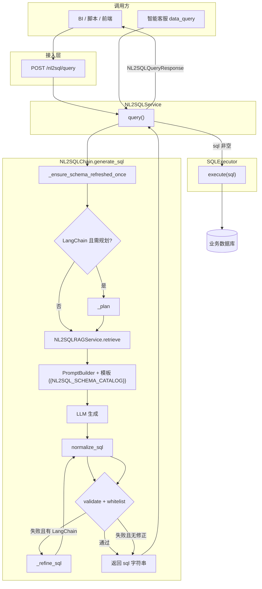
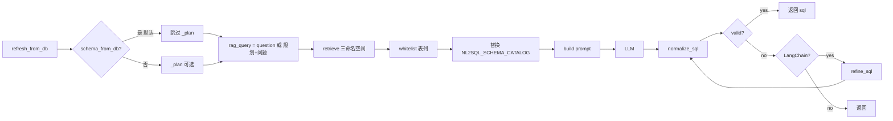
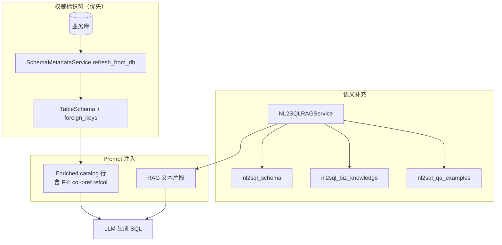

# 企业级 NL2SQL 实现方案

> 本文档描述本仓库 **当前已实现** 的 NL2SQL 能力：与 **RAG** 并列的 **AI 应用基础能力**、**独立 HTTP 接口**与**智能客服内嵌**双形态接入、DB 反射与专用 RAG 协同、安全执行与可观测性。  
> 实现细节与文件映射见 `framework-guide/NL2SQL整体实现技术说明.md`；总体设计见 `docs/NL2SQL系统概要设计.md`；架构位置见 `docs/大小模型应用技术架构与实现方案.md` §1、§4.6。

---

## 1. 文档目的与范围

| 项 | 说明 |
|----|------|
| **目的** | 为企业集成、运维排障、二次开发提供 **统一叙述 + 可对照代码的流程图**。 |
| **范围** | `app/nl2sql/*`、`app/services/nl2sql_service.py`、`app/api/nl2sql.py`、智能客服 `data_query` 分支、相关配置与日志。 |
| **不在范围** | 业务库建模规范、SQL 准确率评估体系（可另文补充）。 |

---

## 2. 基座定位：与 RAG 并列的基础能力

- **共性**：NL2SQL 与通用 RAG 共用 **向量检索基座**（`RAGService` + 命名空间隔离）、**场景化检索策略**（`scene="nl2sql"`）、**大模型 endpoint**、**Prompt 模板注册**（`PromptTemplateRegistry`）、**日志与 Prometheus 指标**。
- **差异**：  
  - **RAG**：非结构化/半结构化知识 → 检索片段 → 生成自然语言回答。  
  - **NL2SQL**：自然语言 → **受控只读 SQL** → **结构化结果集**（`rows`），强依赖 **数据库反射** 与 **SQL 安全校验**。
- **接入形态**：  
  1. **直接调用**：`POST /nl2sql/query`（`NL2SQLQueryRequest` → `sql` + `rows`），适合 BI、低代码、内部工具。  
  2. **内嵌复用**：智能客服意图 **`data_query`** 调用同一 `NL2SQLService`（通常 `record_conversation=False`），再由 `chatbot_nl2sql_answer.summarize_nl2sql_with_llm` 将 SQL/结果转为自然语言。

---

## 3. 核心模块一览

| 模块 | 路径 | 职责摘要 |
|------|------|-----------|
| HTTP API | `app/api/nl2sql.py` | 鉴权后转发 `NL2SQLService`；起止日志 |
| 服务层 | `app/services/nl2sql_service.py` | Chain + Executor + 会话 + 指标 |
| 生成链路 | `app/nl2sql/chain.py` | 反射、规划、RAG、Prompt、LLM、归一化、校验、修正 |
| Schema | `app/nl2sql/schema_service.py` | DB 反射、`TableSchema`、**外键** → catalog |
| 专用 RAG | `app/nl2sql/rag_service.py` | 三命名空间检索 + 策略层/可选图 |
| Prompt | `app/nl2sql/prompt_builder.py` + `configs/prompts.yaml` | 拼装 + `{{NL2SQL_SCHEMA_CATALOG}}` |
| 校验/执行 | `app/nl2sql/validator.py`、`executor.py` | 只读、白名单、引号外单行化、执行 |

---

## 4. 文字版逻辑流程

### 4.1 端到端（HTTP 直连）

1. 客户端调用 **`POST /nl2sql/query`**，携带 `user_id`、`session_id`、`question`。  
2. **API 层** 打日志后调用 **`NL2SQLService.query`**（可选写入会话与指标计数）。  
3. **`NL2SQLChain.generate_sql`**：  
   - **首次** 尝试 **`SchemaMetadataService.refresh_from_db()`**；成功则内存中有真实表、列、**外键**；失败则仅 Demo 或后续依赖 RAG。  
   - 判断是否 **真实库已就绪**（非仅 `orders` Demo）。  
   - **规划 `_plan`**：仅当 LangChain 可用且 **未** 处于「禁用规划 + 真实库」组合时执行；默认 **真实库成功则跳过规划**，减少虚构表名进入 RAG query。  
   - **RAG**：`NL2SQLRAGService.retrieve` 在 `nl2sql_schema`、`nl2sql_biz_knowledge`、`nl2sql_qa_examples` 检索并去重；若有规划摘要则与问题拼接为检索 query。  
   - **白名单**：真实库 → 反射表列集合；否则从片段抽取。  
   - **Prompt**：加载 `nl2sql` 场景模板，替换 **`{{NL2SQL_SCHEMA_CATALOG}}`** 为全库 enriched 目录（含 **FK:列→表.列**），或与 RAG hints/降级文案组合。  
   - **LLM** 生成 SQL → **`normalize_sql`**（去 markdown 围栏、引号外空白压成单行）→ **校验**（只读 + 标识符白名单）→ 失败则 **`_refine_sql`** 再验。  
4. 若 SQL 非空，**`SQLExecutor.execute`** 在业务库执行，返回行列表；异常记指标与会话摘要。  
5. 返回 **`NL2SQLQueryResponse(sql, rows)`**。

### 4.2 智能客服内嵌（`data_query`）

1. 意图路由到 **`nl2sql_answer`** 节点。  
2. 构造 **`NL2SQLQueryRequest`**，调用 **`NL2SQLService.query(..., record_conversation=False)`**，复用 **与 HTTP 相同的步骤 3～4**。  
3. 将 `sql` 与 `rows` 交给 **`summarize_nl2sql_with_llm`** 生成用户可见的自然语言回答。  
4. Runner **`finalize`** 输出中带 `used_nl2sql`、`nl2sql_sql` 等 meta。

### 4.3 文字版流程图（ASCII）

以下为 **简化 ASCII**，便于在纯文本环境快速张贴；与 §5 Mermaid 一致。

```
[Client] --POST /nl2sql/query--> [NL2SQL API]
                                    |
                                    v
                            [NL2SQLService]
                                    |
                    +---------------+---------------+
                    v                               v
            [NL2SQLChain]                   [SQLExecutor]-->[DB]
                    |
    +-------+-------+-------+-------+-------+-------+
    v       v       v       v       v       v       v
 [Refresh] [Plan?] [RAG]  [Prompt] [LLM] [Norm] [Validate]
   Schema           3ns           +catalog      [Refine?]
```

---

## 5. 代码版逻辑流程图（Mermaid）

### 5.1 端到端数据流（服务 + 执行）



### 5.2 NL2SQLChain 内部细化



### 5.3 Schema 与 RAG 的关系



---

## 6. 关键工程要点

| 主题 | 说明 |
|------|------|
| **连接串与密码** | `DB_URL` 优先；由 `DB_USER`/`DB_PASSWORD` 等拼接时 **`urllib.parse.quote` 编码用户名密码**，避免密码中 `@` 被误认为 host 分隔符。 |
| **外键与 JOIN** | 反射得到的 `foreign_keys` 写入 catalog，Prompt 要求多实体时 JOIN；无物理外键时依赖 RAG 文档与业务列名。 |
| **单行 SQL** | `normalize_sql` 在引号外折叠空白，接口返回紧凑单行，便于日志与下游复制。 |
| **排障日志** | `app.api.nl2sql`、`nl2sql_service`、`chain`、`rag_service`、`executor`、`schema_service` 等 INFO/WARNING；用 `user_id`+`session_id`+时间关联。 |
| **会话隔离** | 直连与 Chatbot 若共用 Redis，建议使用不同 `session_id` 前缀，避免消息混写（见 `系统会话管理实现方案.md`）。 |

---

## 7. 配置与环境变量（摘要）

| 变量 | 作用 |
|------|------|
| `DB_URL` / `DB_*` | 业务库连接 |
| `NL2SQL_DISABLE_PLANNER_WHEN_DB_SCHEMA` | 默认 `true`，真实库反射成功时跳过 `_plan` |
| `NL2SQL_PROMPT_DEFAULT_VERSION` | 如 `v2`，对应 `configs/prompts.yaml` |
| `NL2SQL_SCHEMA_NAMESPACE_TOP_K` | Schema 命名空间检索条数下限策略 |
| `NL2SQL_SCHEMA_CATALOG_MAX_TABLES` / `MAX_COLS` | 目录体积上限 |
| `RAG_SCENE_NL2SQL_*` | NL2SQL 场景检索 profile |

完整列表见 `app/app-deploy/.env.example` 与 `framework-guide/NL2SQL整体实现技术说明.md` §4。

---

## 8. 相关文档索引

| 文档 | 内容 |
|------|------|
| `framework-guide/NL2SQL整体实现技术说明.md` | 模块映射、API、配置、日志 §8 |
| `docs/大小模型应用技术架构与实现方案.md` | §1 基础能力、§4.6 NL2SQL |
| `docs/NL2SQL系统概要设计.md` | 产品与模块概要 |
| `enterprise-level_transformation_docs/企业级智能客服 LangGraph 框架实现方案.md` | `data_query` 与 NL2SQL 节点 |
| `docs/Agentic-Workflow-设计蓝图.md` | 多步 Workflow 蓝图 |

---

*代码变更时请同步更新本文与 `framework-guide/NL2SQL整体实现技术说明.md`。*
