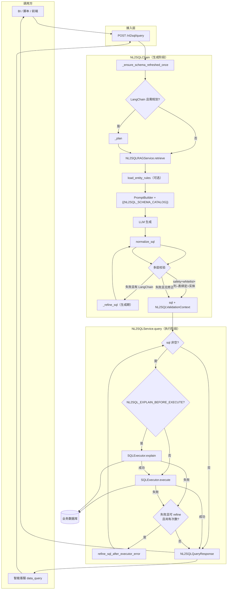
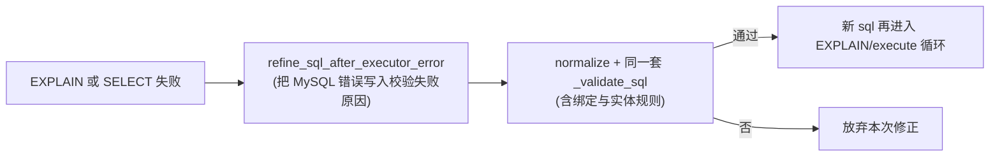
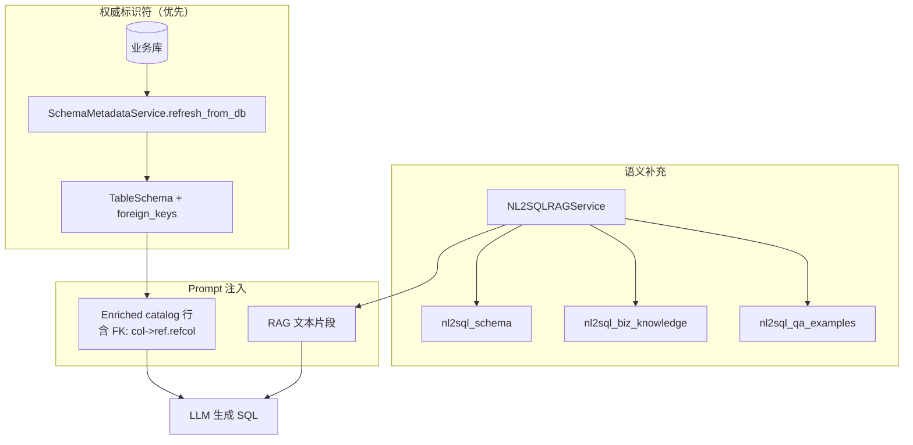

# 企业级 NL2SQL 实现方案

> 本文档描述本仓库 **当前已实现** 的 NL2SQL 能力：与 **RAG** 并列的 **AI 应用基础能力**、**独立 HTTP 接口**与**智能客服内嵌**双形态接入、DB 反射与专用 RAG 协同、安全执行与可观测性。  
> 实现细节与文件映射见 `framework-guide/NL2SQL整体实现技术说明.md`；总体设计见 `docs/NL2SQL系统概要设计.md`；架构位置见 `docs/大小模型应用技术架构与实现方案.md` §1、§4.6。

---

## 0. 前提重要说明
> 实现效果较好的NL2SQL的前提是：要有教完善的知识库知识摄入（因为当前NL2SQL对表结构、字段、表间关系的认知，是通过RAG知识库+数据库反射两种方式融合获取的）
    1.  首先RAG知识摄入时，要确保摄入namespace分别为`nl2sql_schema`、`nl2sql_biz_knowledge`、`nl2sql_qa_examples`的三种知识（分别是数据库结构、数据库知识文档、数据库知识问答对（问法 → 标准 SQL））
    2.  app/app-deploy/.env中配置业务数据库的连接信息

NL2SQL后续效果优化方向：
```text
启用 nl2sql_qa_examples（强烈建议）
日志里 nl2sql_qa_examples: 0：为「锅炉名 + 时间 + 磨煤机 + 平均电流」各写 2～5 条「问法 → 标准 SQL」摄入该命名空间，通常比再写十页表结构更省 tokens、更提准确率。

启用 nl2sql_biz_knowledge（建议）
用短文档写：业务术语、统计口径、时间字段用哪列（如 record_time）、与 Word 表结构不重复的叙述，补日志里 biz=0 的空白。

在库里补外键（若业务与 DBA 允许）
针对日志 fk_edges=0：对真实存在的关系加 FK，让运行时 catalog 出现 FK: 提示，减轻多表 JOIN 全靠文档记忆的问题。

图检索（若已部署 GraphRAG）
日志 graph_enabled=False：若后续打开图侧且与 Schema/设备关系对齐，可补充「实体关系」召回（与 FK、文档三选一或组合）。
```

## 1. 文档目的与范围

| 项 | 说明 |
|----|------|
| **目的** | 为企业集成、运维排障、二次开发提供 **统一叙述 + 可对照代码的流程图**。 |
| **范围** | `app/nl2sql/*`、`app/services/nl2sql_service.py`、`app/api/nl2sql.py`、智能客服 `data_query` 分支、相关配置与日志。 |
| **不在范围** | 业务库建模规范、SQL 准确率评估体系（可另文补充）。 |

---

## 2. 基座定位：与 RAG 并列的基础能力

- **共性**：NL2SQL 与通用 RAG 共用 **向量检索基座**（`RAGService` + 命名空间隔离）、**场景化检索策略**（`scene="nl2sql"`）、**大模型 endpoint**、**Prompt 模板注册**（`PromptTemplateRegistry`）、**日志与 Prometheus 指标**。
- **差异**：  
  - **RAG**：非结构化/半结构化知识 → 检索片段 → 生成自然语言回答。  
  - **NL2SQL**：自然语言 → **受控只读 SQL** → **结构化结果集**（`rows`），强依赖 **数据库反射** 与 **SQL 安全校验**。
- **接入形态**：  
  1. **直接调用**：`POST /nl2sql/query`（`NL2SQLQueryRequest` → `sql` + `rows`），适合 BI、低代码、内部工具。  
  2. **内嵌复用**：智能客服意图 **`data_query`** 调用同一 `NL2SQLService`（通常 `record_conversation=False`），再由 `chatbot_nl2sql_answer.summarize_nl2sql_with_llm` 将 SQL/结果转为自然语言。

---

## 3. 核心模块一览

| 模块 | 路径 | 职责摘要 |
|------|------|-----------|
| HTTP API | `app/api/nl2sql.py` | 鉴权后转发 `NL2SQLService`；起止日志 |
| 服务层 | `app/services/nl2sql_service.py` | Chain + Executor + 可选 **EXPLAIN 预检** + **执行失败 refine 闭环** + 会话 + 指标 |
| 生成链路 | `app/nl2sql/chain.py` | 反射、规划、RAG、Prompt、LLM、归一化、**多层校验**、**生成期 refine**；对外提供 `generate_sql` / `generate_sql_with_validation_context` 与 **`refine_sql_after_executor_error`** |
| Schema | `app/nl2sql/schema_service.py` | DB 反射、`TableSchema`、**外键** → catalog |
| 专用 RAG | `app/nl2sql/rag_service.py` | 三命名空间检索 + 策略层/可选图 |
| Prompt | `app/nl2sql/prompt_builder.py` + `configs/prompts.yaml` | 拼装 + `{{NL2SQL_SCHEMA_CATALOG}}` |
| 业务实体规则 | `app/nl2sql/entity_rules.py` | 从环境变量加载 **否定规则**（问题关键词 + SQL 正则），与链上校验联动 |
| 校验/执行 | `app/nl2sql/validator.py`、`executor.py` | 只读、表/列白名单、**列–表绑定**（`alias.col` 对照反射表→列）、引号外单行化；**`EXPLAIN` + `execute`** |

---

## 4. 文字版逻辑流程

### 4.1 端到端（HTTP 直连）

1. 客户端调用 **`POST /nl2sql/query`**，携带 `user_id`、`session_id`、`question`。  
2. **API 层** 打日志后调用 **`NL2SQLService.query`**（可选写入会话与指标计数）。  
3. **`NL2SQLChain.generate_sql_with_validation_context`**（`generate_sql` 为其便捷封装，仅返回 `str`）：  
   - **首次** 尝试 **`SchemaMetadataService.refresh_from_db()`**；成功则内存中有真实表、列、**外键**；失败则仅 Demo 或后续依赖 RAG。  
   - 判断是否 **真实库已就绪**（非仅 `orders` Demo）。  
   - **规划 `_plan`**：仅当 LangChain 可用且 **未** 处于「禁用规划 + 真实库」组合时执行；默认 **真实库成功则跳过规划**，减少虚构表名进入 RAG query。  
   - **RAG**：`NL2SQLRAGService.retrieve` 在 `nl2sql_schema`、`nl2sql_biz_knowledge`、`nl2sql_qa_examples` 检索并去重；若有规划摘要则与问题拼接为检索 query。  
   - **白名单**：真实库 → 反射表列集合；否则从片段抽取；同时构建 **`table_columns`（表→列集合）** 供绑定校验。  
   - **业务实体规则**：可选从 **`NL2SQL_ENTITY_RULES` / `NL2SQL_ENTITY_RULES_FILE`** 加载 JSON 规则列表（否定模式：问题含某关键词且 SQL 命中正则 → 校验失败）。  
   - **Prompt**：加载 `nl2sql` 场景模板，替换 **`{{NL2SQL_SCHEMA_CATALOG}}`** 为全库 enriched 目录（含 **FK:列→表.列**），或与 RAG hints/降级文案组合。  
   - **LLM** 生成 SQL → **`normalize_sql`** → **校验**：只读安全 → 表/列白名单 →（真实库时）**`alias.column` / `table.column` 列–表绑定** →（若配置）**实体规则**；失败且 LangChain 可用则 **`_refine_sql`** 后再验。  
   - 返回 **`(sql, NL2SQLValidationContext)`**：`ctx` 内含白名单与 `table_columns`，供服务层 **执行阶段 refine** 复用同一套校验标准。  
4. **`NL2SQLService.query`** 在 SQL 非空时进入 **执行闭环**（受环境变量控制）：  
   - 若 **`NL2SQL_EXPLAIN_BEFORE_EXECUTE=true`**：先 **`SQLExecutor.explain`**（`EXPLAIN <sql>`），失败则（在 **`NL2SQL_REFINE_ON_EXEC_ERROR`** 允许且 LangChain 可用时）调用 **`refine_sql_after_executor_error`**，用错误信息修正 SQL，再 **最多重试 `NL2SQL_MAX_EXEC_REFINES` 次**；仍失败则记指标、写会话错误摘要，**不再执行 SELECT**。  
   - 再 **`SQLExecutor.execute`**；失败时同样可走 **refine + 重试** 路径。  
5. 返回 **`NL2SQLQueryResponse(sql, rows)`**（`sql` 为最后一次尝试的语句，可能因 refine 与初稿不同）。

### 4.2 智能客服内嵌（`data_query`）

1. 意图路由到 **`nl2sql_answer`** 节点。  
2. 构造 **`NL2SQLQueryRequest`**，调用 **`NL2SQLService.query(..., record_conversation=False)`**，复用 **与 HTTP 相同的步骤 3～4**（含校验与执行闭环）。  
3. 将 `sql` 与 `rows` 交给 **`summarize_nl2sql_with_llm`** 生成用户可见的自然语言回答。  
4. Runner **`finalize`** 输出中带 `used_nl2sql`、`nl2sql_sql` 等 meta。

### 4.3 文字版流程图（纯文本）

以下为 **不含 `|` 竖线的缩进流程图**，避免多数 Markdown 渲染器把 `|` 误判为「表格列」而拆碎版面；语义与 §5 Mermaid 一致。若需可编辑图示，请直接改 §5 中对应 Mermaid。

```text
[Client]
       POST /nl2sql/query
            v
    [NL2SQL API]
            v
   [NL2SQLService.query]
            |
            +------------------+------------------+
            v                                     v
   [NL2SQLChain 生成]                    [SQLExecutor 执行闭环]
            |                           EXPLAIN? -> execute
            |                           失败 -> refine?（有次数上限）
            v
   Refresh Schema（首次）
            v
   Plan?（可选，真实库默认跳过）
            v
   RAG 三命名空间检索
            v
   Prompt + NL2SQL_SCHEMA_CATALOG
            v
   LLM -> normalize_sql
            v
   Validate+（白名单 / 列–表绑定 / 实体规则）
            v
   Refine?（校验失败且 LangChain 可用）
            v
   输出 (sql, NL2SQLValidationContext)
            v
   回到 NL2SQLService：预检与执行（见上右支）
```

---

## 5. 代码版逻辑流程图（Mermaid）

### 5.1 端到端数据流（服务 + 校验 + 执行闭环）



### 5.2 NL2SQLChain 内部细化（生成与校验）

```mermaid
flowchart TB
    A[refresh_from_db] --> B{schema_from_db?}
    B -->|是 默认| C[跳过 _plan]
    B -->|否| D[_plan 可选]
    C --> E[rag_query = question 或 规划+问题]
    D --> E
    E --> F[retrieve 三命名空间]
    F --> G[whitelist 表列 + table_columns 映射]
    G --> H[load_entity_rules_from_env]
    H --> I[替换 NL2SQL_SCHEMA_CATALOG]
    I --> J[build prompt]
    J --> K[LLM]
    K --> L[normalize_sql]
    L --> M{safety + whitelist}
    M -->|失败| N{LangChain?}
    M -->|通过| O{schema_ok:\n列–表绑定}
    O -->|失败| N
    O -->|通过| P{实体规则}
    P -->|命中拦截| N
    P -->|未命中| Q[返回 sql + ValidationContext]
    N -->|是| R[_refine_sql] --> L
    N -->|否| S[返回 \"\" + ctx]
```

### 5.2b 执行期 refine（与生成期 refine 并列）



### 5.3 Schema 与 RAG 的关系



---

## 6. 关键工程要点

| 主题 | 说明 |
|------|------|
| **连接串与密码** | `DB_URL` 优先；由 `DB_USER`/`DB_PASSWORD` 等拼接时 **`urllib.parse.quote` 编码用户名密码**，避免密码中 `@` 被误认为 host 分隔符。 |
| **外键与 JOIN** | 反射得到的 `foreign_keys` 写入 catalog，Prompt 要求多实体时 JOIN；无物理外键时依赖 RAG 文档与业务列名。 |
| **列–表绑定** | 在 **DB 反射成功**（`schema_ok`）时，解析主查询 `FROM` 的别名映射，对 **`alias.column`** 校验列是否属于该别名对应物理表，减少「列名合法但挂错表」的漏检。复杂嵌套子查询场景可能跳过部分限定列（实现权衡）。 |
| **实体规则** | 仅支持 **否定规则**（问题关键词 + SQL 正则 → 拦截）；用于「问题在谈锅炉 A，SQL 却把名称写进 `mill_name`」等可配置业务语义。非「必须通过」类正向规则。 |
| **EXPLAIN 预检** | 可选在执行前跑 **`EXPLAIN`**，提前暴露语法/未知列等；增加一次往返延迟，适合对稳定性要求高的环境。 |
| **执行失败闭环** | `EXPLAIN` 或 `SELECT` 失败时，可将错误文本传入 **`refine_sql_after_executor_error`**，与生成期 **`_refine_sql`** 一样走 LLM 修正，但 **再经完整校验**；受 **`NL2SQL_MAX_EXEC_REFINES`** 限制，避免无限重试与延迟膨胀。无 LangChain 时 refine 不生效。 |
| **单行 SQL** | `normalize_sql` 在引号外折叠空白，接口返回紧凑单行，便于日志与下游复制。 |
| **排障日志** | `app.api.nl2sql`、`nl2sql_service`、`chain`、`rag_service`、`executor`、`schema_service` 等 INFO/WARNING；用 `user_id`+`session_id`+时间关联。 |
| **会话隔离** | 直连与 Chatbot 若共用 Redis，建议使用不同 `session_id` 前缀，避免消息混写（见 `系统会话管理实现方案.md`）。 |

---

## 7. 配置与环境变量（摘要）

| 变量 | 作用 |
|------|------|
| `DB_URL` / `DB_*` | 业务库连接 |
| `NL2SQL_DISABLE_PLANNER_WHEN_DB_SCHEMA` | 默认 `true`，真实库反射成功时跳过 `_plan` |
| `NL2SQL_PROMPT_DEFAULT_VERSION` | 如 `v2`，对应 `configs/prompts.yaml` |
| `NL2SQL_SCHEMA_NAMESPACE_TOP_K` | Schema 命名空间检索条数下限策略 |
| `NL2SQL_SCHEMA_CATALOG_MAX_TABLES` / `MAX_COLS` | 目录体积上限 |
| `NL2SQL_EXPLAIN_BEFORE_EXECUTE` | 默认 `false`；`true` 时执行前先 **`EXPLAIN`** |
| `NL2SQL_REFINE_ON_EXEC_ERROR` | 默认 `true`；`EXPLAIN`/`SELECT` 失败时是否尝试 **LLM 修正**（需 LangChain） |
| `NL2SQL_MAX_EXEC_REFINES` | 默认 `1`；执行阶段 **最多修正轮数**（每轮成功产出新 SQL 会再跑预检/执行） |
| `NL2SQL_ENTITY_RULES` | 可选；JSON 数组字符串，**否定实体规则**（`question_contains_any` + `sql_pattern`/`sql_regex` + `message`） |
| `NL2SQL_ENTITY_RULES_FILE` | 可选；若配置了路径且文件存在则 **只从文件** 加载；若未配置文件或路径无效则 **不** 回退到内联（见 `app/nl2sql/entity_rules.py`）；未设 `FILE` 时才读 `NL2SQL_ENTITY_RULES` |
| `RAG_SCENE_NL2SQL_*` | NL2SQL 场景检索 profile |

完整列表见 `app/app-deploy/.env.example` 与 `framework-guide/NL2SQL整体实现技术说明.md` §4。

**说明**：`.env.example` 中上述键多为注释示例，**不设变量时走代码默认值**（例如 EXPLAIN 默认关、执行失败 refine 默认开、实体规则默认无）；生产若需开启 EXPLAIN 或加载规则，请在实际 `.env` 中显式配置。

**实体规则 JSON**：根为数组，每项支持字段 `question_contains_any`（或 `question_contains`）、`sql_pattern`（或 `sql_regex`）、`message`；语义为 **当问题包含任一关键词且 SQL 匹配正则时校验失败**（否定规则，非「必须通过」白名单）。

---

## 8. 相关文档索引

| 文档 | 内容 |
|------|------|
| `enterprise-level_transformation_docs/NL2SQL当前完整实现逻辑说明-代码对照版.md` | 当前代码行为的端到端细节、校验与执行闭环、开关决策 |
| `framework-guide/NL2SQL整体实现技术说明.md` | 模块映射、API、配置、日志 §8 |
| `docs/大小模型应用技术架构与实现方案.md` | §1 基础能力、§4.6 NL2SQL |
| `docs/NL2SQL系统概要设计.md` | 产品与模块概要 |
| `enterprise-level_transformation_docs/企业级智能客服 LangGraph 框架实现方案.md` | `data_query` 与 NL2SQL 节点 |
| `docs/Agentic-Workflow-设计蓝图.md` | 多步 Workflow 蓝图 |

---

*代码变更时请同步更新本文与 `framework-guide/NL2SQL整体实现技术说明.md`。*
