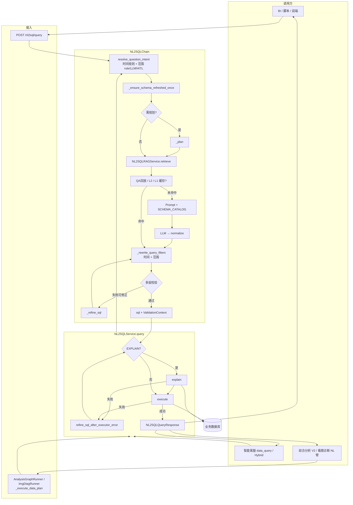
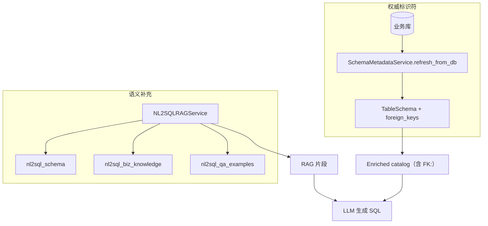
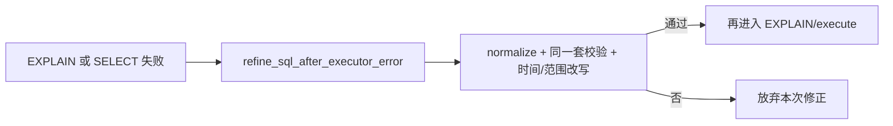

# 企业级 NL2SQL 实现方案

> 本文档描述本仓库 **当前已实现** 的 NL2SQL 能力：与 **RAG** 并列的 **AI 应用基础能力**；接入形态包括 **独立 HTTP**、**智能客服内嵌**、**综合分析 V2（`run-with-nl2sql` / `run-with-nl2sql-stream`）** 与 **综合分析看图诊断（`run-img-diag` / `run-img-diag-stream`，NL2SQL 并行臂）** 等，底层均复用同一 `NL2SQLService`。  
> 实现细节与文件映射见 `framework-guide/NL2SQL整体实现技术说明.md`；代码行为明细见 `enterprise-level_transformation_docs/NL2SQL当前完整实现逻辑说明-代码对照版.md`；问句时间/范围详设见 `docs/NL2SQL自然语言时间和范围窗口解析&改写改造落地方案.md`。  
> **流程图体例**对齐 `enterprise-level_transformation_docs/企业级智能客服 LangGraph 框架实现方案.md` §4.0：先 **业务视角（文字流程）**，再 **实现视角（代码级流程图）**（框内优先 `file:` / 类·函数 + `说明:`）。

> 当前 NL2SQL 已实现 L2/L1 生成阶段缓存、校验通过后可选写入 **`nl2sql_qa_examples`**（**五元组**去重，含 **`plan_template_version`**）；运维 **`GET`/`PATCH /rag/nl2sql-auto-qa`** 支持按类型/q*/plan 版本筛选。

---

## 0. 前提重要说明

> 效果较好的 NL2SQL 前提：知识库摄入较完善（表结构、字段、表间关系认知 = **RAG 知识库 + 数据库反射** 融合）。

1. RAG 摄入须覆盖命名空间：`nl2sql_schema`、`nl2sql_biz_knowledge`、`nl2sql_qa_examples`（库表结构 / 业务口径文档 / 问法→标准 SQL）。  
2. `app/app-deploy/.env` 配置业务库连接（`DB_URL` 或 `DB_*`）。  
3. 新项目若库结构、实体口径变化：须同步调整 **连接信息、表白名单、范围词表/规则、RAG 资产、SQL 提示词** 等（编排代码可复用）。

**效果优化方向（摘要）**：

```text
启用 nl2sql_qa_examples（强烈建议）——「问法 → 标准 SQL」样例通常比堆表结构更提准确率。
启用 nl2sql_biz_knowledge（建议）——术语、统计口径、时间字段叙述。
库内补外键（若允许）——catalog 出现 FK: 提示，减轻多表 JOIN 全靠文档记忆。
图检索（若已部署 GraphRAG）——补充实体关系召回（与 FK、文档组合）。
```

---

## 1. 文档目的与范围

| 项 | 说明 |
|----|------|
| **目的** | 为企业集成、运维排障、二次开发提供 **统一叙述 + 可对照代码的双视角流程图**。 |
| **范围** | `app/nl2sql/*`、`app/services/nl2sql_service.py`、`app/api/nl2sql.py`；客服 `data_query`；综合分析 `run-with-nl2sql*` / `run-img-diag*`（`acquire_data` → `_execute_data_plan`）；相关配置与日志。 |
| **不在范围** | 业务库建模规范、SQL 准确率评测体系；地降所五阶段改造见 `docs/基于地降所项目改造/NL2SQL基座五阶段改造方案.md`（演进方案，非现网默认行为）。 |

---

## 2. 基座定位：与 RAG 并列的基础能力

- **共性**：共用向量检索基座、`scene="nl2sql"` 检索策略、大模型 endpoint、`PromptTemplateRegistry`、日志与 Prometheus 指标。  
- **差异**：  
  - **RAG**：非结构化知识 → 片段 → 自然语言回答。  
  - **NL2SQL**：自然语言 → **受控只读 SQL** → **结构化 `rows`**，强依赖 **DB 反射** 与 **SQL 安全校验**。  
- **接入形态**（均复用 `NL2SQLService.query`）：  

  | # | 形态 | 入口 | 要点 |
  |---|------|------|------|
  | 1 | 直连问数 | `POST /nl2sql/query` | 返回 `sql` + `rows`（可选 `parsed_intent`） |
  | 2 | 智能客服 | 图节点 `nl2sql_answer` | `record_conversation=False`；再收紧分析成文（§4.6 客服方案） |
  | 3 | 综合分析 V2 | `POST /analysis/run-with-nl2sql*` | `acquire_data` 按 plan **多次** `query`（默认同层并行） |
  | 4 | 看图诊断 | `POST /analysis/run-img-diag*` | NL 并行臂同源 `_execute_data_plan`；可传 `confirmed_scope`（HITL） |

---

## 3. 核心模块一览

| 模块 | 路径 | 职责摘要 |
|------|------|-----------|
| HTTP 直连 | `app/api/nl2sql.py` | 鉴权后转发 `NL2SQLService` |
| HTTP 分析 | `app/api/analysis.py` | `run-with-nl2sql*` / `run-img-diag*` |
| 分析编排 | `analysis_graph_runner.py`、`analysis_img_diag_runner.py` | `_execute_data_plan`：分层、默认同层并行 `query` |
| 客服查数成文 | `chatbot_nl2sql_answer.py` | `run_chatbot_nl2sql_query` → 可选收紧分析流 |
| 服务层 | `app/services/nl2sql_service.py` | Chain + Executor + EXPLAIN/执行 refine + 会话 + 指标 |
| 生成链路 | `app/nl2sql/chain.py` | 意图 → Schema → 规划 → RAG → 缓存 → Prompt → LLM → **时间/范围改写** → 校验/refine |
| 问句意图 | `question_intent.py`、`time_intent_display.py`、`scope_parser_rule.py`、`scope_parser_llm.py` | 时间 **始终规则**；范围默认 **rule**，可选 LLM；`confirmed_scope` → `human_confirmed` |
| Schema | `schema_service.py` | DB 反射、外键 → catalog |
| 专用 RAG | `rag_service.py` | 三命名空间检索 |
| 缓存 / QA | `sql_cache.py`、`sql_skeleton.py`、`qa_feedback.py` | L2/L1；可选 QA 槽位回放与自动沉淀 |
| Prompt | `prompt_builder.py` + `configs/prompts.yaml` | `nl2sql` / `nl2sql_scope_parse` |
| 校验/执行 | `validator.py`、`executor.py` | 只读、白名单、列–表绑定；`EXPLAIN` + `SELECT` |
| 实体规则 | `entity_rules.py` | 可选否定规则（问题关键词 + SQL 正则） |

---

## 4. 业务逻辑流程图

> 体例同智能客服方案 §4.0：**业务视角**不出现文件名，便于产品/运维对齐；**实现视角**每个框标 `file:` / 类·函数 + `说明:`，与当前仓库调用链一致。

### 4.0 端到端主路径（`POST /nl2sql/query` 与所有内嵌复用的同一基座闭环）

#### 业务视角（文字流程）

从**业务与使用方**看，一次「自然语言 → 查库结果」主线如下（客服/综合分析只是**多次或包装后**调用同一闭环）。

```text
                    【调用方发起自然语言问数】
                                  │
                                  ▼
              ┌───────────────────────────────────┐
              │ 接入：用户、会话、自然语言问题；     │
              │ 可选：分析场景、计划子任务、时间意图 │
              │ 文本、人工确认范围（看图诊断 HITL） │
              └───────────────────┬───────────────┘
                                  ▼
              ┌───────────────────────────────────┐
              │ 问句意图解析（基座内、先于生成 SQL） │
              │ · 时间：程序规则（近一周/昨天/季度…）│
              │ · 范围：默认规则（机组/设备/管排等）；│
              │   可选 LLM；若已人工确认则直接采用  │
              └───────────────────┬───────────────┘
                                  ▼
              ┌───────────────────────────────────┐
              │ 认识库表：反射业务库表/列/外键；     │
              │ 用 Schema/业务/样例三类知识检索补语义 │
              └───────────────────┬───────────────┘
                                  ▼
              ┌───────────────────────────────────┐
              │（可选）命中生成缓存或 QA 样例回放 → │
              │ 仍须过校验与时间/范围改写           │
              │ 未命中 → 拼装 Prompt → 大模型出 SQL │
              └───────────────────┬───────────────┘
                                  ▼
              ┌───────────────────────────────────┐
              │ 程序改写：时间窗占位符、机组/锅炉、  │
              │ 可选设备/管排/排管占位符 → 安全校验 │
              │ （失败可让模型按错误修正再验）      │
              └───────────────────┬───────────────┘
                                  ▼
              ┌───────────────────────────────────┐
              │ 执行：可选先 EXPLAIN，再只读 SELECT；│
              │ 执行失败可再修正（有次数上限）      │
              └───────────────────┬───────────────┘
                                  ▼
              ┌───────────────────────────────────┐
              │【结束】返回 SQL + 结果行；          │
              │ 可选带回解析后的时间/范围意图 JSON  │
              └───────────────────────────────────┘
```

补充说明（业务口径）：

- **时间**始终由基座规则解析；业务侧可用 `time_intent_text` 指定「从哪段文本抽时间」，**不能**靠 `confirmed_scope` 覆盖时间窗。  
- **范围**：默认规则；可开 LLM；看图诊断等可传 **`confirmed_scope`** 覆盖范围为 `human_confirmed`。  
- **呈现**：基座只返回 `sql`/`rows`；客服收紧分析、综合分析报告合成均在**调用方**完成。

---

#### 实现视角（代码级流程图）

对齐 **当前仓库** 基座闭环。框内优先 **Python 路径**、**类 / 函数**，并附 **`说明:`**。客服 / 综合分析在入口处分岔后，均进入同一 `NL2SQLService.query`。

```text
         【入口 A】POST /nl2sql/query
         【入口 B】客服 nl2sql_answer / Hybrid 查数臂
         【入口 C】分析 acquire_data → 多次 query
         【入口 D】看图诊断 NL 臂（可带 confirmed_scope）
                                  │
                                  ▼
┌─────────────────────────────────────────────────────────────────┐
│ 【HTTP 直连入口】（仅入口 A）                                   │
│ file: app/api/nl2sql.py                                         │
│ fn:   nl2sql_query                                              │
│ 说明: 鉴权后转发；502 封装执行错误                               │
└───────────────────────────────┬─────────────────────────────────┘
                                  ▼
┌─────────────────────────────────────────────────────────────────┐
│ 【服务编排】                                                    │
│ file:  app/services/nl2sql_service.py                           │
│ class: NL2SQLService                                            │
│ meth:  query                                                    │
│ 说明: 可选写会话 → Chain 生成 → EXPLAIN?/execute → 执行失败 refine│
│       指标 NL2SQL_QUERY_COUNT / ERROR；可选返回 parsed_intent   │
│ req:  app/models/nl2sql.py · NL2SQLQueryRequest                 │
│       （question / time_intent_text / confirmed_scope / …）     │
└───────────────────────────────┬─────────────────────────────────┘
                                  ▼
┌─────────────────────────────────────────────────────────────────┐
│ 【Chain：意图优先】                                             │
│ file:  app/nl2sql/chain.py                                      │
│ class: NL2SQLChain                                              │
│ meth:  generate_sql_with_validation_context                     │
│ ① resolve_question_intent — 时间规则 + 范围 rule/LLM/HITL       │
│    └─ file: app/nl2sql/question_intent.py                       │
│       · time: time_intent_display.extract_time_window_*         │
│       · scope: scope_parser_rule / scope_parser_llm             │
│       · confirmed_scope → parse_mode=human_confirmed（仅范围）  │
│ ② _ensure_schema_refreshed_once — DB 反射表列外键               │
│    └─ file: app/nl2sql/schema_service.py                        │
└───────────────────────────────┬─────────────────────────────────┘
                                  ▼
┌─────────────────────────────────────────────────────────────────┐
│ 【Chain：规划 → RAG → 缓存 / QA 回放】                          │
│ ③ _plan（可选；真实库默认跳过 NL2SQL_DISABLE_PLANNER_…）        │
│ ④ NL2SQLRAGService.retrieve — schema/biz/qa 三命名空间          │
│    └─ file: app/nl2sql/rag_service.py                           │
│ ⑤ 可选 QA 槽位严格回放（qa_feedback）                           │
│ ⑥ 可选 L2 精确缓存 → L1 时间骨架缓存（sql_cache / sql_skeleton）│
│ 说明: 意图解析在缓存查找之前；命中后仍走改写+校验               │
└───────────────────────────────┬─────────────────────────────────┘
                                  ▼
┌─────────────────────────────────────────────────────────────────┐
│ 【Chain：生成 → 改写 → 校验】（缓存未命中或需重生）             │
│ ⑦ PromptBuilder + scene=nl2sql（{{NL2SQL_SCHEMA_CATALOG}}）     │
│    └─ prompt_builder.py + PromptTemplateRegistry                │
│ ⑧ LLM（LangChain ChatOpenAI 或 VLLMHttpClient）→ normalize_sql │
│ ⑨ _rewrite_tidb_compatible_sql + _rewrite_query_filters         │
│    · 时间 @t_start/@t_end/@t_after + 字面量窗                   │
│    · 锅炉 @unit_keyword；可选 scope 占位符（scope_sql_rewrite） │
│ ⑩ SQLValidator + 白名单 + 列–表绑定 + entity_rules；失败可      │
│    _refine_sql 后再改写再验                                     │
│ 返回 (sql, NL2SQLValidationContext)                             │
└───────────────────────────────┬─────────────────────────────────┘
                                  ▼
┌─────────────────────────────────────────────────────────────────┐
│ 【服务层执行闭环】NL2SQLService.query 续                        │
│ file: app/nl2sql/executor.py · SQLExecutor                      │
│  · NL2SQL_EXPLAIN_BEFORE_EXECUTE → explain                      │
│  · execute(SELECT)                                              │
│  · 失败且可 refine → chain.refine_sql_after_executor_error      │
│    （次数 ≤ NL2SQL_MAX_EXEC_REFINES）                           │
└───────────────────────────────┬─────────────────────────────────┘
                                  ▼
┌─────────────────────────────────────────────────────────────────┐
│ 【响应】NL2SQLQueryResponse(sql, rows[, parsed_intent])         │
│ 直连回客户端；客服/分析各自消费 rows 做呈现或报告合成           │
└─────────────────────────────────────────────────────────────────┘
```

**图注（调用约定）**：

- 框内优先 **`file:` + 类/方法**，其后 **`说明:`** 为职责摘要。  
- **所有接入形态**在 `NL2SQLService.query` 汇合；差异仅在请求字段（如 `time_intent_text`、`confirmed_scope`、`plan_item_id`）与是否 `record_conversation`。  
- **`confirmed_scope` 只覆盖范围**，时间仍从 `scope_intent_text` / `time_intent_text` / `question` / `original_query` 做规则解析。

**实现落点速查（文件 → 职责）**

| 环节 | 文件 | 符号（简练） |
|------|------|----------------|
| HTTP 直连 | `app/api/nl2sql.py` | `nl2sql_query` |
| 请求/响应模型 | `app/models/nl2sql.py` | `NL2SQLQueryRequest` / `Response` |
| 服务 | `app/services/nl2sql_service.py` | `query` |
| Chain | `app/nl2sql/chain.py` | `generate_sql_with_validation_context`、`_rewrite_query_filters`、`refine_sql_after_executor_error` |
| 意图门面 | `app/nl2sql/question_intent.py` | `resolve_question_intent` |
| 时间规则 | `app/nl2sql/time_intent_display.py` | `extract_time_window_from_question`、锚点 lookback |
| 范围规则/LLM | `scope_parser_rule.py`、`scope_parser_llm.py` | `parse_scope_rule`、`resolve_scope_with_mode` |
| 范围改写 | `scope_sql_rewrite.py` | `rewrite_scope_sql_placeholders` |
| Schema / RAG | `schema_service.py`、`rag_service.py` | `refresh_from_db`、`retrieve` |
| 缓存 / QA | `sql_cache.py`、`sql_skeleton.py`、`qa_feedback.py` | L2/L1、槽位回放 |
| 校验 / 执行 | `validator.py`、`executor.py` | `validate`、`explain`、`execute` |
| 客服包装 | `chatbot_nl2sql_answer.py` | `run_chatbot_nl2sql_query` |
| 分析取数 | `analysis_graph_runner.py` 等 | `_execute_data_plan`；或 `analysis_agent/nl2sql_executor.py` |

---

### 4.1 智能客服内嵌（`data_query` / Hybrid 查数臂）

#### 业务视角

```text
  意图判为「结构化查库」或 Hybrid 需要查数
            │
            ▼
  调用同一 NL2SQL 基座得到 sql + rows
            │
            ▼
  列过滤展示 →（可选）收紧分析成自然语言
            │
            ▼
  流式/结束帧带回 used_nl2sql、nl2sql_analysis 等 meta
```

#### 实现视角

```text
┌─────────────────────────────────────────────────────────────────┐
│ file: chatbot_graph_runner.py · _node_nl2sql_answer             │
│ 说明: data_query 分支；Hybrid 臂内亦可调同一查数入口            │
└───────────────────────────────┬─────────────────────────────────┘
                                  ▼
┌─────────────────────────────────────────────────────────────────┐
│ file: chatbot_nl2sql_answer.py · run_chatbot_nl2sql_query       │
│ 说明: 构造 NL2SQLQueryRequest（可带 sql_gen_extra_hint）        │
│       → NL2SQLService.query(record_conversation=False)          │
│       → summarize_nl2sql_with_llm / analysis_stream_plan        │
│ 展示列过滤: chatbot_nl2sql_display.filter_chatbot_nl2sql_…    │
└─────────────────────────────────────────────────────────────────┘
```

详述见 **`企业级智能客服 LangGraph 框架实现方案.md`** §4.6 / §4.7。

---

### 4.2 综合分析 V2（`POST /analysis/run-with-nl2sql*`）

#### 业务视角

```text
  用户提交分析类型 + 自然语言 query
            │
            ▼
  规划前检索与数据计划（多子任务问句）
            │
            ▼
  按依赖分层取数：同层可并行多次「问句→SQL→结果」
  （每次 = 基座闭环；时间意图优先用用户原句，防 plan 附录污染）
            │
            ▼
  质量门 → 业务 RAG → 合成结构化报告（非客服口语化链路）
```

#### 实现视角

```text
┌─────────────────────────────────────────────────────────────────┐
│ file: app/api/analysis.py · run_analysis_nl2sql(_stream)        │
│ → AnalysisService → AnalysisGraphRunner.run_with_nl2sql         │
└───────────────────────────────┬─────────────────────────────────┘
                                  ▼
┌─────────────────────────────────────────────────────────────────┐
│ acquire_data → _execute_data_plan                               │
│ 说明: dependency 分层；默认同层 asyncio.gather 并行 query       │
│ 每项: NL2SQLQueryRequest(question=task.question,                │
│       time_intent_text=用户 query, plan_item_id, …)             │
│       record_conversation=False；单任务最多 2 次尝试            │
│ 开关: ANALYSIS_NL2SQL_ACQUIRE_* / max_nl2sql_calls              │
└─────────────────────────────────────────────────────────────────┘
```

---

### 4.3 综合分析看图诊断（`POST /analysis/run-img-diag*`）

#### 业务视角

```text
  上传图像 + 泄漏位置/问句等
            │
            ├──────────────┬──────────────────┐
            ▼              ▼                  ▼
       视觉识别臂     NL2SQL 取数臂      业务 RAG 臂
            │              │                  │
            │     （可先 HITL 确认范围）       │
            │              │                  │
            └──────────────┴──────────────────┘
                            ▼
                   汇合后合成报告（同步或流式）
```

#### 实现视角

```text
┌─────────────────────────────────────────────────────────────────┐
│ AnalysisImgDiagGraphRunner：并行 lane                           │
│ NL 臂：plan_context_rag(scene=nl2sql) → acquire_data            │
│        → _execute_data_plan（与 §4.2 同源）→ data_quality_gate  │
│ HITL: confirmed_scope / scope_intent_text / original_query      │
│       注入 NL2SQLQueryRequest → 基座 human_confirmed（仅范围）  │
└─────────────────────────────────────────────────────────────────┘
```

---

### 4.4 问句意图与 SQL 改写（基座内关键子链）

#### 业务视角

```text
  用户问句（或更干净的 time_intent / 确认范围）
            │
            ├─ 时间：近 N 天 / 昨天 / 本月 / 季度… → 生效时间窗
            │        （无表达时默认「昨天」口径）
            ├─ 范围：机组锅炉 / 设备 / 管排 / 排 / 管
            │        （HITL 确认则跳过自动范围解析）
            ▼
  模型 SQL 中的 @t_*、@unit_keyword、@device_keyword… 被程序替换
            ▼
  再执行校验与查库
```

#### 实现视角

```text
resolve_question_intent
  ├─ confirmed_scope? → QuestionScopeIntent 直接采用；时间仍 extract_* 规则
  └─ else → resolve_scope_with_mode(NL2SQL_INTENT_PARSE_MODE)
            + extract_time_window / extract_time_anchor
            │
            ▼
_rewrite_query_filters（chain.py）
  ├─ _resolve_time_window_for_rewrite（锚点向前 N 天 / plan 长窗仲裁）
  ├─ _rewrite_time_placeholders / 字面量时间窗
  └─ _rewrite_entity_scope_literals → rewrite_scope_sql_placeholders
```

| 能力 | 是否基座 | 覆盖方式 |
|------|----------|----------|
| 时间解析 | 是（规则） | `time_intent_text` 指定抽文本；**无** confirmed 时间窗 API |
| 范围解析 | 是（默认 rule） | 配置改 LLM；或业务传 `confirmed_scope` 覆盖 |
| 锅炉字段 | 规则始终覆盖 LLM | `finalize_llm_scope` |

---

## 5. 代码版补充图（Mermaid）

> 与 §4 实现视角语义一致，便于编辑器预览；排障优先对照 §4.0 代码框。

### 5.1 端到端（服务 + Chain + 执行）


```mermaid
flowchart TB
    subgraph Client["调用方"]
        C1["BI / 脚本 / 前端"]
        C2["智能客服 data_query / Hybrid"]
        C3["综合分析 V2 / 看图诊断 NL 臂"]
    end

    subgraph API["接入"]
        HTTP["POST /nl2sql/query"]
        ANA["AnalysisGraphRunner /\nImgDiagRunner\n_execute_data_plan"]
    end

    subgraph Chain["NL2SQLChain"]
        QI["resolve_question_intent\n时间规则 + 范围 rule/LLM/HITL"]
        R0["_ensure_schema_refreshed_once"]
        R1{"需规划?"}
        P["_plan"]
        RG["NL2SQLRAGService.retrieve"]
        CACHE["QA回放 / L2 / L1 缓存?"]
        PR["Prompt + SCHEMA_CATALOG"]
        L["LLM → normalize"]
        RW["_rewrite_query_filters\n时间 + 范围"]
        V{"多层校验"}
        RF1["_refine_sql"]
        OUT["sql + ValidationContext"]
    end

    subgraph Svc["NL2SQLService.query"]
        X{"EXPLAIN?"}
        EX["explain"]
        E["execute"]
        RF2["refine_sql_after_executor_error"]
        RESP["NL2SQLQueryResponse"]
    end

    DB[("业务数据库")]

    C1 --> HTTP --> QI
    C2 --> Svc
    C3 --> ANA --> Svc
    Svc --> QI
    QI --> R0 --> R1
    R1 -->|是| P --> RG
    R1 -->|否| RG
    RG --> CACHE
    CACHE -->|未命中| PR --> L --> RW --> V
    CACHE -->|命中| RW
    V -->|失败可修正| RF1 --> RW
    V -->|通过| OUT --> X
    X -->|是| EX --> E
    X -->|否| E
    EX -->|失败| RF2
    E -->|失败| RF2
    RF2 --> X
    E -->|成功| RESP
    E --> DB
    EX --> DB
    RESP --> C1
    RESP --> C2
    RESP --> C3
```

### 5.2 Schema 与 RAG


```mermaid
flowchart TB
    subgraph Authoritative["权威标识符"]
        DB[(业务库)] --> REF["SchemaMetadataService.refresh_from_db"]
        REF --> TS["TableSchema + foreign_keys"]
    end
    subgraph Semantic["语义补充"]
        RAG["NL2SQLRAGService"]
        RAG --> NS1["nl2sql_schema"]
        RAG --> NS2["nl2sql_biz_knowledge"]
        RAG --> NS3["nl2sql_qa_examples"]
    end
    TS --> CAT["Enriched catalog（含 FK:）"]
    RAG --> SNIP["RAG 片段"]
    CAT --> LLM["LLM 生成 SQL"]
    SNIP --> LLM
```

### 5.3 执行期 refine


```mermaid
flowchart LR
    A["EXPLAIN 或 SELECT 失败"] --> B["refine_sql_after_executor_error"]
    B --> C["normalize + 同一套校验 + 时间/范围改写"]
    C -->|通过| D["再进入 EXPLAIN/execute"]
    C -->|否| E["放弃本次修正"]
```

---

## 6. 关键工程要点

| 主题 | 说明 |
|------|------|
| **连接串** | `DB_URL` 优先；`DB_*` 拼接时用户名密码 URL 编码。 |
| **表白名单** | `ANALYSIS_NL2SQL_TABLE_SCOPE_*`、JOIN 白名单；新项目须按库裁剪。 |
| **外键与 JOIN** | 反射 FK 写入 catalog；无物理 FK 则依赖 RAG/业务列名。 |
| **列–表绑定** | `schema_ok` 时校验 `alias.column` 是否属于该物理表。 |
| **实体规则** | 仅否定规则（问题关键词 + SQL 正则）。 |
| **意图防污染** | 综合分析等传 `time_intent_text=用户原句`，避免 plan 尾部 RAG 附录污染时间/范围。 |
| **HITL 范围** | `confirmed_scope` → `human_confirmed`；**不覆盖时间**。 |
| **缓存** | `NL2SQL_CACHE_ENABLED`；意图解析在缓存查找前执行；命中后仍改写+校验。 |
| **EXPLAIN / 执行 refine** | 见环境变量表；无 LangChain 时 refine 不生效。 |
| **单行 SQL** | `normalize_sql` 引号外折叠空白。 |
| **会话隔离** | 直连与客服建议不同 `session_id` 前缀。 |

---

## 7. 配置与环境变量（摘要）

| 变量 | 作用（与代码默认一致） |
|------|------|
| `DB_URL` / `DB_*` | 业务库连接 |
| `NL2SQL_DISABLE_PLANNER_WHEN_DB_SCHEMA` | 默认 `true`：真实库反射成功则跳过 `_plan` |
| `NL2SQL_PROMPT_DEFAULT_VERSION` | 如 `v2`（`configs/prompts.yaml` · `nl2sql`） |
| `NL2SQL_CACHE_ENABLED` | 代码默认 `false`；`.env.example` 示例常开 |
| `NL2SQL_EXPLAIN_BEFORE_EXECUTE` | 默认 `false` |
| `NL2SQL_REFINE_ON_EXEC_ERROR` | 默认 `true` |
| `NL2SQL_MAX_EXEC_REFINES` | 默认 `1` |
| `NL2SQL_ENTITY_RULES` / `_FILE` | 可选否定实体规则 |
| `NL2SQL_INTENT_PARSE_MODE` | 默认 **`rule`**；可选 `llm` / `rule_with_llm_fallback`（失败均回退 rule） |
| `NL2SQL_SCOPE_SQL_REWRITE_ENABLED` | 代码默认 **`true`**（设备/管排等占位符改写） |
| `NL2SQL_SCOPE_LEXICON_FILE` | 范围词典，默认 `configs/nl2sql_scope_device_aliases.json` |
| `NL2SQL_SCOPE_PARSE_*` | 范围 LLM 超时/温度/提示词版本 |
| `NL2SQL_INJECT_PARSED_INTENT` / `RESPONSE_INCLUDE_*` / `TRACE_INCLUDE_*` | 意图注入 Prompt / API / 分析 trace |
| `NL2SQL_ANCHOR_FALLBACK_*` | plan「锚点向前 N 天」无锚点时的 NOW 回退（看图诊断等） |
| `NL2SQL_REJECT_UNRESOLVED_TIME_PLACEHOLDERS` | 拒绝未解析的 `@t_*` |
| `ANALYSIS_NL2SQL_TABLE_SCOPE_*` / `JOIN_WHITELIST*` | 表域与 JOIN 白名单 |
| `ANALYSIS_NL2SQL_ACQUIRE_*` | 分析取数同层并行等 |
| `RAG_SCENE_NL2SQL_*` | NL2SQL 检索 profile |

完整列表见 `app/app-deploy/.env.example` 与 `framework-guide/NL2SQL整体实现技术说明.md` §4。

**说明**：未设环境变量时走 **代码默认值**；`.env.example` 中的示例值可能与默认不同（如缓存示例为 `true`），以实际部署 `.env` 为准。

---

## 8. 相关文档索引

| 文档 | 内容 |
|------|------|
| `enterprise-level_transformation_docs/NL2SQL当前完整实现逻辑说明-代码对照版.md` | 代码行为端到端细节 |
| `framework-guide/NL2SQL整体实现技术说明.md` | 模块映射、API、配置、日志 |
| `docs/NL2SQL系统概要设计.md` | 产品与模块概要 |
| `docs/NL2SQL缓存实现方案.md` | L2/L1 与 QA 闭环 |
| `docs/NL2SQL自然语言时间和范围窗口解析&改写改造落地方案.md` | 时间/范围解析与改写 |
| `docs/基于地降所项目改造/NL2SQL基座五阶段改造方案.md` | 演进改造（非现网默认） |
| `enterprise-level_transformation_docs/企业级智能客服 LangGraph 框架实现方案.md` | 客服图与 `data_query`（流程图体例参考） |
| `enterprise-level_transformation_docs/企业级综合分析实现和使用说明.md` | `run-with-nl2sql*` 编排 |
| `enterprise-level_transformation_docs/企业级综合分析-看图诊断实现和使用说明.md` | `img_diag` 并行臂与 HITL |

---

*代码变更时请同步更新本文与 `framework-guide/NL2SQL整体实现技术说明.md`。*
