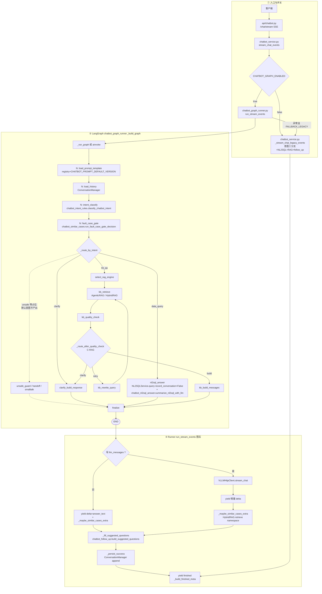

# 企业级智能客服 LangGraph 框架实现方案

## 1. 目标与范围

- 目标：将当前智能客服后端编排升级为 LangGraph，实现可扩展、可观测、可回滚的企业级工作流。
- 范围：覆盖 `chatbot` 场景的流式主链路（SSE），兼容现有提示词模板策略、RAG 检索与会话管理；可选扩展 **相似事故案例**（限定 namespace RAG，见 **第 14 节**）。
- 保留：现有 `ConversationManager`（会话历史）与 `VLLMHttpClient`（模型调用）不替换，只调整编排层。
- 不在本期：接口层统一鉴权绑定（后续在网关/接口层处理）。

## 2. 设计原则

- 编排与执行分离：LangGraph 负责状态流转，LLM/RAG/会话仍用现有服务。
- 兼容优先：请求/响应协议尽量不变，支持灰度发布与一键回退。
- 结构先行：先完整建图（含占位节点）；当前已放量 **`kb_qa`（向量 RAG）**、**`clarify`**、**`data_query`（内嵌 NL2SQL）**，由 `CHATBOT_INTENT_OUTPUT_LABELS` 控制；结束 `meta` 含 **`suggested_questions`**（规则预设表 + 复用本轮 `context_snippets` 的首行种子 + 可选 LLM JSON 补全；**不为关联问题单独做二次向量检索**）。逐步说明见 `framework-guide/智能客服整体实现技术说明.md` **§7**。
- 可观测优先：接入 LangSmith，节点级记录耗时、路由、重试与失败原因。

## 3. 总体架构

客户端 → `POST /chatbot/chat/stream`（或兼容 `POST /chatbot/chat`）→ `ChatbotService` → `ChatbotLangGraphRunner` → LangGraph（或 Legacy 顺序链路）→ SSE / JSON 返回；可通过 `POST /chatbot/chat/stop` + `stream_id` 显式中断。

组件职责：

- `app/api/chatbot.py`：HTTP 与 SSE 帧封装。
- `ChatbotService`（`chatbot_service.py`）：图开关、异常回退 Legacy、会话与 Runner 共用 `ConversationManager`。
- `ChatbotImagePreprocessor`（`chatbot_image_preprocessor.py`）：在 `ChatbotService` 入口前对 `image_urls` 做缩放/压缩并落盘为本地静态 URL（默认 `/chatbot/media`），降低多模态上下文与传输开销。
- `ChatbotOutlineStore`（`chatbot_outline.py`）：回答后异步提取“第N点”结构化索引，写 Redis 热层（可选 EasySearch 冷层）；在新一轮对“上文第N点”请求做旁路引用增强，不改变主链路。
- `ChatbotLangGraphRunner`（`chatbot_graph_runner.py`）：`StateGraph` 编译与执行、**图后**流式生成、相似案例追加、**关联问题** `_fill_suggested_questions`、落库。
- LangGraph：状态机（模板、历史、意图、故障门控、**按意图分支**、RAG/C-RAG 或 NL2SQL、`finalize`）。
- `HybridRAGService` / `AgenticRAGService`：主链路检索；相似案例为 Runner 层**二次** `retrieve(namespace=…)`。
- `NL2SQLService`（`nl2sql_service.py`）：`data_query` 分支生成 SQL 与执行；客服内嵌调用时 `record_conversation=False`。NL2SQL 与 RAG 同为基座基础能力；直连 HTTP 见 `POST /nl2sql/query`；**综合分析 V2** 在 `POST /analysis/run-with-nl2sql` 的 **`acquire_data`** 阶段亦多次复用同一服务（`record_conversation=False`）。三种接入的总览见 **`enterprise-level_transformation_docs/企业级NL2SQL实现方案.md`**。
- `chatbot_intent_rules.py`：`kb_qa` / `clarify` / `data_query` 规则分类。
- `chatbot_follow_up.py`：`build_suggested_questions`（规则表 + 本轮片段种子 + 可选 LLM）。
- `chatbot_nl2sql_answer.py`：SQL/结果行 → 自然语言。
- `ConversationManager`：会话真源（`user_id + session_id`）。
- `PromptTemplateRegistry` + `configs/prompts.yaml`：默认 `boiler_v1`（`CHATBOT_PROMPT_DEFAULT_VERSION`）。
- `VLLMHttpClient`：对话与 NL2SQL 总结、关联问题 LLM、流式主答。
- LangSmith：可选链路追踪（`LangSmithTracker`）。

## 4. 图设计（状态、节点、路由）

### 4.0 业务逻辑流程图

#### 业务视角（文字流程）

从**用户与业务**角度，一轮对话（流式为主）主线如下（不出现文件名，便于产品/运营对齐）。顺序与实现一致：**先判意图与门控，再分岔**。

```text
                        【用户发起一轮咨询】
                                  │
                                  ▼
              ┌───────────────────────────────────┐
              │ 接入：用户、会话、是否多轮记忆、     │
              │ 是否启用知识库检索、是否允许查库路由 │
              └───────────────────┬───────────────┘
                                  ▼
              ┌───────────────────────────────────┐
              │ 准备前提：加载本场景话术/策略；       │
              │ 需要时读取近期历史                   │
              └───────────────────┬───────────────┘
                                  ▼
              ┌───────────────────────────────────┐
              │ 意图分流（短句/指代不清 → 澄清；     │
              │ 台账统计列表等 → 结构化查库；         │
              │ 机理/标准/原因等 → 文档知识问答；     │
              │ 带图时默认走文档侧，避免误查库）     │
              └───────────────────┬───────────────┘
                                  ▼
              ┌───────────────────────────────────┐
              │（可选）故障域门控：若开相似案例，     │
              │ 结合文/图判断是否像锅炉管材故障，     │
              │ 决定主答结束后是否追加「相似案例」块 │
              │（默认总关；见第 14 节）              │
              └───────────────────┬───────────────┘
                                  ▼
              ┌─────────┬─────────┬─────────┐
              │    A    │    B    │    C    │
              │  澄清   │结构化查库│文档知识 │
              └────┬────┴────┬────┴────┬────┘
                   │         │         │
     ┌─────────────┘         │         └──────────────────────────┐
     ▼                       ▼                                    ▼
┌──────────┐        ┌──────────────┐              ┌────────────────────────┐
│固定澄清话│        │NL2SQL 链+执行 │              │select_rag→kb_retrieve  │
│术        │        │→nl2sql_answer│              │→C-RAG 循环→kb_build_   │
│          │        │总结自然语言  │              │messages                │
└────┬─────┘        │（无主链路RAG）│              └───────────┬────────────┘
     │              └──────┬───────┘                          ▼
     │                     │                   ┌────────────────────────┐
     │                     │                   │VLLM 流式主答（Runner）  │
     │                     │                   └───────────┬────────────┘
     │                     │                               ▼
     │                     │                   ┌────────────────────────┐
     │                     │                   │（条件）相似案例 delta   │
     │                     │                   │intent=data_query 跳过   │
     │                     │                   └───────────┬────────────┘
     │                     │                               │
     └─────────────────────┴───────────────────────────────┘
                                  ▼
              ┌───────────────────────────────────┐
              │ 生成「关联推荐问」（规则表 + 本轮   │
              │ 已召回片段首行种子 + 可选 LLM；    │
              │ 细节见 framework-guide §7）       │
              └───────────────────┬───────────────┘
                                  ▼
              ┌───────────────────────────────────┐
              │【结束】落库用户与助手全文；         │
              │ SSE/JSON 结束帧 meta：意图、used_rag、│
              │ used_nl2sql、推荐问等               │
              └───────────────────────────────────┘
```

补充说明（业务口径）：

- **Legacy（关图或图异常回退）**：`chatbot_service._stream_chat_legacy_events` 对齐同一套 **意图三分支 + 关联问题 + 默认提示词**；与 Graph 差异主要在是否走 `StateGraph` 与 C-RAG 图节点，产品行为应对齐验收。
- **安全拒答、转人工、闲聊**：图内占位，**默认意图不产出**，主流量为 **澄清 / 查库 / 文档问答**。
- **相似案例**：仅 **C 路径**且非澄清、且门控命中时，在主答流式结束后追加；**B 查库路径不追加**（见 `chatbot_graph_runner._should_append_similar_cases`）。
- **关联问题**：**不为关联问题单独再做向量检索**；详见 `framework-guide/智能客服整体实现技术说明.md` **§7**。

---

#### 实现视角（代码级流程图）

对齐 **当前仓库**：入口 `chatbot.py` → `ChatbotService.stream_chat_events`；**LangGraph** 在 `chatbot_graph_runner._build_graph` + `_run_graph` / `ainvoke`；**流式主答、相似案例、关联问题、落库**均在图结束后的 **`run_stream_events`**（Runner 层），未注册为独立图节点。



**图注**：`LEG → SSE` 为简写；Legacy 在 `chatbot_service._stream_chat_legacy_events` 内顺序完成分支逻辑、可选相似案例、`build_suggested_questions` 后，再 `yield finished`（`meta` 与 Graph 路径字段对齐）。

**实现落点速查（文件 → 职责）**

| 环节 | 文件 | 符号/位置（简练） |
|------|------|-------------------|
| HTTP/SSE | `app/api/chatbot.py` | `chat_stream` |
| 开关与回退 | `app/services/chatbot_service.py` | `stream_chat_events`、`_stream_chat_legacy_events` |
| 图编译与节点 | `app/llm/graphs/chatbot_graph_runner.py` | `_build_graph`、`_node_*`、`_route_by_intent`、`_route_after_quality_check` |
| 顺序回退（无 LangGraph） | 同上 | `_run_graph` 内手动合并节点 |
| 意图规则 | `app/llm/graphs/chatbot_intent_rules.py` | `classify_chatbot_intent` |
| 状态字段 | `app/llm/graphs/chatbot_graph_state.py` | `ChatbotGraphState` |
| 相似案例门控/检索 | `app/llm/graphs/chatbot_similar_cases.py` | `run_fault_case_gate_decision`、`retrieve_similar_case_snippets` |
| NL2SQL 服务 | `app/services/nl2sql_service.py` | `query(..., record_conversation=)` |
| SQL 结果成文 | `app/llm/graphs/chatbot_nl2sql_answer.py` | `summarize_nl2sql_with_llm` |
| 关联问题 | `app/llm/graphs/chatbot_follow_up.py` | `build_suggested_questions` |
| 提示词 | `app/llm/prompt_registry.py` + `configs/prompts.yaml` | `get_template(..., default_version=)` |

说明（与代码一致）：

- **`fault_case_gate`**：见 **第 14 节**；`intent=data_query` 时 Runner **不**追加相似案例（`_should_append_similar_cases`）。
- **`_route_by_intent`**：`clarify` → 澄清；`data_query` → `nl2sql_answer`；`kb_qa` → RAG 链；**unsafe / handoff / smalltalk** 图内有边，**默认意图不产出**，虚线为预留。
- **`enable_rag=false`**：`kb_retrieve` 空结果，质量路由通常直 **`build`**，C-RAG 不重试。
- **澄清**：`intent=clarify` 或检索用尽转澄清时，无流式主答或仅 `answer_text`；不追加相似案例。
- **Legacy**：与 Graph 对齐 **data_query / clarify / kb_qa**、`build_suggested_questions`、默认 `boiler_v1`；相似案例逻辑同 `chatbot_similar_cases`。

### 4.1 状态模型（GraphState）

与实现 `ChatbotGraphState` 对齐的最小字段分组：

- 请求域：`user_id`、`session_id`、`query`、`image_urls`、`enable_rag`、`enable_context`、`enable_nl2sql_route`、`client_prompt_version`（映射请求体 `prompt_version`）、`enable_fault_vision`
- 提示词域：`prompt_template_id`、`prompt_version`、`prompt_variant`、`system_prompt`
- 会话域：`history_messages`、`history_limit`
- 意图域：`intent_label`、`intent_confidence`、`intent_reason`（实现为扁平字段）
- 检索域：`context_snippets`、`retrieval_score`、`retrieval_attempts`、`rag_engine`、`used_rag`
- NL2SQL 域：`used_nl2sql`、`nl2sql_sql`
- 相似案例域：`need_similar_cases`、`case_rag_query`、`fault_detect_sources`、`fault_detect_confidence`、`similar_cases_appended`
- 关联问题域：`suggested_questions`（Runner 写入，进 `meta`）
- 生成域：`llm_messages`、`answer_parts`、`answer_text`
- 控制域：`status`、`error`、`terminate_reason`

说明：

- `status` 用于业务观测，不直接暴露内部节点名；建议枚举：`started`/`intented`/`retrieved`/`clarifying`/`answered`/`aborted`/`failed`。
- `answer_parts` 仅用于流式拼接；最终 `answer_text` 用于会话落库。

### 4.2 节点清单

图内已注册节点（占位节点仍保留，按意图白名单可达）：

1. `load_prompt_template`：`PromptTemplateRegistry`；未传 `prompt_version` 时用 `CHATBOT_PROMPT_DEFAULT_VERSION`（`chatbot_graph_runner._node_load_prompt_template`）。
2. `load_history`：`ConversationManager` 只读（`enable_context`）。
3. `intent_classify`：`chatbot_intent_rules.classify_chatbot_intent` → `kb_qa` / `clarify` / `data_query`（可关 `CHATBOT_INTENT_ENABLED`）。
4. `fault_case_gate`：`chatbot_similar_cases`；见 **第 14 节**。
5. **条件路由** `_route_by_intent`（非独立节点）。
6. `nl2sql_answer`：`NL2SQLService` + `summarize_nl2sql_with_llm`（`data_query`）。
7. `select_rag_engine`：`agentic` / `hybrid`（`kb_qa`）。
8. `kb_retrieve`：`HybridRAGService` / `AgenticRAGService`。
9. `kb_quality_check` + `kb_rewrite_query`：C-RAG。
10. `kb_build_messages`：组装 `llm_messages`。
11. `clarify_build_response`：固定或模板澄清话术。
12. `unsafe_guard` / `handoff_human` / `smalltalk_generate`：占位，默认意图不命中。
13. `finalize`：收敛状态。

**Runner 层（图外，同一文件 `run_stream_events`）**

14. `llm_stream_generate`：`VLLMHttpClient.stream_chat`（有 `llm_messages` 时）。
15. 相似案例追加：`_maybe_similar_cases_extra`。
16. 关联问题：`_fill_suggested_questions` → `build_suggested_questions`。
17. `persist`：`_persist_success` / 断连 `_persist_disconnect`。

实现状态：

- `CHATBOT_INTENT_OUTPUT_LABELS` 默认含 **`kb_qa,clarify,data_query`**；未放量标签降级 `kb_qa`，`intent_reason` 含 `label_not_enabled:*`。

### 4.3 路由策略

**共性前缀**：`load_prompt_template` → `load_history` → `intent_classify` → **`fault_case_gate`** → **`_route_by_intent`**。

本期生效路由：

- `intent_label=clarify` → `clarify_build_response` → `finalize` → Runner 输出 `answer_text`；**不**追加相似案例；**仍**生成 `suggested_questions`（条数偏少）。
- `intent_label=data_query` → `nl2sql_answer` → `finalize` → Runner 输出 `answer_text`；**不**追加相似案例；`context_snippets` 通常为空，关联问题以规则 + LLM 为主。
- `intent_label=kb_qa` → `select_rag_engine` → `kb_retrieve` → `kb_quality_check` →（C-RAG 或）`kb_build_messages` → `finalize` → Runner `stream_chat`；可选相似案例二次 RAG；关联问题含片段种子。

预留（默认意图不产出）：

- `unsafe` / `handoff_human` / `smalltalk` → 对应占位节点 → `finalize`。

## 5. C-RAG 实现策略（简要）

目标：当首次检索证据不足时，自动“检索-评估-改写-再检索”，提高答案可靠性。

核心机制：

- 检索质量指标：`retrieval_score`（可由命中分数、命中条数、关键覆盖率组成）。
- 循环条件：
  - 若 `score < MIN_RETRIEVAL_SCORE` 且 `retrieval_attempts < MAX_RETRIEVAL_ATTEMPTS`，进入 `kb_rewrite_query` 后重试。
  - 否则退出循环。
- 退出策略：
  - 质量达标 -> 进入 `kb_build_messages` 正常回答。
  - 达上限仍不足 -> 转 `clarify_build_response`（建议优先澄清，避免“编答案”）。

硬护栏（必须）：

- `MAX_RETRIEVAL_ATTEMPTS`（建议默认 2）
- `MAX_GRAPH_LATENCY_MS`（端到端超时）
- `MAX_REWRITE_QUERY_LENGTH`（防止改写膨胀）
- 出错降级：图节点异常时返回可解释错误事件，不进入无限循环。

## 6. 与现有实现兼容要求

### 6.1 提示词模板策略兼容

- 必须继续走 `PromptTemplateRegistry`。
- 支持按 `scene=chatbot`、`user_id`、`version` 获取模板；未指定 `version` 时使用 `default_version`（`CHATBOT_PROMPT_DEFAULT_VERSION`，默认 `boiler_v1`）。
- 系统提示词注入顺序保持与原实现一致（先 system，再上下文）。
- 保留 A/B 分流语义：同一 `user_id` 稳定命中同一 variant，并将 `variant/version/weight` 写入 trace 元数据。

### 6.2 RAG 能力兼容

- 必须兼容当前已在 `ChatbotChain` 中落地的 Agentic RAG 能力。
- 企业级默认策略：
  - 新增 `CHATBOT_RAG_ENGINE_MODE=agentic|hybrid`；
  - 默认 `agentic`，失败自动回退 `hybrid`（避免能力回退或全链路失败）。

实现状态（当前代码）：

- 已支持 `select_rag_engine` 节点动态选择 `agentic/hybrid`；
- 已实现检索异常回退到 `CHATBOT_RAG_ENGINE_FALLBACK`。

### 6.3 会话管理兼容

- 保留 `ConversationManager` 作为业务历史真源。
- 会话键保持 `user_id + session_id`。
- 写入顺序保持“先生成后落库”（避免当前轮重复出现在 prompt）。
- `enable_context=false` 时不读取历史（写入策略按现有语义保留）。
- 历史窗口统一配置：`CHATBOT_HISTORY_LIMIT`（建议统一为 20，避免旧链路 10/20 不一致）。
- 已支持会话冷层能力：`ConversationArchiveStore` 负责 EasySearch 归档与回查。
- `/chatbot/sessions*` 查询在热层不足时可自动回查冷层（`CONV_QUERY_FALLBACK_COLD=true`）。
- 可配置对象存储备份增强（`CONV_ARCHIVE_OBJECT_*`），作为冷层外的容灾补充。

### 6.4 多模态兼容

- 保留 `image_urls` 过滤逻辑（空串/null/空白过滤），避免 empty image 400。
- 入口前图片预处理：`ChatbotService` 在进入 Graph/Legacy 前，对 `image_urls` 执行「下载 → 最长边缩放 → 超阈值有损压缩 → 本地落盘」，并将请求中的图片链接替换为处理后 URL。
- 保留多模态消息结构：`content=[text + image_url...]`；过滤后为空自动回退纯文本。
- 本地静态访问由 `main.py` 挂载 `StaticFiles`（默认前缀 `/chatbot/media`），支持会话历史回显。

### 6.5 流式协议兼容

- SSE 事件格式保持现状：
  - 启动：`{"started":true,"stream_id":"..."}`（首帧，供 stop 接口调用）
  - 进行中：`{"delta":"...","finished":false}`
  - 结束：`{"finished":true,"meta":{...}}`（含 `stream_id`、`used_rag`、`intent_label`、`retrieval_attempts`、**`used_nl2sql`**、**`suggested_questions`**、**`processed_image_urls`**（预处理后 URL 列表）等，字段可扩展）
  - 异常：`{"error":"...","finished":true}`
- `ensure_ascii=false` 保持不变，中文不转义。
- 终止语义（企业级默认）：
  1. 正常结束：落库 user + assistant（完整 answer）。
  2. 模型异常：落库 user，不落库 assistant，`status=failed`。
  3. 客户端断开：落库 user + assistant_partial（默认启用），并标记 `terminate_reason=client_disconnect`。

实现状态（当前代码）：

- API 层 SSE 已输出结束帧 `meta`；
- graph 路径与 legacy 回退路径均输出 `finished + meta`；
- 已实现断连 partial 落库开关 `CHATBOT_PERSIST_PARTIAL_ON_DISCONNECT`。

## 7. LangSmith 实现方案

目标：实现节点级可观测与链路追踪，不影响主流程可用性。

建议实践：

- 复用现有 `LangSmithTracker` 中间层，避免双套埋点。
- 环境变量：`LANGSMITH_API_KEY`、`LANGSMITH_PROJECT`、`LANGSMITH_ENABLED`
- Run 级 metadata：
  - `user_id`、`session_id`、`intent.label`、`used_rag`、`rag_engine`
  - `retrieval_attempts`、`status`、`error`、`prompt_variant`
- 节点埋点：
  - 检索耗时/命中量
  - C-RAG 循环次数
  - 首 token 延迟、总时延、终止原因

要求：LangSmith 初始化失败时自动降级为 no-op，不影响业务返回。

## 8. Checkpoint 与会话历史并存

- Checkpoint 用于“图执行状态恢复/人工审核/断点续跑”。
- 会话历史用于“业务上下文记忆”。
- 二者并存，不互相替代。

本期建议：

- 生产建议启用 Redis/Postgres checkpoint（不要用 memory 做生产）。
- 多轮人工审核节点先占位，不在默认路由触发。
- 恢复后禁止重复推送已发送 token（通过 cursor/offset 状态控制）。

实现状态（当前代码）：

- 已落地 checkpoint backend 配置：
  - `CHATBOT_CHECKPOINT_BACKEND=none|memory|redis`
  - `CHATBOT_CHECKPOINT_REDIS_URL`
  - `CHATBOT_CHECKPOINT_NAMESPACE`
- backend=none 为默认；backend=memory 用于开发测试；backend=redis 依赖可选包，缺失时自动降级为 none。

## 9. 配置与开关建议

建议新增（或统一）配置项：

- `CHATBOT_GRAPH_ENABLED=true`
- `CHATBOT_INTENT_ENABLED=true`
- `CHATBOT_INTENT_OUTPUT_LABELS=kb_qa,clarify,data_query`
- `CHATBOT_NL2SQL_ROUTE_ENABLED=true`
- `CHATBOT_PROMPT_DEFAULT_VERSION=boiler_v1`
- `CHATBOT_SUGGESTED_QUESTIONS_ENABLED=true`
- `CHATBOT_SUGGESTED_QUESTIONS_MAX=5`
- `CHATBOT_RAG_ENGINE_MODE=agentic`
- `CHATBOT_RAG_ENGINE_FALLBACK=hybrid`
- `CHATBOT_CRAG_ENABLED=true`
- `CHATBOT_CRAG_MAX_ATTEMPTS=2`
- `CHATBOT_CRAG_MIN_SCORE=0.55`
- `MAX_GRAPH_LATENCY_MS=60000`
- `CHATBOT_FALLBACK_LEGACY_ON_ERROR=true`
- `CHATBOT_HISTORY_LIMIT=20`
- `CONV_SESSION_TTL_MINUTES=10080`（建议 7 天；已启用冷层回查时不建议配置为 0）
- `CONV_MAX_HISTORY_MESSAGES=50`
- `CHATBOT_PERSIST_PARTIAL_ON_DISCONNECT=true`
- `/chatbot/chat/stop`：请求体含 `user_id`、`session_id`、`stream_id`；用于显式中断流式输出
- `MAX_REWRITE_QUERY_LENGTH=256`
- `CHATBOT_IMAGE_PREPROCESS_ENABLED=true`
- `CHATBOT_IMAGE_MAX_EDGE=1280`
- `CHATBOT_IMAGE_COMPRESS_THRESHOLD_MB=2`
- `CHATBOT_IMAGE_JPEG_QUALITY=80`
- `CHATBOT_IMAGE_STORE_DIR=runtime/chatbot_images`
- `CHATBOT_IMAGE_PUBLIC_PATH=/chatbot/media`
- `CHATBOT_CHECKPOINT_BACKEND=none|memory|redis`
- `CHATBOT_CHECKPOINT_REDIS_URL=...`（redis backend 时）
- `CHATBOT_CHECKPOINT_NAMESPACE=chatbot_graph`
- `CONV_ARCHIVE_ENABLED=true`
- `CONV_QUERY_FALLBACK_COLD=true`
- `CONV_ARCHIVE_ES_INDEX=conversation_messages_v1`
- `CONV_ARCHIVE_ES_SESSIONS_INDEX=conversation_sessions_v1`
- `CONV_ARCHIVE_OBJECT_ENABLED=true`
- `CONV_ARCHIVE_OBJECT_BACKEND=local|s3`

说明：通过开关支持灰度与回滚，不需要改 API。

**相似案例 / 故障域扩展**相关配置见 **第 14 节**（与本节并列，独立成节便于评审与迭代）。

## 10. 发布、灰度与回滚

发布建议：

1. 先在测试环境全量验证（协议兼容、会话一致性、流式异常路径）。
2. 生产环境按流量灰度（如 10% -> 30% -> 100%）。
3. 稳定 1-2 个版本后再下线旧实现分支。

关键监控指标：

- 首 token 延迟、完整响应时延
- `clarify` / `data_query` / `kb_qa` 意图占比（`meta.intent_label`）
- C-RAG 平均循环次数与超限率
- NL2SQL 失败或空结果率（`data_query` 场景）
- SSE 错误率、客户端断开率
- 会话读写失败率、部分落库比例

回滚策略：

- 仅切配置：`CHATBOT_GRAPH_ENABLED=false`，立即回退 legacy 流式路径。
- 当 `CHATBOT_GRAPH_ENABLED=true` 且图运行异常时，若 `CHATBOT_FALLBACK_LEGACY_ON_ERROR=true`，自动回退 legacy 流式路径。

非流式接口下线节奏（企业级默认）：

- Phase 1：保留 `/chatbot/chat`，标记 deprecated，内部复用图执行的非流包装。
- Phase 2：发布迁移公告并完成调用方迁移。
- Phase 3：稳定窗口后下线，保留只读兼容层 1 个版本。

## 11. 本期实现边界（避免过度设计）

- 本期主流量意图：**`kb_qa`**、**`clarify`**、**`data_query`**（由 `CHATBOT_INTENT_OUTPUT_LABELS` 控制）。
- `unsafe` / `handoff_human` / `smalltalk` 节点占位，默认不命中。
- 关联问题**不**单独二次向量检索（见 `framework-guide/智能客服整体实现技术说明.md` §7）。
- 鉴权绑定后续在接口层统一接入。

## 12. 验收标准（最小可上线）

- 功能：`kb_qa`、`clarify`、`data_query` 可达；SSE `finished.meta` 含 `suggested_questions`（开关开启时）；默认模板 `boiler_v1` 可加载。
- 稳定：C-RAG 有循环上限与超时保护，无无限重试。
- 兼容：Prompt 模板策略、RAG 双引擎、会话落库顺序与现网一致。
- 可观测：LangSmith 可查看 run；`meta` 可观测意图与检索/查库标记。
- 可运维：`CHATBOT_GRAPH_ENABLED=false` 或异常回退 Legacy 行为与 Graph 对齐主流程。

## 13. 回归测试矩阵（防改造遗漏）

必须覆盖以下组合：

1. `enable_rag` / `enable_context` 四组合。
2. 文本输入与多图输入（含空 URL 清洗）。
3. `kb_qa`、`clarify`、`data_query` 三条路径（NL2SQL 依赖业务库配置）。
4. C-RAG 触发与不触发（含超限转 clarify）。
5. 流式正常结束、模型异常、客户端断开三类终止。
6. 会话跨轮记忆（同 `user_id+session_id`）与隔离（不同 session）。
7. A/B 模板稳定分流一致性。
8. `agentic` 主模式与 `hybrid` 回退模式。

通过标准：

- 行为与现网基线不回退；
- 无会话串线；
- 无流式协议破坏；
- 指标与 trace 完整可观测。

## 14. 锅炉/管材故障域与相似案例（限定 namespace RAG）扩展方案

### 14.1 业务目标

在用户咨询中，若**语义和/或图片**涉及**锅炉及相关管材故障**类表述（如爆管断口、腐蚀、泄漏等），在正常完成**既有主回答**（模板、检索、大模型流式生成等现有链路）之后，**追加**一块「相似案例」内容：通过 RAG **仅在指定知识库 namespace** 内检索（如默认「事故案例」），将命中片段格式化后输出；**namespace 必须配置化**，便于后续改名为其它业务域标签而无需改代码字面量。

### 14.2 可行性结论（概要）

- 主链路 RAG 已支持 `namespace` 参数；智能客服请求已支持 `image_urls`，且主流程已具备多模态 `messages` 组装能力（见 `kb_build_messages`）。
- **第二次检索**与主检索解耦：主回答仍可按现有策略检索全库或默认域；相似案例检索**单独调用** `retrieve(..., namespace=<配置值>)`。
- **追加时机**：宜在 **`VLLMHttpClient.stream_chat` 主回答流式结束之后**，由 Runner 层（及 Legacy 流式路径）统一追加 delta，再合并落库为一条 assistant 消息（或按产品要求分段，默认推荐一条以保证会话历史简洁）。

### 14.3 故障域判定策略（文本 + 视觉，可配置）

**默认策略：文本 + 视觉联合判定**（与当前部署**多模态大模型**一致）。

| 维度 | 说明 |
|------|------|
| 文本 | 用户 `query` 是否描述锅炉/管材及故障现象；可用「规则/关键词 MVP + LLM 结构化输出」提升准确率（输出如 `fault_related`、`confidence`、可选 `case_rag_query`）。 |
| 视觉 | 当请求中存在**有效** `image_urls` 时，将图片纳入**同一次或独立一次**多模态调用，判断画面是否与锅炉/管材损伤相关；无图则不发送图像块，退化为**纯文本判定**。 |

**视觉参与条件（推荐同时满足配置与入参语义）：**

1. **全局开关**：`CHATBOT_FAULT_VISION_ENABLED=true`（默认 `true` 表示允许使用视觉；设为 `false` 则**整链路不按图片做故障判定**，即使客户端传图）。
2. **入参驱动**：在开关为 `true` 的前提下，**仅当** `image_urls` 经清洗后非空时，才走「文本 + 图片」多模态判定；无图时自动为**仅文本判定**，无需客户端额外字段。

请求体已实现可选字段 **`enable_fault_vision`**（`null` / `true` / `false`），语义见 14.6 表；不传则仅由全局开关与是否有图决定。

**部署前提**：故障判定所用模型须与现网多模态 vLLM/OpenAI 兼容接口一致；若某环境仅有纯文本模型，应将 `CHATBOT_FAULT_VISION_ENABLED=false`，避免无效调用。

### 14.4 相似案例 RAG（namespace 配置化）

- 配置项示例：`CHATBOT_SIMILAR_CASE_NAMESPACE`（默认 `事故案例`，可改为任意与入库数据一致的 namespace 字符串）。
- 检索调用：`HybridRAGService.retrieve` / `AgenticRAGService.retrieve` 传入 **`namespace=CHATBOT_SIMILAR_CASE_NAMESPACE`**，`top_k` 建议独立配置（如 `CHATBOT_SIMILAR_CASE_TOP_K`），与主链路 `chatbot` 场景 `top_k` 区分。
- **查询词**：默认使用用户 `query`；若故障判定节点产出 `case_rag_query`（模型抽取的关键词句），优先使用以提升召回。
- **空结果**：无命中时不展示「相似案例」标题块，或展示简短说明（产品择一，建议无命中则省略块，避免噪声）。

### 14.5 编排与代码落点

1. **LangGraph 内**：节点 **`fault_case_gate`**（`intent_classify` 与 `_route_by_intent` 之间）写入 `need_similar_cases`、`case_rag_query`、`fault_detect_sources`、`fault_detect_confidence`。
2. **不追加相似案例**：`intent_label=clarify`、`intent_label=data_query`，或 `_should_append_similar_cases` 为假时。
3. **Runner 层**（`chatbot_graph_runner.run_stream_events`）：主答流结束后若门控为真 → 二次 `HybridRAG.retrieve(namespace=…)` → 格式化 delta；落库为「主答 + 案例块」一条 assistant。
4. **Legacy**：`_stream_chat_legacy_events` 复用 `chatbot_similar_cases` 判定与追加；**`data_query` 分支不经过**主链路相似案例追加逻辑（与 Graph 一致）。

### 14.6 建议配置项（环境变量）

| 变量 | 含义 |
|------|------|
| `CHATBOT_SIMILAR_CASE_ENABLED` | 总开关：是否启用「相似案例」能力。 |
| `CHATBOT_SIMILAR_CASE_NAMESPACE` | 案例库 namespace，默认 `事故案例`，可改。 |
| `CHATBOT_SIMILAR_CASE_TOP_K` | 案例检索条数上限。 |
| `CHATBOT_FAULT_DETECT_ENABLED` | 是否启用故障域判定（关则永不追加案例块）。 |
| `CHATBOT_FAULT_VISION_ENABLED` | 是否允许用图片参与判定；`false` 时仅文本。 |
| `CHATBOT_FAULT_DETECT_MODE` | 可选：`rules` / `llm` / `hybrid`（规则 + LLM/多模态）。 |
| `CHATBOT_FAULT_MIN_CONFIDENCE` | LLM 路径下 `fault_related` 最低置信度（0~1），默认 `0.5`。 |
| `MAX_GRAPH_LATENCY_MS`（已有） | 追加判定与二次检索纳入整体时延预算。 |
| 请求体 `enable_fault_vision` | `null` 跟随 `CHATBOT_FAULT_VISION_ENABLED`；`false` 本轮禁用图；`true` 有图则用多模态判定。 |

**实现状态**：上述变量已在 `app/core/config.py` 的 `ChatbotConfig` 与 `app/app-deploy/.env.example` 中落地；编排见 `app/llm/graphs/chatbot_graph_runner.py` 与 `chatbot_similar_cases.py`。

### 14.7 SSE 与可观测

- 结束帧 `meta` 已扩展：`similar_cases_appended`、`similar_case_namespace`、`fault_detect_sources`、`fault_detect_confidence`、`need_similar_cases`。
- LangSmith：为「故障判定」「案例检索」各记子 span，便于评估误触发率与案例命中率。

### 14.8 风险与边界

- **误触发/漏检**：依赖规则与多模态模型质量，需线上指标迭代阈值与提示词。
- **延迟**：判定 + 二次 RAG 增加端到端时间；可与主检索并行仅优化前半段，**案例块**仍在主回答后执行，必然带来尾部延迟，需在监控中单独看 P95。
- **GraphRAG**：若案例仅存在于图侧，需确认图查询与 `namespace` 语义一致（与向量摄入字段对齐）。

### 14.9 验收补充（本扩展）

1. 仅文本、故障相关与不相关各若干用例，追加行为符合预期。
2. 有图、无图、`CHATBOT_FAULT_VISION_ENABLED=false` 三种组合下判定与追加符合 14.3 节规则。
3. 修改 `CHATBOT_SIMILAR_CASE_NAMESPACE` 后，检索仅命中对应 namespace 数据。
4. `clarify` 路径与不启用扩展时，无案例块；Legacy 与 Graph 行为一致。

