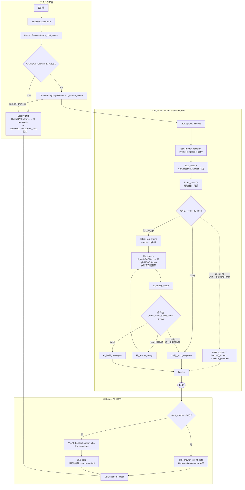

# 企业级智能客服 LangGraph 框架实现方案

## 1. 目标与范围

- 目标：将当前智能客服后端编排升级为 LangGraph，实现可扩展、可观测、可回滚的企业级工作流。
- 范围：覆盖 `chatbot` 场景的流式主链路（SSE），兼容现有提示词模板策略、RAG 检索与会话管理。
- 保留：现有 `ConversationManager`（会话历史）与 `VLLMHttpClient`（模型调用）不替换，只调整编排层。
- 不在本期：接口层统一鉴权绑定（后续在网关/接口层处理）。

## 2. 设计原则

- 编排与执行分离：LangGraph 负责状态流转，LLM/RAG/会话仍用现有服务。
- 兼容优先：请求/响应协议尽量不变，支持灰度发布与一键回退。
- 结构先行：先完整建图（含占位节点），初期只启用 `kb_qa` 与 `clarify` 两条业务路径。
- 可观测优先：接入 LangSmith，节点级记录耗时、路由、重试与失败原因。

## 3. 总体架构

客户端 -> `/chatbot/chat/stream` -> `ChatbotService` -> `ChatbotGraphRunner` -> LangGraph -> SSE 返回。

组件职责：

- `ChatbotService`：保持 API 契约与 SSE 封装，调用图执行器。
- `ChatbotGraphRunner`：图输入输出适配、流式事件映射、统一异常处理。
- LangGraph：状态机编排（意图、检索、C-RAG、自澄清、生成、持久化）。
- `HybridRAGService` / `AgenticRAGService`：检索能力入口（本期双引擎兼容）。
- `ConversationManager`：业务会话读写（`user_id + session_id`）。
- `PromptTemplateRegistry`：系统提示词与模板策略（含版本/A-B）。
- `VLLMHttpClient`：底层模型 HTTP 调用（非流/流式）。
- LangSmith：链路追踪与调试分析。

## 4. 图设计（状态、节点、路由）

### 4.0 业务逻辑流程图

#### 业务视角（文字流程）

从**用户与业务**角度，一轮智能客服（流式）可理解为下列主线（不含类名与文件名，便于与产品/运营对齐）：

```text
                    【用户发起一轮咨询】
                              │
                              ▼
              ┌───────────────────────────────┐
              │ 接入请求：识别用户与会话        │
              │ 并确认：是否带多轮记忆、        │
              │ 是否启用知识库检索              │
              └───────────────┬───────────────┘
                              ▼
              ┌───────────────────────────────┐
              │ 准备对话前提                    │
              │ · 加载本场景话术/策略（含分流） │
              │ · 若需要记忆：读取近期历史      │
              └───────────────┬───────────────┘
                              ▼
                     ┌────────────────┐
                     │ 用户表述是否    │
                     │ 过短或过于模糊？ │
                     └───────┬────────┘
                         是  │  否
            ┌────────────────┘  └────────────────┐
            ▼                                    ▼
┌───────────────────────┐            ┌───────────────────────┐
│【分支 A：意图澄清】    │            │【分支 B：知识问答主线】 │
│返回引导话术，请用户补充 │            │若已开启知识库：        │
│业务对象、现象、期望等   │            │ 选检索方式 → 召回片段   │
│（避免在信息不足时硬答） │            │评估证据是否够用：      │
└───────────┬───────────┘            │ · 不够：在限次内改写   │
            │                        │   问题后再检索（C-RAG）│
            │                        │ · 仍不够：走澄清策略，  │
            │                        │   优先不编造           │
            │                        │若未开启知识库：        │
            │                        │ 跳过检索，仅用历史+   │
            │                        │ 当前问题              │
            │                        └───────────┬───────────┘
            │                                    ▼
            │                        ┌───────────────────────┐
            │                        │ 拼成「给大模型的完整   │
            │                        │ 输入」（角色+知识+     │
            │                        │ 历史+当前问+附图等）    │
            │                        └───────────┬───────────┘
            │                                    ▼
            │                        ┌───────────────────────┐
            │                        │ 大模型流式生成回复     │
            │                        │（用户侧逐段看到内容） │
            │                        └───────────┬───────────┘
            │                                    │
            └────────────────┬───────────────────┘
                             ▼
              ┌───────────────────────────────┐
              │【结束本轮】                    │
              │ 保存用户话与助手回复；         │
              │ 附带检索是否使用、意图类型等   │
              │ 摘要供前端/运维观测（SSE 结束）│
              └───────────────────────────────┘
```

补充说明（业务口径）：

- **关闭「新版编排」或异常回退旧链路时**：整体仍是「按需检索 → 组上下文 → 大模型流式回答 → 记会话」，但不走意图分支与 C-RAG，细节见第 6 节兼容说明。
- **安全拒答、转人工、纯闲聊**：设计上预留分支，**本期默认不放量**，主流量只在「澄清」与「知识问答」之间分流。

---

#### 实现视角（代码级流程图）

下图对齐**当前实现**（`app/services/chatbot_service.py` → `app/llm/graphs/chatbot_graph_runner.py`）：先经过 API 与「图开关 / 异常回退」，再进入 LangGraph 状态机；**模型流式调用与会话落库**在图执行结束后的 **Runner 层**完成（对应设计文档中的 `llm_stream_generate`、`persist_conversation` 职责，未注册为独立图节点）。



说明（与代码一致）：

- **`_route_by_intent` 现状**：除 `clarify` 外一律走 `kb_qa` 边，故 **unsafe / handoff_human / smalltalk** 虽在图中注册，默认流量**不会**进入（与第 4.2 节占位描述一致；虚线表示预留拓扑）。
- **`enable_rag=false`** 时，`kb_retrieve` 不检索，质量路由直接 **`build`**，不进入 C-RAG 重试。
- **检索质量触发的澄清**：图中经 `clarify_build_response` 写入 `answer_text`，但 `intent_label` 可能仍为 `kb_qa`；Runner 当前以 **`intent_label == clarify`** 分支输出固定澄清话术。**若业务依赖「仅由检索触发的澄清」**，需与 `run_stream_events` 中是否增加 `answer_text` / `terminate_reason` 判定保持同步（以仓库最新代码为准）。

### 4.1 状态模型（GraphState）

建议最小字段如下（按职责分组）：

- 请求域：`user_id`、`session_id`、`query`、`image_urls`、`enable_rag`、`enable_context`
- 提示词域：`prompt_template_id`、`prompt_version`、`prompt_variant`、`system_prompt`
- 会话域：`history_messages`、`history_limit`
- 意图域：`intent.label`、`intent.confidence`、`intent.reason`
- 检索域：`context_snippets`、`retrieval_score`、`retrieval_attempts`
- 生成域：`llm_messages`、`answer_parts`、`answer_text`
- 控制域：`status`、`error`、`trace_id`、`used_rag`、`rag_engine`、`terminate_reason`

说明：

- `status` 用于业务观测，不直接暴露内部节点名；建议枚举：`started`/`intented`/`retrieved`/`clarifying`/`answered`/`aborted`/`failed`。
- `answer_parts` 仅用于流式拼接；最终 `answer_text` 用于会话落库。

### 4.2 节点清单

本期一次性建全节点，但按开关控制实际可达路径：

1. `load_prompt_template`：加载并注入现有模板策略（`PromptTemplateRegistry`）。
2. `load_history`：按 `enable_context` 读取会话历史。
3. `intent_classify`：意图分类，初期仅产出 `kb_qa` 或 `clarify`。
4. `route_intent`：条件路由。
5. `select_rag_engine`：根据配置选择 `hybrid` 或 `agentic`。
6. `kb_retrieve`：执行检索（`HybridRAGService` 或 `AgenticRAGService`）。
7. `kb_quality_check`：检索质量判定（是否触发 C-RAG 循环）。
8. `kb_rewrite_query`：查询改写（C-RAG 自矫正）。
9. `kb_build_messages`：构造模型 messages（含系统提示、历史、检索片段、多模态输入）。
10. `llm_stream_generate`：调用 `VLLMHttpClient.stream_chat`，输出流式片段。
11. `clarify_build_response`：生成澄清问题（信息不足时）。
12. `unsafe_guard`：安全分支占位（本期默认不可达）。
13. `handoff_human`：转人工分支占位（本期默认不可达）。
14. `smalltalk_generate`：闲聊分支占位（本期默认不可达）。
15. `persist_conversation`：会话持久化（先 user 后 assistant）。
16. `finalize`：统一收敛与错误归档。

实现状态（当前代码）：

- 上述占位节点已落地到图编排与代码实现；
- 通过 `CHATBOT_INTENT_OUTPUT_LABELS` 白名单控制标签输出，默认仅放开 `kb_qa,clarify`；
- 未放量标签会降级到 `kb_qa`，并在 `intent_reason` 记录 `label_not_enabled:*`。

### 4.3 路由策略

本期生效路由：

- `intent.label=kb_qa` -> `select_rag_engine` -> `kb_retrieve` -> `kb_quality_check` -> `kb_build_messages` -> `llm_stream_generate`
- `intent.label=clarify` -> `clarify_build_response` -> `persist_conversation`

预留路由（默认不可达）：

- `unsafe` -> `unsafe_guard`
- `handoff_human` -> `handoff_human`
- `smalltalk` -> `smalltalk_generate`

建议：即使不可达，也在状态中记录 `label_not_enabled` 与 `route_reason`，便于后续灰度放开与审计。

## 5. C-RAG 实现策略（简要）

目标：当首次检索证据不足时，自动“检索-评估-改写-再检索”，提高答案可靠性。

核心机制：

- 检索质量指标：`retrieval_score`（可由命中分数、命中条数、关键覆盖率组成）。
- 循环条件：
  - 若 `score < MIN_RETRIEVAL_SCORE` 且 `retrieval_attempts < MAX_RETRIEVAL_ATTEMPTS`，进入 `kb_rewrite_query` 后重试。
  - 否则退出循环。
- 退出策略：
  - 质量达标 -> 进入 `kb_build_messages` 正常回答。
  - 达上限仍不足 -> 转 `clarify_build_response`（建议优先澄清，避免“编答案”）。

硬护栏（必须）：

- `MAX_RETRIEVAL_ATTEMPTS`（建议默认 2）
- `MAX_GRAPH_LATENCY_MS`（端到端超时）
- `MAX_REWRITE_QUERY_LENGTH`（防止改写膨胀）
- 出错降级：图节点异常时返回可解释错误事件，不进入无限循环。

## 6. 与现有实现兼容要求

### 6.1 提示词模板策略兼容

- 必须继续走 `PromptTemplateRegistry`。
- 支持按 `scene=chatbot`、`user_id`、`version` 获取模板。
- 系统提示词注入顺序保持与原实现一致（先 system，再上下文）。
- 保留 A/B 分流语义：同一 `user_id` 稳定命中同一 variant，并将 `variant/version/weight` 写入 trace 元数据。

### 6.2 RAG 能力兼容

- 必须兼容当前已在 `ChatbotChain` 中落地的 Agentic RAG 能力。
- 企业级默认策略：
  - 新增 `CHATBOT_RAG_ENGINE_MODE=agentic|hybrid`；
  - 默认 `agentic`，失败自动回退 `hybrid`（避免能力回退或全链路失败）。

实现状态（当前代码）：

- 已支持 `select_rag_engine` 节点动态选择 `agentic/hybrid`；
- 已实现检索异常回退到 `CHATBOT_RAG_ENGINE_FALLBACK`。

### 6.3 会话管理兼容

- 保留 `ConversationManager` 作为业务历史真源。
- 会话键保持 `user_id + session_id`。
- 写入顺序保持“先生成后落库”（避免当前轮重复出现在 prompt）。
- `enable_context=false` 时不读取历史（写入策略按现有语义保留）。
- 历史窗口统一配置：`CHATBOT_HISTORY_LIMIT`（建议统一为 20，避免旧链路 10/20 不一致）。

### 6.4 多模态兼容

- 保留 `image_urls` 过滤逻辑（空串/null/空白过滤），避免 empty image 400。
- 保留多模态消息结构：`content=[text + image_url...]`；过滤后为空自动回退纯文本。

### 6.5 流式协议兼容

- SSE 事件格式保持现状：
  - 进行中：`{"delta":"...","finished":false}`
  - 结束：`{"finished":true,"meta":{"used_rag":bool,"intent_label":"...","retrieval_attempts":int}}`（向后兼容）
  - 异常：`{"error":"...","finished":true}`
- `ensure_ascii=false` 保持不变，中文不转义。
- 终止语义（企业级默认）：
  1. 正常结束：落库 user + assistant（完整 answer）。
  2. 模型异常：落库 user，不落库 assistant，`status=failed`。
  3. 客户端断开：落库 user + assistant_partial（默认启用），并标记 `terminate_reason=client_disconnect`。

实现状态（当前代码）：

- API 层 SSE 已输出结束帧 `meta`；
- graph 路径与 legacy 回退路径均输出 `finished + meta`；
- 已实现断连 partial 落库开关 `CHATBOT_PERSIST_PARTIAL_ON_DISCONNECT`。

## 7. LangSmith 实现方案

目标：实现节点级可观测与链路追踪，不影响主流程可用性。

建议实践：

- 复用现有 `LangSmithTracker` 中间层，避免双套埋点。
- 环境变量：`LANGSMITH_API_KEY`、`LANGSMITH_PROJECT`、`LANGSMITH_ENABLED`
- Run 级 metadata：
  - `user_id`、`session_id`、`intent.label`、`used_rag`、`rag_engine`
  - `retrieval_attempts`、`status`、`error`、`prompt_variant`
- 节点埋点：
  - 检索耗时/命中量
  - C-RAG 循环次数
  - 首 token 延迟、总时延、终止原因

要求：LangSmith 初始化失败时自动降级为 no-op，不影响业务返回。

## 8. Checkpoint 与会话历史并存

- Checkpoint 用于“图执行状态恢复/人工审核/断点续跑”。
- 会话历史用于“业务上下文记忆”。
- 二者并存，不互相替代。

本期建议：

- 生产建议启用 Redis/Postgres checkpoint（不要用 memory 做生产）。
- 多轮人工审核节点先占位，不在默认路由触发。
- 恢复后禁止重复推送已发送 token（通过 cursor/offset 状态控制）。

实现状态（当前代码）：

- 已落地 checkpoint backend 配置：
  - `CHATBOT_CHECKPOINT_BACKEND=none|memory|redis`
  - `CHATBOT_CHECKPOINT_REDIS_URL`
  - `CHATBOT_CHECKPOINT_NAMESPACE`
- backend=none 为默认；backend=memory 用于开发测试；backend=redis 依赖可选包，缺失时自动降级为 none。

## 9. 配置与开关建议

建议新增（或统一）配置项：

- `CHATBOT_GRAPH_ENABLED=true`
- `CHATBOT_INTENT_ENABLED=true`
- `CHATBOT_INTENT_OUTPUT_LABELS=kb_qa,clarify`
- `CHATBOT_RAG_ENGINE_MODE=agentic`
- `CHATBOT_RAG_ENGINE_FALLBACK=hybrid`
- `CHATBOT_CRAG_ENABLED=true`
- `CHATBOT_CRAG_MAX_ATTEMPTS=2`
- `CHATBOT_CRAG_MIN_SCORE=0.55`
- `MAX_GRAPH_LATENCY_MS=60000`
- `CHATBOT_FALLBACK_LEGACY_ON_ERROR=true`
- `CHATBOT_HISTORY_LIMIT=20`
- `CONV_SESSION_TTL_MINUTES=60`
- `CONV_MAX_HISTORY_MESSAGES=50`
- `CHATBOT_PERSIST_PARTIAL_ON_DISCONNECT=true`
- `MAX_REWRITE_QUERY_LENGTH=256`
- `CHATBOT_CHECKPOINT_BACKEND=none|memory|redis`
- `CHATBOT_CHECKPOINT_REDIS_URL=...`（redis backend 时）
- `CHATBOT_CHECKPOINT_NAMESPACE=chatbot_graph`

说明：通过开关支持灰度与回滚，不需要改 API。

## 10. 发布、灰度与回滚

发布建议：

1. 先在测试环境全量验证（协议兼容、会话一致性、流式异常路径）。
2. 生产环境按流量灰度（如 10% -> 30% -> 100%）。
3. 稳定 1-2 个版本后再下线旧实现分支。

关键监控指标：

- 首 token 延迟、完整响应时延
- `clarify` 触发率
- C-RAG 平均循环次数与超限率
- SSE 错误率、客户端断开率
- 会话读写失败率、部分落库比例

回滚策略：

- 仅切配置：`CHATBOT_GRAPH_ENABLED=false`，立即回退 legacy 流式路径。
- 当 `CHATBOT_GRAPH_ENABLED=true` 且图运行异常时，若 `CHATBOT_FALLBACK_LEGACY_ON_ERROR=true`，自动回退 legacy 流式路径。

非流式接口下线节奏（企业级默认）：

- Phase 1：保留 `/chatbot/chat`，标记 deprecated，内部复用图执行的非流包装。
- Phase 2：发布迁移公告并完成调用方迁移。
- Phase 3：稳定窗口后下线，保留只读兼容层 1 个版本。

## 11. 本期实现边界（避免过度设计）

- 本期只放开 `kb_qa` 与 `clarify` 两条业务路径。
- `unsafe` / `handoff_human` / `smalltalk` 节点先占位，不影响当前业务。
- 鉴权绑定后续在接口层统一接入，不阻塞本次编排升级。

## 12. 验收标准（最小可上线）

- 功能：`kb_qa`、`clarify` 路由可用，SSE 协议与现网兼容。
- 稳定：C-RAG 有循环上限与超时保护，无无限重试。
- 兼容：Prompt 模板策略、AgenticRAG 能力、会话管理语义与现有行为一致。
- 可观测：LangSmith 可查看完整 run 与关键节点信息。
- 可运维：支持灰度发布和单开关回滚。

## 13. 回归测试矩阵（防改造遗漏）

必须覆盖以下组合：

1. `enable_rag` / `enable_context` 四组合。
2. 文本输入与多图输入（含空 URL 清洗）。
3. `kb_qa` 与 `clarify` 两条路径。
4. C-RAG 触发与不触发（含超限转 clarify）。
5. 流式正常结束、模型异常、客户端断开三类终止。
6. 会话跨轮记忆（同 `user_id+session_id`）与隔离（不同 session）。
7. A/B 模板稳定分流一致性。
8. `agentic` 主模式与 `hybrid` 回退模式。

通过标准：

- 行为与现网基线不回退；
- 无会话串线；
- 无流式协议破坏；
- 指标与 trace 完整可观测。

