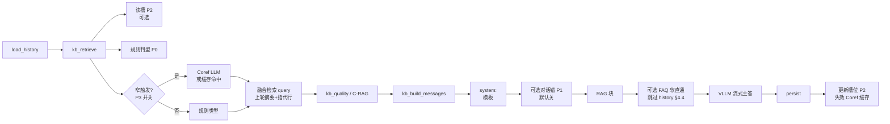

# 企业级智能客服 LangGraph 框架实现方案

## 1. 目标与范围

- 目标：将当前智能客服后端编排升级为 LangGraph，实现可扩展、可观测、可回滚的企业级工作流。
- 范围：覆盖 `chatbot` 场景的流式主链路（SSE），兼容现有提示词模板策略、RAG 检索与会话管理；可选扩展 **相似事故案例**（限定 namespace RAG，见 **第 14 节**）。
- 保留：现有 `ConversationManager`（会话历史）与 `VLLMHttpClient`（模型调用）不替换，只调整编排层。
- 不在本期：接口层统一鉴权绑定（后续在网关/接口层处理）。

## 2. 设计原则

- 编排与执行分离：LangGraph 负责状态流转，LLM/RAG/会话仍用现有服务。
- 兼容优先：请求/响应协议尽量不变，支持灰度发布与一键回退。
- 结构先行：先完整建图（含占位节点）；当前已放量 **`kb_qa`（向量 RAG）**、**`clarify`**、**`data_query`（内嵌 NL2SQL + 收紧分析流，见 §4.6）**，由 `CHATBOT_INTENT_OUTPUT_LABELS` 控制；意图后端支持 **`rules | llm | bert`**（默认 `rules`，`llm` 为模式 B 窄触发，见 `docs/智能客服意图识别轻量LLM接入说明.md`）。结束 `meta` 含 **`suggested_questions`**（`kb_qa`/`clarify` 路径；**`data_query` 流式不下发**，见 §4.3）、**`rag_citations`**（RAG 路径结构化引用，见 §4.5）、**`nl2sql_analysis`**（查库旁路结构，见 §4.6）等；关联问题生成规则为规则预设表 + 复用本轮 `context_snippets` 首行种子 + 可选 LLM JSON 补全，**不为关联问题单独做二次向量检索**。逐步说明见 `framework-guide/智能客服整体实现技术说明.md` **§7**。**高分 FAQ 软直通**见 **§4.4**。**本厂专属知识库 RAG 范围（`rag_scope_resolve`）**见 **第 16 节**。**上下文指代消解（P0～P3）**见 **第 15 节** 与 `docs/智能客服上下文理指代实现优化方案-20260514.md`。
- 可观测优先：接入 LangSmith，节点级记录耗时、路由、重试与失败原因。

## 3. 总体架构

客户端 → `POST /chatbot/chat/stream`（或兼容 deprecated `POST /chatbot/chat`）→ `ChatbotService` → `ChatbotLangGraphRunner` → LangGraph（或 Legacy 顺序链路）→ SSE / JSON 返回；多模态图片可先经 **`POST /chatbot/upload`** 上传 MinIO 取得预签名 URL；可通过 `POST /chatbot/chat/stop` + `stream_id` 显式中断（`terminate_reason=user_cancelled`）。

组件职责：

- `app/api/chatbot.py`：HTTP、SSE 帧封装、`/upload` 图片上传。
- `ChatbotService`（`chatbot_service.py`）：图开关、异常回退 Legacy、会话与 Runner 共用 `ConversationManager`；入口顺序含图片预处理与可选 Outline「第 N 点」引用改写（`_apply_structured_reference`）。
- `ChatbotImagePreprocessor`（`chatbot_image_preprocessor.py`）：在 `ChatbotService` 入口前对 `image_urls` 做缩放/压缩并存储；默认 **`CHATBOT_IMAGE_STORAGE_BACKEND=minio`**（预签名 URL），可选本地目录 + `StaticFiles`（前缀默认 `/chatbot/media`），降低多模态上下文与传输开销。
- `ChatbotOutlineStore`（`chatbot_outline.py`）：回答后异步提取“第N点”结构化索引，写 Redis 热层（可选 EasySearch 冷层）；在新一轮对“上文第N点”请求做旁路引用增强，不改变主链路。
- **上下文指代消解（P0～P3）**：规则判型 + 检索 query 与历史融合（P0，默认开）、可选对话锚块（P1，默认关）、会话槽位（P2，默认关）、灰区 Coref 小模型 + 短时缓存（P3，默认关）；清单与开关见 **`configs/chatbot_anaphora.yaml`**，设计见 **`docs/智能客服上下文理指代实现优化方案-20260514.md`**，编排落点见 **第 15 节**。
  - 槽位（P2）：上一轮 assistant **落库后**同步抽取要点数组，写入 Redis（按 `user_id + session_id`）
  - 对话锚（P1）：**本轮**组装 system 时按需注入，优先消费槽位要点
  - Coref 缓存（P3）：灰区 LLM 分类结果短时缓存，落库后按会话失效
- `ChatbotLangGraphRunner`（`chatbot_graph_runner.py`）：`StateGraph` 编译与执行、**图后**流式生成（含 `kb_qa` 主答流、`data_query` 收紧分析流）、相似案例追加、**关联问题** `_fill_suggested_questions`、落库。
- LangGraph：状态机（模板、历史、意图、故障门控、**按意图分支**、RAG/C-RAG 或 NL2SQL、`finalize`）。
- `HybridRAGService` / `AgenticRAGService`：主链路检索；相似案例为 Runner 层**二次** `retrieve(namespace=…)`。
- `NL2SQLService`（`nl2sql_service.py`）：`data_query` 分支生成 SQL 与执行；客服内嵌调用时 `record_conversation=False`。NL2SQL 与 RAG 同为基座基础能力；直连 HTTP 见 `POST /nl2sql/query`；**综合分析 V2** 在 **`POST /analysis/run-with-nl2sql`**（及流式 **`run-with-nl2sql-stream`**）与 **`POST /analysis/run-img-diag`**（及流式 **`run-img-diag-stream`**）（NL2SQL 并行臂 **`acquire_data`** → **`_execute_data_plan`**，**默认同 dependency 层并行多次 `query`**）阶段亦多次复用同一服务（`record_conversation=False`）。接入形态总览见 **`enterprise-level_transformation_docs/企业级NL2SQL实现方案.md`**。
- `chatbot_intent.py` / `chatbot_intent_rules.py` / `chatbot_intent_llm.py` / `chatbot_intent_bert.py`：意图统一入口与三后端（`rules | llm | bert`）；生产路径须 `classify_chatbot_intent_async`。
- `chatbot_faq_soft_direct.py`：高分 FAQ 软直通判定（`kb_build_messages` 阶段，见 **§4.4**）。
- `chatbot_rag_citations.py` / `chatbot_citation_stream.py`：RAG 结构化引用与流式 `citation_ref` 事件（见 **§4.5**）。
- `chatbot_follow_up.py`：`build_suggested_questions`（规则表 + 本轮片段种子 + 可选 LLM）。
- `chatbot_nl2sql_answer.py` / `chatbot_nl2sql_display.py`：查数统一入口 `run_chatbot_nl2sql_query`；列过滤展示；可选 **收紧分析**（`summarize_nl2sql_with_llm` / 流式 `nl2sql_analysis_stream_plan`，见 **§4.6**）。
- `ConversationManager`：会话真源（`user_id + session_id`）。
- `PromptTemplateRegistry` + `configs/prompts.yaml`：默认 `boiler_v1`（`CHATBOT_PROMPT_DEFAULT_VERSION`）。
- `VLLMHttpClient`：对话与 NL2SQL 收紧分析、关联问题 LLM、流式主答。
- LangSmith：可选链路追踪（`LangSmithTracker`）。

## 4. 图设计（状态、节点、路由）

### 4.0 业务逻辑流程图

#### 业务视角（文字流程）

从**用户与业务**角度，一轮对话（流式为主）主线如下（不出现文件名，便于产品/运营对齐）。顺序与实现一致：**先判意图与门控，再分岔**。

```text
                        【用户发起一轮咨询】
                                  │
                                  ▼
              ┌───────────────────────────────────┐
              │ 接入：用户、会话、是否多轮记忆、     │
              │ 是否启用知识库检索、是否允许查库路由 │
              └───────────────────┬───────────────┘
                                  ▼
              ┌───────────────────────────────────┐
              │ 准备前提：加载本场景话术/策略；       │
              │ 需要时读取近期历史                   │
              └───────────────────┬───────────────┘
                                  ▼
              ┌───────────────────────────────────┐
              │ 意图分流（短句/指代不清 → 澄清；     │
              │ 台账统计列表等 → 结构化查库；         │
              │ 机理/标准/原因等 → 文档知识问答；     │
              │ 带图时默认走文档侧，避免误查库）     │
              └───────────────────┬───────────────┘
                                  ▼
              ┌───────────────────────────────────┐
              │（可选）故障域门控：若开相似案例，     │
              │ 结合文/图判断是否像锅炉管材故障，     │
              │ 决定主答结束后是否追加「相似案例」块 │
              │（默认总关；见第 14 节）              │
              └───────────────────┬───────────────┘
                                  ▼
              ┌─────────┬─────────┬─────────┐
              │    A    │    B    │    C    │
              │  澄清   │结构化查库│文档知识 │
              └────┬────┴────┬────┴────┬────┘
                   │         │         │
     ┌─────────────┘         │         └──────────────────────────┐
     ▼                       ▼                                    ▼
┌──────────┐        ┌──────────────┐              ┌────────────────────────┐
│固定澄清话│        │NL2SQL 链+执行 │              │select_rag→rag_scope_   │
│术        │        │→nl2sql_answer│              │resolve→kb_retrieve     │
│          │        │（可挂收紧分析│              │→C-RAG→kb_build_messages│
│          │        │ stream_plan）│              │（含 FAQ 软直通 4.4）   │
└────┬─────┘        └──────┬───────┘                          ▼
     │                     │                   ┌────────────────────────┐
     │                     ▼                   │VLLM 流式主答（Runner）  │
     │            ┌────────────────┐           └───────────┬────────────┘
     │            │Runner：收紧分析│                       ▼
     │            │整段 delta 一次 │           ┌────────────────────────┐
     │            │（非逐 token）  │           │（条件）相似案例 delta   │
     │            └───────┬────────┘           │intent=data_query 跳过   │
     │                    │                    └───────────┬────────────┘
     │                    │                                │
     └────────────────────┴────────────────────────────────┘
                                  ▼
              ┌───────────────────────────────────┐
              │ 生成「关联推荐问」（规则表 + 本轮   │
              │ 已召回片段首行种子 + 可选 LLM；    │
              │ **B 查库路径不下发**；细节见      │
              │ framework-guide §7）              │
              └───────────────────┬───────────────┘
                                  ▼
              ┌───────────────────────────────────┐
              │【结束】落库用户与助手全文；         │
              │ SSE/JSON 结束帧 meta：意图、used_rag、│
              │ used_nl2sql、nl2sql_analysis、        │
              │ rag_citations、推荐问等               │
              └───────────────────────────────────┘
```

补充说明（业务口径）：

- **Legacy（关图或图异常回退）**：`chatbot_service._stream_chat_legacy_events` 对齐同一套 **意图三分支 + 关联问题 + 默认提示词**；与 Graph 差异主要在是否走 `StateGraph` 与 C-RAG 图节点，产品行为应对齐验收（**流式** `data_query` 与 Graph 一致，**不下发** `suggested_questions`；查数成功亦可走收紧分析流，见 **§4.6**）。
- **安全拒答、转人工、闲聊**：图内占位，**默认意图不产出**，主流量为 **澄清 / 查库 / 文档问答**。
- **相似案例**：仅 **C 路径**且非澄清、且门控命中时，在主答流式结束后追加；**B 查库路径不追加**（见 `chatbot_graph_runner._should_append_similar_cases`）。
- **关联问题**：**不为关联问题单独再做向量检索**；**`data_query` 流式路径不生成、不下发**；详见 `framework-guide/智能客服整体实现技术说明.md` **§7**。
- **RAG 引用**：`kb_qa` 路径在流式输出中可下发 `citation_ref` 事件，结束帧含 `rag_citations`（见 **§4.5**）。
- **查库成文**：流式默认走 **收紧分析**（有 `stream_plan` 时 Runner **整段一次** `delta`，非逐 token；见 **§4.6**）。

---

#### 实现视角（代码级流程图）

对齐 **当前仓库** 的**代码调用链**（流式主路径）。每个框优先标 **Python 文件路径**，再标 **类 / 函数**，并附 **`说明:`** 中文职责摘要；顺序与业务视角一致：**先意图与门控，再分岔**。图后流式/落库在 Runner 层，**不是** LangGraph 独立节点。

```text
                    【客户端发起流式对话 POST /chatbot/chat/stream】
                                  │
                                  ▼
┌─────────────────────────────────────────────────────────────────┐
│ 【HTTP/SSE 入口】                                               │
│ file: app/api/chatbot.py                                        │
│ fn:   chat_stream                                               │
│ 说明: 接收请求；把内部事件转成 SSE 帧给前端                      │
│       （started / delta / citation_ref / finished / error）     │
└───────────────────────────────┬─────────────────────────────────┘
                                  ▼
┌─────────────────────────────────────────────────────────────────┐
│ 【服务编排与开关】                                              │
│ file:  app/services/chatbot_service.py                          │
│ class: ChatbotService                                           │
│ meth:  stream_chat_events                                       │
│ 说明: 一轮对话总入口；先预处理，再决定走 Graph 或 Legacy        │
│  ① _preprocess_request_images  — 图片缩放压缩，降多模态开销    │
│     └─ file: app/services/chatbot_image_preprocessor.py         │
│        class: ChatbotImagePreprocessor                          │
│  ② _apply_structured_reference — 可选解析「上文第N点」改写问句 │
│     └─ file: app/services/chatbot_outline.py                    │
│        class: ChatbotOutlineStore                               │
│  ③ begin_stream → started{stream_id} — 供 /chat/stop 中断      │
│     └─ file: app/services/chatbot_stream_control.py             │
│  ④ CHATBOT_GRAPH_ENABLED？                                     │
│     false → _stream_chat_legacy_events（顺序链路，行为对齐）   │
│     true  → ChatbotLangGraphRunner.run_stream_events            │
│     异常且 FALLBACK → 自动回退 Legacy                           │
└───────────────────────────────┬─────────────────────────────────┘
                                  │ GRAPH=true（默认）
                                  ▼
┌─────────────────────────────────────────────────────────────────┐
│ 【LangGraph Runner】                                            │
│ file:  app/llm/graphs/chatbot_graph_runner.py                   │
│ class: ChatbotLangGraphRunner                                   │
│ meth:  run_stream_events → _run_graph / ainvoke                 │
│ state: app/llm/graphs/chatbot_graph_state.py · ChatbotGraphState │
│ 说明: 先跑完整张图得到 state，再在图外做流式输出与落库          │
└───────────────────────────────┬─────────────────────────────────┘
                                  ▼
┌─────────────────────────────────────────────────────────────────┐
│ 【图内前缀：模板 → 历史 → 意图 → 门控 → 路由】                  │
│ file: chatbot_graph_runner.py · _node_*                         │
│                                                                 │
│  load_prompt_template — 加载场景话术（默认 boiler_v1）          │
│    └─ file: app/llm/prompt_registry.py + configs/prompts.yaml  │
│  load_history — 按会话读近期多轮（enable_context）              │
│    └─ file: app/conversation/manager.py · ConversationManager  │
│  intent_classify — 判 clarify / data_query / kb_qa              │
│    └─ file: app/llm/graphs/chatbot_intent.py                   │
│       fn: classify_chatbot_intent_async（rules|llm|bert）      │
│  fault_case_gate — 是否事后追加「相似案例」（默认总关）         │
│    └─ file: app/llm/graphs/chatbot_similar_cases.py            │
│       fn: run_fault_case_gate_decision                         │
│  _route_by_intent — 按意图进入下方 A/B/C 三分支                 │
└───────────────────────────────┬─────────────────────────────────┘
                                  ▼
              ┌─────────┬─────────┬─────────┐
              │ A 澄清  │ B 查库  │ C 知识答│
              │clarify  │data_query│ kb_qa  │
              └────┬────┴────┬────┴────┬────┘
                   │         │         │
     ┌─────────────┘         │         └──────────────────────────┐
     ▼                       ▼                                    ▼
┌────────────────┐  ┌────────────────────┐      ┌──────────────────────────────┐
│【A 澄清】      │  │【B 结构化查库】    │      │【C 文档知识问答 / RAG】      │
│ file:          │  │ file:              │      │ file: chatbot_graph_runner.py│
│ chatbot_graph_ │  │ chatbot_graph_     │      │                              │
│ runner.py      │  │ runner.py          │      │ select_rag_engine            │
│                │  │ _node_nl2sql_answer│      │  说明: 选 agentic/hybrid     │
│ _node_clarify_ │  │ 说明: 只查库成文， │      │ rag_scope_resolve            │
│ build_response │  │ 不做主链路 RAG；   │      │  └─ chatbot_rag_scope.py     │
│ 说明: 问句过短 │  │ 成功可挂分析计划   │      │  说明: 「本厂」等锁专属库    │
│ 或证据不足时， │  │   │                │      │ kb_retrieve(+rag_citations)  │
│ 返回固定澄清话 │  │   ▼                │      │  ├─ Agentic/Hybrid 召回      │
│ 术，引导补充   │  │ chatbot_nl2sql_    │      │  ├─ retrieval_query 指代P0   │
└───────┬────────┘  │ answer.py          │      │  └─ anaphora_* 可选P2/P3     │
        │           │ run_chatbot_       │      │ kb_quality_check             │
        │           │ nl2sql_query       │      │ kb_rewrite_query             │
        │           │ (defer_stream=True)│      │  说明: 低分retry/超限转A澄清 │
        │           │   │                │      │ kb_build_messages            │
        │           │   ▼                │      │  ├─ faq_soft_direct 高分直通 │
        │           │ nl2sql_service.py  │      │                              │
        │           │ NL2SQLService.query│      │  └─ dialogue_anchor P1锚块   │
        │           │ 说明: 生成SQL并执行│      │  说明: 组装发给大模型的消息 │
        │           │ (不写NL2SQL会话)   │      └──────────────┬───────────────┘
        │           │   │                │                     │
        │           │   ▼                │                     │
        │           │ summarize_nl2sql_  │                     │
        │           │ with_llm           │                     │
        │           │ → stream_plan      │                     │
        │           │ 说明: 收紧分析计划 │                     │
        │           │ 留给图后推送       │                     │
        │           └─────────┬──────────┘                     │
        │                     │                                │
        └─────────────────────┴────────────────────────────────┘
                                  │
                                  ▼
┌─────────────────────────────────────────────────────────────────┐
│ 【图内收敛】                                                    │
│ file: chatbot_graph_runner.py · _node_finalize → END            │
│ 说明: 统一写 status 等；真正的流式吐字在下一步「图后」完成      │
└───────────────────────────────┬─────────────────────────────────┘
                                  ▼
┌─────────────────────────────────────────────────────────────────┐
│ 【图后：流式输出 → 增强 → 落库 → 结束帧】                       │
│ file: chatbot_graph_runner.py                                   │
│ class: ChatbotLangGraphRunner · run_stream_events               │
│ 说明: 按 state 选择输出方式，再做案例/关联问/会话写入           │
│                                                                 │
│  ① 有 nl2sql_analysis_stream_plan？（B 查库成功常见）           │
│     → _emit_nl2sql_analysis_stream                              │
│       └─ chatbot_nl2sql_answer.iter_analysis_llm_deltas         │
│       └─ finalize_streamed_nl2sql_analysis                      │
│     说明: 收齐后整段一次 delta，避免小标题刷屏                  │
│  ② 否则有 llm_messages？（C 知识答）                            │
│     → app/llm/client.py · VLLMHttpClient.stream_chat            │
│       └─ chatbot_citation_stream.CitationStreamParser           │
│     说明: 逐 token 流式；[n] 可拆成 citation_ref 事件           │
│  ③ 否则一次性 delta=answer_text（A 澄清等）                     │
│                                                                 │
│  共性尾部:                                                      │
│    _maybe_similar_cases_extra — 追加相似案例块（B/A 跳过）      │
│      └─ chatbot_similar_cases.retrieve_similar_case_snippets    │
│    _fill_suggested_questions — 关联推荐问（B 查库不下发）       │
│      └─ chatbot_follow_up.build_suggested_questions             │
│    _persist_success / _persist_disconnect — 写入会话历史        │
│      └─ ConversationManager.append_*                            │
│    yield finished + _build_finished_meta — 结束帧观测字段       │
└───────────────────────────────┬─────────────────────────────────┘
                                  ▼
┌─────────────────────────────────────────────────────────────────┐
│ 【SSE 回写客户端】                                              │
│ file: app/api/chatbot.py · chat_stream                          │
│ 说明: 输出 started / delta / citation_ref / finished.meta 等    │
└─────────────────────────────────────────────────────────────────┘
```

**图注（调用约定）**：

- 框内优先 **`file:` + 类/方法**，其后 **`说明:`** 为该步职责摘要。
- Graph 开关关闭或 Runner 异常回退时，走同文件 **`ChatbotService._stream_chat_legacy_events`**，意图三分支与上图对齐（含收紧分析流）。
- Runner 优先消费 `nl2sql_analysis_stream_plan`；否则再按 `llm_messages` / 固定 `answer_text`；`data_query` 不生成关联问、不追加相似案例。

**实现落点速查（文件 → 职责）**

| 环节 | 文件 | 符号/位置（简练） |
|------|------|-------------------|
| HTTP/SSE / 上传 | `app/api/chatbot.py` | `chat_stream`、`upload_chatbot_image_endpoint` |
| 开关与回退 | `app/services/chatbot_service.py` | `stream_chat_events`、`_stream_chat_legacy_events` |
| 图编译与节点 | `app/llm/graphs/chatbot_graph_runner.py` | `_build_graph`、`_node_*`、`_route_by_intent`、`_route_after_quality_check` |
| 顺序回退（无 LangGraph） | 同上 | `_run_graph` 内手动合并节点 |
| 意图分类 | `app/llm/graphs/chatbot_intent.py` | `classify_chatbot_intent_async`（`CHATBOT_INTENT_BACKEND=rules\|llm\|bert`） |
| 意图规则 | `app/llm/graphs/chatbot_intent_rules.py` | `classify_chatbot_intent_by_rules` |
| 意图轻量 LLM | `app/llm/graphs/chatbot_intent_llm.py` | 模式 B 窄触发（见 `docs/智能客服意图识别轻量LLM接入说明.md`） |
| 意图 BERT | `app/llm/graphs/chatbot_intent_bert.py` | `classify_chatbot_intent_by_bert`（须已微调序列分类模型） |
| FAQ 软直通 | `app/llm/graphs/chatbot_faq_soft_direct.py` | `evaluate_faq_soft_direct`（见 **§4.4**） |
| RAG 引用 | `app/llm/graphs/chatbot_rag_citations.py` | `chunks_to_rag_context`、`filter_rag_citation_dicts` |
| 引用流式解析 | `app/llm/graphs/chatbot_citation_stream.py` | `CitationStreamParser`、`citation_ref` 事件 |
| 状态字段 | `app/llm/graphs/chatbot_graph_state.py` | `ChatbotGraphState` |
| 相似案例门控/检索 | `app/llm/graphs/chatbot_similar_cases.py` | `run_fault_case_gate_decision`、`retrieve_similar_case_snippets` |
| NL2SQL 服务 | `app/services/nl2sql_service.py` | `query(..., record_conversation=)` |
| 查数成文 / 收紧分析 | `app/llm/graphs/chatbot_nl2sql_answer.py` | `run_chatbot_nl2sql_query`、`summarize_nl2sql_with_llm`、`iter_analysis_llm_deltas`、`finalize_streamed_nl2sql_analysis` |
| 查数展示列过滤 | `app/llm/graphs/chatbot_nl2sql_display.py` | `filter_chatbot_nl2sql_display_rows`、`CHATBOT_NL2SQL_SELECT_DISPLAY_RULES` |
| 关联问题 | `app/llm/graphs/chatbot_follow_up.py` | `build_suggested_questions` |
| 指代消解（P0～P3） | `chatbot_retrieval_query.py`、`chatbot_anaphora_*.py`、`chatbot_dialogue_anchor.py` | 见 **第 15 节** |
| 提示词 | `app/llm/prompt_registry.py` + `configs/prompts.yaml` | `get_template(..., default_version=)` |

说明（与代码一致；顺序同图 **A/B/C** 与 **§4.2～§4.6**）：

- **`fault_case_gate`**：见 **第 14 节**；**A/B** 路径 Runner **不**追加相似案例（`_should_append_similar_cases`）。
- **`_route_by_intent`**：**A** `clarify` → 澄清；**B** `data_query` → `nl2sql_answer`；**C** `kb_qa` → RAG 链；**unsafe / handoff / smalltalk** 图内有边但默认不产出。
- **`enable_rag=false`（C）**：`kb_retrieve` 空结果，质量路由通常直 **`build`**，C-RAG 不重试。
- **A 澄清**：意图澄清或 C-RAG 超限转澄清时，图后多为一次性 `answer_text`；不追加相似案例。
- **B 查库流式**：图内 `defer_analysis_stream=True`；有 `stream_plan` 时图后走 `_emit_nl2sql_analysis_stream`（§4.6），**不下发** `suggested_questions`。
- **C 知识答**：`rag_citations` 在 `kb_retrieve` 生成；FAQ 软直通在 `kb_build_messages`（§4.4）；引用流在图后（§4.5）。
- **Legacy**：与 Graph 对齐三分支、默认 `boiler_v1`；流式 **B** 不下发关联问；**A/C** 仍可 `build_suggested_questions`。

### 4.1 状态模型（GraphState）

与实现 `ChatbotGraphState` 对齐。字段随**实现视角流程图**各阶段写入（入口请求 → 图内前缀 → A/B/C 分支 → 图后落库/meta），分组如下：

- 请求域：`user_id`、`session_id`、`query`、`original_image_urls`、`image_urls`、`enable_rag`、`enable_context`、`enable_nl2sql_route`、`client_prompt_version`（映射请求体 `prompt_version`）、`enable_fault_vision`
- 提示词域：`prompt_template_id`、`prompt_version`、`prompt_variant`、`system_prompt`（`load_prompt_template`）
- 会话域：`history_messages`、`history_limit`（`load_history`）
- 意图域：`intent_label`、`intent_confidence`、`intent_reason`、`intent_history_summary`、`intent_prev_task_type`（`intent_classify`；后两者仅供观测）
- 检索域（**C 知识答**）：`rag_namespace`、`rag_scope_reason`、`rag_query_boost`、`rag_scope_fallback`、`context_snippets`、`rag_citations`、`retrieval_score`、`retrieval_attempts`、`rag_engine`、`used_rag`
- FAQ 软直通域：`faq_soft_direct`、`faq_soft_direct_reason`（**C** 的 `kb_build_messages` 写入，见 **§4.4**）
- NL2SQL 域（**B 查库**）：`used_nl2sql`、`nl2sql_sql`、`nl2sql_failed`、`nl2sql_error_code`、**`nl2sql_analysis`**（旁路结构化：列/样本行等）、**`nl2sql_analysis_stream_plan`**（流式收紧分析计划，**图后**消费后清空，见 **§4.6**）
- 相似案例域：`need_similar_cases`、`case_rag_query`、`fault_detect_sources`、`fault_detect_confidence`、`similar_cases_appended`（门控在图内；追加在**图后**）
- 关联问题域：`suggested_questions`（**图后** `_fill_suggested_questions` 写入；**B/`data_query` 流式恒为空**）
- 指代域（**C** 检索链）：`anaphora_type`、`anaphora_rule_type`、`anaphora_confidence`、`anaphora_score_gap`、`anaphora_source`、`anaphora_slot_bullets`、`anaphora_anchor_block`（P1/P2 默认关，见 **§15**；观测项见 `CHATBOT_ANAPHORA_EXPOSE_META`）
- 生成域：`llm_messages`、`llm_max_tokens`、`history_trim_dropped`、`answer_parts`、`answer_text`、`is_partial`（**A** 多直接写 `answer_text`；**C** 写 `llm_messages` 供图后流式）
- 控制域：`status`、`error`、`terminate_reason`（含 `client_disconnect`、`user_cancelled`、**`latency_budget_exceeded`**、`nl2sql_gen_failed` / `nl2sql_exec_failed` 等）、**`trace_request_id`**（写入 `meta.request_id`）

说明：

- `status` 用于业务观测，不直接暴露内部节点名；建议枚举：`started`/`intented`/`retrieved`/`clarifying`/`answered`/`aborted`/`failed`。
- `answer_parts` 仅用于流式拼接；最终 `answer_text` 用于会话落库。
- `nl2sql_analysis_stream_plan` 仅在流式路径短暂存在；对应图中「图后 ①」；`_emit_nl2sql_analysis_stream` 消费后置 `None`。

### 4.2 节点清单

下列顺序与**实现视角图**一致：**图内前缀 → A/B/C 分支 → finalize → 图后 Runner**（占位意图单独列出，图中主流量未展开）。

**图内前缀（共性）**

1. `load_prompt_template`：加载场景话术；未传 `prompt_version` 时用 `CHATBOT_PROMPT_DEFAULT_VERSION`（默认 `boiler_v1`）。
2. `load_history`：`ConversationManager` 只读近期多轮（`enable_context`）。
3. `intent_classify`：`classify_chatbot_intent_async` → **A** `clarify` / **B** `data_query` / **C** `kb_qa`（`CHATBOT_INTENT_BACKEND=rules|llm|bert`；可关 `CHATBOT_INTENT_ENABLED`）。
4. `fault_case_gate`：判定事后是否追加相似案例（默认总关；见 **第 14 节**）。
5. **条件路由** `_route_by_intent`（非独立节点）：进入下方 A/B/C。

**A 澄清（`clarify`）**

6. `clarify_build_response`：问句过短/不清或检索证据用尽时，返回固定或模板澄清话术，引导用户补充；图后一般一次性 `delta=answer_text`。

**B 结构化查库（`data_query`）**

7. `nl2sql_answer`：`run_chatbot_nl2sql_query(..., defer_analysis_stream=True)` → `NL2SQLService.query(record_conversation=False)` + `summarize_nl2sql_with_llm`；**不做主链路 RAG**；成功且开启收紧分析时写入 **`nl2sql_analysis_stream_plan`**，正文由**图后**推送（见 **§4.6**）。

**C 文档知识问答（`kb_qa`）**

8. `select_rag_engine`：选择 `agentic` / `hybrid`。
9. **`rag_scope_resolve`**：`chatbot_rag_scope.resolve_rag_namespace`；「本厂」等厂别指代命中时锁定 `rag_namespace`（默认 `Power_plant_knowledge`）；**仅首轮进入**，C-RAG 重试复用 state。
10. `kb_retrieve`：按 `namespace` 召回；并入指代 P0/P2/P3；经 `chunks_to_rag_context` 写入编号片段与 **`rag_citations`**（见 **§4.5**）。
11. `kb_quality_check` + `kb_rewrite_query`：C-RAG；低分且有预算 → 改写再检索；超限不足 → 转 **A** `clarify_build_response`（见 **§4.3** / **§5**）。
12. `kb_build_messages`：组装 `llm_messages`（模板 → 可选 P1 锚块 → RAG 编号片段）；可触发 **FAQ 软直通**（§4.4）。

**占位（默认意图不产出；图中未展开）**

13. `unsafe_guard` / `handoff_human` / `smalltalk_generate`。

**图内收敛**

14. `finalize`：统一收敛 `status` 等；**流式吐字不在本节点**。

**图后 Runner（`run_stream_events`，与图中「图后 ①②③ + 共性尾部」一致）**

15. **① NL2SQL 收紧分析流**：有 `nl2sql_analysis_stream_plan` → `_emit_nl2sql_analysis_stream`（优先；见 **§4.6**）。
16. **② 主答流式**：有 `llm_messages` 且无 stream_plan → `VLLMHttpClient.stream_chat`；可发 `citation_ref`（§4.5）。
17. **③ 固定话术**：`clarify` 等仅有 `answer_text` 时一次性 `delta`。
18. 相似案例追加：`_maybe_similar_cases_extra`（**A/B 跳过**；**C** 且门控命中才可能追加）。
19. 关联问题：`_fill_suggested_questions` → `build_suggested_questions`（**B/`data_query` 跳过**；**A** 仍可生成，条数偏少）。
20. 落库与结束：`_persist_success` / `_persist_disconnect`；`yield finished` + `_build_finished_meta`（可异步 Outline 索引；落库后可更新指代槽位 P2）。

实现状态：

- `CHATBOT_INTENT_OUTPUT_LABELS` 默认含 **`kb_qa,clarify,data_query`**；未放量标签降级 `kb_qa`，`intent_reason` 含 `label_not_enabled:*`。

### 4.3 路由策略

**共性前缀**（与图一致）：`load_prompt_template` → `load_history` → `intent_classify` → **`fault_case_gate`** → **`_route_by_intent`**。

本期生效路由（对应图中 **A / B / C**）：

- **A** `intent_label=clarify` → `clarify_build_response` → `finalize` → 图后 **③** 输出 `answer_text`；**不**追加相似案例；**仍**可生成 `suggested_questions`（最多约 3 条）。
- **B** `intent_label=data_query` → `nl2sql_answer`（`defer_analysis_stream=True`）→ `finalize` → 图后 **①**（有 `stream_plan`）或直接输出图内 `answer_text`；**不**追加相似案例；**不**生成、**不下发** `suggested_questions`；`rag_citations` 为空；失败时 `meta` 含 `nl2sql_failed` / `nl2sql_error_code`；成功时可含 **`nl2sql_analysis`**。
- **C** `intent_label=kb_qa` → `select_rag_engine` → **`rag_scope_resolve`** → `kb_retrieve` → `kb_quality_check` →（**retry** 回 `kb_rewrite_query`→`kb_retrieve`，或 **build**，或转 **A clarify**）→ `kb_build_messages` → `finalize` → 图后 **②** `stream_chat`；可选相似案例；关联问可含片段种子；结束帧含 `rag_citations`（§4.5）。

**C-RAG 质量路由** `_route_after_quality_check`（图中 C 分支）：

- `enable_rag=false` → 直接 **build**（不重试）。
- 低分且 `retrieval_attempts < max` → **retry**。
- 低分且预算用尽 → **clarify**（转入 A）。
- 否则 → **build**。

预留（默认意图不产出）：

- `unsafe` / `handoff_human` / `smalltalk` → 对应占位节点 → `finalize`。

### 4.4 高分 FAQ 软直通（生成阶段）

**对应图中**：**C 知识答** → `kb_build_messages`（图后流式之前）。

**目标**：当检索首条 citation 与用户问题高度匹配（如「1000 问」类 FAQ 库）且本轮无指代续问时，在 **`kb_build_messages`** **不注入** `history_messages`，避免旧 assistant 回答把模型带偏；**检索阶段**（指代 P0/P3、`rag_scope_resolve`、`kb_retrieve`）不受影响。

**触发条件**（须全部满足，见 `chatbot_faq_soft_direct.evaluate_faq_soft_direct`）：

- `CHATBOT_FAQ_SOFT_DIRECT_ENABLED=true`（默认开）；
- `enable_rag` 且 `intent_label=kb_qa`（**C**）；
- `anaphora_type` / `anaphora_rule_type` 均为 `none`，且问句不以显式指代词开头；
- 首条 `rag_citations[].rerank_score >= CHATBOT_FAQ_SOFT_DIRECT_MIN_SCORE`（默认 `0.95`）；
- 存在非空 `context_snippets` 与首条 citation `text_preview`。

**行为**：

- 软直通时跳过 `history_messages` 与对话锚块（P1）；
- 注入 LLM 的片段数裁为 `CHATBOT_FAQ_SOFT_DIRECT_SNIPPET_TOP_N`（默认 `1`）；
- `rag_citations` 展示条数不变；`finished.meta` 含 `faq_soft_direct`、`faq_soft_direct_reason`。

**代码落点**：`app/llm/graphs/chatbot_faq_soft_direct.py`；图内 `_node_kb_build_messages`；Legacy `_build_llm_messages` 对齐。

### 4.5 RAG 结构化引用与 citation 流

**对应图中**：**C** 的 `kb_retrieve`（生成引用列表）→ 图后 **②** `CitationStreamParser`（流式拆 `[n]`）→ SSE / `finished.meta`。

**目标**：将召回片段转为编号引用，供前端展示来源并与流式正文中的 `[n]` 对齐。

**机制**：

- **`kb_retrieve`** 经 `chunks_to_rag_context` 生成编号 LLM 片段 + `rag_citations`（`ref_index`、`text_preview`、`original_content_url` 等）；
- **`kb_build_messages`** 将编号片段注入 `llm_messages`；
- 图后流式主答时，若存在引用，`CitationStreamParser` 将正文 `[n]` 映射为 SSE **`{"citation_ref": n, "finished": false}`**（正文 `delta` 不再含该字面量）；
- 结束帧 `meta.rag_citations` 与 `GET /chatbot/sessions/messages` 中 assistant 的 `rag_citations` **同形**；
- **B/`data_query`**：`rag_citations` 为空，无 `citation_ref`；
- NL2SQL 库表/QA namespace 片段在展示层过滤（见 `filter_rag_citation_dicts`）。

**代码落点**：`chatbot_rag_citations.py`、`chatbot_citation_stream.py`；Runner `run_stream_events`；API 见 `app/api/chatbot.py` `chat_stream`。

### 4.6 NL2SQL 收紧分析流（`data_query`）

**对应图中**：**B 查库** 图内挂 `stream_plan` → 图后 **①** `_emit_nl2sql_analysis_stream`。

**目标**：查数成功后整理为面向业务的 Markdown 分析（可选 LLM），并以可控方式输出 SSE；避免逐 token 把中间小标题刷到前端。

**图内（`_node_nl2sql_answer`）**：

1. 调用 `run_chatbot_nl2sql_query(..., defer_analysis_stream=True)`。
2. 内部：`NL2SQLService.query(record_conversation=False)` → `summarize_nl2sql_with_llm`（可叠加 `chatbot_nl2sql_display` 列过滤）。
3. 当 `CHATBOT_NL2SQL_LLM_ANALYSIS_ENABLED=true` 且查数成功需 LLM 分析时：写入 **`nl2sql_analysis_stream_plan`**，**不在图内阻塞等待全文**；失败/空 SQL 则直接写 `answer_text` 友好文案，并清空 stream_plan。

**图后（`run_stream_events` → `_emit_nl2sql_analysis_stream`）**：

1. **优先于** 图后 **②③**（`llm_messages` / 固定话术）：有 stream_plan 则走本路径。
2. `iter_analysis_llm_deltas` 在 Runner 侧收齐增量（**不对前端逐 token `yield`**）。
3. `finalize_streamed_nl2sql_analysis`：剥离多余小标题等，失败或空输出回退 Markdown 表；再 **一次性** `yield delta=answer_text`。
4. 仍走共性尾部：`_fill_suggested_questions`（对 **B** 为空）、`_persist_success`、`finished.meta`（可含 `nl2sql_sql`、`nl2sql_analysis`）；**不**追加相似案例。

**开关与配置**（见 **§9**）：`CHATBOT_NL2SQL_LLM_ANALYSIS_ENABLED`、`CHATBOT_NL2SQL_EMPTY_LLM_GUIDE_ENABLED`、`CHATBOT_NL2SQL_ANALYSIS_MAX_ROWS` / `MAX_TOKENS` / `TIMEOUT_SEC` / `TEMPERATURE`、`CHATBOT_NL2SQL_ANALYSIS_META_ENABLED`。

**与非流式差异**：deprecated `POST /chatbot/chat` 的 `data_query` 默认 **不** `defer_analysis_stream`，同步得到完整 `answer_text`，且仍可能返回 `suggested_questions`（见 **§10**）。

## 5. C-RAG 实现策略（简要）

目标：当首次检索证据不足时，自动“检索-评估-改写-再检索”，提高答案可靠性。

核心机制：

- 检索质量指标：`retrieval_score`（可由命中分数、命中条数、关键覆盖率组成）。
- 循环条件：
  - 若 `score < MIN_RETRIEVAL_SCORE` 且 `retrieval_attempts < MAX_RETRIEVAL_ATTEMPTS`，进入 `kb_rewrite_query` 后重试。
  - 否则退出循环。
- 退出策略：
  - 质量达标 -> 进入 `kb_build_messages` 正常回答。
  - 达上限仍不足 -> 转 `clarify_build_response`（建议优先澄清，避免“编答案”）。

硬护栏（必须）：

- `MAX_RETRIEVAL_ATTEMPTS`（建议默认 2）
- `MAX_GRAPH_LATENCY_MS`（端到端超时）
- `MAX_REWRITE_QUERY_LENGTH`（防止改写膨胀）
- 出错降级：图节点异常时返回可解释错误事件，不进入无限循环。

## 6. 与现有实现兼容要求

### 6.1 提示词模板策略兼容

- 必须继续走 `PromptTemplateRegistry`。
- 支持按 `scene=chatbot`、`user_id`、`version` 获取模板；未指定 `version` 时使用 `default_version`（`CHATBOT_PROMPT_DEFAULT_VERSION`，默认 `boiler_v1`）。
- 系统提示词注入顺序保持与原实现一致（先 system，再上下文）。
- 保留 A/B 分流语义：同一 `user_id` 稳定命中同一 variant，并将 `variant/version/weight` 写入 trace 元数据。

### 6.2 RAG 能力兼容

- 必须兼容当前已在 `ChatbotChain` 中落地的 Agentic RAG 能力。
- 企业级默认策略：
  - 新增 `CHATBOT_RAG_ENGINE_MODE=agentic|hybrid`；
  - 默认 `agentic`，失败自动回退 `hybrid`（避免能力回退或全链路失败）。

实现状态（当前代码）：

- 已支持 `select_rag_engine` 节点动态选择 `agentic/hybrid`；
- 已实现检索异常回退到 `CHATBOT_RAG_ENGINE_FALLBACK`。

### 6.3 会话管理兼容

- 保留 `ConversationManager` 作为业务历史真源。
- 会话键保持 `user_id + session_id`。
- 写入顺序保持“先生成后落库”（避免当前轮重复出现在 prompt）。
- `enable_context=false` 时不读取历史（写入策略按现有语义保留）。
- 历史窗口统一配置：`CHATBOT_HISTORY_LIMIT`（建议统一为 20，避免旧链路 10/20 不一致）。
- 已支持会话冷层能力：`ConversationArchiveStore` 负责 EasySearch 归档与回查。
- `/chatbot/sessions*` 查询在热层不足时可自动回查冷层（`CONV_QUERY_FALLBACK_COLD=true`）。
- 可配置对象存储备份增强（`CONV_ARCHIVE_OBJECT_*`），作为冷层外的容灾补充。

### 6.4 多模态兼容

- 保留 `image_urls` 过滤逻辑（空串/null/空白过滤），避免 empty image 400。
- **上传**：`POST /chatbot/upload` 将图片写入 MinIO（默认 bucket `chatbot-images`），返回预签名 URL 填入 `image_urls`。
- 入口前图片预处理：`ChatbotService` 在进入 Graph/Legacy 前，对 `image_urls` 执行「下载 → 最长边缩放 → 超阈值有损压缩 → 存储」；默认 **`CHATBOT_IMAGE_STORAGE_BACKEND=minio`**（预签名 URL），可选 `local` 落盘 + `StaticFiles`（前缀默认 `/chatbot/media`）。
- 保留多模态消息结构：`content=[text + image_url...]`；过滤后为空自动回退纯文本。
- 结束帧 `meta` 含 **`processed_image_urls`**（预处理后 URL）与 **`original_image_urls`**（客户端原始 URL），便于会话历史回显与审计。

### 6.5 流式协议兼容

- SSE 事件格式保持现状：
  - 启动：`{"started":true,"stream_id":"..."}`（首帧，供 stop 接口调用）
  - 进行中：`{"delta":"...","finished":false}`
  - 引用（RAG 路径，可选）：`{"citation_ref":n,"finished":false}`（`n` 与 `meta.rag_citations[].ref_index` 对齐，见 **§4.5**）
  - 结束：`{"finished":true,"meta":{...}}`，与 `_build_finished_meta` 对齐的核心字段包括：
    - 通用：`stream_id`、`request_id`（=`trace_request_id`）、`status`、`duration_ms`、`terminate_reason`、`is_partial`
    - 意图/检索：`intent_label`、`used_rag`、`retrieval_attempts`、`rag_engine`、`rag_namespace`、`rag_scope_reason`、`rag_scope_fallback`
    - FAQ：`faq_soft_direct`、`faq_soft_direct_reason`
    - 上下文预算：`history_trim_dropped`
    - NL2SQL：`used_nl2sql`、`nl2sql_failed` / `nl2sql_error_code`、`nl2sql_sql`、**`nl2sql_analysis`**
    - 输出增强：`suggested_questions`、`rag_citations`、`similar_cases_appended` 等（§14）、`processed_image_urls` / `original_image_urls`
    - 可选指代观测：`CHATBOT_ANAPHORA_EXPOSE_META=true` 时附带 `anaphora_*`（§15）
  - 异常：`{"error":"...","finished":true}`
- **`data_query` 收紧分析**：前端通常只收到 **一次**（或少量）正文 `delta`，不是 kb_qa 式逐 token；`citation_ref` 不会出现。
- `ensure_ascii=false` 保持不变，中文不转义。
- 终止语义（企业级默认）：
  1. 正常结束：落库 user + assistant（完整 answer，含 `rag_citations` 若有）。
  2. 模型异常：落库 user，不落库 assistant，`status=failed`。
  3. 客户端断开：落库 user + assistant_partial（默认启用），`terminate_reason=client_disconnect`。
  4. 显式 stop（`/chatbot/chat/stop`）：停止后续 delta，`terminate_reason=user_cancelled`；partial 落库策略同断连配置。
  5. **时延预算耗尽**（`MAX_GRAPH_LATENCY_MS`）：流式过程中 `_ensure_within_latency` 触发，`terminate_reason=latency_budget_exceeded`；已有部分文本则 partial 落库并仍可填关联问（非 data_query），避免再抛异常触发 Legacy 全量重跑。

实现状态（当前代码）：

- API 层 SSE 已输出结束帧 `meta`；
- graph 路径与 legacy 回退路径均输出 `finished + meta`；
- 已实现断连 partial 落库开关 `CHATBOT_PERSIST_PARTIAL_ON_DISCONNECT`；
- 已实现 NL2SQL 收紧分析流与 `meta.nl2sql_analysis`（§4.6）。

## 7. LangSmith 实现方案

目标：实现节点级可观测与链路追踪，不影响主流程可用性。

建议实践：

- 复用现有 `LangSmithTracker` 中间层，避免双套埋点。
- 环境变量：`LANGSMITH_API_KEY`、`LANGSMITH_PROJECT`、`LANGSMITH_ENABLED`
- Run 级 metadata：
  - `user_id`、`session_id`、`intent.label`、`used_rag`、`rag_engine`
  - `retrieval_attempts`、`status`、`error`、`prompt_variant`
- 节点埋点：
  - 检索耗时/命中量
  - C-RAG 循环次数
  - 首 token 延迟、总时延、终止原因

要求：LangSmith 初始化失败时自动降级为 no-op，不影响业务返回。

## 8. Checkpoint 与会话历史并存

- Checkpoint 用于“图执行状态恢复/人工审核/断点续跑”。
- 会话历史用于“业务上下文记忆”。
- 二者并存，不互相替代。

本期建议：

- 生产建议启用 **Redis** checkpoint（不要用 memory 做生产）；当前实现 **无 Postgres backend**。
- 多轮人工审核节点先占位，不在默认路由触发。
- 恢复后禁止重复推送已发送 token（通过 cursor/offset 状态控制）。

实现状态（当前代码）：

- 已落地 checkpoint backend 配置：
  - `CHATBOT_CHECKPOINT_BACKEND=none|memory|redis`
  - `CHATBOT_CHECKPOINT_REDIS_URL`
  - `CHATBOT_CHECKPOINT_NAMESPACE`
- backend=none 为默认；backend=memory 用于开发测试；backend=redis 依赖可选包，缺失时自动降级为 none。

## 9. 配置与开关建议

建议新增（或统一）配置项：

- `CHATBOT_GRAPH_ENABLED=true`
- `CHATBOT_INTENT_ENABLED=true`
- `CHATBOT_INTENT_BACKEND=rules|llm|bert`（默认 `rules`）
- `CHATBOT_INTENT_OUTPUT_LABELS=kb_qa,clarify,data_query`
- **轻量意图 LLM**（`backend=llm`）：`CHATBOT_INTENT_LLM_MODEL_PATH` / `CHATBOT_INTENT_LLM_MODEL_NAME` / `CHATBOT_INTENT_LLM_DEVICE` / `CHATBOT_INTENT_LLM_CONF_THRESHOLD` / `CHATBOT_INTENT_LLM_FALLBACK_TO_RULES`（见 `docs/智能客服意图识别轻量LLM接入说明.md`）
- **BERT 意图**（`backend=bert`）：`CHATBOT_INTENT_BERT_MODEL_PATH` / `CHATBOT_INTENT_BERT_*`（见 `docs/智能客服意图识别BERT接入说明.md`）
- `CHATBOT_NL2SQL_ROUTE_ENABLED=true`
- **NL2SQL 收紧分析（客服内嵌，见 §4.6）**：
  - `CHATBOT_NL2SQL_LLM_ANALYSIS_ENABLED=true`
  - `CHATBOT_NL2SQL_EMPTY_LLM_GUIDE_ENABLED=true`
  - `CHATBOT_NL2SQL_ANALYSIS_MAX_ROWS` / `CHATBOT_NL2SQL_ANALYSIS_MAX_TOKENS` / `CHATBOT_NL2SQL_ANALYSIS_TIMEOUT_SEC` / `CHATBOT_NL2SQL_ANALYSIS_TEMPERATURE`
  - `CHATBOT_NL2SQL_ANALYSIS_META_ENABLED=true`（结束帧是否附带 `nl2sql_analysis`）
- `CHATBOT_PROMPT_DEFAULT_VERSION=boiler_v1`
- `CHATBOT_MAIN_LLM_TEMPERATURE`（可选，主答流式 sampling temperature）
- `CHATBOT_LLM_CONTEXT_TOTAL_TOKENS` / `CHATBOT_LLM_COMPLETION_SLACK_TOKENS`（流式 `max_tokens` 预算裁剪）
- `CHATBOT_SUGGESTED_QUESTIONS_ENABLED=true`
- `CHATBOT_SUGGESTED_QUESTIONS_MAX=5`
- `CHATBOT_RAG_ENGINE_MODE=agentic`
- `CHATBOT_RAG_ENGINE_FALLBACK=hybrid`
- **`CHATBOT_FAQ_SOFT_DIRECT_ENABLED`** / **`CHATBOT_FAQ_SOFT_DIRECT_MIN_SCORE`** / **`CHATBOT_FAQ_SOFT_DIRECT_SNIPPET_TOP_N`**（见 **§4.4**）
- **`CHATBOT_PLANT_KB_ENABLED`** / **`CHATBOT_PLANT_KB_NAMESPACE`** / **`CHATBOT_PLANT_KB_QUERY_BOOST_NAME`** / **`CHATBOT_PLANT_KB_FALLBACK_ON_EMPTY`** / **`CHATBOT_PLANT_KB_HISTORY_CONTINUATION`**（本厂 RAG 范围，见 **第 16 节**；多轮延续默认 `false`）
- `CHATBOT_CRAG_ENABLED=true`
- `CHATBOT_CRAG_MAX_ATTEMPTS=2`
- `CHATBOT_CRAG_MIN_SCORE=0.55`
- `MAX_GRAPH_LATENCY_MS=60000`
- `CHATBOT_FALLBACK_LEGACY_ON_ERROR=true`
- `CHATBOT_HISTORY_LIMIT=20`
- `CONV_SESSION_TTL_MINUTES=10080`（建议 7 天；已启用冷层回查时不建议配置为 0）
- `CONV_MAX_HISTORY_MESSAGES=50`
- `CHATBOT_PERSIST_PARTIAL_ON_DISCONNECT=true`
- `/chatbot/chat/stop`：请求体含 `user_id`、`session_id`、`stream_id`；用于显式中断流式输出
- `MAX_REWRITE_QUERY_LENGTH=256`
- `CHATBOT_IMAGE_PREPROCESS_ENABLED=true`
- `CHATBOT_IMAGE_MAX_EDGE=1280`
- `CHATBOT_IMAGE_COMPRESS_THRESHOLD_MB=2`
- `CHATBOT_IMAGE_JPEG_QUALITY=80`
- `CHATBOT_IMAGE_STORAGE_BACKEND=minio|local`（默认 `minio`）
- `CHATBOT_IMAGE_STORE_DIR=runtime/chatbot_images`（`local` 时）
- `CHATBOT_IMAGE_PUBLIC_PATH=/chatbot/media`（`local` 时 StaticFiles 前缀）
- `CHATBOT_IMAGE_MINIO_*`（endpoint / bucket / presign TTL 等，见 `app/core/config.py`）
- `CHATBOT_OUTLINE_ENABLED` / `CHATBOT_OUTLINE_ASYNC_ENABLED` / `CHATBOT_REFERENCE_RESOLVE_ENABLED` / `CHATBOT_REFERENCE_LOOKBACK_TURNS`（结构化「第 N 点」旁路，默认 outline 关）
- `CHATBOT_CHECKPOINT_BACKEND=none|memory|redis`
- `CHATBOT_CHECKPOINT_REDIS_URL=...`（redis backend 时）
- `CHATBOT_CHECKPOINT_NAMESPACE=chatbot_graph`
- **指代消解（可选）**：`CHATBOT_ANAPHORA_RETRIEVAL_FUSION_ENABLED`（P0，默认开）、`CHATBOT_ANAPHORA_CONFIG_PATH`、`CHATBOT_ANAPHORA_FUSION_MAX_CHARS`；`CHATBOT_ANAPHORA_ANCHOR_BLOCK_ENABLED`（P1，**默认关**）/ `CHATBOT_ANCHOR_BLOCK_MAX_CHARS`；`CHATBOT_ANAPHORA_SLOTS_ENABLED`（P2，**默认关**）/ `CHATBOT_ANAPHORA_SLOTS_MAX_BULLETS`；`CHATBOT_ANAPHORA_LLM_GATE_ENABLED` / `CHATBOT_ANAPHORA_LLM_TIMEOUT_SEC` / `CHATBOT_ANAPHORA_LLM_MODEL`（P3，默认关）；`CHATBOT_ANAPHORA_EXPOSE_META`（是否在 `finished.meta` 附带观测字段）。详见 **第 15 节**。
- `CONV_ARCHIVE_ENABLED=true`
- `CONV_QUERY_FALLBACK_COLD=true`
- `CONV_ARCHIVE_ES_INDEX=conversation_messages_v1`
- `CONV_ARCHIVE_ES_SESSIONS_INDEX=conversation_sessions_v1`
- `CONV_ARCHIVE_OBJECT_ENABLED=true`
- `CONV_ARCHIVE_OBJECT_BACKEND=local|s3`

说明：通过开关支持灰度与回滚，不需要改 API。

**相似案例 / 故障域扩展**相关配置见 **第 14 节**；**上下文指代消解**见 **第 15 节**；**本厂专属知识库 RAG 范围**见 **第 16 节**；**FAQ 软直通 / RAG 引用 / NL2SQL 收紧分析**见 **§4.4 / §4.5 / §4.6**。

## 10. 发布、灰度与回滚

发布建议：

1. 先在测试环境全量验证（协议兼容、会话一致性、流式异常路径）。
2. 生产环境按流量灰度（如 10% -> 30% -> 100%）。
3. 稳定 1-2 个版本后再下线旧实现分支。

关键监控指标：

- 首 token 延迟、完整响应时延
- `clarify` / `data_query` / `kb_qa` 意图占比（`meta.intent_label`）
- C-RAG 平均循环次数与超限率
- NL2SQL 失败或空结果率（`data_query` 场景，`meta.nl2sql_failed`）
- **收紧分析**触发与回退表比例（`meta.nl2sql_analysis` / 分析开关）
- **FAQ 软直通**触发率（`meta.faq_soft_direct`）
- SSE 错误率、客户端断开率、`user_cancelled`（stop）占比、`latency_budget_exceeded` 占比
- 会话读写失败率、部分落库比例
- **指代（可选）**：`anaphora_llm_calls_total`、Coref 缓存 hit/miss（见 **第 15 节**）

回滚策略：

- 仅切配置：`CHATBOT_GRAPH_ENABLED=false`，立即回退 legacy 流式路径。
- 当 `CHATBOT_GRAPH_ENABLED=true` 且图运行异常时，若 `CHATBOT_FALLBACK_LEGACY_ON_ERROR=true`，自动回退 legacy 流式路径。

非流式接口下线节奏（企业级默认）：

- Phase 1：保留 `/chatbot/chat`，标记 deprecated（`include_in_schema=false`），内部为独立非流路径；**注意**：该路径下 `data_query` 仍可能返回 `suggested_questions`，与流式 `/chat/stream` 不一致，迁移时应以流式为准。
- Phase 2：发布迁移公告并完成调用方迁移。
- Phase 3：稳定窗口后下线，保留只读兼容层 1 个版本。

## 11. 本期实现边界（避免过度设计）

- 本期主流量意图：**`kb_qa`**、**`clarify`**、**`data_query`**（由 `CHATBOT_INTENT_OUTPUT_LABELS` 控制）；意图后端 **`rules | llm | bert`**。
- `unsafe` / `handoff_human` / `smalltalk` 节点占位，默认不命中。
- 关联问题**不**单独二次向量检索（见 `framework-guide/智能客服整体实现技术说明.md` §7）；**流式 `data_query` 不下发** `suggested_questions`。
- **FAQ 软直通**（§4.4）与 **RAG 引用流**（§4.5）为 `kb_qa` 路径增强，Legacy 流式与 Graph 对齐。
- **NL2SQL 收紧分析流**（§4.6）为 `data_query` 路径默认能力；关 `CHATBOT_NL2SQL_LLM_ANALYSIS_ENABLED` 时退回表/友好文案。
- **指代消解 P1（对话锚）/ P2（槽位）/ P3（Coref LLM）** 默认关闭；P0 检索融合默认开；开启 P3 时以 **LangGraph `kb_retrieve` 路径** 为主实现，Legacy 流式与图在 **P0/P1/P2** 上对齐；**LangChain `ChatbotChain` 非流式路径**未接入同一套指代链（见 **第 15 节**）。
- 鉴权绑定后续在接口层统一接入。

## 12. 验收标准（最小可上线）

- 功能：`kb_qa`、`clarify`、`data_query` 可达；SSE `finished.meta` 含 `suggested_questions`（`kb_qa`/`clarify`，开关开启时；**`data_query` 为空**）、`rag_citations`（RAG 路径）、`faq_soft_direct`（若触发）、**`nl2sql_analysis`**（查库成功且 meta 开关开）；默认模板 `boiler_v1` 可加载；`data_query` 收紧分析路径可一次 delta 出文（§4.6）。
- 稳定：C-RAG 有循环上限与超时保护，无无限重试；`MAX_GRAPH_LATENCY_MS` 超预算可优雅终止（`latency_budget_exceeded`）。
- 兼容：Prompt 模板策略、RAG 双引擎、会话落库顺序与现网一致；assistant 落库可携带 `rag_citations`。
- 可观测：LangSmith 可查看 run；`meta` 可观测意图、检索/查库标记、`request_id` 及 NL2SQL 失败码。
- 可运维：`CHATBOT_GRAPH_ENABLED=false` 或异常回退 Legacy 行为与 Graph 对齐主流程（含流式 `data_query` 不下发关联问、收紧分析对齐）。

## 13. 回归测试矩阵（防改造遗漏）

必须覆盖以下组合：

1. `enable_rag` / `enable_context` 四组合。
2. 文本输入与多图输入（含空 URL 清洗）。
3. `kb_qa`、`clarify`、`data_query` 三条路径（NL2SQL 依赖业务库配置）。
4. C-RAG 触发与不触发（含超限转 clarify）。
5. 流式正常结束、模型异常、客户端断开、**显式 stop**（`user_cancelled`）四类终止。
6. 会话跨轮记忆（同 `user_id+session_id`）与隔离（不同 session）。
7. A/B 模板稳定分流一致性。
8. `agentic` 主模式与 `hybrid` 回退模式。
9. **指代消解（可选）**：弱指代下检索 query 融合、锚块、槽位与 `CHATBOT_ANAPHORA_EXPOSE_META`（见 **第 15 节**）。
10. **FAQ 软直通**：高分 FAQ 命中时跳过 history；低分/指代续问时不触发（§4.4）。
11. **RAG 引用**：`citation_ref` 与 `finished.meta.rag_citations` 的 `ref_index` 对齐；`data_query` 无引用（§4.5）。
12. **`CHATBOT_INTENT_BACKEND=llm`**：窄触发与 rules 回退（可选）。
13. **NL2SQL 收紧分析**：开/关 `CHATBOT_NL2SQL_LLM_ANALYSIS_ENABLED`；流式一次 delta；失败回退表；`meta.nl2sql_analysis`（§4.6）。
14. **时延预算**：人为拉长链路触发 `latency_budget_exceeded`，确认不触发 Legacy 重复作答。

通过标准：

- 行为与现网基线不回退；
- 无会话串线；
- 无流式协议破坏；
- 指标与 trace 完整可观测。

## 14. 锅炉/管材故障域与相似案例（限定 namespace RAG）扩展方案

### 14.1 业务目标

在用户咨询中，若**语义和/或图片**涉及**锅炉及相关管材故障**类表述（如爆管断口、腐蚀、泄漏等），在正常完成**既有主回答**（模板、检索、大模型流式生成等现有链路）之后，**追加**一块「相似案例」内容：通过 RAG **仅在指定知识库 namespace** 内检索（如默认「事故案例」），将命中片段格式化后输出；**namespace 必须配置化**，便于后续改名为其它业务域标签而无需改代码字面量。

### 14.2 可行性结论（概要）

- 主链路 RAG 已支持 `namespace` 参数；智能客服请求已支持 `image_urls`，且主流程已具备多模态 `messages` 组装能力（见 `kb_build_messages`）。
- **第二次检索**与主检索解耦：主回答仍可按现有策略检索全库或默认域；相似案例检索**单独调用** `retrieve(..., namespace=<配置值>)`。
- **追加时机**：宜在 **`VLLMHttpClient.stream_chat` 主回答流式结束之后**，由 Runner 层（及 Legacy 流式路径）统一追加 delta，再合并落库为一条 assistant 消息（或按产品要求分段，默认推荐一条以保证会话历史简洁）。

### 14.3 故障域判定策略（文本 + 视觉，可配置）

**默认策略：文本 + 视觉联合判定**（与当前部署**多模态大模型**一致）。

| 维度 | 说明 |
|------|------|
| 文本 | 用户 `query` 是否描述锅炉/管材及故障现象；可用「规则/关键词 MVP + LLM 结构化输出」提升准确率（输出如 `fault_related`、`confidence`、可选 `case_rag_query`）。 |
| 视觉 | 当请求中存在**有效** `image_urls` 时，将图片纳入**同一次或独立一次**多模态调用，判断画面是否与锅炉/管材损伤相关；无图则不发送图像块，退化为**纯文本判定**。 |

**视觉参与条件（推荐同时满足配置与入参语义）：**

1. **全局开关**：`CHATBOT_FAULT_VISION_ENABLED=true`（默认 `true` 表示允许使用视觉；设为 `false` 则**整链路不按图片做故障判定**，即使客户端传图）。
2. **入参驱动**：在开关为 `true` 的前提下，**仅当** `image_urls` 经清洗后非空时，才走「文本 + 图片」多模态判定；无图时自动为**仅文本判定**，无需客户端额外字段。

请求体已实现可选字段 **`enable_fault_vision`**（`null` / `true` / `false`），语义见 14.6 表；不传则仅由全局开关与是否有图决定。

**部署前提**：故障判定所用模型须与现网多模态 vLLM/OpenAI 兼容接口一致；若某环境仅有纯文本模型，应将 `CHATBOT_FAULT_VISION_ENABLED=false`，避免无效调用。

### 14.4 相似案例 RAG（namespace 配置化）

- 配置项示例：`CHATBOT_SIMILAR_CASE_NAMESPACE`（默认 `事故案例`，可改为任意与入库数据一致的 namespace 字符串）。
- 检索调用：`HybridRAGService.retrieve` / `AgenticRAGService.retrieve` 传入 **`namespace=CHATBOT_SIMILAR_CASE_NAMESPACE`**，`top_k` 建议独立配置（如 `CHATBOT_SIMILAR_CASE_TOP_K`），与主链路 `chatbot` 场景 `top_k` 区分。
- **查询词**：默认使用用户 `query`；若故障判定节点产出 `case_rag_query`（模型抽取的关键词句），优先使用以提升召回。
- **空结果**：无命中时不展示「相似案例」标题块，或展示简短说明（产品择一，建议无命中则省略块，避免噪声）。

### 14.5 编排与代码落点

1. **LangGraph 内**：节点 **`fault_case_gate`**（`intent_classify` 与 `_route_by_intent` 之间）写入 `need_similar_cases`、`case_rag_query`、`fault_detect_sources`、`fault_detect_confidence`。
2. **不追加相似案例**：`intent_label=clarify`、`intent_label=data_query`，或 `_should_append_similar_cases` 为假时。
3. **Runner 层**（`chatbot_graph_runner.run_stream_events`）：主答流结束后若门控为真 → 二次 `HybridRAG.retrieve(namespace=…)` → 格式化 delta；落库为「主答 + 案例块」一条 assistant。
4. **Legacy**：`_stream_chat_legacy_events` 复用 `chatbot_similar_cases` 判定与追加；**`data_query` 分支不经过**主链路相似案例追加逻辑（与 Graph 一致）。

### 14.6 建议配置项（环境变量）

| 变量 | 含义 |
|------|------|
| `CHATBOT_SIMILAR_CASE_ENABLED` | 总开关：是否启用「相似案例」能力。 |
| `CHATBOT_SIMILAR_CASE_NAMESPACE` | 案例库 namespace，默认 `事故案例`，可改。 |
| `CHATBOT_SIMILAR_CASE_TOP_K` | 案例检索条数上限。 |
| `CHATBOT_FAULT_DETECT_ENABLED` | 是否启用故障域判定（关则永不追加案例块）。 |
| `CHATBOT_FAULT_VISION_ENABLED` | 是否允许用图片参与判定；`false` 时仅文本。 |
| `CHATBOT_FAULT_DETECT_MODE` | 可选：`rules` / `llm` / `hybrid`（规则 + LLM/多模态）。 |
| `CHATBOT_FAULT_MIN_CONFIDENCE` | LLM 路径下 `fault_related` 最低置信度（0~1），默认 `0.5`。 |
| `MAX_GRAPH_LATENCY_MS`（已有） | 追加判定与二次检索纳入整体时延预算。 |
| 请求体 `enable_fault_vision` | `null` 跟随 `CHATBOT_FAULT_VISION_ENABLED`；`false` 本轮禁用图；`true` 有图则用多模态判定。 |

**实现状态**：上述变量已在 `app/core/config.py` 的 `ChatbotConfig` 与 `app/app-deploy/.env.example` 中落地；编排见 `app/llm/graphs/chatbot_graph_runner.py` 与 `chatbot_similar_cases.py`。

### 14.7 SSE 与可观测

- 结束帧 `meta` 已扩展：`similar_cases_appended`、`similar_case_namespace`、`fault_detect_sources`、`fault_detect_confidence`、`need_similar_cases`。
- LangSmith：为「故障判定」「案例检索」各记子 span，便于评估误触发率与案例命中率。

### 14.8 风险与边界

- **误触发/漏检**：依赖规则与多模态模型质量，需线上指标迭代阈值与提示词。
- **延迟**：判定 + 二次 RAG 增加端到端时间；可与主检索并行仅优化前半段，**案例块**仍在主回答后执行，必然带来尾部延迟，需在监控中单独看 P95。
- **GraphRAG**：若案例仅存在于图侧，需确认图查询与 `namespace` 语义一致（与向量摄入字段对齐）。

### 14.9 验收补充（本扩展）

1. 仅文本、故障相关与不相关各若干用例，追加行为符合预期。
2. 有图、无图、`CHATBOT_FAULT_VISION_ENABLED=false` 三种组合下判定与追加符合 14.3 节规则。
3. 修改 `CHATBOT_SIMILAR_CASE_NAMESPACE` 后，检索仅命中对应 namespace 数据。
4. `clarify` 路径与不启用扩展时，无案例块；Legacy 与 Graph 行为一致。

## 15. 上下文指代消解（Anaphora / Coref，P0～P3）

**目标**：对「对比 / 序位 / 元话语确认 / 省略续写」等弱自立说法，稳定绑定**上一轮对话**与检索，减少 RAG 噪声与泛泛澄清；与 **结构化索引旁路**（`ChatbotOutlineStore`）互补：前者偏「第N点」引用解析，本节偏**短句指代与检索增强**。

**原则**：类型编码单一事实源 **`configs/chatbot_anaphora.yaml`**（与 `app/llm/graphs/chatbot_anaphora_types.py` 封闭枚举一致）；规则可灰度；**P0 默认开，P1/P2/P3 默认关**（见 §9 配置项）。

### 15.0 槽位、对话锚与清单（概念对齐，与实现对齐）

1. **槽位（跨轮持久化）**：在 **上一轮助手消息已写入会话（assistant 落库）之后**，用规则从 **该条 assistant 全文**抽取要点数组（如 `last_assistant_bullets`），写入 **按 `user_id + session_id` 维度的会话槽位**；生产上优先落在 **Redis**（无 Redis 时为进程内字典，多 worker 不共享），并带与会话一致的过期策略。实现上是 **落库钩子上的同步写入**，**不是**单独一条「异步摘要任务」（勿与 `ChatbotOutlineStore` 回答后异步建「第 N 点」索引相混）。

2. **对话锚（本轮即时生成、写入 system）**：在本轮组装发给模型的 **system** 时，在 **业务模板之后、RAG 块之前**，按需插入一段 **「对话锚·仅供推理」** 固定格式文本；其中的 **编号要点列表优先使用上一轮已写入的槽位 bullets**；若槽位不可用或未开启，则 **退回**为从 **当前历史里最近一条 assistant** 再按同一套规则抽取要点后生成。**对话锚是本轮生成并注入的 system 子块；槽位是它优先消费的、跨轮保存的要点来源，二者不是同一件事**（不把槽位 JSON 整包塞进模型，只把已校验的要点与引导句写入锚块文案）。

3. **指代清单与「基本消解」**：由 **`configs/chatbot_anaphora.yaml` 的封闭类型 + 规则**得到本轮 **`anaphora_type`**，在开关允许下驱动 **检索 query 与上轮摘要融合（P0）** 以及 **是否生成上述对话锚（P1）**；灰区可再经 **P3 Coref 小模型** 修正类型。**此处的「消解」侧重路由、检索与 prompt 约束下的绑定**，与学术上完整共指消解或「仅等于清单匹配」不是同一概念；**「上文第 N 点」类结构化引用**另有 **Outline 旁路**（`CHATBOT_OUTLINE_*`），与槽位/锚块链并列互补。

### 15.1 处理流水线（与图一致）


```mermaid
flowchart LR
  H[load_history] --> R[kb_retrieve]
  R --> R0[读槽 P2\n可选]
  R --> R1[规则判型 P0]
  R --> R2{窄触发?\nP3 开关}
  R2 -->|是| R3[Coref LLM\n或缓存命中]
  R2 -->|否| R4[规则类型]
  R3 --> R5[融合检索 query\n上轮摘要+指代行]
  R4 --> R5
  R5 --> Q[kb_quality / C-RAG]
  Q --> B[kb_build_messages]
  B --> B1[system:\n模板]
  B1 --> B2[可选对话锚 P1\n默认关]
  B2 --> B3[RAG 块]
  B3 --> B3a[可选 FAQ 软直通\n跳过 history §4.4]
  B3a --> L[VLLM 流式主答]
  L --> P[persist]
  P --> P2[更新槽位 P2\n失效 Coref 缓存]
```

**文字要点**：

1. **P0**：`classify_anaphora_rules` → `build_retrieval_query_with_anaphora`：弱指代命中且允许融合时，检索 query 拼接上轮 user/assistant 摘要，并带调试行 **`【指代类型】<code>`**（§3.2 编码）。
2. **P1**：`build_dialogue_anchor_block`：按 yaml 的 `p1_anchor_block` 在 **RAG 块之前**注入「对话锚·仅供推理」要点列表（优先用 P2 槽位 bullets）。
3. **P2**：`conv:anaphora:{user_id}:{session_id}` 存 `last_assistant_bullets` 等；落库 assistant 后更新；Redis 优先，无 Redis 为进程内（多 worker 不共享）。
4. **P3**：`maybe_apply_coref_llm` — 仅灰区（置信 / 分差阈值见 yaml `p3`）调用一次 JSON 分类；结果校验后回写类型供 P0/P1；**短时缓存** + 落库后 **按会话失效**；**不做**与主答「思考」并行（见专项方案 §4.4.3）。

### 15.2 代码落点（速查）

| 能力 | 路径 |
|------|------|
| 清单与加载 | `configs/chatbot_anaphora.yaml`、`chatbot_anaphora_config.py` |
| 规则检测 | `chatbot_anaphora_detect.py` |
| 检索融合 | `chatbot_retrieval_query.py` |
| 对话锚 | `chatbot_dialogue_anchor.py` |
| 槽位与 Coref 缓存 | `chatbot_anaphora_store.py` |
| Coref LLM | `chatbot_anaphora_llm.py` |
| 图内接线 | `chatbot_graph_runner.py`（**`_node_rag_scope_resolve`**、`_node_kb_retrieve`、`_node_kb_build_messages`、`_persist_success`、`_build_finished_meta`） |
| Legacy 对齐 | `chatbot_service.py`（`_rag_context_and_citations`、`_build_llm_messages`、流式落库） |
| 观测 | `app/core/metrics.py`（`anaphora_*` Counter）；`CHATBOT_ANAPHORA_EXPOSE_META` 控制 `meta` 扩展字段 |

**专项设计与评测口径**：`docs/智能客服上下文理指代实现优化方案-20260514.md`；单测与 fixture：`tests/test_chatbot_anaphora.py`、`tests/fixtures/chatbot_anaphora_cases.yaml`。

---

## 16. 本厂专属知识库 RAG 范围（`rag_scope_resolve`）

### 16.1 目标

当用户问句含 **厂别/公司/单位指代**（如本厂、本公司、本电厂、我单位、厂里、我们这边等，见 `chatbot_rag_scope._PLANT_PRONOUN_MARKERS`）时，**主 RAG 检索**仅在该电厂专属 namespace 内进行（默认 **`Power_plant_knowledge`**），与意图三分流（`kb_qa` / `data_query` / `clarify`）解耦；**不**改变 `data_query` → NL2SQL 路径。

### 16.2 图节点与边

| 节点 | 职责 |
|------|------|
| **`rag_scope_resolve`** | 调用 `resolve_rag_namespace`；写入 `rag_namespace`、`rag_scope_reason`、`rag_query_boost` |
| **`kb_retrieve`** | 所有 `HybridRAGService` / `AgenticRAGService` / `retrieve_chunks` 调用传入 **`namespace=state.rag_namespace`**；指代 P0/P2/P3 在本节点内执行 |

**边顺序（kb_qa）**：`select_rag_engine` → **`rag_scope_resolve`** → `kb_retrieve` → …  
**C-RAG 重试**：`kb_rewrite_query` → `kb_retrieve`（**跳过** `rag_scope_resolve`，复用 state 中已有 `rag_namespace`）。

### 16.3 规则要点

- **本轮** query 含厂别指代 → 锁定 `CHATBOT_PLANT_KB_NAMESPACE`。
- **多轮延续**（**须** `CHATBOT_PLANT_KB_HISTORY_CONTINUATION=true`，**默认 `false`**）：本轮无厂别指代，但近几轮 **user** 历史含厂别指代 → 仍锁定（`rag_scope_reason=plant_pronoun_history_continuation`）。
- 锁定时可选将 **`CHATBOT_PLANT_KB_QUERY_BOOST_NAME`**（默认华电五彩湾北一发电有限公司）拼入检索 query，提升召回。
- **`CHATBOT_PLANT_KB_FALLBACK_ON_EMPTY=false`**（默认）：首轮 plant 库 0 命中不回退全库；设为 `true` 时仅 **首轮**（`retrieval_attempts==1`）空结果可回退全库，并在 `meta.rag_scope_fallback=true` 标记。

### 16.4 与相似案例、指代的关系

| 能力 | 关系 |
|------|------|
| **`CHATBOT_SIMILAR_CASE_NAMESPACE`** | 主答结束后 **二次**检索，与主 RAG namespace **独立** |
| **指代消解 P0～P3** | 在 `kb_retrieve` 内执行；先融合 query，再按 `rag_namespace` 召回 |
| **Outline「第 N 点」** | Service 层 `_apply_structured_reference` 改写 query，**不参与** `rag_scope_resolve` |

### 16.5 配置项

| 变量 | 含义 |
|------|------|
| `CHATBOT_PLANT_KB_ENABLED` | 总开关（默认 `true`） |
| `CHATBOT_PLANT_KB_NAMESPACE` | 电厂专属库 namespace（默认 `Power_plant_knowledge`） |
| `CHATBOT_PLANT_KB_QUERY_BOOST_NAME` | 锁库时拼入检索句的电厂正式名称 |
| `CHATBOT_PLANT_KB_FALLBACK_ON_EMPTY` | 首轮 plant 库空结果是否回退全库 |
| `CHATBOT_PLANT_KB_HISTORY_CONTINUATION` | 是否扫描近几轮 user 历史做厂别延续锁定（**默认 `false`**，仅看本轮） |

### 16.6 代码落点与观测

| 模块 | 路径 |
|------|------|
| 规则 | `app/llm/graphs/chatbot_rag_scope.py` |
| 图节点 | `chatbot_graph_runner._node_rag_scope_resolve`、`_node_kb_retrieve`、`_retrieve_kb_payload` |
| State | `chatbot_graph_state.rag_namespace`、`rag_scope_reason`、`rag_query_boost`、`rag_scope_fallback` |
| Legacy / Chain | `chatbot_service._rag_context_and_citations`、`chatbot_chain.run` |
| SSE meta | `rag_namespace`、`rag_scope_reason`、`rag_scope_fallback` |
| 单测 | `tests/test_chatbot_rag_scope.py` |

入库时向量 chunk 的 **`namespace` 字段须与 `CHATBOT_PLANT_KB_NAMESPACE` 完全一致**（大小写敏感）。
