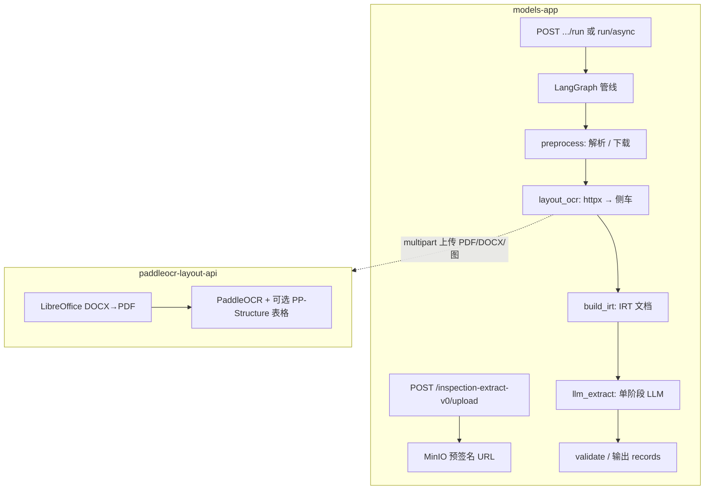

# 企业级检修报告结构化提取 V0 版本实现和使用说明

> 本文档基于当前仓库已实现代码，说明 **检修结构化提取 V0**（`inspection-extract-v0`）：LangGraph 编排、**PaddleOCR 版面侧车**（`paddleocr-layout-deploy/`）、配置、部署与排障。  
> **与现网并存**：现网多阶段链路仍为 **`/inspection-extract/*`**，见 `enterprise-level_transformation_docs/企业级检修报告结构化提取实现和使用说明.md`。  
> **设计对照**：`framework-guide/报告解析企业级实现方案V0.md`。  
> **侧车专项**：`paddleocr-layout-deploy/README.md`、`.env.example`。

---

## 1. 文档目的与范围

| 项 | 说明 |
|----|------|
| **目的** | 说明 V0 能力边界、与侧车的依赖关系、生产环境如何启用与联调、常见故障处理。 |
| **范围** | `app/api/inspection_extract_v0.py`、`app/services/inspection_extract_v0_service.py`、`app/models/inspection_extract_v0.py`、`app/inspection_extract_v0/**`、`app/core/config.py`（`InspectionExtractV0Config`）、`configs/prompts.yaml`（`inspection_extract_v0_extract`）、`paddleocr-layout-deploy/**`、`app/app-deploy/.env.example` 与 `docker-compose.yml` 中侧车网络相关注释。 |
| **不在范围** | 现网 `inspection-extract` 三阶段提示词与阈值细节（见现网企业级文档）；前端页面实现。 |

---

## 2. 与现网（`/inspection-extract`）的关系

| 维度 | 现网 | V0 |
|------|------|-----|
| **HTTP 前缀** | `/inspection-extract` | `/inspection-extract-v0` |
| **LLM** | parse → classify → repair 多阶段 | **单阶段**抽取（`inspection_extract_v0_extract`） |
| **版面/OCR** | 无独立侧车 | **HTTP 调用** `paddleocr-layout-deploy`（`POST /v1/layout-ocr`） |
| **开关** | `INSPECT_EXTRACT_ENABLED` 等 | **`INSPECT_EXTRACT_V0_ENABLED=true`** 且需侧车可达（docx 默认走版面时） |

V0 路由在 `app/main.py` 中**始终挂载**；未开启时业务依赖返回 **503**（避免与 404 混淆），见 `inspection_extract_v0.py` 中 `require_inspection_extract_v0_enabled`。

---

## 3. 架构与数据流（摘要）

- **PDF**：侧车直接 `pdf2image` + OCR（及可选表格）。  
- **DOC/DOCX**：默认 **`INSPECT_EXTRACT_V0_DOCX_USE_LAYOUT_OCR=true`** 时，整文件上传侧车；侧车内 **LibreOffice headless → PDF** 再走 OCR。  
- **关闭 docx 版面**：`INSPECT_EXTRACT_V0_DOCX_USE_LAYOUT_OCR=false` 时，docx 不调用侧车版面分支，IRT 退化为原生文本行模式（与现网 docx 解析思路更接近，但无页面级坐标 OCR）。

---

## 4. 代码与配置映射

| 分层 | 主要路径 | 职责 |
|------|-----------|------|
| API | `app/api/inspection_extract_v0.py` | `upload`、`run`、`run/async`、`jobs/{id}`、`jobs/{id}/chunks*`、`DELETE jobs` |
| 服务 | `app/services/inspection_extract_v0_service.py` | 异步任务、chunk 列表与内容、取消；与现网共用 `INSPECT_EXTRACT_ASYNC_JOBS_DIR`；Redis 队列前缀 **`inspection:extract:v0:jobs`** |
| 模型 | `app/models/inspection_extract_v0.py` | Request/Response/Trace/JobMetrics/Chunk 等 Pydantic 契约 |
| LangGraph | `app/inspection_extract_v0/graph/` | `pipeline.py` 节点：`preprocess`、`layout_ocr`、`build_irt`、`llm_extract` 等 |
| 侧车客户端 | `app/inspection_extract_v0/vision/layout_ocr_client.py` | `httpx` 调用侧车、健康检查、错误映射 |
| 配置 | `app/core/config.py` | `InspectionExtractV0Config` ← `INSPECT_EXTRACT_V0_*` 环境变量 |
| 提示词 | `configs/prompts.yaml` | **`inspection_extract_v0_extract`** |

---

## 5. `paddleocr-layout-deploy` 部署说明（必读）

侧车为**独立 Compose 工程**，与 `mineru-deploy/` 同级，默认服务名 **`paddleocr-layout-api`**，容器内端口 **8000**，宿主机映射常用 **`8010:8000`**。

### 5.1 编排文件如何选择

| 场景 | Compose / Dockerfile |
|------|------------------------|
| **CPU（推荐先试 / docx 需稳定 LibreOffice）** | `docker-compose.yml` 或 `docker-compose.cpu.yml` + `Dockerfile.cpu`（Debian bookworm，`apt` 安装 `libreoffice-writer-nogui`） |
| **英伟达 GPU** | `docker-compose.gpu.nvidia.yml` + `Dockerfile.gpu.nvidia` |
| **沐曦 MACA GPU** | `docker-compose.gpu.mthreads.yml` + `Dockerfile.gpu.mthreads`（麒麟底镜像；LibreOffice 依赖 yum/EPEL，若未装上会出现 **503 DOCX_TO_PDF_UNAVAILABLE**） |

### 5.2 与主应用 Docker 网络

主应用 `app/app-deploy/docker-compose.yml` 通过 **`PADDLE_LAYOUT_DOCKER_NETWORK`**（默认与侧车 **`PADDLE_LAYOUT_NETWORK_NAME`** 一致，常为 **`paddle-layout-stack`**）加入 **external** 网络。

- **必须**：`INSPECT_EXTRACT_V0_LAYOUT_OCR_ENDPOINT=http://paddleocr-layout-api:8000`（**服务名 + 容器内 8000**），勿写 `127.0.0.1:8010`（容器内无法访问宿主机映射）。  
- 未同网时典型错误：**Name or service not known**。  
- 若尚未部署侧车但需要先起应用栈，可 **`docker network create paddle-layout-stack`** 占位（见 `docker-compose.yml` 头部注释）。

### 5.3 CPU 构建拉取失败（registry mirror）

`Dockerfile.cpu` 与 **`docker-compose*.yml`** 已将 CPU 底镜像**默认**设为 **`docker.m.daocloud.io/library/python:3.11-bookworm`**，避免宿主机将 `docker.io` 劫持到已失效的 **`hub-mirror.c.163.com`** 时无法解析。

请 **`git pull`** 后**勿**在 `.env` 中保留旧的 **`PADDLE_LAYOUT_CPU_BASE_IMAGE=python:3.11-bookworm`**（除非已修复 `daemon.json` 且确认可直连 Docker Hub）。若 DaoCloud 亦不可达，改为贵司 Harbor 等可达全路径。详见 **`paddleocr-layout-deploy/README.md`** 运维表。

---

## 6. 主应用环境变量（`InspectionExtractV0Config`）

以下变量在 **`app/app-deploy/.env.example`** 中有分块注释；生产以 `app/core/config.py` 为准。

| 环境变量 | 作用 |
|----------|------|
| **`INSPECT_EXTRACT_V0_ENABLED`** | `true` 时注册异步 worker 并允许业务；默认未开启则为 503。 |
| **`INSPECT_EXTRACT_V0_LAYOUT_OCR_ENDPOINT`** | 侧车根 URL，如 `http://paddleocr-layout-api:8000`。 |
| **`INSPECT_EXTRACT_V0_LAYOUT_OCR_TIMEOUT_SECONDS`** | 调用侧车超时（秒）。 |
| **`INSPECT_EXTRACT_V0_LAYOUT_OCR_MAX_UPLOAD_MB`** | 上传侧车体积上限，与侧车 `PADDLE_LAYOUT_MAX_UPLOAD_MB` 对齐。 |
| **`INSPECT_EXTRACT_V0_MAX_PDF_PAGES`** | 侧车 `max_pages` 等语义的上限（预处理阶段使用）。 |
| **`INSPECT_EXTRACT_V0_DOCX_USE_LAYOUT_OCR`** | docx 是否走侧车版面 OCR；`false` 时不依赖侧车 LO。 |
| **`INSPECT_EXTRACT_V0_LLM_TABLE_CHUNK_CONCURRENCY`** | 多表时 LLM 分块并行度上限。 |
| **`INSPECT_EXTRACT_V0_LLM_TABLE_CHUNK_MAX_BLOCKS`** | 每表块携带 OCR block 上限。 |
| **`INSPECT_EXTRACT_V0_LANGGRAPH_USE_SQLITE`** | 是否启用 LangGraph Sqlite checkpoint（任务目录下文件）。 |
| **`INSPECT_EXTRACT_V0_ASYNC_QUEUE_WORKERS`** | Redis 启用时 V0 异步消费线程数。 |

LLM 温度、超时、`PROMPT_VERSION`、`MODEL_NAME` 等见同文件 **`INSPECT_EXTRACT_V0_LLM_*`** / **`INSPECT_EXTRACT_V0_PROMPT_VERSION`**。

---

## 7. HTTP 接口约定（与现网镜像）

| 方法 | 路径 | 说明 |
|------|------|------|
| POST | `/inspection-extract-v0/upload` | 上传文件至 MinIO，返回预签名 URL（字段语义对齐现网 upload）。 |
| POST | `/inspection-extract-v0/run` | 同步全流程。 |
| POST | `/inspection-extract-v0/run/async` | 提交异步任务。 |
| GET | `/inspection-extract-v0/jobs/{job_id}` | 查询状态；`include_result=true` 时在 completed 附带结果。 |
| GET | `/inspection-extract-v0/jobs/{job_id}/chunks` | 分块列表（按表多块时）。 |
| GET | `/inspection-extract-v0/jobs/{job_id}/chunks/{work_idx}` | 读取某块 LLM 原始 records。 |
| DELETE | `/inspection-extract-v0/jobs/{job_id}` | 取消任务。 |

调用业务接口需 **`Authorization: Bearer`**（与现网一致的 Service API Key 策略）。

---

## 8. 侧车 OpenAPI 契约（联调）

见 `paddleocr-layout-deploy/README.md` §4：

- **`GET /health`**  
- **`POST /v1/layout-ocr`**：`multipart/form-data` 上传 PDF、DOC/DOCX、图片；Query **`max_pages`**。  
- 响应含 **`blocks`**、**`pages`**、可选 **`tables`**（受 **`PADDLE_LAYOUT_ENABLE_TABLE_STRUCTURE`** 控制）。

---

## 9. 运维与排障

| 现象 | 处理方向 |
|------|-----------|
| 主应用日志 **`layout_ocr_post http=503`**，`DOCX_TO_PDF_UNAVAILABLE` | 侧车内无 **`soffice`**。沐曦麒麟镜像常见：**改 CPU 侧车**或按 `paddleocr-layout-deploy` README §5.2 配置 EPEL/离线 RPM；或主应用 **`INSPECT_EXTRACT_V0_DOCX_USE_LAYOUT_OCR=false`**。 |
| **`Name or service not known`**（paddleocr-layout-api） | 检查 **`PADDLE_LAYOUT_DOCKER_NETWORK`** 与侧车 **`PADDLE_LAYOUT_NETWORK_NAME`** 是否同名且 **`models-app` 已加入该 external 网络**。 |
| **`INSPECT_EXTRACT_V0_ENABLED` 503** | 将开关设为 `true` 并**重启**应用容器（异步 worker 在启动期初始化）。 |
| **`Network paddle-layout-stack is still in use`** | 仍有容器连接该网络（例如主应用）。先停依赖栈或保留网络再起侧车。 |

指标与日志键建议带前缀 **`inspection_extract_v0`** / **`inspect_extract_v0_*`**（与 `app/core/metrics.py` 中实际注册名一致者可从代码检索）。

---

## 10. 企业级验收建议（V0）

1. **侧车**：`curl http://<host>:8010/health` 与一次小 PDF **`/v1/layout-ocr`** 成功。  
2. **网络**：`models-app` 容器内 `curl -sS http://paddleocr-layout-api:8000/health` 成功。  
3. **主应用**：`INSPECT_EXTRACT_V0_ENABLED=true`，`upload` → `run/async` → `GET jobs` 闭环；docx/pdf 各至少一例样本。  
4. **降级**：验证 **`INSPECT_EXTRACT_V0_DOCX_USE_LAYOUT_OCR=false`** 时 docx 在无 LO 环境仍可完成（能力降级为文本 IRT，需产品知情）。  
5. **并发与资源**：异步 worker 数、侧车 CPU/内存、`max_pages` 与超时对齐压测结论。

---

## 11. 结论

检修结构化 **V0** 在仓库内已具备 **独立 API、LangGraph 编排、HTTP 版面侧车、异步任务与 chunk 观测** 等能力；生产落地关键是 **`paddleocr-layout-deploy` 与 `models-app` 同网**、**侧车镜像与 DOCX 转换链（LibreOffice）在现场可用**，以及 **`INSPECT_EXTRACT_V0_*` 与侧车 `PADDLE_LAYOUT_*` 成对调优**。现网 **`/inspection-extract`** 仍为默认主链路，V0 适合灰度与对照评测。
