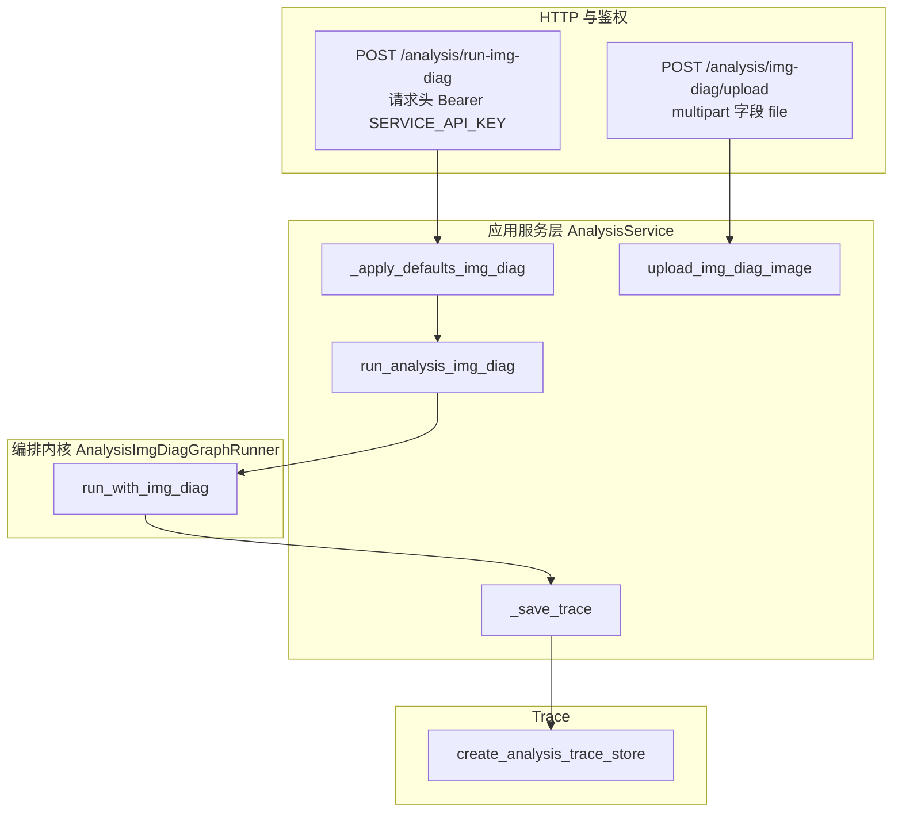
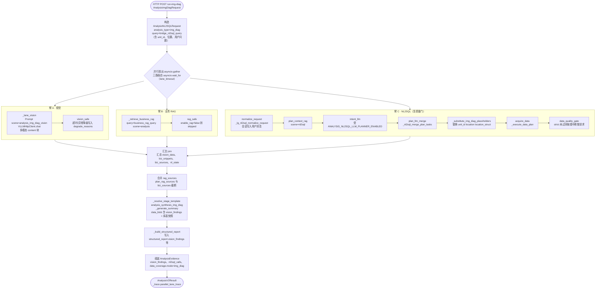
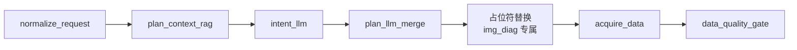
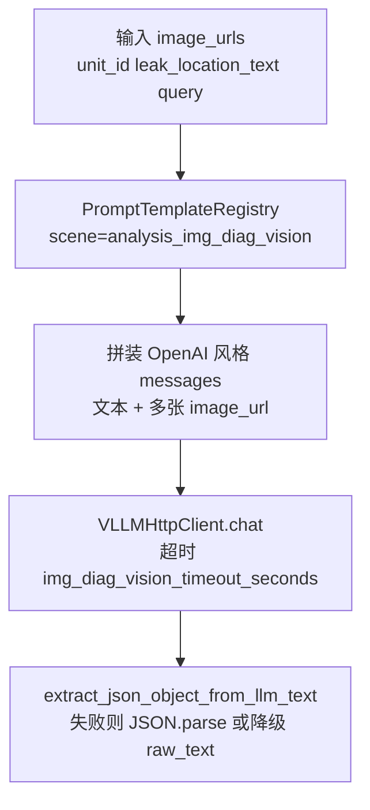
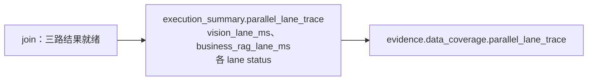

# 企业级综合分析 · 看图诊断实现和使用说明

> 本文档基于当前仓库已实现代码，对「综合分析 · 看图诊断（**analysis_type / data_mode：`img_diag`**）」进行企业级对照：**接口**、**并行编排语义**、**RAG 双通道**、**提示词与环境变量**、**Trace 与运维**。  
> 对照设计与方案：`framework-guide/综合分析-看图诊断实现方案.md`；综合分析总览：`enterprise-level_transformation_docs/企业级综合分析实现和使用说明.md`、`framework-guide/综合分析整体实现技术说明.md`。

---

## 1. 文档目的与范围

| 项 | 说明 |
|---|---|
| **目的** | 给出看图诊断的**概览结论**、与现有 payload/nl2sql 的关系；提供**分层逻辑图**（含与 LangGraph **fan-out / join** 语义对齐的详细视图），便于架构评审与运维排障。 |
| **范围** | `app/api/analysis.py`（`/analysis/run-img-diag`、`/analysis/img-diag/upload`）、`app/services/analysis_service.py`、`app/services/analysis_img_diag_upload.py`、`app/llm/graphs/analysis_img_diag_runner.py`（继承 `AnalysisGraphRunner`）、`app/models/analysis.py`（`AnalysisImgDiagRequest`、`img_diag` 枚举）、`configs/prompts.yaml`（`analysis_plan_img_diag`、`analysis_*_img_diag`、`analysis_img_diag_vision`）、`app/core/config.py`（`AnalysisConfig.img_diag_*`）。 |
| **不在范围** | 前端相册组件、相机 SDK、推理网关之外的权限模型；多模态推理服务的机型选型与非功能性压测矩阵（仅给出依赖说明）。 |

---

## 2. 概总（执行摘要）

1. **业务定位**：检修人员在停机场景上传**现场照片**，录入 **机组 ID（`unit_id`）**、**泄漏/拍照位置（`leak_location_text`）** 与自然语言 **提问（`query`）**，系统输出「可能原因 / 证据链 / 检查与处置建议 / 免责声明」等结构化叙事（由合成提示词约束章节）。
2. **分析类型**：`analysis_type` 与 Trace 中的 **`data_mode` 均为 `img_diag`**（与 `payload`、`nl2sql` 并列）；运维列表、统计、趋势接口可按 `analysis_type=img_diag` 或 `data_mode=img_diag` 过滤（趋势聚合已包含 `img_diag` 计数）。
3. **编排形态（重要）**：看图诊断 **未单独编译第三套 LangGraph `StateGraph`**；运行时由 **`AnalysisImgDiagGraphRunner.run_with_img_diag`** 使用 **`asyncio.gather`** 实现 **三路并行**，再在 **单一栅栏（逻辑 join）** 之后执行 **`_generate_summary`（合成）** 与 **`AnalysisV2Result` 组装**。NL2SQL 子链路内部仍 **复用** 父类 **`AnalysisGraphRunner`** 的 nl2sql **节点级异步函数**（与 nl2sql 主图的 `normalize_request` → … → `data_quality_gate` **同源**）。  
   - Trace 中标记：`execution_summary.orchestrator = asyncio_gather_parallel`，`graph_nodes` 含 `parallel_vision_nl2sql_rag`、`synthesis`、`finalize` 等摘要节点。
4. **并行前提**：NL2SQL 计划与取数 **不依赖** 视觉输出；业务向 RAG 检索语句 **仅由**「用户问题 + 机组 ID + 位置」构造（见 `business_rag_query`），从而避免与视觉分支形成依赖环。
5. **RAG 分层**：  
   - **规划向**：仍在 **NL2SQL 臂** 内的 **`plan_context_rag`**（`scene=nl2sql`，与通用 nl2sql 分析一致）。  
   - **业务向**：独立并行臂 **`rag_safe`**（`scene=analysis`，与 `_retrieve_business_rag` 一致）；**不与** nl2sql 臂尾部的 **`rag_enrichment`** 节点混跑（看图诊断路径 **跳过** 该 nl2sql 图节点，避免重复检索）。
6. **数据计划**：优先 **`configs/prompts.yaml`** 场景 **`analysis_plan_img_diag`**（JSON 数组）；占位符 **`{unit_id}`、`{location}`、`{location_struct}`** 在 **`plan_llm` 合并之后、`acquire_data` 之前** 由 **`_substitute_img_diag_placeholders`** 替换。可选 **`ANALYSIS_NL2SQL_LLM_PLANNER_ENABLED`** 与模板合并逻辑与通用 nl2sql 一致。
7. **多模态依赖**：视觉臂调用 **`VLLMHttpClient.chat`**，消息体含 **`image_url`** 块；需后端推理服务 **OpenAI 兼容** 且支持视觉模型（可通过 **`ANALYSIS_IMG_DIAG_VISION_MODEL`** 指定，未配置则走默认模型配置）。
8. **上传**：**独立于** 检修文档 **`/inspection-extract/upload`**；使用 **`/analysis/img-diag/upload`**，对象前缀 **`analysis_img_diag/`**，MinIO 连接与 bucket 默认 **复用智能客服图片配置（`CHATBOT_IMAGE_MINIO_*`）**。

---

## 3. 实现分层与代码映射

| 分层 | 主要文件 | 关键职责 |
|---|---|---|
| HTTP | `app/api/analysis.py` | `POST /analysis/run-img-diag`、`POST /analysis/img-diag/upload`；鉴权与其它 `/analysis/*` 一致。 |
| 服务层 | `app/services/analysis_service.py` | `_apply_defaults_img_diag`、`run_analysis_img_diag`、`upload_img_diag_image`；**Runner 实例类型**为 **`AnalysisImgDiagGraphRunner`**（兼容原有 `run_with_payload` / `run_with_nl2sql`）。 |
| 上传 | `app/services/analysis_img_diag_upload.py` | 校验大小/MIME、`validate_img_diag_upload`、`upload_analysis_img_diag_image`。 |
| 编排 | `app/llm/graphs/analysis_img_diag_runner.py` | **`run_with_img_diag`**：三路并行 + 合成 + evidence/trace；**桥接 NL2SQL 问题**、**业务 RAG query**、**计划占位符替换**、**`_lane_vision`**。 |
| 父类复用 | `app/llm/graphs/analysis_graph_runner.py` | `_lg_nl2sql_normalize_request`、`_lg_nl2sql_plan_context_rag`、`_lg_nl2sql_intent_llm`、`_lg_nl2sql_plan_llm_merge`、`_substitute_img_diag_placeholders` 调用点之后的 **`_lg_nl2sql_acquire_data`**、`_lg_nl2sql_data_quality_gate`；`_retrieve_business_rag`、`_generate_summary`、`_build_structured_report`、`_resolve_stage_template` 等。 |
| 模型 | `app/models/analysis.py` | **`AnalysisImgDiagRequest`**、**`AnalysisType`/`DataMode` 含 `img_diag`**、**`AnalysisEvidence.vision_findings`**。 |
| 提示词 | `configs/prompts.yaml` | 见下文第 6 节场景表。 |
| 配置 | `app/core/config.py` | **`img_diag_vision_model`、`img_diag_vision_timeout_seconds`、`img_diag_lane_timeout_seconds`、`img_diag_upload_max_mb`**。 |

---

## 4. 编排与 LangGraph 语义对齐的逻辑图

下图便于与 LangGraph 概念对照：**并行扇出（fan-out）→ 栅栏汇合（barrier/join）→ 顺序合成**。实现上为 **`asyncio.gather`**，而非单独 `compile(StateGraph)`；语义上与「多入边汇入同一节点」等价。

### 4.1 从 HTTP 到 Runner（服务边界）



### 4.2 看图诊断 · 顶层并行与汇合（与企业方案一致）



**端到端耗时（理想）**：近似 **`max(T_视觉, T_NL2SQL臂, T_业务RAG) + T_合成`**；各臂超时见 **`ANALYSIS_IMG_DIAG_LANE_TIMEOUT_SECONDS`**（视觉另有 **`ANALYSIS_IMG_DIAG_VISION_TIMEOUT_SECONDS`** 作用于单次 chat）。

### 4.3 NL2SQL 臂展开（与通用 nl2sql 图同源片段）

下图仅描述 **看图诊断路径中实际执行的 nl2sql 子序列**（**不包含** nl2sql 主图尾部的 **`rag_enrichment` → synthesis**，业务 RAG 已在并行臂完成）。



### 4.4 视觉臂（单节点语义）



### 4.5 业务 RAG 臂（单节点语义）


### 4.6 汇合后与 Trace 草稿字段



---

## 5. 接口使用说明

### 5.1 上传图片

- **路径**：`POST /analysis/img-diag/upload`  
- **请求**：`multipart/form-data`，字段 **`file`**  
- **约束**：jpeg / png / webp；大小默认上限见 **`ANALYSIS_IMG_DIAG_UPLOAD_MAX_MB`**  
- **响应**：与检修上传一致的 **`InspectionUploadResponse`**（`url`、`object_name`、`bucket` 等），客户端将 **`url`** 填入 **`run-img-diag` 的 `image_urls`**。

### 5.2 执行看图诊断

- **路径**：`POST /analysis/run-img-diag`  
- **请求体**：**`AnalysisImgDiagRequest`**  
  - **必填**：`user_id`、`session_id`、`unit_id`、`leak_location_text`、`query`、`image_urls`（至少一条 URL）  
  - **可选**：`leak_location_struct`（结构化位置，参与 **`{location_struct}`** 替换）、`data_requirements_hint`、`options`（与综合分析共用 **`AnalysisOptions`**；**`enable_rag`** 默认 **true**，显式 **`false`** 可关闭业务 RAG 臂）  
- **响应**：**`AnalysisV2Result`**  
  - **`evidence.data_coverage.mode`**：`img_diag`  
  - **`evidence.vision_findings`**：视觉 JSON（或降级错误字段）  
  - **`structured_report`**：含 **`vision_findings`、`unit_id`、`leak_location_text`** 及通用 **`sections/suggestions/...`**  
  - **`trace.execution_summary`**：含 **`parallel_lane_trace`、`orchestrator=asyncio_gather_parallel`**  

**请求示例（节选）**

```json
{
  "user_id": "user_001",
  "session_id": "sess_001",
  "unit_id": "UNIT-02",
  "leak_location_text": "#2炉高温过热器B侧第4排",
  "leak_location_struct": {"炉": "#2", "受热面": "高温过热器", "侧": "B", "排": "4"},
  "query": "结合这个位置和照片，分析爆管原因是什么？",
  "image_urls": ["https://minio.example/presigned/analysis_img_diag/xxx.jpg"],
  "options": {
    "enable_rag": true,
    "strict": false,
    "max_nl2sql_calls": 6
  }
}
```

---

## 6. 提示词与数据计划（configs/prompts.yaml）

| 场景键（顶级键） | 用途 |
|---|---|
| **`analysis_plan_img_diag`** | NL2SQL 数据计划 JSON；支持 **`{unit_id}`、`{location}`、`{location_struct}`**。 |
| **`analysis_img_diag_vision`** | 视觉专用指令；要求输出 **可解析 JSON**（代码侧容错抽取）。 |
| **`analysis_intent_img_diag`** | 可选意图 LLM（与 **`ANALYSIS_NL2SQL_LLM_PLANNER_ENABLED`** 联动）。 |
| **`analysis_data_plan_img_diag`** | 可选数据计划 LLM 辅助文案。 |
| **`analysis_synthesis_img_diag`** | 合成阶段 system 模板（区分图像可见 / 库表 / RAG）。 |
| **`analysis_report_img_diag`** | 报告章节约束与版本追踪。 |

阶段解析优先级仍为：**`<stage>_img_diag` → `<stage>` → `analysis`**（由 **`AnalysisGraphRunner._resolve_stage_template`** 实现）。

---

## 7. 环境变量（与 app/app-deploy/.env.example 对齐）

| 变量 | 含义 |
|---|---|
| **`ANALYSIS_IMG_DIAG_VISION_MODEL`** | 视觉推理模型名；空则走默认模型配置。 |
| **`ANALYSIS_IMG_DIAG_VISION_TIMEOUT_SECONDS`** | 单次视觉 chat 超时（秒）。 |
| **`ANALYSIS_IMG_DIAG_LANE_TIMEOUT_SECONDS`** | 每一并行臂的外层 **`wait_for`** 上限（秒）。 |
| **`ANALYSIS_IMG_DIAG_UPLOAD_MAX_MB`** | 上传单文件大小上限（MB）。 |
| **`CHATBOT_IMAGE_MINIO_*`** | MinIO 连接、bucket、预签名 TTL（上传复用）。 |
| **`ANALYSIS_NL2SQL_LLM_PLANNER_ENABLED`** | 是否启用意图/计划 LLM（与 nl2sql 共用）。 |
| **`ANALYSIS_SYNTHESIS_TIMEOUT_SECONDS`** | 合成 **`_generate_summary`** 超时（与综合分析共用）。 |
| **`ANALYSIS_TRACE_*`** | Trace 归档与运维查询（看图诊断写入同一套存储）。 |

---

## 8. 运维与可观测性

1. **指标**：**`analysis_requests_total`** 上 **`analysis_type=img_diag`、`data_mode=img_diag`**；节点耗时仍以 nl2sql 子调用打点为主，并行臂耗时见于 **`parallel_lane_trace`**。  
2. **Trace**：**`GET /analysis/traces/{request_id}`** 等与现有综合分析一致；筛选 **`analysis_type=img_diag`**。  
3. **趋势**：**`GET /analysis/traces/trend`** 的 **`by_data_mode`** 中含 **`img_diag`** 计数（若存储结果中 **`data_coverage.mode`** 为 **`img_diag`**）。  

---

## 9. 已知限制与生产注意事项

1. **Strict 模式**：**`data_quality_gate`** 未通过时仍会 **`ValueError`**，导致 **整请求失败**（与 nl2sql 主链路一致）；并行臂已完成的工作不会回写入客户端重试链路，需在客户端或网关做重试策略。  
2. **视觉失败**：默认 **降级**（臂内捕获），合成仍可执行；**`evidence.vision_findings`** 可能含 **`vision_lane_error`**。  
3. **NL2SQL 臂超时**：返回 **空取数 + 告警**，合成依赖字段缺失时须在提示词侧强调勿编造数值。  
4. **合规**：上传接口需在网关侧叠加病毒扫描、审计日志与用户授权策略（本模块仅做格式与大小校验）。  

---

**文档版本**：与仓库实现同步；若将看图诊断 **编译为独立 LangGraph StateGraph**，可在本节 4 替换实现描述并追加 **`compile(checkpointer=…)`** 示意图，语义仍建议保持与本节 **fan-out / join** 一致。
