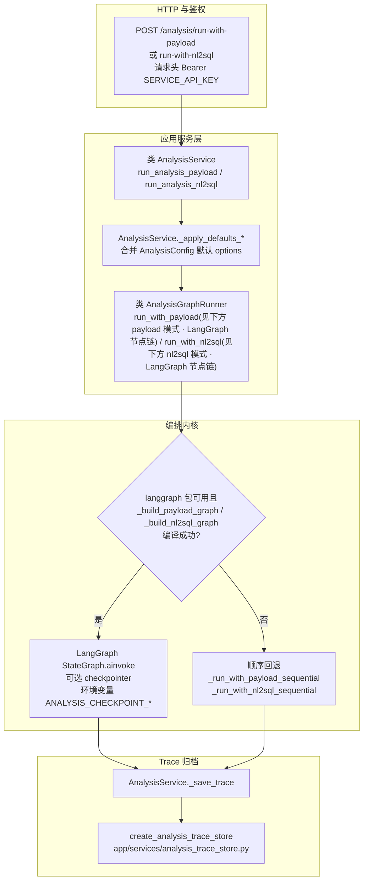
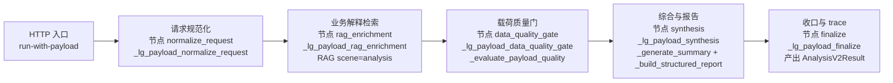
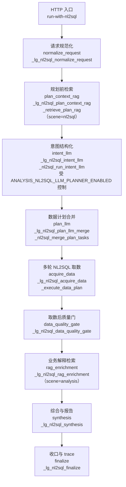
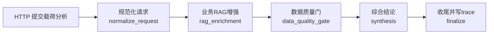
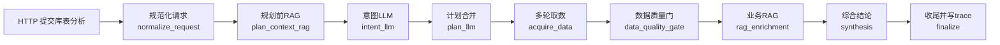
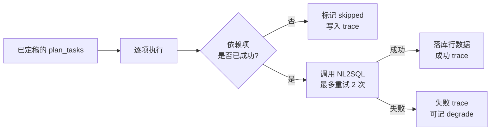
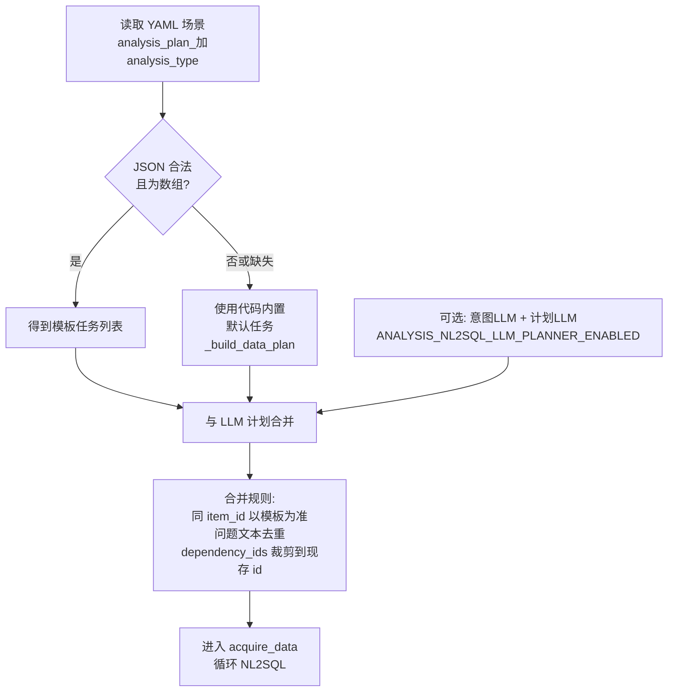
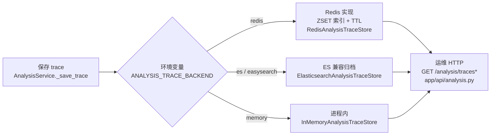

# 企业级综合分析实现和使用说明

> 本文档基于当前仓库已实现代码，对“综合分析（analysis）”进行企业级实现对照、业务流程梳理、使用与配置说明。  
> 对照主设计文档：`framework-guide/综合分析整体实现技术说明.md`。  
> 参考写法：`enterprise-level_transformation_docs/企业级NL2SQL实现方案.md`。

---

## 1. 文档目的与范围

| 项 | 说明 |
|---|---|
| 目的 | 说明当前综合分析实现“做到哪里、是否符合企业级要求、已知限制与待收口项”；含 **LangGraph 编排逻辑图**、**接口用法**、**`configs/prompts.yaml` 提示词配置**及 **与 `.env.example` 对照的环境变量**说明。 |
| 范围 | `app/api/analysis.py`、`app/services/analysis_service.py`、`app/llm/graphs/analysis_graph_runner.py`、`app/llm/graphs/analysis_graph_state.py`、`app/models/analysis_nl2sql_llm.py`、`app/services/analysis_trace_store.py`、`app/models/analysis.py`、`app/core/config.py`、`app/core/metrics.py`。 |
| 不在范围 | 前端报告渲染实现、第三方 BI 看板落地、外部权限网关配置。 |

---

## 2. 对照检查结论（先给结论）

### 2.1 是否按主文档实现

结论：**核心链路已实现，且 Phase 3 产品化能力已基本落地；编排层已使用 LangGraph `StateGraph`（两套图：payload / nl2sql）。**

已对齐项：
1. 双入口接口：`/analysis/run-with-payload`、`/analysis/run-with-nl2sql` 已落地。
2. **编排内核**：`AnalysisGraphRunner` 内 **`langgraph.StateGraph`** 编译执行；`langgraph` 不可用时 **顺序回退** 同一套异步节点，并在 `execution_summary.graph_orchestrator` 中区分。
3. **NL2SQL 计划**：`plan_context_rag` → 可选 **`intent_llm` / `plan_llm`**（`ANALYSIS_NL2SQL_LLM_PLANNER_ENABLED`）→ 与 `analysis_plan_*` 模板 **合并** → `acquire_data`；依赖、重试、跳过与 trace 已落地。
4. **RAG 双通道**：规划前检索走 `nl2sql_*` 命名空间 + **`scene=nl2sql`**（`plan_context` / `plan_rag_sources`）；业务解释走 **`scene=analysis`**（`context_snippets`）。
5. 结构化报告：`sections/tables/charts/suggestions/risks` 已输出；**`analysis_report` 提示词**仍用于版本追踪，结构化报告主要在 **`synthesis` 阶段** 生成（非独立 LLM 图节点）。
6. **检查点（可选）**：`ANALYSIS_CHECKPOINT_BACKEND=memory|redis` 时 `compile(checkpointer=…)`，`thread_id` 默认 `session_id`。
7. Trace 产品化：持久化（**Redis / ES·EasySearch 兼容归档 / 内存回退**）、列表筛选、统计、趋势、降级 TopN、缓存与监控已落地。
8. 平台共用框架：配置中心、会话管理、日志、Prometheus 指标均已接入。

### 2.2 是否达到企业级生产要求

结论：**达到“可生产试运行（Beta）”水位；GA 前主要剩联调深度与测试矩阵，而非“未图化”类架构缺口。**

已达标能力（生产关键）：
1. 鉴权与 API 契约稳定（沿用统一鉴权框架）。
2. 可观测性与审计链路完整（请求/节点/NL2SQL/降级/trace 查询指标；`execution_summary.graph_nodes` 可还原节点顺序）。
3. 异常降级路径明确（strict、重试、失败可追踪；LLM 计划解析失败时降级并写入 `planner_warnings`）。
4. 配置项集中化（`AnalysisConfig` + env）。
5. 数据面与控制面分离（analysis 逻辑与 trace 存储/检索分层）。

待收口能力（GA 前建议完成）：
1. 端到端集成测试覆盖仍可加强（当前以单测 + mock 为主；含真实 EasySearch/Redis 的联调用例建议纳入发布门禁）。

### 2.3 已知限制与残留风险

1. **`AnalysisEvidence.rag_sources`**：`doc_id` / `score` 仍受底层向量索引元数据完整度影响（索引侧未写入时可能为空或粗粒度）。  
2. **环境依赖**：开发机若仍为 **Pydantic v1**，`analysis_nl2sql_llm.py` 中 v2 API 可能导入失败——属运行环境约束，生产应按 `requirements` 锁定 v2。  
3. **业务验收**：与真实业务库、真实 EasySearch 集群的**全量联调回归**建议作为上线前验收项单独执行。

---

## 3. 当前实现逻辑总览（代码映射）

| 分层 | 主要文件 | 关键职责 |
|---|---|---|
| API | `app/api/analysis.py` | 暴露双运行入口 + trace 查询/列表/统计/趋势/TopN。 |
| 服务层 | `app/services/analysis_service.py` | 配置默认值注入、调用 runner、trace 持久化与检索、统计聚合与监控打点。 |
| 编排内核 | `app/llm/graphs/analysis_graph_runner.py` | 两套 `StateGraph`（payload / nl2sql）、检查点注入、顺序回退、节点内嵌；含 NL2SQL 计划 RAG、意图/计划 LLM、合并、`acquire_data`、质量门、业务 RAG、`synthesis`、`finalize`。 |
| LLM 计划模型 | `app/models/analysis_nl2sql_llm.py` | 意图/数据计划 JSON 的 Pydantic 模型与文本中 JSON 抽取。 |
| 状态定义 | `app/llm/graphs/analysis_graph_state.py` | `AnalysisGraphState` TypedDict（文档化）；运行态为 **dict** 合并更新。 |
| 持久化 | `app/services/analysis_trace_store.py` | **Redis**（ZSET 索引 + TTL）、**ES/EasySearch 归档**（`ElasticsearchAnalysisTraceStore`，与 RAG 同客户端连接策略）、**内存**回退；惰性清理（Redis）。 |
| 分析计划扩展 | `configs/prompts.yaml` + `AnalysisGraphRunner` | `analysis_plan_<analysis_type>` JSON 模板驱动 NL2SQL 数据计划，内置计划为回退。 |
| 配置 | `app/core/config.py` | `AnalysisConfig` 及 env 映射。 |
| 指标 | `app/core/metrics.py` | analysis 业务指标 + trace 运维指标。 |

---

## 4. 业务逻辑与 LangGraph 编排（企业视角）

### 4.0 LangGraph 总览：从 HTTP 到 Trace 的决策链

下图概括 **AnalysisService** 与 **AnalysisGraphRunner** 的分工：是否走编译图、顺序回退、以及 trace 写入。节点以中文为主；代码中的类名、方法名、路径写在标签正文内（**不用反引号**），以便 Mermaid 渲染器解析。



**payload 模式 · LangGraph 节点链（与 `analysis_graph_runner._build_payload_graph` 一致）**



**nl2sql 模式 · LangGraph 节点链（与 `analysis_graph_runner._build_nl2sql_graph` 一致）**



### 4.1 端到端主流程（简图，与上图一致）

**payload**



**nl2sql**



### 4.2 NL2SQL 模式：单条计划项的执行（依赖与重试）

实现见 **`AnalysisGraphRunner._execute_data_plan`**。



### 4.3 数据计划：YAML 模板 + 可选 LLM 合并

实现见 **`_build_data_plan_from_template`**、**`_nl2sql_merge_plan_tasks`**、**`_merge_nl2sql_template_and_llm_tasks`**；提示词键名见 **`configs/prompts.yaml`** 头部说明。



### 4.4 Trace 持久化与运维查询

实现见 **`AnalysisService._save_trace`**、**`create_analysis_trace_store`**；后端由 **`ANALYSIS_TRACE_BACKEND`** 选择。



**EasySearch 兼容性说明（与 RAG 对齐）**：

- RAG 向量库将 `RAG_VECTOR_STORE_TYPE=es|easysearch` 视为同一类后端，使用官方 `elasticsearch` 客户端连接 **兼容 ES REST API** 的集群（含 EasySearch）。
- Trace 归档实现 **`ElasticsearchAnalysisTraceStore`** 采用与 `ElasticsearchVectorStore._create_client` 相同的连接策略：`hosts`、**7.x 用 `http_auth` / 8.x 用 `basic_auth`**、`api_key` 可选、`verify_certs` 自签名场景可关。
- 索引与查询仅使用 **keyword / long / object(enabled:false)** 等通用 mapping，不依赖向量字段类型差异，因此 **EasySearch 与 Elasticsearch 均可作为归档端**。
- 环境变量：`ANALYSIS_TRACE_ES_*` 优先；未单独配置时可 **回退复用** `RAG_ES_HOSTS`、`RAG_ES_USERNAME`、`RAG_ES_PASSWORD`、`RAG_ES_API_KEY`（与 RAG 共用集群、独立索引名即可）。

---

## 5. 使用说明（接口、提示词与配置）

### 5.1 Payload 模式

请求：
`POST /analysis/run-with-payload`

最小示例：

```json
{
  "user_id": "u_demo",
  "session_id": "s_demo",
  "analysis_type": "overheat_guidance",
  "query": "请分析近期超温原因并给建议",
  "payload": {
    "sensor_points": [{"time": "2026-04-14T00:00:00Z", "temperature": 589.2, "zone": "第3受热面"}]
  },
  "options": {
    "enable_rag": true,
    "strict": false,
    "chart_mode": "auto"
  }
}
```

### 5.2 NL2SQL 模式

请求：
`POST /analysis/run-with-nl2sql`

最小示例：

```json
{
  "user_id": "u_demo",
  "session_id": "s_demo",
  "analysis_type": "maintenance_strategy",
  "query": "请生成检修分级建议",
  "data_requirements_hint": ["壁厚测量", "换管记录", "超温频次"],
  "options": {
    "enable_rag": true,
    "max_nl2sql_calls": 6,
    "max_rows_per_query": 2000,
    "strict": false
  }
}
```

#### 5.2.1 与 `NL2SQLService` 的代码衔接（取数内核）

`run-with-nl2sql` 与 **`POST /nl2sql/query`**、智能客服 `data_query` **共用同一实现类** **`NL2SQLService`**（`app/services/nl2sql_service.py`）：SQL 生成、校验、可选 EXPLAIN、执行失败 refine 等行为由 **NL2SQL 全局环境变量** 统一控制，不因调用方不同而分叉。

- **谁构造请求**：`AnalysisGraphRunner`（`app/llm/graphs/analysis_graph_runner.py`）在 **`_execute_data_plan`** 中为每个计划项构造 **`NL2SQLQueryRequest(user_id=req.user_id, session_id=req.session_id, question=task.question)`**，并调用 **`await self._nl2sql.query(..., record_conversation=False)`**（避免与分析会话落库重复）。  
- **调用次数**：由合并后的 **`plan_tasks`** 与请求体 **`options.max_nl2sql_calls`**（及内置默认）共同约束；单条任务执行失败时 **最多再试 1 次**（实现为每项最多 2 次尝试）。  
- **图节点位置**：LangGraph 路径为 **`acquire_data`** → **`_lg_nl2sql_acquire_data`** → **`_execute_data_plan`**；顺序回退路径在 **`_run_with_nl2sql_sequential`** 中调用同一 **`_execute_data_plan`**。  
- **可观测性**：除 NL2SQL 子系统自带的 `nl2sql_queries_total` 等外，分析侧另有 **`analysis_nl2sql_calls_total`**（见 `app/core/metrics.py` 与本文 **§6**）。  
- **文档交叉**：NL2SQL 三种接入形态的总览见 **`enterprise-level_transformation_docs/企业级NL2SQL实现方案.md`** §2、§4.3。

### 5.3 Trace 与运营接口

1. `GET /analysis/traces/{request_id}`：单次执行回放。  
2. `GET /analysis/traces`：分页 + 多维过滤。  
3. `GET /analysis/traces/stats`：聚合统计。  
4. `GET /analysis/traces/trend`：时间趋势。  
5. `GET /analysis/traces/degrade-topn`：降级原因 TopN。

### 5.4 提示词模板怎么配（`configs/prompts.yaml`）

> 当前综合分析请求入口是在API层(analysis.py中两个接口(请求传入分析数据 和 根据NL2SQL相关提示词模板自动获取数据))，对应两个接口请求中通过analysis_type字段来实现不同分析需求的自动化配置，自动化配置就是通过analysis_type来区分配置的提示词模板中的模板(config/prompt.yaml),提示词模板的配置包括语义分析类模板 和 NL2SQL取数相关模板，具体说明如下：
- 语义分析类模板：配置相关业务逻辑，也就是预制系统提示词
- NL2SQL取数相关模板：要根据实际的业务逻辑配置相关取数据逻辑，比如超温分析，除了需要查询超温表，还要查询可能影响超温的相关联的设备或设施的表的数据

**入口与 `analysis_type`：** 综合分析 HTTP 入口在 **`app/api/analysis.py`**（`run-with-payload` / `run-with-nl2sql`）。请求体中的 **`analysis_type`** 会参与两类匹配：一是 **`_resolve_stage_template`** 下的可选键 **`{stage}_{analysis_type}`**；二是数据计划 JSON 的键 **`analysis_plan_<analysis_type>`**。二者都在 **`configs/prompts.yaml`** 中维护，但职责不同。

---

#### 5.4.1 可以怎样「分大类」理解？

**可以粗分为两大类（便于记忆），但第二类里必须再拆一层：**

| 大类 | 含义（口语） | 在本仓库中的主要落点 |
|------|--------------|------------------------|
| **Ⅰ. 语义 / 分析类 LLM 模板** | 教模型如何理解意图、如何写结论与报告口吻 | `analysis` 兜底 + `analysis_intent` / `analysis_data_plan` / `analysis_synthesis` / `analysis_report`（及可选 `{stage}_{analysis_type}`） |
| **Ⅱ. 与 NL2SQL 取数相关的模板** | 一切「为了从库中取到数据」而配置的内容 | **再拆为**：**(Ⅱ-a)** 多步取数 **任务表 JSON**（`analysis_plan_*`）；**(Ⅱ-b)** 单次问数的 **SQL 生成前缀**（`nl2sql` 段，主链路问数，与综合分析图是不同调用链上的同一 NL2SQL 服务） |

**补充（易混点）：** 向量 **RAG** 的 `scene=nl2sql` / `scene=analysis` 控制的是 **检索 profile**（`RAG_SCENE_*` 环境变量），**不是**再在 `prompts.yaml` 里单独起一套「语义分析 scene」键与 Ⅰ 并列；RAG 与 Ⅰ 是 **检索片段 + LLM 提示** 的配合关系。

---

#### 5.4.2 大类 Ⅰ：语义 / 分析类 LLM 模板（自然语言为主）

1. **文件位置**：默认 **`configs/prompts.yaml`**，由 **`PromptTemplateRegistry`**（`app/llm/prompt_registry.py`）加载；YAML 中**每个顶级键名** = 传给 **`get_template(scene=...)`** 的 **scene**（用于本类 **LLM** 模板）。文件内已有「场景名与代码对齐」长注释，修改前请先读该段。  
2. **解析顺序**（与 **`AnalysisGraphRunner._resolve_stage_template`** 一致）：  
   - 先找 **`{stage}_{analysis_type}`**（例如可按需新增 `analysis_intent_overheat_guidance` 顶级键）；  
   - 再 **`analysis_intent` / `analysis_data_plan` / `analysis_synthesis` / `analysis_report`**；  
   - 最后回退到 **`analysis`** 段。  
3. **`analysis_report`** 主要用于**模板版本与默认文案**；结构化报告主体在 **`synthesis`** 阶段由 **`_build_structured_report`** 生成。

---

#### 5.4.3 大类 Ⅱ-a：NL2SQL「多步取数」数据计划（JSON，不是 SQL 正文）

- **顶级键**：**`analysis_plan_<analysis_type>`**；`analysis_type` 为 `overheat_guidance` | `maintenance_strategy` | `custom`，即 **`analysis_plan_overheat_guidance`**、**`analysis_plan_maintenance_strategy`**、**`analysis_plan_custom`**。  
- **`content`**：必须是 **JSON 数组**；字段与 **`_build_data_plan_from_template`** 一致（`item_id`、`purpose`、`question`、`mandatory`、`dependency_ids` 等）。  
- **生产扩展**多轮任务、依赖关系应**主要改此处**；代码内置默认列表仅在模板缺失或非法时兜底。  
- **与 Ⅰ 的关系**：可与 **`analysis_data_plan` LLM** 输出合并（模板 `item_id` 优先等），见 **`AnalysisGraphRunner._nl2sql_merge_plan_tasks`** 一类逻辑。

---

#### 5.4.4 大类 Ⅱ-b：NL2SQL「主链路」SQL 前缀（单次问数）

- **顶级键**：**`nl2sql`**；由 **`app/nl2sql/chain.py`** 以 **`scene="nl2sql"`** 加载，用于**单条**自然语言 → SQL 的 system 前缀。  
- **与综合分析编排的关系**：综合分析图里 `acquire_data` 会多次调用 NL2SQL 服务，每次仍走该主链路提示词；但**不要**把 **`analysis_plan_*`** 与 **`nl2sql`** 混成同一种模板。  
- **默认版本**：**`NL2SQL_PROMPT_DEFAULT_VERSION`**（见 **`app/app-deploy/.env.example`** 中 NL2SQL 小节）。

---

#### 5.4.5 与 RAG 的衔接（检索侧，多数字在 env）

- **规划前检索**：**`scene=nl2sql`**，调参 **`RAG_SCENE_NL2SQL_*`**。  
- **结论前检索**：**`scene=analysis`**，调参 **`RAG_SCENE_ANALYSIS_*`**。  
- 详见本文 **§6** 与 **`app/app-deploy/.env.example`** 综合分析段 **F 小节**。

### 5.5 环境变量与 `app/app-deploy/.env.example` 对照

部署侧请以 **`app/app-deploy/.env.example`** 中 **「应用进程 · 综合分析 Analysis」**整段为准，已按 **A～G** 分组写明：  
- **A**：接口默认 `options`（`AnalysisService._apply_defaults_*`）；  
- **B**：Trace 归档 `ANALYSIS_TRACE_*`（`create_analysis_trace_store`）；  
- **C**：质量门阈值 `ANALYSIS_PAYLOAD_*` / `ANALYSIS_NL2SQL_*`；  
- **D**：`ANALYSIS_NL2SQL_LLM_PLANNER_ENABLED`；  
- **E**：LangGraph checkpoint `ANALYSIS_CHECKPOINT_*`；  
- **F**：`RAG_SCENE_ANALYSIS_*` / `RAG_SCENE_NL2SQL_*`（非 `ANALYSIS_` 前缀但与综合分析 RAG 强相关）；  
- **G**：提示词文件路径说明、HTTP 鉴权、`NL2SQL_PROMPT_DEFAULT_VERSION` 交叉引用。  

**其它约定**：  
- **`SERVICE_API_KEY`**：所有 `/analysis/*` 与其它 API 一样走 Bearer 鉴权。  
- **`REDIS_URL`**：当 **`ANALYSIS_TRACE_BACKEND=redis`** 时，trace 写入依赖全局 Redis 连接。  
- 更细的**取值范围、代码钳制、关联方法**已在 `.env.example` 表格注释中列出，本文 §6 表格为速查，二者冲突时 **以代码与 `.env.example` 为准**。

---

## 6. 配置说明（企业必读）

以下配置由 **`app/core/config.py`** 的 **`AnalysisConfig`** 管理；**逐项范围与作用说明**已与 **`app/app-deploy/.env.example`**（综合分析 A～G 段）对齐，部署请优先阅读该文件：

| 环境变量 | 默认值 | 作用 |
|---|---|---|
| `ANALYSIS_DEFAULT_REPORT_TEMPLATE` | `standard` | 报告模板默认值 |
| `ANALYSIS_DEFAULT_CHART_MODE` | `auto` | 图表策略 `auto/minimal/off` |
| `ANALYSIS_DEFAULT_REPORT_STYLE` | `standard` | 报告风格 |
| `ANALYSIS_DEFAULT_MAX_NL2SQL_CALLS` | `6` | 单次分析最大 NL2SQL 调用 |
| `ANALYSIS_DEFAULT_MAX_ROWS_PER_QUERY` | `2000` | 每次 NL2SQL 截断行数 |
| `ANALYSIS_DEFAULT_MAX_SUGGESTIONS` | `8` | 建议条数上限 |
| `ANALYSIS_STRICT_BY_DEFAULT` | `false` | 全局 strict 默认开关 |
| `ANALYSIS_TRACE_BACKEND` | `redis` | trace 存储后端：`redis`、`memory`、**`es`**（Elasticsearch 或 EasySearch，REST 兼容）、**`easysearch`**（与 `es` 等价别名） |
| `ANALYSIS_TRACE_TTL_MINUTES` | `1440` | trace TTL（Redis 为 key TTL；ES 归档为逻辑过期字段 `expires_at_ms`，查询时过滤） |
| `ANALYSIS_TRACE_MAX_ITEMS` | `10000` | **仅 Redis** 索引裁剪上限；ES 归档不按该项淘汰，需依赖 ILM/运维或自行清理旧索引 |
| `ANALYSIS_TRACE_TREND_CACHE_TTL_SECONDS` | `30` | 趋势查询缓存 TTL |
| `ANALYSIS_TRACE_LAZY_CLEANUP_BATCH_SIZE` | `200` | 索引惰性清理批量 |
| `ANALYSIS_TRACE_ES_HOSTS` | 回退 `RAG_ES_HOSTS` | **EasySearch**：填 EasySearch 的 HTTPS 地址（逗号分隔多节点）；与 RAG 共用一套集群时可直接沿用 `RAG_ES_HOSTS` |
| `ANALYSIS_TRACE_ES_INDEX` | `analysis_trace_archive` | trace 归档物理索引名（建议与 RAG chunk 索引分离，避免混写） |
| `ANALYSIS_TRACE_ES_VERIFY_CERTS` | `false` | 自签名证书场景与 RAG 一致，通常设为 `false` |
| `ANALYSIS_TRACE_ES_TIMEOUT_SECONDS` | `10` | 请求超时（秒） |
| `ANALYSIS_TRACE_ES_USERNAME` / `ANALYSIS_TRACE_ES_PASSWORD` | 回退 `RAG_ES_*` | Basic 认证；客户端按 ES 主版本自动选择 `http_auth` / `basic_auth`（与 `vector_store.py` 一致） |
| `ANALYSIS_TRACE_ES_API_KEY` | 回退 `RAG_ES_API_KEY` | API Key 认证（与用户名密码二选一） |
| `ANALYSIS_PAYLOAD_TIME_WINDOW_COVERAGE_MIN` | `0.6` | payload 时间窗覆盖率最小阈值 |
| `ANALYSIS_PAYLOAD_ANOMALY_RATE_MAX` | `0.2` | payload 异常值率最大阈值 |
| `ANALYSIS_PAYLOAD_MISSING_KEY_RATE_MAX` | `0.3` | payload 关键字段缺失率最大阈值 |
| `ANALYSIS_NL2SQL_TIME_WINDOW_COVERAGE_MIN` | `0.5` | nl2sql 时间窗覆盖率最小阈值 |
| `ANALYSIS_NL2SQL_ANOMALY_RATE_MAX` | `0.25` | nl2sql 异常值率最大阈值 |
| `ANALYSIS_NL2SQL_MISSING_KEY_RATE_MAX` | `0.35` | nl2sql 关键字段缺失率最大阈值 |
| `ANALYSIS_CHECKPOINT_BACKEND` | `none` | LangGraph 检查点：`none` / `memory` / `redis` |
| `ANALYSIS_CHECKPOINT_REDIS_URL` | 无 | `redis` 后端时 Redis URL |
| `ANALYSIS_CHECKPOINT_NAMESPACE` | `analysis_graph` | 检查点逻辑命名空间 |
| `ANALYSIS_NL2SQL_LLM_PLANNER_ENABLED` | `true` | 是否执行 `intent_llm` / `plan_llm`；`false` 时仅用模板/内置计划 |
| `RAG_SCENE_ANALYSIS_*` | 见 `config` 默认 | 结论前业务 RAG（`scene=analysis`）；键名含 `TOP_K`、`SEMANTIC_TOP_K` 等，见 `.env.example` **F** 与 RAG 小节 |
| `RAG_SCENE_NL2SQL_*` | 见 `config` 默认 | 规划前检索（`scene=nl2sql`）；与上同行 |

---

## 7. 监控与告警（已落地）

关键指标（`app/core/metrics.py`）：
1. `analysis_requests_total`、`analysis_node_latency_seconds`  
2. `analysis_nl2sql_calls_total`、`analysis_degrade_total`  
3. `analysis_trace_queries_total`、`analysis_trace_query_latency_seconds`  
4. `analysis_trace_trend_cache_hits_total`、`analysis_trace_trend_cache_miss_total`、`analysis_trace_trend_cache_invalidate_total`  
5. `analysis_trace_index_cleanup_total`

告警规则文件：
`configs/monitoring/analysis-trace-alert-rules.yml`

---

## 8. 企业级验收清单（建议）

上线前至少完成：
1. Redis 可用性与 TTL 行为验证（含索引惰性清理回归）。  
2. **若启用 ES/EasySearch 归档**：`ANALYSIS_TRACE_ES_INDEX` 独立索引创建成功、`verify_certs` 与凭据与现网 EasySearch 一致、抽样 `GET /analysis/traces` 时间过滤正确。  
3. `payload` 与 `nl2sql` 两模式各 3 条真实业务样例回放。  
4. strict 模式失败场景验证（关键数据缺失时错误与 trace 一致）。  
5. 告警规则灰度观察（先 warning，后再收紧阈值）。  
6. 与业务侧确认 `analysis_type` 模板版本与数据口径（含 `analysis_plan_*` JSON 模板）。

---

## 9. 风险与改进路线（从 Beta 到 GA）

P0（建议优先）：
1. （已完成）`AnalysisGraphRunner` 使用 **LangGraph `StateGraph`**（payload / nl2sql 各一图），并在 `execution_summary.graph_nodes` 中输出节点轨迹；无 `langgraph` 时顺序回退。  
2. （已完成）在 `evidence.rag_sources` 中输出 `namespace/doc_id/score` 证据明细，补齐审计闭环。  
3. （已完成）补充分析链路高价值测试（节点轨迹、RAG 证据、NL2SQL 依赖跳过与降级）；真实沙箱回放数据集已纳入后续运维验收任务。

P1（增强）：
1. （已完成）建议项生成从“摘要截断”升级为结构化多条动作策略（含 `priority/category/owner/eta/trigger/rationale/action`）。  
2. （已完成）细化数据质量规则：新增时间窗覆盖率、异常值率、关键字段缺失率阈值化评估，并在 strict 模式按阈值失败拦截。

P2（扩展）：
1. （已完成）新分析类型模板化扩展：通过 `configs/prompts.yaml` 中 `analysis_plan_<analysis_type>` 模板（JSON 数组）驱动数据计划，无需改 runner 主逻辑。  
2. （已完成）可选接入外部持久化归档（**Elasticsearch / EasySearch**，与 RAG 同协议栈）：`ANALYSIS_TRACE_BACKEND=es` 或 `easysearch` 时，trace 写入并按过滤条件检索归档索引；连接与认证与 `ElasticsearchVectorStore` 对齐（含 7.x `http_auth` / 8.x `basic_auth`）。

---

## 10. 最终结论

当前综合分析实现已经具备企业级核心能力（双入口、**LangGraph 编排**、可选检查点、NL2SQL 多阶段计划、审计、监控、持久化、回放），可进入生产试运行阶段。  
GA 前建议优先：**真实环境联调回归**、**集成测试矩阵补强**，以及按业务确认 `analysis_plan_*` 模板与 LLM 计划合并策略是否满足口径。  
第 9 节中的历史项多数已落地；后续以运维观测与模板治理为主。

