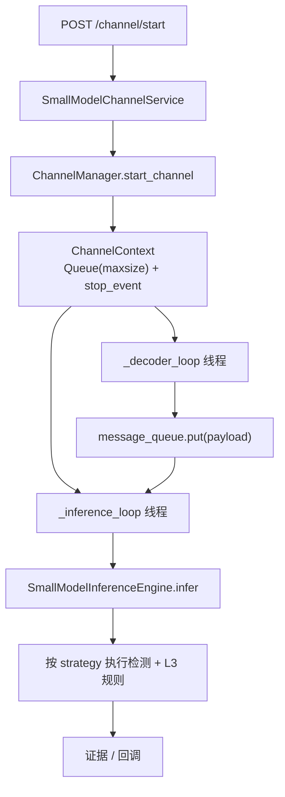

# 小模型应用通道 — 实现策略

本文说明从 **HTTP 接口** 到 **视频解码线程 → 有界队列 → 推理线程 → 算法引擎** 的完整链路，以及与 `algor_type` / YAML 的衔接。实现代码均在当前仓库，无外部「占位服务」。

## 1. 接口入口

| 方法 | 路径 | 作用 |
|------|------|------|
| POST | `/small-model/channel/start` | 启动通道（幂等：已存在则等价 update） |
| POST | `/small-model/channel/stop` | 停止并回收线程 |
| POST | `/small-model/channel/update` | 更新配置；**仅 `queue_size` 变化**时会重启解码/推理线程并换新队列 |
| GET | `/small-model/channel/status` | 查询是否存在、队列积压、`stop_event` 状态 |

路由注册：`app/main.py` → `prefix="/small-model"`，定义见 `app/api/small_model.py`。请求体模型：`app/models/small_model.py` 中 **`SmallModelChannelConfig`**。

## 2. 配置合并（Service → ChannelConfig）

`SmallModelChannelService`（`app/services/small_model_channel_service.py`）将 Pydantic 字段折叠进 **`ChannelConfig.extra_params`**，供推理线程整包作为 **`api_overrides`** 传入引擎：

- 始终合并：`algor_type`、`weights_path`、`callback_url`、`evidence_dir`、`device`、`imgsz`、`conf`、`iou`、`cooldown_seconds`、`clip_seconds`、`roi`（序列化为 dict）、`class_filter`、`complex_mode`、`dwell_*`、`line_cross_line`、`zone_intrusion_polygon`
- **同名字段**：以请求体**顶层**为准覆盖 `extra_params` 内原有键

`ChannelConfig`（`channel_manager.py`）字段：

- `model_name`：指标标签 / 与 `small_models.yaml` 可选关联；**不替代** `algor_type`
- `queue_size`：有界队列容量
- `video_source`：RTSP、文件路径等，**解码线程每轮读取**，支持热切换 URL
- `extra_params`：上述合并结果

## 3. 通道内线程与数据流



- **每通道**一对线程：**单生产者单消费者（SPSC）**，队列线程安全。
- **全局锁** `_objects_lock`：保护 `channel_id → ChannelContext` 映射的创建/删除。
- **通道锁** `channel_lock`：`start` / `update`（含 queue 重建）串行化。

## 4. 解码逻辑（`_decoder_loop`，`workers.py`）

1. 循环读取 **`ctx.config.video_source`**（`update` 后下一轮即生效）。
2. **打开视频**：`cv2.VideoCapture(src)`；仅在 **`cap is None`** 时打开，避免重复创建。源变化时先 **`release`** 再置 `cap = None`。
3. **无有效源**（`None`、空字符串、打不开、无 OpenCV）：**不向队列投递**；每通道约 **60s 打一条 WARNING**，`sleep(0.5)`，避免占位字符串撑满队列或推理空转。
4. **读帧**：`ret, frame = cap.read()`。`frame` 为 **BGR `numpy.ndarray`**（OpenCV 默认）。
5. **断流**：连续失败达到阈值后 **`release`** → 退避睡眠 → **重连**；多次失败则将 `bound_src` 置哨兵，下一循环按新源重新打开。
6. **背压**：`message_queue.put(..., timeout=0.1)`，满则循环重试，解码线程阻塞在 put 上，自然降采样。

**入队 payload 结构**：

```text
{
  "video_source": <str | None>,
  "algor_type": <来自 extra_params，可选>,
  "frame": <numpy BGR 图像>
}
```

## 5. 推理线程与算法逻辑（`_inference_loop` + `infer`）

### 5.1 推理线程

1. `message_queue.get(timeout=0.2)`，空则继续轮询直至 `stop_event`。
2. `api_overrides = dict(ctx.config.extra_params)`，调用  
   `SmallModelInferenceEngine.infer(channel_id, ctx.config.model_name, item, api_overrides=api_overrides)`。
3. 成功后 `SMALL_MODEL_FRAMES_PROCESSED.labels(model_name=...).inc()`。

### 5.2 引擎 `infer`（`inference_engine.py`）

1. 解析 **`algor_type`**：`api_overrides["algor_type"]` → `frame_item["algor_type"]` → 注册表 `task_type`。
2. **`merge_algorithm_config`**：`configs/small_model_algorithms.yaml` 中该键为底，`api_overrides` 覆盖；缺 `algor_type` 时 **打 WARNING 并跳过本帧**（不再抛未处理异常）。
3. **`frame` 校验**：须为 **ndim≥2 的 ndarray**，否则丢弃（兼容无视频时队列为空的情况）。
4. **`_get_strategy(strategy)`**：从 `_STRATEGY_CLASSES` 取类；**单例缓存**（按规范策略名，含 `CallingStrategy` → `RegularBehaviorDetectionStrategy` 别名）。
5. **`strategy.infer(frame, config=strategy_cfg, context={channel_id, algor_type})`**：  
   - L1/L2：`run_yolo_detection_pipeline` → `weights_path` 解析 → `YOLO.predict` → `class_filter` → `roi`  
   - L3：先同一套 YOLO，再按 `complex_mode` 做滞留/绊线/禁区（见 `complex_behavior_detection.py`）。
6. **冷却**：`cooldown_seconds` 内同 `channel_id:algor_type` 抑制重复告警。
7. **触发后**：写证据目录、可选启动短视频片段、`callback_url` POST JSON。

## 6. 生产配置检查清单

- [ ] `video_source` 可达，且运行环境已安装 **opencv-python**
- [ ] `algor_type` 已在 **`small_model_algorithms.yaml`** 配置
- [ ] `weights_path` 指向存在的 `.pt`（或注册表可补全）
- [ ] L3 通道：`complex_mode` 与多边形/线段与分辨率一致（或通过 API 覆盖）
- [ ] 证据目录可写；回调 URL 若配置则需可达

## 7. 相关源码路径

| 组件 | 路径 |
|------|------|
| API | `app/api/small_model.py` |
| Service | `app/services/small_model_channel_service.py` |
| 通道管理 | `app/small_models/channel_manager.py` |
| 解码/推理线程 | `app/small_models/workers.py` |
| 推理引擎 | `app/small_models/inference_engine.py` |
| 请求模型 | `app/models/small_model.py` |

算法策略细节与配置流程图：**`小模型算法策略实现说明.md`**。
