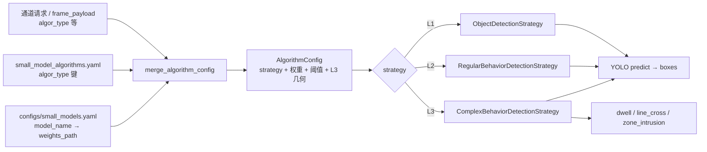

# 小模型算法策略 — 实现说明

## 1. 职责边界

- **策略层**：`app/small_models/strategy/*.py` + `_yolo_utils.py`，统一 **Ultralytics YOLOv8 检测框** 输出；L3 在框上叠加时空规则。
- **配置合并**：`SmallModelInferenceEngine` 将 **`configs/small_model_algorithms.yaml`** 与 **通道/API 覆盖** 合并后选策略类执行。
- **通道层**（解码、队列、推理线程）：见同目录 **`小模型应用通道实现策略.md`**。

## 2. 策略分层（L1 / L2 / L3）

| 层级 | 策略类 | 场景示例 | 配置要点 |
|------|--------|----------|----------|
| L1 | `ObjectDetectionStrategy` | 目标、车辆、PPE 等 | `weights_path`、`class_filter`、`roi` |
| L2 | `RegularBehaviorDetectionStrategy` | 打电话、口罩等（与 L1 同一 YOLO 管线，语义分文件） | 同上，多为自训权重 |
| L3 | `ComplexBehaviorDetectionStrategy` | 滞留、绊线、禁区 | 同上 + `complex_mode` 及对应多边形/线段 |

**未实现（扩展位）**：整图分类、掩码/关键点消费、多目标跟踪、OCR。需新策略类并在 `inference_engine._STRATEGY_CLASSES` 注册。

## 3. 配置解析流程（策略侧）

**覆盖优先级**：请求体顶层字段（经 `SmallModelChannelService` 写入 `extra_params`）> `extra_params` 原内容 > YAML 中该 `algor_type` 默认项。`weights_path` 若未在请求/YAML 中给出，可回退 **`SmallModelRegistry`**（`small_models.yaml`）中 `model_name` 对应项。

**兼容别名**：YAML 中旧名 `CallingStrategy` → 引擎解析为 **`RegularBehaviorDetectionStrategy`**（与 L2 共用单例，避免重复加载权重）。

## 4. 配置文件（明确使用）

| 文件 | 用途 |
|------|------|
| **`configs/small_model_algorithms.yaml`** | **主表**：`algor_type` → `strategy`、`weights_path`、`class_filter`、L3 字段、证据与回调等 |
| `configs/small_models.yaml` | 可选：`model_name` → `weights_path` / `task_type`，供注册表补充 |
| `app/small_models/pretrained/` | 离线 `.pt` 存放目录；说明见 `pretrained/README.md` |

生产通道 **`algor_type` 必填**，且须与 YAML 中某一键一致（如 `40111`、`40417`）。

## 5. 已知限制

- L3 **绊线 / 滞留** 无真实跟踪 ID，用框中心网格近似，密集场景易误判。
- `dwell_seconds ≤ 0` 时抬到 `0.05`，避免除零。
- L3 状态键含 `channel_id` + `algor_type`，通道 ID 须唯一。

## 6. 测试与代码路径

- 测试：`tests/test_small_models_enterprise.py`
- 引擎：`app/small_models/inference_engine.py`
- 注册：`app/small_models/algorithm_registry.py`

## 7. 依赖

- 推理：`ultralytics`（`requirements-小模型应用.txt`）
- 解码：`opencv-python`（通道线程）
