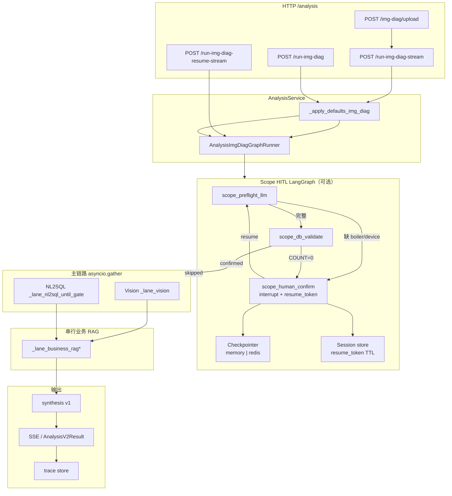
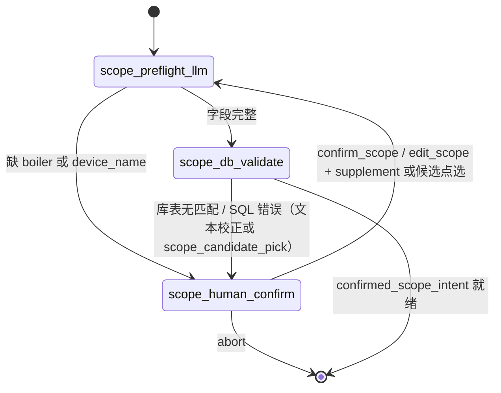
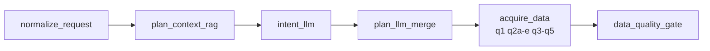
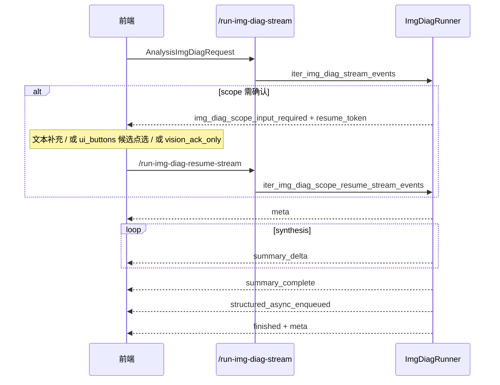

# 看图诊断（缺陷识别 & 泄爆分析）实现和使用说明

> 本文档基于当前仓库已实现代码，对「看图诊断」两大子场景进行企业级对照：**缺陷识别（`img_diag_defect_ident`）** 与 **泄爆分析（`img_diag_leakage_burst`）**。  
> 涵盖关键逻辑、LangGraph / asyncio 编排、核心配置与提示词、HTTP 接口与 SSE 契约、前端 HITL 集成要点。  
> 相关文档：  
> - 通用综合分析基座：`enterprise-level_transformation_docs/企业级综合分析实现和使用说明.md`  
> - 旧版 img_diag 概览（部分字段已演进）：`enterprise-level_transformation_docs/企业级综合分析-看图诊断实现和使用说明.md`  
> - scope HITL 方案：`docs/看图诊断用户问题结构化解析人机协同实现方案.md`  
> - NL2SQL 锚点回溯：`enterprise-level_transformation_docs/NL2SQL当前完整实现逻辑说明-代码对照版.md`  
> - 参考 SQL：`docs/数据库结构及逻辑/img_diag_defect_ident_plan_reference_sql.sql`、`img_diag_leakage_burst_plan_reference_sql.sql`

---

## 1. 文档目的与范围

| 项 | 说明 |
|---|---|
| **目的** | 给出看图诊断两大子场景的**实现全景**、**调用方式**、**配置与提示词清单**，便于研发联调、前端集成与运维排障。 |
| **范围** | `app/api/analysis.py`、`app/services/analysis_service.py`、`app/llm/graphs/analysis_img_diag_runner.py`、`app/llm/graphs/img_diag_scope_*.py`、`app/models/analysis.py`、`configs/prompts.yaml`、`app/core/config.py`（`AnalysisConfig.img_diag_*`）、`tests/web/analysis-img-diag-stream.html`。 |
| **不在范围** | 前端 UI 组件库选型、相机 SDK、vLLM 机型压测、MinIO 集群高可用（仅说明依赖）。 |

---

## 2. 执行摘要

1. **业务定位**：检修/运行人员在停机或事故场景上传现场照片（缺陷识别必填图；泄爆可选图），录入自然语言 **`query`**（承载机组/受热面/管段位置及时间语义），系统输出结构化分析报告（缺陷风险与处置建议，或泄爆溯源五类×三层分析）。
2. **子场景枚举**：请求体字段 **`img_diag_subtype`** 决定分析类型：
   - `defect_ident` → `analysis_type` / `data_mode` = **`img_diag_defect_ident`**
   - `leakage_burst` → `analysis_type` / `data_mode` = **`img_diag_leakage_burst`**
3. **编排形态**：
   - **可选前置**：scope **LangGraph HITL** 子图（确认机组/受热面，库表 existence 校验）
   - **主链路**：**asyncio.gather** 实现 **视觉 ‖ NL2SQL** 并行 → **业务 RAG 串行** → **synthesis**（同步或 SSE 流式）
   - 主链路**未**单独编译第三套 LangGraph；NL2SQL 臂复用父类 `AnalysisGraphRunner` 的节点级异步函数
4. **入参演进**：当前以 **`query` + `image_urls`** 为主；机组/锅炉、受热面、管排等由 NL2SQL 基座 + scope HITL 从 `query` 解析，不再使用旧版 `unit_id` / `leak_location_text` 独立字段。
5. **数据计划**：各子场景独立模板 `analysis_plan_img_diag_{defect_ident|leakage_burst}`，默认 **q1 + q2a～q2e + q3～q5**（9 项）；时间占位符 `@t_start` / `@t_end` 由 NL2SQL 锚点回溯改写（无锚点时可对两子场景启用 `NOW()` 回退）。
6. **持久化**：scope HITL 依赖 LangGraph **checkpointer** + **resume_token** 会话存储；生产多 worker 须 **Redis Stack**（含 RediSearch + RedisJSON），纯 `redis:7-alpine` 会降级 memory。

---

## 3. 两大子场景对照

| 维度 | `defect_ident`（缺陷识别） | `leakage_burst`（泄爆分析） |
|------|---------------------------|------------------------------|
| **图片** | **必填**（≥1 张 `image_urls`） | **可选**（无图时跳过视觉臂） |
| **analysis_type** | `img_diag_defect_ident` | `img_diag_leakage_burst` |
| **视觉提示词** | `analysis_img_diag_vision_defect_ident` | `analysis_img_diag_vision_leakage_burst` |
| **合成侧重** | 缺陷判定、风险等级、分风险处置方案、历史案例 | 泄爆溯源：五大类方向 × 三层逻辑（直接/中期/根因） |
| **业务 RAG 意图** | 缺陷处置、打磨补焊、换管、运行监护 | 泄爆溯源、事故案例、规程条文、防控资料 |
| **时间语义** | plan 含「事故锚点向前3天」；无锚点可走 `anchor_fallback_now` | 同上；**强烈建议** query 含或可解析事故发生时刻 |
| **参考 SQL** | `docs/数据库结构及逻辑/img_diag_defect_ident_plan_reference_sql.sql` | `docs/数据库结构及逻辑/img_diag_leakage_burst_plan_reference_sql.sql` |

---

## 4. 实现分层与代码映射

| 分层 | 主要文件 | 关键职责 |
|------|----------|----------|
| HTTP | `app/api/analysis.py` | 上传、同步运行、流式运行、scope resume 流式 |
| 服务层 | `app/services/analysis_service.py` | 默认值注入、Runner 调度、SSE 编码、trace 持久化 |
| 上传 | `app/services/analysis_img_diag_upload.py` | 图片校验与 MinIO 预签名 URL（前缀 `analysis_img_diag/`） |
| 主编排 | `app/llm/graphs/analysis_img_diag_runner.py` | `AnalysisImgDiagGraphRunner`：HITL 前置 + 并行臂 + 合成 |
| scope HITL | `app/llm/graphs/img_diag_scope_graph.py` | LangGraph 子图：`scope_preflight_llm` → `scope_human_confirm` → `scope_db_validate`；库未匹配多轮后可武装候选点选 |
| scope 辅助 | `img_diag_scope_intent.py`、`img_diag_scope_validate.py`、`img_diag_scope_display.py`、`img_diag_scope_diagnose.py`、`img_diag_scope_candidate_rank.py` | 解析、库表校验、中文展示、失败层诊断、候选 TopK |
| 持久化 | `img_diag_checkpoint.py`、`img_diag_session_store.py`、`langgraph_redis_checkpointer.py` | checkpoint + resume_token |
| 父类复用 | `app/llm/graphs/analysis_graph_runner.py` | NL2SQL 节点、业务 RAG、synthesis、trace |
| NL2SQL | `app/nl2sql/chain.py`、`app/services/nl2sql_service.py` | scope/time 改写、SQL 生成与执行 |
| 模型 | `app/models/analysis.py` | `AnalysisImgDiagRequest`、`ImgDiagScopeResumeRequest`、`AnalysisV2Result` |
| 提示词 | `configs/prompts.yaml` | 见第 8 节 |
| 配置 | `app/core/config.py` | `AnalysisConfig.img_diag_*` |
| 测试页 | `tests/web/analysis-img-diag-stream.html` | 流式 + HITL 联调示例 |

---

## 5. 关键逻辑

### 5.1 端到端阶段

```
[可选] scope HITL（LangGraph）
  → [视觉 ‖ NL2SQL 并行]
  → 业务 RAG（串行，query + 视觉 JSON + 解析范围）
  → synthesis（v1 单次 LLM）
  → finalize / trace / SSE finished
```

### 5.2 scope 人机协同（解析 / 库表 / 候选点选）

**触发条件（`should_trigger_scope_hitl`）**：

| 层级 | 条件 | 行为 |
|------|------|------|
| **L1 解析** | 缺 `boiler` 或 `device_name` | `scope_human_confirm` → LangGraph `interrupt`（文本补充） |
| **L2 库表** | `ANALYSIS_IMG_DIAG_SCOPE_VALIDATE_SQL` COUNT=0 或 SQL 错误 | 再次 interrupt；前几轮为**文本校正** |
| **L2.1 候选点选** | 独立计数 `scope_db_mismatch_rounds` ≥ `CANDIDATE_PICK_AFTER_MISMATCH_ROUNDS`（默认 2）且候选拉取成功 | `hitl_mode=scope_candidate_pick`，下发 `ui_buttons` / `candidates` / `llm_suggestions` |

**子图节点**：

1. **`scope_preflight_llm`**：`parse_img_diag_scope_draft`（规则 + LLM，场景 `img_diag_scope_parse`）
2. **`scope_human_confirm`**：`interrupt` 抛出 HITL payload；用户 resume 后合并 `user_supplement` / `scope_patch` / 候选点选字段
3. **`scope_db_validate`**：账册 existence 校验；通过后产出 `confirmed_scope_intent` + `scope_intent_text`；失败时可走失败层诊断 → 拉候选 → LLM TopK → 武装候选点选

**路由**：

- preflight 缺字段 → human_confirm（文本）
- preflight 完整 → db_validate
- db_validate 通过 → END（进入主并行臂）
- db_validate 失败 → human_confirm（循环，上限 `ANALYSIS_IMG_DIAG_SCOPE_HITL_MAX_ROUNDS`）
- 库未匹配轮次达标且开启候选 → 同一次 interrupt 带 `hitl_mode=scope_candidate_pick`；点选后强制 patch 失败层再校验

**策略说明**：默认 **不** 自动放宽库表条件（`ANALYSIS_IMG_DIAG_SCOPE_AUTO_RELAX_ENABLED=false`）；多轮仍失败时以候选点选为主路径。

**关闭 HITL**：`ANALYSIS_IMG_DIAG_SCOPE_HITL_ENABLED=false` 或 `ANALYSIS_IMG_DIAG_USE_LANGGRAPH=false`。  
**关闭候选点选**：`ANALYSIS_IMG_DIAG_SCOPE_CANDIDATE_PICK_ENABLED=false`（仍保留文本校正 HITL）。

### 5.3 视觉臂（`_lane_vision`）

- 调用 `VLLMHttpClient.chat`，消息含 `image_url` 块
- 模型：`ANALYSIS_IMG_DIAG_VISION_MODEL`（空则走默认 LLM 配置）
- 超时：`ANALYSIS_IMG_DIAG_VISION_TIMEOUT_SECONDS`（默认 120s）
- 泄爆无图时跳过，返回空 `vision_findings`

### 5.4 NL2SQL 臂（`_lane_nl2sql_until_gate`）

复用父类节点链（与通用 nl2sql 分析同源）：

```
normalize_request
  → plan_context_rag（scene=nl2sql，namespaces: nl2sql_schema|biz|qa）
  → intent_llm（analysis_intent_img_diag_*）
  → plan_llm_merge（analysis_data_plan_img_diag_* + analysis_plan_img_diag_* 模板）
  → acquire_data（q1～q5 并行层，NL2SQLService.query）
  → data_quality_gate
```

**scope 注入**：HITL 确认后，NL2SQL 请求携带 `confirmed_scope`、`scope_intent_text`；`parse_mode=human_confirmed`。

**时间窗改写**：

- plan 文案含「事故锚点向前N天」→ NL2SQL 按锚点合成 `@t_start` / `@t_end`
- 无锚点且类型在白名单内 → `NL2SQL_ANCHOR_FALLBACK_NOW_ENABLED` + `NL2SQL_ANCHOR_FALLBACK_ANALYSIS_TYPES` 含 `img_diag_defect_ident,img_diag_leakage_burst` 时，回退为 `[DATE_SUB(NOW(), INTERVAL 3 DAY), NOW())`

**SQL 占位符**（由 NL2SQL 基座改写，禁止 LLM 写死日期）：

| 占位符 | 含义 |
|--------|------|
| `@unit_keyword` | 机组/锅炉关键字 |
| `@device_keyword` | 受热面关键字 |
| `@t_start` / `@t_end` | 时间窗起止 |

### 5.5 业务 RAG 臂

模式由 **`ANALYSIS_IMG_DIAG_RAG_MODE`** 控制：

| 模式 | 行为 |
|------|------|
| `vision_augmented`（默认） | 视觉+NL2SQL 完成后，用「用户 query + 视觉 JSON 摘要 + 解析范围」检索 |
| `hybrid` | 预检 RAG 与视觉‖NL2SQL 并行，再合并增强检索 |
| `parallel` | 仅问题预检 RAG，不含视觉增强 |

检索场景：`scene=analysis`；子场景差异化 rerank 意图见 `_ImgDiagSubtypeProfile`。

### 5.6 synthesis 与输出

- 看图诊断**固定 synthesis v1**（单次 LLM 整篇报告），不受 `ANALYSIS_SYNTHESIS_STRATEGY` 全局 v2 影响
- 模板：`analysis_synthesis_img_diag_{defect_ident|leakage_burst}`（版本见 `ANALYSIS_SYNTHESIS_TEMPLATE_VERSION_IMG_DIAG_*`）
- 结构化报告字段：`sections` / `tables` / `charts` / `suggestions` / `risks`
- Trace：`evidence.vision_findings`、`evidence.nl2sql_calls`、`evidence.rag_citations`、`parsed_scope_intent`、`parsed_time_intent`

---

## 6. LangGraph 与编排链路图

### 6.1 总览：从 HTTP 到 Trace



### 6.2 Scope HITL 子图（LangGraph StateGraph）



### 6.3 NL2SQL 臂内部（复用父类节点，非独立 LangGraph）



### 6.4 流式 SSE 时序



---

## 7. HTTP 接口与请求/响应

**鉴权**：所有接口 `Authorization: Bearer <SERVICE_API_KEY>`。

### 7.1 上传图片

**`POST /analysis/img-diag/upload`**

| 项 | 说明 |
|----|------|
| Content-Type | `multipart/form-data` |
| 字段 | `file`（图片二进制） |
| 限制 | `ANALYSIS_IMG_DIAG_UPLOAD_MAX_MB`（默认 15MB）；MIME 白名单校验 |
| 响应 | `{ "url": "<预签名 URL>", "file_name": "...", ... }` |

### 7.2 看图诊断（同步）

**`POST /analysis/run-img-diag`**

**请求体 `AnalysisImgDiagRequest`：**

```json
{
  "user_id": "u_001",
  "session_id": "s_001",
  "img_diag_subtype": "defect_ident",
  "query": "请识别图片缺陷并给出处置建议，位置是1号锅炉水冷壁螺旋段后墙螺旋管组第56根管",
  "image_urls": ["https://minio/.../photo.jpg"],
  "data_requirements_hint": [],
  "options": {
    "enable_rag": true,
    "strict": false,
    "max_nl2sql_calls": 15,
    "max_rows_per_query": 2000
  }
}
```

| 字段 | 必填 | 说明 |
|------|------|------|
| `user_id` / `session_id` | 是 | 须通过 ID 校验 |
| `img_diag_subtype` | 否 | 默认 `defect_ident` |
| `query` | 是 | 自然语言；承载位置与时间语义 |
| `image_urls` | 条件 | `defect_ident` 至少 1 张；`leakage_burst` 可选 |
| `options` | 否 | 默认 `enable_rag=true` |

**响应 `AnalysisV2Result`（200）** 主要字段：

| 字段 | 说明 |
|------|------|
| `request_id` | 本次分析 ID |
| `analysis_type` | `img_diag_defect_ident` 或 `img_diag_leakage_burst` |
| `summary` | 报告正文（Markdown） |
| `structured_report` | 章节/表/图/建议/风险 |
| `evidence.vision_findings` | 视觉臂 JSON |
| `evidence.nl2sql_calls` | 各 q 项 SQL 与行数 |
| `evidence.rag_citations` | 业务 RAG 引用 |
| `evidence.data_coverage` | 取数覆盖摘要 |
| `trace` | 节点耗时、降级、`parsed_scope_intent`、`parsed_time_intent` |

**scope HITL 中断（409）**：body 同 SSE 事件 `img_diag_scope_input_required` 字段集 + `resume_token`。

### 7.3 看图诊断（流式）

**`POST /analysis/run-img-diag-stream`**

- 请求体：同 §7.2
- 响应：`Content-Type: text/event-stream`；每条 `data: {json}\n\n`
- 完整 `AnalysisV2Result` **不在 SSE 内**；用 `finished.meta.request_id` 调 **`GET /analysis/traces/{request_id}`**

### 7.4 scope 人机协同恢复（流式）

**`POST /analysis/run-img-diag-resume-stream`**

**请求体 `ImgDiagScopeResumeRequest`：**

```json
{
  "resume_token": "<来自 img_diag_scope_input_required>",
  "user_id": "u_001",
  "session_id": "s_001",
  "action": "confirm_scope",
  "payload": {
    "user_supplement": "水冷壁螺旋段后墙螺旋管组"
  }
}
```

| 字段 | 说明 |
|------|------|
| `resume_token` | **必填**；首流或上一轮 HITL 事件返回 |
| `user_id` / `session_id` | **须与首流一致** |
| `action` | `confirm_scope`（默认）\| `edit_scope` \| `abort` |
| `payload.user_supplement` | 自然语言补充，与累计问句合并后重新 LLM 解析 |
| `payload.scope_patch` | 结构化修正（英文字段或中文键）；候选点选时由按钮带回 |
| `payload.candidate_pick_id` / `candidate_pick_value` | `hitl_mode=scope_candidate_pick` 时与 `ui_buttons[].payload` 一致 |
| `payload.image_urls` | 可选，整表替换图片 URL |
| `payload.reason` | `action=abort` 时可选 |

**候选点选请求示例：**

```json
{
  "resume_token": "<token>",
  "user_id": "u_001",
  "session_id": "s_001",
  "action": "confirm_scope",
  "payload": {
    "scope_patch": { "device_name": "水冷壁螺旋段" },
    "candidate_pick_id": "1",
    "candidate_pick_value": "水冷壁螺旋段"
  }
}
```

**响应 SSE**：确认通过后顺序与正常流相同（`meta` → `summary_delta` → … → `finished`）；若仍不通过，再次 `img_diag_scope_input_required`（可能仍为文本校正或再次候选点选）。

### 7.5 前端集成要点（状态机）

1. **首次**始终调 `/run-img-diag-stream`
2. 在同一条 SSE 连接内监听 `event === "img_diag_scope_input_required"`（及可选 `img_diag_vision_preview`）
3. 收到后存 `resume_token`，展示后端 `scope_hitl_assistant_message` / `vision_hitl_assistant_message`
4. 按 `hitl_mode` 分支：
   - 缺省 / 文本校正：输入框 `user_supplement`（和/或换图）
   - `scope_candidate_pick`：渲染 `ui_buttons`，点击后提交按钮自带的 `action` + `payload`
   - `vision_ack_only`：点「继续」或输入确认
5. 未收到 HITL 事件则直接 `meta` → 报告流，无需 resume
6. resume 的 SSE 中可能**再次出现** HITL，重复上述步骤

参考实现：`tests/web/analysis-img-diag-stream.html`。

---

## 8. SSE 事件契约

| event | 何时出现 | 主要字段 |
|-------|----------|----------|
| `img_diag_scope_input_required` | scope 待确认（**可能在 meta 之前**）；确认前流结束 | `resume_token`、`prompt`、`scope_draft`、`scope_draft_display`、`missing_fields`、`validation_error`、`interrupt_reason`、`suggested_actions`；可选 `hitl_mode`、`ui_buttons`；候选态另含 `failed_field`、`failed_field_label`、`matched_prefix`、`user_value`、`candidates`、`llm_suggestions` |
| `meta` | 进入 synthesis 前 | `request_id`、`plan_id`、`analysis_type`、`data_mode`、`img_diag_subtype`、`orchestrator`、`template_versions` |
| `summary_delta` | synthesis 流式片段 | `text` |
| `summary_complete` | synthesis 结束 | `chars`、`synthesis_ms`、`request_id` |
| `structured_async_enqueued` | 后台结构化排队 | `request_id` |
| `finished` | 尾帧 | `finished: true`、`meta`（含 `used_rag`、`rag_citations`、`parsed_scope_intent`、`parsed_time_intent` 等） |

**HITL 事件示例（缺字段 / 文本校正）：**

```json
{
  "event": "img_diag_scope_input_required",
  "request_id": "req_xxx",
  "resume_token": "rt_xxx",
  "prompt": "请补充以下信息：受热面",
  "scope_draft": {
    "boiler": "1号锅炉",
    "device_name": null,
    "check_location_name": null,
    "row_no": null,
    "tube_no": "56"
  },
  "scope_draft_display": {
    "机组": "1号锅炉",
    "受热面": "",
    "检测位置": "",
    "排数": "",
    "管数": "56"
  },
  "missing_fields": ["受热面"],
  "suggested_actions": ["confirm_scope", "edit_scope", "abort"],
  "interrupt_reason": "missing:device_name"
}
```

**HITL 事件示例（候选项点选）：**

```json
{
  "event": "img_diag_scope_input_required",
  "hitl_mode": "scope_candidate_pick",
  "resume_token": "rt_xxx",
  "failed_field": "device_name",
  "failed_field_label": "受热面",
  "matched_prefix": { "boiler": "1号锅炉" },
  "user_value": "水冷壁螺旋段后墙螺旋管组",
  "candidates": [
    { "id": "1", "value": "水冷壁螺旋段", "label": "水冷壁螺旋段" }
  ],
  "llm_suggestions": [
    { "id": "1", "value": "水冷壁螺旋段", "label": "水冷壁螺旋段", "rank": 1 }
  ],
  "ui_buttons": [
    {
      "id": "pick_1",
      "label": "1. 水冷壁螺旋段",
      "variant": "secondary",
      "action": "confirm_scope",
      "payload": {
        "scope_patch": { "device_name": "水冷壁螺旋段" },
        "candidate_pick_id": "1",
        "candidate_pick_value": "水冷壁螺旋段"
      },
      "requires_input": false
    }
  ],
  "suggested_actions": ["confirm_scope", "edit_scope", "abort"]
}
```

---

## 9. 核心配置项

配置定义：`app/core/config.py` → `AnalysisConfig`；示例：`app/app-deploy/.env.example`（「看图诊断独立配置部分」）。

### 9.1 看图诊断专项

| 环境变量 | 默认值 | 说明 |
|----------|--------|------|
| `ANALYSIS_IMG_DIAG_VISION_MODEL` | （空→默认 LLM） | 视觉多模态模型 |
| `ANALYSIS_IMG_DIAG_VISION_TIMEOUT_SECONDS` | 120 | 视觉臂超时（秒） |
| `ANALYSIS_IMG_DIAG_LANE_TIMEOUT_SECONDS` | 180 | 并行臂总超时（秒） |
| `ANALYSIS_IMG_DIAG_UPLOAD_MAX_MB` | 15 | 上传大小上限 |
| `ANALYSIS_IMG_DIAG_RAG_MODE` | `vision_augmented` | `vision_augmented` \| `hybrid` \| `parallel` |
| `ANALYSIS_IMG_DIAG_USE_LANGGRAPH` | true | false 时跳过 scope 子图 |
| `ANALYSIS_IMG_DIAG_SCOPE_HITL_ENABLED` | true | false 时跳过 HITL |
| `ANALYSIS_IMG_DIAG_SCOPE_HITL_MAX_ROUNDS` | 5 | interrupt 循环上限 |
| `ANALYSIS_IMG_DIAG_SCOPE_VALIDATE_SQL` | （内置 COUNT SQL） | 库表 existence 校验；须 `:boiler`、`:device_name` 等占位符 |
| `ANALYSIS_IMG_DIAG_SCOPE_VALIDATE_TIMEOUT_S` | 10 | 校验 SQL 超时 |
| `ANALYSIS_IMG_DIAG_SCOPE_VALIDATE_SKIP_ON_ERROR` | false | true 时校验异常不阻断 |
| `ANALYSIS_IMG_DIAG_SCOPE_AUTO_RELAX_ENABLED` | false | 默认关闭；与候选点选互斥策略，不建议与候选同时作为主路径 |
| `ANALYSIS_IMG_DIAG_SCOPE_CANDIDATE_PICK_ENABLED` | true | 库未匹配多轮后失败层诊断 + 候选 + LLM TopK + 点选 |
| `ANALYSIS_IMG_DIAG_SCOPE_CANDIDATE_PICK_AFTER_MISMATCH_ROUNDS` | 2 | 独立 mismatch 计数达到该值后再进候选 |
| `ANALYSIS_IMG_DIAG_SCOPE_CANDIDATE_LIMIT` | 50 | 候选 SQL LIMIT |
| `ANALYSIS_IMG_DIAG_SCOPE_CANDIDATE_TOP_K` | 5 | LLM 推荐条数（驱动 `ui_buttons`） |
| `ANALYSIS_IMG_DIAG_SCOPE_CANDIDATE_RANK_PROMPT_VERSION` | v1 | `prompts.yaml` scene=`img_diag_scope_candidate_rank` |
| `ANALYSIS_IMG_DIAG_SCOPE_CANDIDATE_RANK_TIMEOUT_S` | 20 | 候选排序 LLM 超时 |
| `ANALYSIS_IMG_DIAG_SCOPE_DIAGNOSE_BOILER_SQL` | （内置） | 机组存在性探测；可覆盖 |
| `ANALYSIS_IMG_DIAG_SCOPE_CANDIDATE_SQL_*` | （内置） | `BOILER`/`DEVICE`/`LOCATION`/`ROW`/`TUBE` 候选列表 SQL，占位符与 VALIDATE 同类 |
| `ANALYSIS_IMG_DIAG_CHECKPOINT_BACKEND` | prod/redis→`redis` | `memory` \| `redis` \| `none` |
| `ANALYSIS_IMG_DIAG_CHECKPOINT_REDIS_URL` | 回落 `REDIS_URL` | LangGraph checkpoint Redis |
| `ANALYSIS_IMG_DIAG_CHECKPOINT_NAMESPACE` | `img_diag` | thread_id 前缀 |
| `ANALYSIS_IMG_DIAG_SESSION_STORE_BACKEND` | 同 checkpoint | resume_token 存储 |
| `ANALYSIS_IMG_DIAG_SESSION_STORE_REDIS_URL` | 回落 `REDIS_URL` | 可与 checkpoint 不同 DB |
| `ANALYSIS_IMG_DIAG_SESSION_TTL_SECONDS` | 3600 | resume_token 过期时间 |

### 9.2 模板版本

| 环境变量 | 默认 | 对应 prompts.yaml |
|----------|------|-------------------|
| `ANALYSIS_PLAN_TEMPLATE_VERSION_IMG_DIAG_DEFECT_IDENT` | v1 | `analysis_plan_img_diag_defect_ident` |
| `ANALYSIS_PLAN_TEMPLATE_VERSION_IMG_DIAG_LEAKAGE_BURST` | v1 | `analysis_plan_img_diag_leakage_burst` |
| `ANALYSIS_SYNTHESIS_TEMPLATE_VERSION_IMG_DIAG_DEFECT_IDENT` | v1 | `analysis_synthesis_img_diag_defect_ident` |
| `ANALYSIS_SYNTHESIS_TEMPLATE_VERSION_IMG_DIAG_LEAKAGE_BURST` | v1 | `analysis_synthesis_img_diag_leakage_burst` |

### 9.3 NL2SQL 时间锚点（与看图诊断强相关）

| 环境变量 | 默认 | 说明 |
|----------|------|------|
| `NL2SQL_ANCHOR_FALLBACK_NOW_ENABLED` | true | 无事故锚点时是否允许 NOW 回退 |
| `NL2SQL_ANCHOR_FALLBACK_ANALYSIS_TYPES` | `img_diag_leakage_burst,img_diag_defect_ident` | 白名单 analysis_type |
| `NL2SQL_REJECT_UNRESOLVED_TIME_PLACEHOLDERS` | true | 拒绝仍含未解析 `@t_start/@t_end` 的 SQL |

### 9.4 Redis Checkpoint 部署要求

`langgraph-checkpoint-redis` 依赖 **RediSearch + RedisJSON**（`FT._LIST`、`FT.CREATE` 等）。  
Compose 默认 `redis:7-alpine` **不含模块**，会日志告警并降级 `MemorySaver`（单 worker 可用，多实例 resume 有风险）。  
生产建议：`redis/redis-stack-server` 或 Redis 8+。

依赖包：`requirements-大模型应用.txt` → `langgraph-checkpoint-redis>=0.4.0`。

---

## 10. 提示词模板清单（`configs/prompts.yaml`）

### 10.1 按子场景（analysis_type 后缀）

| 场景键 | 用途 | 使用阶段 |
|--------|------|----------|
| `analysis_intent_img_diag_defect_ident` | 缺陷识别意图识别 | NL2SQL intent_llm |
| `analysis_data_plan_img_diag_defect_ident` | 缺陷识别取数规划 | plan_llm_merge |
| `analysis_plan_img_diag_defect_ident` | 数据计划 q1～q5 JSON | acquire_data 模板 |
| `analysis_synthesis_img_diag_defect_ident` | 缺陷识别报告合成 | synthesis system |
| `analysis_report_img_diag_defect_ident` | 报告形态约束 | 版本追踪 / 结构化 |
| `analysis_img_diag_vision_defect_ident` | 缺陷识别视觉臂 | `_lane_vision` |
| `analysis_intent_img_diag_leakage_burst` | 泄爆意图识别 | NL2SQL intent_llm |
| `analysis_data_plan_img_diag_leakage_burst` | 泄爆取数规划 | plan_llm_merge |
| `analysis_plan_img_diag_leakage_burst` | 泄爆数据计划 JSON | acquire_data 模板 |
| `analysis_synthesis_img_diag_leakage_burst` | 泄爆报告合成 | synthesis system |
| `analysis_report_img_diag_leakage_burst` | 泄爆报告形态 | 版本追踪 |
| `analysis_img_diag_vision_leakage_burst` | 泄爆视觉臂 | `_lane_vision` |

### 10.2 共用 scope 解析与候选排序

| 场景键 | 用途 |
|--------|------|
| `img_diag_scope_parse` | scope HITL preflight + 看图诊断范围解析 |
| `img_diag_scope_candidate_rank` | 库未匹配候选 TopK 排序（`hitl_mode=scope_candidate_pick`） |

### 10.3 数据计划 item 一览（两子场景结构相同）

| item_id | purpose | mandatory |
|---------|---------|-----------|
| q1 | 管段基础参数（规格、壁厚限值、壁温限值、运行时长） | 是 |
| q2a | 近 3 次壁厚测量 | 是 |
| q2b | 减薄速率 | 是 |
| q2c | 泄爆/泄漏履历（近 50 次） | 是 |
| q2d | 遗留问题 | 是 |
| q2e | 补焊/换管 | 是 |
| q3 | 壁温超温数据 | 是 |
| q4 | 吹灰运行数据 | 否 |
| q5 | 烟气煤质数据 | 否 |

plan 文案统一要求「事故锚点向前3天」+ `@t_start/@t_end` + `@unit_keyword/@device_keyword` 占位符。

---

## 11. 使用示例

### 11.1 缺陷识别（curl 流式）

```bash
# 1. 上传图片（可选，若已有 URL 可跳过）
curl -s -X POST "$BASE/analysis/img-diag/upload" \
  -H "Authorization: Bearer $KEY" \
  -F "file=@defect.jpg"

# 2. 发起流式分析
curl -N -X POST "$BASE/analysis/run-img-diag-stream" \
  -H "Authorization: Bearer $KEY" \
  -H "Content-Type: application/json" \
  -H "Accept: text/event-stream" \
  -d '{
    "user_id": "u_001",
    "session_id": "s_001",
    "img_diag_subtype": "defect_ident",
    "query": "请识别图片缺陷并给出处置建议，位置是1号锅炉水冷壁螺旋段后墙螺旋管组第56根管",
    "image_urls": ["https://minio/bucket/analysis_img_diag/xxx.jpg"]
  }'

# 3. 若收到 img_diag_scope_input_required，续跑（文本校正示例）
curl -N -X POST "$BASE/analysis/run-img-diag-resume-stream" \
  -H "Authorization: Bearer $KEY" \
  -H "Content-Type: application/json" \
  -d '{
    "resume_token": "<token>",
    "user_id": "u_001",
    "session_id": "s_001",
    "action": "confirm_scope",
    "payload": { "user_supplement": "水冷壁螺旋段后墙" }
  }'

# 3b. 若 hitl_mode=scope_candidate_pick，点选续跑（字段与 ui_buttons[].payload 一致）
# curl ... -d '{ "resume_token":"<token>", "user_id":"u_001", "session_id":"s_001",
#   "action":"confirm_scope",
#   "payload":{"scope_patch":{"device_name":"水冷壁螺旋段"},"candidate_pick_id":"1","candidate_pick_value":"水冷壁螺旋段"} }'

# 4. 流结束后拉 trace
curl -s "$BASE/analysis/traces/<request_id>" \
  -H "Authorization: Bearer $KEY"
```

### 11.2 泄爆分析（无图）

```json
{
  "user_id": "u_001",
  "session_id": "s_001",
  "img_diag_subtype": "leakage_burst",
  "query": "1号锅炉低温过热器2024年3月15日14:30发生泄爆，请分析原因",
  "image_urls": []
}
```

建议在 `query` 中提供**可解析的事故时间**，以便 NL2SQL 精确合成 3 天回溯窗；否则走 `anchor_fallback_now`。

### 11.3 本地 Web 联调

浏览器打开 `tests/web/analysis-img-diag-stream.html`，配置 `BASE_URL` 与 `SERVICE_API_KEY`，可完整演练上传 → 首流 → HITL → resume → finished。

---

## 12. 运维与排障

| 现象 | 可能原因 | 处理 |
|------|----------|------|
| 日志 `FT._LIST unknown command` | Redis 无 RediSearch 模块 | 换 Redis Stack / Redis 8+；或开发环境设 `ANALYSIS_IMG_DIAG_CHECKPOINT_BACKEND=memory` |
| HITL 未触发 | `SCOPE_HITL_ENABLED=false` 或 scope 一次解析完整且库表匹配 | 查配置；查 `trace.parsed_scope_intent` |
| 无候选点选（仅文本校正） | `CANDIDATE_PICK_ENABLED=false`、mismatch 轮次未达阈值、或候选 SQL 空结果 | 查 `.env` 与 diagnose/candidate SQL；看日志 `scope candidate pick` |
| NL2SQL 7/9 strict_failed（时间占位符） | 锚点回退未生效或白名单未含子类型 | 确认 `NL2SQL_ANCHOR_FALLBACK_ANALYSIS_TYPES` 含对应 analysis_type 并重启 |
| q2a/d/e 常 0 行 | 3 天窗内无检修记录 | 业务预期或扩展时间策略（需产品/配置变更） |
| 多 worker resume 失败 | checkpoint 降级 memory | checkpoint 与 session store 均用 redis + Redis Stack |
| defect_ident 422 | 未传 `image_urls` | 至少一张图片 URL |

**Trace 查询**：`GET /analysis/traces/{request_id}`、`GET /analysis/traces`（可按 `data_mode=img_diag_defect_ident` 过滤）。

---

## 13. 与旧版文档的差异说明

| 项 | 旧版（`企业级综合分析-看图诊断`） | 当前实现 |
|----|-----------------------------------|----------|
| analysis_type | 单一 `img_diag` | 拆分为 `img_diag_defect_ident` / `img_diag_leakage_burst` |
| 入参 | `unit_id`、`leak_location_text` 等 | **`query` + `image_urls` + `img_diag_subtype`** |
| 前置 | 无 scope HITL | **可选 LangGraph scope HITL** + resume 接口 |
| 计划模板 | `analysis_plan_img_diag` | 分子场景 `analysis_plan_img_diag_*` |
| 并行臂 | 三路（含独立 RAG 预检臂） | 视觉‖NL2SQL + RAG 模式可配置（默认 vision_augmented 串行增强） |

---

## 14. 关键类与入口速查

| 符号 | 位置 |
|------|------|
| `AnalysisImgDiagGraphRunner` | `app/llm/graphs/analysis_img_diag_runner.py` |
| `ImgDiagScopeHitlRunner` | `app/llm/graphs/img_diag_scope_graph.py` |
| `AnalysisImgDiagRequest` | `app/models/analysis.py` |
| `ImgDiagScopeResumeRequest` | `app/models/analysis.py` |
| `run_analysis_img_diag_stream` | `app/services/analysis_service.py` |
| `build_img_diag_checkpointer` | `app/llm/graphs/img_diag_checkpoint.py` |

---

*文档版本：与仓库当前 `img_diag_defect_ident` / `img_diag_leakage_burst` 双.subtype 实现同步。*
