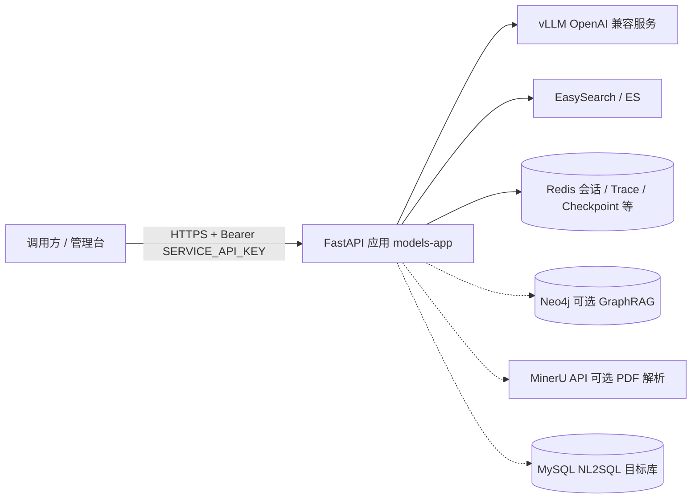
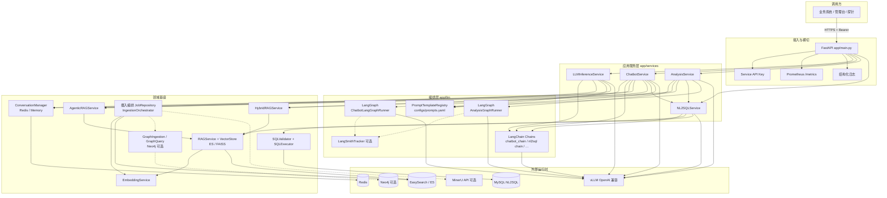

# 系统整体技术架构文档（在线业务）

> **简版**：收拢概括见 [系统整体技术架构文档-简版.md](./系统整体技术架构文档-简版.md)。  
> **定位**：描述本仓库 **大模型在线应用平台** 的整体技术架构——API 接入、应用编排、RAG/会话、NL2SQL、观测与部署依赖。  
> **能力架构总表与逻辑架构图**：见 **§2 能力谱系与技术架构对照**。  
> **范围**：覆盖 `app/main.py` 挂载的 **健康检查、通用推理、智能客服、综合分析、检修报告结构化提取、NL2SQL、RAG 管理** 及公共基础设施。  
> **不包含**：`app/small_models/`、`app/train/`、`app/api/small_model.py`、`app/api/train_admin.py`（前缀 `/small-model`、`/dajia`）所代表的 **小模型通道与训练/管理面**；亦不展开 YOLO/Ultralytics 等离线训练资产。

---

## 0. 统一目录导航页（企业级专项）

> 下列文档为企业级专项实现与使用说明，建议按“总览 -> 业务模块”顺序阅读。

| 类别 | 文档 |
|---|---|
| 总览 | `enterprise-level_transformation_docs/系统整体技术架构文档.md`（本文） |
| 总览（简版） | `enterprise-level_transformation_docs/系统整体技术架构文档-简版.md` |
| 智能客服 | `enterprise-level_transformation_docs/企业级智能客服 LangGraph 框架实现方案.md` |
| 综合分析 | `enterprise-level_transformation_docs/企业级综合分析实现和使用说明.md` |
| 综合分析 · 看图诊断（`img_diag`） | `enterprise-level_transformation_docs/企业级综合分析-看图诊断实现和使用说明.md` |
| 检修报告结构化提取 | `enterprise-level_transformation_docs/企业级检修报告结构化提取实现和使用说明.md` |
| NL2SQL | `enterprise-level_transformation_docs/企业级NL2SQL实现方案.md` |
| NL2SQL 代码对照 | `enterprise-level_transformation_docs/NL2SQL当前完整实现逻辑说明-代码对照版.md` |
| RAG 摄入与检索一体化 | `enterprise-level_transformation_docs/企业级 RAG 文档摄入与检索一体化改造设计稿-20260327.md` |
| 会话管理 | `enterprise-level_transformation_docs/系统会话管理实现方案.md` |

---

## 1. 架构总览

### 1.1 逻辑分层

| 层级 | 职责 | 典型代码位置 |
|------|------|----------------|
| **接入层** | FastAPI 路由、OpenAPI 标签、CORS、`/metrics`、全局异常映射 | `app/main.py`、`app/api/*` |
| **安全横切** | Service API Key（Bearer），业务路由统一依赖注入 | `app/auth/dependencies.py` |
| **应用服务层** | 各业务能力封装，对接会话、RAG、链路与图编排 | `app/services/*_service.py` |
| **编排层** | LangChain 链路、LangGraph 状态机（客服/分析）、Agentic RAG | `app/llm/chains/`、`app/llm/graphs/`、`app/rag/agentic.py` |
| **领域子系统** | NL2SQL（规划/校验/执行骨架）、RAG 摄入与检索、GraphRAG | `app/nl2sql/`、`app/rag/`、`app/graph/` |
| **基础设施** | 统一配置、结构化日志、Prometheus 指标、会话存储 | `app/core/config.py`、`app/core/logging.py`、`app/core/metrics.py`、`app/conversation/` |

### 1.2 外部依赖拓扑（在线）

**说明**：大模型推理默认经 **OpenAI 兼容 HTTP**（`LLM_DEFAULT_ENDPOINT` 等）访问 vLLM；向量与全文检索默认 **ES/EasySearch**；多轮会话与部分运维态数据依赖 **Redis**；GraphRAG 与 Neo4j 可开关；大文档 PDF 可选 **MinerU**；NL2SQL 执行对接 **MySQL**（`DatabaseConfig`，可由环境变量覆盖）。

---

## 2. 能力谱系与技术架构对照（基座 + 业务功能）

本章从「**基座能力**」与「**对外功能（HTTP 能力面）**」两条线，说明各自采用的**技术架构、编排框架与主要依赖**，便于评审与对标部署。

### 2.1 能力分层一览

| 类型 | 能力名称 | 对外入口（典型） | 编排 / 核心框架 | 主要依赖与数据面 |
|------|----------|------------------|-----------------|-------------------|
| **基座** | 大模型推理客户端 | 被各 Service 注入调用 | **OpenAI Chat Completions 兼容 HTTP**（`httpx` 异步） | vLLM / 兼容网关；`LLMModelConfig` |
| **基座** | Prompt 与 A/B | 全场景复用 | **自研 `PromptTemplateRegistry` + YAML**（`configs/prompts.yaml`） | 文件配置；与 `user_id` 等分流策略 |
| **基座** | 嵌入向量 | RAG / NL2SQL 子检索 | **sentence-transformers**（离线路径优先） | 本地 `EMBEDDING_MODEL_PATH` 或在线模型名 |
| **基座** | 向量与全文检索 | 在线检索、摄入写索引 | **Elasticsearch 兼容 API**（含 EasySearch）；可选 **FAISS** | `RAG_ES_*`；索引别名与版本迁移 |
| **基座** | 检索库多路召回与融合 | 在线 RAG 主链路 | **`RAGService`**：**语义向量 + 关键词（全文/BM25）+（可选）元数据** 并行召回 → **RRF** 融合 → **CrossEncoder** 重排 | `RAGService`、`RAGConfig.hybrid`；底层 `VectorStoreProvider` + ES/FAISS |
| **基座** | Graph 路由混合封装 | 在检索库结果上叠图 | **`HybridRAGService`**：按配置 **vector / graph / hybrid**；**图混合**与「向量/关键词融合」是不同层次 | 依赖同一 `RAGService` 实例；`GraphRAGConfig` |
| **基座** | Agentic RAG | 多步子问题规划检索 | **`AgenticRAGService`**（`RAGMode` / `RAGContext`）+ 场景 profile | 依赖底层 `RAGService`；场景如 `chatbot` / `analysis` |
| **基座** | GraphRAG（可选） | 与向量 RAG 并行或增强 | **Neo4j + LangChain Graph**；摄入与查询骨架 | `GraphRAGConfig.enabled`；`app/graph/` |
| **基座** | 知识摄入管道 | 异步任务 + 单篇 upsert | **编排器 + Job 仓储**；切块/清洗/嵌入流水线 | ES docs/jobs 索引；可选 **MinerU** PDF→文本 |
| **基座** | NL2SQL 子系统 | 被 `/nl2sql`、分析、客服 data_query 复用 | **LangChain 多步链**（`app/nl2sql/chain.py`）+ **只读 SQL 校验** | MySQL；多命名空间 NL2SQL-RAG |
| **基座** | 多轮会话 | 全业务复用 | **`ConversationManager`** + **Redis / 内存 Store** | `REDIS_URL`；ZSET+List+Hash 方案 |
| **基座** | 观测与横切 | 全应用 | **Prometheus**；结构化日志；可选 **LangSmith** | `/metrics`；`app/core/metrics.py` |
| **功能** | 通用大模型推理 | `POST /llm/infer` | **LangChain ChatOpenAI 优先**，回退 **`VLLMHttpClient`**；可选 **Agentic 预处理 + RAG** | `LLMInferenceService` |
| **功能** | 智能客服 | `POST /chatbot/chat/stream` 等 | **LangGraph**（`ChatbotLangGraphRunner`）为主；可回退 **Legacy + `_build_llm_messages`** | RAG + 会话 + 意图 + 可选 NL2SQL 分支；SSE |
| **功能** | 综合分析 V2 | `POST /analysis/run-with-payload`、`/run-with-nl2sql`、**`/run-img-diag`**（及 **`/img-diag/upload`**） | **LangGraph**（`AnalysisGraphRunner`，payload/nl2sql **两套 StateGraph**）+ **`AnalysisImgDiagGraphRunner`**（看图诊断 **`asyncio.gather` 并行三臂 + 合成**） | Payload / NL2SQL **+ 看图诊断**；trace 存储；专题见 **`企业级综合分析-看图诊断实现和使用说明.md`** |
| **功能** | 检修报告结构化提取 | `POST /inspection-extract/upload`、`POST /inspection-extract/run` | Service 编排（文档解析路由 + LLM 三阶段 + 规则后处理） | MinIO（上传）、DocumentParser、MinerU（扫描 PDF 可选） |
| **功能** | NL2SQL 问答 | `POST /nl2sql/query` | **同上 NL2SQL 链**；`NL2SQLService` 封装 | 鉴权与 SQL 安全边界 |
| **功能** | RAG 运维管理 | `POST/GET /rag/*` | **FastAPI 路由 + 摄入编排**（非 LangGraph） | ES 索引运维；Graph 修复异步钩子 |
| **扩展面** | 小模型通道 | `/small-model/*` | 策略分发 + Worker | 见专项文档（本文档范围声明中可不展开） |
| **扩展面** | 大模型训练管理 | `/dajia/*` | 训练编排与适配 | 见专项文档 |

### 2.2 基座能力——技术架构要点

以下每项按 **「架构/检索/编排」+「框架」** 各一行概括（与实现一致；**在线 RAG 主检索管线为自研 `RAGService`，非 LangChain RAG 链**）。

**RAG 检索与知识基座**  
检索：多路并行召回（语义向量 + 关键词/全文 + 可选元数据）→ RRF 融合 → CrossEncoder 重排 → top_k 截断（重排失败则保留 RRF 序）。  
框架：自研分层（`RAGService` 负责向量/关键词混合与重排，`HybridRAGService` 叠图路由，`AgenticRAGService` 子查询与预算）；嵌入 **sentence-transformers**，存储经 **`VectorStoreProvider`** 对接 **ES/EasySearch 兼容 API** 或 **FAISS**；可选 **GraphRAG**（Neo4j + **LangChain Graph**）；摄入为 **异步 Job**，参数由 **`RAGConfig`** 聚合。

**NL2SQL 基座**  
编排：理解 / 规划（可选 LLM）→ 多命名空间 RAG（schema、biz、qa）→ Prompt → SQL 生成 → **只读校验**（`SQLValidator`）→ **受控执行**（`SQLExecutor`）。  
框架：**LangChain** 多步链（`nl2sql`）+ **`NL2SQLService`** 门面，供客服、分析、`/nl2sql` 等多入口复用。

**大模型调用基座**  
协议：对齐 **OpenAI Chat Completions**（含 **SSE** 流式）。  
框架：**httpx** 异步 **`VLLMHttpClient`** 与 **LangChain `ChatOpenAI`** 双轨（链式优先、失败回退直连）；路由由 **`LLMConfig` / `get_app_config().llm`** 注入。

**会话与上下文基座**  
架构：`ConversationManager` 单例门面 → **Redis** 或 **内存** Store；会话目录 **ZSET + Hash + List**；Redis 下 **独立 asyncio 线程** 隔离 I/O 与 FastAPI 主循环。  
框架：自研存储抽象 + Redis 原生协议（无 ORM）。

### 2.3 业务功能——技术架构要点

以下每项同样采用 **「编排/架构」+「框架」** 两行概括。

**智能客服（`/chatbot`）**  
编排：请求进入 `ChatbotService` 后先做图片预处理（缩放/压缩/本地落盘）再进入 **LangGraph**（意图分类 → RAG 引擎选择 → 可选 C-RAG → 消息构建 → **`VLLMHttpClient.stream_chat`**）；可 **Legacy** 回退。  
框架：**LangGraph** 为主；装配 **会话基座、RAG、NL2SQL、Prompt 注册表**；通过 `StaticFiles` 暴露本地图片路径（默认 `/chatbot/media`）；SSE `finished.meta` 额外返回 `processed_image_urls`。

**综合分析 V2（`/analysis`）**  
编排：**payload / nl2sql** → **两套编译 LangGraph**（数据覆盖、NL2SQL 多轮、图表、报告、strict 等）；**看图诊断** → **`AnalysisImgDiagGraphRunner`**：**视觉 ‖ NL2SQL（至质量门）‖ 业务 RAG** 并行后再 **`synthesis`**；**trace** 旁路持久化。  
框架：**LangGraph**（payload/nl2sql）+ **asyncio 并行编排**（img_diag）+ RAG / NL2SQL / LLM / 会话·trace；归档语义见 **`企业级综合分析实现和使用说明.md`** 与 **`企业级综合分析-看图诊断实现和使用说明.md`**。

**检修报告结构化提取（`/inspection-extract`）**  
编排：**upload -> run** 两段式；upload 上传文档到 MinIO 并返回预签名 URL；run 支持 URL 文档解析（docx/pdf），执行三阶段抽取（parse/classify/repair）并输出结构化 records。  
框架：`InspectionExtractService` 复用 `DocumentParser` 与 PDF MinerU 路由；规则层负责缺陷归一、阈值绑定、段落近邻匹配与可追溯 warnings。

**通用大模型推理（`/llm`）**  
编排：可选 **Agentic** → **`AgenticRAGService` / `HybridRAGService`**（共用 **`RAGService`**）→ **LangChain** 或 **`VLLMHttpClient`** 单轮/多轮对话。  
框架：**`LLMInferenceService`** 轻编排；与客服/分析 **共享 LLM 与 Prompt、RAG 基座**。

**RAG 运维管理（`/rag`）**  
架构：**REST** 管理面 + **异步 ingest Job**；与在线检索 **共用 ES 索引域**，**管理写 / 推理只读** 分离。  
框架：**FastAPI** 路由 + 任务式摄入；**不经 LangGraph**。

**NL2SQL 独立问答（`/nl2sql`）**  
编排：**HTTP** → **`NL2SQLService`** → **LangChain `nl2sql` 链**。  
框架：与客服 **data_query**、分析图内取数 **同源 NL2SQL、异编排入口**。

### 2.4 整体系统架构图（逻辑视图）

下图强调 **「接入 → 应用服务 → 编排（LangChain/LangGraph）→ 领域基座 → 外部运行时」** 的分层；箭头表示主数据流与依赖方向（细粒度调用链见 `framework-guide/框架架构与调用链路总览.md`）。

**读图说明**：

- **实线主链**：HTTP 请求进入 **FastAPI** → 对应 **Service** →（客服/分析）**LangGraph** 或（NL2SQL）**LangChain 链** → **RAG/会话/SQL** 基座 → **vLLM / ES / Redis / MySQL**。  
- **虚线**：可选观测（LangSmith）、可选 GraphRAG（Neo4j）、可选 MinerU。  
- **`/rag` 管理路由**：在图中可理解为 **绕过 LangGraph**，直接调用 **INGEST + ES** 运维能力（为简洁未单独画子图，实现于 `app/api/rag_admin.py`）。

---

## 3. 技术栈与运行形态

- **语言与框架**：Python 3.10+，**FastAPI**（ASGI），**Pydantic v2** 做请求/响应模型。  
- **异步与 HTTP 客户端**：业务侧广泛使用 **httpx** 调用 vLLM 等后端。  
- **编排与 AI**：**LangChain**（链路与工具）、**LangGraph**（智能客服与综合分析的状态图）；可选 **LangSmith** 埋点（`app/llm/langsmith_tracker.py`）。  
- **检索与向量**：**sentence-transformers** 嵌入；向量库抽象默认 **Elasticsearch 7.x API 兼容**（含 EasySearch），保留 **FAISS** 路径（配置 `RAG_VECTOR_STORE_TYPE` / `RAG_FAISS_INDEX_DIR`）；混合检索、RRF、CrossEncoder 重排见 `HybridRetrievalConfig`。  
- **图知识**：**Neo4j** + LangChain Graph 组件（`GraphRAGConfig.enabled` 控制）。  
- **观测**：**prometheus_client**，HTTP 中间件打点 `REQUEST_COUNT` / `REQUEST_LATENCY`；LLM 调用在 `VLLMHttpClient` 侧有专用指标。  
- **部署**：应用容器见 `app/app-deploy/`（Compose、`env_file` 注入进程环境）；与 `vllm-deploy/`、`rag_db-deploy/`、可选 `mineru-deploy/` 通过 Docker 外部网络互联（详见 `app/app-deploy/README.md`）。

---

## 4. HTTP API 门面

| 前缀 | 能力 | 鉴权 |
|------|------|------|
| `/health`、`/api/health` | 存活/就绪类检查 | 无 |
| `/metrics` | Prometheus 指标 | 无 |
| `/llm` | 通用推理（含可选 RAG / Agentic） | `Authorization: Bearer` Service API Key |
| `/chatbot` | 智能客服（多轮、SSE、会话管理） | 同上 |
| `/analysis` | 综合分析 V2（payload / nl2sql / **看图诊断 `run-img-diag`**）、**`img-diag/upload`**、trace 运维查询 | 同上 |
| `/inspection-extract` | 检修报告结构化提取（upload/run） | 同上 |
| `/nl2sql` | 自然语言 → 安全只读 SQL | 同上 |
| `/rag` | 知识库运维：异步摄入、文档增删改、检索调试、索引迁移与运营统计 | 同上 |

**鉴权模型**：`SERVICE_API_KEYS`（逗号分隔）或 `SERVICE_API_KEY`；未配置时业务路由返回 **503**。校验实现为常量时间比对（`app/auth/dependencies.py`）。密钥由运维本地 `app/auth/keygen.py` 生成，**无运行时签发 HTTP 接口**。

**OpenAPI**：`main.py` 中注入 `ServiceApiKey` 安全方案描述，便于对接方在 Swagger UI 中理解 Bearer 用法。

---

## 5. 核心业务子系统

### 5.1 通用大模型推理 `/llm`

- **入口**：`app/api/llm_inference.py` → `app/services/llm_inference_service.py`。  
- **能力**：单轮/多轮消息、可选会话落库、可选 **basic / agentic** RAG、Prompt 版本与 **PromptTemplateRegistry**（`app/llm/prompt_registry.py` + `configs/prompts.yaml`）。  
- **下游调用**：优先 LangChain `ChatOpenAI` 兼容路径，必要时回退 **`VLLMHttpClient`**（`app/llm/client.py`，OpenAI Chat Completions URL 归一化）。

### 5.2 智能客服 `/chatbot`

- **入口**：`app/api/chatbot.py` → `app/services/chatbot_service.py`。  
- **主路径**：**LangGraph** `ChatbotLangGraphRunner`（`app/llm/graphs/chatbot_graph_runner.py`），输出统一事件流，API 层映射为 **SSE**；可通过配置关闭图或错误时回退 legacy 链（`ChatbotConfig`）。  
- **典型节点能力**：历史加载、意图分流（如 `kb_qa` / `clarify` / `data_query`）、RAG 检索与 C-RAG 重写、**data_query 路径内嵌 NL2SQL**、结束元数据（如推荐追问）。可选 checkpoint（memory / redis）。  
- **会话**：`ConversationManager`（`app/conversation/manager.py`）统一读写；存储后端由 `REDIS_URL` 等决定进程内单例 Redis 或内存实现。

### 5.3 综合分析 `/analysis`

- **入口**：`app/api/analysis.py` → `app/services/analysis_service.py`。  
- **运行入口**：`POST /analysis/run-with-payload`（调用方直接给分析载荷）、`POST /analysis/run-with-nl2sql`（系统内多次 NL2SQL 取数后再生成报告）、**`POST /analysis/run-img-diag`**（机组位置 + 图片 URL + 提问；可先 **`POST /analysis/img-diag/upload`**）。  
- **编排**：**payload / nl2sql** → `AnalysisGraphRunner`（`app/llm/graphs/analysis_graph_runner.py`）；**看图诊断** → **`AnalysisImgDiagGraphRunner`**（`analysis_img_diag_runner.py`，并行臂超时见 **`AnalysisConfig.img_diag_*`**）。企业版结构化输出与质量/strict 策略由 `AnalysisConfig` 约束。  
- **可观测性**：trace 列表、单条回放、统计与趋势（**`by_data_mode`** 含 **`img_diag`**）等运维接口（存储后端 `trace_backend`：Redis / 内存，归档可选 ES 相关配置）。  
- **延伸阅读**：**`enterprise-level_transformation_docs/企业级综合分析-看图诊断实现和使用说明.md`**。

### 5.4 NL2SQL `/nl2sql`

- **入口**：`app/api/nl2sql.py` → `app/services/nl2sql_service.py` → `app/nl2sql/chain.py`。  
- **流程摘要**：问题规划（可选 LangChain）→ 多命名空间 RAG（schema / 业务知识 / QA 样例）→ Prompt 组装 → 生成 SQL → **`SQLValidator` 只读校验** → 可选修正轮 → `SQLExecutor` 执行。  
- **数据面**：`DatabaseConfig` + SQLAlchemy / aiomysql；Schema 元数据可通过 `SchemaMetadataService` 同步真实库。

### 5.5 RAG 管理 `/rag`（运维面）

- **入口**：`app/api/rag_admin.py`。  
- **能力**：异步摄入任务（`IngestionOrchestrator`、`JobRepository`）、单篇 upsert、namespace 迁移（含 Graph 异步修复钩子）、删除、检索冒烟、chunks 索引迁移、文档元数据与知识趋势等。  
- **管道**：清洗、切块、嵌入写入向量索引；可选 **MinerU** 将扫描 PDF 转为可切块文本（`MinerUConfig`）；启用 Graph 时协同 `GraphIngestionService`。  
- **安全**：远程 URL 拉取内容受 `RAGContentFetchConfig` 约束（防 SSRF、大小与超时）。

---

## 6. 横切能力

### 6.1 配置中心

- **单入口**：`get_app_config()`（`app/core/config.py`），从环境变量聚合 **LLM、RAG/ES、混合检索、GraphRAG、摄入、MinerU、Chatbot、Analysis、日志** 等 dataclass 配置。  
- **部署注意**：应用进程通过容器 **`env_file: .env`** 注入环境变量；应用代码**不**自动 `load_dotenv` 读磁盘（与 Compose 分层行为一致，见 `app/app-deploy/README.md`）。

### 6.2 会话与标识

- **会话键空间**：`conv:{user_id}:{session_id}`；`user_id` / `session_id` 经 `app/conversation/ids.py` 校验，非法 ID 映射 **422**。  
- **冷热分层**：可选归档存储与导出上限（`ConversationManager` 与 `archive_store`）。

### 6.3 日志与指标

- **日志**：`setup_logging()` / `get_logger()`（`app/core/logging.py`），支持 JSON、文件滚动与压缩。  
- **指标**：`/metrics` 暴露 Prometheus 格式；HTTP 与 LLM 延迟/计数标签化，便于 Grafana 聚合。

### 6.4 CORS 与错误处理

- **CORS**：当前为宽松配置（`allow_origins=["*"]`），生产环境建议按域收敛。  
- **业务异常**：如 `ConversationIdValidationError` 在 `main.py` 注册为 JSON 422 响应。

---

## 7. 数据与索引（在线业务视角）

| 数据类型 | 存储 | 用途 |
|----------|------|------|
| 向量 + 全文 chunk | ES/EasySearch（或 FAISS 文件） | 在线检索、RAG 上下文 |
| 文档元数据 / 摄入任务 | ES 独立索引（`docs` / `jobs`） | 运维、任务轮询、统计 |
| 会话消息 | Redis（推荐）或内存 | 多轮对话、推理上下文 |
| 分析 trace | Redis 或内存；可选 ES 归档字段 | 排障与审计 |
| 图结构 | Neo4j | GraphRAG（可选） |
| 业务数据 | MySQL 等 | NL2SQL 执行结果集 |

---

## 8. 与本目录及框架文档的关系

| 主题 | 建议延伸阅读 |
|------|----------------|
| 能力谱系与整体架构图（本文档） | 见上文 **§2** |
| 调用链路与模块索引 | `framework-guide/框架架构与调用链路总览.md` |
| RAG/GraphRAG 细节 | `framework-guide/RAG整体实现技术说明.md`、`enterprise-level_transformation_docs/企业级 RAG 文档摄入与检索一体化改造设计稿-20260327.md` |
| 智能客服图编排 | `enterprise-level_transformation_docs/企业级智能客服 LangGraph 框架实现方案.md` |
| 会话管理 | `enterprise-level_transformation_docs/系统会话管理实现方案.md` |
| NL2SQL | `enterprise-level_transformation_docs/企业级NL2SQL实现方案.md`、`NL2SQL当前完整实现逻辑说明-代码对照版.md` |
| 综合分析 | `enterprise-level_transformation_docs/企业级综合分析实现和使用说明.md` |
| 综合分析 · 看图诊断 | `enterprise-level_transformation_docs/企业级综合分析-看图诊断实现和使用说明.md` |
| 检修报告结构化提取 | `enterprise-level_transformation_docs/企业级检修报告结构化提取实现和使用说明.md` |
| 容器与持久化 | `app/app-deploy/README.md`、`framework-guide/数据持久化与容器部署说明.md` |

---

## 9. 小结

本平台以 **FastAPI** 统一暴露在线能力，以 **Service API Key** 保护业务面；核心智能能力建立在 **vLLM 兼容推理 + ES/EasySearch 混合 RAG + 可选 Neo4j GraphRAG** 之上，通过 **LangChain/LangGraph** 将通用推理、客服、分析与 NL2SQL 编排为可配置、可观测的企业级服务。部署上采用 **容器化多栈互联**（应用、向量库、Redis、可选 MinerU），配置集中在 **`app/core/config.py` 与环境变量**，便于在多环境中复制与审计。
