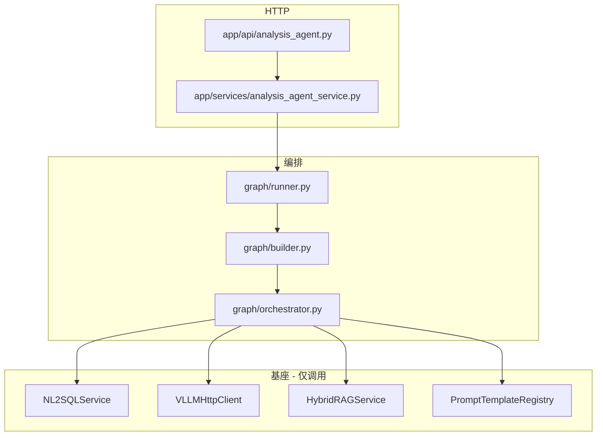
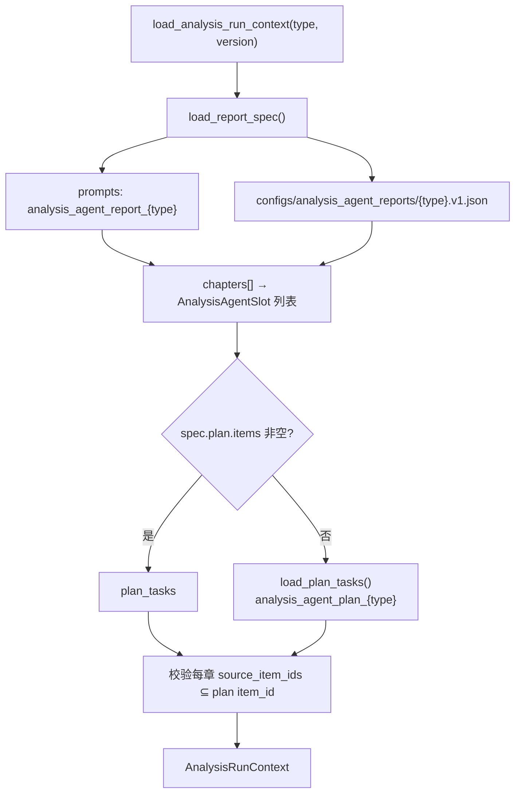
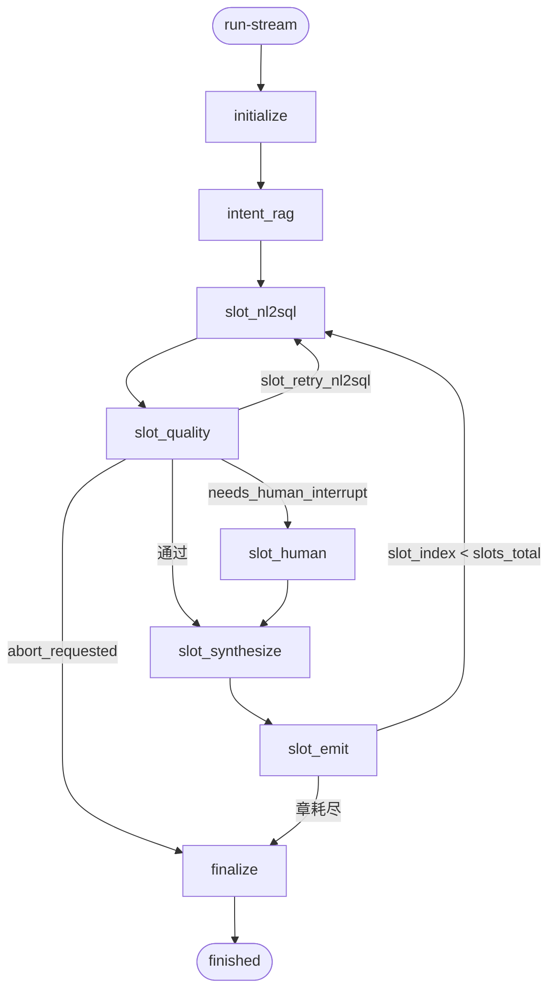

# 综合分析智能体（analysis_agent）实现逻辑说明（代码对照版）

> 本文描述**当前仓库真实代码行为**，用于评审、排障与运维交接。  
> **方案与设计决策**见：`framework-guide/综合分析智能体实现方案及技术说明书.md`  
> **NL2SQL 基座细节**见：`enterprise-level_transformation_docs/NL2SQL当前完整实现逻辑说明-代码对照版.md`  
> **现网旧综合分析（对照）**见：`enterprise-level_transformation_docs/企业级综合分析实现和使用说明.md`  
> **文档版本**：2026-05-28 · 对齐改造计划 T1～T5 落地后代码

---

## 1. 模块定位与边界

| 项 | 说明 |
|----|------|
| 路由前缀 | `/analysis-agent/*`（`app/main.py` 挂载 `analysis_agent.router`） |
| 代码命名空间 | `app/analysis_agent/`、`app/api/analysis_agent.py`、`app/services/analysis_agent_service.py` |
| 与 `/analysis/*` | **独立模块**，不 import `AnalysisGraphRunner`、`AnalysisSynthesisV2Engine` |
| 编排模型 | **按章节串行**：每章先 NL2SQL 取数 → 质量门 → ReAct 合成 → 即时 SSE |
| 配置事实源 | **`analysis_agent_report_{type}`**（`configs/analysis_agent_reports/*.v1.json` 或 `prompts.yaml` 同 scene） |
| NL2SQL | 统一 **`NL2SQLService.query`**，传真实 `analysis_type` + QA 五元组 |

---

## 2. 总体架构

```text
客户端
  POST /analysis-agent/run-stream
    → AnalysisAgentService（SSE 编码 + 内存 trace）
      → AnalysisAgentGraphRunner.iter_stream_events()
        → LangGraph 主图（或 sequential_fallback）
          → SlotOrchestrator
            → NL2SQLService          # SQL 生成与执行
            → VLLMHttpClient         # 章节 LLM / ReAct
            → HybridRAGService       # 意图业务 RAG（不进 NL2SQL）
            → PromptTemplateRegistry # plan / synthesis / report
```



---

## 3. 代码目录结构

```text
app/
├── api/analysis_agent.py                 # HTTP：run-stream / resume / trace
├── models/analysis_agent.py              # 请求/响应；4 类 analysis_type
├── services/analysis_agent_service.py    # SSE 门面 + trace 内存存储
│
└── analysis_agent/
    ├── context_loader.py                 # ★ load_analysis_run_context()
    ├── report_spec.py                    # load_report_spec() / ReportSpec
    ├── nl2sql_executor.py                # plan 子任务 → NL2SQLService
    ├── checkpoint.py                     # LangGraph checkpointer（memory/redis）
    ├── session_store.py                  # HITL resume_token
    │
    ├── graph/
    │   ├── runner.py                     # AnalysisAgentGraphRunner
    │   ├── builder.py                    # StateGraph 编译 + 条件边
    │   ├── nodes.py                      # initialize / intent_rag / slot_* / finalize
    │   ├── orchestrator.py               # ★ 取数、质量门、合成、emit
    │   └── state.py                      # AnalysisAgentState
    │
    ├── plans/loader.py                   # analysis_agent_plan_{type}（plan 回退）
    │
    ├── slots/
    │   ├── registry.py                   # get_agent_slots() → context_loader
    │   ├── kinds.py                      # AnalysisAgentSlot / SlotKind / SlotOutput
    │   ├── builder.py                    # JSON → AnalysisAgentSlot
    │   └── specs.py                      # SUPPORTED_ANALYSIS_TYPES
    │
    ├── agents/
    │   ├── section_agent.py              # llm_section 合成入口
    │   ├── section_prompt.py             # 章节 user prompt（含 intent_context）
    │   ├── narrative_react.py            # create_react_agent
    │   └── section_result.py             # 合成结果结构
    │
    ├── tools/
    │   ├── agent_tools.py                # get_slot_data / rag_retrieve / emit_*
    │   └── slot_context.py               # ReAct ContextVar
    │
    └── renderers/
        ├── section_data.py               # 取数切片、事实清单、叙述 Markdown
        ├── markdown_table.py             # 通用 Markdown 表
        ├── table_generic.py              # emit_markdown_table
        ├── charts_extra.py               # bar/pie chart spec
        └── slot_renderer.py              # 仅 static_markdown；旧确定性 kind 已废弃

configs/
├── analysis_agent_reports/               # ★ 运行时报告规格 chapters[]
│   ├── overheat_guidance.v1.json
│   ├── maintenance_strategy.v1.json
│   ├── four_tube_health_interpretation.v1.json
│   └── leakage_burst_analysis.v1.json
├── prompts.yaml                          # plan / synthesis / report / nl2sql scene
└── analysis_agent_slots/                 # 已归档，运行时不再加载（见 README）

tests/
├── test_analysis_agent_overheat.py
├── test_analysis_agent_phase1.py         # HITL / LangGraph
├── test_analysis_agent_phase2.py
├── test_analysis_agent_t3.py             # NL2SQL 五元组 + 跨章去重
├── test_analysis_agent_report_spec.py
├── test_analysis_agent_slots_loader.py
└── test_analysis_agent_config.py         # 生产 APP_ENV=production → redis
```

---

## 4. HTTP 接口与调用链

### 4.1 路由一览

| 方法 | 路径 | 处理函数 | 说明 |
|------|------|----------|------|
| POST | `/analysis-agent/run-stream` | `run_analysis_agent_stream` | 主入口，SSE |
| POST | `/analysis-agent/resume-stream` | `resume_analysis_agent_stream` | HITL 续流 |
| POST | `/analysis-agent/resume` | `resume_analysis_agent` | HITL 同步结果 |
| GET | `/analysis-agent/trace/{request_id}` | `get_analysis_agent_trace` | 运维 trace |

鉴权与现网一致：`Authorization: Bearer <SERVICE_API_KEY>`。

### 4.2 请求模型（`app/models/analysis_agent.py`）

**`AnalysisAgentRunRequest`** 必传：

- `user_id`、`session_id`
- `analysis_type`：`overheat_guidance` | `maintenance_strategy` | `four_tube_health_interpretation` | `leakage_burst_analysis`
- `query`：用户自然语言分析需求

**`AnalysisAgentOptions`** 常用：

| 字段 | 默认 | 说明 |
|------|------|------|
| `enable_rag` | `true` | 意图 RAG（章节撰写） |
| `strict` | `false` | mandatory 数据缺失是否整报告失败 |
| `max_rows_per_query` | `2000` | 单次 NL2SQL 行上限（orchestrator 截断 rows） |
| `chart_mode` | `auto` | `auto` / `minimal` / `off` |
| `plan_template_version` | 空→`v1` | 报告/plan 版本 |
| `enable_human_in_the_loop` | `true` | 是否允许 interrupt |

### 4.3 服务层调用顺序

```text
AnalysisAgentRunRequest
  → AnalysisAgentService.run_stream()
       async gen(): runner.iter_stream_events(..., on_complete=save_trace)
  → AnalysisAgentGraphRunner
       ├─ LangGraph: astream(initial_state, config) + checkpointer
       └─ 降级: _iter_sequential_fallback()   # 无 HITL
  → 每个 graph update 中 drain pending_events → SSE data: {...}\n\n
```

关键类构造（`runner.py`）：

```python
self._orch = SlotOrchestrator(
    conv_manager, llm_client, prompt_registry, hybrid_rag, nl2sql_service
)
self._graph, self._checkpointer = build_analysis_agent_graph(self._orch)
```

---

## 5. 配置加载（报告规格 + 数据计划）

### 5.1 加载流程



**入口文件**：

- `app/analysis_agent/context_loader.py` → `load_analysis_run_context()`
- `app/analysis_agent/report_spec.py` → `load_report_spec()`

**失败行为**：无 report spec 时抛 `ValueError(missing_report_spec:...)`，run-stream 返回 `analysis_agent_error`。

### 5.2 配置资产对照

| 用途 | Scene / 文件 | 加载方 |
|------|----------------|--------|
| 报告章节 | `analysis_agent_report_{type}` / `configs/analysis_agent_reports/*.json` | `report_spec` → `chapters` |
| NL2SQL 数据计划 | `analysis_agent_plan_{type}`（report 无 plan.items 时） | `plans/loader.load_plan_tasks` |
| 章节合成 system | `analysis_agent_synthesis_{type}` | `section_agent._system_prompt` |
| SQL 生成 Prompt | `nl2sql`（非 `analysis_agent_nl2sql`） | `NL2SQLChain`（因传真实 analysis_type） |

合并脚本（可选，将 JSON 追加进 `prompts.yaml`）：

```bash
python scripts/merge_analysis_agent_report_to_prompts.py
```

---

## 6. LangGraph 主图

### 6.1 节点与边（`graph/builder.py`）



### 6.2 各节点实现位置

| 节点 | 实现 | 职责 |
|------|------|------|
| `initialize` | `graph/nodes.py` | 加载 report + plan；初始化 state；发 `analysis_agent_meta` |
| `intent_rag` | `orchestrator.run_intent_rag` | 业务 RAG → `intent_context` / `context_snippets` |
| `slot_nl2sql` | `orchestrator.run_slot_nl2sql` | 当前章 `source_item_ids` 并行 NL2SQL |
| `slot_quality` | `orchestrator.run_slot_quality` | mandatory 门控；retry / HITL / abort |
| `slot_human` | `nodes.py` + `langgraph.interrupt` | 等人；resume 后 `apply_human_response` |
| `slot_synthesize` | `orchestrator.run_slot_synthesize` | `llm_section` ReAct 或 `static_markdown` |
| `slot_emit` | `orchestrator.run_slot_emit` | SSE 事件；`slot_index += 1` |
| `finalize` | `nodes.py` | `analysis_agent_report_complete` + `analysis_agent_finished` |

### 6.3 核心状态字段（`graph/state.py`）

| 字段 | 说明 |
|------|------|
| `ordered_slots` | 章节 dict 列表（serialize 后） |
| `plan_tasks` | 数据计划条目 |
| `slot_index` / `slots_total` | 当前章 / 总章数 |
| `gathered_data` | `{plan_item_id: rows[]}` **会话级缓存** |
| `task_status` | `{item_id: success\|empty\|failed\|...}` |
| `nl2sql_calls` | trace；含 `cache_hit`、`plan_template_version` |
| `intent_context` | 意图 RAG 片段（注入章节 prompt） |
| `summary_parts` | 已推送 Markdown 片段 |
| `structured_report` | `{sections, tables, charts}` |
| `pending_events` | 待 drain 的 SSE 事件队列 |

---

## 7. 单章节执行逻辑

### 7.1 取数（`orchestrator._acquire_slot_data`）

```text
plan_tasks_for_slot(all_tasks, slot.source_item_ids)
  → asyncio.gather(_one(task) for task in slot_plan)

_one(task):
  if plan_item_resolved(item_id, gathered_data, task_status):
      记录 nl2sql_calls(cache_hit=true)
      SSE: analysis_agent_nl2sql_done(cached=true)
      return   # 不调用 NL2SQLService

  run_nl2sql_for_plan_item(
      analysis_type=state.analysis_type,      # 如 overheat_guidance
      plan_item_id=item_id,                   # 如 q3a
      plan_template_version=trace.plan_template_version,
      question=task["question"],              # plan 长问句
      time_intent_text=state.query,           # 用户原句
      record_conversation=False,
  )
  → gathered_data[item_id] = rows
  → task_status[item_id] = success | empty | failed
```

**跨章去重**：同一 `request_id` 内，多章共用 `q1` 等 `plan_item_id` 时，仅第一次真实调用 `NL2SQLService`；后续章命中 `task_status` 缓存。

**retry / HITL**：`run_slot_quality` 或 `apply_human_response(retry|widen_time_range)` 时对当前章 `source_item_ids` 执行 `gathered_data.pop` + `task_status.pop`，再跑 NL2SQL。

### 7.2 NL2SQL 公共基座（`nl2sql_executor.py` → `NL2SQLService`）

与 `POST /nl2sql/query`、现网 `AnalysisGraphRunner._run_single_nl2sql_plan_task` **同链路**：

```text
NL2SQLChain.generate_sql_with_validation_context()
  ① resolve_question_intent（时间程序规则 + 范围 rule/LLM；time_intent_text=上层 query）
  ② 可选 planner
  ③ NL2SQLRAGService 三库检索:
       nl2sql_schema / nl2sql_biz_knowledge / nl2sql_qa_examples
     - 有五元组时: QA slot lookup（精确取 1 条进 Prompt）
     - 默认不走 strict replay（仍由 LLM 生成 SQL）
  ④ L2 → L1 SQL 缓存（NL2SQL_CACHE_ENABLED）
  ⑤ Prompt scene=nl2sql + {{NL2SQL_SCHEMA_CATALOG}}（可选 NL2SQL_INJECT_PARSED_INTENT）
  ⑥ LLM 生成 SQL → TiDB/时间/范围改写 → 校验 → EXPLAIN/execute → 可选 refine
  ⑦ 可选 QA 自动写入 nl2sql_qa_examples（NL2SQL_QA_FEEDBACK_ENABLED）
```

**两套 RAG 勿混淆**：

| RAG | 触发 | 用于 |
|-----|------|------|
| 意图 RAG | `intent_rag` / 工具 `rag_retrieve` | **章节撰写** |
| NL2SQL RAG | `NL2SQLChain` 内部 | **SQL 生成** |

### 7.3 章节合成（`slot_synthesize`）

**`llm_section` / `llm_narrative`**（当前四类报告主要为 `llm_section`）：

```text
section_data.resolve_data_subset(gathered_data, source_item_ids)
  → build_data_coverage_note / build_audit_facts
  → build_section_user_prompt(outline, constraints, intent_context, rag_block)
  → synthesize_section()
       ├─ run_narrative_react()     # create_react_agent + Tools
       └─ 失败回退 stream_chat
  → section_result_to_slot_output()  # Markdown + tables + charts
```

**ReAct 工具**（`tools/agent_tools.py` → `build_narrative_tools`）：

| 工具 | 作用 |
|------|------|
| `get_slot_data` | 只读当前章绑定的 `gathered_data` JSON |
| `rag_retrieve` | 业务知识库片段（非 NL2SQL 三库） |
| `emit_markdown_table` | 登记本章表格 → SSE `table_payload` |
| `emit_chart` | 登记 bar/pie → SSE `chart_payload` |

**`static_markdown`**：报告标题等，`slot_renderer.render_deterministic_slot` 直接输出 `static_body`。

### 7.4 SSE 推送（`slot_emit`）

单章典型事件序：

```text
analysis_agent_slot_start
  → analysis_agent_nl2sql_done（每 item_id；cached 可为 true）
  → analysis_agent_summary_delta（章节正文）
  → analysis_agent_table_payload / analysis_agent_chart_payload（可选）
  → analysis_agent_slot_complete
```

全流程结束：

```text
analysis_agent_report_complete
  → analysis_agent_finished（含 result.summary / structured_report / evidence / trace）
```

---

## 8. 人机协同（HITL）

```text
slot_quality: mandatory 失败且重试用尽
  → needs_human_interrupt=true
  → slot_human: interrupt({prompt, suggested_actions, slot_id})
  → SSE: analysis_agent_user_input_required + resume_token

POST /analysis-agent/resume-stream
  → session_store 校验 resume_token
  → Command(resume={action, payload})
  → apply_human_response():
       retry / widen_time_range → 清 gathered + 重跑 slot_nl2sql
       skip_slot → 跳过合成
       abort → finalize
```

**前置条件**：

- `ANALYSIS_AGENT_CHECKPOINT_BACKEND` ≠ `none`（HITL 必须 checkpoint）
- 多 worker：`ANALYSIS_AGENT_CHECKPOINT_BACKEND=redis`、`ANALYSIS_AGENT_SESSION_STORE_BACKEND=redis`
- `APP_ENV=production` 时未显式配置则 **默认 redis**（`app/core/config.py`）

---

## 9. 支持的 analysis_type 与报告结构

| analysis_type | 章节数（当前） | plan 条目（示例） | report 文件 |
|---------------|----------------|-------------------|-------------|
| `overheat_guidance` | 9（1 static + 8 llm_section） | q1, q2a～q6d（15 项） | `overheat_guidance.v1.json` |
| `maintenance_strategy` | 3 | q0～q5 | `maintenance_strategy.v1.json` |
| `four_tube_health_interpretation` | 4 | q1～q6 | `four_tube_health_interpretation.v1.json` |
| `leakage_burst_analysis` | 5 | q1～q6 | `leakage_burst_analysis.v1.json` |

章节 JSON 字段（`llm_section`）：`id`、`title`、`source_item_ids`、`outline`、`constraints`、`field_hints`、`allowed_outputs`、`use_emit_tools` 等（见 `slots/builder.py`）。

---

## 10. 降级与异常路径

| 条件 | 行为 | 代码位置 |
|------|------|----------|
| 未安装 langgraph / 无 checkpointer | `sequential_fallback`，无 HITL | `runner._iter_sequential_fallback` |
| `ANALYSIS_AGENT_ENABLED=false` | `analysis_agent_error` | `runner.iter_stream_events` |
| 不支持的 `analysis_type` | `analysis_agent_error` | `registry.registry_available` |
| 缺少 report spec | `analysis_agent_error` | `context_loader` |
| ReAct 异常 | 回退 `stream_chat` | `section_agent.synthesize_section` |
| 旧 slot kind（template_deterministic 等） | 废弃占位 Markdown | `slot_renderer` |

---

## 11. 环境变量（节选）

```bash
# 开关
ANALYSIS_AGENT_ENABLED=true
ANALYSIS_AGENT_USE_LANGGRAPH=true
ANALYSIS_AGENT_USE_REACT_AGENT=true

# HITL / 多 worker（生产 APP_ENV=production 默认 redis）
ANALYSIS_AGENT_CHECKPOINT_BACKEND=memory|redis
ANALYSIS_AGENT_SESSION_STORE_BACKEND=memory|redis
ANALYSIS_AGENT_CHECKPOINT_REDIS_URL=redis://...

# 章节 / 流式
ANALYSIS_AGENT_RAG_TOP_K=8
ANALYSIS_AGENT_REACT_MAX_ITERATIONS=8
ANALYSIS_AGENT_SLOT_NL2SQL_MAX_RETRIES=2

# NL2SQL（与独立 NL2SQL 共用，见 NL2SQL 代码对照文档）
NL2SQL_QA_FEEDBACK_ENABLED=false
NL2SQL_QA_SLOT_STRICT_REPLAY=false
NL2SQL_CACHE_ENABLED=true
```

完整列表见 `app/core/config.py` → `AnalysisAgentConfig` 与 `app/app-deploy/.env.example` G2 节。

---

## 12. 关键类与函数索引

| 职责 | 符号 | 文件 |
|------|------|------|
| HTTP 入口 | `run_analysis_agent_stream` | `app/api/analysis_agent.py` |
| SSE 门面 | `AnalysisAgentService` | `app/services/analysis_agent_service.py` |
| 流式编排 | `AnalysisAgentGraphRunner.iter_stream_events` | `app/analysis_agent/graph/runner.py` |
| 图编译 | `build_analysis_agent_graph` | `app/analysis_agent/graph/builder.py` |
| 报告加载 | `load_analysis_run_context` | `app/analysis_agent/context_loader.py` |
| NL2SQL 封装 | `run_nl2sql_for_plan_item` | `app/analysis_agent/nl2sql_executor.py` |
| 取数/合成/emit | `SlotOrchestrator` | `app/analysis_agent/graph/orchestrator.py` |
| 章节 Agent | `synthesize_section` / `run_narrative_react` | `app/analysis_agent/agents/` |
| Agent 工具 | `build_narrative_tools` | `app/analysis_agent/tools/agent_tools.py` |
| 会话去重 | `plan_item_resolved` | `app/analysis_agent/nl2sql_executor.py` |

---

## 13. 端到端时序（超温示例）

```text
POST /analysis-agent/run-stream
  analysis_type=overheat_guidance
  query="请分析 #2 炉近期超温情况"

initialize
  → load overheat_guidance.v1.json: 9 chapters + 15 plan items
  → SSE: analysis_agent_meta

intent_rag
  → HybridRAGService → intent_context

for chapter in [ch1_overview .. ch8_appendix]:
  slot_nl2sql
    → q1 / q2a.. / q3a.. 等（跨章 item_id 会话去重）
    → NL2SQLService（五元组 + 三库 RAG + LLM 生成 SQL）
  slot_quality → (optional HITL)
  slot_synthesize
    → ReAct: get_slot_data + emit_table/chart + 正文
  slot_emit → SSE 本章 delta / table / chart

finalize
  → summary + structured_report + evidence.nl2sql_calls
  → analysis_agent_finished
```

---

## 14. 与现网 `/analysis/*` 对照（NL2SQL 维度）

| 维度 | 现网 `AnalysisGraphRunner` | analysis_agent |
|------|---------------------------|----------------|
| 取数时机 | `acquire_data` 批量并行全部 plan | **按章**取数（章内 item 并行） |
| NL2SQL 调用 | `NL2SQLService.query` + 五元组 | **相同** |
| QA strict replay | 可选（环境变量） | **相同**（默认关） |
| 合成 | `AnalysisSynthesisV2Engine` 批量 | **每章 ReAct** + 即时 SSE |
| 配置 | `analysis_plan_*` + Python 槽位表 | **`analysis_agent_report_*`** |

---

## 15. 文档修订记录

| 日期 | 说明 |
|------|------|
| 2026-05-28 | 初稿：对齐 T1～T5 改造后代码（report spec、intent_rag、NL2SQL 五元组、会话去重、llm_section） |
