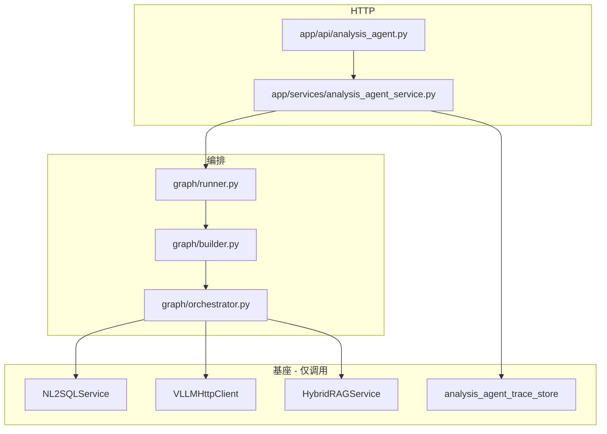
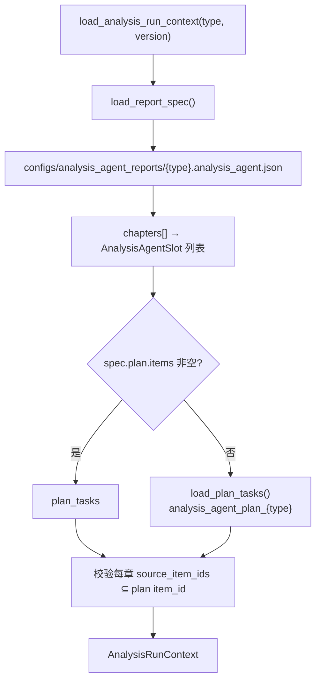

# 综合分析智能体（analysis_agent）实现逻辑说明（代码对照版）

> 本文描述**当前仓库真实代码行为**，用于评审、排障与运维交接。  
> **方案 / 流程说明（已与 T1～T7 对齐）**：  
> - `docs/基于地降所项目改造/综合分析智能体改造.md`  
> - `enterprise-level_transformation_docs/综合分析智能体(analysis_agent)实现逻辑说明.md`  
> - 极简运维：`系统整体逻辑、配置说明-简版.md` §2  
> **历史方案与设计决策**见：`framework-guide/综合分析智能体实现方案及技术说明书.md`  
> **NL2SQL 基座细节**见：`enterprise-level_transformation_docs/NL2SQL当前完整实现逻辑说明-代码对照版.md`  
> **现网旧综合分析（对照）**见：`enterprise-level_transformation_docs/企业级综合分析实现和使用说明.md`  
> **文档版本**：2026-08-25 · 对齐改造计划 **T1～T7** 落地后代码

---

## 1. 模块定位与边界

| 项 | 说明 |
|----|------|
| 路由前缀 | `/analysis-agent/*`（`app/main.py` 挂载 `analysis_agent.router`） |
| 代码命名空间 | `app/analysis_agent/`、`app/api/analysis_agent.py`、`app/services/analysis_agent_service.py` |
| 与 `/analysis/*` | **独立模块**，不 import `AnalysisGraphRunner`、`AnalysisSynthesisV2Engine` |
| 编排模型 | **先全量 `acquire_data`**，再 `chapter_pipeline`（可有限并行合成，emit 保序） |
| 配置事实源 | `configs/analysis_agent_reports/{type}.analysis_agent.json`（`plan.items` 优先，否则 yaml plan） |
| NL2SQL | 统一 **`NL2SQLService.query`**，传真实 `analysis_type` + QA 五元组；默认 `disable_qa_slot_replay` |
| Trace | 独立 `analysis_agent_trace_store`（`ANALYSIS_AGENT_TRACE_BACKEND`） |

---

## 2. 总体架构

```text
客户端
  POST /analysis-agent/run-stream
    → AnalysisAgentService（SSE + stop + Trace store）
      → AnalysisAgentGraphRunner.iter_stream_events()
        → LangGraph 主图（checkpoint 可选；无图时 sequential_fallback）
          → SlotOrchestrator
            → NL2SQLService
            → VLLMHttpClient（叙述真流式）
            → HybridRAGService（intent_rag）
            → ConversationManager（enable_context 摘要）
            → PromptTemplateRegistry + report JSON
```



---

## 3. 代码目录结构（要点）

```text
app/
├── api/analysis_agent.py                 # run-stream / stop / traces* / resume(兼容)
├── models/analysis_agent.py              # 请求/响应；锅炉四类 + subsidence_*
├── services/
│   ├── analysis_agent_service.py         # SSE 门面 + Trace 查询聚合
│   ├── analysis_agent_trace_store.py     # memory/redis/es
│   └── analysis_agent_stream_control.py  # stop
└── analysis_agent/
    ├── context_loader.py / report_spec.py / session_context.py
    ├── nl2sql_executor.py / quality.py
    ├── graph/  runner · builder · nodes · orchestrator · state
    ├── agents/ section_agent · section_prompt · narrative_react
    ├── renderers/ configured_viz · charts_extra · section_data
    └── plans/loader.py · slots/*
```

主图节点：`initialize → intent_rag → acquire_data → data_quality → chapter_pipeline → finalize`。

SSE 章事件：`analysis_agent_chapter_start` / `chapter_complete`（配置表图仍为 `table_payload` / `chart_payload`）。

---

## 4. HTTP 接口与调用链

### 4.1 路由一览

| 方法 | 路径 | 说明 |
|------|------|------|
| POST | `/analysis-agent/run-stream` | 主入口 SSE |
| POST | `/analysis-agent/stream/stop` | 协作中断 |
| GET | `/analysis-agent/traces` | 列表 |
| GET | `/analysis-agent/traces/stats` | 统计 |
| GET | `/analysis-agent/traces/trend` | 趋势 |
| GET | `/analysis-agent/traces/degrade-topn` | 降级 TopN |
| GET | `/analysis-agent/trace/{id}` · `/traces/{id}` | 单条 |
| POST | `/analysis-agent/resume[-stream]` | **兼容保留**（主路径无缺数 HITL） |

### 4.2 请求 options（常用）

| 字段 | 默认 | 说明 |
|------|------|------|
| `enable_rag` | `true` | 意图 RAG |
| `strict` | `false` | mandatory 失败是否整次失败 |
| `use_react_agent` | 跟 env（默认 false） | 仅 `use_emit_tools=true` 章 |
| `narrative_streaming` | 跟 env（默认 true） | 叙述真流式；可与章 `stream_live` 叠加 |
| `quality_profile` | 跟 env（`light`） | L1 锚点强度 |
| `enable_human_in_the_loop` | `false` | 主路径忽略 |
| `chapter_synth_max_parallel` | 跟 env（1～3） | 可选；章合成并行 |
---

## 5. 配置加载（报告规格 + 数据计划）

### 5.1 加载流程



**入口**：`context_loader.load_analysis_run_context` · `report_spec.load_report_spec`。

### 5.2 配置资产对照

| 用途 | Scene / 文件 | 加载方 |
|------|----------------|--------|
| 报告章节 / 表图 | `configs/analysis_agent_reports/*.analysis_agent.json` | `report_spec` |
| NL2SQL 数据计划 | report `plan.items` 或 `analysis_agent_plan_{type}` | `plans/loader` |
| 章节合成 system | `analysis_agent_synthesis_{type}` / `_subsidence` | `section_agent` |
| SQL 生成 | `nl2sql` | `NL2SQLChain` |

---

## 6. 关键行为摘要（T1～T7）

| 主题 | 代码行为 |
|------|----------|
| 取数 | `acquire_data` 全量；`dependency_ids` 分层并行；章合成只读缓存 |
| HITL | 主路径无缺数 interrupt；resume API 兼容 |
| Stop | `stream_id` + Redis/内存标志；SSE `analysis_agent_cancelled` |
| 流式 | `stream_chat` + `on_delta` → `summary_delta` |
| Replay | `ANALYSIS_AGENT_NL2SQL_DISABLE_QA_SLOT_REPLAY` → `NL2SQLQueryRequest` |
| 图表 | report `tables[]`/`charts[]` → `configured_viz`（bar/pie/line） |
| 地降 | `subsidence_*`；季报 JSON 主实装 |
| Trace | `analysis_agent:trace:*`；list/stats/trend/degrade-topn |
| Context | `session_context.py`；首章注入；finalize 落会话 |

---

## 7. 环境变量（增量）

见 `AnalysisAgentConfig` 与 `.env.example` **G2. 综合分析智能体**。关键项：

- `ANALYSIS_AGENT_ACQUIRE_MAX_PARALLEL` / `ANALYSIS_AGENT_NARRATIVE_STREAMING` / `ANALYSIS_AGENT_USE_REACT_AGENT`
- `ANALYSIS_AGENT_NL2SQL_DISABLE_QA_SLOT_REPLAY` / `ANALYSIS_AGENT_QUALITY_PROFILE`
- `ANALYSIS_AGENT_TRACE_BACKEND`（生产默认 redis）
- `ANALYSIS_AGENT_ENABLE_CONTEXT` / `ANALYSIS_AGENT_CONTEXT_MAX_TURNS`

---

## 8. 关键类与函数索引

| 职责 | 符号 | 文件 |
|------|------|------|
| HTTP | `run_analysis_agent_stream` 等 | `app/api/analysis_agent.py` |
| SSE / Trace | `AnalysisAgentService` | `app/services/analysis_agent_service.py` |
| Trace 存储 | `create_analysis_agent_trace_store` | `app/services/analysis_agent_trace_store.py` |
| 流式编排 | `AnalysisAgentGraphRunner` | `app/analysis_agent/graph/runner.py` |
| 图编译 | `build_analysis_agent_graph` | `app/analysis_agent/graph/builder.py` |
| 报告加载 | `load_analysis_run_context` | `app/analysis_agent/context_loader.py` |
| 会话摘要 | `build_session_context_summary` | `app/analysis_agent/session_context.py` |
| 取数/合成 | `SlotOrchestrator` | `app/analysis_agent/graph/orchestrator.py` |
| 章节 Agent | `synthesize_section` | `app/analysis_agent/agents/section_agent.py` |

---

## 9. 端到端时序（目标态）

```text
POST /analysis-agent/run-stream
initialize → meta / started(stream_id)
intent_rag → RAG + 可选 session_context_summary
acquire_data → 全量 plan items（分层并行）
data_quality → 重试或 degrade/abort
for each chapter:
  slot_prepare → 配置表/图 SSE
  slot_synthesize → summary_delta（首章可带会话摘要）
  slot_emit
finalize → Trace +（enable_context 时）会话落盘 → finished
```

---

## 10. 与现网 `/analysis/*` 对照

| 维度 | 现网 `AnalysisGraphRunner` | analysis_agent |
|------|---------------------------|----------------|
| 取数时机 | `acquire_data` 批量 | **同样批量** `acquire_data`，再按章成稿 |
| NL2SQL | 五元组 + 可选 replay | **相同**；agent 默认 disable replay |
| 合成 | v1/v2 引擎批量 | **按章流式** + 配置化表图 |
| Trace | `ANALYSIS_TRACE_*` | **独立** `ANALYSIS_AGENT_TRACE_*` |
| HITL | 现网自有 | 主路径**无**缺数 HITL |

---

## 11. 文档修订记录

| 日期 | 说明 |
|------|------|
| 2026-05-28 | 初稿：按章取数时代码对照 |
| 2026-08-25 | 回写 T1～T7：acquire_data 前置、stop/流式、replay、配置图、地降、Trace、enable_context |
