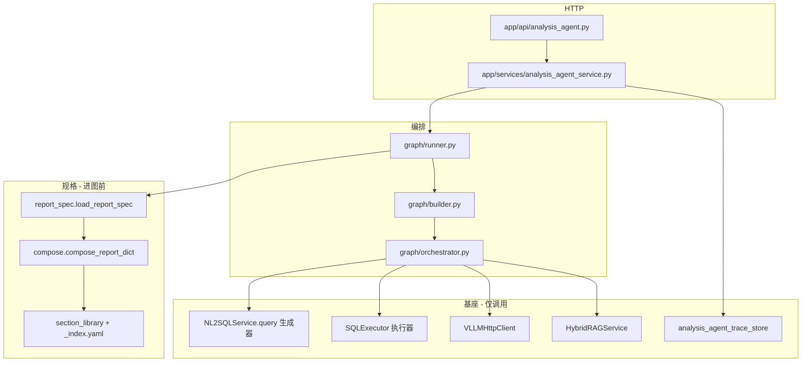
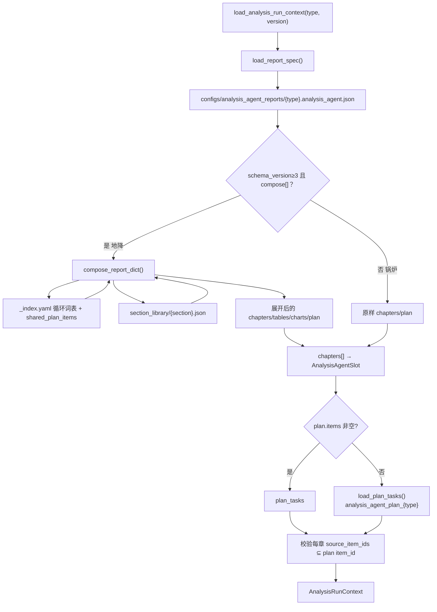

# 综合分析智能体（analysis_agent）实现逻辑说明（代码对照版）

> 本文描述**当前仓库真实代码行为**，用于评审、排障与运维交接。  
> **流程说明（业务链路）**：`enterprise-level_transformation_docs/综合分析智能体(analysis_agent)实现逻辑说明_v2.md`  
> **编排真源（节点名勿改）**：`docs/基于地降所项目改造/综合分析智能体改造V1.md`  
> **地降自动报告方案**：`docs/基于地降所项目改造/自动报告生成实现方案(详细版)(即综合分析智能体改造V2).md`  
> **极简运维**：`系统整体逻辑、配置说明-简版.md` §2  
> **NL2SQL 基座细节**：`enterprise-level_transformation_docs/NL2SQL当前完整实现逻辑说明-代码对照版.md`  
> **现网旧综合分析（对照）**：`enterprise-level_transformation_docs/企业级综合分析实现和使用说明.md`  
> **文档版本**：2026-09-20 · 对齐 V1 主图（T1～T7）+ V2 板块库 / 确定性取数落地后代码

---

## 1. 模块定位与边界

| 项 | 说明 |
|----|------|
| 路由前缀 | `/analysis-agent/*`（`app/main.py` 挂载 `analysis_agent.router`） |
| 代码命名空间 | `app/analysis_agent/`、`app/api/analysis_agent.py`、`app/services/analysis_agent_service.py` |
| 与 `/analysis/*` | **独立模块**，不 import `AnalysisGraphRunner`、`AnalysisSynthesisV2Engine` |
| 编排模型 | **先全量 `acquire_data`**，再 `chapter_pipeline`（可有限并行合成，emit 保序）。节点名相对 V1 **未改** |
| 规格事实源 | `configs/analysis_agent_reports/{type}.analysis_agent.json`；地降 `schema_version: 3` + `compose[]` 先展开再解析 |
| 取数分流 | plan item `executor`：`sql_template` / `python` / `placeholder` / 缺省 `nl2sql`（见 §7） |
| NL2SQL 生成器 | 仅 `executor=nl2sql`：`NL2SQLService.query`，真实 `analysis_type` + QA 五元组；默认 `disable_qa_slot_replay` |
| NL2SQL 执行器 | `sql_template`：`app.nl2sql.executor.SQLExecutor.execute`（无 LLM 写 SQL） |
| Trace | 独立 `analysis_agent_trace_store`（`ANALYSIS_AGENT_TRACE_BACKEND`） |

---

## 2. 总体架构

```text
客户端
  POST /analysis-agent/run-stream
    → AnalysisAgentService（SSE + stop + Trace store）
      → AnalysisAgentGraphRunner.iter_stream_events()
        → LangGraph 主图（checkpoint 可选；无图时 sequential_fallback）
          → SlotOrchestrator
            → compose_report_dict（进图前，schema 3）
            → period.apply_resolved_period（initialize）
            → 取数：sql_template / python / placeholder / nl2sql
            → VLLMHttpClient（叙述真流式）
            → HybridRAGService（intent_rag）
            → PromptTemplateRegistry + report JSON / section_library
```



---

## 3. 代码目录结构（要点）

```text
app/
├── api/analysis_agent.py                 # run-stream / stop / traces* / resume(兼容)
├── models/analysis_agent.py              # 请求/响应；锅炉四类 + subsidence_*
│                                         # options.start_time/end_time/area/issue_no
├── services/
│   ├── analysis_agent_service.py         # SSE 门面 + Trace 查询聚合
│   ├── analysis_agent_trace_store.py     # memory/redis/es
│   └── analysis_agent_stream_control.py  # stop
└── analysis_agent/
    ├── compose.py                        # schema 3 板块库展开
    ├── report_spec.py                    # 加载 JSON；≥3 先 compose
    ├── context_loader.py                 # AnalysisRunContext
    ├── period.py                         # 上一完整周期 / 区划 / 占位符
    ├── nl2sql_executor.py                # 生成器路径：run_nl2sql_for_plan_item
    ├── quality.py                        # L1 锚点
    ├── deterministics/                   # python_fn 注册表 + 覆盖/公式/压缩/重点区/典型曲线
    │   ├── coverage.py                   # device_station_map ∩ fcb_layer_map；F 码回退
    │   ├── fcb_endpoints.py              # sql_template 绑定 + 执行
    │   ├── formulas.py / fcb_compress.py / key_areas.py / typical_curve.py
    ├── graph/  runner · builder · nodes · orchestrator · state
    ├── agents/ section_agent · section_prompt · narrative_react
    ├── renderers/ configured_viz · charts_extra · section_data
    └── plans/loader.py · slots/*

configs/analysis_agent_reports/
├── section_library/                      # 可复用板块 JSON + _index.yaml
├── sql/                                  # fcb_period_endpoints.sql、typical_series_*.sql
├── subsidence_{daily,weekly,monthly,quarterly,yearly}.analysis_agent.json
└── 锅炉四类 *.analysis_agent.json         # 无 compose，V1 原样
```

主图节点：`initialize → intent_rag → acquire_data → data_quality → chapter_pipeline → finalize`  
（`graph/builder.py`；fallback 同序见 `runner.py` sequential 路径）。

SSE 章事件：`analysis_agent_chapter_start` / `chapter_complete`；配置表图仍为 `table_payload` / `chart_payload`。  
取数完成事件名仍为 `analysis_agent_nl2sql_done`，payload 含 `executor`。

---

## 4. HTTP 接口与调用链

### 4.1 路由一览

| 方法 | 路径 | 说明 |
|------|------|------|
| POST | `/analysis-agent/run-stream` | 主入口 SSE |
| POST | `/analysis-agent/stream/stop` | 协作中断 |
| GET | `/analysis-agent/traces` | 列表 |
| GET | `/analysis-agent/traces/stats` | 统计 |
| GET | `/analysis-agent/traces/trend` | 趋势 |
| GET | `/analysis-agent/traces/degrade-topn` | 降级 TopN |
| GET | `/analysis-agent/trace/{id}` · `/traces/{id}` | 单条 |
| POST | `/analysis-agent/resume[-stream]` | **兼容保留**（主路径无缺数 HITL） |

### 4.2 请求 options（常用）

| 字段 | 默认 | 说明 |
|------|------|------|
| `start_time` / `end_time` | 空 | 成对；空则上一完整周期。半开 `[t_start, t_end)` |
| `area` | 空 | `t_station.area` 标准名；空/全市=不按区过滤 |
| `issue_no` | 空 → `XX` | 封面期号 |
| `enable_rag` | `true` | 意图 RAG |
| `strict` | `false` | mandatory 失败是否整次失败 |
| `use_react_agent` | 跟 env（默认 false） | 仅 `use_emit_tools=true` 章 |
| `narrative_streaming` | 跟 env（默认 true） | 叙述真流式 |
| `quality_profile` | 跟 env（`light`） | L1 锚点强度 |
| `enable_human_in_the_loop` | `false` | 主路径忽略 |
| `chapter_synth_max_parallel` | 跟 env（1～3） | 章合成并行；地降建议 1 |
| `max_rows_per_query` | 2000 | 截断 gathered 行数 |
| `chart_mode` | `auto` | `auto` / `minimal` / `off` |

地降 `query` 可空：`period.canonical_query` 在 `initialize` 补规范问句。首帧 `started` 地降另含 `period`。

---

## 5. 配置加载（报告规格 + 数据计划）

### 5.1 加载流程（含 compose）



**入口**：`context_loader.load_analysis_run_context` · `report_spec.load_report_spec` · `compose.compose_report_dict`。

封面 `{period_label}` / `{issue_no}` / `{report_date}` **不在 compose 时钉死**（避免 slot registry 缓存串期），由 `graph/nodes.py` `initialize` 调 `period.fill_template_placeholders`。

### 5.2 配置资产对照

| 用途 | 文件 | 加载方 |
|------|------|--------|
| 地降模版拼装 | `subsidence_*.analysis_agent.json` 的 `compose[]` | `compose.py` |
| 板块 / 循环词表 / 共享 plan | `section_library/*.json`、`_index.yaml` | `compose.py` |
| 锅炉章节 / 表图 | 锅炉 `*.analysis_agent.json` 的 `chapters[]` | `report_spec`（跳过 compose） |
| 固定 SQL | `configs/analysis_agent_reports/sql/*.sql` | `deterministics/fcb_endpoints.load_sql_template` |
| 覆盖名单 / 层位 / 重点区 | `configs/nl2sql_business/subsidence/semantic/dimensions/` | `coverage.py` / `key_areas.py` |
| 章节合成 system | `analysis_agent_synthesis_{type}` / `_subsidence` | `section_agent` |
| SQL 生成（锅炉） | `nl2sql` scene | `NL2SQLChain` |

`_index.yaml` 共享 plan：`q_fcb_endpoints`（`sql_template`）→ `q_layer0`（`python slice_layer0`）+ 两个 `placeholder`。模版 JSON 的 `plan.items` 与之 **并集去重**。

`compress_groups[].annex_no` = 2..5；`annex_layer.json` 标题 `附表{item.annex_no}`，避免与附表 1（`annex_ground`）撞号。

---

## 6. `initialize` / `intent_rag` / 质量门（代码锚点）

| 步骤 | 符号 | 文件 |
|------|------|------|
| 周期解析 | `apply_resolved_period` → `options._resolved` | `period.py`；调用点 `graph/nodes.py` `initialize` |
| 空 query | `canonical_query` | `period.py` |
| 装规格 | `load_analysis_run_context` | `context_loader.py` |
| 封面占位 | `fill_template_placeholders` | `period.py` |
| RAG | `SlotOrchestrator.run_intent_rag` → `fetch_business_rag` | `orchestrator.py` |
| L0/L1 | `run_data_quality` / `check_l1_anchors` | `orchestrator.py` / `quality.py` |
| 质量后路由 | `_route_after_quality` | `graph/builder.py`：retry → `acquire_data`；abort → `finalize`；否则 `chapter_pipeline` |

`_resolved` 字段：`t_start`、`t_end`、`area`、`period_label`、`report_date`、`issue_no`、`report_kind`。确定性计划项 **禁止**再从 `query` 猜时间。

---

## 7. `acquire_data` 取数分流（核心）

入口：`SlotOrchestrator.run_acquire_data` → `_acquire_all_plan_data`（`dependency_ids` 分层 + `asyncio.gather`）→ `_run_one_plan_item`。

```text
ex = task.get("executor") or "nl2sql"

placeholder  → gathered[item]=[] ; status=optional_empty
python       → deterministics.run_python_fn(python_fn, gathered, resolved, task)
sql_template → fcb_endpoints.run_sql_template(sql_file, resolved, SQLExecutor)
nl2sql       → run_nl2sql_for_plan_item → NL2SQLService.query
```

### 7.1 python_fn 注册表

`app/analysis_agent/deterministics/__init__.py` → `PYTHON_FNS`：

| `python_fn` | 函数 | 依赖 gathered |
|-------------|------|----------------|
| `slice_layer0` | 层位 0 Δ=初−末 | `q_fcb_endpoints` |
| `layer_compress` | 连续层间差 | `q_fcb_endpoints` |
| `join_key_areas` | 表 4-1，13 站 | `q_layer0` + `q_compress` |
| `rank_by_area` | 全市按区汇总 | `q_layer0` |
| `typical_curve` | 双轴择优 | 层位 0 + 典型时序 SQL |

### 7.2 sql_template 绑定

`resolved_sql_params()`（`fcb_endpoints.py`）：`t_start`/`t_end`/`area` + `endpoint_bind_lists()`（覆盖 ∩ 层位字典的标号/场地 allowlist）。  
`typical_series_fcb.sql` 额外把 marks 裁到层位 0。列表经 `SQLExecutor` 绑定，**不**把未校验 area 拼进 SQL 字符串。

覆盖对齐：`coverage.canonical_project` 先 `normalize_site_key`（全角括号），再 F/J 码唯一回退（`F42(牌楼）` → `F42(牌楼站)`）。`layer0_mark_keys()` 固定 42 站。

### 7.3 谁走生成器

地降五类 JSON **没有** `executor: nl2sql` 项。锅炉 plan 通常不写 `executor`，命中缺省生成器。漏写 `executor` 的地降项也会回落到生成器——排障时先看 `nl2sql_calls[].executor`。

依赖未成功的下游标记 `skipped_dependency`，不再查询。

---

## 8. `chapter_pipeline`（代码锚点）

`run_chapter_pipeline` 对 `ordered_slots` 循环（或有限并行合成、顺序 emit）：

| 子步骤 | 符号 | 行为 |
|--------|------|------|
| prepare | `run_slot_prepare` → `prepare_chapter_viz` | `tables[]`/`charts[]` 按 `attach_to_chapter` + `row_filter` 切当前章 |
| synthesize | `run_slot_synthesize` → `synthesize_section` | `llm_section` 叙述；`static_markdown` 不调 LLM；合并 prepare 表图 markdown |
| emit | `run_slot_emit` | SSE + `structured_report` |

图表类型（`renderers/charts_extra.py`）：`bar` / `pie` / `line` / `dual_axis` / `map_placeholder`（无 GIS，占位）。

数字只读 `gathered_data`；章节 Agent 约束禁止编造层间差 / 内部编号。

---

## 9. 关键行为摘要

| 主题 | 代码行为 |
|------|----------|
| 拼装时机 | `load_report_spec` 内 `compose_report_dict`；**不是** `chapter_pipeline` |
| 取数时机 | `acquire_data` 全量；`dependency_ids` 分层并行；章合成只读缓存 |
| 地降真源 | `sql_template` + `python`；生成器不当附表真源 |
| 锅炉取数 | 缺省 `nl2sql` 生成器，路径未删 |
| HITL | 主路径无缺数 interrupt；resume API 兼容 |
| Stop | `stream_id` + Redis/内存标志；SSE `analysis_agent_cancelled` |
| 流式 | `stream_chat` + `on_delta` → `summary_delta` |
| Replay | `ANALYSIS_AGENT_NL2SQL_DISABLE_QA_SLOT_REPLAY` → 仅生成器路径的 `NL2SQLQueryRequest` |
| 图表 | report `tables[]`/`charts[]` → `configured_viz` |
| 地降五类 | 日/周/月/季/年均 schema 3；年报 compose 套季报 |
| Trace | `analysis_agent:trace:*`；list/stats/trend/degrade-topn |
| 会话 | **无** `session_context.py`；不做多轮改写 query |

---

## 10. 环境变量（增量）

见 `AnalysisAgentConfig`（`app/core/config.py`）与 `.env.example` **G2. 综合分析智能体**。关键项：

- `ANALYSIS_AGENT_ACQUIRE_MAX_PARALLEL` / `ANALYSIS_AGENT_ACQUIRE_MAX_RETRIES`
- `ANALYSIS_AGENT_NARRATIVE_STREAMING` / `ANALYSIS_AGENT_USE_REACT_AGENT`
- `ANALYSIS_AGENT_NL2SQL_DISABLE_QA_SLOT_REPLAY` / `ANALYSIS_AGENT_QUALITY_PROFILE`
- `ANALYSIS_AGENT_CHAPTER_SYNTH_MAX_PARALLEL`（默认 1）
- `ANALYSIS_AGENT_TRACE_BACKEND`（生产默认 redis）
- 地降前置：`NL2SQL_BUSINESS_DOMAIN=subsidence`

无 `ANALYSIS_AGENT_ENABLE_CONTEXT`（一次性报告，不启用会话改写）。

---

## 11. 关键类与函数索引

| 职责 | 符号 | 文件 |
|------|------|------|
| HTTP | `run_analysis_agent_stream` 等 | `app/api/analysis_agent.py` |
| SSE / Trace | `AnalysisAgentService` | `app/services/analysis_agent_service.py` |
| 流式编排 | `AnalysisAgentGraphRunner` | `app/analysis_agent/graph/runner.py` |
| 图编译 / 质量后路由 | `build_analysis_agent_graph` / `_route_after_quality` | `graph/builder.py` |
| 节点装配 | `make_nodes` | `graph/nodes.py` |
| 报告加载 | `load_report_spec` / `load_analysis_run_context` | `report_spec.py` / `context_loader.py` |
| 板块展开 | `compose_report_dict` | `compose.py` |
| 周期 | `apply_resolved_period` / `fill_template_placeholders` | `period.py` |
| 取数/合成 | `SlotOrchestrator.run_acquire_data` / `run_chapter_pipeline` / `_run_one_plan_item` | `graph/orchestrator.py` |
| 生成器取数 | `run_nl2sql_for_plan_item` | `nl2sql_executor.py` |
| 模板 SQL | `run_sql_template` / `resolved_sql_params` | `deterministics/fcb_endpoints.py` |
| python_fn | `run_python_fn` | `deterministics/__init__.py` |
| 覆盖名单 | `canonical_project` / `layer0_mark_keys` | `deterministics/coverage.py` |
| 章节 Agent | `synthesize_section` | `agents/section_agent.py` |
| 配置表图 | `prepare_chapter_viz` | `renderers/configured_viz.py` |

---

## 12. 端到端时序（当前态）

```text
POST /analysis-agent/run-stream
  load_report_spec
    └─ schema3：compose_report_dict（板块库 iterate / variant）
initialize
    ├─ apply_resolved_period → options._resolved
    ├─ 空 query → canonical_query
    └─ 装 ordered_slots / plan_tasks；替换封面占位
intent_rag → HybridRAG（不算数）
acquire_data
    └─ 分层并行 _run_one_plan_item
         placeholder | python | sql_template | nl2sql
data_quality → 重试或 degrade/abort
chapter_pipeline  （已展开章节，不再 compose）
  for each chapter:
    prepare  → configured_viz（row_filter / dual_axis / map_placeholder）
    synthesize → LLM 叙述或 static
    emit
finalize → Trace → finished
```

季报/年报数据依赖（示意）：

```text
q_fcb_endpoints ──► q_layer0 ──► q_area_rank
       └──────────► q_compress ──► q_key_area（还依赖 q_layer0）
```

---

## 13. 与现网 `/analysis/*` 对照

| 维度 | 现网 `AnalysisGraphRunner` | analysis_agent |
|------|---------------------------|----------------|
| 取数时机 | `acquire_data` 批量 | **同样批量** `acquire_data`，再按章成稿 |
| NL2SQL | 五元组 + 可选 replay | 锅炉 **相同生成器**；地降附表改走执行器 + python |
| 合成 | v1/v2 引擎批量 | **按章流式** + 配置化表图 |
| 报告结构 | 合成引擎内置 | 地降：板块库 compose；锅炉：JSON chapters |
| Trace | `ANALYSIS_TRACE_*` | **独立** `ANALYSIS_AGENT_TRACE_*` |
| HITL | 现网自有 | 主路径**无**缺数 HITL |

---

## 14. 文档修订记录

| 日期 | 说明 |
|------|------|
| 2026-05-28 | 初稿：按章取数时代码对照 |
| 2026-08-25 | 回写 T1～T7：acquire_data 前置、stop/流式、replay、配置图、地降占位、Trace |
| 2026-09-20 | 回写 V2 落地：compose 在 `load_report_spec`；`acquire_data` executor 分流；period._resolved；deterministics；五类模版；附表 2–5 / F42 对齐；删除已移除的 session_context |
