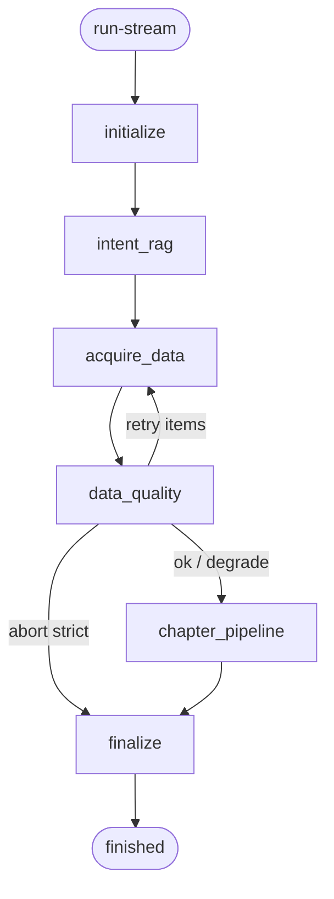

# 综合分析智能体（analysis_agent）实现逻辑说明

> **文档定位**：改造**已落地**流程与 LangGraph 说明（评审 / 交接用）。  
> **方案真源**：`docs/基于地降所项目改造/综合分析智能体改造.md`  
> **代码对照**：`enterprise-level_transformation_docs/综合分析智能体(analysis_agent)实现逻辑说明(代码).md`  
> **极简运维**：`系统整体逻辑、配置、运维说明/系统整体逻辑、配置说明-简版.md` §2  
> **风格参考**：`企业级智能客服 LangGraph 框架实现方案.md`  
> **版本**：2026-08-25（T1～T7 已落地；与仓库行为一致）

---

## 1. 目标与范围

- **目标**：在现有 LLM / RAG / NL2SQL 基座上，提供「一次性分析报告」流式成稿能力：先全量取数，再按章合成并顺序推送。  
- **入口**：`POST /analysis-agent/run-stream`（SSE）；可 `POST /analysis-agent/stream/stop` 中断。  
- **范围**：锅炉四类专项 + 地降 `subsidence_*`（季报主实装）；报告规格 JSON 驱动章节与图表。  
- **不做（本期）**：看图诊断；规划前 NL2SQL 三库 RAG 节点；缺数 HITL；用历史会话改写取数 `query`。

---

## 2. 设计原则

- **编排与执行分离**：LangGraph 管状态与节点；取数走 `NL2SQLService`；叙述走 `VLLMHttpClient`；业务知识走 `HybridRAGService`。  
- **取数一次、成稿分章**：全量 `acquire_data` 后再写章，避免跨章 `q*` 重叠重复调用。  
- **Emit 保序**：章合成串行推进；SSE 按 `ordered_slots` / `chapters[]` 顺序。  
- **配置优先于 Agent**：关键表/图由 report JSON 声明并程序渲染；ReAct 仅作工具章兜底。  
- **可观测 / 可中断**：Trace（Redis/ES/memory）+ stop（`stream_id`）。

---

## 3. 总体架构

```text
客户端
  POST /analysis-agent/run-stream
    → AnalysisAgentService（SSE、stop、Trace 持久化）
      → AnalysisAgentGraphRunner
        → LangGraph StateGraph
          → SlotOrchestrator
            → NL2SQLService
            → VLLMHttpClient
            → HybridRAGService
            → PromptTemplateRegistry + report JSON
```

| 组件 | 职责 |
|------|------|
| `app/api/analysis_agent.py` | HTTP：run-stream / stop / traces* / resume(兼容) |
| `AnalysisAgentService` | SSE 编码、stream 控制、Trace 读写 |
| `AnalysisAgentGraphRunner` | 编译图、`astream`、取消协作 |
| LangGraph 节点 | 见 §4 |
| `configs/analysis_agent_reports/*.json` | 章节 + 可选 `plan.items` + `tables`/`charts` |
| `NL2SQLService` | SQL 生成执行（内含三库 RAG / 缓存 / QA） |
| `app/analysis_agent/session_context.py` | （已移除；不做多轮上下文） |

---

## 4. LangGraph 主图

### 4.1 业务视角流程

```text
用户提出分析需求（含时间/范围）
        │
        ▼
加载报告规格与数据计划（report plan.items 优先，否则 yaml plan）
        │
        ▼
业务 RAG（可选：近几轮摘要仅辅助理解，不改取数原句）
        │
        ▼
按数据计划全量查库（依赖分层并行）
        │
        ▼
质量检查（缺关键数重试；仍失败则严格失败或标注待补充继续）
        │
        ▼
按章节写报告：先出配置表/图，再流式写叙述，按章推给前端
        │
        ▼
汇总全文 + 结构化报告 + 落 Trace（可选写会话）
```

### 4.2 节点链路（已落地代码名）

```text
initialize
  → intent_rag
  → acquire_data
  → data_quality          （可局部回到 acquire_data 重试）
  → chapter_pipeline      （prepare / synthesize / emit；可有限并行）
  → finalize
```



### 4.3 节点职责

| 节点 | 输入要点 | 输出要点 |
|------|----------|----------|
| `initialize` | `analysis_type` / `query` / options | `ordered_slots`、`plan_tasks`、`stream_id`、`request_id` |
| `intent_rag` | query | `intent_context` / `context_snippets` |
| `acquire_data` | `plan_tasks` | `gathered_data`、`task_status`、`nl2sql_calls`；SSE `nl2sql_done` |
| `data_quality` | mandatory / 锚点检查 | 重试集合或 degrade / abort |
| `chapter_pipeline` | 全量 gathered + chapters | 配置表/图 + 真流式正文；SSE `chapter_start`/`chapter_complete`；并行时缓冲后保序 emit |
| `finalize` | 全部章 | `report_complete`、`finished`、写 Trace（含 abort/failed） |

### 4.4 数据计划加载

```text
load_report_spec(type)
  ├─ plan.items / plan_items 非空 → plan_tasks
  └─ 否则 analysis_agent_plan_{type}（prompts.yaml）
校验：每章 source_item_ids ⊆ plan item_id 集合
```

**说明**：不增加规划前三库 RAG；SQL 准确性依赖基座内召回 + 问句/QA。

### 4.5 缺数与质量（无 HITL）

| 情况 | 默认（`strict=false`） | `strict=true` |
|------|------------------------|---------------|
| mandatory 空/失败 | 重试 → 标注待补充并继续写 | 重试 → 整次失败 |
| 缺时间/区划等锚点（地降 L1） | 记 degrade，继续 | 可配置失败 |

已移除：`slot_human` / `user_input_required` 主路径。

### 4.6 流式与 Stop

- 首帧：`started`（`stream_id`、`request_id`）。  
- 叙述：`summary_delta` 真 token/片段流（非整章假切片）。  
- 表/图：`table_payload` / `chart_payload`（配置渲染优先）。  
- 中断：`POST /analysis-agent/stream/stop` → 协作取消 acquire / 合成。

### 4.7 会话上下文

**不做**多轮 `enable_context`（一次性报告）。取数意图仅本轮 `query`。

---

## 5. 专项与地降季报

| `analysis_type` | 说明 |
|-----------------|------|
| `overheat_guidance` 等锅炉四类 | 既有 report；取数走统一 `acquire_data` |
| `subsidence_quarterly` | **主实装**：对齐《北京市地面沉降监测季度报告》目录 |
| 其他 `subsidence_*` | 占位 chapters + 最小 plan |

季报关键柱状图、折线图、统计表：在对应 report JSON 的 `charts[]` / `tables[]` 配置，绑定 `source_item_ids`。

前置：`NL2SQL_BUSINESS_DOMAIN=subsidence`。

---

## 6. NL2SQL 调用约定

每次子查询经 `NL2SQLService.query`：

- `analysis_type` = 真实报告类型（含 `subsidence_quarterly`）  
- `plan_item_id` / `plan_template_version`（默认 `analysis_agent_v1`）  
- `time_intent_text` = 用户原句 `query`  
- `ANALYSIS_AGENT_NL2SQL_DISABLE_QA_SLOT_REPLAY` **打穿到执行链**（默认关闭槽位 SQL 严格回放）

同一请求内同一 `plan_item_id`：在 `acquire_data` 成功路径只执行一次（重试除外）。

---

## 7. Trace 与运维 API

| 能力 | 路径 |
|------|------|
| 单条 | `GET /analysis-agent/trace/{request_id}` 或 `/traces/{request_id}` |
| 列表 | `GET /analysis-agent/traces` |
| 统计 | `GET /analysis-agent/traces/stats` |
| 趋势 | `GET /analysis-agent/traces/trend` |
| 降级 TopN | `GET /analysis-agent/traces/degrade-topn` |

后端：`ANALYSIS_AGENT_TRACE_BACKEND=redis|elasticsearch|memory`（生产默认 redis）；键前缀 `analysis_agent:trace:*`。

---

## 8. 与现网综合分析（§1）对照（一句话）

现网：规划 RAG →（可选意图/计划 LLM）→ 批量取数 → 质量门 → v1/v2 合成。  
智能体：**无规划 RAG/HITL**；**同样批量取数**；之后**按章流式成稿 + 配置化图表 + 地降季报 + 独立 Trace**。

---

## 9. 实施状态说明

| 阶段 | 状态 |
|------|------|
| T1～T7 | **已落地（2026-08-25）** |
| 方案真源 | `docs/基于地降所项目改造/综合分析智能体改造.md` |
| 极简运维 | `系统整体逻辑、配置说明-简版.md` §2 |
| 代码对照 | `综合分析智能体(analysis_agent)实现逻辑说明(代码).md` |
