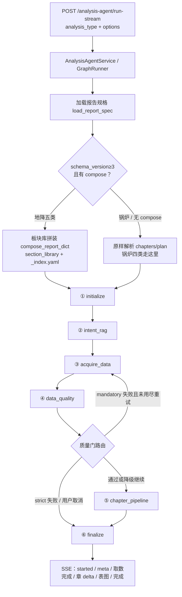
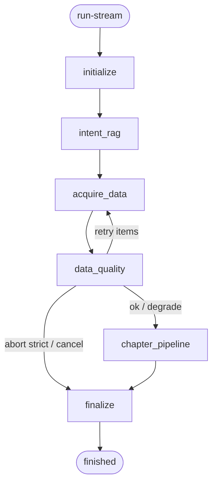
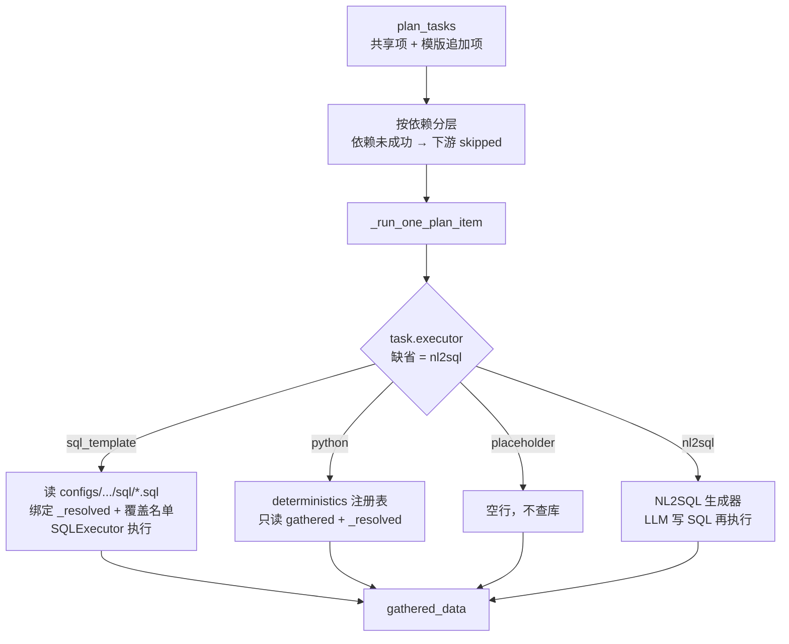

# 综合分析智能体（analysis_agent）实现逻辑说明

> **文档定位**：改造**已落地**流程与 LangGraph 说明（评审 / 交接用）。  
> **编排真源（节点名勿改）**：`docs/基于地降所项目改造/综合分析智能体改造V1.md`（T1～T7）  
> **地降自动报告方案**：`docs/基于地降所项目改造/自动报告生成实现方案(详细版)(即综合分析智能体改造V2).md`  
> **代码对照**：`enterprise-level_transformation_docs/综合分析智能体(analysis_agent)实现逻辑说明(代码)_v2.md`  
> **极简运维**：`系统整体逻辑、配置、运维说明/系统整体逻辑、配置说明-简版.md` §2  
> **风格参考**：`企业级智能客服 LangGraph 框架实现方案.md`  
> **版本**：2026-09-20（V1 主图 + V2 板块库/确定性取数已落地；与仓库行为一致）

---

## 1. 目标与范围

- **目标**：在现有 LLM / RAG / NL2SQL 基座上，提供「选模版 → 一次性分析报告」流式成稿：先全量取数，再按章合成并顺序推送。地降数字可复现，不由 LLM 填写。  
- **入口**：`POST /analysis-agent/run-stream`（SSE）；可 `POST /analysis-agent/stream/stop` 中断。  
- **范围**：锅炉四类专项（V1 原样）+ 地降 `subsidence_*` 五类（日/周/月/季/年，板块库拼装，年报套季报）。  
- **不做（本期）**：看图诊断；规划前 NL2SQL 三库 RAG 节点；缺数 HITL；用历史会话改写取数 `query`；整篇一份 LLM 提示词出报告；设备三率真值；地图 GIS；Excel 脚本当运行时入口。

---

## 2. 设计原则

- **编排与执行分离**：LangGraph 管状态与节点名；取数按 plan `executor` 分流；叙述走 `VLLMHttpClient`；业务知识走 `HybridRAGService`。  
- **主图稳定、能力外挂**：节点仍是 `initialize → intent_rag → acquire_data → data_quality → chapter_pipeline → finalize`。V2 **不新造引擎**，只在规格加载与 `acquire_data` 内加能力。  
- **拼装在进图前，写章在图内**：板块库 `compose` 展开成 V1 同构 `chapters[]`；`chapter_pipeline` 只消费已展开章节，不 iterate 板块。  
- **取数一次、成稿分章**：全量 `acquire_data` 后再写章，避免跨章 `q*` 重叠重复调用。  
- **地降数字确定性**：窗初/窗末走固定 SQL + `SQLExecutor`（NL2SQL **执行器**）；Δ / 层间差 / 重点区 JOIN / 典型曲线择优走 `deterministics`。**NL2SQL 生成器不当附表真源**。  
- **配置优先于 Agent**：关键表/图由报告规格声明并程序渲染；LLM 只写叙述；ReAct 仅 `use_emit_tools` 章兜底。  
- **可观测 / 可中断**：Trace（Redis/ES/memory）+ stop（`stream_id`）。

---

## 3. 总体架构

```text
客户端
  POST /analysis-agent/run-stream
    → AnalysisAgentService（SSE、stop、Trace 持久化）
      → AnalysisAgentGraphRunner
        → LangGraph StateGraph
          → SlotOrchestrator
            → 规格层：report JSON + section_library + compose（进图前展开）
            → 取数：sql_template / python / placeholder / nl2sql（acquire_data 内分流）
            → NL2SQLService.query          （生成器路径；锅炉默认）
            → SQLExecutor                  （执行器路径；地降 sql_template）
            → VLLMHttpClient               （叙述）
            → HybridRAGService             （intent_rag，不算数）
```

| 组件 | 职责 |
|------|------|
| `app/api/analysis_agent.py` | HTTP：run-stream / stop / traces* / resume(兼容) |
| `AnalysisAgentService` | SSE 编码、stream 控制、Trace 读写 |
| `AnalysisAgentGraphRunner` | 编译图、`astream`、取消协作 |
| LangGraph 节点 | 见 §5 |
| `configs/analysis_agent_reports/*.analysis_agent.json` | 地降：`schema_version: 3` + `compose[]`；锅炉：V1 `chapters[]` |
| `configs/analysis_agent_reports/section_library/` | 可复用板块 + `_index.yaml` 循环词表 / 共享 plan |
| `NL2SQLService` | SQL **生成+执行**（锅炉；地降 plan 未标 executor 时的缺省） |
| `SQLExecutor` | 绑定参数执行固定 SQL（地降 `sql_template`） |

---

## 4. 端到端逻辑链路（当前实现）

一次 `run-stream` 分两段：**进图前拼装规格**，**图内取数写章**。



职责分层：

```text
┌─────────────────────────────────────────────────────────────┐
│ 配置（改报告结构只改这里）                                      │
│  模版 JSON compose[]  +  section_library  +  _index.yaml     │
│  SQL 模板  +  device/fcb/key_area YAML                       │
└───────────────────────────┬─────────────────────────────────┘
                            │ 进图前拼装
                            ▼
┌─────────────────────────────────────────────────────────────┐
│ 编排（V1 主图，节点名稳定）                                     │
│  initialize → intent_rag → acquire_data → data_quality       │
│                           → chapter_pipeline → finalize      │
└────────┬──────────────────────────────┬─────────────────────┘
         │ 取数                          │ 写章
         ▼                              ▼
┌─────────────────────┐      ┌───────────────────────────────┐
│ deterministics      │      │ LLM 叙述（llm_section）         │
│ SQLExecutor 执行器   │      │ static 封面/附表说明            │
│ python 算 Δ/压缩     │      │ configured_viz 程序表图        │
│ placeholder 设备占位 │      │ 数字只读 gathered_data          │
└─────────────────────┘      └───────────────────────────────┘
```

**两个易混点（对照代码）：**

| 问题 | 当前实现 |
|------|----------|
| 板块库是不是在 `chapter_pipeline` 拼的？ | **不是。** 在 `load_report_spec` → `compose_report_dict`。`initialize` 把结果装进 `ordered_slots`。`chapter_pipeline` 只写章。 |
| 确定性取数是不是替代了 `acquire_data`？ | **阶段没换。** 地降 plan 改走 `sql_template` / `python` / `placeholder`；节点仍叫 `acquire_data`。NL2SQL **生成器** 代码还在（锅炉默认）；地降 SQL 仍用 NL2SQL **执行器**。 |

---

## 5. 进图之前：板块库如何变成可跑规格

发生在 `load_report_spec()`（`initialize` 经 `load_analysis_run_context` 触发）。`chapter_pipeline` 不读板块库。

```text
{type}.analysis_agent.json
  schema_version ≥ 3 且 compose[] 非空
        │
        ▼
compose_report_dict
  ├─ 读 section_library/_index.yaml
  │     plain_districts（平原 8 区）
  │     compress_groups（4 组，annex_no=2..5）
  │     shared_plan_items（q_fcb_endpoints / q_layer0 / 设备占位）
  ├─ 按 compose[] 加载 section_library/{section}.json
  ├─ variant 覆盖、iterate 循环、{item.*} 替换
  └─ 合并模版 plan.items
        │
        ▼
V1 同构：chapters[] + tables[] + charts[] + plan_items[]
        │
        ▼
initialize → ordered_slots / plan_tasks / report_tables / report_charts
```

地降五类入口：

| `analysis_type` | compose 骨架 | 额外 plan |
|-----------------|--------------|-----------|
| `subsidence_daily` | 封面 / 运行 / 平原 / 告警 | 仅共享项 |
| `subsidence_weekly` | 再加重点区叙述（不挂表 4-1） | 仅共享项 |
| `subsidence_monthly` | 概况 / 平原 / 重点区 / 典型曲线 | compress + 典型 SQL + `typical_curve` |
| `subsidence_quarterly` | 前言 / 全市 / 8 区 / 4 层组 / 表 4-1 / 小结 / 附表 1–5 | `q_area_rank` / `q_compress` / `q_key_area` |
| `subsidence_yearly` | **套季报 compose**（仅时间窗与封面措辞不同） | 同季报 |

循环展开示例：`district_results` → `district_results__chaoyang` … 共 8 章；`annex_layer` → `annex_layer__l01` … 标题为附表 2–5（附表 1 是地面沉降 `annex_ground`）。

锅炉四类 JSON 无 `compose`，不进板块库，行为与 V1 相同。

---

## 6. LangGraph 主图

### 6.1 业务视角流程

```text
用户选模版（可带 start_time/end_time/area/issue_no）
        │
        ▼
加载报告规格：地降先板块库拼装；锅炉原样 chapters
        │
        ▼
initialize：解析上一完整周期写入 options._resolved；空 query 补规范问句
        │
        ▼
业务 RAG（可选；只给写章背景，不改取数原句、不算沉降）
        │
        ▼
按数据计划全量查库（依赖分层并行；地降按 executor 分流）
        │
        ▼
质量检查（缺关键数重试；仍失败则严格失败或标注待补充继续）
        │
        ▼
按已展开章节写报告：先出配置表/图，再流式写叙述，按章推给前端
        │
        ▼
汇总全文 + 结构化报告 + 落 Trace
```

### 6.2 节点链路（已落地代码名）

```text
initialize
  → intent_rag
  → acquire_data
  → data_quality          （可局部回到 acquire_data 重试）
  → chapter_pipeline      （prepare / synthesize / emit；默认可串行真流式）
  → finalize
```



无 LangGraph 时 `GraphRunner` sequential fallback 顺序相同。

### 6.3 节点职责

| 节点 | 输入要点 | 输出要点 |
|------|----------|----------|
| `initialize` | `analysis_type` / `query` / options | 解析 `_resolved`；装入已拼装的 `ordered_slots`、`plan_tasks`、表图规格；封面 `{period_label}` 等替换 |
| `intent_rag` | query | `intent_context` / `context_snippets`（不算数） |
| `acquire_data` | `plan_tasks` + `_resolved` | `gathered_data`、`task_status`；SSE `nl2sql_done`（字段 `executor` 区分真实路径） |
| `data_quality` | mandatory / L1 锚点 | 重试集合或 degrade / abort |
| `chapter_pipeline` | 全量 gathered + 已展开 chapters | 配置表/图 + 真流式正文；SSE `chapter_start`/`chapter_complete` |
| `finalize` | 全部章 | `report_complete`、`finished`、写 Trace（含 abort/failed） |

### 6.4 周期与区划（地降）

确定性 SQL / python **只读** `options._resolved`，不再从自然语言猜时间。

| 字段 | 规则 |
|------|------|
| `start_time` + `end_time` | 成对；半开区间 `[t_start, t_end)`；日期-only 的 end 视为次日 0 点 |
| 均空 | **上一完整周期**（日报昨天、周报上自然周、月报上月、季报上季、年报上年） |
| `area` | 空/全市/北京市 = 不按区过滤；否则须为 `district.yaml` 标准名（带「区」） |
| `issue_no` | 封面期号；空则 `XX` |
| 空 `query` | `canonical_query()` 生成规范问句，供 RAG / L1 |

### 6.5 缺数与质量（无 HITL）

| 情况 | 默认（`strict=false`） | `strict=true` |
|------|------------------------|---------------|
| mandatory 空/失败 | 重试 → 标注待补充并继续写 | 重试 → 整次失败 |
| 缺时间/区划等锚点（地降 L1） | 记 degrade，继续 | `strict_like` + strict 可失败 |

已移除：`slot_human` / `user_input_required` 主路径。resume API 仅兼容。

### 6.6 流式与 Stop

- 首帧：`started`（`stream_id`、`request_id`）；地降另含 `period`（`t_start`/`t_end`/`period_label`/`area`）。  
- 叙述：`summary_delta` 真 token/片段流。  
- 表/图：`table_payload` / `chart_payload`（配置渲染优先）。  
- 中断：`POST /analysis-agent/stream/stop` → 协作取消 acquire / 合成。

### 6.7 会话上下文

**不做**多轮 `enable_context`（一次性报告）。取数意图仅本轮 `query` / `_resolved`。

---

## 7. `acquire_data`：确定性取数（阶段未换）

按 `plan_tasks` 的 `dependency_ids` **分层**，同层并行，写入 `gathered_data[item_id]`。单项按 `executor` 分流（**缺省仍是 `nl2sql` 生成器**）。



| executor | 实际做什么 | 谁在用 |
|----------|------------|--------|
| `sql_template` | 固定 SQL + 绑定参数 + `SQLExecutor` | 地降 `q_fcb_endpoints`、月报典型曲线时序 |
| `python` | `deterministics` 纯函数 | `q_layer0` / `q_compress` / `q_key_area` / `q_area_rank` / `q_typical` |
| `placeholder` | 空结果 | 设备三率、告警（库无数据，不造假） |
| `nl2sql`（默认） | `NL2SQLService.query` 生成 SQL | **锅炉四类**；地降 JSON **未配此项** |

地降共享计划（`_index.yaml`，几乎所有模版都有）：

```text
q_fcb_endpoints  ──sql_template──►  fcb_period_endpoints.sql
        │
        └──► q_layer0  ──python slice_layer0──►  层位0 Δ=初−末
q_ops_placeholder / q_alert_placeholder  ──placeholder──►  空
```

季报/年报再挂：`q_compress`（连续层间差）→ `q_key_area`（表 4-1，13 站）→ `q_area_rank`（全市按区）。  
月报再挂典型曲线 SQL → `python typical_curve`（GNSS 一期关闭）。

口径要点：

- 42 站 = `device_station_map.fcb` ∩ 层位 0 代表标；场地名全角规范化后 JOIN，F 码唯一时别名回退（`F42(牌楼）` → `F42(牌楼站)`），禁止 silently 丢站。  
- 压缩量 = 连续层 `Δi − Δ(i+1)`；缺层对的场地不出现在该附表。  
- SSE 事件名仍为 `analysis_agent_nl2sql_done`，以字段 `executor` 区分真实路径。

运行时数据流：

```text
options._resolved  {t_start, t_end, area, period_label, issue_no, ...}
        │
        ▼
gathered_data = {
  q_fcb_endpoints, q_layer0, q_compress, q_key_area, ...
}
        │
        ├──────────────► chapter_prepare  →  Markdown 表 / 图
        └──────────────► chapter_synthesize → 叙述（可引用表图，不编数字）
```

---

## 8. `chapter_pipeline`：按已展开章节写正文

对 `ordered_slots` 逐章（默认并行度 1，真流式）：

```text
prepare  →  按 tables[]/charts[] 从 gathered_data 渲表图
            （row_filter 切区分/层组；dual_axis；map_placeholder 无 GIS）
synthesize → llm_section：LLM 只写叙述；static_markdown：填模板
emit     →  SSE 推 markdown + 表 + 图，写入 structured_report
```

数字来自程序表，不是模型。封面/附表说明章为 `static_markdown`，不调 LLM。

---

## 9. 专项对照

| `analysis_type` | 说明 |
|-----------------|------|
| `overheat_guidance` 等锅炉四类 | 无 compose；`acquire_data` 默认 NL2SQL **生成器** |
| `subsidence_daily` / `weekly` / `monthly` / `quarterly` / `yearly` | schema 3 拼装；取数走确定性分支；年报套季报 |

前置：`NL2SQL_BUSINESS_DOMAIN=subsidence`（地降覆盖名单与层位字典在该域 YAML）。

---

## 10. NL2SQL 调用约定

仅 `executor=nl2sql`（或缺省）走 `NL2SQLService.query`：

- `analysis_type` = 真实报告类型  
- `plan_item_id` / `plan_template_version`（默认 `analysis_agent_v1`）  
- `time_intent_text` = 用户原句 `query`  
- `ANALYSIS_AGENT_NL2SQL_DISABLE_QA_SLOT_REPLAY` **打穿到执行链**（默认关闭槽位 SQL 严格回放）

`sql_template` **不**走生成器，只把绑定后的 SQL 交给 `SQLExecutor.execute`。  
同一请求内同一 `plan_item_id`：在 `acquire_data` 成功路径只执行一次（质量门重试除外）。

---

## 11. Trace 与运维 API

| 能力 | 路径 |
|------|------|
| 单条 | `GET /analysis-agent/trace/{request_id}` 或 `/traces/{request_id}` |
| 列表 | `GET /analysis-agent/traces` |
| 统计 | `GET /analysis-agent/traces/stats` |
| 趋势 | `GET /analysis-agent/traces/trend` |
| 降级 TopN | `GET /analysis-agent/traces/degrade-topn` |

后端：`ANALYSIS_AGENT_TRACE_BACKEND=redis|elasticsearch|memory`（生产默认 redis）；键前缀 `analysis_agent:trace:*`。

---

## 12. 与现网综合分析（§1）对照（一句话）

现网：规划 RAG →（可选意图/计划 LLM）→ 批量取数 → 质量门 → v1/v2 合成。  
智能体：**无规划 RAG/HITL**；**同样批量取数**；地降在同一 `acquire_data` 内改为确定性 SQL/python；之后**按章流式成稿 + 配置化图表 + 板块库拼装 + 独立 Trace**。

---

## 13. 实施状态说明

| 阶段 | 状态 |
|------|------|
| T1～T7（V1 主图） | **已落地** |
| V2 板块库 + 五类模版 + 确定性取数 | **已落地（2026-09-20）** |
| 方案真源 | V1 编排：`综合分析智能体改造V1.md`；地降报告：`自动报告生成实现方案(详细版)…V2.md` |
| 极简运维 | `系统整体逻辑、配置说明-简版.md` §2 |
| 代码对照 | `综合分析智能体(analysis_agent)实现逻辑说明(代码)_v2.md` |
