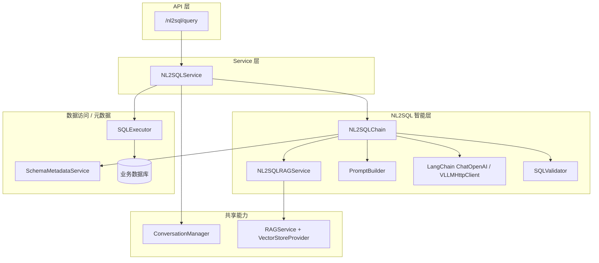
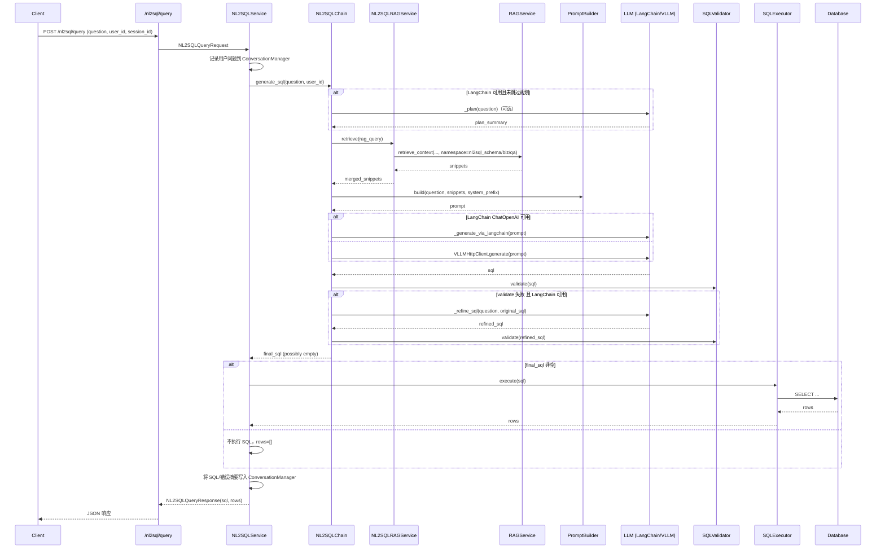
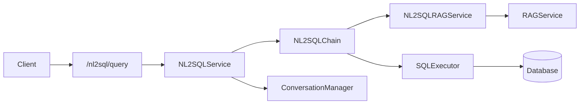

# NL2SQL 整体实现技术说明

> 本文描述**当前仓库已实现**的 NL2SQL（自然语言转 SQL）技术方案：基于 **LLM + RAG + Schema 元数据（含 DB 反射与外键提示）+ 安全执行** 的企业级实现。  
> 配套文档：`docs/NL2SQL系统概要设计.md`（总体设计）、`docs/大小模型应用技术架构与实现方案.md`（4.6 节）、`enterprise-level_transformation_docs/企业级NL2SQL实现方案.md`（企业级流程与图示）、`memory-bank/02-components.md`（组件关系）。

**基座定位**：NL2SQL 与 **通用 RAG** 同属本应用的 **基础能力**（共享向量库基座、场景化检索策略、大模型与 Prompt 注册表、日志与指标）。不同之处在于：NL2SQL 面向 **结构化业务库只读查询**，并 **单独暴露** `POST /nl2sql/query`，供外部系统直接集成；智能客服在 **`data_query`** 意图下也会调用同一 `NL2SQLService`（通常 `record_conversation=False`），与 KB RAG 分流并行。

---

## 文档结构（阅读导航）

| 章节 | 内容 |
|------|------|
| **§1 总体技术概览** | 方案总体叙述、能力表、架构图与时序图 |
| **§2 模块与文件映射** | 代码入口速查表 |
| **§3 详细说明** | 按「Schema 元数据 → RAG → Prompt → LLM → 校验与修正 → 执行 → 会话与指标」展开 |
| **§4 配置与环境变量** | 与 `AppConfig.llm`、`DatabaseConfig` 对齐 |
| **§5 HTTP API** | `/nl2sql/query` 行为说明 |
| **§6 典型调用链** | 从 HTTP 到 DB 的端到端链路 |
| **§7 与 RAG/GraphRAG 的关系** | 如何依赖通用 RAG 基座与命名空间设计 |
| **§8 可观测性与日志** | 关键路径日志字段说明（排障） |
| **§9 后续演进建议** | 与 `docs/NL2SQL系统概要设计.md` TODO 对齐 |

---

## 1. 总体技术概览

### 1.1 从使用视角看整体流程

在当前基座中，NL2SQL 的整体使用流程可以概括为两大步骤：**知识摄入 → 自然语言查询**。

1. **知识摄入：将 Schema / 业务知识 / 问答样例写入 RAG 知识库**  
   - **Schema 元数据加载**：  
     1. `SchemaMetadataService` 在启动时加载一套内置 Demo Schema（如 `orders` 表），便于无 DB 环境快速试跑；  
     2. 在接入真实数据库后，可调用 `SchemaMetadataService.refresh_from_db()`，基于 `DatabaseConfig.url` 通过 SQLAlchemy 反射真实表结构，刷新内存中的 `TableSchema` 映射。  
   - **通过通用 RAG 实现 NL2SQL 知识摄入**：  
     1. 将从 Schema/业务文档/内部知识库中整理出的文本片段（“表/字段说明”“业务规则”“NL2SQL 示例问答”等）按照类型组织为三个集合：schema 片段、biz 片段、qa 片段；  
     2. 调用 `NL2SQLRAGService.index_schema_snippets(...)` / `index_biz_knowledge(...)` / `index_qa_examples(...)`，内部会委托给 `RAGService.index_texts(..., namespace=nl2sql_schema/biz_knowledge/qa_examples)` 将片段写入通用向量库；  
     3. 这样，NL2SQL 相关知识与其他 RAG 场景共享同一个向量库实例，但通过 `namespace` 实现逻辑隔离。  
   - **关键配置与依赖**：  
     - 数据库连接：`DB_URL`（优先）；未设置时由 `DB_USER` / `DB_PASSWORD` / `DB_HOST` / `DB_NAME` 拼接，**用户名与密码会做 URL 百分号编码**（密码含 `@`、`#` 等亦安全）。手写完整 `DB_URL` 时需自行编码密码。  
     - 通用 RAG 配置：`RAG_VECTOR_STORE_TYPE`、`RAG_FAISS_INDEX_DIR`、嵌入模型相关环境变量（详见 RAG 文档）。  

2. **自然语言查询：通过 NL2SQL 实现数据查询**  
   - **调用入口**：  
     - 上游系统通过 `POST /nl2sql/query`（`app/api/nl2sql.py`），传入 `user_id`、`session_id` 和自然语言 `question`；  
     - API 层将请求交给 `NL2SQLService.query(...)`。  
   - **服务与链路调用**：  
     1. `NL2SQLService` 先使用 `ConversationManager` 记录用户问题，并打 `NL2SQL_QUERY_COUNT` 指标；  
     2. 调用 `NL2SQLChain.generate_sql(question, user_id)` 生成候选 SQL：  
        - 首次调用时 `SchemaMetadataService.refresh_from_db()` 反射真实库表/列/**外键**；失败则回退 Demo/RAG 白名单。  
        - （可选）LangChain 下 `_plan`；**默认**在已成功反射真实库时 **跳过** `_plan`（`NL2SQL_DISABLE_PLANNER_WHEN_DB_SCHEMA`，避免污染 RAG query）。  
        - `NL2SQLRAGService.retrieve(...)` 三命名空间联合检索；`parse_nl2sql_schema_snippets` 解析文档表映射等。  
        - `PromptTemplateRegistry(scene="nl2sql")`：`{{NL2SQL_SCHEMA_CATALOG}}` 注入全库目录（含 FK 提示）；`PromptBuilder` 拼装片段与输出规则。  
        - LangChain ChatOpenAI 或 `VLLMHttpClient` 生成 SQL → `normalize_sql`（去围栏、引号外空白压单行）→ `validate` / 标识符白名单 → 失败可 `_refine_sql`。  
     3. 若最终 SQL 非空，则由 `SQLExecutor.execute(sql)` 在业务数据库中执行查询，异常时记录 `NL2SQL_QUERY_ERROR_COUNT` 与错误信息到会话；  
     4. 无论 SQL 是否执行成功，均会将最终 SQL 文本追加到会话中，便于后续审计与分析。  
   - **关键配置与依赖**：  
     - 大模型：`LLM_DEFAULT_MODEL` / `LLM_DEFAULT_ENDPOINT` / `LLM_DEFAULT_API_KEY`（控制 LangChain ChatOpenAI 与 vLLM 客户端）；  
     - 数据库：同上 `DatabaseConfig`；  
     - RAG：依赖前述 NL2SQL 命名空间已完成摄入；  
     - 安全策略：可在 `SQLValidator` 中扩展更多规则。  

**一句话小结**：  
- 对于使用方来说，NL2SQL 的主要操作路径是：**先通过 NL2SQLRAGService（或 RAG 管理接口）填充 Schema/业务知识/示例问答三类命名空间 → 再通过 `/nl2sql/query` 以自然语言发起查询，由系统自动完成 RAG 检索 + Prompt 编排 + LLM 生成 + SQL 校验与执行**。 

> **典型调用链总览**  
> - **知识摄入（推荐方式）**：  
>   后台任务或管理脚本 → `SchemaMetadataService` / 业务 ETL → `NL2SQLRAGService.index_*` → `RAGService.index_texts(..., namespace=...)` → `VectorStoreProvider`（向量库）。  
>   如需通过 HTTP 统一管理，也可以配合 `/rag/ingest/texts` 接口，将 NL2SQL 相关片段以合适的 `namespace` 摄入。  
> - **自然语言查询**：  
>   `POST /nl2sql/query` → `NL2SQLService.query` → `NL2SQLChain.generate_sql`（内部：SchemaMetadataService + NL2SQLRAGService + PromptBuilder + LLM + SQLValidator）→ `SQLExecutor.execute` → 返回 `rows`。

### 1.2 能力一览表

| 能力 | 说明 |
|------|------|
| **Schema 元数据管理** | `SchemaMetadataService` 内存维护 `TableSchema` 映射，可从真实 DB 反射刷新，也内置一套 Demo Schema 便于本地调试。 |
| **NL2SQL 专用 RAG** | `NL2SQLRAGService` 使用 `RetrievalPolicy` 统一路由，在命名空间 `nl2sql_schema` / `nl2sql_biz_knowledge` / `nl2sql_qa_examples` 上做向量+图事实联合检索，并合并去重结果。 |
| **Prompt 编排** | `PromptBuilder` 按 NL2SQL 设计文档，将 Schema 片段、业务知识与示例拼装成结构化 Prompt，结合 `PromptTemplateRegistry` 中 scene=`nl2sql` 的模板。 |
| **SQL 生成链路** | `NL2SQLChain` 将问题 →（可选）规划 `_plan` → RAG 检索 → Prompt 构建 → LLM 生成 SQL → 安全校验与自我修正。 |
| **SQL 校验与执行** | `SQLValidator` 确保仅包含安全 SELECT 语句；`SQLExecutor` 基于 SQLAlchemy AsyncEngine 执行只读 SQL 并返回行列表。 |
| **服务层与 API** | `NL2SQLService` 管理链路调用、执行、会话记录与指标；`/nl2sql/query` 作为统一 HTTP 入口。 |
| **监控与可观测性** | 指标 `NL2SQL_QUERY_COUNT` / `NL2SQL_QUERY_ERROR_COUNT`；关键步骤 **INFO/WARNING** 日志（见 §8）；可选 `LangSmithTracker`。 |

### 1.3 逻辑架构图（组件关系）



### 1.4 时序图（从问题到结果）



---

## 2. 模块与文件映射

> 按“接入层 → 服务层 → 智能层 → 元数据/RAG → 数据访问 → 公共能力”顺序列出。

| 模块 | 路径 | 职责 |
|------|------|------|
| 接入 API | `app/api/nl2sql.py` | 暴露 `POST /nl2sql/query` 接口，调用 `NL2SQLService`。 |
| 服务层 | `app/services/nl2sql_service.py` | 组合 `NL2SQLChain` + `SQLExecutor` + `ConversationManager` + Prometheus 指标，提供面向 API 的 `query` 方法。 |
| NL2SQL 链路 | `app/nl2sql/chain.py` | 实现“规划（可选）→ RAG → Prompt → LLM 生成 → SQL 校验/修正”的完整 NL2SQL 流程。 |
| Schema 元数据 | `app/nl2sql/schema_service.py` | 维护内存中的 `TableSchema` 映射；支持从真实数据库反射刷新 Schema；提供 Demo Schema。 |
| NL2SQL 专用 RAG | `app/nl2sql/rag_service.py` | 使用 `RAGService` 在 `nl2sql_schema` / `nl2sql_biz_knowledge` / `nl2sql_qa_examples` 命名空间上做多命名空间联合检索。 |
| Prompt 构建器 | `app/nl2sql/prompt_builder.py` | 按 NL2SQL 设计，将问题、Schema 片段与业务知识拼为结构化 Prompt；对接 `PromptTemplateRegistry`。 |
| SQL 校验 | `app/nl2sql/validator.py` | 只读 SQL 校验（确保仅 SELECT 等安全语句）。 |
| SQL 执行 | `app/nl2sql/executor.py` | 基于 SQLAlchemy AsyncEngine 执行只读 SQL，并返回行列表。 |
| 请求/响应模型 | `app/models/nl2sql.py` | `NL2SQLQueryRequest` / `NL2SQLQueryResponse` Pydantic 模型。 |
| 共享配置 | `app/core/config.py` | `AppConfig.llm`（大模型 endpoint 等）；`DatabaseConfig`（`DB_URL` 等）被 `SchemaMetadataService` / `SQLExecutor` 使用。 |
| 会话与指标 | `app/conversation/manager.py`、`app/core/metrics.py` | 会话记录与 Prometheus 指标（`NL2SQL_QUERY_COUNT` / `NL2SQL_QUERY_ERROR_COUNT`）。 |

---

## 3. 详细说明

本章按数据流顺序建议阅读：**Schema 元数据（3.1）→ RAG（3.2）→ Prompt（3.3）→ LLM 调用（3.4）→ SQL 校验与执行（3.5）→ 服务层与会话（3.6）**。

### 3.1 Schema 元数据服务（SchemaMetadataService）

- 文件：`app/nl2sql/schema_service.py`  
- 职责：
  - 在内存中维护 `TableSchema` 映射（表名、列、类型、注释）；  
  - 提供 `list_tables()` / `add_table()` 等接口；  
  - 通过 `refresh_from_db()` 使用 SQLAlchemy 反射真实数据库 Schema。
- 特性：
  - 默认加载一套 Demo Schema（`orders` 表）便于在无 DB 情况本地调试；  
  - `refresh_from_db()` 使用 `DatabaseConfig.url` 连接；反射成功后日志输出 **表数量、外键边总数、表名样例**；`TableSchema` 含 **`foreign_keys`**（本地列 → 引用表.引用列），供 catalog 行 `FK:...` 展示。

### 3.2 NL2SQL 专用 RAG（NL2SQLRAGService）

- 文件：`app/nl2sql/rag_service.py`  
- 命名空间设计：
  - `NS_SCHEMA = "nl2sql_schema"`：表/字段结构说明片段；  
  - `NS_BIZ = "nl2sql_biz_knowledge"`：业务规则、口径说明等；  
  - `NS_QA = "nl2sql_qa_examples"`：高质量 NL2SQL 问答样例。
- 摄入接口：

```python
index_schema_snippets(snippets: List[str])
index_biz_knowledge(snippets: List[str])
index_qa_examples(snippets: List[str])
```

- 检索接口：
  - `retrieve_chunks` / `retrieve`：三命名空间分别检索，`nl2sql_schema` 可使用更大 `top_k`（`NL2SQL_SCHEMA_NAMESPACE_TOP_K`）；合并去重；日志输出 **检索模式、各 namespace 向量/图条数、去重前后总数**。

> 说明：存在规划摘要时，`rag_query` 为「规划 + 原问题」拼接；DB 反射成功时默认不跑规划，通常即以用户原问题检索。

### 3.3 Prompt 编排与模板（PromptBuilder + PromptTemplateRegistry）

- 文件：`app/nl2sql/prompt_builder.py` + `app/llm/prompt_registry.py`  
- 职责：
  - 根据问题、RAG 检索到的 Schema/业务/示例片段，以及 Prompt 模板（scene=`nl2sql`），构造最终送入 LLM 的 Prompt 文本；
  - 结构与 `docs/NL2SQL系统概要设计.md` 中的 Prompt 设计一致（System Prompt + RAG 片段 + User 问题）。
- 行为：
  - 通过 `PromptTemplateRegistry` 读取 scene=`nl2sql` 的模板（如 `configs/prompts.yaml` 中 `v2`），支持占位符 **`{{NL2SQL_SCHEMA_CATALOG}}`**：由运行时 **全库 enriched catalog**（或仅 RAG hints / 降级文案）替换；  
  - `PromptBuilder.build(..., schema_catalog=...)` 在无占位符时仍可附加 catalog 段；  
  - 版本由 `NL2SQL_PROMPT_DEFAULT_VERSION` 控制，便于 A/B。

### 3.4 NL2SQLChain：规划 + RAG + LLM 生成

- 文件：`app/nl2sql/chain.py`  
- 构造函数依赖：
  - `SchemaMetadataService`、`NL2SQLRAGService`、`PromptBuilder`、`VLLMHttpClient`、`SQLValidator`、`PromptTemplateRegistry`；
  - 可选 `LangChain ChatOpenAI` 与 `LangSmithTracker`。
- 生成 SQL 主流程（`generate_sql(question, user_id)`）：
  1. **`_ensure_schema_refreshed_once`**：首次调用 `refresh_from_db()`；失败则打 WARNING，后续依赖 RAG/Demo。  
  2. **`_db_schema_available`**：若仅有 Demo `orders` 视为未接入真实库。  
  3. **（可选）`_plan`**：LangChain 可用 **且** 未满足「禁用规划 + 真实库」时执行；否则跳过。  
  4. **RAG**：`retrieve(rag_query)`，`rag_query` 含规划摘要时与问题拼接。  
  5. **白名单**：真实库 → 表/列来自反射；否则从片段抽取。  
  6. **Prompt**：替换 `{{NL2SQL_SCHEMA_CATALOG}}` 或附加 `schema_catalog`；`build` 完整 prompt。  
  7. **LLM 生成** → **`normalize_sql`**（围栏、引号外空白折叠单行）。  
  8. **校验**：`validate` + `validate_identifiers`（可选强列校验）；失败则 `_refine_sql` 再验。  
  9. **LangSmith（可选）**。

### 3.5 SQLValidator 与 SQLExecutor

- 文件：`app/nl2sql/validator.py`、`app/nl2sql/executor.py`  
- `SQLValidator`：
  - 只读约束（SELECT / WITH），禁止危险关键字；  
  - `normalize_sql`：**引号感知的空白折叠**（字符串/引号标识符内部保留，外部压成单行）；去除 markdown ```sql``` 围栏；  
  - `validate_identifiers`：表/列白名单（真实库成功时启用列级更强校验）。  
- `SQLExecutor`：
  - 使用 `DatabaseConfig.url` 创建 AsyncEngine；  
  - **INFO** 日志：`sql_len`、预览、**row_count**；失败 **WARNING** 带堆栈。

### 3.6 服务层与会话（NL2SQLService + ConversationManager）

- 文件：`app/services/nl2sql_service.py`、`app/conversation/manager.py`  
- 行为：
  - 在 `query` 开始时，将用户问题写入会话（方便后续回放与分析）；  
  - 调用 `NL2SQLChain.generate_sql(...)` 生成 SQL；  
  - 若 SQL 非空，则通过 `SQLExecutor.execute` 执行并捕获异常：  
    - 执行失败则增加 `NL2SQL_QUERY_ERROR_COUNT` 并将错误摘要写入会话；  
  - 不论执行成功与否，最后将 SQL 文本写入会话（用于记录用户交互中“模型给出的 SQL”）；  
  - 返回 `NL2SQLQueryResponse(sql, rows)`。

---

## 4. 配置与环境变量

### 4.1 大模型与 NL2SQL 相关配置

- **`AppConfig.llm`**（`app/core/config.py`）：  
  - `LLM_DEFAULT_MODEL`：默认逻辑模型 ID；  
  - `LLM_DEFAULT_ENDPOINT`：vLLM 或其他 OpenAI 兼容服务地址；  
  - `LLM_DEFAULT_API_KEY`：大模型 API Key。
- 这些配置被 `VLLMHttpClient` 与 `NL2SQLChain` 的 LangChain ChatOpenAI 初始化使用。

### 4.2 数据库配置（DatabaseConfig）

- 环境变量（配合 `DatabaseConfig` 使用）：

| 变量 | 说明 | 默认（示例） |
|------|------|-------------|
| `DB_USER` / `DB_PASSWORD` | DB 用户/密码 | 见 `.env.example`；拼接 URL 时 **自动 URL 编码** |
| `DB_HOST` / `DB_NAME` | 主机与库名 | 见部署环境 |
| `DB_URL` | 完整连接串 | 优先；手写时密码中的 `@` 须为 `%40` 等编码形式 |

- `SchemaMetadataService.refresh_from_db()` 与 `SQLExecutor` 均通过 `get_app_config().db` 获取连接信息。

其他常用：`NL2SQL_DISABLE_PLANNER_WHEN_DB_SCHEMA`、`NL2SQL_PROMPT_DEFAULT_VERSION`、`NL2SQL_SCHEMA_NAMESPACE_TOP_K`、`NL2SQL_SCHEMA_CATALOG_MAX_TABLES` / `MAX_COLS`。

---

## 5. HTTP API（NL2SQL 管理）

- **`POST /nl2sql/query`**（`app/api/nl2sql.py`）  
  - Request：`NL2SQLQueryRequest`（`user_id`、`session_id`、`question`）。  
  - Response：`NL2SQLQueryResponse`（`sql`、`rows`）。  
  - 行为：调用 `NL2SQLService.query` 执行完整 NL2SQL 流程。

---

## 6. 典型调用链小结

高层视角（简化）：



---

## 7. 与通用 RAG / GraphRAG 的关系

- NL2SQLRAGService 复用 **通用 RAG 基座**（`RetrievalPolicy` + `RAGService` + `VectorStoreProvider` + 可选 `GraphQueryService`）：
  - 通过 `namespace` 将 NL2SQL 的 Schema / 业务知识 / Q&A 与其他 RAG 场景隔离；  
  - 在未来切换为 HybridRAGService 时，可通过配置替换底层 `RAGService` 实例，而不影响 NL2SQL 代码。
- 当前 NL2SQLRAGService 已可按统一策略层决策接入图事实召回（可选）；  
  - 进一步演进方向是将 Schema 元数据结构化图谱化（Schema GraphRAG），用于更强的跨表关系推理。

---

## 8. 可观测性与日志（排障）

以下模块在关键路径输出结构化日志（默认 INFO，部分 DEBUG），可用 `user_id` / `session_id` / 时间关联一次请求：

| 模块 | 典型日志含义 |
|------|----------------|
| `app.api.nl2sql` | HTTP 起止、`question_len`、预览、`sql_len`、`row_count` |
| `app.services.nl2sql_service` | `query` 开始、空 SQL 警告、执行成功/异常 |
| `app.nl2sql.chain` | 反射后表数量、`schema_from_db`、是否跳过 planner、RAG snippet 数、白名单规模、catalog 来源与 prompt 长度、LLM 后端、校验失败原因、`refine_sql`、成功摘要 |
| `app.nl2sql.rag_service` | 检索模式、各 namespace 向量/图条数、去重前后 chunk 数 |
| `app.nl2sql.executor` | SQL 预览、`row_count` 或执行异常 |
| `app.nl2sql.schema_service` | 反射开始/成功（表数、FK 边数、表名样例）或异常 |

---

## 9. 后续演进建议

结合 `docs/NL2SQL系统概要设计.md`，当前 NL2SQL 实现已是**可落地的企业级链路**，后续可从以下方向演进：

1. **增强 RAG 与 Schema 语义**：  
   - 将 `SchemaMetadataService` 的结构化信息（表/列/约束）系统性转化为 RAG 文本片段，完善 `nl2sql_schema` 命名空间；  
   - 为 `nl2sql_biz_knowledge` 与 `nl2sql_qa_examples` 设计管理接口与数据填充流程。
2. **细化 Prompt 策略**：  
   - 将不同业务域（如订单、用户、财务）的 NL2SQL Prompt 版本化，并与 `PromptTemplateRegistry` 集成 A/B 测试；  
   - 针对多表复杂问题，引入“显式规划 + 显式 Thought 输出 + SQL 生成”组合策略，提升可解释性。
3. **规划与自我修正增强**：  
   - 在 `_plan` 中返回更结构化的规划结果，并用于优化 RAG 检索 query；  
   - 在 `_refine_sql` 中加入执行错误信息作为上下文（例如语法错误信息、权限错误），实现针对性的自我修正。
4. **安全与审计**：  
   - 扩展 `SQLValidator` 的规则集，支持表级/字段级权限与资源约束；  
   - 为 SQL 执行增加审计日志与“干跑（dry-run）”模式等能力。
5. **GraphRAG 结合**：  
   - 在后续版本中，将数据库 Schema 映射为图结构（表/列为节点、外键/业务关系为边），在 NL2SQL 中引入 GraphRAG，改善跨表/复杂 join 推理能力（当前已通过 **FK catalog + RAG** 提供基础关联提示）。

---

*若对上述实现有修改（尤其是 `app/nl2sql/*`、`app/core/config.py` 中与 NL2SQL 相关的配置），请同步更新本说明文档及 `enterprise-level_transformation_docs/企业级NL2SQL实现方案.md`。*

