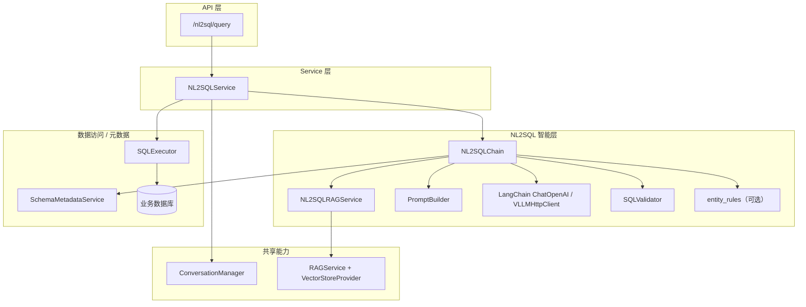
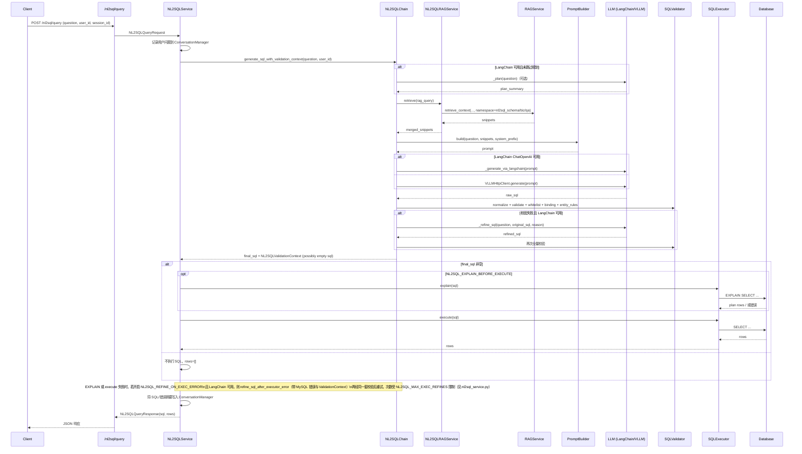
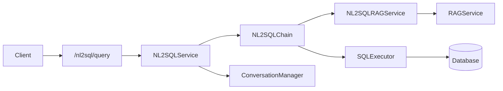

# NL2SQL 整体实现技术说明

> 本文描述**当前仓库已实现**的 NL2SQL（自然语言转 SQL）技术方案：基于 **LLM + RAG + Schema 元数据（含 DB 反射与外键提示）+ 可选语义对齐/Schema 链接 + 安全执行** 的企业级实现。  
> 配套文档：`docs/NL2SQL系统概要设计.md`（总体设计）、**`docs/NL2SQL缓存实现方案.md`（生成阶段 L2/L1 缓存与键策略）**、**`docs/NL2SQL自然语言时间和范围窗口解析&改写改造落地方案.md`（问句时间/范围解析）**、`docs/大小模型应用技术架构与实现方案.md`（4.6 节）、`enterprise-level_transformation_docs/企业级NL2SQL基座实现方案.md`（企业级流程与图示）、`enterprise-level_transformation_docs/NL2SQL当前完整实现逻辑说明-代码对照版.md`（代码行为明细）、`docs/基于地降所项目改造/NL2SQL基座改造.md`（多业务域/语义链接设计与验收）。

**基座定位**：NL2SQL 与 **通用 RAG** 同属本应用的 **基础能力**。面向 **结构化业务库只读查询**，暴露 `POST /nl2sql/query`；客服 `data_query`、综合分析 `run-with-nl2sql*` / 看图诊断 NL 臂复用同一 `NL2SQLService`。  
**多业务域**：一套进程一个 domain（`NL2SQL_BUSINESS_DOMAIN=boiler_four_tube | subsidence`）→ `configs/nl2sql_business/<domain>/`；不设运行时双管线，差异在配置包（方言、表白名单、语义开关、Prompt 版本、范围词表）。

---

## 文档结构（阅读导航）

| 章节 | 内容 |
|------|------|
| **§1 总体技术概览** | 方案总体叙述、能力表、架构图与时序图 |
| **§2 模块与文件映射** | 代码入口速查表 |
| **§3 详细说明** | 按「Schema 元数据 → RAG → Prompt → **缓存（§3.4.1）** → LLM → **问句意图与 SQL 改写（§3.4.2）** → 校验与修正 → 执行 → 会话与指标」展开 |
| **§4 配置与环境变量** | 与 `AppConfig.llm`、`DatabaseConfig` 对齐 |
| **§5 HTTP API** | `/nl2sql/query` 行为说明 |
| **§6 典型调用链** | 从 HTTP 到 DB 的端到端链路 |
| **§7 与 RAG/GraphRAG 的关系** | 如何依赖通用 RAG 基座与命名空间设计 |
| **§8 可观测性与日志** | 关键路径日志字段说明（排障） |
| **§9 后续演进建议** | 与 `docs/NL2SQL系统概要设计.md` TODO 对齐 |

---

## 0. 前提重要说明
> 效果较好的 NL2SQL 依赖：RAG 知识库 + 数据库反射；地降开启语义链接后另加 **语义资产 + LinkedSchema**。
1. 部署选定 `NL2SQL_BUSINESS_DOMAIN`，加载 `configs/nl2sql_business/<domain>/profile.yaml`（表白名单、JOIN、方言、词表、Prompt、语义开关等）。  
2. 业务库：host/port/库/用户默认来自 profile；**密码仅** `DB_PASSWORD` / `DB_URL`。显式 `DB_*` / `NL2SQL_*` 优先于 profile。PostgreSQL 镜像须含 **asyncpg**。  
3. RAG 摄入三 namespace：`nl2sql_schema`、`nl2sql_biz_knowledge`、`nl2sql_qa_examples`（地降源文件见 `configs/nl2sql_business/subsidence/rag/`）。

## 1. 总体技术概览

### 1.1 从使用视角看整体流程

在当前基座中，NL2SQL 的整体使用流程可以概括为两大步骤：**知识摄入 → 自然语言查询**。

1. **知识摄入：将 Schema / 业务知识 / 问答样例写入 RAG 知识库**  
   - **Schema 元数据加载**：  
     1. `SchemaMetadataService` 在启动时加载一套内置 Demo Schema（如 `orders` 表），便于无 DB 环境快速试跑；  
     2. 在接入真实数据库后，可调用 `SchemaMetadataService.refresh_from_db()`，基于 `DatabaseConfig.url` 通过 SQLAlchemy 反射真实表结构，刷新内存中的 `TableSchema` 映射。  
   - **通过通用 RAG 实现 NL2SQL 知识摄入**：  
     1. 将从 Schema/业务文档/内部知识库中整理出的文本片段（“表/字段说明”“业务规则”“NL2SQL 示例问答”等）按照类型组织为三个集合：schema 片段、biz 片段、qa 片段；  
     2. 调用 `NL2SQLRAGService.index_schema_snippets(...)` / `index_biz_knowledge(...)` / `index_qa_examples(...)`，内部会委托给 `RAGService.index_texts(..., namespace=nl2sql_schema/biz_knowledge/qa_examples)` 将片段写入通用向量库；  
     3. 这样，NL2SQL 相关知识与其他 RAG 场景共享同一个向量库实例，但通过 `namespace` 实现逻辑隔离。  
   - **关键配置与依赖**：  
     - 数据库连接：`DB_URL`（优先）；未设置时由 `DB_USER` / `DB_PASSWORD` / `DB_HOST` / `DB_NAME` 拼接，**用户名与密码会做 URL 百分号编码**（密码含 `@`、`#` 等亦安全）。手写完整 `DB_URL` 时需自行编码密码。  
     - 通用 RAG 配置：`RAG_VECTOR_STORE_TYPE`、`RAG_FAISS_INDEX_DIR`、嵌入模型相关环境变量（详见 RAG 文档）。  

2. **自然语言查询：通过 NL2SQL 实现数据查询**  
   - **调用入口**：  
     - 上游系统通过 `POST /nl2sql/query`（`app/api/nl2sql.py`），传入 `user_id`、`session_id` 和自然语言 `question`；  
     - API 层将请求交给 `NL2SQLService.query(...)`。  
   - **服务与链路调用**：  
     1. `NL2SQLService` 先使用 `ConversationManager` 记录用户问题，并打 `NL2SQL_QUERY_COUNT` 指标；  
     2. 调用 `NL2SQLChain.generate_sql_with_validation_context(...)` 生成候选 SQL：  
        - **`resolve_question_intent`**（时间规则 + 范围；地降走 `scope_parser_subsidence`）。  
        - **（可选）`align_semantics` → `link_schema`**：地降默认开；`linked_only` 收窄 catalog；`on_link_failure=refuse` 时提前结束并填 **`gen_fail_reason=link_failed:…`**。  
        - `SchemaMetadataService.refresh_from_db()` 反射（MySQL/TiDB 或 PostgreSQL）；失败回退 Demo/RAG。  
        - （可选）`_plan`；真实库默认跳过（`NL2SQL_DISABLE_PLANNER_WHEN_DB_SCHEMA`）。  
        - `NL2SQLRAGService.retrieve` 三 namespace；可选实体规则。  
        - Prompt（`v2` / `v2_subsidence`）+ catalog（linked 或宽表白名单）→ LLM → `normalize_sql` → **时间/范围改写**（含 **`sql_dialect.adapt_time_window`**）→ 多层校验 / `_refine_sql`。  
     3. 执行闭环：可选 EXPLAIN → SELECT；失败可 `refine_sql_after_executor_error`（有界）。  
     4. 响应含 `sql`/`rows`，可选 `parsed_intent`、`gen_fail_reason`。  
   - **关键配置与依赖**：  
     - 大模型：`LLM_DEFAULT_MODEL` / `LLM_DEFAULT_ENDPOINT` / `LLM_DEFAULT_API_KEY`（控制 LangChain ChatOpenAI 与 vLLM 客户端）；  
     - 数据库：同上 `DatabaseConfig`；  
     - RAG：依赖前述 NL2SQL 命名空间已完成摄入；  
     - 安全策略：可在 `SQLValidator` 中扩展更多规则。  

**一句话小结**：  
- 对于使用方来说，NL2SQL 的主要操作路径是：**先通过 NL2SQLRAGService（或 RAG 管理接口）填充 Schema/业务知识/示例问答三类命名空间 → 再通过 `/nl2sql/query` 以自然语言发起查询，由系统自动完成 RAG 检索 + Prompt 编排 + LLM 生成 + SQL 校验与执行**。 

> **典型调用链总览**  
> - **知识摄入（推荐方式）**：  
>   后台任务或管理脚本 → `SchemaMetadataService` / 业务 ETL → `NL2SQLRAGService.index_*` → `RAGService.index_texts(..., namespace=...)` → `VectorStoreProvider`（向量库）。  
>   如需通过 HTTP 统一管理，也可以配合 `/rag/ingest/texts` 接口，将 NL2SQL 相关片段以合适的 `namespace` 摄入。  
> - **自然语言查询**：  
>   `POST /nl2sql/query` → `NL2SQLService.query` → `NL2SQLChain.generate_sql_with_validation_context`（内部：Schema + RAG + Prompt + LLM + **多层 SQLValidator / entity_rules**）→ 可选 **`SQLExecutor.explain`** → **`SQLExecutor.execute`**（失败可 **refine 闭环**）→ 返回 `rows`。

### 1.2 能力一览表

| 能力 | 说明 |
|------|------|
| **Schema 元数据管理** | `SchemaMetadataService` 内存维护 `TableSchema` 映射，可从真实 DB 反射刷新，也内置一套 Demo Schema 便于本地调试。 |
| **NL2SQL 专用 RAG** | `NL2SQLRAGService` 使用 `RetrievalPolicy` 统一路由，在命名空间 `nl2sql_schema` / `nl2sql_biz_knowledge` / `nl2sql_qa_examples` 上做向量+图事实联合检索，并合并去重结果。 |
| **Prompt 编排** | `PromptBuilder` 按 NL2SQL 设计文档，将 Schema 片段、业务知识与示例拼装成结构化 Prompt，结合 `PromptTemplateRegistry` 中 scene=`nl2sql` 的模板。 |
| **业务配置包** | `NL2SQL_BUSINESS_DOMAIN` → `nl2sql_business_profile` + `intent_config`；表白名单/方言/语义开关等可被显式 env 覆盖。 |
| **语义对齐 + Schema 链接** | `semantic_layer.align_semantics` → `schema_linker.link_schema`；catalog 模式 `linked_only` / `linked_prefer` / `legacy_wide`；失败 `refuse` \| `best_effort`。地降默认开，锅炉默认关。 |
| **SQL 生成链路** | 意图 →（可选）语义/链接 → Schema →（可选）`_plan` → RAG → **L2→L1** → Prompt → LLM → **方言+范围改写** → 校验 / `_refine_sql`；执行期 `refine_sql_after_executor_error`。 |
| **生成阶段缓存** | `policy_fp` 含 domain、allowlist 指纹、catalog mode、**semantic_version**；详见 **`docs/NL2SQL缓存实现方案.md`**。 |
| **问句意图（时间+范围）** | 时间规则；范围锅炉 rule/LLM，地降 `scope_parser_subsidence`；改写 `@t_*`、`@unit/@device…` 或 `@district/@station_*`。 |
| **SQL 方言** | `sql_dialect.adapt_time_window`：MySQL 时间表达式 → PostgreSQL（地降）。 |
| **业务实体规则** | `entity_rules.py`：否定规则（可走 profile `entity_rules_file`）。 |
| **SQL 校验与执行** | `SQLValidator` + `SQLExecutor`（PG 建连不加 MySQL `charset`）。 |
| **服务层与 API** | `NL2SQLService`；响应可含 **`gen_fail_reason`**（如 `link_failed:…`）。 |
| **监控与可观测性** | `NL2SQL_QUERY_COUNT` / `ERROR`；关键路径日志（§8）。 |

### 1.3 逻辑架构图（组件关系）


```mermaid
flowchart TB
    subgraph API["API 层"]
        NL2SQLAPI["/nl2sql/query"]
    end

    subgraph Service["Service 层"]
        NService["NL2SQLService"]
    end

    subgraph Chain["NL2SQL 智能层"]
        NChain["NL2SQLChain"]
        RAG["NL2SQLRAGService"]
        PB["PromptBuilder"]
        LLM["LangChain ChatOpenAI / VLLMHttpClient"]
        VAL["SQLValidator"]
        ER["entity_rules（可选）"]
    end

    subgraph Data["数据访问 / 元数据"]
        SchemaSvc["SchemaMetadataService"]
        Exec["SQLExecutor"]
        DB[("业务数据库")]
    end

    subgraph Shared["共享能力"]
        Conv["ConversationManager"]
        RAGBase["RAGService + VectorStoreProvider"]
    end

    NL2SQLAPI --> NService
    NService --> NChain
    NService --> Exec
    NService --> Conv

    NChain --> SchemaSvc
    NChain --> RAG
    NChain --> PB
    NChain --> LLM
    NChain --> VAL
    NChain --> ER

    RAG --> RAGBase
    Exec --> DB
```

### 1.4 时序图（从问题到结果）


```mermaid
sequenceDiagram
    participant Client
    participant API as /nl2sql/query
    participant Svc as NL2SQLService
    participant Chain as NL2SQLChain
    participant RAG as NL2SQLRAGService
    participant RBase as RAGService
    participant PB as PromptBuilder
    participant LLM as LLM (LangChain/VLLM)
    participant Val as SQLValidator
    participant Exec as SQLExecutor
    participant DB as Database

    Client->>API: POST /nl2sql/query (question, user_id, session_id)
    API->>Svc: NL2SQLQueryRequest
    Svc->>Svc: 记录用户问题到 ConversationManager
    Svc->>Chain: generate_sql_with_validation_context(question, user_id)

    alt LangChain 可用且未跳过规划
        Chain->>LLM: _plan(question)（可选）
        LLM-->>Chain: plan_summary
    end

    Chain->>RAG: retrieve(rag_query)
    RAG->>RBase: retrieve_context(..., namespace=nl2sql_schema/biz/qa)
    RBase-->>RAG: snippets
    RAG-->>Chain: merged_snippets

    Chain->>PB: build(question, snippets, system_prefix)
    PB-->>Chain: prompt

    alt LangChain ChatOpenAI 可用
        Chain->>LLM: _generate_via_langchain(prompt)
    else
        Chain->>LLM: VLLMHttpClient.generate(prompt)
    end
    LLM-->>Chain: raw_sql

    Chain->>Val: normalize + validate + whitelist + binding + entity_rules
    alt 校验失败 且 LangChain 可用
        Chain->>LLM: _refine_sql(question, original_sql, reason)
        LLM-->>Chain: refined_sql
        Chain->>Val: 再次全量校验
    end
    Chain-->>Svc: final_sql + NL2SQLValidationContext (possibly empty sql)

    alt final_sql 非空
        opt NL2SQL_EXPLAIN_BEFORE_EXECUTE
            Svc->>Exec: explain(sql)
            Exec->>DB: EXPLAIN SELECT ...
            DB-->>Exec: plan rows / 或错误
        end
        Svc->>Exec: execute(sql)
        Exec->>DB: SELECT ...
        DB-->>Exec: rows
        Exec-->>Svc: rows
    else
        Svc->>Svc: 不执行 SQL，rows=[]
    end

    Note over Svc,Chain: EXPLAIN 或 execute 失败时，若开启 NL2SQL_REFINE_ON_EXEC_ERROR\n且 LangChain 可用，则 refine_sql_after_executor_error（带 MySQL 错误与 ValidationContext）\n再经同一套校验后重试，次数受 NL2SQL_MAX_EXEC_REFINES 限制（见 nl2sql_service.py）

    Svc->>Svc: 将 SQL/错误摘要写入 ConversationManager
    Svc-->>API: NL2SQLQueryResponse(sql, rows)
    API-->>Client: JSON 响应
```

---

## 2. 模块与文件映射

> 按“接入层 → 服务层 → 智能层 → 元数据/RAG → 数据访问 → 公共能力”顺序列出。

| 模块 | 路径 | 职责 |
|------|------|------|
| 接入 API | `app/api/nl2sql.py` | `POST /nl2sql/query` → `NL2SQLService`。 |
| 服务层 | `app/services/nl2sql_service.py` | Chain + Executor + 会话 + 指标；填充 **`gen_fail_reason`**。 |
| 业务配置包 | `nl2sql_business_profile.py`、`intent_config.py` | domain → profile；与 `config.py` 合并 DB/NL2SQL 默认。 |
| NL2SQL 链路 | `app/nl2sql/chain.py` | 意图 → 语义/链接 → Schema/RAG/缓存 → Prompt → LLM → 改写 → 校验/refine。 |
| 语义层 | `semantic_layer.py` | `align_semantics` → `parsed_intent.semantic`；`semantic_version_fingerprint`。 |
| Schema 链接 | `schema_linker.py` | `link_schema` → LinkedSchema；catalog 收窄；refuse/best_effort。 |
| SQL 方言 | `sql_dialect.py` | `adapt_time_window`（MySQL→PG）。 |
| Schema 元数据 | `schema_service.py` | DB 反射（PG/MySQL）；Demo Schema。 |
| NL2SQL 专用 RAG | `rag_service.py` | 三 namespace 联合检索。 |
| Prompt 构建器 | `prompt_builder.py` | scene=`nl2sql`（`v2` / `v2_subsidence`）；可注入 semantic/link 摘要。 |
| SQL 校验 / 实体规则 | `validator.py`、`entity_rules.py` | 只读、白名单、列–表绑定、否定规则。 |
| 问句意图 | `question_intent.py`、`time_intent_display.py`、`scope_parser_rule.py`、`scope_parser_llm.py`、`scope_parser_subsidence.py` | 时间 + 范围（锅炉/地降）。 |
| 范围改写 | `scope_sql_rewrite.py` | `@unit/@device…` 或 `@district/@station_*`。 |
| SQL 执行 | `executor.py` | `explain` / `execute`。 |
| 请求/响应 | `app/models/nl2sql.py` | `NL2SQLQueryRequest` / `Response`（含 `gen_fail_reason`）。 |
| 共享配置 | `app/core/config.py` | LLM / `DatabaseConfig` / Analysis NL2SQL 开关。 |
| 会话与指标 | `conversation/manager.py`、`core/metrics.py` | 会话与 Prometheus。 |

---

## 3. 详细说明

本章按数据流顺序建议阅读：**Schema 元数据（3.1）→ RAG（3.2）→ Prompt（3.3）→ LLM 调用（3.4）→ SQL 校验与执行（3.5）→ 服务层与会话（3.6）**。

### 3.1 Schema 元数据服务（SchemaMetadataService）

- 文件：`app/nl2sql/schema_service.py`  
- 职责：
  - 在内存中维护 `TableSchema` 映射（表名、列、类型、注释）；  
  - 提供 `list_tables()` / `add_table()` 等接口；  
  - 通过 `refresh_from_db()` 使用 SQLAlchemy 反射真实数据库 Schema。
- 特性：
  - 默认加载一套 Demo Schema（`orders` 表）便于在无 DB 情况本地调试；  
  - `refresh_from_db()` 使用 `DatabaseConfig.url` 连接；反射成功后日志输出 **表数量、外键边总数、表名样例**；`TableSchema` 含 **`foreign_keys`**（本地列 → 引用表.引用列），供 catalog 行 `FK:...` 展示。

### 3.2 NL2SQL 专用 RAG（NL2SQLRAGService）

- 文件：`app/nl2sql/rag_service.py`  
- 命名空间设计：
  - `NS_SCHEMA = "nl2sql_schema"`：表/字段结构说明片段；  
  - `NS_BIZ = "nl2sql_biz_knowledge"`：业务规则、口径说明等；  
  - `NS_QA = "nl2sql_qa_examples"`：高质量 NL2SQL 问答样例。
- 摄入接口：

```python
index_schema_snippets(snippets: List[str])
index_biz_knowledge(snippets: List[str])
index_qa_examples(snippets: List[str])
```

- 检索接口：
  - `retrieve_chunks` / `retrieve`：三命名空间分别检索，`nl2sql_schema` 可使用更大 `top_k`（`NL2SQL_SCHEMA_NAMESPACE_TOP_K`）；合并去重；日志输出 **检索模式、各 namespace 向量/图条数、去重前后总数**。
  - **`nl2sql_qa_context`（可选）**：当配置 **`NL2SQL_QA_FILTER_ENABLED`**（默认开启）且当前请求已计算 **数据源 / schema 指纹** 时传入，对 **`nl2sql_qa_examples`** 命中按元数据过滤（系统自动写入项必须指纹匹配；无指纹的旧人工 QA 受 **`NL2SQL_QA_INCLUDE_LEGACY_UNSCOPED`** 控制）。QA 命名空间会先 **prefetch**（**`NL2SQL_QA_RAG_PREFETCH_MULT`**）再过滤截断到 **`NL2SQL_RAG_MAX_QA_CHUNKS`**。
- **QA 向量闭环（可选）**：**`NL2SQL_QA_FEEDBACK_ENABLED=true`** 时，校验通过后写入 **`nl2sql_qa_examples`**；去重 **五元组**（含 **`plan_template_version`**，与综合分析 plan 模板 v1/v2 对齐）。运维：**`GET /rag/nl2sql-auto-qa`**（支持按类型/q*/plan 版本筛选）、**`PATCH /rag/nl2sql-auto-qa`**。见 **`docs/NL2SQL缓存实现方案.md`** §七 ter。

> 说明：存在规划摘要时，`rag_query` 为「规划 + 原问题」拼接；DB 反射成功时默认不跑规划，通常即以用户原问题检索。

### 3.3 Prompt 编排与模板（PromptBuilder + PromptTemplateRegistry）

- 文件：`app/nl2sql/prompt_builder.py` + `app/llm/prompt_registry.py`  
- 职责：
  - 根据问题、RAG 检索到的 Schema/业务/示例片段，以及 Prompt 模板（scene=`nl2sql`），构造最终送入 LLM 的 Prompt 文本；
  - 结构与 `docs/NL2SQL系统概要设计.md` 中的 Prompt 设计一致（System Prompt + RAG 片段 + User 问题）。
- 行为：
  - 通过 `PromptTemplateRegistry` 读取 scene=`nl2sql` 的模板（如 `configs/prompts.yaml` 中 `v2`），支持占位符 **`{{NL2SQL_SCHEMA_CATALOG}}`**：由运行时 **全库 enriched catalog**（或仅 RAG hints / 降级文案）替换；  
  - `PromptBuilder.build(..., schema_catalog=...)` 在无占位符时仍可附加 catalog 段；  
  - 版本由 `NL2SQL_PROMPT_DEFAULT_VERSION` 控制，便于 A/B。

### 3.4 NL2SQLChain：规划 + RAG + LLM 生成

- 文件：`app/nl2sql/chain.py`  
- 构造函数依赖：
  - `SchemaMetadataService`、`NL2SQLRAGService`、`PromptBuilder`、`VLLMHttpClient`、`SQLValidator`、`PromptTemplateRegistry`；
  - 可选 `LangChain ChatOpenAI` 与 `LangSmithTracker`。
- 生成 SQL 主流程（**`generate_sql_with_validation_context`**）：
  1. **`resolve_question_intent`**：时间规则 + 范围（锅炉 rule/LLM；地降 `scope_parser_subsidence`；`confirmed_scope` → `human_confirmed`）。  
  2. **（可选）`align_semantics` / `link_schema`**：`NL2SQL_SEMANTIC_LINK_ENABLED`；refuse 时返回空 SQL + `gen_fail_reason`。  
  3. **`_ensure_schema_refreshed_once`**：`refresh_from_db()`（PG/MySQL）。  
  4. **（可选）`_plan`**：真实库默认跳过。  
  5. **RAG** `retrieve`（可带 QA 指纹上下文）。  
  6. **白名单 / catalog**：按 `schema_link_catalog_mode` 收窄或宽表白名单；`table_columns`；实体规则。  
  7. **可选 L2→L1**（`compute_nl2sql_policy_fp` 含 domain / semantic_version 等）。  
  8. **Prompt**（`v2`/`v2_subsidence`）+ catalog + 可选 semantic/link 注入 → LLM → `normalize_sql`。  
  9. **改写**：时间占位符 + `sql_dialect.adapt_time_window` + `scope_sql_rewrite`。  
  10. **`_validate_sql`**；失败可 `_refine_sql`。  
  11. 返回 `(sql, NL2SQLValidationContext)`。

#### 生成阶段缓存（L2 + L1，可选）

- **触发条件**：**`NL2SQL_CACHE_ENABLED=true`**（且应用配置中存在 **`DatabaseConfig`**）；**L1** 另需 **`NL2SQL_L1_CACHE_ENABLED=true`**（默认开启）。配置模型：`app/core/config.py` · **`AnalysisConfig.nl2sql_cache_*`** / **`nl2sql_l1_cache_enabled`**；环境变量见 **`app/app-deploy/.env.example`**（`NL2SQL_CACHE_*`、`NL2SQL_L1_CACHE_ENABLED`）。
- **代码位置**：**`app/nl2sql/sql_cache.py`**（`get_nl2sql_sql_cache`、`get_nl2sql_l1_cache`，共用 `NL2SQLSqlCache` 实现、两套全局实例）；**`app/nl2sql/sql_skeleton.py`**（L1：天/周/月/近 N 天等 **`normalize_nl2sql_question_intent`**、`extract_time_skeleton_from_sql`、`render_sql_time_skeleton`）；集成于 **`app/nl2sql/chain.py`** · **`generate_sql_with_validation_context`**（**在 NL2SQL RAG 片段检索与白名单构建之后**再尝试 L2/L1 命中）。
- **查找顺序**：**NL2SQL RAG → L2 → L1 →**（均未命中）Prompt + LLM。命中后仍执行 **`normalize_sql`、TiDB 改写、`_rewrite_query_filters`、`SQLValidator`**；失败则 **`delete`** 对应条目。
- **键策略摘要**：数据源指纹、`analysis_type`、`plan_item_id`、`schema_fp`、**`nl2sql_policy_fp`**（含 Prompt 版本、表白名单/JOIN、实体规则、**business_domain**、**semantic_link_enabled**、**catalog_mode**、allowlist 指纹、**semantic_version**）。详见 **`docs/NL2SQL缓存实现方案.md`**。
- **观测**：日志 **`NL2SQLChain sql_cache hit`**（L2）、**`sql_l1_cache hit`**（L1）；LangSmith **`metadata.sql_cache`**：`hit` / **`l1_hit`**。

#### QA 样例向量闭环（可选，与 L2/L1 独立）

- **开关**：**`AnalysisConfig.nl2sql_qa_feedback_enabled`**（**`NL2SQL_QA_FEEDBACK_ENABLED`**，默认 `false`）；**仅新鲜 LLM 路径**写入由 **`NL2SQL_QA_FEEDBACK_ONLY_FRESH_SQL`**（默认 `true`）控制。
- **代码**：**`app/nl2sql/qa_feedback.py`**；链上 **`NL2SQLChain._maybe_upsert_nl2sql_qa_feedback`**（成功后 **`asyncio.to_thread`** 调 **`NL2SQLRAGService.upsert_auto_feedback_qa_pair`**）。
- **文档**：**`docs/NL2SQL缓存实现方案.md`** §七 ter。

#### 问句意图解析与 SQL 后处理改写（§3.4.2）

- **入口**：`resolve_question_intent`；结果入 `parsed_intent` / 改写复用。  
- **时间**：规则解析；改写后 **`sql_dialect.adapt_time_window`**（地降 PG）。  
- **范围**：锅炉 `scope_parser_rule`/`llm`；地降 `scope_parser_subsidence` + 配置包词表；`confirmed_scope` 仅覆盖范围。  
- **占位符**：`NL2SQL_SCOPE_SQL_REWRITE_ENABLED`（默认 true）；锅炉 `@unit/@device…`，地降 `@district/@station_*`。  
- **可选注入**：`NL2SQL_INJECT_PARSED_INTENT`（含 semantic / linked_schema 摘要）。  
- 详设：时间/范围落地方案；域设计：`NL2SQL基座改造.md`。

### 3.4.3 语义对齐与 Schema 链接（可选）

- **开关**：`NL2SQL_SEMANTIC_LINK_ENABLED`（可被 profile 默认）；资产路径 `NL2SQL_SEMANTIC_DICT_PATH` 或 profile `semantic_dict_path`。  
- **对齐**：`semantic_layer.align_semantics` → `parsed_intent.semantic`。  
- **链接**：`schema_linker.link_schema` → `parsed_intent.linked_schema`；`NL2SQL_SCHEMA_LINK_CATALOG_MODE`；`NL2SQL_ON_LINK_FAILURE=refuse|best_effort`。  
- **refuse**：不调 LLM；服务层 **`gen_fail_reason=link_failed:…`**（客服可据此提示重试）。

### 3.5 SQLValidator、entity_rules 与 SQLExecutor

- 文件：`app/nl2sql/validator.py`、`app/nl2sql/entity_rules.py`、`app/nl2sql/executor.py`  
- `SQLValidator`：
  - 只读约束（SELECT / WITH），禁止危险关键字；  
  - `normalize_sql`：**引号感知的空白折叠**（字符串/引号标识符内部保留，外部压成单行）；去除 markdown ```sql``` 围栏；  
  - `validate_identifiers`：表/列白名单（真实库成功时启用列级更强校验）；  
  - **`parse_table_aliases_from_sql` / `validate_column_table_binding`**：在提供反射得到的 **`table_columns`** 时，解析主查询 `FROM` 的别名，校验 **`alias.column`**（及 **`table.column`** 形式且表名在映射中）是否落在正确表的列集合上。  
- `entity_rules`：
  - JSON 数组项字段：`question_contains_any`（或 `question_contains`）、`sql_pattern`（或 `sql_regex`）、`message`；  
  - **若设置了 `NL2SQL_ENTITY_RULES_FILE` 且路径存在则只读文件**；否则在未配置文件时使用 **`NL2SQL_ENTITY_RULES`** 内联 JSON；文件不存在时当前实现 **不会**回退到内联。  
- `SQLExecutor`：
  - 使用 `DatabaseConfig.url` 创建 AsyncEngine；  
  - **`explain(sql)`**：执行 `EXPLAIN <sql>`，供服务层可选预检；  
  - **`execute(sql)`**：只读查询；  
  - **INFO** 日志：`sql_len`、预览、**row_count**；失败 **WARNING** 带堆栈。

### 3.6 服务层与会话（NL2SQLService + ConversationManager）

- 文件：`app/services/nl2sql_service.py`、`app/conversation/manager.py`  
- 行为：
  - 在 `query` 开始时，将用户问题写入会话（方便后续回放与分析）；  
  - 调用 **`NL2SQLChain.generate_sql_with_validation_context(...)`**，得到 **`sql`** 与 **`NL2SQLValidationContext`**（供执行失败 refine 复用校验边界）；  
  - 若 SQL 非空：在 **`NL2SQL_EXPLAIN_BEFORE_EXECUTE`** 为真时先 **`SQLExecutor.explain`**，再 **`execute`**；任一步失败且 **`NL2SQL_REFINE_ON_EXEC_ERROR`** 允许时，调用 **`refine_sql_after_executor_error`**，在 **`NL2SQL_MAX_EXEC_REFINES`** 限制内循环重试；  
  - 失败路径增加 `NL2SQL_QUERY_ERROR_COUNT` 并将错误摘要写入会话（EXPLAIN 与 execute 分别处理）；  
  - 不论执行成功与否，最后将 **当前** SQL 文本写入会话（用于记录用户交互中“模型给出的 SQL”，含 refine 后版本）；  
  - 返回 `NL2SQLQueryResponse(sql, rows[, parsed_intent, gen_fail_reason])`。

---

## 4. 配置与环境变量

### 4.0 业务域配置包（优先阅读）

```text
显式 NL2SQL_* / DB_* / ANALYSIS_NL2SQL_*  ＞  profile.yaml（NL2SQL_BUSINESS_DOMAIN）  ＞  代码默认
```

| 变量 | 作用 |
|------|------|
| `NL2SQL_BUSINESS_DOMAIN` | `boiler_four_tube` \| `subsidence` |
| `DB_PASSWORD` / `DB_URL` | 业务库密码（勿写入 profile） |
| `NL2SQL_SEMANTIC_LINK_ENABLED` | 语义对齐 + Schema 链接 |
| `NL2SQL_SEMANTIC_DICT_PATH` | 语义资产根（覆盖 profile） |
| `NL2SQL_SCHEMA_LINK_CATALOG_MODE` | `linked_only` \| `linked_prefer` \| `legacy_wide` |
| `NL2SQL_ON_LINK_FAILURE` | `refuse` \| `best_effort` |
| `NL2SQL_PROMPT_DEFAULT_VERSION` | `v2` / `v2_subsidence` 等 |

配置包目录：`configs/nl2sql_business/<domain>/`（`profile.yaml`、`table_scope*`、`join_whitelist*`、`semantic/*`、`rag/*`、词表与实体规则）。运维极简见企业级简版 §4.4 与 `.env.example` NL2SQL 段。

### 4.1 大模型与 NL2SQL 相关配置

- **`AppConfig.llm`**（`app/core/config.py`）：  
  - `LLM_DEFAULT_MODEL`：默认逻辑模型 ID；  
  - `LLM_DEFAULT_ENDPOINT`：vLLM 或其他 OpenAI 兼容服务地址；  
  - `LLM_DEFAULT_API_KEY`：大模型 API Key。
- 这些配置被 `VLLMHttpClient` 与 `NL2SQLChain` 的 LangChain ChatOpenAI 初始化使用。

### 4.2 数据库配置（DatabaseConfig）

- 环境变量（配合 `DatabaseConfig` 使用）：

| 变量 | 说明 | 默认（示例） |
|------|------|-------------|
| `DB_USER` / `DB_PASSWORD` | DB 用户/密码；设 domain 时用户可来自 profile，**密码仍须 env** |
| `DB_HOST` / `DB_NAME` / `DB_PORT` | 主机/库/端口；未显式设置时可用 profile `db.*` |
| `DB_URL` | 完整连接串优先；PG 示例 `postgresql+asyncpg://...` |

- `SchemaMetadataService.refresh_from_db()` 与 `SQLExecutor` 均通过 `get_app_config().db` 获取连接信息。

其他常用：`NL2SQL_DISABLE_PLANNER_WHEN_DB_SCHEMA`、`NL2SQL_PROMPT_DEFAULT_VERSION`、`NL2SQL_SCHEMA_NAMESPACE_TOP_K`、`NL2SQL_SCHEMA_CATALOG_MAX_TABLES` / `MAX_COLS`。

**校验与执行闭环（环境变量，不设则走代码默认值）**：

| 变量 | 含义 |
|------|------|
| `NL2SQL_EXPLAIN_BEFORE_EXECUTE` | 默认 `false`：执行前是否 `EXPLAIN` |
| `NL2SQL_REFINE_ON_EXEC_ERROR` | 默认 `true`：`EXPLAIN`/`SELECT` 失败是否 LLM 修正（需 LangChain） |
| `NL2SQL_MAX_EXEC_REFINES` | 默认 `1`：执行阶段最大修正轮数 |
| `NL2SQL_ENTITY_RULES` | 可选：内联 JSON 数组（否定实体规则） |
| `NL2SQL_ENTITY_RULES_FILE` | 可选：规则 JSON 文件路径（存在则优先读文件，见 §3.5） |

采样相关：`NL2SQL_CHAT_TEMPERATURE`、`NL2SQL_CHAT_TOP_P`、`NL2SQL_CHAT_SEED` 等见 `app/app-deploy/.env.example`。

**生成 SQL 缓存（`AnalysisConfig`，环境变量前缀 `NL2SQL_CACHE_*` / `NL2SQL_L1_*`）**：

| 变量 | 含义 |
|------|------|
| `NL2SQL_CACHE_ENABLED` | `true` 时启用 L2 + L1 查找路径（进程内 LRU）；`false` 关闭整条缓存 |
| `NL2SQL_CACHE_TTL_SECONDS` | 条目 TTL（秒），代码下限 60 |
| `NL2SQL_CACHE_MAX_ENTRIES` | L2/L1 各自 LRU 容量下限 16 |
| `NL2SQL_L1_CACHE_ENABLED` | `false` 时仅保留 L2，关闭 L1 意图骨架 |

策略与键维度详见 **`docs/NL2SQL缓存实现方案.md`**。

**问句意图（时间 + 范围，`AppConfig.nl2sql_intent`）**：

| 变量 | 含义 |
|------|------|
| `NL2SQL_INTENT_PARSE_MODE` | 默认 `rule`；范围 LLM：`llm` / `rule_with_llm_fallback` |
| `NL2SQL_SCOPE_SQL_REWRITE_ENABLED` | 默认 `true`；范围占位符改写 |
| `NL2SQL_SCOPE_LEXICON_FILE` | 范围词典（可被 profile 指向地降词表） |
| `NL2SQL_SCOPE_PARSE_PROMPT_VERSION` | `nl2sql_scope_parse` 模板版本 |
| `NL2SQL_INJECT_PARSED_INTENT` | 向 Prompt 注入意图（含 semantic/link 摘要） |
| `NL2SQL_RESPONSE_INCLUDE_PARSED_INTENT` | API 是否返回 `parsed_intent` |
| `NL2SQL_TRACE_INCLUDE_QUESTION_INTENT` | 综合分析 trace 是否含 `question_intent` |

---

## 5. HTTP API（NL2SQL 管理）

- **`POST /nl2sql/query`**（`app/api/nl2sql.py`）  
  - Request：`NL2SQLQueryRequest`（`user_id`、`session_id`、`question`；可选 `time_intent_text`、`confirmed_scope`、`analysis_type`、`plan_item_id` 等）。  
  - Response：`NL2SQLQueryResponse`（`sql`、`rows`；可选 **`parsed_intent`**、**`gen_fail_reason`**）。  
  - 行为：调用 `NL2SQLService.query` 完整闭环。

---

## 6. 典型调用链小结

高层视角（简化）：


```mermaid
flowchart LR
    Client --> API["/nl2sql/query"]
    API --> Svc["NL2SQLService"]
    Svc --> Chain["NL2SQLChain"]
    Chain --> RAG["NL2SQLRAGService"]
    RAG --> RBase["RAGService"]
    Chain --> Exec["SQLExecutor"]
    Exec --> DB[("Database")]
    Svc --> Conv["ConversationManager"]
```

---

## 7. 与通用 RAG / GraphRAG 的关系

- NL2SQLRAGService 复用 **通用 RAG 基座**（`RetrievalPolicy` + `RAGService` + `VectorStoreProvider` + 可选 `GraphQueryService`）：
  - 通过 `namespace` 将 NL2SQL 的 Schema / 业务知识 / Q&A 与其他 RAG 场景隔离；  
  - 在未来切换为 HybridRAGService 时，可通过配置替换底层 `RAGService` 实例，而不影响 NL2SQL 代码。
- 当前 NL2SQLRAGService 已可按统一策略层决策接入图事实召回（可选）；  
  - 进一步演进方向是将 Schema 元数据结构化图谱化（Schema GraphRAG），用于更强的跨表关系推理。

---

## 8. 可观测性与日志（排障）

以下模块在关键路径输出结构化日志（默认 INFO，部分 DEBUG），可用 `user_id` / `session_id` / 时间关联一次请求：

| 模块 | 典型日志含义 |
|------|----------------|
| `app.api.nl2sql` | HTTP 起止、`question_len`、预览、`sql_len`、`row_count` |
| `app.services.nl2sql_service` | `query` 开始、空 SQL 警告、执行成功/异常 |
| `app.nl2sql.chain` | 反射后表数量、`schema_from_db`、是否跳过 planner、RAG snippet 数、白名单规模、catalog 来源与 prompt 长度、LLM 后端、校验失败原因、`refine_sql`、成功摘要 |
| `app.nl2sql.rag_service` | 检索模式、各 namespace 向量/图条数、去重前后 chunk 数 |
| `app.nl2sql.executor` | SQL 预览、`explain` / `execute` 成功或异常 |
| `app.nl2sql.schema_service` | 反射开始/成功（表数、FK 边数、表名样例）或异常 |

---

## 9. 后续演进建议

结合 `docs/NL2SQL系统概要设计.md`，当前 NL2SQL 实现已是**可落地的企业级链路**，后续可从以下方向演进：

1. **增强 RAG 与 Schema 语义**：  
   - 将 `SchemaMetadataService` 的结构化信息（表/列/约束）系统性转化为 RAG 文本片段，完善 `nl2sql_schema` 命名空间；  
   - 为 `nl2sql_biz_knowledge` 与人工维护的 `nl2sql_qa_examples` 设计持续的数据填充流程；**系统自动 QA** 已提供 **`GET` / `PATCH /rag/nl2sql-auto-qa`**（见 **`docs/NL2SQL缓存实现方案.md`** §七 ter）。
2. **细化 Prompt 策略**：  
   - 将不同业务域（如订单、用户、财务）的 NL2SQL Prompt 版本化，并与 `PromptTemplateRegistry` 集成 A/B 测试；  
   - 针对多表复杂问题，引入“显式规划 + 显式 Thought 输出 + SQL 生成”组合策略，提升可解释性。
3. **规划与自我修正增强**：  
   - 在 `_plan` 中返回更结构化的规划结果，并用于优化 RAG 检索 query；  
   - 已实现：执行期 **`refine_sql_after_executor_error`** 将 MySQL 错误传入 **`_refine_sql`**，与生成期修正共用骨架；可继续加强错误分类与针对性 prompt。  
4. **安全与审计**：  
   - 扩展 `SQLValidator` / 实体规则：支持更丰富的正向约束（例如必选 JOIN）、表级/字段级权限；  
   - 为 SQL 执行增加审计日志；**可选 `EXPLAIN` 预检** 已提供，可再演进 dry-run / 行数阈值等策略。
5. **GraphRAG 结合**：  
   - 在后续版本中，将数据库 Schema 映射为图结构（表/列为节点、外键/业务关系为边），在 NL2SQL 中引入 GraphRAG，改善跨表/复杂 join 推理能力（当前已通过 **FK catalog + RAG** 提供基础关联提示）。

---

*若对上述实现有修改（尤其是 `app/nl2sql/*`、配置包、`app/core/config.py`），请同步更新本文、`企业级NL2SQL基座实现方案.md` 与 `NL2SQL基座改造.md`。*

