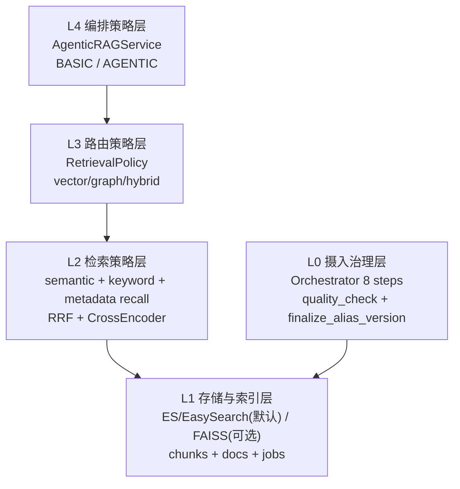
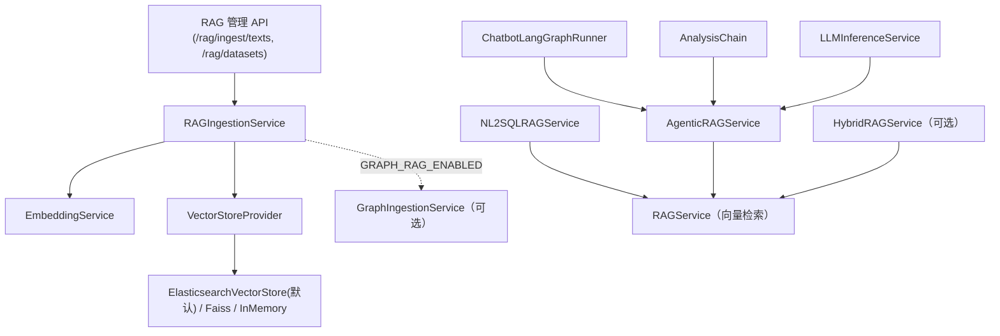
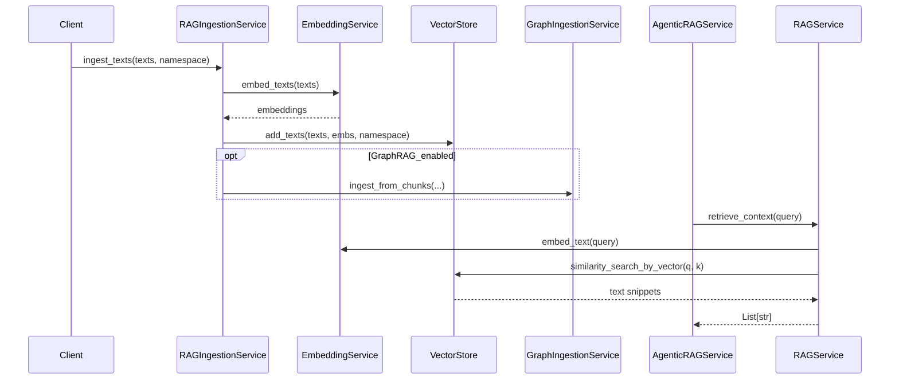
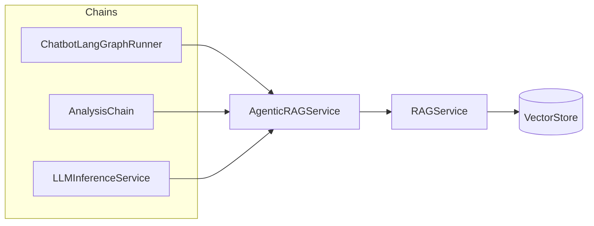

# RAG 整体实现技术说明

> 本文描述**当前仓库已实现**的 RAG（检索增强生成）与**可选 GraphRAG** 技术方案：以**传统 RAG（向量+全文）**为主路径，支持 ES/EasySearch（EasySearch 兼容 ES API）与 FAISS 的配置化切换，并在配置开启时并行走向**知识图谱化（Neo4j）**。  
> 配套文档：`docs/大小模型应用技术架构与实现方案.md`（4.5 节）、`framework-guide/数据持久化与容器部署说明.md`（持久化与容器化）、`rag_db-deploy/README.md`（EasySearch Docker 部署与项目对接）。

---

## 0. 快速阐述版（给开发者/客户）

### 0.1 一句话方案概括

当前 RAG 采用“**摄入治理 + 检索多路召回 + 策略路由 + 编排增强**”的一体化方案：
- 摄入侧：8 步任务编排（含质量门禁与 finalize 阶段），支持版本化与幂等；
- 检索侧：语义召回 + 关键词召回 + metadata 召回，RRF 融合并 CrossEncoder 重排；
- 路由侧：`RetrievalPolicy` 按 query/场景做 vector|graph|hybrid 决策；
- 编排侧：`BASIC` 单步检索与 `AGENTIC` 多步计划检索并存，可配置切换；
- 存储侧：默认 ES/EasySearch（生产），保留 FAISS（开发/离线场景）。

### 0.2 策略分层图



### 0.3 对外可讲述要点（客户视角）

- 不是“单一向量检索”，而是多路召回融合重排，降低漏召回；
- 不是“脚本式导入”，而是可观测、可重试、可审计的任务化摄入；
- 支持文档版本、租户、命名空间治理，支持按版本精确删除；
- 支持传统 RAG 与 AgenticRAG 两种策略并存，按场景配置；
- 默认采用 ES/EasySearch，满足“向量 + 全文 + 元数据”生产能力。

### 0.4 策略方案细化（实现与配置）

#### 0.4.1 摄入治理策略（Orchestrator 8 步）

当前异步摄入任务按以下 8 步显式执行（`/rag/jobs/ingest` 可观测）：
1. `validate_input`：校验 `dataset_id/doc_name/content` 等必填项；
2. `parse`：按 `source_type` 做内容解析；
3. `clean`：按清洗档位与规则做规范化；
4. `chunk`：结构/语义/滑窗切块；
5. `enrich`：生成 `chunk_id/chunk_hash` 等元信息；
6. `index`：向量+全文+metadata 写入存储；
7. `quality_check`：chunk 数量与质量门禁；
8. `finalize_alias_version`：finalize 阶段扩展点（alias/version 治理语义）。

默认策略：
- 默认启用异步任务化摄入（8 步显式状态机），并以 `structure` 为默认切块策略、`normal` 为默认清洗档位。

如何切为其他策略：
- 切块策略：改 `RAG_DEFAULT_CHUNK_STRATEGY`（例如改为 `semantic` 或 `sliding_window`）；
- 清洗强度：改 `RAG_CLEANING_PROFILE`（如 `strict`）并配套开关；
- 并发/吞吐：调 `RAG_INGEST_MAX_CONCURRENCY`、`RAG_INGEST_BATCH_SIZE`。

相关配置（`app/core/config.py`，简要说明）：
- `RAG_INGEST_MAX_CONCURRENCY`（默认 `4`，摄入任务最大并发）；
- `RAG_INGEST_BATCH_SIZE`（默认 `32`，单批写入/嵌入批大小）；
- `RAG_PIPELINE_VERSION`（默认 `1.0.0`，流水线版本标签）；
- `RAG_DEFAULT_CHUNK_STRATEGY`（默认 `structure`，切块算法选择）；
- `RAG_CHUNK_SIZE`（默认 `500`，目标 chunk 长度）；
- `RAG_CHUNK_OVERLAP`（默认 `80`，相邻 chunk 重叠）；
- `RAG_MIN_CHUNK_SIZE`（默认 `40`，最小 chunk 长度）；
- `RAG_CLEANING_PROFILE`（默认 `normal`，清洗档位）；
- `RAG_CLEAN_REMOVE_HEADER_FOOTER`（默认 `true`，去页眉页脚）；
- `RAG_CLEAN_MERGE_DUPLICATE_PARAGRAPHS`（默认 `true`，合并重复段）；
- `RAG_CLEAN_FIX_ENCODING_NOISE`（默认 `true`，修复常见编码噪声）；
- `RAG_CLEAN_MIN_REPEATED_LINE_PAGES`（默认 `2`，判定重复行所需最小页数）。

#### 0.4.2 检索策略（多路召回 + 融合 + 重排）

当前传统 RAG 检索策略为：
- 召回通道：`semantic` + `keyword` + `metadata`；
- 融合：`RRF`；
- 重排：`CrossEncoder(BAAI/bge-reranker-large)`；
- 输出：标准 `RetrievedChunk`。

默认策略：
- 默认开启混合检索（`RAG_HYBRID_ENABLED=true`）；
- 默认开启 metadata 召回；
- 默认使用 `BAAI/bge-reranker-large` 做重排。

如何切为其他策略：
- 仅语义召回：`RAG_HYBRID_ENABLED=false`（退化为向量 Top-K）；
- 关闭 metadata 通道：`RAG_HYBRID_METADATA_RECALL_ENABLED=false`；
- 调整召回/重排成本：降低 `*_TOP_K` 与 `RAG_HYBRID_RERANK_TOP_N`。

相关配置（简要说明）：
- `RAG_HYBRID_ENABLED`（默认 `true`，是否启用多路混合检索）；
- `RAG_HYBRID_SEMANTIC_TOP_K`（默认 `24`，语义召回候选数）；
- `RAG_HYBRID_KEYWORD_TOP_K`（默认 `24`，关键词召回候选数）；
- `RAG_HYBRID_METADATA_TOP_K`（默认 `12`，metadata 召回候选数）；
- `RAG_HYBRID_METADATA_RECALL_ENABLED`（默认 `true`，是否启用 metadata 通道）；
- `RAG_HYBRID_RRF_K`（默认 `60`，RRF 融合参数）；
- `RAG_HYBRID_RERANK_TOP_N`（默认 `12`，重排输入上限）；
- `RAG_RERANKER_MODEL_NAME`（默认 `BAAI/bge-reranker-large`，重排模型名）；
- `RAG_RERANKER_MODEL_PATH`（默认空，离线路径优先）。

#### 0.4.3 路由策略（RetrievalPolicy）

`RetrievalPolicy` 按 query 决策 `vector|graph|hybrid`，并输出权重、hops、graph items。

默认策略：
- 默认路由为 `vector`（`GRAPH_RAG_MODE=vector`），即**默认针对传统 RAG（不引入图事实）**；
- 默认关闭意图路由（`GRAPH_RAG_USE_INTENT_ROUTING=false`），即不按 query 关键词切权重。

如何切为其他策略：
- 纯图路由（只走知识图谱）：`GRAPH_RAG_MODE=graph`；
- 混合路由（传统 RAG + 知识图谱）：`GRAPH_RAG_MODE=hybrid`，再调 `GRAPH_RAG_VECTOR_WEIGHT/GRAPH_RAG_GRAPH_WEIGHT`；
- 按意图自动路由：`GRAPH_RAG_USE_INTENT_ROUTING=true`，并配置 `RELATION/DEFINITION` 关键词及路由后权重。

配置示例（只走传统 RAG，默认）：
```env
GRAPH_RAG_MODE=vector
GRAPH_RAG_USE_INTENT_ROUTING=false
```

配置示例（只走知识图谱）：
```env
GRAPH_RAG_MODE=graph
GRAPH_RAG_USE_INTENT_ROUTING=false
GRAPH_RAG_GRAPH_HOPS=2
GRAPH_RAG_MAX_GRAPH_ITEMS=24
```

配置示例（混合检索：传统 RAG + 知识图谱）：
```env
GRAPH_RAG_MODE=hybrid
GRAPH_RAG_VECTOR_WEIGHT=0.6
GRAPH_RAG_GRAPH_WEIGHT=0.4
GRAPH_RAG_USE_INTENT_ROUTING=true
```

相关配置（简要说明）：
- `GRAPH_RAG_MODE`（默认 `vector`，全局路由模式）；
- `GRAPH_RAG_VECTOR_WEIGHT`（默认 `0.6`，混合时向量权重）；
- `GRAPH_RAG_GRAPH_WEIGHT`（默认 `0.4`，混合时图事实权重）；
- `GRAPH_RAG_GRAPH_HOPS`（默认 `1`，图查询跳数）；
- `GRAPH_RAG_MAX_GRAPH_ITEMS`（默认 `20`，图事实候选上限）；
- `GRAPH_RAG_MAX_CONTEXT_ITEMS`（默认 `20`，融合后上下文上限）；
- `GRAPH_RAG_USE_INTENT_ROUTING`（默认 `false`，是否开启关键词意图路由）；
- `GRAPH_RAG_RELATION_KEYWORDS*`（关系类查询关键词）；
- `GRAPH_RAG_DEFINITION_KEYWORDS*`（定义类查询关键词）；
- `GRAPH_RAG_ROUTED_RELATION_*`（关系类命中后的权重/hops/items）；
- `GRAPH_RAG_ROUTED_DEFINITION_*`（定义类命中后的权重策略）。

#### 0.4.4 编排策略（BASIC vs AGENTIC）

- `BASIC`：单步检索（走统一检索策略）；
- `AGENTIC`：多步计划检索（子问题规划、并行召回、融合去重、预算裁剪）。

默认策略：
- 系统支持 `BASIC` 与 `AGENTIC` 并存；在启用 Agentic 的场景下，默认允许多步规划（`RAG_AGENTIC_ENABLED=true`）。

如何切为其他策略：
- 只走单步：将请求侧 `rag_mode=basic`；
- 强制关闭多步能力：`RAG_AGENTIC_ENABLED=false`（`agentic` 请求将回退单步逻辑）；
- 提升复杂问题效果：增大 `RAG_AGENTIC_MAX_SUBQUERIES` 与并行度；
- 控制成本：降低 `MAX_SUBQUERIES`、`MAX_PARALLEL_WORKERS`、`PER_STEP_K_FLOOR`。

相关配置（简要说明）：
- `RAG_AGENTIC_ENABLED`（默认 `true`，是否允许多步检索）；
- `RAG_AGENTIC_MAX_SUBQUERIES`（默认 `4`，子问题上限）；
- `RAG_AGENTIC_MAX_PARALLEL_WORKERS`（默认 `4`，并行检索上限）；
- `RAG_AGENTIC_PER_STEP_K_FLOOR`（默认 `3`，每步最小检索预算）；
- `RAG_AGENTIC_MAIN_QUERY_WEIGHT`（默认 `1.0`，主问题权重）；
- `RAG_AGENTIC_SPLIT_QUERY_WEIGHT`（默认 `0.8`，拆分子问题权重）；
- `RAG_AGENTIC_SCENE_BOOST_WEIGHT`（默认 `0.7`，场景增强子问题权重）；
- `RAG_AGENTIC_ENABLE_SCENE_BOOST`（默认 `true`，是否启用场景增强子问题）。

#### 0.4.5 存储策略（默认 ES/EasySearch）

- 默认策略：
  - 默认 `RAG_VECTOR_STORE_TYPE=es`，走 ES/EasySearch 统一实现（生产推荐）。

- 如何切为其他策略：
  - 切 EasySearch：`RAG_VECTOR_STORE_TYPE=easysearch`（连接参数仍按 ES API 配）；
  - 切 FAISS：`RAG_VECTOR_STORE_TYPE=faiss` + 配 `RAG_FAISS_INDEX_DIR`；
  - 切内存：`RAG_VECTOR_STORE_TYPE=memory`（仅测试/临时）。

- 相关配置（简要说明）：
  - `RAG_VECTOR_STORE_TYPE`（向量库实现选择）；
  - `RAG_FAISS_INDEX_DIR`（FAISS 索引目录）；
  - `RAG_ES_HOSTS`（ES/EasySearch 地址列表）；
  - `RAG_ES_USERNAME/RAG_ES_PASSWORD`（基础认证）；
  - `RAG_ES_API_KEY`（API Key 认证，和用户名密码二选一）；
  - `RAG_ES_VERIFY_CERTS`（TLS 证书校验）；
  - `RAG_ES_REQUEST_TIMEOUT`（请求超时秒数）；
  - `RAG_ES_INDEX_NAME/ALIAS/VERSION`（chunk 主索引版本治理）；
  - `RAG_ES_DOCS_INDEX_*`（文档元数据索引）；
  - `RAG_ES_JOBS_INDEX_*`（摄入任务索引）。

---

## 文档结构（阅读导航）

| 章节 | 内容 |
|------|------|
| **§0 快速阐述版** | 面向开发者/客户的快速方案概括与策略分层图 |
| **§1 总体技术概览** | 方案总体叙述、能力表、架构图与时序图 |
| **§2 模块与文件映射** | 代码入口速查表 |
| **§3 详细说明** | 按「嵌入 → 向量库 → 检索 → 摄入 → 编排 → Graph/Hybrid → NL2SQL」展开 |
| **§4～§5** | 环境变量与 HTTP API |
| **§6～§8** | 上层调用、持久化、依赖 |
| **§9** | 后续演进与 TODO 对齐 |

---

## 1. 总体技术概览

### 1.1 从使用视角看整体流程

本项目的 RAG 能力从“如何使用”的角度，可以拆成两个主流程：

1. **知识摄入：将文档/Schema 等写入知识库**  
   - **默认（传统向量 RAG）**：  
     1. 上游（运维任务或管理后台）调用 `/rag/ingest/texts`，或直接调用 `RAGIngestionService.ingest_texts(dataset_id, texts, namespace)`；  
     2. `RAGIngestionService` 使用 `EmbeddingService` 将 `texts` 批量转为嵌入向量；  
    3. 通过 `VectorStoreProvider` 选择向量库实现（默认 ES/EasySearch），调用 `add_texts(texts, embeddings, namespace)` 写入；  
     4. 在进程内登记数据集元信息（`RAGDatasetMeta`），供 `/rag/datasets` 查询。  
     - **关键配置**：  
       - `RAG_VECTOR_STORE_TYPE`（默认 `es`，兼容 EasySearch）；
       - `RAG_FAISS_INDEX_DIR`（FAISS 索引与元数据文件目录）；  
       - `EMBEDDING_MODEL_PATH` / `EMBEDDING_MODEL_NAME`（嵌入模型）。  
   - **可选 GraphRAG 摄入（知识图谱化）**：  
     1. 在配置中开启 `GRAPH_RAG_ENABLED=true`（对应 `RAGConfig.graph.enabled`），并配置 Neo4j 连接（`NEO4J_URI`、`NEO4J_USERNAME`、`NEO4J_PASSWORD` 等）；  
    2. 在上述向量写入成功后，通过 `post_index_hook` 调用 `GraphIngestionService.ingest_from_chunks(...)`，将文本分片按策略抽取实体与关系并写入 Neo4j；
     3. 若图写入失败，仅记录日志，不影响向量库摄入。  
     - **调用链路**：`/rag/ingest/texts` → `RAGIngestionService` → `EmbeddingService` → `VectorStoreProvider`（必走） + `GraphIngestionService`（可选）。  
     - **领域本体配置**（预留）：可通过 `RAGConfig.graph.schema`（及后续 `GRAPH_SCHEMA_CONFIG_PATH`）定义节点/关系类型，未配置时走 schema-less 宽松策略。

2. **知识检索：在对话/分析等场景中使用知识库**  
  - **默认（纯向量检索）**：  
    - 上层链路（`ChatbotLangGraphRunner` / `AnalysisChain` / `LLMInferenceService` / `NL2SQLRAGService` 等）在需要 RAG 时：  
       1. 调用 `AgenticRAGService.retrieve(...)`（或直接调用 `RAGService.retrieve_context(...)`）发起检索；  
       2. `RAGService` 使用 `EmbeddingService` 对问题做嵌入，并在向量库中执行 `similarity_search_by_vector`；  
       3. 返回 Top-K 文本片段，由上层链路拼入 Prompt。  
     - **关键配置**：  
       - `RAG_ENABLE_BY_DEFAULT`（业务默认是否开启 RAG）；  
       - `RAG_TOP_K`（默认检索条数）；  
       - 上层场景自身的开关（如 Chatbot/Analysis 请求中的 `enable_rag`）。  
   - **可选混合检索 / 图检索**：  
     - 当 `RAGConfig.graph.enabled=true` 且配置了 `GRAPH_RAG_MODE` 等策略时，可以在上层将 `RAGService` 替换为 `HybridRAGService`：  
       1. `HybridRAGService.retrieve(...)` 根据 `mode` 决定仅向量 / 仅图 / 混合；  
       2. 混合模式下先调用 `RAGService` 拿向量片段，再通过 `GraphQueryService.query_relevant_facts(...)` 获取图事实，并按权重和条数上限融合；  
       3. 将融合后的上下文片段返回给上层链路。  
     - **关键配置**：  
       - `GRAPH_RAG_MODE=vector|graph|hybrid`；  
       - `GRAPH_RAG_VECTOR_WEIGHT` / `GRAPH_RAG_GRAPH_WEIGHT` / `GRAPH_RAG_MAX_CONTEXT_ITEMS` 等。  
    - **调用链路示例**（以 Chatbot 为例）：  
      `ChatbotLangGraphRunner` → `AgenticRAGService`（内部持有 `HybridRAGService`）→ `HybridRAGService` → `RAGService` + `GraphQueryService`。

**小结**：  
- 不配置 GraphRAG 时，**摄入仅写向量库，检索仅走向量 RAG 链路**；  
- 配置 GraphRAG 后，在不改上层调用方式的前提下，可通过注入 `HybridRAGService` 和 Graph 配置，逐步引入“向量 + 图”混合检索能力。 

> **典型调用链总览（按场景）**  
> - **RAG 知识摄入（管理面）**：  
>   `POST /rag/ingest/texts` → `app/api/rag_admin.py` → `RAGIngestionService.ingest_texts` → `EmbeddingService` → `VectorStoreProvider`（+ `GraphIngestionService`，如启用）。  
> - **通用推理 /llm/infer**：
>   `POST /llm/infer` → `LLMInferenceService.infer`：
>   - `rag_mode=basic`：走 `HybridRAGService`（统一策略入口）；
>   - `rag_mode=agentic`：走 `AgenticRAGService`（保留多步计划检索）。
> - **智能客服 /chatbot/chat 与 /chatbot/chat/stream**：
>   `POST /chatbot/chat/stream`（主用）或 `POST /chatbot/chat`（兼容）
>   → `ChatbotService.stream_chat_events` → `ChatbotLangGraphRunner` → `AgenticRAGService/HybridRAGService` → RAG 检索 → LLM；
>   若启用 `CHATBOT_SIMILAR_CASE_ENABLED`，主回答后由 Runner 再调 `HybridRAGService.retrieve(..., namespace=CHATBOT_SIMILAR_CASE_NAMESPACE)` 追加相似案例块（与主检索 namespace 解耦）。
> - **综合分析 /analysis/run**：  
>   `POST /analysis/run` → `AnalysisService.run_analysis` → `AnalysisChain.run` → `AgenticRAGService` → RAG 检索 → LLM。  
> - **NL2SQL /nl2sql/query 中的 RAG**：  
>   `POST /nl2sql/query` → `NL2SQLService.query` → `NL2SQLChain.generate_sql` → `NL2SQLRAGService.retrieve` → `RetrievalPolicy` 决策（vector/graph/hybrid）→ 向量与图事实联合检索。

### 1.2 能力一览表

| 能力 | 说明 |
|------|------|
| **传统 RAG（向量+全文）** | 文本分片摄入时同时保存向量与全文；检索阶段并行执行语义召回 + 关键词召回 + metadata 召回，并通过 RRF 融合 + CrossEncoder 重排输出 Top-N 上下文。 |
| **知识摄入（向量化）** | `RAGIngestionService`：批量嵌入并写入向量库；支持 `namespace` 与数据集登记。 |
| **知识摄入（可选图谱化）** | 配置 `GRAPH_RAG_ENABLED=true` 时，摄入后**额外**调用 `GraphIngestionService` 写 Neo4j；失败**不阻断**向量写入。 |
| **检索（向量）** | `RAGService`：纯向量 Top-K；上层多经 `AgenticRAGService` 统一入口。 |
| **检索（图 / 混合，可选）** | `HybridRAGService` + `GraphQueryService`：按配置 `vector` / `graph` / `hybrid`，支持意图路由与权重交织融合。 |
| **Agentic RAG 基座** | `AgenticRAGService`：`BASIC` / `AGENTIC`；`AGENTIC` 已实现多步规划、并行检索、融合去重与预算裁剪。 |
| **场景封装** | `NL2SQLRAGService`：多命名空间（schema / biz / qa）联合检索，支持统一策略层路由。 |
| **GraphRAG 基础设施** | Neo4j + LangChain Graph；已实现轻量实体抽取、图事实查询与参数化策略（可持续增强）。 |

### 1.3 逻辑架构图（组件关系）



### 1.4 数据流概览（摄入 + 检索）



---

## 2. 模块与文件映射

> 下表按**配置 → 嵌入 → 存储 → 摄入 → 检索 → 编排 → 场景/API**顺序排列，便于从问题定位到文件。

| 模块 | 路径 | 职责 |
|------|------|------|
| 配置 | `app/core/config.py` | `RAGConfig`（top_k、向量库类型、FAISS 目录、嵌入模型）；`RAGConfig.graph`（`GraphRAGConfig`：Neo4j、混合策略等）。 |
| 嵌入 | `app/rag/embedding_service.py` | sentence-transformers；离线路径优先，否则在线模型名；失败抛异常。 |
| 向量库 | `app/rag/vector_store.py` | `VectorStore` 抽象；`FaissVectorStore`、`ElasticsearchVectorStore`（兼容 EasySearch）、`InMemoryVectorStore`；`VectorStoreProvider` 按 `RAG_VECTOR_STORE_TYPE` 选择。 |
| 向量检索 | `app/rag/rag_service.py` | `index_texts` / `retrieve_context`；指标 `RAG_QUERY_COUNT`。 |
| 摄入 | `app/rag/ingestion.py` | `RAGIngestionService`；数据集元数据内存登记；可选 Graph 摄入。 |
| Agentic 基座 | `app/rag/agentic.py` | `AgenticRAGService`、`RAGMode`、`RAGContext`、`RAGResult`。 |
| Hybrid | `app/rag/hybrid_rag_service.py` | 向量 / 图 / 混合检索调度，接入 `RetrievalPolicy`。 |
| Graph | `app/graph/ingestion.py`、`app/graph/query_service.py` | Neo4j 图摄入与图事实查询（轻量企业可用实现）。 |
| 管理 API | `app/api/rag_admin.py` | `POST /rag/ingest/texts`、`GET /rag/datasets`。 |
| NL2SQL RAG | `app/nl2sql/rag_service.py` | 多命名空间封装在 NL2SQL 场景使用。 |

---

## 3. 详细说明

本章按**数据与调用路径**组织，建议顺序阅读：**嵌入（3.1）→ 向量存储（3.2）→ 向量检索（3.3）→ 摄入管线（3.4）→ 上层检索编排（3.5）→ GraphRAG 与混合检索（3.6）→ NL2SQL（3.7）**。

### 3.1 嵌入服务（EmbeddingService）

- **模型**：默认 `BAAI/bge-small-zh-v1.5`，可通过 `EMBEDDING_MODEL_NAME` 覆盖。
- **加载顺序**：若 `EMBEDDING_MODEL_PATH` 指向有效目录则本地加载；否则按模型名在线加载；均失败则 `RuntimeError`。
- **向量**：`normalize_embeddings=True`，与 FAISS `IndexFlatIP` 组合时等价于余弦相似度检索。

### 3.2 向量库（VectorStoreProvider）

- **默认类型**：`es`（`RAG_VECTOR_STORE_TYPE`，默认 `es`，兼容 EasySearch）。
- **FAISS 实现要点**：
  - 使用 `IndexFlatIP` + `IndexIDMap2`，`add_with_ids` 写入；
  - 持久化目录：`RAG_FAISS_INDEX_DIR`（默认 `./data/faiss`），文件为 `faiss.index` 与 `faiss_meta.json`；
  - 每条记录元数据含：`text`、`namespace`、`ext_id`；
  - `similarity_search_by_vector` 支持按 `namespace` 过滤（扩大候选再筛选）。
- **内存实现**：`memory` / `inmemory` 用于开发或测试。

### 3.3 RAGService（检索）

- `retrieve_context(query, top_k)`：`top_k` 默认取自 `RAGConfig.top_k`（环境变量 `RAG_TOP_K`）。
- 流程：问题嵌入 → 向量库 Top-K → 返回文本列表，供 Prompt 拼接。

### 3.4 RAGIngestionService（摄入）

- 流程：对 `texts` 批量嵌入 → `VectorStore.add_texts(..., namespace=...)`。
- **数据集元数据**：进程内 `RAGDatasetMeta` 字典（`dataset_id`、条数、`namespace` 等），重启不持久化；生产可扩展为 DB/配置中心。
- **GraphRAG**：当 `RAGConfig.graph.enabled == true`（`GRAPH_RAG_ENABLED=true`）时，构造 `GraphIngestionService`；摄入后通过 `post_index_hook` 调用 `ingest_from_chunks`。图写入失败仅打日志，**不中断**向量摄入。
- **版本与删除一致性**：图侧 chunk 节点携带 `doc_name/doc_version/doc_key`，同名同版本重灌会先清理旧图节点；`/documents/delete` 会同步触发图侧清理。

### 3.5 AgenticRAGService（上层统一检索入口）

- `retrieve(query, ctx, mode, top_k)` → `RAGResult(context_snippets, used_agentic)`。
- `BASIC`：直接 `RAGService.retrieve_chunks`（单步）。
- `AGENTIC`：企业可用多步策略（轻量）：
  1. 规则化子问题规划（主问题 + 连接词拆分子问题 + 场景强化子查询）；
  2. 并行执行多路检索；
  3. 按 `score + rank bonus + step weight` 融合排序；
  4. 按 `chunk_id/text` 去重并按 `top_k` 预算裁剪；
  5. 返回 `RAGResult.chunks` + `plan_steps` 便于 trace 与观测。

### 3.6 GraphRAG 与混合检索（可选）

本节对应「**知识图谱化 + 可配置混合检索**」，与 **§1.1** 中的第 2、3 点呼应。

#### 3.6.1 配置与依赖

- **配置对象**：`RAGConfig.graph`（`GraphRAGConfig`），含 Neo4j 连接、可选 `schema_config_path`、`GraphHybridStrategyConfig`（`mode`、权重、条数上限等）。
- **环境变量**：见 **§4.2**。
- **依赖**：`requirements-大模型应用.txt` 中的 `neo4j`、`langchain-community`。

#### 3.6.2 摄入侧：`GraphIngestionService`

- 由 `RAGIngestionService` 在向量写入成功后调用 `ingest_from_chunks`；仅当 `graph.enabled` 为真时初始化服务。
- **当前实现**：
  - 规则抽取中英实体（参数化长度阈值）；
  - 写入 `DocumentChunk` / `Entity` 节点与 `MENTION` / `CO_OCCUR` 关系；
  - 支持每 chunk 实体上限控制，兼顾质量与性能。
- **领域本体**：`GraphSchemaConfig` 仍可扩展为严格 schema 模式；当前默认 schema-less。

#### 3.6.3 检索侧：`GraphQueryService` 与 `HybridRAGService`

- **`GraphQueryService`**：从 Neo4j 拉取与问题相关的图事实（`query_relevant_facts`）；
  - 1-hop：实体相关分片事实；
  - 2-hop：实体共现事实（可按最小权重阈值过滤）；
  - 支持事实文本模板参数化，便于场景化输出。
- **`HybridRAGService`**：
  - `graph.enabled == false` 或图客户端初始化失败：行为等同 `RAGService`；
  - `strategy.mode`：`vector` 纯向量；`graph` 仅图；`hybrid` 按 `vector_weight` / `graph_weight` 与 `max_context_items` 合并向量片段与图事实；
  - 当 `use_intent_routing=true` 时，启用轻量路由：关系/依赖类问题自动提升图侧权重并提高 `graph_hops`，定义类问题回调向量侧权重；
  - 混合结果采用“权重分配 + 交织合并”而非简单拼接，降低单通道挤占风险。
- **`RetrievalPolicy`**：
  - 将 query -> 检索决策（mode/weights/hops/max_graph_items）抽成独立策略层；
  - `HybridRAGService` 复用该策略，`ChatbotService` 与 `AnalysisService` 的回退链路也复用 Hybrid 入口，降低策略重复实现。

### 3.7 NL2SQL 与 RAG

- `NL2SQLRAGService` 复用 `RetrievalPolicy` + `RAGService` +（可选）`GraphQueryService`，按 `nl2sql_schema` / `nl2sql_biz_knowledge` / `nl2sql_qa_examples` 等 **namespace** 联合检索。
- 知识需通过 `/rag/ingest/texts` 或同等摄入接口写入对应 `namespace`。
- 新版 `NL2SQLRAGService` 已支持 `retrieve_chunks()` 返回标准 `RetrievedChunk`，并在兼容接口 `retrieve()` 中保留来源线索（namespace/doc/section）后再渲染为 prompt 文本。

---

## 4. 配置与环境变量

环境与 `app/core/config.py` 中 `_load_from_env()` 对齐：**§4.1** 对应向量 RAG 与嵌入；**§4.2** 对应 GraphRAG / 混合策略。详细行为见 **§3**。

### 4.1 向量 RAG

| 变量 | 说明 | 默认 |
|------|------|------|
| `RAG_ENABLE_BY_DEFAULT` | 业务层是否默认开 RAG | `true` |
| `RAG_TOP_K` | 检索条数 | `5` |
| `RAG_VECTOR_STORE_TYPE` | `faiss` / `es` / `easysearch` / `memory` | `es` |
| `RAG_FAISS_INDEX_DIR` | FAISS 持久化目录 | `./data/faiss` |
| `RAG_ES_HOSTS` | ES/EasySearch 地址（逗号分隔） | `http://localhost:9200` |
| `RAG_ES_USERNAME` / `RAG_ES_PASSWORD` | ES BasicAuth（可选） | 空 |
| `RAG_ES_API_KEY` | ES API Key（可选） | 空 |
| `RAG_ES_INDEX_NAME` | RAG 索引名 | `rag_knowledge_base` |
| `RAG_ES_INDEX_ALIAS` | 线上查询/写入别名 | `rag_knowledge_base` |
| `RAG_ES_INDEX_VERSION` | 物理索引版本号（用于 migration） | `1` |
| `RAG_ES_AUTO_MIGRATE_ON_START` | 启动时是否自动执行 alias 迁移 | `true` |
| `RAG_HYBRID_ENABLED` | 是否启用混合检索（语义+关键词） | `true` |
| `RAG_HYBRID_SEMANTIC_TOP_K` / `RAG_HYBRID_KEYWORD_TOP_K` | 双路召回候选数 | `24` / `24` |
| `RAG_HYBRID_METADATA_TOP_K` | metadata 召回候选数 | `12` |
| `RAG_HYBRID_METADATA_RECALL_ENABLED` | 是否启用 metadata 召回通道 | `true` |
| `RAG_HYBRID_RRF_K` | RRF 融合参数 | `60` |
| `RAG_HYBRID_RERANK_TOP_N` | 重排候选数量 | `12` |
| `RAG_RERANKER_MODEL_NAME` | CrossEncoder 重排模型 | `BAAI/bge-reranker-large` |
| `RAG_RERANKER_MODEL_PATH` | 本地重排模型目录（离线优先） | 空 |
| `RAG_SCENE_LLM_*` | 通用推理场景检索参数（TOP-K/召回/重排） | 见配置默认值 |
| `RAG_SCENE_CHATBOT_*` | 智能客服场景检索参数（TOP-K/召回/重排） | 见配置默认值 |
| `RAG_SCENE_ANALYSIS_*` | 综合分析场景检索参数（TOP-K/召回/重排） | 见配置默认值 |
| `RAG_SCENE_NL2SQL_*` | NL2SQL 场景检索参数（TOP-K/召回/重排） | 见配置默认值 |
| `EMBEDDING_MODEL_PATH` | 本地嵌入模型目录 | 空 |
| `EMBEDDING_MODEL_NAME` | HuggingFace 模型名 | `BAAI/bge-small-zh-v1.5` |

#### 知识摄入平台（与设计稿 §4 对齐）

| 变量 | 说明 | 默认 |
|------|------|------|
| `RAG_INGEST_ASYNC_ENABLED` | 是否启用异步任务摄入（编排器线程池） | `true` |
| `RAG_INGEST_MAX_CONCURRENCY` | 摄入任务线程池并发 | `4` |
| `RAG_INGEST_BATCH_SIZE` | 预留：批量嵌入/写入批次大小 | `32` |
| `RAG_PIPELINE_VERSION` | 管线版本号（写入文档元数据等） | `1.0.0` |
| `RAG_DEFAULT_CHUNK_STRATEGY` | 默认切块策略标识（`structure`/`semantic`/`window`） | `structure` |
| `RAG_CHUNK_SIZE` / `RAG_CHUNK_OVERLAP` / `RAG_MIN_CHUNK_SIZE` | 默认切块参数 | `500` / `80` / `40` |
| `RAG_CLEANING_PROFILE` | 清洗档位（`strict`/`normal`/`light`） | `normal` |
| `RAG_CLEAN_REMOVE_HEADER_FOOTER` | 是否移除跨页重复页眉页脚 | `true` |
| `RAG_CLEAN_MERGE_DUPLICATE_PARAGRAPHS` | 是否合并重复段落 | `true` |
| `RAG_CLEAN_FIX_ENCODING_NOISE` | 是否修复常见编码噪音/乱码碎片 | `true` |
| `RAG_CLEAN_MIN_REPEATED_LINE_PAGES` | 判定重复页眉页脚所需最小页数 | `2` |
| `RAG_TENANT_ID_DEFAULT` | 可选默认租户（幂等键扩展） | 空 |

检索侧标准结构：`RAGService.retrieve_chunks()` → `RetrievedChunk`；`AgenticRAGService.RAGResult.chunks` 携带同构结果便于 trace。

文档处理侧（`app/rag/document_pipeline/*`）：
- `DocumentParser` 支持 `text/markdown/html/pdf/docx`；其中 `pdf/docx` 支持“本地文件路径或 file:// 路径”直接解析（`pypdf` / `python-docx`），也兼容“上游已提取纯文本”的旧模式。
- `TextCleaner` 支持清洗档位 `strict/normal/light`，由 `RAG_CLEANING_PROFILE` 驱动。
- 企业级增强：支持跨页重复页眉/页脚识别清理、重复段合并、常见编码噪音修复（均可配置开关）。
- `DocumentPipeline` 支持策略标识 `structure/semantic/window`，由 `RAG_DEFAULT_CHUNK_STRATEGY` 驱动。

#### Agentic 多步策略参数

| 变量 | 说明 | 默认 |
|------|------|------|
| `RAG_AGENTIC_ENABLED` | 是否启用 Agentic 多步策略（关闭则强制 BASIC） | `true` |
| `RAG_AGENTIC_MAX_SUBQUERIES` | 子问题最大数量 | `4` |
| `RAG_AGENTIC_MAX_PARALLEL_WORKERS` | 并行检索线程数上限 | `4` |
| `RAG_AGENTIC_PER_STEP_K_FLOOR` | 单子问题检索预算下限 | `3` |
| `RAG_AGENTIC_MAIN_QUERY_WEIGHT` | 主问题融合权重 | `1.0` |
| `RAG_AGENTIC_SPLIT_QUERY_WEIGHT` | 拆分子问题融合权重 | `0.8` |
| `RAG_AGENTIC_SCENE_BOOST_WEIGHT` | 场景增强子问题融合权重 | `0.7` |
| `RAG_AGENTIC_ENABLE_SCENE_BOOST` | 是否启用场景增强子问题 | `true` |

### 4.2 GraphRAG（可选）

| 变量 | 说明 |
|------|------|
| `GRAPH_RAG_ENABLED` | `true` 时尝试初始化图摄入/连接 |
| `NEO4J_URI` | 如 `bolt://localhost:7687` |
| `NEO4J_USERNAME` / `NEO4J_PASSWORD` / `NEO4J_DATABASE` | Neo4j 认证与库名 |
| `GRAPH_SCHEMA_CONFIG_PATH` | 预留：外部 YAML 路径 |
| `GRAPH_RAG_MODE` | `vector` / `graph` / `hybrid`（作用于 `HybridRAGService`） |
| `GRAPH_RAG_VECTOR_WEIGHT` / `GRAPH_RAG_GRAPH_WEIGHT` | 混合权重 |
| `GRAPH_RAG_MAX_CONTEXT_ITEMS` | 混合上下文条数上限 |
| `GRAPH_RAG_GRAPH_HOPS` / `GRAPH_RAG_MAX_GRAPH_ITEMS` | 图查询参数 |
| `GRAPH_RAG_USE_INTENT_ROUTING` | 启用轻量意图路由（关系类/定义类） |
| `GRAPH_RAG_RELATION_KEYWORDS` / `GRAPH_RAG_RELATION_KEYWORDS_EN` | 关系类问题关键词（逗号分隔） |
| `GRAPH_RAG_DEFINITION_KEYWORDS` / `GRAPH_RAG_DEFINITION_KEYWORDS_EN` | 定义类问题关键词（逗号分隔） |
| `GRAPH_RAG_ROUTED_RELATION_GRAPH_WEIGHT` / `GRAPH_RAG_ROUTED_RELATION_VECTOR_WEIGHT` | 关系类问题路由后的融合权重 |
| `GRAPH_RAG_ROUTED_RELATION_GRAPH_HOPS` / `GRAPH_RAG_ROUTED_RELATION_MAX_GRAPH_ITEMS` | 关系类问题路由后的图查询参数 |
| `GRAPH_RAG_ROUTED_DEFINITION_VECTOR_WEIGHT` / `GRAPH_RAG_ROUTED_DEFINITION_GRAPH_WEIGHT` | 定义类问题路由后的融合权重 |
| `GRAPH_ENTITY_MIN_LEN` / `GRAPH_ENTITY_MAX_LEN` | 实体抽取长度阈值 | 
| `GRAPH_ZH_ENTITY_MAX_LEN` | 中文实体最大长度 |
| `GRAPH_EN_ENTITY_MIN_LEN` / `GRAPH_EN_ENTITY_MAX_LEN` | 英文实体长度阈值 |
| `GRAPH_MAX_ENTITIES_PER_CHUNK` | 单分片实体上限 |
| `GRAPH_MIN_COOCCUR_WEIGHT` | 共现事实最小权重阈值 |
| `GRAPH_FACT_TEMPLATE_ENTITY` | 实体事实文本模板 |
| `GRAPH_FACT_TEMPLATE_COOCCUR` | 共现事实文本模板 |

---

## 4.3 ES / EasySearch 索引 migration 说明（详细）

为保证生产环境中 mapping 调整可平滑升级，当前采用“**版本化物理索引 + 逻辑 alias**”策略：

1. **物理索引命名**  
   - 按版本命名：`{RAG_ES_INDEX_NAME}_v{RAG_ES_INDEX_VERSION}`；  
   - 例如：`rag_knowledge_base_v1`、`rag_knowledge_base_v2`。

2. **业务读写入口统一走 alias**  
   - `RAG_ES_INDEX_ALIAS` 作为统一入口（例如 `rag_knowledge_base`）；  
   - 应用层检索与删除都通过 alias 访问，避免业务代码感知底层索引切换。

3. **自动 migration 行为**（`RAG_ES_AUTO_MIGRATE_ON_START=true`）  
   - 若当前版本物理索引不存在，应用会按当前 mapping 创建；  
   - 若 alias 尚未指向当前版本索引，则执行 alias 切换到当前版本；  
   - **不会自动删除旧版本索引**，避免误删历史数据。

4. **数据回灌约定**  
   - 轻量 migration 仅负责“建新索引 + 切 alias”；  
   - 若新版本索引为空，需要通过摄入任务（或离线 reindex）回灌数据。

> 该策略是生产可用的最小 migration 方案：先保证“可升级不爆炸”，再按业务规模引入更复杂的灰度切流与双写机制。

---

## 5. HTTP API（RAG 管理）

对外暴露的知识库写入与数据集查询入口；摄入行为与 **§3.4**、**§3.6.2** 一致。

- **`POST /rag/ingest/texts`**
  Body：`dataset_id`、`texts[]`、可选 `description`、`namespace`、`doc_name`、`replace_if_exists`。  
  行为：将“已清洗且已分块”的文本列表直接入库；当 `replace_if_exists=true` 时按 `doc_name` 先删后灌，解决同名更新问题。

- **`POST /rag/ingest/documents`**
  Body：`documents[]`（每个文档含 `dataset_id/texts/namespace/doc_name/replace_if_exists`）。  
  行为：批量摄入多文档（已分块输入），适合离线任务与管理后台批处理。

- **`POST /rag/ingest/raw_document`**
  Body：`dataset_id`、`doc_name`、`content`、可选 `namespace/replace_if_exists/chunk_size/chunk_overlap/min_chunk_size`。  
  行为：接收原始文档文本，服务端先执行清洗与切块，再调用标准摄入链路入库。

- **`POST /rag/ingest/raw_documents`**
  Body：`documents[]`（每个文档含 `content` 与切块参数）。  
  行为：批量原始文档摄入（服务端自动清洗与切块）。

- **`POST /rag/jobs/ingest`**
  Body：`documents[]`（原始文档）+ `operator` + 切块参数。  
  行为：提交异步摄入任务，后台按 8 步执行：
  `validate_input -> parse -> clean -> chunk -> enrich -> index -> quality_check -> finalize_alias_version`，返回 `job_id`。

- **`GET /rag/jobs/{job_id}`**
  行为：查询任务状态（`PENDING/RUNNING/SUCCESS/FAILED/PARTIAL`）与步骤、指标、错误信息（含 step 耗时与 doc 级错误码）。

- **`POST /rag/jobs/{job_id}/retry`**
  行为：重试指定任务（生成新 `job_id`）。

- **`GET /rag/jobs`**
  行为：分页查询任务列表（`limit/offset`），用于运维面板任务追踪。

- **`GET /rag/jobs/{job_id}/documents`**
  行为：查询任务关联文档列表（用于任务审计与问题定位）。

- **`POST /rag/documents/upsert`**
  行为：同步小文档快速通道，自动清洗切块后立即入库（适合管理端快速修订）。

- **`GET /rag/documents/meta`**
  行为：分页查询文档元数据（chunk 数量、状态、首次摄入时间、更新时间、最近任务信息、错误信息）；支持 `namespace/tenant_id/dataset_id/doc_name` 过滤。

- **`GET /rag/documents/overview`**
  行为：查询知识库整体情况（文档总量、文档名去重数、按 namespace/tenant/status 聚合）并返回分页文档明细；支持 `namespace/tenant_id/dataset_id/doc_name` 过滤。

- **`GET /rag/knowledge/trends`**
  行为：用于知识库运营看板的趋势数据接口，返回最近 N 天/周的“新增（FULL 成功）/更新（UPSERT 成功）/失败（FAILED）”数量：  
  - 查询参数：`granularity=day|week`（聚合粒度，默认 `day`）、`days`（统计窗口天数，默认 `30`，上限 `180`）；  
  - 返回字段：`points[]` 中包含 `bucket`（如 `2026-03-27` 或 `2026-W13`）、`created_success`、`updated_success`、`failed`。

- **`POST /rag/migrations/chunks/run`**
  Body：`embedding_dim`。  
  行为：创建目标版本 chunks 索引并将 alias 切换到新版本。

- **`POST /rag/migrations/chunks/rollback`**
  Body：`previous_index`。  
  行为：将 chunks alias 回滚到指定历史物理索引。

### 5.1 运维排障与回滚手册（第六批补充）

- **常见任务错误码**
  - `E_CHUNK_EMPTY`：文档清洗/切块后无有效 chunk（常见于输入为空或切块阈值配置不合理）。
  - `E_INGEST_UNKNOWN`：摄入阶段未知异常（需结合 `error_message` 与服务日志定位）。
  - `PARTIAL_FAILED`：部分文档失败，可按文档粒度排查并重试。
  - `ALL_DOCS_FAILED`：全部文档失败，优先排查模型、ES/EasySearch 连通性与权限。

- **标准排查路径**
  1. 调用 `GET /rag/jobs/{job_id}`，确认 `status/step/error_code/error_message`；
  2. 调用 `GET /rag/jobs/{job_id}/documents`，定位受影响文档集合；
  3. 调用 `GET /rag/documents/meta?namespace=...`，确认文档元数据与 `chunk_count`；
  4. 修复后调用 `POST /rag/jobs/{job_id}/retry` 执行重试。

- **迁移回滚路径（chunks 索引）**
  1. 执行 `POST /rag/migrations/chunks/run` 完成新版本索引创建与 alias 切换；
  2. 通过 E2E 或业务流量抽检检索一致性；
  3. 若异常，执行 `POST /rag/migrations/chunks/rollback` 回到历史索引；
  4. 回滚后再次抽检，再决定是否重新切换。

- **建议的一致性回归脚本（第七批）**
  - `app/test_scripts/rag/rag_migration_consistency_e2e.py`
  - 验收口径：migration 前后同一 query 的结果 overlap ratio 不低于阈值（默认 `0.6`）。
  - 样本管理：支持 `--cases-file` 指定 JSON 基线样本（默认 `app/test_scripts/rag/migration_consistency_cases.json`）。
  - 场景评测：query 可按 `scene` 独立配置（`llm_inference/chatbot/analysis/nl2sql`）。
  - 报告输出：支持 `--report-out` 输出 JSON 结果，可直接接入 CI 门禁。
  - 汇总输出：支持 `--report-md-out` 生成 Markdown 报告，便于流水线制品直接展示。
  - 失败落盘：任一步骤失败时仍会写出报告（若指定了 `--report-out` / `--report-md-out`），并记录失败阶段与错误栈。

- **`POST /rag/documents/delete`**
  Body：`doc_name`、可选 `namespace`、可选 `doc_version`。  
  行为：支持按文档名删除；若传入 `doc_version`，执行按版本精确删除（向量+图侧同步清理）。

- **`GET /rag/datasets`**  
  返回当前进程内已登记数据集元数据列表。

路由注册位置：`app/main.py`（前缀以实际注册为准）。

---

## 6. 上层调用关系（简图）



> **说明**：当前主链路已支持通过 `RetrievalPolicy` + `HybridRAGService` 统一路由；`RAGService` 仍作为底层检索执行器保留。

---

## 7. 持久化与运维

- **FAISS**：必须将 `RAG_FAISS_INDEX_DIR` 挂载到持久卷（容器场景见 `framework-guide/数据持久化与容器部署说明.md`）。
- **嵌入模型**：大镜像或离线环境建议使用 `EMBEDDING_MODEL_PATH` 挂载本地模型目录。
- **Neo4j**：图数据由 Neo4j 自身存储与备份策略管理，应用容器通过环境变量连接即可。

---

## 8. 依赖安装（摘录）

```bash
pip install -r requirements-大模型应用.txt
```

包含但不限于：`sentence-transformers`、`faiss-cpu`、`elasticsearch`、`neo4j`、`langchain-community`（GraphRAG 可选）。

---

## 9. 后续演进建议（与代码 TODO 对齐）

1. **GraphRAG**：实现 `ingest_from_chunks` 内实体/关系抽取与 Cypher 写入；实现 `query_relevant_facts` 的问题→子图查询。  
2. **Schema 加载**：从 `GRAPH_SCHEMA_CONFIG_PATH` 读取 YAML 填充 `GraphSchemaConfig`。  
3. **Hybrid 接入**：在 Chatbot / Analysis / LLM Infer 等链路中按需注入 `HybridRAGService`。  
4. **Agentic 多步**：在 `AgenticRAGService` 的 AGENTIC 分支实现多轮检索与工具调用。  
5. **数据集元数据**：将 `RAGDatasetMeta` 持久化到 Redis/DB，支持多实例一致视图。

---

## 10. 上线前检查清单（生产）

> 本清单用于 RAG 能力上线前的最终核对。建议按“必须项 → 建议项”顺序逐项勾选。  
> 状态标记说明：  
> - `已完成`：当前代码已具备；  
> - `待补充`：当前仓库尚未形成完整上线闭环，需要在目标环境补齐。

### 10.1 必须项（Blocking）

| 项目 | 说明 | 当前状态 |
|------|------|----------|
| 摄入与检索主链路可用 | `ingest/query/update/delete` 全链路可执行，且结果正确 | 已完成 |
| 向量+全文双存储 | ES/EasySearch（兼容 ES API）中同时保存 `dense_vector + text` | 已完成 |
| 同名文档更新策略 | `doc_name + replace_if_exists=true` 先删后灌 | 已完成 |
| 混合检索与重排 | 语义召回 + 关键词召回 + RRF + CrossEncoder 重排 | 已完成 |
| 配置化能力 | 存储类型、ES 连接、重排模型、场景参数均可配置 | 已完成 |
| ES 索引版本迁移机制 | 版本化物理索引 + alias 切换，避免直接改线上索引 | 已完成 |
| 关键错误可观测 | API 层异常日志明确，返回可读错误信息 | 已完成 |
| 基础自动化验证 | 单元测试 + E2E API 脚本可运行 | 已完成 |
| 管理接口鉴权 | `/rag/*` 管理面鉴权、权限控制、审计 | 待补充 |
| 目标环境压测通过 | 关键链路 QPS/P95/P99、错误率达到上线阈值 | 待补充 |
| 上线回滚预案 | alias 回切、索引回退、数据重建方案验证通过 | 待补充 |

### 10.2 建议项（Strongly Recommended）

| 项目 | 说明 | 当前状态 |
|------|------|----------|
| Grafana/Loki 告警 | RAG 召回/重排/删除指标看板与告警阈值 | 待补充 |
| 索引生命周期治理 | 旧版本索引清理策略、容量预警、冷热分层 | 待补充 |
| 多环境参数基线 | dev/staging/prod 三套参数模板与变更流程 | 待补充 |
| 批处理摄入任务化 | 大规模文档摄入分批、重试、失败重跑机制 | 待补充 |
| 数据质量巡检 | 文档切分质量、召回命中率、重排收益定期评估 | 待补充 |

### 10.3 上线执行顺序（建议）

1. 在 staging 按 E2E 脚本完成全链路验证（含 update/delete）；  
2. 执行 ES 版本索引迁移并验证 alias 指向；  
3. 进行压测并确认阈值（QPS、P95/P99、错误率）；  
4. 配置监控告警与回滚预案；  
5. 在生产灰度上线，观察指标后全量切换。

---

*文档版本与仓库实现同步；若修改 `app/rag/*` 或 `app/core/config.py` 中 RAG 相关结构，请同步更新本文。*
