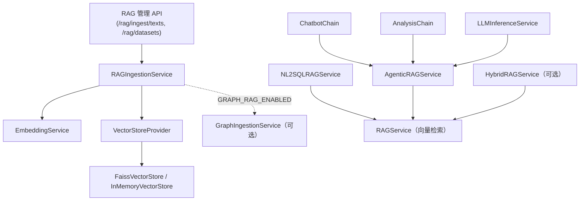
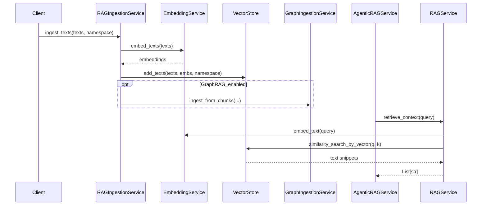
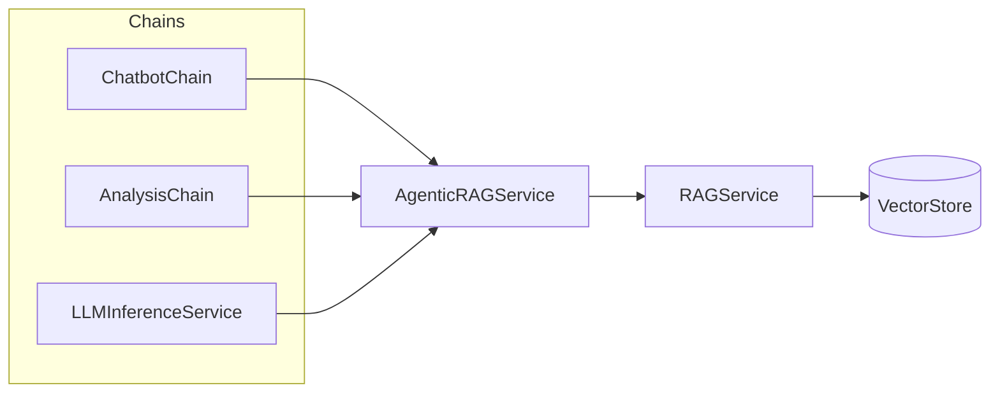

# RAG 整体实现技术说明

> 本文描述**当前仓库已实现**的 RAG（检索增强生成）与**可选 GraphRAG** 技术方案：以**传统向量 RAG** 为默认与主路径，支持**向量化 + 持久化向量库**，并在配置开启时并行走向**知识图谱化（Neo4j）**与**混合检索**骨架。  
> 配套文档：`docs/大小模型应用技术架构与实现方案.md`（4.5 节）、`framework-guide/数据持久化与容器部署说明.md`（FAISS 挂载）。

---

## 文档结构（阅读导航）

| 章节 | 内容 |
|------|------|
| **§1 总体技术概览** | 方案总体叙述、能力表、架构图与时序图 |
| **§2 模块与文件映射** | 代码入口速查表 |
| **§3 详细说明** | 按「嵌入 → 向量库 → 检索 → 摄入 → 编排 → Graph/Hybrid → NL2SQL」展开 |
| **§4～§5** | 环境变量与 HTTP API |
| **§6～§8** | 上层调用、持久化、依赖 |
| **§9** | 后续演进与 TODO 对齐 |

---

## 1. 总体技术概览

### 1.1 从使用视角看整体流程

本项目的 RAG 能力从“如何使用”的角度，可以拆成两个主流程：

1. **知识摄入：将文档/Schema 等写入知识库**  
   - **默认（传统向量 RAG）**：  
     1. 上游（运维任务或管理后台）调用 `/rag/ingest/texts`，或直接调用 `RAGIngestionService.ingest_texts(dataset_id, texts, namespace)`；  
     2. `RAGIngestionService` 使用 `EmbeddingService` 将 `texts` 批量转为嵌入向量；  
     3. 通过 `VectorStoreProvider` 选择向量库实现（默认 FAISS 文件版），调用 `add_texts(texts, embeddings, namespace)` 写入；  
     4. 在进程内登记数据集元信息（`RAGDatasetMeta`），供 `/rag/datasets` 查询。  
     - **关键配置**：  
       - `RAG_VECTOR_STORE_TYPE`（默认 `faiss`）；  
       - `RAG_FAISS_INDEX_DIR`（FAISS 索引与元数据文件目录）；  
       - `EMBEDDING_MODEL_PATH` / `EMBEDDING_MODEL_NAME`（嵌入模型）。  
   - **可选 GraphRAG 摄入（知识图谱化）**：  
     1. 在配置中开启 `GRAPH_RAG_ENABLED=true`（对应 `RAGConfig.graph.enabled`），并配置 Neo4j 连接（`NEO4J_URI`、`NEO4J_USERNAME`、`NEO4J_PASSWORD` 等）；  
     2. 在上述向量写入成功后，`RAGIngestionService` 会额外调用 `GraphIngestionService.ingest_from_chunks(...)`，将文本分片按后续实现的策略抽取实体与关系并写入 Neo4j；  
     3. 若图写入失败，仅记录日志，不影响向量库摄入。  
     - **调用链路**：`/rag/ingest/texts` → `RAGIngestionService` → `EmbeddingService` → `VectorStoreProvider`（必走） + `GraphIngestionService`（可选）。  
     - **领域本体配置**（预留）：可通过 `RAGConfig.graph.schema`（及后续 `GRAPH_SCHEMA_CONFIG_PATH`）定义节点/关系类型，未配置时走 schema-less 宽松策略。

2. **知识检索：在对话/分析等场景中使用知识库**  
   - **默认（纯向量检索）**：  
     - 上层链路（`ChatbotChain` / `AnalysisChain` / `LLMInferenceService` / `NL2SQLRAGService` 等）在需要 RAG 时：  
       1. 调用 `AgenticRAGService.retrieve(...)`（或直接调用 `RAGService.retrieve_context(...)`）发起检索；  
       2. `RAGService` 使用 `EmbeddingService` 对问题做嵌入，并在向量库中执行 `similarity_search_by_vector`；  
       3. 返回 Top-K 文本片段，由上层链路拼入 Prompt。  
     - **关键配置**：  
       - `RAG_ENABLE_BY_DEFAULT`（业务默认是否开启 RAG）；  
       - `RAG_TOP_K`（默认检索条数）；  
       - 上层场景自身的开关（如 Chatbot/Analysis 请求中的 `enable_rag`）。  
   - **可选混合检索 / 图检索**：  
     - 当 `RAGConfig.graph.enabled=true` 且配置了 `GRAPH_RAG_MODE` 等策略时，可以在上层将 `RAGService` 替换为 `HybridRAGService`：  
       1. `HybridRAGService.retrieve(...)` 根据 `mode` 决定仅向量 / 仅图 / 混合；  
       2. 混合模式下先调用 `RAGService` 拿向量片段，再通过 `GraphQueryService.query_relevant_facts(...)` 获取图事实，并按权重和条数上限融合；  
       3. 将融合后的上下文片段返回给上层链路。  
     - **关键配置**：  
       - `GRAPH_RAG_MODE=vector|graph|hybrid`；  
       - `GRAPH_RAG_VECTOR_WEIGHT` / `GRAPH_RAG_GRAPH_WEIGHT` / `GRAPH_RAG_MAX_CONTEXT_ITEMS` 等。  
     - **调用链路示例**（以 Chatbot 为例）：  
       `ChatbotChain` → `AgenticRAGService`（内部持有 `HybridRAGService`）→ `HybridRAGService` → `RAGService` + `GraphQueryService`。

**小结**：  
- 不配置 GraphRAG 时，**摄入仅写向量库，检索仅走向量 RAG 链路**；  
- 配置 GraphRAG 后，在不改上层调用方式的前提下，可通过注入 `HybridRAGService` 和 Graph 配置，逐步引入“向量 + 图”混合检索能力。 

> **典型调用链总览（按场景）**  
> - **RAG 知识摄入（管理面）**：  
>   `POST /rag/ingest/texts` → `app/api/rag_admin.py` → `RAGIngestionService.ingest_texts` → `EmbeddingService` → `VectorStoreProvider`（+ `GraphIngestionService`，如启用）。  
> - **通用推理 /llm/infer**：  
>   `POST /llm/infer` → `LLMInferenceService.infer` → `AgenticRAGService`（内部持有 `RAGService` / `HybridRAGService`）→ RAG 检索 → LLM。  
> - **智能客服 /chatbot/chat**：  
>   `POST /chatbot/chat` → `ChatbotService`（优先 `ChatbotChain.run`）→ `AgenticRAGService` → RAG 检索 → LLM。  
> - **综合分析 /analysis/run**：  
>   `POST /analysis/run` → `AnalysisService.run_analysis` → `AnalysisChain.run` → `AgenticRAGService` → RAG 检索 → LLM。  
> - **NL2SQL /nl2sql/query 中的 RAG**：  
>   `POST /nl2sql/query` → `NL2SQLService.query` → `NL2SQLChain.generate_sql` → `NL2SQLRAGService.retrieve` → `RAGService` → 向量检索。

### 1.2 能力一览表

| 能力 | 说明 |
|------|------|
| **传统向量 RAG** | 文本 → 嵌入 → 向量库相似度检索 → 片段作为上下文供 LLM；**默认启用**；生产默认向量库为 **FAISS 文件版**（`faiss.index` + `faiss_meta.json`，可持久化）。 |
| **知识摄入（向量化）** | `RAGIngestionService`：批量嵌入并写入向量库；支持 `namespace` 与数据集登记。 |
| **知识摄入（可选图谱化）** | 配置 `GRAPH_RAG_ENABLED=true` 时，摄入后**额外**调用 `GraphIngestionService` 写 Neo4j；失败**不阻断**向量写入。 |
| **检索（向量）** | `RAGService`：纯向量 Top-K；上层多经 `AgenticRAGService` 统一入口。 |
| **检索（图 / 混合，可选）** | `HybridRAGService` + `GraphQueryService`：按配置 `vector` / `graph` / `hybrid`；图侧查询逻辑待完善。 |
| **Agentic RAG 基座** | `AgenticRAGService`：`BASIC` / `AGENTIC` 枚举；**AGENTIC 当前等同 BASIC**，预留多步扩展。 |
| **场景封装** | `NL2SQLRAGService`：多命名空间（schema / biz / qa）联合检索。 |
| **GraphRAG 基础设施** | Neo4j + LangChain Graph；`GraphSchemaConfig` 等配置化本体；抽取与 Cypher 策略为**待完善骨架**。 |

### 1.3 逻辑架构图（组件关系）



### 1.4 数据流概览（摄入 + 检索）



---

## 2. 模块与文件映射

> 下表按**配置 → 嵌入 → 存储 → 摄入 → 检索 → 编排 → 场景/API**顺序排列，便于从问题定位到文件。

| 模块 | 路径 | 职责 |
|------|------|------|
| 配置 | `app/core/config.py` | `RAGConfig`（top_k、向量库类型、FAISS 目录、嵌入模型）；`RAGConfig.graph`（`GraphRAGConfig`：Neo4j、混合策略等）。 |
| 嵌入 | `app/rag/embedding_service.py` | sentence-transformers；离线路径优先，否则在线模型名；失败抛异常。 |
| 向量库 | `app/rag/vector_store.py` | `VectorStore` 抽象；`FaissVectorStore`（`faiss.index` + `faiss_meta.json`）；`InMemoryVectorStore`；`VectorStoreProvider` 按 `RAG_VECTOR_STORE_TYPE` 选择。 |
| 向量检索 | `app/rag/rag_service.py` | `index_texts` / `retrieve_context`；指标 `RAG_QUERY_COUNT`。 |
| 摄入 | `app/rag/ingestion.py` | `RAGIngestionService`；数据集元数据内存登记；可选 Graph 摄入。 |
| Agentic 基座 | `app/rag/agentic.py` | `AgenticRAGService`、`RAGMode`、`RAGContext`、`RAGResult`。 |
| Hybrid | `app/rag/hybrid_rag_service.py` | 向量 / 图 / 混合检索调度（图侧查询待实现）。 |
| Graph | `app/graph/ingestion.py`、`app/graph/query_service.py` | Neo4j + LangChain Graph 骨架。 |
| 管理 API | `app/api/rag_admin.py` | `POST /rag/ingest/texts`、`GET /rag/datasets`。 |
| NL2SQL RAG | `app/nl2sql/rag_service.py` | 多命名空间封装在 NL2SQL 场景使用。 |

---

## 3. 详细说明

本章按**数据与调用路径**组织，建议顺序阅读：**嵌入（3.1）→ 向量存储（3.2）→ 向量检索（3.3）→ 摄入管线（3.4）→ 上层检索编排（3.5）→ GraphRAG 与混合检索（3.6）→ NL2SQL（3.7）**。

### 3.1 嵌入服务（EmbeddingService）

- **模型**：默认 `BAAI/bge-small-zh-v1.5`，可通过 `EMBEDDING_MODEL_NAME` 覆盖。
- **加载顺序**：若 `EMBEDDING_MODEL_PATH` 指向有效目录则本地加载；否则按模型名在线加载；均失败则 `RuntimeError`。
- **向量**：`normalize_embeddings=True`，与 FAISS `IndexFlatIP` 组合时等价于余弦相似度检索。

### 3.2 向量库（VectorStoreProvider）

- **默认类型**：`faiss`（`RAG_VECTOR_STORE_TYPE`，默认 `faiss`）。
- **FAISS 实现要点**：
  - 使用 `IndexFlatIP` + `IndexIDMap2`，`add_with_ids` 写入；
  - 持久化目录：`RAG_FAISS_INDEX_DIR`（默认 `./data/faiss`），文件为 `faiss.index` 与 `faiss_meta.json`；
  - 每条记录元数据含：`text`、`namespace`、`ext_id`；
  - `similarity_search_by_vector` 支持按 `namespace` 过滤（扩大候选再筛选）。
- **内存实现**：`memory` / `inmemory` 用于开发或测试。

### 3.3 RAGService（检索）

- `retrieve_context(query, top_k)`：`top_k` 默认取自 `RAGConfig.top_k`（环境变量 `RAG_TOP_K`）。
- 流程：问题嵌入 → 向量库 Top-K → 返回文本列表，供 Prompt 拼接。

### 3.4 RAGIngestionService（摄入）

- 流程：对 `texts` 批量嵌入 → `VectorStore.add_texts(..., namespace=...)`。
- **数据集元数据**：进程内 `RAGDatasetMeta` 字典（`dataset_id`、条数、`namespace` 等），重启不持久化；生产可扩展为 DB/配置中心。
- **GraphRAG**：当 `RAGConfig.graph.enabled == true`（`GRAPH_RAG_ENABLED=true`）时，构造 `GraphIngestionService`；摄入后调用 `ingest_from_chunks`。图写入失败仅打日志，**不中断**向量摄入。

### 3.5 AgenticRAGService（上层统一检索入口）

- `retrieve(query, ctx, mode, top_k)` → `RAGResult(context_snippets, used_agentic)`。
- `BASIC`：直接 `RAGService.retrieve_context`。
- `AGENTIC`：当前与 BASIC 行为一致，日志标明为占位，便于后续接入多步工具/多命名空间编排。

### 3.6 GraphRAG 与混合检索（可选）

本节对应「**知识图谱化 + 可配置混合检索**」，与 **§1.1** 中的第 2、3 点呼应。

#### 3.6.1 配置与依赖

- **配置对象**：`RAGConfig.graph`（`GraphRAGConfig`），含 Neo4j 连接、可选 `schema_config_path`、`GraphHybridStrategyConfig`（`mode`、权重、条数上限等）。
- **环境变量**：见 **§4.2**。
- **依赖**：`requirements-大模型应用.txt` 中的 `neo4j`、`langchain-community`。

#### 3.6.2 摄入侧：`GraphIngestionService`

- 由 `RAGIngestionService` 在向量写入成功后调用 `ingest_from_chunks`；仅当 `graph.enabled` 为真时初始化服务。
- **领域本体**：`GraphSchemaConfig` 可描述节点/关系类型；`enabled=false` 时走 schema-less 设计取向，具体映射与 Cypher **待实现**。

#### 3.6.3 检索侧：`GraphQueryService` 与 `HybridRAGService`

- **`GraphQueryService`**：从 Neo4j 拉取与问题相关的图事实（`query_relevant_facts`）；**当前返回空列表，为骨架**。
- **`HybridRAGService`**：
  - `graph.enabled == false` 或图客户端初始化失败：行为等同 `RAGService`；
  - `strategy.mode`：`vector` 纯向量；`graph` 仅图；`hybrid` 按 `vector_weight` / `graph_weight` 与 `max_context_items` 合并向量片段与图事实。

### 3.7 NL2SQL 与 RAG

- `NL2SQLRAGService` 内部使用 `RAGService`，按 `nl2sql_schema` / `nl2sql_biz_knowledge` / `nl2sql_qa_examples` 等 **namespace** 调用 `retrieve_for_nl2sql`（实现见 `app/nl2sql/rag_service.py`）。
- 知识需通过 `/rag/ingest/texts` 或同等摄入接口写入对应 `namespace`。

---

## 4. 配置与环境变量

环境与 `app/core/config.py` 中 `_load_from_env()` 对齐：**§4.1** 对应向量 RAG 与嵌入；**§4.2** 对应 GraphRAG / 混合策略。详细行为见 **§3**。

### 4.1 向量 RAG

| 变量 | 说明 | 默认 |
|------|------|------|
| `RAG_ENABLE_BY_DEFAULT` | 业务层是否默认开 RAG | `true` |
| `RAG_TOP_K` | 检索条数 | `5` |
| `RAG_VECTOR_STORE_TYPE` | `faiss` / `memory` | `faiss` |
| `RAG_FAISS_INDEX_DIR` | FAISS 持久化目录 | `./data/faiss` |
| `EMBEDDING_MODEL_PATH` | 本地嵌入模型目录 | 空 |
| `EMBEDDING_MODEL_NAME` | HuggingFace 模型名 | `BAAI/bge-small-zh-v1.5` |

### 4.2 GraphRAG（可选）

| 变量 | 说明 |
|------|------|
| `GRAPH_RAG_ENABLED` | `true` 时尝试初始化图摄入/连接 |
| `NEO4J_URI` | 如 `bolt://localhost:7687` |
| `NEO4J_USERNAME` / `NEO4J_PASSWORD` / `NEO4J_DATABASE` | Neo4j 认证与库名 |
| `GRAPH_SCHEMA_CONFIG_PATH` | 预留：外部 YAML 路径 |
| `GRAPH_RAG_MODE` | `vector` / `graph` / `hybrid`（作用于 `HybridRAGService`） |
| `GRAPH_RAG_VECTOR_WEIGHT` / `GRAPH_RAG_GRAPH_WEIGHT` | 混合权重 |
| `GRAPH_RAG_MAX_CONTEXT_ITEMS` | 混合上下文条数上限 |
| `GRAPH_RAG_GRAPH_HOPS` / `GRAPH_RAG_MAX_GRAPH_ITEMS` | 图查询参数（供后续实现使用） |
| `GRAPH_RAG_USE_INTENT_ROUTING` | 预留意图路由 |

---

## 5. HTTP API（RAG 管理）

对外暴露的知识库写入与数据集查询入口；摄入行为与 **§3.4**、**§3.6.2** 一致。

- **`POST /rag/ingest/texts`**
  Body：`dataset_id`、`texts[]`、可选 `description`、`namespace`。  
  行为：嵌入 + 写向量库；Graph 开关见上文。

- **`GET /rag/datasets`**  
  返回当前进程内已登记数据集元数据列表。

路由注册位置：`app/main.py`（前缀以实际注册为准）。

---

## 6. 上层调用关系（简图）



> **说明**：将链路从 `RAGService` 切换为 `HybridRAGService` 属于后续集成步骤；当前文档以已接线代码为准。

---

## 7. 持久化与运维

- **FAISS**：必须将 `RAG_FAISS_INDEX_DIR` 挂载到持久卷（容器场景见 `framework-guide/数据持久化与容器部署说明.md`）。
- **嵌入模型**：大镜像或离线环境建议使用 `EMBEDDING_MODEL_PATH` 挂载本地模型目录。
- **Neo4j**：图数据由 Neo4j 自身存储与备份策略管理，应用容器通过环境变量连接即可。

---

## 8. 依赖安装（摘录）

```bash
pip install -r requirements-大模型应用.txt
```

包含但不限于：`sentence-transformers`、`faiss-cpu`、`neo4j`、`langchain-community`（GraphRAG 可选）。

---

## 9. 后续演进建议（与代码 TODO 对齐）

1. **GraphRAG**：实现 `ingest_from_chunks` 内实体/关系抽取与 Cypher 写入；实现 `query_relevant_facts` 的问题→子图查询。  
2. **Schema 加载**：从 `GRAPH_SCHEMA_CONFIG_PATH` 读取 YAML 填充 `GraphSchemaConfig`。  
3. **Hybrid 接入**：在 Chatbot / Analysis / LLM Infer 等链路中按需注入 `HybridRAGService`。  
4. **Agentic 多步**：在 `AgenticRAGService` 的 AGENTIC 分支实现多轮检索与工具调用。  
5. **数据集元数据**：将 `RAGDatasetMeta` 持久化到 Redis/DB，支持多实例一致视图。

---

*文档版本与仓库实现同步；若修改 `app/rag/*` 或 `app/core/config.py` 中 RAG 相关结构，请同步更新本文。*
