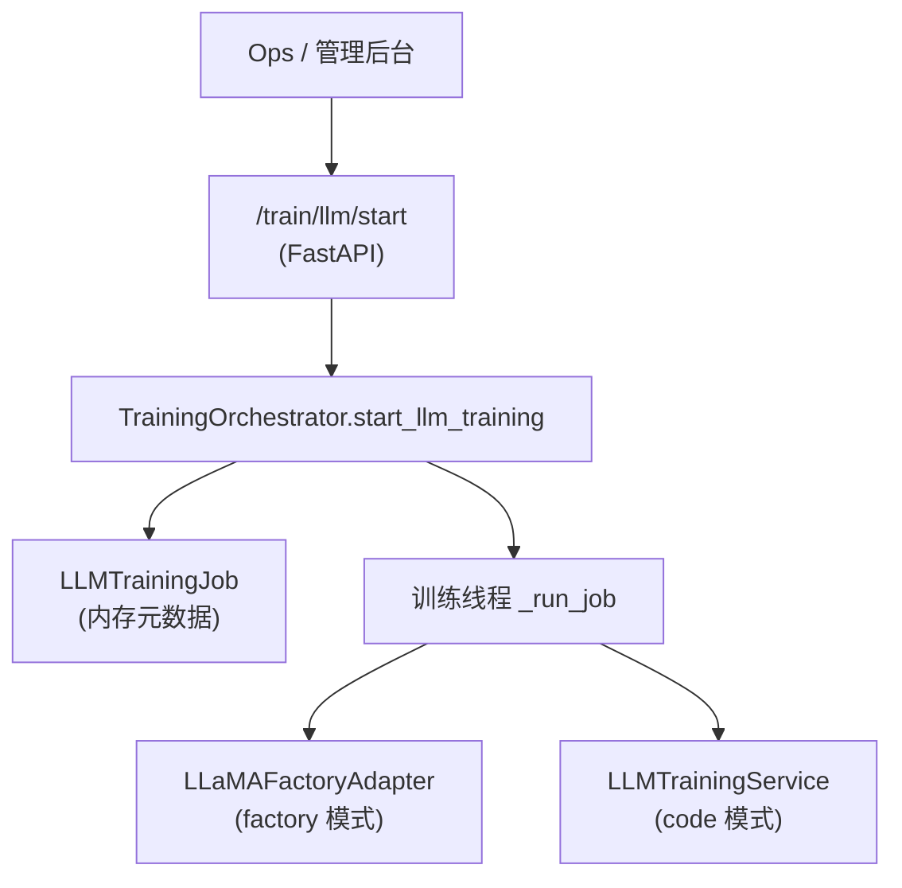

# 大模型训练微调整体实现技术说明

> 本文描述当前仓库中“大模型训练/微调”能力的整体实现：从 `train_admin` API 到 `TrainingOrchestrator`，再到 LLaMA-Factory 适配与代码训练服务之间的协同。  
> 训练部分与推理/RAG 解耦，仅共享日志、配置与模型产出目录。

---

## 文档结构（阅读导航）

| 章节 | 内容 |
|------|------|
| **§1 从使用视角看整体流程** | `/train/llm/start` → Orchestrator → Factory / Code 训练 |
| **§2 模块与文件映射** | API、Orchestrator、LLaMA-Factory 适配、代码训练服务与模型配置 |
| **§3 训练任务模型与状态管理** | `LLMTrainingJob`、job 列表与状态查询 |
| **§4 Factory 模式与 Code 模式对比** | 两条训练路径的职责划分 |
| **§5 配置与依赖** | 训练相关的配置建议与 requirements 提示 |
| **§6 调用链示意图** | 从 HTTP 到训练进程的结构图 |

---

## 1. 从使用视角看整体流程

### 1.1 `/train/llm/start` 与 `/train/llm/status`

1. **启动训练任务：`POST /train/llm/start`**  
   - 路由文件：`app/api/train_admin.py`。  
   - 请求模型：`LLMTrainJobRequest`（`app/models/train.py`），核心字段：  
     - `mode`: `"factory"` 或 `"code"`；  
     - `base_model`: 基础模型名称或路径；  
     - `dataset_path`: 训练数据集路径；  
     - `output_dir`: 训练输出目录；  
     - `extra_args`: 额外参数（batch_size、lr 等，自由 key/value）；  
     - `resume_from_checkpoint`: 仅 code 模式下可选的断点续训路径。  
   - API 根据 mode 构造不同的配置对象：  
     - `"factory"` → `LLaMAFactoryConfig`；  
     - `"code"` → `LLMTrainingConfig`。  
   - 然后调用全局 `TrainingOrchestrator.start_llm_training(...)`，返回内部 `LLMTrainingJob`，并映射为 `LLMTrainJobStatus` 返回给调用方。

2. **查询训练任务：`GET /train/llm/status`**  
   - 支持两种模式：  
     - 带 `job_id` 查询单个任务的详细状态；  
     - 不带 `job_id` 返回所有任务列表（简要信息）。  
   - 数据源：`TrainingOrchestrator.get_job` / `list_jobs`。

> **注意**：`/train/llm/*` 接口设计为内部/运维使用，不建议直接开放给业务前台。

---

## 2. 模块与文件映射

| 模块 | 路径 | 职责 |
|------|------|------|
| API 路由 | `app/api/train_admin.py` | 定义 `/train/llm/start` 与 `/train/llm/status`，面向内部使用。 |
| 任务模型 | `app/models/train.py` | `LLMTrainJobRequest` / `LLMTrainJobStatus`，定义对外请求/响应结构。 |
| 调度器 | `app/train/orchestrator.py` | `TrainingOrchestrator` 与 `LLMTrainingJob`，统一管理训练任务。 |
| Factory 适配 | `app/train/llm_factory_adapter.py` | `LLaMAFactoryAdapter` / `LLaMAFactoryConfig`，负责与 LLaMA-Factory 交互（骨架）。 |
| 代码训练服务 | `app/train/llm_training.py` | `LLMTrainingService` / `LLMTrainingConfig`，封装基于 Transformers + PEFT 的 LoRA 示例训练。 |

---

## 3. 训练任务模型与状态管理

### 3.1 LLMTrainingJob 与状态流转

- `LLMTrainingJob`（`app/train/orchestrator.py`）：  
  - 字段：`job_id`、`mode`、`config_factory`、`config_code`、`status`、`created_at`、`started_at`、`finished_at`、`output_dir`、`error`；  
  - `status` 枚举：`"pending" → "running" → "succeeded"/"failed"`。  
- `TrainingOrchestrator.start_llm_training(...)`：  
  - 在线程安全的 `_lock` 下：  
    - 若相同 job_id 已存在，则直接返回旧 job（幂等）；  
    - 否则创建新 job，并创建守护线程执行 `_run_job(job_id)`。  
- `_run_job(job_id)`：  
  - 将 job 状态置为 `"running"`，记录开始时间；  
  - 根据 job.mode 决定调用 `_factory.start_training(...)` 或 `_code.start_training(...)`；  
  - 捕获异常并更新 `status` 与 `error` 字段；  
  - 最后记录 `finished_at`，并打印日志。

### 3.2 状态查询

- `get_job(job_id)`：返回单个任务的当前快照；  
- `list_jobs()`：以 dict 返回所有任务拷贝，用于构造状态列表。

---

## 4. Factory 模式与 Code 模式

### 4.1 Factory 模式（LLaMA-Factory）

- 配置结构：`LLaMAFactoryConfig`（base_model、dataset_path、output_dir、extra_args）。  
- 适配器：`LLaMAFactoryAdapter.start_training(cfg)`：  
  - 当前仅记录训练参数与 endpoint/script_path 日志；  
  - 实际生产中可选择：  
    - 通过 HTTP 调用远程 LLaMA-Factory 服务提交任务；  
    - 通过 `subprocess` 调用本地训练脚本（如 `python cli.py ...`）。  
- 适用场景：  
  - 需要借助 LLaMA-Factory 自带的 Web UI 或模板化配置；  
  - 对训练过程的细节控制需求不高，更关注可视化与易用性。

### 4.2 Code 模式（内部训练脚本）

- 配置结构：`LLMTrainingConfig`（base_model、dataset_path、output_dir、mode、resume_from_checkpoint、extra_args）。  
- 服务类：`LLMTrainingService.start_training(cfg)`：  
  - 记录训练配置日志；  
  - 若 `cfg.mode == "lora"`：调用 `_run_lora_training(cfg)`；  
  - 否则当前仅记录“尚未实现”的 warning。  
- `_run_lora_training(cfg)`：  
  - 使用 Transformers + PEFT + Datasets 等典型库构建 LoRA 训练流程；  
  - 支持通过 `extra_args` 配置 batch_size、learning_rate、num_epochs、max_length 等超参；  
  - 在依赖未安装时仅记录错误并退出，不影响整体服务可用性。  
- 适用场景：  
  - 需要在代码层细粒度控制训练流程与实验逻辑；  
  - 需要将训练脚本纳入 CI/CD 或自动化任务中。

---

## 5. 配置与依赖

- 依赖文件：  
  - `requirements-大模型训练.txt`：建议按需加入 Transformers、Datasets、PEFT、Accelerate、LLaMA-Factory 等相关依赖。  
- 配置建议：  
  - 训练输出目录 `output_dir` 应挂载到持久化存储中（参考 `framework-guide/数据持久化与容器部署说明.md`）；  
  - 对于生产环境的 LLaMA-Factory 集成，应通过环境变量或配置文件指定 endpoint/script_path，以便在不同环境中灵活切换。  
- 与推理/RAG 的关系：  
  - 训练产出的模型可用于部署到 vLLM 或其他推理服务，再由通用推理、Chatbot、综合分析等场景通过 LLMConfigRegistry 引用。

---

## 6. 调用链示意图

> **说明**：训练线程以守护线程方式运行，不阻塞 API 执行；调用方可通过 `/train/llm/status` 查询任务进度与结果。

