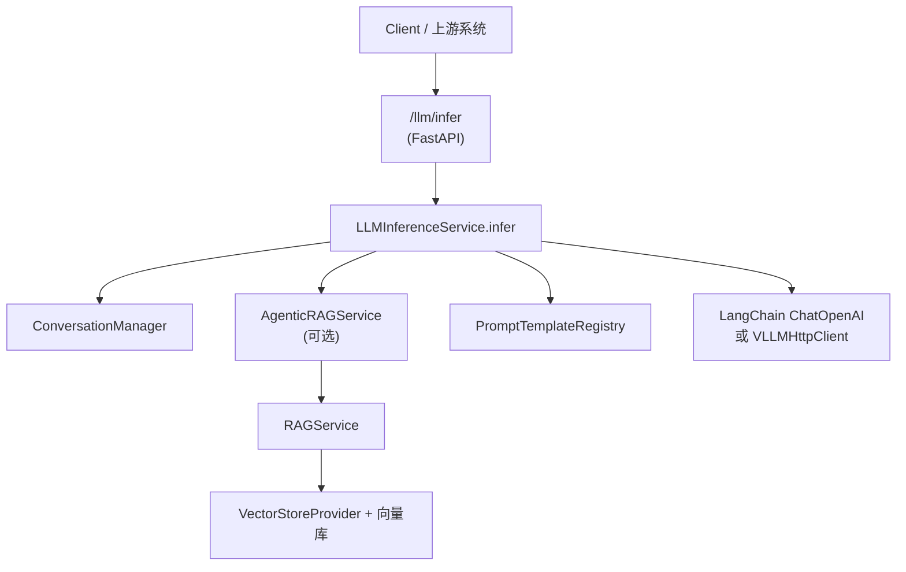

# 大模型通用推理整体实现技术说明

> 本文描述 `/llm/infer` 通用推理链路在当前基座中的实现：从 API → Service → LLM 调用，到如何按配置接入 RAG、上下文与 Agentic 预处理。  
> RAG 相关细节请参考 `framework-guide/RAG整体实现技术说明.md`。

---

## 文档结构（阅读导航）

| 章节 | 内容 |
|------|------|
| **§1 从使用视角看整体流程** | 请求处理主线：`/llm/infer` → Service → RAG/上下文 → LLM 调用 |
| **§2 模块与文件映射** | 关键类与文件速查 |
| **§3 详细说明** | RAG/上下文集成、Prompt 模板、LLM 调用与 LangSmith 埋点 |
| **§4 配置与环境变量** | 与 LLMConfig / RAGConfig / 会话相关的配置 |
| **§5 调用链示意图** | 从 HTTP 到大模型的端到端示意 |

---

## 1. 从使用视角看整体流程

### 1.1 请求处理主线：从 `/llm/infer` 到 LLM 响应

在当前实现中，通用推理接口的整体调用链路如下：

1. **API 层入口**  
   - 路由：`POST /llm/infer`（`app/api/llm_inference.py`）  
   - 请求模型：`LLMInferenceRequest`（`app/models/llm.py`），支持：  
     - 单轮 `prompt` 或多轮 `messages`；  
     - `user_id` / `session_id`；  
     - `model`（逻辑模型名，对应 `LLMConfigRegistry`）；  
     - `enable_rag` / `enable_context`；  
     - `rag_mode`（`basic` / `agentic`）。  
   - 工厂函数 `get_service()` 返回 `LLMInferenceService` 实例。

2. **Service 层：`LLMInferenceService.infer`**  
   1. 根据请求或默认配置确定使用的逻辑模型（`model_name`）。  
   2. 使用 `ConversationManager` 将用户问题（或合成后的 user_content）记录到会话存储，用于上下文管理与追踪。  
   3. 若 `rag_mode="agentic"` 且 LangChain 可用，则通过 `_analyze_intent_and_plan` 做**轻量问题诊断与规划**（Agentic 预处理），得到 `planner_summary` 文本，用于后续 RAG 检索和 Prompt 增强。  
   4. 若 `enable_rag` 为真，则：  
      - 通过 `AgenticRAGService`（封装在 Service 内部）调用 RAG：  
        - 构造 `RAGContext(user_id, session_id, scene="llm_inference")`；  
        - 基于 planner_summary（如存在）与原问题组成 RAG query；  
        - 按 `rag_mode` 选择 BASIC / AGENTIC 模式（当前两者实现等价），内部由 `RAGService` 完成交互（细节见 RAG 文档）；  
      - 得到 `context_snippets` 列表，并标记 `used_rag`。  
   5. 若 `enable_context` 为真，则通过 `ConversationManager.get_recent_history` 取最近若干条历史消息，转为 `ChatMessage` 列表作为对话上下文。  
   6. 通过 `PromptTemplateRegistry` 读取 scene=`llm_inference` 的 Prompt 模板，得到可选的 `system_prompt` 与 `prompt_version`。  
   7. 调用下层大模型：  
      - 若 LangChain ChatOpenAI 可用 → `_infer_via_langchain(...)`：  
        - 组合 System + 历史消息 + 当前 user_content + RAG 片段（以适当方式注入）；  
      - 否则 → `_infer_via_llm_client(...)` 使用 `VLLMHttpClient` 直接调用 vLLM / OpenAI 兼容接口。  
   8. 将 LLM 返回结果写入会话（作为 assistant 消息）。  
   9. 构造 `LLMInferenceResponse`（answer、model、prompt_version、used_rag、context_snippets）。  
   10. 若启用 LangSmith，则通过 `LangSmithTracker.log_run` 记录一次调用过程，包含输入、输出与若干元数据（scene、model、prompt_version、是否启用 RAG/上下文）。

> **与 RAG 的关系**：通用推理完全复用 `AgenticRAGService` + `RAGService` + `VectorStoreProvider` 链路；RAG 的知识摄入、命名空间与 GraphRAG 能力详见 `RAG 整体实现技术说明`，本节不重复展开。

---

## 2. 模块与文件映射

| 模块 | 路径 | 职责 |
|------|------|------|
| API 入口 | `app/api/llm_inference.py` | `POST /llm/infer`，将请求交给 `LLMInferenceService.infer`。 |
| Service | `app/services/llm_inference_service.py` | 实现通用推理业务逻辑：会话记录、Agentic 预处理、RAG 集成、Prompt 管理与 LLM 调用。 |
| LLM 配置中心 | `app/llm/config_registry.py` | `LLMConfigRegistry`：管理默认模型、endpoint、api_key 等。 |
| LLM 客户端 | `app/llm/client.py` | `VLLMHttpClient`：对 vLLM / OpenAI 兼容接口的轻量封装。 |
| Prompt 管理 | `app/llm/prompt_registry.py` | `PromptTemplateRegistry`：按 scene/user/version 获取 Prompt 模板与版本。 |
| RAG 基座 | `app/rag/agentic.py`、`app/rag/rag_service.py` | `AgenticRAGService` / `RAGService`：封装 BASIC/AGENTIC 模式与实际检索逻辑（见 RAG 文档）。 |
| 会话管理 | `app/conversation/manager.py` | `ConversationManager`：记录用户与助手消息，支持上下文截断与摘要。 |
| LangSmith 集成 | `app/llm/langsmith_tracker.py` | `LangSmithTracker`：按需记录 LLM 调用 trace。 |

---

## 3. 详细说明

### 3.1 RAG 与上下文集成（简要）

- RAG 入口：`LLMInferenceRequest.enable_rag` 与 `rag_mode`。  
- RAG 行为：由 `AgenticRAGService` 根据 mode 调用 RAG（当前 BASIC/AGENTIC 等价），实际检索逻辑参见 `RAG 整体实现技术说明`。  
- 上下文入口：`LLMInferenceRequest.enable_context`。  
- 上下文来源：`ConversationManager.get_recent_history(user_id, session_id)`，默认取最近若干条消息并注入到 Prompt。

### 3.2 Prompt 模板策略

- 模板来源：`PromptTemplateRegistry.get_template(scene="llm_inference", user_id, version)`。  
- 用途：  
  - 提供全局 System 提示，如“你是一个企业内部通用问答助手”；  
  - 可按用户 / 版本区分不同提示风格或业务场景；  
  - 与 LangSmith 结合进行 A/B 实验与效果评估。

### 3.3 LLM 调用与回退策略

- 优先尝试通过 LangChain ChatOpenAI 调用 vLLM / OpenAI 兼容服务（便于利用 LangChain 的生态与工具链）。  
- 若 LangChain 不可用或初始化失败，则回退到直接使用 `VLLMHttpClient` 按 OpenAI 兼容协议调用后端。  
- 所有调用路径均支持注入 RAG 上下文与历史消息，并最终在 `LLMInferenceResponse` 中返回 `used_rag` 与 `context_snippets`。

---

## 4. 配置与环境变量

通用推理依赖以下主要配置（与 `app/core/config.py` / LLMConfigRegistry 对齐）：

- LLM：  
  - `LLM_DEFAULT_MODEL`（默认逻辑模型 ID）；  
  - `LLM_DEFAULT_ENDPOINT`（vLLM / OpenAI 兼容服务地址）；  
  - `LLM_DEFAULT_API_KEY`（调用凭证）。  
- RAG 与上下文：  
  - `RAG_ENABLE_BY_DEFAULT`、`RAG_TOP_K` 等，详见 `RAG 整体实现技术说明`；  
  - `APP_ENV`、`REDIS_URL` 等，会影响 `ConversationManager`（是否使用 Redis 等）。

---

## 5. 调用链示意图

> **说明**：RAG 细节与向量库/GraphRAG 行为见 `RAG 整体实现技术说明`，本图仅展示通用推理调用链的大致轮廓。

