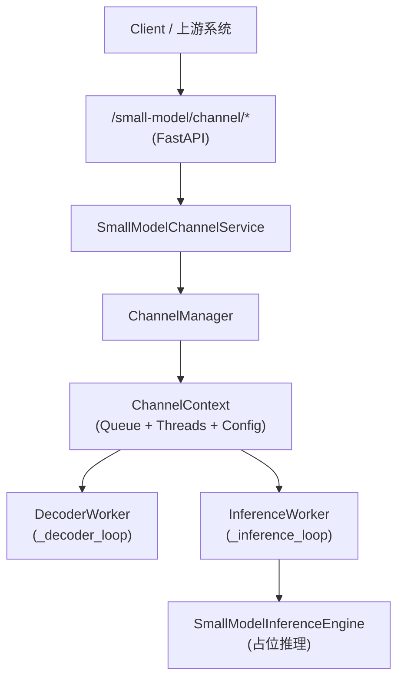

# 小模型通道推理整体实现技术说明

> 本文描述 `/small-model/channel/*` 小模型通道管理与推理链路的整体实现：如何通过 API 管理通道生命周期，如何在通道内部以多线程方式完成“解码 → 推理”，以及与小模型注册表/权重的衔接。  
> 与 RAG/NL2SQL 无直接耦合，本说明聚焦“小模型推理通道”本身。

---

## 文档结构（阅读导航）

| 章节 | 内容 |
|------|------|
| **§1 从使用视角看整体流程** | 通道启动/停止/更新/查询的整体使用路径 |
| **§2 模块与文件映射** | API、Service、ChannelManager、Workers、InferenceEngine 等 |
| **§3 通道生命周期与线程模型** | `ChannelManager` 的对象锁、通道锁与线程管理 |
| **§4 推理引擎与注册表** | `SmallModelInferenceEngine` 与 `SmallModelRegistry` 接口职责 |
| **§5 配置与依赖** | 与小模型应用/训练相关的配置与 requirements 提示 |
| **§6 调用链示意图** | 从 HTTP 到解码/推理线程的结构图 |

---

## 1. 从使用视角看整体流程

### 1.1 通道生命周期管理（API → Service → ChannelManager）

1. **API 层：`/small-model/channel/*`**  
   - 入口文件：`app/api/small_model.py`；在 `app/main.py` 中通过 `app.include_router(small_model.router, prefix="/small-model", tags=["small-model"])` 注册。  
   - 提供的主要接口：  
     - `POST /small-model/channel/start`：启动通道；  
     - `POST /small-model/channel/stop`：停止通道；  
     - `POST /small-model/channel/update`：更新通道配置；  
     - `GET /small-model/channel/status`：查询通道状态。  
   - 所有接口统一使用 `SmallModelChannelConfig` / `SmallModelChannelStatus`（`app/models/small_model.py`）作为请求/响应模型。

2. **Service 层：`SmallModelChannelService`**  
   - 文件：`app/services/small_model_channel_service.py`。  
   - 职责：在 API 与底层 `ChannelManager` 之间做 Pydantic 模型与内部配置对象（`ChannelConfig`）的转换：  
     - `start(cfg: SmallModelChannelConfig)` → 构造 `ChannelConfig` 并调用 `ChannelManager.start_channel`；  
     - `stop(channel_id)` → 调用 `ChannelManager.stop_channel`；  
     - `update(cfg)` → 调用 `ChannelManager.update_channel`；  
     - `status(channel_id)` → 调用 `ChannelManager.get_status` 并包装成 `SmallModelChannelStatus`。

3. **实现层：`ChannelManager` 与通道上下文**  
   - 文件：`app/small_models/channel_manager.py`。  
   - 关键职责：  
     - 维护 `channel_id → ChannelContext` 的映射；  
     - 为每个通道维护独立的 `channel_lock` 来保证 `start/stop/update` 的互斥；  
     - 使用全局 `_objects_lock` 管理对 `_channels` 映射的并发访问。  
   - `ChannelContext` 内容包含：  
     - `ChannelConfig`（模型名、队列大小、视频源、extra_params/algor_type 等）；  
     - `message_queue`（有界队列）；  
     - `stop_event`；  
     - `decoder_thread` / `inference_thread`。

### 1.2 通道内部推理流程：解码 → 推理

1. **启动通道时的线程创建**  
   - `ChannelManager.start_channel(channel_id, config)` 中：  
     1. 在 `_objects_lock` 下检查并创建 `ChannelContext`；  
     2. 在通道 `channel_lock` 下调用 `start_decoder_worker(ctx)` 与 `start_inference_worker(ctx)`；  
     3. 这两个函数定义在 `app/small_models/workers.py` 中，返回对应的 `threading.Thread` 对象并启动循环。

2. **解码线程 `_decoder_loop`**（`workers.py`）  
   - 从 `ChannelContext.config.video_source` 决定使用真实视频源还是 dummy 帧：  
     - 若配置了 `video_source`，尝试使用 OpenCV 打开流 (`cv2.VideoCapture`)；  
     - 打不开或缺少依赖时，回退到 dummy 帧模式。  
  - 在循环中：  
    - 使用**有界队列背压**：队列满时用 `put(timeout=...)` 等待空位（避免 `full()+sleep` 忙等）；  
     - 构造 `frame_payload`（包含 `video_source`、`algor_type` 以及真实帧或 dummy 标记）；  
     - 将 payload 放入 `message_queue`；  
     - 由 `stop_event` 控制退出。

3. **推理线程 `_inference_loop`**（`workers.py`）  
  - 从队列中读取 `frame_item`，并调用 `SmallModelInferenceEngine.infer(channel_id, model_name, frame_item, api_overrides=...)`；  
   - 推理完成后，通过 Prometheus 指标 `SMALL_MODEL_FRAMES_PROCESSED` 记录处理帧数；  
   - 同样由 `stop_event` 控制退出，队列超时则继续轮询。

4. **小模型推理引擎：`SmallModelInferenceEngine`**  
   - 文件：`app/small_models/inference_engine.py`。  
  - 当前实现为**可运行版**（按算法类型分发策略）：  
    - 优先从 API 参数（`SmallModelChannelConfig`）读取覆盖项：`algor_type/weights_path/callback_url/evidence_dir/...`；  
    - 读取本地算法配置 `configs/small_model_algorithms.yaml`（`algor_type -> strategy/model/weights/...`）；  
    - 按 `algor_type` 选择 `app/small_models/strategy/` 下的策略类执行推理；  
    - 触发时保存证据（帧图片、视频片段）并做 Web 回调（如配置了 `callback_url`）。

> **与训练/大模型部分的关系**：小模型通道管理与训练在代码层独立于 RAG 与 NL2SQL，仅通过公用的日志、指标与配置中心进行协作。

---

## 2. 模块与文件映射

| 模块 | 路径 | 职责 |
|------|------|------|
| API 路由 | `app/api/small_model.py` | 定义 `/small-model/channel/*` 四个管理接口。 |
| Service | `app/services/small_model_channel_service.py` | 将 Pydantic 配置转换为 `ChannelConfig` 并调用 `ChannelManager`。 |
| 通道管理 | `app/small_models/channel_manager.py` | 通道上下文管理、全局对象锁与通道锁、线程启动与停止。 |
| Worker 线程 | `app/small_models/workers.py` | `start_decoder_worker` / `start_inference_worker` 及其循环逻辑。 |
| 推理引擎 | `app/small_models/inference_engine.py` | `SmallModelInferenceEngine`，按 `algor_type` 选择策略推理，保存证据并回调。 |
| 注册表 | `app/small_models/registry.py` | `SmallModelRegistry`，维护小模型算法与权重路径的元数据。 |
| 算法类型配置 | `configs/small_model_algorithms.yaml` | `algor_type -> strategy/model/weights/阈值/证据/回调` 的本地配置（API 可覆盖）。 |
| 算法类型注册表 | `app/small_models/algorithm_registry.py` | 加载 `small_model_algorithms.yaml`，并与 API 覆盖合并。 |
| 策略封装 | `app/small_models/strategy/*` | 不同算法类型对应不同策略实现（如 `CallingStrategy`）。 |
| 证据保存 | `app/small_models/evidence.py` | 保存帧图片与视频片段（简化版 clip 录制）。 |
| 回调客户端 | `app/small_models/callback_client.py` | 将检测结果（含证据路径）回调到业务 Web 服务。 |
| 请求/响应模型 | `app/models/small_model.py` | `SmallModelChannelConfig` / `SmallModelChannelStatus`。 |

---

## 3. 通道生命周期与线程模型

### 3.1 生命周期操作

- **启动通道**：  
  `POST /small-model/channel/start` → `SmallModelChannelService.start` → `ChannelManager.start_channel` → 创建 `ChannelContext` + 启动 decoder/inference 线程。  
- **停止通道**：  
  `POST /small-model/channel/stop` → `SmallModelChannelService.stop` → `ChannelManager.stop_channel` → 设置 `stop_event` + `join` 线程 + 清理上下文。  
- **更新配置**：  
  `POST /small-model/channel/update` → `SmallModelChannelService.update` → `ChannelManager.update_channel` → 在 `channel_lock` 下更新 `ChannelConfig`。  
- **查询状态**：  
  `GET /small-model/channel/status` → `SmallModelChannelService.status` → `ChannelManager.get_status`。

### 3.2 线程安全设计

- 采用**两层锁**结构：  
  - 全局 `_objects_lock`：保护 `_channels` 映射（创建/删除通道时使用）；  
  - 每通道 `channel_lock`：保护单个通道的配置更新与线程启动/停止。  
- 消息队列：  
  - 使用有界 `Queue`，避免队列无限增长导致内存膨胀；  
  - 解码线程在队列满时短暂 sleep，再次尝试写入。

---

## 4. 推理引擎与模型注册表

- **SmallModelRegistry**：  
  - 维护算法名称到模型权重路径、任务类型等元数据的映射；  
  - `SmallModelInferenceEngine` 通过它查找模型元信息。
- **SmallModelInferenceEngine**：  
  - 当前仅记录推理调用日志，便于在无真实算法与权重的情况下打通通道链路；  
  - 生产环境可将其扩展为加载 ONNX/TensorRT/PyTorch 模型并执行实际推理。

---

## 5. 配置与依赖

- 依赖文件：`requirements-小模型应用.txt`（通道解码需要 OpenCV；策略推理可按需引入 `ultralytics`/`torch` 等）。  
- 日志与指标：  
  - 日志通过 `LoggingManager` 输出；  
  - 指标（如 `SMALL_MODEL_FRAMES_PROCESSED`）通过 `app/core/metrics.py` 暴露到 `/metrics`，供 Prometheus 抓取。

### 5.1 算法类型配置（本地 + API 覆盖）

- **本地配置**：`configs/small_model_algorithms.yaml`
  - 以 `algor_type` 为键配置：`strategy/model_name/weights_path/device/imgsz/conf/iou/cooldown_seconds/evidence_dir/clip_seconds/callback_url`
- **覆盖优先级**：API 请求参数（`SmallModelChannelConfig`）> 本地配置

### 5.2 示例：启动接打电话检测通道（algor_type=40417）

请求示例（字段可按需删减；传入的项将覆盖本地配置）：

```json
{
  "channel_id": "ch-001",
  "model_name": "calling_yolo",
  "algor_type": "40417",
  "video_source": "rtsp://user:pass@ip/stream",
  "queue_size": 64,
  "weights_path": "app/small_models/pretrained/call.pt",
  "evidence_dir": "data/small_model_evidence",
  "clip_seconds": 10,
  "cooldown_seconds": 300,
  "callback_url": "http://your-web-service/api/small-model/callback",
  "device": "cpu",
  "imgsz": 640,
  "conf": 0.25,
  "iou": 0.7
}
```

---

## 6. 调用链示意图



> **说明**：该通道层仅负责“小模型推理管线”的线程与队列管理，具体小模型实现由 `SmallModelInferenceEngine` 与 `SmallModelRegistry` 决定。

