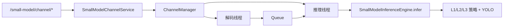

# 小模型通道推理整体实现技术说明

> **企业版（简练口径）**：通道解码、队列、推理线程与 `infer` 逐步说明见  
> **`enterprise-level_transformation_docs/小模型应用通道实现策略.md`**；  
> 算法配置合并与策略分层见 **`enterprise-level_transformation_docs/小模型算法策略实现说明.md`**。  
> 本文保留模块索引与接口示例，与上述两篇同步，不重复粘贴长流程。

---

## 1. 接口与模块映射

| 接口 | 文件 |
|------|------|
| `POST /small-model/channel/start` · `stop` · `update` · `GET .../status` | `app/api/small_model.py`（`app/main.py` 挂载 `prefix=/small-model`） |
| Pydantic 请求体 | `app/models/small_model.py` → `SmallModelChannelConfig`（含 `algor_type`、`video_source`、`class_filter`、L3 可选字段等） |
| Service | `app/services/small_model_channel_service.py` → `ChannelConfig` + `ChannelManager` |
| 通道与线程 | `app/small_models/channel_manager.py`、`app/small_models/workers.py` |
| 推理 | `app/small_models/inference_engine.py` + `app/small_models/strategy/*` |
| 算法表 | `configs/small_model_algorithms.yaml` + `app/small_models/algorithm_registry.py` |
| 可选注册表 | `configs/small_models.yaml` + `app/small_models/registry.py` |

**策略别名**：YAML 中旧名 `CallingStrategy` → **`RegularBehaviorDetectionStrategy`**（与 L2 共用单例）。

---

## 2. 解码与入队（要点）

- `cv2.VideoCapture(video_source)` 读 **BGR ndarray**；源变更时先 `release` 再重开。
- **无有效源或打不开**：不入队；约每 60s 一条 WARNING，避免向队列塞占位字符串。
- 有界队列 `put(timeout=0.1)` 实现背压。

---

## 3. 配置与依赖

- **`configs/small_model_algorithms.yaml`**：`algor_type` 主表；通道请求顶层字段经 Service 写入 `extra_params` 后 **覆盖** YAML。
- **依赖**：`requirements-小模型应用.txt`（**opencv-python** + **ultralytics** 等）。
- **指标**：`SMALL_MODEL_FRAMES_PROCESSED`（`app/core/metrics.py`）。

### 3.1 请求示例（`algor_type=40417`）

```json
{
  "channel_id": "ch-001",
  "model_name": "calling_yolo",
  "algor_type": "40417",
  "video_source": "rtsp://user:pass@ip/stream",
  "queue_size": 64,
  "weights_path": "app/small_models/pretrained/call.pt",
  "evidence_dir": "data/small_model_evidence",
  "clip_seconds": 10,
  "cooldown_seconds": 300,
  "callback_url": "http://your-web-service/api/small-model/callback",
  "device": "cpu",
  "imgsz": 640,
  "conf": 0.25,
  "iou": 0.7
}
```

L3 可在顶层增加 `complex_mode`、`dwell_polygon` 等（与 `SmallModelChannelConfig` 一致）。

---

## 4. 调用链（简图）



---

## 5. 与训练 / 大模型的关系

小模型通道与 RAG、NL2SQL 无代码耦合；共用日志与指标。
