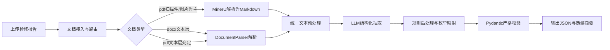

# 报告解析企业级实现方案

> 本文给出“基于大模型的检修报告结构化提取”在当前仓库中的企业级落地方案。目标是新增一个与“智能客服”“综合分析”并列的独立功能模块：接收用户上传的检修报告（格式不固定，含表格，可能包含扫描页/图片），输出可入库的标准化结构化 JSON。
>
> 本方案基于当前已实现能力：`DocumentParser`（docx/xlsx/pdf 解析）、`MinerU` 路由、LLM Client、Prompt Registry、服务/API 分层、可观测性体系。

---

## 1. 需求目标与边界

### 1.1 业务目标

- 输入：检修报告文档（重点 `docx` / `pdf`，格式不固定，正文+表格混排）。
- 输出：逐条结构化记录，必须包含以下字段：
  - `检测位置`
  - `行号`
  - `管号`
  - `壁厚`
  - `检测类型`（`测厚` / `缺陷`）
  - `缺陷类型`（仅允许：`高温腐蚀`、`磨损`、`结渣`、`蠕变`、`管道变形`、`表面吹损`、`氧化皮堆积`、`机械损伤`）
  - `是否换管`（`是` / `否`）

### 1.2 关键难点

- 报告格式不固定（标题、段落、表格样式差异大）。
- 同一文档中可能出现多检测位置、多阈值口径（不同区域超标阈值可能不同）。
- 表格和文本语义共同决定结论（不能只看壁厚数字）。
- 文档可能是扫描件（普通文本解析会丢关键信息）。

### 1.3 设计原则

- **解析与判定解耦**：先结构化抽取候选，再做规则判定和校验。
- **LLM + 规则协同**：LLM负责语义理解，规则负责边界收敛与一致性。
- **可追溯**：每条记录保留来源证据片段，便于人工核验。
- **可扩展**：后续可新增字段/缺陷类型/行业模板而不破坏主流程。

---

## 2. 总体架构方案

### 2.1 模块定位

新增独立模块 `inspection_extract`，与现有模块并列：

- API：`/inspection-extract/*`
- Service：编排“文档解析 -> LLM抽取 -> 规则后处理 -> 校验输出”
- Models：请求/响应及枚举定义
- Prompt：`configs/prompts.yaml` 新增 `inspection_extract_*` 模板

### 2.2 处理流程（高层）



### 2.3 与现有能力复用关系

- 解析层复用：
  - `app/rag/document_pipeline/parsers.py`（`DocumentParser`）
  - `app/rag/mineru_ingest.py`（PDF扫描件路由）
  - `app/rag/mineru_client.py`（MinerU 调用）
- LLM 层复用：
  - `app/llm/client.py` / `VLLMHttpClient`
  - `app/llm/prompt_registry.py`
- 配置与可观测性复用：
  - `app/core/config.py`
  - `app/core/metrics.py`
  - `app/core/logging.py`

---

## 3. 文档解析策略（普通解析 vs MinerU）

### 3.1 路由策略（推荐）

1. `docx`：优先 `DocumentParser._parse_docx`
   - 可保留段落和原生表格顺序输出（`[DOCX_TABLE ...]`）。
2. `pdf`：
   - 先做文本层抽样分析（已有 `is_likely_scanned_pdf`）。
   - 若文本层充足：走 `pypdf` 普通解析。
   - 若判定扫描件：必须走 MinerU（`MINERU_ENABLED=true`）。

### 3.2 结论

- **不是二选一**，应采用“普通解析优先 + 扫描件自动走 MinerU”的分层路由。
- 对你当前场景（报告含大量表格与现场图片）这是精度/成本/稳定性最佳平衡。

---

## 4. 数据模型设计（输出契约）

### 4.1 核心记录模型

```json
{
  "检测位置": "水冷壁右墙B02吹灰器",
  "行号": "1",
  "管号": "12",
  "壁厚": 4.73,
  "检测类型": "缺陷",
  "缺陷类型": "表面吹损",
  "是否换管": "是",
  "evidence": "检查发现右墙从上往下第X层..."
}
```

### 4.2 响应封装建议

```json
{
  "ok": true,
  "records": [],
  "summary": {
    "total": 0,
    "defect_count": 0,
    "replace_count": 0,
    "warnings": []
  },
  "trace": {
    "parse_route": "docx|pdf_text|mineru",
    "llm_model": "default",
    "prompt_version": "inspection_extract:v1"
  }
}
```

### 4.3 枚举约束

- `检测类型`：`测厚` / `缺陷`
- `缺陷类型`：限定 8 类；当 `检测类型=测厚` 时必须为空
- `是否换管`：`是` / `否`

---

## 5. 字段判定与业务规则

### 5.1 基础抽取

- `检测位置`：从章节标题、段落语义、表头上下文综合推断。
- `行号`/`管号`/`壁厚`：优先取表格数据，文本补充修正。

### 5.2 检测类型判定

- 判定顺序：
  1. 优先文本语义（如“减薄超标”“高温腐蚀”“缺陷”关键词）。
  2. 再结合壁厚与该段落阈值（如“低于3.15mm超标”）。
  3. 无异常语义且厚度正常 -> `测厚`；否则 -> `缺陷`。

### 5.3 缺陷类型映射

- 对 `检测类型=缺陷` 的记录，按语义映射到 8 个合法值之一。
- 建议建立同义词映射（示例）：
  - 表面冲刷/吹蚀 -> `表面吹损`
  - 高温氧化腐蚀 -> `高温腐蚀`
  - 结焦/积灰结块 -> `结渣`

### 5.4 是否换管判定

- 文本明确“更换/换管/已更换X根” -> `是`
- 明确“建议监测/未更换/无需更换” -> `否`
- 语义不明确时：
  - 若检测类型为 `测厚` 且无异常描述 -> `否`
  - 若检测类型为 `缺陷` 且存在“超标”但未给处置 -> `否`（并在 warnings 标记“待人工确认”）

---

## 6. Prompt 方案（企业级）

### 6.1 分阶段模板设计

建议使用三段式 Prompt：

1. `inspection_extract_parse`
   - 目标：从文档中抽取候选记录（位置、行号、管号、壁厚、证据）
2. `inspection_extract_classify`
   - 目标：判定检测类型、缺陷类型、是否换管
3. `inspection_extract_repair`
   - 目标：修复 JSON 合规问题（缺失字段、非法枚举、类型错误）

### 6.2 关键提示词约束

- 只输出 JSON，不输出解释文本。
- 必须逐条输出，不可合并多条记录。
- 缺陷类型必须属于给定 8 类，不允许自由发挥。
- 当无法确定字段值时，输出 `null` 并附 `warnings`，禁止臆造。

---

## 7. 模块落地设计（代码结构）

建议新增文件：

- `app/models/inspection_extract.py`
  - `InspectionExtractRequest`
  - `InspectionRecord`
  - `InspectionExtractResponse`
  - 枚举：`DetectionType`、`DefectType`、`ReplaceFlag`
- `app/services/inspection_extract_service.py`
  - `extract_from_document(request)`
  - `_parse_document(...)`
  - `_run_llm_extraction(...)`
  - `_post_process_records(...)`
  - `_build_summary(...)`
- `app/api/inspection_extract.py`
  - `POST /inspection-extract/run`
- `configs/prompts.yaml`
  - 增加 `scene=inspection_extract` 相关模板版本

---

## 8. API 设计建议

### 8.1 请求

- `user_id`、`session_id`
- 文档标识（本地路径或可访问 URL）
- `source_type`（`docx|pdf|markdown|text`）
- 可选参数：
  - `strict`：严格模式（校验不通过是否直接失败）
  - `return_evidence`：是否返回证据片段

### 8.2 响应

- `records[]`：标准化结构化结果
- `summary`：统计信息与告警
- `trace`：解析路径、模型、模板版本、耗时

---

## 9. 质量保障与验收标准

### 9.1 最低验收指标（建议）

- 字段完整率（必填字段非空） >= 98%
- 枚举合法率 = 100%
- JSON 结构合法率 = 100%
- 关键字段准确率（人工抽检） >= 90%

### 9.2 测试集构建

- 至少 30 份报告，覆盖：
  - 纯文本 docx
  - 表格密集 docx
  - 文本层 pdf
  - 扫描件 pdf（需 MinerU）
  - 多阈值/多检测位置混合文档

### 9.3 自动化测试

- 单测：
  - 枚举映射与规则判定
  - JSON 修复逻辑
- 集成测试：
  - 文档解析链路
  - LLM 输出校验与重试
- 回归测试：
  - 典型报告样例输出对比（golden set）

---

## 10. 可观测性与运维

### 10.1 建议指标

- `INSPECT_EXTRACT_REQUEST_COUNT`（started/success/failed）
- `INSPECT_EXTRACT_PARSE_LATENCY_SECONDS`
- `INSPECT_EXTRACT_LLM_LATENCY_SECONDS`
- `INSPECT_EXTRACT_RECORD_COUNT`
- `INSPECT_EXTRACT_VALIDATION_FAIL_COUNT`

### 10.2 建议日志字段

- `request_id`、`user_id`、`session_id`
- `doc_name`、`source_type`、`parse_route`
- `prompt_version`、`llm_model`
- `records_total`、`defect_count`、`replace_count`

---

## 11. 风险与降级策略

### 11.1 主要风险

- 文档扫描质量差导致 OCR 噪声高
- 表格跨页/合并单元格导致错位
- 阈值语义只在文本中出现，难与表格记录精确绑定

### 11.2 降级方案

- MinerU 不可用时：
  - 对扫描 PDF 返回明确错误码 `E_MINERU_REQUIRED` 或 `E_MINERU_PARSE`
- LLM 输出不合规时：
  - 自动二次修复（`inspection_extract_repair`）
  - 仍失败则返回 `strict=false` 下的部分结果 + warnings

---

## 12. 分阶段实施计划

### Phase 1：最小可用版本（MVP）

- 新增模型、服务、API
- 接入文档解析路由（普通解析 + MinerU）
- 单阶段 Prompt 输出 JSON
- 基础校验与返回

### Phase 2：企业级增强

- 三阶段 Prompt（抽取/分类/修复）
- 同义词映射、阈值绑定、证据回溯
- 指标与结构化日志完善
- 回归测试集与基线评估

### Phase 3：持续优化

- 场景模板分版本（锅炉类型/机组类型）
- 结合历史人工修正数据做 Prompt 优化
- 可选引入多模态模型增强图片页理解

---

## 13. Phase 1 + Phase 2开发清单

> 目标：该清单覆盖上线前“可交付 + 企业稳态”所需工作，完成后即可支撑生产使用；不包含 Phase 3 的中长期优化项。

### 13.1 代码与文件级任务清单

1. **数据模型（Phase 1）**
   - 新增 `app/models/inspection_extract.py`
   - 定义请求/响应模型：
     - `InspectionExtractRequest`
     - `InspectionRecord`
     - `InspectionExtractResponse`
   - 定义并约束枚举：
     - `DetectionType`：`测厚` / `缺陷`
     - `DefectType`：8 类固定值
     - `ReplaceFlag`：`是` / `否`
   - 补充字段校验：
     - `检测类型=测厚` 时 `缺陷类型` 必须为空
     - `壁厚` 必须可解析为数值

2. **服务层主流程（Phase 1）**
   - 新增 `app/services/inspection_extract_service.py`
   - 实现主入口 `extract_from_document(request)`
   - 拆分内部方法：
     - `_parse_document(...)`：解析路由（docx/pdf/mineru）
     - `_run_llm_extraction(...)`：调用 LLM 获取初版结构化 JSON
     - `_post_process_records(...)`：规则收敛与标准化
     - `_build_summary(...)`：统计汇总
   - 返回结构中包含 `trace`（解析路径、模型、prompt版本、耗时）

3. **解析路由接入（Phase 1）**
   - 在 `inspection_extract_service` 中复用：
     - `DocumentParser`（`app/rag/document_pipeline/parsers.py`）
     - `prepare_pdf_document_for_pipeline`（`app/rag/mineru_ingest.py`）
   - 路由规则：
     - docx -> 普通解析
     - pdf 文本层充足 -> 普通解析
     - pdf 扫描件 -> MinerU

4. **API 路由（Phase 1）**
   - 新增 `app/api/inspection_extract.py`
   - 提供 `POST /inspection-extract/run`
   - 请求体使用 `InspectionExtractRequest`
   - 响应体使用 `InspectionExtractResponse`
   - 将路由注册到主应用（通常在 `app/main.py`）

5. **Prompt 模板（Phase 1 + Phase 2）**
   - 修改 `configs/prompts.yaml`
   - Phase 1：提供单阶段模板 `inspection_extract`
   - Phase 2：补齐三阶段模板：
     - `inspection_extract_parse`
     - `inspection_extract_classify`
     - `inspection_extract_repair`
   - 模板中明确输出 JSON schema 与枚举白名单

6. **后处理规则增强（Phase 2）**
   - 在 `inspection_extract_service` 实现：
     - 缺陷同义词映射 -> 标准 8 类枚举
     - 阈值绑定（从段落中提取局部阈值，按检测位置/行段作用）
     - 是否换管语义归一（更换/建议更换/未更换）
   - 不确定记录打 `warnings`，禁止臆造

7. **输出修复与容错（Phase 2）**
   - 对 LLM 非法 JSON/字段缺失做自动修复重试（最多 1~2 次）
   - 修复失败时：
     - `strict=true`：返回业务错误
     - `strict=false`：返回部分结果 + warnings

8. **指标与日志（Phase 2）**
   - 在 `app/core/metrics.py` 新增：
     - `INSPECT_EXTRACT_REQUEST_COUNT`
     - `INSPECT_EXTRACT_PARSE_LATENCY_SECONDS`
     - `INSPECT_EXTRACT_LLM_LATENCY_SECONDS`
     - `INSPECT_EXTRACT_RECORD_COUNT`
     - `INSPECT_EXTRACT_VALIDATION_FAIL_COUNT`
   - 在服务层写结构化日志字段：
     - `request_id`, `parse_route`, `prompt_version`, `records_total`, `defect_count`

9. **环境变量与配置（Phase 2）**
   - 在 `app/core/config.py` 增加 `InspectionExtractConfig`（建议）
   - 在 `app/app-deploy/.env.example` 增加配置项（建议）：
     - `INSPECT_EXTRACT_ENABLED`
     - `INSPECT_EXTRACT_STRICT_DEFAULT`
     - `INSPECT_EXTRACT_MAX_REPAIR_RETRIES`
     - `INSPECT_EXTRACT_PROMPT_VERSION`

10. **测试（Phase 1 + Phase 2）**
    - 新增单测：
      - `tests/test_inspection_extract_models.py`
      - `tests/test_inspection_extract_rules.py`
    - 新增集成测试：
      - `tests/test_inspection_extract_service.py`
      - `tests/test_inspection_extract_api.py`
    - 覆盖点：
      - 枚举合法性
      - 缺陷类型映射
      - 解析路由分支（docx/pdf/mineru）
      - LLM 输出修复分支（成功/失败）

### 13.2 交付里程碑（建议）

- **M1（Phase 1 完成）**
  - API 可调用
  - 能从 docx/pdf 输出基础结构化 JSON
  - 完成基础模型校验与最小单测

- **M2（Phase 2 完成）**
  - 三阶段 Prompt 全量接入
  - 规则后处理、容错修复、指标日志完成
  - 测试覆盖和基线评估可用于上线验收

### 13.3 完成判定标准

- 功能完整：必填字段可稳定输出，枚举 100% 合法
- 稳定性：异常路径有明确错误码或 warnings
- 可运维：有关键指标和结构化日志
- 可验证：单测 + 集成测试通过

---

## 14. 与你当前理解的对应关系

- 你的流程“先文档解析成 markdown，再用 Prompt 驱动 LLM 输出 JSON”是正确主线。
- 本方案在此基础上补充了企业级必需项：
  - 自动路由（普通解析 vs MinerU）
  - 输出契约与严格校验
  - 规则后处理与枚举收敛
  - 可观测性、错误码、分阶段实施

---

## 15. 后续实施约定

后续开发时建议严格按本方案执行：

1. 先建模块骨架（models/service/api/prompt）
2. 再打通端到端最短链路
3. 最后逐项补齐规则、测试、指标

当你要求“按方案直接实现”时，将按本文的章节顺序推进并逐步提交可运行代码与测试。

---

## 16. 接口联调说明（upload -> run）

> 适用生产调用：调用方与服务端不在同一机器时，禁止将调用方本地路径直接传给 `content`。推荐先上传到 MinIO，再将 URL 传入 `run`。

### 16.1 步骤一：上传检修报告

- 接口：`POST /inspection-extract/upload`
- Content-Type：`multipart/form-data`
- 表单字段：`file`

返回示例：

```json
{
  "ok": true,
  "file_name": "2024检修报告.docx",
  "object_name": "inspection_extract/xxxx_2024检修报告.docx",
  "source_type": "docx",
  "url": "https://minio.xxx/presigned-url",
  "bucket": "chatbot-images"
}
```

### 16.2 步骤二：执行结构化提取

- 接口：`POST /inspection-extract/run`
- 请求体：`InspectionExtractRequest`
- 关键字段：
  - `source_type`：建议使用 upload 返回的 `source_type`
  - `content`：使用 upload 返回的 `url`

请求示例：

```json
{
  "user_id": "u_001",
  "session_id": "s_001",
  "source_type": "docx",
  "content": "https://minio.xxx/presigned-url",
  "strict": false,
  "return_evidence": true,
  "prompt_version": "v1"
}
```

### 16.3 run 接口支持的 content 形式

- `source_type=docx/doc/pdf`：
  - 支持本地文件路径（仅同机或共享卷场景）
  - 支持 `http(s)` URL（生产推荐，典型为 MinIO 预签名 URL）
- `source_type=markdown/text/html`：
  - `content` 直接传文本内容

### 16.4 典型错误与排查建议

- `empty file upload`
  - 上传文件为空；检查调用方表单是否正确传入文件流。
- `minio client is not available`
  - MinIO 依赖未安装或配置缺失；检查环境变量与 `minio` 包。
- `strict mode enabled: no valid structured records extracted`
  - 严格模式下无有效记录；可先以 `strict=false` 回传 warnings 辅助排查。
- `E_MINERU_REQUIRED` / `E_MINERU_PARSE`
  - 扫描 PDF 需要 MinerU 且当前不可用；检查 `MINERU_*` 配置与服务状态。

### 16.5 生产调用建议

1. 调用方先上传文档到 `upload`，拿到 `url` 与 `source_type`。  
2. 再调用 `run` 执行抽取。  
3. 若文档较大（尤其扫描 PDF），建议客户端超时 >= 5 分钟，并结合异步任务化改造。  
4. 调用方持久化 `url/object_name/request_id` 以便问题回溯。

