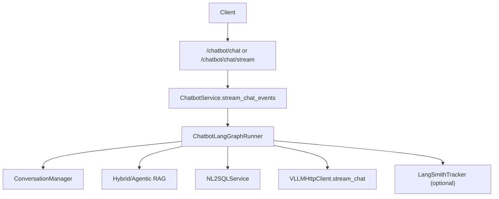

# 智能客服整体实现技术说明

> 本文描述当前 `/chatbot/chat` 与 `/chatbot/chat/stream` 的真实实现：以 **LangGraph 编排**为主链路，保留可配置的 legacy 回退链路。  
> RAG 引擎与向量库细节见 `framework-guide/RAG整体实现技术说明.md`。

---

## 1. 当前主链路（LangGraph）

### 1.1 API 与协议

- 路由文件：`app/api/chatbot.py`。  
- 接口：
  - `POST /chatbot/chat`（非流式，兼容保留）；
  - `POST /chatbot/chat/stream`（SSE 流式，建议主用）。
- 请求模型：`ChatRequest`，核心字段为 `user_id`、`session_id`、`query`、`image_urls`、`enable_rag`、`enable_context`；可选 **`enable_fault_vision`** 控制本轮是否用图片参与「故障域/相似案例」判定（见 `CHATBOT_SIMILAR_CASE_*` / `CHATBOT_FAULT_*`）。  
- **提示词版本**：`prompt_version` 可选，对应 `configs/prompts.yaml` 中 `chatbot` 的 `version`；不传时使用 **`CHATBOT_PROMPT_DEFAULT_VERSION`（默认 `boiler_v1`，锅炉领域分层模板）**。  
- **结构化路由**：`enable_nl2sql_route`（默认 `true`）与 **`CHATBOT_NL2SQL_ROUTE_ENABLED`** 共同决定是否将问句判为 `data_query` 并走 NL2SQL；关闭后相关问句也走向量 RAG。  
- 流式响应：
  - 增量事件：`{"delta":"...","finished":false}`；
  - 完成事件：`{"finished":true,"meta":{...}}`（`meta` 含 **`suggested_questions`**、**`used_nl2sql`**、**`nl2sql_sql`**（若有）、**`intent_label`** 等）；
  - 异常事件：`{"error":"...","finished":true}`。

### 1.2 Service 与图运行器

- 主入口：`app/services/chatbot_service.py` 的 `stream_chat_events()`。  
- 图运行器：`app/llm/graphs/chatbot_graph_runner.py`，状态定义在 `app/llm/graphs/chatbot_graph_state.py`。  
- 典型流程：
  1. 进入 LangGraph：模板加载 → 历史加载 → **意图分类（`kb_qa` / `clarify` / `data_query`）** → **`fault_case_gate`（故障域/相似案例门控，可关）** → 意图条件路由；
  2. **`data_query`**：`nl2sql_answer` 节点调用 `NL2SQLService`（**不写中间轮会话**，避免与客服落库重复），再经大模型将 SQL 与结果整理为自然语言；
  3. **`kb_qa`**：RAG 引擎选择与 C-RAG 循环 → `kb_build_messages` → Runner 层流式生成；
  4. **Runner 层**：对澄清 / NL2SQL / 仅固定话术分支直接输出 `answer_text`；否则 `VLLMHttpClient.stream_chat` 流式下发；
  5. 若门控命中且配置开启：主回答（或澄清正文）之后 **`HybridRAGService.retrieve(..., namespace=CHATBOT_SIMILAR_CASE_NAMESPACE)`** 追加「相似案例」块（**`data_query` 路径不追加**）；
  6. 流式结束前：**关联问题推荐**（规则 + RAG 片段种子 + LLM JSON 补全，见 `chatbot_follow_up.py`），写入 `meta.suggested_questions`；
  7. 断连时 partial 落库行为取决于 `CHATBOT_PERSIST_PARTIAL_ON_DISCONNECT`。

---

## 2. 图编排与路由

当前图中已实现节点包含：

- 输入预处理：`load_prompt_template`、`load_history`、`intent_classify`、`fault_case_gate`（相似案例扩展，默认 `CHATBOT_SIMILAR_CASE_ENABLED=false`）；
- **结构化问数**：`nl2sql_answer`（意图 `data_query`）；
- 知识检索：`select_rag_engine`、`kb_retrieve`、`kb_quality_check`、`kb_rewrite_query`、`kb_build_messages`；
- 分支占位：`unsafe_guard`、`handoff_human`、`smalltalk_generate`；
- 澄清与收敛：`clarify_build_response`、`finalize`。

**意图与路由（查库 vs 文档）**：

- 规则实现见 `app/llm/graphs/chatbot_intent_rules.py`：**台账/统计/列表/检修记录**等倾向 `data_query` → NL2SQL；**原因/机理/标准/预防**等倾向 `kb_qa` → 向量 RAG；**带图**时固定 `kb_qa`（避免对图片误生成 SQL）。
- 意图标签受 **`CHATBOT_INTENT_OUTPUT_LABELS`** 约束；未放量的标签会降级为 `kb_qa`。
- 低检索质量时走 C-RAG 重写重试，超过预算后转 `clarify`；  
- 所有分支统一收敛到 `finalize`，保证状态口径与 SSE `meta` 一致。

---

## 3. 回退与稳定性策略

- `CHATBOT_GRAPH_ENABLED=false` 时，走 legacy 顺序链路（非图编排），并与主链路对齐 **意图分流 / NL2SQL / 关联问题 / 默认提示词版本**。  
- 图执行异常且 `CHATBOT_FALLBACK_LEGACY_ON_ERROR=true` 时，自动回退 legacy 链路。  
- 端到端图超时由 `MAX_GRAPH_LATENCY_MS` 保护，超时会进入可观测的终止状态。  
- 客户端断连时可按 `CHATBOT_PERSIST_PARTIAL_ON_DISCONNECT` 控制是否落库 partial assistant。

---

## 4. 配置项（重点）

除通用 LLM/RAG/Redis 配置外，建议显式配置以下参数：

- 图开关与意图：`CHATBOT_GRAPH_ENABLED`、`CHATBOT_INTENT_ENABLED`、**`CHATBOT_INTENT_OUTPUT_LABELS`（默认含 `data_query`）**；
- **提示词默认版本**：**`CHATBOT_PROMPT_DEFAULT_VERSION=boiler_v1`**（与 `configs/prompts.yaml` 中 `chatbot` 条目一致）；
- **NL2SQL 路由**：**`CHATBOT_NL2SQL_ROUTE_ENABLED`**；
- **关联问题**：**`CHATBOT_SUGGESTED_QUESTIONS_ENABLED`**、**`CHATBOT_SUGGESTED_QUESTIONS_MAX`**；
- C-RAG：`CHATBOT_CRAG_ENABLED`、`CHATBOT_CRAG_MAX_ATTEMPTS`、`CHATBOT_CRAG_MIN_SCORE`、`MAX_REWRITE_QUERY_LENGTH`；
- 引擎路由：`CHATBOT_RAG_ENGINE_MODE`、`CHATBOT_RAG_ENGINE_FALLBACK`；
- 会话窗口：`CHATBOT_HISTORY_LIMIT`（单轮读取窗口）+ `CONV_MAX_HISTORY_MESSAGES`（总保留上限）；
- 回退与断连：`CHATBOT_FALLBACK_LEGACY_ON_ERROR`、`CHATBOT_PERSIST_PARTIAL_ON_DISCONNECT`；
- Checkpoint：`CHATBOT_CHECKPOINT_BACKEND`、`CHATBOT_CHECKPOINT_REDIS_URL`、`CHATBOT_CHECKPOINT_NAMESPACE`。
- 相似案例（可选）：`CHATBOT_SIMILAR_CASE_ENABLED`、`CHATBOT_SIMILAR_CASE_NAMESPACE`、`CHATBOT_SIMILAR_CASE_TOP_K`、`CHATBOT_FAULT_DETECT_ENABLED`、`CHATBOT_FAULT_VISION_ENABLED`、`CHATBOT_FAULT_DETECT_MODE`、`CHATBOT_FAULT_MIN_CONFIDENCE`（说明见 `enterprise-level_transformation_docs/企业级智能客服 LangGraph 框架实现方案.md` 第 14 节）。

> 部署层完整示例见 `app/app-deploy/.env.example` 与 `app/app-deploy/README.md`。

---

## 5. 提示词模板（锅炉领域默认）

- 配置文件：`configs/prompts.yaml`，场景 `chatbot`。  
- 默认版本 **`boiler_v1`**：角色与边界、知识使用规则、结构化数据说明、回答结构、安全合规等分层描述。  
- 兼容保留 **`v1` / `v2`** 通用模板，可通过请求体 `prompt_version` 显式指定。

---

## 6. 关键文件映射

| 模块 | 路径 | 职责 |
|------|------|------|
| API 路由 | `app/api/chatbot.py` | HTTP 入参与 SSE 输出协议 |
| Service | `app/services/chatbot_service.py` | 图执行入口、legacy 回退、会话写入 |
| Graph Runner | `app/llm/graphs/chatbot_graph_runner.py` | 节点实现、路由、超时、Runner 层流式与相似案例追加、关联问题、埋点 |
| Graph State | `app/llm/graphs/chatbot_graph_state.py` | 统一共享状态字段与维护约束 |
| 意图规则 | `app/llm/graphs/chatbot_intent_rules.py` | 查库 vs 文档问答启发式分类 |
| 关联问题 | `app/llm/graphs/chatbot_follow_up.py` | 规则 + 片段 + LLM 合并推荐 |
| NL2SQL 自然语言化 | `app/llm/graphs/chatbot_nl2sql_answer.py` | SQL/结果 → 中文总结 |
| 相似案例辅助 | `app/llm/graphs/chatbot_similar_cases.py` | 故障域判定 + 限定 namespace 检索格式化 |
| NL2SQL 服务 | `app/services/nl2sql_service.py` | `record_conversation` 控制是否写入会话（客服内嵌调用时为 false） |
| 会话管理 | `app/conversation/manager.py` | Redis/内存会话存储与上下文读取 |
| RAG 检索 | `app/rag/*` | Hybrid/Agentic 检索与 C-RAG 依赖能力 |

---

## 7. 关联问题推荐（完整处理逻辑）

实现文件：`app/llm/graphs/chatbot_follow_up.py` 中 `build_suggested_questions`；由 `ChatbotLangGraphRunner._fill_suggested_questions`（及 legacy 路径中同等调用）在**主答（含相似案例追加块）拼完之后**执行，结果写入 SSE / 非流式响应的 **`meta.suggested_questions`** 或 **`ChatResponse.suggested_questions`**。总开关与条数上限：**`CHATBOT_SUGGESTED_QUESTIONS_ENABLED`**、**`CHATBOT_SUGGESTED_QUESTIONS_MAX`**。

### 7.1 处理顺序（流水线）

1. **规则预设（代码内写死的关键词表）**  
   - 数据结构：模块内 `_TOPIC_FOLLOW_UPS`（如「爆管、过热、腐蚀、泄漏、检修、台账、标准」等主题 → 若干固定中文问句）。  
   - 逻辑：若**用户当前 `query` 子串命中**某主题键，则按表追加候选，条数上限由 `intent_label` 决定（`clarify` 时较少，其它意图略多）。  
   - 性质：**完全写死**，便于冷启动与可控话术；扩展方式仅为改代码或后续改为读配置/YAML。

2. **基于本轮已召回片段的「种子」问句（非二次向量检索）**  
   - 入参：本轮主链路注入模型前使用的 **`context_snippets`**（与 `kb_retrieve` 结果一致）。  
   - 逻辑：取前若干条片段的**首行文本**，套固定模板生成「结合知识库：…还可以了解什么？」类引导句。  
   - **重要**：此处**不会**再调用 `HybridRAGService.retrieve` 或单独做一轮 embedding；只是**复用本轮已有检索结果**。若本轮未走 RAG 或无命中（如 `data_query`、关 RAG、澄清分支），则该步通常无输出或很少。

3. **去重**  
   - 按出现顺序合并 1、2 的候选，**去重**（保序）。

4. **LLM 补全（可选）**  
   - 触发条件：`intent_label` 为 **`kb_qa` 或 `data_query`**，且去重后条数 **仍小于** `max_total`。  
   - 输入：用户原问 + 助手回答摘要（约前 1200 字）；**不把完整 RAG 片段列表作为长上下文传入**（与「用检索全文再分析一版」不同）。  
   - 输出：要求模型仅返回 JSON：`{"questions":["...","..."]}`，解析失败后丢弃该步。  
   - `clarify`：以规则为主，LLM 调用倾向更少（见代码中 `rule_n` / `need_llm` 分支）。

5. **截断**  
   - 最终列表截断为 **`max_total`**（且不超过代码内硬上限 10）。

### 7.2 与流式接口的关系

- 关联问题只在**回答生成结束**后计算，出现在**最后一条** `finished` 的 `meta` 中；**不会**随 `delta` 分片提前下发。

### 7.3 小结

| 来源 | 是否写死 | 是否单独再走 RAG |
|------|----------|------------------|
| 主题词 → 预设问句 | 是（`_TOPIC_FOLLOW_UPS`） | 否 |
| 片段首行种子 | 句式固定，**内容来自本轮 `context_snippets`** | **否**（复用本轮检索） |
| LLM `questions` | 否 | 否（当前实现未为关联问题单独检索） |

---

## 8. 调用链示意图

