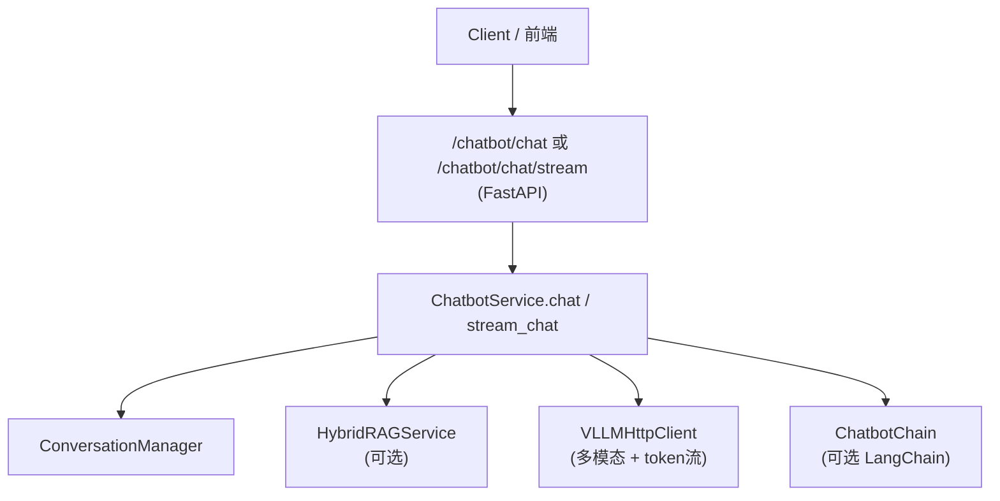

# 智能客服整体实现技术说明

> 本文描述 `/chatbot/chat` 与 `/chatbot/chat/stream` 智能客服链路在当前基座中的实现：从 HTTP 请求到 Service，再到会话管理、RAG、多模态输入与 token 级流式输出。  
> RAG 与向量库、GraphRAG 等细节不在本文展开，统一引用 `framework-guide/RAG整体实现技术说明.md`。

---

## 文档结构（阅读导航）

| 章节 | 内容 |
|------|------|
| **§1 从使用视角看整体流程** | `/chatbot/chat` / `/chatbot/chat/stream` → ChatbotService → RAG/会话/多模态 → 回答 |
| **§2 模块与文件映射** | 路由、Service、链路编排、RAG 与会话组件 |
| **§3 基础版实现逻辑** | 无 LangChain 时的占位回答逻辑 |
| **§4 LangChain/LangGraph 集成蓝图** | ChatbotChain 的角色与与通用 RAG 的关系 |
| **§5 配置与依赖** | 与 RAG/会话/LLM 相关的配置提示 |
| **§6 调用链示意图** | 从 HTTP 到回答的高层结构 |

---

## 1. 从使用视角看整体流程

### 1.1 `/chatbot/chat` / `/chatbot/chat/stream` 调用主线

1. **API 层：`/chatbot/chat` 与 `/chatbot/chat/stream`**  
   - 路由文件：`app/api/chatbot.py`。  
   - 接口：`POST /chatbot/chat`（同步）与 `POST /chatbot/chat/stream`（SSE 流式）。  
   - 请求/响应模型：`ChatRequest` / `ChatResponse`（`app/models/chatbot.py`），支持：  
     - `user_id`、`session_id`；  
     - `query`：用户问题；  
     - `image_urls`：可选多图 URL 列表（多模态输入）；  
     - `enable_rag`：是否启用知识库检索；  
     - `enable_context`：是否启用会话上下文。  
   - 同步接口调用 `ChatbotService.chat(req)`；流式接口调用 `ChatbotService.stream_chat(req)` 并以 SSE 输出 token 增量。

2. **Service 层：`ChatbotService.chat` / `ChatbotService.stream_chat`**  
   - 文件：`app/services/chatbot_service.py`。  
   - 调用流程概览：  
     1. 使用 `ConversationManager` 追加用户消息到会话存储；  
     2. 若构造成功了 `ChatbotChain`（LangChain 可用），则优先走链路 `_chain.run(...)`：  
        - 由链路内部统一处理 RAG 检索与会话上下文拼接；  
        - 返回最终 answer；  
        - 外层仅记录 `used_rag = req.enable_rag`、`context_snippets = []`。  
     3. 否则（无 LangChain 可用），走**统一 LLMClient 实现**：  
        - 若 `enable_rag` 为真，通过 `HybridRAGService` 查询上下文片段；  
        - 若 `enable_context` 为真，读取最近会话历史；  
        - 构建 OpenAI 兼容 `messages`：  
          - 纯文本：`content=str`；  
          - 多模态：`content=[{"type":"text"...},{"type":"image_url"...}]`；  
        - 同步接口调用 `VLLMHttpClient.chat`；流式接口调用 `VLLMHttpClient.stream_chat`（token 级增量）。  
     4. 会话写回：同步/流式结束后都通过 `ConversationManager.append_assistant_message(...)` 回写完整回答；  
     5. 构造 `ChatResponse` 返回。

> **当前状态**：ChatbotService 已对接 RAG、会话管理、vLLM 多模态输入与 token 级流式输出；LangChain ChatbotChain 作为可选编排增强路径保留。

---

## 2. 模块与文件映射

| 模块 | 路径 | 职责 |
|------|------|------|
| API 路由 | `app/api/chatbot.py` | 定义 `/chatbot/chat` 接口，将请求交给 `ChatbotService.chat`。 |
| Service | `app/services/chatbot_service.py` | 智能客服主业务逻辑：会话记录、RAG 调用、多模态消息构建、同步/流式回答。 |
| RAG 基座 | `app/rag/rag_service.py` | `RAGService`，用于传统向量 RAG 检索；细节见 RAG 文档。 |
| 会话管理 | `app/conversation/manager.py` | `ConversationManager`，统一管理 Chatbot/NL2SQL/综合分析的上下文与摘要。 |
| LangChain ChatbotChain | `app/llm/chains/chatbot_chain.py` | 若安装 LangChain 及相关依赖，则用于构建真正的多步 Chatbot 链路（占位蓝图）。 |

---

## 3. 基础版实现逻辑（无 LangChain）

在未安装 LangChain 相关依赖时，`ChatbotService` 会走简化实现路径：

1. **记录用户消息**：  
   - `ConversationManager.append_user_message(user_id, session_id, query)`。
2. **可选 RAG 检索**：  
   - 若 `enable_rag` 为真，则调用 `HybridRAGService.retrieve(query)` 获取上下文片段。  
3. **可选上下文拼接**：  
   - 若 `enable_context` 为真，则调用 `ConversationManager.get_recent_history` 获取最近对话，并拼入 messages。  
4. **多模态消息构建**：  
   - 有 `image_urls` 时，构造 `content=[text + image_url...]`；  
   - 无图时，构造纯文本 user message。  
5. **调用统一大模型客户端**：  
   - 同步：`VLLMHttpClient.chat(...)`；  
   - 流式：`VLLMHttpClient.stream_chat(...)`（token 级）。  
6. **记录助手消息并返回**。

> 该实现已是可生产使用的回退链路，而非占位实现。

---

## 4. LangChain/LangGraph 集成蓝图

当项目安装了 LangChain 及其依赖时，`ChatbotService.__init__` 会尝试导入 `ChatbotChain` 并在成功时启用：

- `ChatbotChain` 预期职责（蓝图）：  
  - 基于 `query`、RAG 检索结果与会话历史构建多步对话工作流；  
  - 可按“意图识别 → RAG 检索 → 工具调用 → 总结回答”的步骤组织；  
  - 支持将不同业务场景（客服问答、工单处理等）抽象成不同的子链或工具。  
- 与 RAG 的关系：  
  - ChatbotChain 内部调用 `RAGService` 或 `HybridRAGService` 进行检索；  
  - 具体检索模式/命名空间由 `RAGConfig` 和链路配置决定。  
- 与通用推理/分析/NL2SQL 的关系：  
  - 可共享相同的 Prompt 模板与 RAG 知识库，只是场景（scene）与配置不同。

详细的 Agent Workflow 设计请参考：`docs/Agentic-Workflow-设计蓝图.md`。

---

## 5. 配置与依赖

- **RAG 相关配置**：  
  - 是否启用 RAG 与检索模式见 `RAGConfig` 与环境变量配置（详见 RAG 文档）；  
  - Chatbot 仅通过 `enable_rag` 开关与默认命名空间使用 RAG。  
- **会话与上下文**：  
  - `ConversationManager` 使用 Redis 或内存存储会话；  
  - 会话过期/清理策略：
    - `CONV_SESSION_TTL_MINUTES`（默认 `60`）；
    - `CONV_MAX_HISTORY_MESSAGES`（默认 `50`）。  
- **大模型与 LangChain**：  
  - Chatbot 主逻辑已通过统一 `LLMClient`（`VLLMHttpClient`）接入 vLLM/OpenAI 兼容服务；  
  - 可选 LangChain ChatbotChain 继续用于复杂编排。  
  - LangChain/LangGraph 相关依赖可按需加入 `requirements-大模型应用.txt`。

---

## 6. 调用链示意图

> **说明**：当启用 ChatbotChain 时，RAG 与会话上下文由链路内部统一管理；基础版实现则直接在 Service 中调用 RAG 与会话组件。

