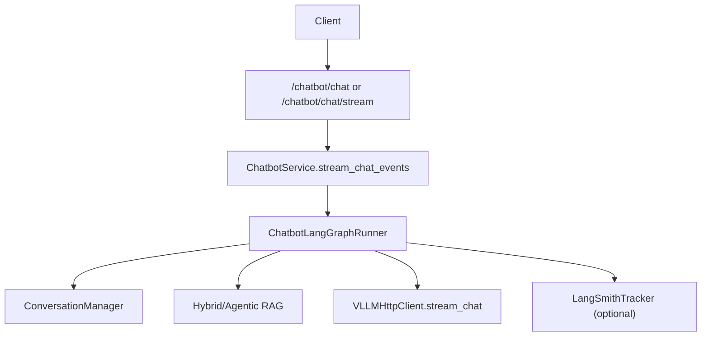

# 智能客服整体实现技术说明

> 本文描述当前 `/chatbot/chat` 与 `/chatbot/chat/stream` 的真实实现：以 **LangGraph 编排**为主链路，保留可配置的 legacy 回退链路。  
> RAG 引擎与向量库细节见 `framework-guide/RAG整体实现技术说明.md`。

---

## 1. 当前主链路（LangGraph）

### 1.1 API 与协议

- 路由文件：`app/api/chatbot.py`。  
- 接口：
  - `POST /chatbot/chat`（非流式，兼容保留）；
  - `POST /chatbot/chat/stream`（SSE 流式，建议主用）。
- 请求模型：`ChatRequest`，核心字段为 `user_id`、`session_id`、`query`、`image_urls`、`enable_rag`、`enable_context`。  
- 流式响应：
  - 增量事件：`{"delta":"...","finished":false}`；
  - 完成事件：`{"finished":true,"meta":{...}}`；
  - 异常事件：`{"error":"...","finished":true}`。

### 1.2 Service 与图运行器

- 主入口：`app/services/chatbot_service.py` 的 `stream_chat_events()`。  
- 图运行器：`app/llm/graphs/chatbot_graph_runner.py`，状态定义在 `app/llm/graphs/chatbot_graph_state.py`。  
- 典型流程：
  1. 写入 user 消息（会话存储）；
  2. 进入 LangGraph：模板加载 → 历史加载 → 意图分类 → RAG 路由与 C-RAG 循环 → 消息构建/澄清 → finalize；
  3. 执行 LLM 流式调用并持续 SSE 下发；
  4. 收敛为统一结束 `meta`（`status`、`intent_label`、`retrieval_attempts`、`used_rag`、`rag_engine`、`duration_ms`、`terminate_reason` 等）；
  5. 落库 assistant（或断连 partial 落库，取决于配置）。

---

## 2. 图编排与路由

当前图中已实现节点包含：

- 输入预处理：`load_prompt_template`、`load_history`、`intent_classify`；
- 知识检索：`select_rag_engine`、`kb_retrieve`、`kb_quality_check`、`kb_rewrite_query`、`kb_build_messages`；
- 分支占位：`unsafe_guard`、`handoff_human`、`smalltalk_generate`；
- 澄清与收敛：`clarify_build_response`、`finalize`。

关键路由策略：

- 初期默认意图输出 `kb_qa` / `clarify`（由 `CHATBOT_INTENT_OUTPUT_LABELS` 控制）；  
- 低检索质量时走 C-RAG 重写重试，超过预算后转 `clarify`；  
- 所有分支统一收敛到 `finalize`，保证状态口径与 SSE `meta` 一致。

---

## 3. 回退与稳定性策略

- `CHATBOT_GRAPH_ENABLED=false` 时，走 legacy 顺序链路（非图编排）。  
- 图执行异常且 `CHATBOT_FALLBACK_LEGACY_ON_ERROR=true` 时，自动回退 legacy 链路。  
- 端到端图超时由 `MAX_GRAPH_LATENCY_MS` 保护，超时会进入可观测的终止状态。  
- 客户端断连时可按 `CHATBOT_PERSIST_PARTIAL_ON_DISCONNECT` 控制是否落库 partial assistant。

---

## 4. 配置项（重点）

除通用 LLM/RAG/Redis 配置外，建议显式配置以下参数：

- 图开关与意图：`CHATBOT_GRAPH_ENABLED`、`CHATBOT_INTENT_ENABLED`、`CHATBOT_INTENT_OUTPUT_LABELS`；
- C-RAG：`CHATBOT_CRAG_ENABLED`、`CHATBOT_CRAG_MAX_ATTEMPTS`、`CHATBOT_CRAG_MIN_SCORE`、`MAX_REWRITE_QUERY_LENGTH`；
- 引擎路由：`CHATBOT_RAG_ENGINE_MODE`、`CHATBOT_RAG_ENGINE_FALLBACK`；
- 会话窗口：`CHATBOT_HISTORY_LIMIT`（单轮读取窗口）+ `CONV_MAX_HISTORY_MESSAGES`（总保留上限）；
- 回退与断连：`CHATBOT_FALLBACK_LEGACY_ON_ERROR`、`CHATBOT_PERSIST_PARTIAL_ON_DISCONNECT`；
- Checkpoint：`CHATBOT_CHECKPOINT_BACKEND`、`CHATBOT_CHECKPOINT_REDIS_URL`、`CHATBOT_CHECKPOINT_NAMESPACE`。

> 部署层完整示例见 `app/app-deploy/.env.example` 与 `app/app-deploy/README.md`。

---

## 5. 关键文件映射

| 模块 | 路径 | 职责 |
|------|------|------|
| API 路由 | `app/api/chatbot.py` | HTTP 入参与 SSE 输出协议 |
| Service | `app/services/chatbot_service.py` | 图执行入口、legacy 回退、会话写入 |
| Graph Runner | `app/llm/graphs/chatbot_graph_runner.py` | 节点实现、路由、超时、持久化与埋点 |
| Graph State | `app/llm/graphs/chatbot_graph_state.py` | 统一共享状态字段与维护约束 |
| 会话管理 | `app/conversation/manager.py` | Redis/内存会话存储与上下文读取 |
| RAG 检索 | `app/rag/*` | Hybrid/Agentic 检索与 C-RAG 依赖能力 |

---

## 6. 调用链示意图

