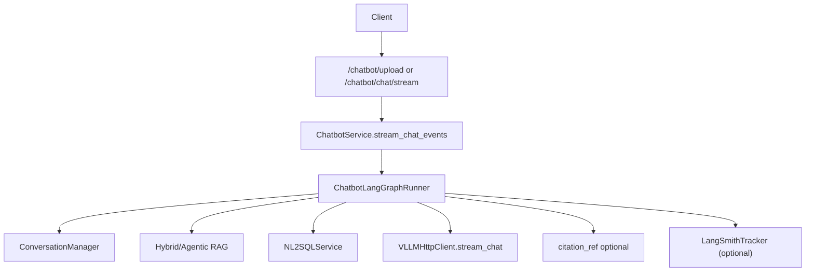

# 智能客服整体实现技术说明

> 本文描述当前 `/chatbot/chat/stream`（主）与 deprecated `/chatbot/chat` 的真实实现：以 **LangGraph 编排**为主链路，保留可配置的 legacy 回退链路。  
> RAG 引擎与向量库细节见 `framework-guide/RAG整体实现技术说明.md`；LangGraph 方案总览见 `enterprise-level_transformation_docs/企业级智能客服 LangGraph 框架实现方案.md`。

---

## 1. 当前主链路（LangGraph）

### 1.1 API 与协议

- 路由文件：`app/api/chatbot.py`。  
- 接口：
  - `POST /chatbot/upload`（多模态图片上传 MinIO，返回预签名 URL 填入 `image_urls`）；
  - `POST /chatbot/chat/stream`（SSE 流式，**建议主用**）；
  - `POST /chatbot/chat/stop`（显式中断指定 `stream_id`，`terminate_reason=user_cancelled`）；
  - `POST /chatbot/chat`（非流式，**deprecated**，`include_in_schema=false`）；
  - `GET /chatbot/sessions*`（会话列表/消息导出，assistant 可含 `rag_citations`）。
- 请求模型：`ChatRequest`，核心字段为 `user_id`、`session_id`、`query`、`image_urls`、`enable_rag`、`enable_context`；可选 **`enable_nl2sql_route`**（与 `CHATBOT_NL2SQL_ROUTE_ENABLED` 共同控制 `data_query` 路由）；可选 **`enable_fault_vision`** 控制本轮是否用图片参与「故障域/相似案例」判定（见 `CHATBOT_SIMILAR_CASE_*` / `CHATBOT_FAULT_*`）。  
- **图片预处理（入口前）**：`ChatbotService` 在进入图/legacy 链路前会对 `image_urls` 做预处理（下载、最长边缩放、超阈值有损压缩、存储）；默认 **`CHATBOT_IMAGE_STORAGE_BACKEND=minio`**（预签名 URL），可选 `local` 落盘 + `StaticFiles`（前缀默认 **`/chatbot/media`**）。  
- **提示词版本**：`prompt_version` 可选，对应 `configs/prompts.yaml` 中 `chatbot` 的 `version`；不传时使用 **`CHATBOT_PROMPT_DEFAULT_VERSION`（默认 `boiler_v1`，锅炉领域分层模板）**。  
- **结构化路由**：`enable_nl2sql_route`（默认 `true`）与 **`CHATBOT_NL2SQL_ROUTE_ENABLED`** 共同决定是否将问句判为 `data_query` 并走 NL2SQL；关闭后相关问句也走向量 RAG。  
- 流式响应：
  - 启动事件：`{"started":true,"stream_id":"..."}`（首帧返回，供后续 `/chatbot/chat/stop` 调用）；
  - 增量事件：`{"delta":"...","finished":false}`；
  - 引用事件（RAG 路径，可选）：`{"citation_ref":n,"finished":false}`（`n` 与 `meta.rag_citations[].ref_index` 对齐，见 **§11**）；
  - 完成事件：`{"finished":true,"meta":{...}}`（`meta` 含 **`stream_id`**、**`suggested_questions`**（**`data_query` 流式恒为空**）、**`used_nl2sql`**、**`nl2sql_sql`** / **`nl2sql_failed`** / **`nl2sql_error_code`**（查库路径）、**`intent_label`**、**`rag_citations`**（RAG 路径）、**`faq_soft_direct`** / **`faq_soft_direct_reason`**（若触发，见 **§10**）、**`rag_namespace` / `rag_scope_reason` / `rag_scope_fallback`**（本厂 RAG 范围，若有）、**`processed_image_urls`**、**`original_image_urls`** 等）；
  - 异常事件：`{"error":"...","finished":true}`。
- **上下文结构化索引增强（新增，旁路）**：可开启回答后异步抽取“第1点/第2点…”索引并写入 Redis 热层（可选同步 EasySearch 冷层），下一轮在不改主链路的前提下对“上文第N点”做引用定位增强。
- **会话引用与 RAG 并存**：不因“指代上文”而默认关闭检索；通过 `configs/prompts.yaml` 中 `chatbot` 模板 + 构图时对「知识片段」段的导语，引导模型**用语义/小节主题对齐上轮助手表述**（不限于「第N点」），并区分检索片段列举顺序与会话内容，由模型在同一上下文内分配注意力。

### 1.2 Service 与图运行器

- 主入口：`app/services/chatbot_service.py` 的 `stream_chat_events()`。  
- 图运行器：`app/llm/graphs/chatbot_graph_runner.py`，状态定义在 `app/llm/graphs/chatbot_graph_state.py`。  
- 典型流程：
  1. 进入 LangGraph：模板加载 → 历史加载 → **意图分类（`kb_qa` / `clarify` / `data_query`）** → **`fault_case_gate`（故障域/相似案例门控，可关）** → 意图条件路由；
  2. **`data_query`**：`nl2sql_answer` 节点调用 `NL2SQLService`（**不写中间轮会话**，`record_conversation=False`），再经大模型将 SQL 与结果整理为自然语言；**流式路径不下发** `suggested_questions`；
  3. **`kb_qa`**：`select_rag_engine` → **`rag_scope_resolve`（本厂指代 → 锁定电厂专属 namespace）** → **`kb_retrieve`**（指代消解 P0/P2/P3 + 带 namespace 召回，写入 `rag_citations`）→ C-RAG 循环 → **`kb_build_messages`**（可选 **对话锚块 P1**，默认关；**FAQ 软直通**见 **§10**）→ Runner 层流式生成（可选 **`citation_ref`** 事件，见 **§11**）；
  4. **Runner 层**：对澄清 / NL2SQL / 仅固定话术分支直接输出 `answer_text`；否则 `VLLMHttpClient.stream_chat` 流式下发；
  5. 若门控命中且配置开启：主回答（或澄清正文）之后 **`HybridRAGService.retrieve(..., namespace=CHATBOT_SIMILAR_CASE_NAMESPACE)`** 追加「相似案例」块（**`data_query` 路径不追加**）；
  6. 流式结束前：**关联问题推荐**（`kb_qa` / `clarify`；**不含 `data_query` 流式**，见 **§7.4**），写入 `meta.suggested_questions`；
  7. 落库 assistant 时可携带 **`rag_citations`**（与 `finished.meta` 同形）；
  8. 断连或显式 stop 时 partial 落库行为取决于 `CHATBOT_PERSIST_PARTIAL_ON_DISCONNECT`。

---

## 2. 图编排与路由

当前图中已实现节点包含：

- 输入预处理：`load_prompt_template`、`load_history`、`intent_classify`、`fault_case_gate`（相似案例扩展，默认 `CHATBOT_SIMILAR_CASE_ENABLED=false`）；
- **结构化问数**：`nl2sql_answer`（意图 `data_query`）；
- 知识检索：`select_rag_engine`、**`rag_scope_resolve`**、`kb_retrieve`、`kb_quality_check`、`kb_rewrite_query`、`kb_build_messages`；
- 分支占位：`unsafe_guard`、`handoff_human`、`smalltalk_generate`；
- 澄清与收敛：`clarify_build_response`、`finalize`。

**意图与路由（查库 vs 文档）**：

- 统一入口 `app/llm/graphs/chatbot_intent.py`：`CHATBOT_INTENT_BACKEND=rules|llm|bert`（默认 **rules**）。
- **rules**：`chatbot_intent_rules.classify_chatbot_intent_by_rules` — 台账/统计/列表/检修记录等 → `data_query`；原因/机理/标准/预防等 → `kb_qa`；带图固定 `kb_qa`。
- **bert**：`chatbot_intent_bert` — 须微调序列分类模型（暂不推荐）。
- **llm**：`chatbot_intent_llm` — **模式 B**（rules 主判 + 进程内轻量 HF 模型窄触发，CPU）；见 `docs/智能客服意图识别轻量LLM接入说明.md`（生产路径须 **`classify_chatbot_intent_async`**）。
- 意图标签受 **`CHATBOT_INTENT_OUTPUT_LABELS`** 约束；未放量的标签会降级为 `kb_qa`。
- 低检索质量时走 C-RAG 重写重试，超过预算后转 `clarify`；  
- **本厂专属知识库（RAG 范围）**：`rag_scope_resolve` 根据**本轮**厂别指代（如本厂/本公司/本电厂等）将主检索 **限定为** `CHATBOT_PLANT_KB_NAMESPACE`（默认 `Power_plant_knowledge`）；**多轮延续**须 `CHATBOT_PLANT_KB_HISTORY_CONTINUATION=true`（**默认 `false`**）；结果写入 state 的 `rag_namespace`，**C-RAG 重试**（`kb_rewrite_query → kb_retrieve`）**复用同一 namespace**，不再经过 `rag_scope_resolve`；  
- **`kb_build_messages`**：除模板/RAG/锚块外，可触发 **FAQ 软直通**（§10），满足条件时不注入 `history_messages`；
- 所有分支统一收敛到 `finalize`，保证状态口径与 SSE `meta` 一致。

---

## 3. 回退与稳定性策略

- `CHATBOT_GRAPH_ENABLED=false` 时，走 legacy 顺序链路（非图编排），并与主链路对齐 **意图分流 / NL2SQL / 关联问题（`data_query` 流式不下发）/ 默认提示词版本**。  
- 图执行异常且 `CHATBOT_FALLBACK_LEGACY_ON_ERROR=true` 时，自动回退 legacy 链路。  
- 端到端图超时由 `MAX_GRAPH_LATENCY_MS` 保护，超时会进入可观测的终止状态。  
- 客户端断连时可按 `CHATBOT_PERSIST_PARTIAL_ON_DISCONNECT` 控制是否落库 partial assistant（`terminate_reason=client_disconnect`）。
- 显式 stop：调用 `/chatbot/chat/stop` 后，Runner/legacy 在下一次流式循环检查点停止输出，`finished.meta.terminate_reason=user_cancelled`。

---

## 4. 配置项（重点）

除通用 LLM/RAG/Redis 配置外，建议显式配置以下参数：

- 图开关与意图：`CHATBOT_GRAPH_ENABLED`、`CHATBOT_INTENT_ENABLED`、**`CHATBOT_INTENT_BACKEND`（rules|llm|bert）**、**`CHATBOT_INTENT_OUTPUT_LABELS`（默认含 `data_query`）**；轻量 LLM 见 **`CHATBOT_INTENT_LLM_*`** 与 `docs/智能客服意图识别轻量LLM接入说明.md`；BERT 见 **`CHATBOT_INTENT_BERT_*`** 与 `docs/智能客服意图识别BERT接入说明.md`；
- **提示词默认版本**：**`CHATBOT_PROMPT_DEFAULT_VERSION=boiler_v1`**（与 `configs/prompts.yaml` 中 `chatbot` 条目一致）；
- **主答 temperature（可选）**：**`CHATBOT_MAIN_LLM_TEMPERATURE`**；
- **NL2SQL 路由**：**`CHATBOT_NL2SQL_ROUTE_ENABLED`**；
- **关联问题**：**`CHATBOT_SUGGESTED_QUESTIONS_ENABLED`**、**`CHATBOT_SUGGESTED_QUESTIONS_MAX`**（**流式 `data_query` 不下发**，见 §7.4）；
- **FAQ 软直通**：**`CHATBOT_FAQ_SOFT_DIRECT_ENABLED`**（默认开）、**`CHATBOT_FAQ_SOFT_DIRECT_MIN_SCORE`**（默认 `0.95`）、**`CHATBOT_FAQ_SOFT_DIRECT_SNIPPET_TOP_N`**（见 **§10**）；
- C-RAG：`CHATBOT_CRAG_ENABLED`、`CHATBOT_CRAG_MAX_ATTEMPTS`、`CHATBOT_CRAG_MIN_SCORE`、`MAX_REWRITE_QUERY_LENGTH`、`MAX_GRAPH_LATENCY_MS`；
- 引擎路由：`CHATBOT_RAG_ENGINE_MODE`、`CHATBOT_RAG_ENGINE_FALLBACK`；
- **本厂专属知识库 RAG 范围**：`CHATBOT_PLANT_KB_ENABLED`、`CHATBOT_PLANT_KB_NAMESPACE`、`CHATBOT_PLANT_KB_QUERY_BOOST_NAME`、`CHATBOT_PLANT_KB_FALLBACK_ON_EMPTY`、`CHATBOT_PLANT_KB_HISTORY_CONTINUATION`（多轮延续，**默认 `false`**）；
- 会话窗口：`CHATBOT_HISTORY_LIMIT`（单轮读取窗口）+ `CONV_MAX_HISTORY_MESSAGES`（总保留上限）；
- 结构化索引增强：`CHATBOT_OUTLINE_ENABLED`、`CHATBOT_OUTLINE_ASYNC_ENABLED`、`CHATBOT_REFERENCE_RESOLVE_ENABLED`、`CHATBOT_OUTLINE_ES_ENABLED`、`CHATBOT_OUTLINE_ES_INDEX`；
- 回退与断连：`CHATBOT_FALLBACK_LEGACY_ON_ERROR`、`CHATBOT_PERSIST_PARTIAL_ON_DISCONNECT`；
- Checkpoint：`CHATBOT_CHECKPOINT_BACKEND`（`none|memory|redis`，**无 Postgres**）、`CHATBOT_CHECKPOINT_REDIS_URL`、`CHATBOT_CHECKPOINT_NAMESPACE`。
- 相似案例（可选）：`CHATBOT_SIMILAR_CASE_ENABLED`、`CHATBOT_SIMILAR_CASE_NAMESPACE`、`CHATBOT_SIMILAR_CASE_TOP_K`、`CHATBOT_FAULT_DETECT_ENABLED`、`CHATBOT_FAULT_VISION_ENABLED`、`CHATBOT_FAULT_DETECT_MODE`、`CHATBOT_FAULT_MIN_CONFIDENCE`（说明见 `enterprise-level_transformation_docs/企业级智能客服 LangGraph 框架实现方案.md` 第 14 节）。
- **上下文指代消解（可选）**：`CHATBOT_ANAPHORA_RETRIEVAL_FUSION_ENABLED`（P0，默认开）、`CHATBOT_ANAPHORA_CONFIG_PATH`、`CHATBOT_ANAPHORA_FUSION_MAX_CHARS`、`CHATBOT_ANAPHORA_ANCHOR_BLOCK_ENABLED`（P1，**默认关**）、`CHATBOT_ANCHOR_BLOCK_MAX_CHARS`、`CHATBOT_ANAPHORA_SLOTS_ENABLED`（P2，**默认关**）、`CHATBOT_ANAPHORA_SLOTS_MAX_BULLETS`、`CHATBOT_ANAPHORA_LLM_GATE_ENABLED`（P3，默认关）、`CHATBOT_ANAPHORA_LLM_TIMEOUT_SEC`、`CHATBOT_ANAPHORA_LLM_MODEL`、`CHATBOT_ANAPHORA_EXPOSE_META`（说明见同文档 **第 15 节** 与 `docs/智能客服上下文理指代实现优化方案-20260514.md`）。
- 图片预处理与存储：`CHATBOT_IMAGE_PREPROCESS_ENABLED`、`CHATBOT_IMAGE_MAX_EDGE`、`CHATBOT_IMAGE_COMPRESS_THRESHOLD_MB`、`CHATBOT_IMAGE_JPEG_QUALITY`、`CHATBOT_IMAGE_STORAGE_BACKEND`（`minio|local`，默认 `minio`）、`CHATBOT_IMAGE_STORE_DIR`、`CHATBOT_IMAGE_PUBLIC_PATH`、`CHATBOT_IMAGE_MINIO_*`。

> 部署层完整示例见 `app/app-deploy/.env.example` 与 `app/app-deploy/README.md`。

---

## 5. 提示词模板（锅炉领域默认）

- 配置文件：`configs/prompts.yaml`，场景 `chatbot`。  
- 默认版本 **`boiler_v1`**：角色与边界、知识使用规则、结构化数据说明、回答结构、安全合规等分层描述。  
- 兼容保留 **`v1` / `v2`** 通用模板，可通过请求体 `prompt_version` 显式指定。

---

## 6. 关键文件映射

| 模块 | 路径 | 职责 |
|------|------|------|
| API 路由 | `app/api/chatbot.py` | HTTP/SSE、`/upload`、会话查询 |
| Service | `app/services/chatbot_service.py` | 图执行入口、legacy 回退、会话写入 |
| 图片预处理 | `app/services/chatbot_image_preprocessor.py` | 下载、缩放、压缩；MinIO 或本地存储 |
| Graph Runner | `app/llm/graphs/chatbot_graph_runner.py` | 节点、路由、Runner 层流式/相似案例/关联问题/引用流 |
| Graph State | `app/llm/graphs/chatbot_graph_state.py` | 统一共享状态（含 `rag_citations`、`faq_soft_direct*` 等） |
| 意图统一入口 | `app/llm/graphs/chatbot_intent.py` | `classify_chatbot_intent_async`（rules/llm/bert） |
| 意图规则 | `app/llm/graphs/chatbot_intent_rules.py` | 查库 vs 文档问答启发式分类 |
| 意图轻量 LLM | `app/llm/graphs/chatbot_intent_llm.py` | 模式 B 窄触发 |
| FAQ 软直通 | `app/llm/graphs/chatbot_faq_soft_direct.py` | `evaluate_faq_soft_direct`（§10） |
| RAG 引用 | `app/llm/graphs/chatbot_rag_citations.py` | 编号片段 + `rag_citations` 结构 |
| 引用流式解析 | `app/llm/graphs/chatbot_citation_stream.py` | `CitationStreamParser`、`citation_ref` 事件 |
| RAG 检索范围（本厂） | `app/llm/graphs/chatbot_rag_scope.py` | 厂别指代 → `rag_namespace`；图节点 `rag_scope_resolve` |
| 关联问题 | `app/llm/graphs/chatbot_follow_up.py` | 规则 + 片段 + LLM 合并推荐 |
| NL2SQL 自然语言化 | `app/llm/graphs/chatbot_nl2sql_answer.py` | SQL/结果 → 中文总结 |
| 相似案例辅助 | `app/llm/graphs/chatbot_similar_cases.py` | 故障域判定 + 限定 namespace 检索格式化 |
| NL2SQL 服务 | `app/services/nl2sql_service.py` | `record_conversation` 控制是否写入会话（客服内嵌为 false） |
| 会话管理 | `app/conversation/manager.py` | Redis/内存会话存储与上下文读取 |
| 结构化索引/引用解析 | `app/services/chatbot_outline.py` | 回答后结构化索引、Redis/ES、「上文第 N 点」旁路 |
| 指代消解（P0～P3） | `app/llm/graphs/chatbot_retrieval_query.py`、`chatbot_anaphora_*.py`、`chatbot_dialogue_anchor.py` | 检索融合、规则、槽位、Coref LLM |
| RAG 检索 | `app/rag/*` | Hybrid/Agentic 检索与 C-RAG 依赖能力 |

---

## 7. 关联问题推荐（完整处理逻辑）

实现文件：`app/llm/graphs/chatbot_follow_up.py` 中 `build_suggested_questions`；由 `ChatbotLangGraphRunner._fill_suggested_questions`（及 legacy 路径中同等调用）在**主答（含相似案例追加块）拼完之后**执行，结果写入 SSE / 非流式响应的 **`meta.suggested_questions`** 或 **`ChatResponse.suggested_questions`**。总开关与条数上限：**`CHATBOT_SUGGESTED_QUESTIONS_ENABLED`**、**`CHATBOT_SUGGESTED_QUESTIONS_MAX`**。

### 7.1 处理顺序（流水线）

1. **规则预设（代码内写死的关键词表）**  
   - 数据结构：模块内 `_TOPIC_FOLLOW_UPS`（如「爆管、过热、腐蚀、泄漏、检修、台账、标准」等主题 → 若干固定中文问句）。  
   - 逻辑：若**用户当前 `query` 子串命中**某主题键，则按表追加候选，条数上限由 `intent_label` 决定（`clarify` 时较少，其它意图略多）。  
   - 性质：**完全写死**，便于冷启动与可控话术；扩展方式仅为改代码或后续改为读配置/YAML。

2. **基于本轮已召回片段的「种子」问句（非二次向量检索）**  
   - 入参：本轮主链路注入模型前使用的 **`context_snippets`**（与 `kb_retrieve` 结果一致）。  
   - 逻辑：取前若干条片段的**首行文本**，套固定模板生成「结合知识库：…还可以了解什么？」类引导句。  
   - **重要**：此处**不会**再调用 `HybridRAGService.retrieve` 或单独做一轮 embedding；只是**复用本轮已有检索结果**。若本轮未走 RAG 或无命中（如 `data_query`、关 RAG、澄清分支），则该步通常无输出或很少。

3. **去重**  
   - 按出现顺序合并 1、2 的候选，**去重**（保序）。

4. **LLM 补全（可选）**  
   - 触发条件：`intent_label` 为 **`kb_qa` 或 `data_query`**，且去重后条数 **仍小于** `max_total`（函数 `build_suggested_questions` 内逻辑）。  
   - **注意**：Graph 与 **legacy 流式** 在调用前即跳过 `data_query`（`_fill_suggested_questions` / `_stream_chat_legacy_events`），**不会**进入本步；仅 **deprecated 非流式 `/chat`** 仍可能对 `data_query` 调用 LLM 补全。  
   - 输入：用户原问 + 助手回答摘要（约前 1200 字）；**不把完整 RAG 片段列表作为长上下文传入**。  
   - 输出：要求模型仅返回 JSON：`{"questions":["...","..."]}`，解析失败后丢弃该步。  
   - `clarify`：以规则为主，LLM 调用倾向更少（见代码中 `rule_n` / `need_llm` 分支）。

5. **截断**  
   - 最终列表截断为 **`max_total`**（且不超过代码内硬上限 10）。

### 7.2 与流式接口的关系

- 关联问题只在**回答生成结束**后计算，出现在**最后一条** `finished` 的 `meta` 中；**不会**随 `delta` 分片提前下发。

### 7.3 小结

| 来源 | 是否写死 | 是否单独再走 RAG |
|------|----------|------------------|
| 主题词 → 预设问句 | 是（`_TOPIC_FOLLOW_UPS`） | 否 |
| 片段首行种子 | 句式固定，**内容来自本轮 `context_snippets`** | **否**（复用本轮检索） |
| LLM `questions` | 否 | 否（当前实现未为关联问题单独检索） |

### 7.4 按意图路径的差异

| 意图 | 流式 `/chat/stream`（Graph + legacy） | deprecated `/chat` |
|------|----------------------------------------|---------------------|
| `kb_qa` | 规则 + 片段种子 + 可选 LLM → `meta.suggested_questions` | 同左 |
| `clarify` | 规则为主，条数偏少（最多 3） | 同左 |
| `data_query` | **`meta.suggested_questions=[]`**，不调用推荐问 LLM | 仍可能生成（与流式不一致，迁移时以流式为准） |

---

## 8. 调用链示意图

```mermaid
flowchart TB
    Client["Client"] --> API["/chatbot/upload or /chatbot/chat/stream"]
    API --> Svc["ChatbotService.stream_chat_events"]
    Svc --> Graph["ChatbotLangGraphRunner"]
    Graph --> Conv["ConversationManager"]
    Graph --> RAG["Hybrid/Agentic RAG"]
    Graph --> NL2SQL["NL2SQLService"]
    Graph --> LLM["VLLMHttpClient.stream_chat"]
    Graph --> Cit["citation_ref optional"]
    Graph --> Obs["LangSmithTracker (optional)"]
```

---

## 9. 上下文指代消解（简要）

**槽位 / 对话锚 / 清单（与实现对齐）**

1. **槽位**：上一轮 **assistant 落库之后**，规则从该条全文抽要点写入会话维槽位（Redis 优先；无 Redis 为进程内）；**同步写入**，非单独异步摘要任务（勿与 Outline「第 N 点」异步索引混淆）。
2. **对话锚**：本轮组 **system** 时在模板与 RAG 之间按需插入的 **「仅供推理」** 固定格式子块；要点列表 **优先用槽位 bullets**，否则从 **历史中最近一条 assistant** 再抽；**锚块 ≠ 槽位**，不把槽位 JSON 整包进模型。
3. **指代清单**：yaml + 规则得 `anaphora_type`，驱动 P0 检索融合与 P1 是否出锚；灰区可 P3 Coref；**「消解」此处偏工程绑定**；**「上文第 N 点」** 另走 Outline（`CHATBOT_OUTLINE_*`）。

**其余**：与「上文第 N 点」结构化索引互补；**P0 默认开，P1/P2/P3 默认关**；以图路径为主。**配置与流程图**：`enterprise-level_transformation_docs/企业级智能客服 LangGraph 框架实现方案.md` **§15**；专项 `docs/智能客服上下文理指代实现优化方案-20260514.md`；清单 `configs/chatbot_anaphora.yaml`。

---

## 10. 高分 FAQ 软直通（生成阶段）

**目标**：检索首条 citation 与用户问题高度匹配（如「1000 问」FAQ 库）且本轮无指代续问时，在 **`kb_build_messages`** 阶段**不注入** `history_messages`，避免旧 assistant 回答把模型带偏；**检索阶段**（指代、`rag_scope_resolve`）不受影响。

**实现**：`app/llm/graphs/chatbot_faq_soft_direct.py` → `evaluate_faq_soft_direct`；图内 `_node_kb_build_messages`；Legacy `_build_llm_messages` 对齐。

**触发条件**（须全部满足）：

- `CHATBOT_FAQ_SOFT_DIRECT_ENABLED=true`（默认开）；
- `enable_rag` 且 `intent_label=kb_qa`；
- `anaphora_type` / `anaphora_rule_type` 均为 `none`，问句不以显式指代词开头；
- 首条 `rag_citations[].rerank_score >= CHATBOT_FAQ_SOFT_DIRECT_MIN_SCORE`（默认 `0.95`，CrossEncoder 重排分）；
- 存在非空 `context_snippets` 与首条 citation `text_preview`。

**行为**：

- 跳过 `history_messages` 与对话锚块（P1）；
- 注入 LLM 的片段数裁为 `CHATBOT_FAQ_SOFT_DIRECT_SNIPPET_TOP_N`（默认 `1`）；
- `rag_citations` 展示条数不变；
- `finished.meta` 含 `faq_soft_direct`、`faq_soft_direct_reason`。

详细设计见 `enterprise-level_transformation_docs/企业级智能客服 LangGraph 框架实现方案.md` **§4.4**。

---

## 11. RAG 结构化引用与 citation 流

**目标**：`kb_qa` 路径将召回片段转为编号引用，供前端展示来源并与流式正文对齐。

**机制**：

1. **`kb_retrieve`** 经 `chunks_to_rag_context`（`chatbot_rag_citations.py`）生成编号 LLM 片段 + **`rag_citations`** 列表（`ref_index`、`text_preview`、`original_content_url` 等）。
2. **流式主答**：若存在引用，`CitationStreamParser`（`chatbot_citation_stream.py`）将正文中的 `[n]` 映射为 SSE **`{"citation_ref": n, "finished": false}`**；对应 `delta` 不再含该字面量。
3. **结束帧**：`meta.rag_citations` 与 `GET /chatbot/sessions/messages` 中 assistant 的 `rag_citations` **同形**；落库 assistant 时一并写入。
4. **`data_query`**：`rag_citations` 为空，无 `citation_ref`。
5. NL2SQL 库表/QA namespace 片段在展示层过滤（`filter_rag_citation_dicts`）。

**前端对接要点**（详见 `app/api/chatbot.py` `chat_stream` 文档注释）：

- 收到 `citation_ref` 即用 `ref_index === n` 在 `finished.meta.rag_citations` 中查找来源；
- 历史消息解析 `answer` 中的 `[n]` 或与 `rag_citations` 对齐。

详细设计见 `enterprise-level_transformation_docs/企业级智能客服 LangGraph 框架实现方案.md` **§4.5**。
