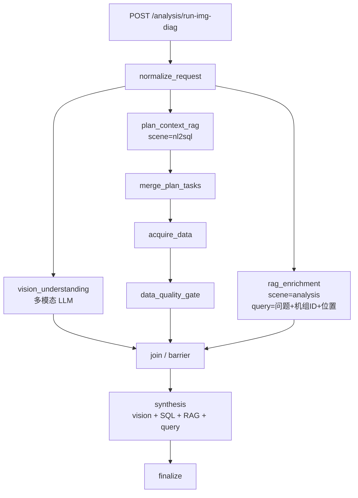

# 综合分析 · 看图诊断（随手拍）实现方案

> **定位**：在现有「综合分析」大板块下新增业务子类型：检修人员上传爆管/泄漏现场照片，并录入或选择设备位置（如「#2炉高温过热器B侧第4排」），结合自然语言提问，完成「图像理解与结构化查库 **并行** → **RAG 知识增强** → 联合推理输出」闭环。  
> **关联代码现状**：`POST /analysis/run-with-nl2sql` + `AnalysisGraphRunner.run_with_nl2sql`（见 `app/api/analysis.py`、`app/llm/graphs/analysis_graph_runner.py`）；NL2SQL 数据计划模板见 `configs/prompts.yaml` 中 `analysis_plan_<analysis_type>`（超温示例：`analysis_plan_overheat_guidance`）；检修上传参考 `POST /inspection-extract/upload`（文档入库模式，与本场景图片需区分）。

---

## 1. 对你先前理解的核对结论

| 条目 | 判断是否准确 | 说明 |
|------|--------------|------|
| 入参：图片 + 泄漏/拍照位置 + 用户问题 | **基本准确** | 建议位置字段拆成「结构化片段」（机组、受热面、侧别、排号等）+ 原始文本，便于 NL2SQL 拼 question 与审计；图片建议为「可访问 URL」（上传接口返回），与智能客服 `image_urls` 用法一致。 |
| 参照超温 nl2sql 路径，用 LangGraph 实现 | **方向准确，不宜照搬同一套图** | 看图诊断在 **合成前** 需同时具备「视觉结构化结果」与「NL2SQL 结果」，二者 **默认并行执行**（见 §3、§6）；整体节点序列与 `_build_nl2sql_graph()` **不同**，宜单独构图（见 §3）。 |
| 信息融合用 NL2SQL，提示词参照 `analysis_plan_overheat_guidance` | **准确** | 需新增专属 `analysis_plan_<新 analysis_type>`（见 §4），在 question 中显式注入位置与时间范围等业务约束，并与超温计划一样支持可选 LLM planner 合并（沿用现有开关与合并逻辑可降低定制成本）。 |
| 作为综合分析子类型；路由挂在 `api/analysis.py`；图命名为 `analysis_img_diag_graph` | **可行** | `analysis_img_diag_graph` 适合作为模块/构图标识（如 `app/llm/graphs/analysis_img_diag_graph*.py` 或 Runner 内 `_build_img_diag_graph`）；对外仍可统一前缀 `/analysis/*`。 |
| 兼顾响应效率 | **方案已定并行主路径** | **视觉理解与整条 NL2SQL 取数链路并行**；**业务向 RAG**（`scene=analysis`）在检索查询仅依赖「用户问题 + **机组 ID** + 位置」时与上述两臂 **再并行**，最后在 synthesis 汇合（§3、§6）。 |

**需要修正的一点**：「检修报告解析」里的 `POST /inspection-extract/upload` 面向 **doc/docx/pdf 等文档**，描述与 MIME 与随手拍 **不一致**。实现上应 **沿用同一套 MinIO 预签名上传模式**，但建议使用 **_analysis 专用上传路由或 bucket 前缀**（例如 `analysis_img_diag/`），并对图片格式与白名单校验（jpeg/png/webp 等），而不是直接把检修文档上传接口当作图片接口复用。

---

## 2. 业务范围与输出契约（对齐产品示例）

建议在服务端固化「章节语义」（可由 synthesis 提示词约束 Markdown 或小 JSON 片段），便于前端展示：

1. **可能原因**：多条假设 + **置信度**（数值区间与校准规则在提示词中约定）。
2. **证据链**：**图像侧要点**（断裂形貌、冲蚀、鼓包等）+ **库表侧要点**（壁温、测厚、工况、缺陷履历等）+ **知识库要点**（RAG 检索到的规程、机理说明、同类案例摘要等，须标注引用来源）；缺失数据须在文中标明「未检索到/未接入」。
3. **检查建议**：可执行的检验与扩大排查范围。
4. **处置建议**：停机更换、运行调整等与业务权限匹配的表述。
5. **免责声明**：固定或可配置的短文，结论仅供参考。

流程上与业务描述一致：

- **图像理解**：多模态模型输出结构化要点（字段建议：`defect_signals`、`severity`、`location_visual`、`notes`、`confidence_notes` 等），写入图状态；与查库 **并行**。
- **信息融合（查库）**：根据「位置 +（可选）机组/设备 ID」生成 NL2SQL 子任务列表并执行（复用 `NL2SQLService`，`record_conversation=False`）；规划阶段继续使用 **`scene=nl2sql` 的 RAG** 辅助 SQL/计划（与现有超温链路一致）；与视觉 **并行**。
- **知识增强（业务 RAG）**：基于「用户问题 + **机组 ID** + 位置」（及可选上下文）在 **全局/分析类知识库**（`scene=analysis`）检索，产出 `rag_snippets` / `rag_sources`；在检索 query **不依赖视觉结论** 的前提下，可与视觉、NL2SQL **同一波次并发**，缩短端到端耗时。
- **智能诊断**：在并行分支全部就绪后，由单次（或分段）文本 LLM 将「视觉结构化摘要 + NL2SQL 表格摘要 + **RAG 片段** + 用户 query」合成最终报告，并在文中区分三类依据：图像可见、库表返回、文献/知识库。

---

## 3. LangGraph 设计（建议独立：`analysis_img_diag`）

### 3.1 与现有 `run-with-nl2sql` 图的关系

- **复用**：`NL2SQLService`、`PromptTemplateRegistry`、`ConversationManager`、业务 RAG（`scene=analysis`）、可选规划前 RAG（`scene=nl2sql`）、`AnalysisOptions` 中的 `max_nl2sql_calls` / `max_rows_per_query` / `enable_rag` / `strict` 等语义。
- **不复用**：不要在现有 `_build_nl2sql_graph()` 上堆叠大量条件分支；单独 `StateGraph` 更清晰，命名上与内部实现对应 **`analysis_img_diag_graph`**（或类 `AnalysisImgDiagGraphRunner`）。

### 3.2 推荐节点流水线（默认：**视觉 ‖ 查库 ‖ 业务 RAG**）

并行前提：**NL2SQL 子任务仅由模板 + **机组 ID** + 位置 + 用户问题（及 plan_context_rag）决定**，不读取 `vision_findings`；业务 RAG 的检索语句同样 **仅用用户问题 + 机组 ID + 位置**，不把视觉结论当作检索条件（避免与视觉分支形成依赖环）。合成节点 **`synthesis`** 唯一汇聚上述三路输出。

说明：

- **`vision_understanding`**：必需；输入为 `image_urls`（建议已预处理 URL）+ 位置文案 + 用户问题摘要；输出 `vision_findings`。
- **`plan_context_rag` → `merge_plan_tasks` → `acquire_data` → `data_quality_gate`**：与现有 nl2sql 路径同源；`merge_plan_tasks` 可对齐 `_merge_nl2sql_template_and_llm_tasks`，模板 scene 为 `analysis_plan_<img_diag_type>`。
- **`rag_enrichment`（业务向）**：与 `AnalysisGraphRunner._lg_nl2sql_rag_enrichment` 同类能力，`scene=analysis`，`options.enable_rag=true` 时执行；检索 query 由 **用户原始问题 + 机组 ID + 泄漏/拍照位置** 构造（必要时附加 `analysis_type` 固定提示词前缀），与视觉、NL2SQL **并行启动**。
- **`join`**：语义上等待 `vision_findings`、`gathered_data`（及质量门结果）、`rag_business_context` 均完成；实现上可用 `asyncio.gather`、LangGraph `Send`/`fan-out` 或多入边合并节点。
- **`synthesis`**：提示词见 §4，必须要求模型 **分标签引用**：图像可见 / 库表事实 / RAG 文献，并禁止用 RAG 覆盖库表硬数据或相反。

**可选增强（二期）**：若产品需要「根据视觉关键词再扩检知识库」，可在 `join` 之后增加 **`rag_enrichment_vision_augmented`**（输入含 `vision_findings` 关键词），与首屏并行路径叠加一次检索；默认关闭以控制延迟与成本。

LangGraph 不可用时：**并行臂仍应用 `asyncio.gather` 执行**，仅在单线程顺序 fallback 时退回串行并在 trace 标明。

### 3.3 状态字段（建议在 TypedDict / 文档中约定）

除现有 nl2sql 状态外，至少增加：

- `image_urls` / `processed_image_urls`
- `unit_id`（机组 ID）
- `leak_location_text`（原始）
- `leak_location_struct`（可选 JSON：炉号、受热器、侧别、排等）
- `vision_findings`（视觉结构化结果）
- `user_query`
- `plan_context` / `plan_rag_sources`（查库臂：规划侧 nl2sql RAG）
- `rag_context` / `rag_sources`（业务臂：`scene=analysis` 检索结果，与合成共用字段名可对齐现有 `AnalysisGraphState`）
- `parallel_lane_trace`（可选：各臂起止时间、错误摘要，便于观测并行收益）

### 3.4 RAG 分层（避免混淆）

| 阶段 | 典型 scene | 作用 | 与本流程并行关系 |
|------|------------|------|------------------|
| SQL 规划辅助 | `nl2sql`（`plan_context_rag`） | Schema/关联/问答例 → 助力生成数据计划与 NL2SQL | 位于 **查库臂内部**，与视觉臂并行 |
| 业务解释 / 规程 / 案例 | `analysis`（`rag_enrichment`） | 机理、处置原则、同类案例摘要 → 充实证据链与建议 | **与视觉臂、查库臂并行**（检索条件不依赖视觉） |

---

## 4. 配置与提示词（`configs/prompts.yaml`）

### 4.1 新增 `analysis_type`

在 `app/models/analysis.py` 的 `AnalysisType` 中新增枚举值（命名示例：`img_diag` 或 `visual_pipe_diagnosis`，全文档统称「看图诊断类型」）。trace、统计筛选器（若已有按类型聚合）一并扩展。

### 4.2 数据计划模板

新增顶级键：`analysis_plan_img_diag`（若枚举为 `img_diag` 则与现有约定 `analysis_plan_<analysis_type>` 一致）。

- **写法**：参照 `analysis_plan_overheat_guidance` 的 JSON 数组格式，`question` 中可使用占位符 **`{unit_id}`、`{location}`、`{location_struct}`**（运行时在合并计划后、`acquire_data` 前替换）。
- **内容侧重**：设备台账、壁温历史、测厚履历、缺陷/检修记录、吹灰或检修窗口、同区域类比统计等（以实际 Schema 与 nl2sql 知识库为准）。

### 4.3 分阶段模板（可选但推荐）

与超温一致，可增加：

- `analysis_intent_img_diag`（若仍使用意图 LLM）
- `analysis_data_plan_img_diag`
- `analysis_synthesis_img_diag`（**核心**：融合视觉 + SQL + RAG）
- `analysis_report_img_diag`

其中 **`analysis_synthesis_img_diag`** 必须约束输出章节与置信度表述方式，并显式引用 **`vision_findings`、`gathered_data`、RAG 片段**；要求在文中区分「图像可见」「库表返回」「知识库/RAG」三类依据，避免混为一谈。

### 4.4 RAG 检索构造建议（业务臂）

- **默认检索 query**：`{user_query}` +「机组ID：{unit_id}」+「设备位置：{leak_location_text}」+ 固定后缀（如「爆管 / 泄漏 / 过热器 / 蠕变 / 磨损 / 处置要点」），由模板或代码拼装。
- **命名空间**：与现有综合分析业务 RAG 一致（全局 analysis 通道）；若需垂直库可在配置中单独指定 namespace 列表。
- **与合成的衔接**：将 Top-K 片段去重后写入状态；`synthesis` 提示词要求每条结论尽量标明依据类型；无检索命中时输出「知识库未检索到直接条款」而非臆造。

### 4.5 视觉专用模板

单独配置一段 scene（例如 `analysis_img_diag_vision`），仅用于 `vision_understanding` 节点，要求输出 **严格 JSON**，便于下游校验与追溯。

---

## 5. HTTP 契约建议（`app/api/analysis.py`）

### 5.1 图片上传（独立于检修文档）

- **路径示例**：`POST /analysis/img-diag/upload`（或与 `/analysis/upload-image` 共用前缀）。
- **行为**：multipart `file` → MinIO → 返回预签名 URL（字段对齐 `InspectionUploadResponse` 形态：`url`、`object_name`、`bucket`）。
- **校验**：文件大小上限、MIME 白名单、可选分辨率下限提示。

### 5.2 看图诊断主接口

- **路径示例**：`POST /analysis/run-img-diag`
- **Body（示意）**：
  - `user_id`、`session_id`（必填）
  - `unit_id`：**必填**。机组 ID（NL2SQL 与业务 RAG 均带入上下文）。
  - `query`：用户完整提问
  - `image_urls`：必填，1～N 张
  - `leak_location_text`：必填；可选 `leak_location_struct`
  - `options`：复用 `AnalysisOptions`（其中 **`enable_rag=true` 建议默认为看图诊断开启业务 RAG**）；按需增加 `vision_model`/`vision_timeout_seconds`（若配置系统支持）

**响应**：对齐现有 `AnalysisV2Result`（或扩展字段 `vision_findings`、`evidence.nl2sql_calls`、**`used_rag` / `rag_sources`**），便于与 `run-with-nl2sql` 共用前端与运维面板。

### 5.3 与 trace / 反馈接口的关系

若现有 `/analysis/trace`、`/analysis/feedback` 依赖 `request_id` + `analysis_type`，扩展枚举后即可沿用。

---

## 6. 响应效率与降级策略（**并行 + RAG** 已定稿）

### 6.1 默认并行拓扑

1. **三臂并发**：`normalize_request` 完成后同时启动  
   - **臂 A**：`vision_understanding`；  
   - **臂 B**：`plan_context_rag` → `merge_plan_tasks` → `acquire_data` → `data_quality_gate`（内含 SQL 规划向 RAG）；  
   - **臂 C**：`rag_enrichment`（`scene=analysis`，检索条件 **仅** `用户问题 + 机组 ID + 位置`）。  
2. **汇合**：上述三路均在 `synthesis` 之前完成；端到端耗时近似 **`max(T_A, T_B, T_C) + T_synthesis`**，而非三者相加。
3. **实现要点**：LangGraph 用多起点汇入、`asyncio.gather`、或显式 `barrier` 节点；任一臂异常时策略见 §6.4。

### 6.2 RAG 对耗时的影响

- **臂 C** 与视觉同量级时常为 HTTP + 向量检索 + 可选重排；可与臂 A/B **重叠**，一般不额外增加 wall-clock（除非合成前仍需二次 RAG，见 §3.2 可选增强）。
- **`enable_rag=false`** 时跳过臂 C，仍保留臂 A ‖ 臂 B。

### 6.3 模型与预处理

- **视觉**：可选用延迟较低的视觉模型做结构化抽取；臂 B 使用文本链路 NL2SQL，不与视觉模型抢同一配额时可进一步优化总时长。
- **合成**：单列文本 LLM；输入上下文按「 vision JSON + 表格摘要 + RAG Top-K 」裁剪，避免超长拖慢首 token。

### 6.4 超时、取消与 partial join

- **独立超时**：建议对臂 A / B / C 分别设 `timeout_seconds`（可配置）；超时臂写入 `warnings` 与占位摘要（如「视觉暂不可用」），**除非 `strict=true` 要求整体失败**。
- **取消**：一端失败是否中止其他臂：默认 **不中止**（收集已完成结果进入 synthesis，并在免责声明中说明缺失）；`strict=true` 可改为「任一 mandatory 臂失败则整体失败」。

### 6.5 缓存与观测

- **缓存**：同一 `image_urls` + 位置 + 短时间窗内可缓存 `vision_findings`；RAG 可对相同检索 query 做短期缓存（注意时效与合规）。
- **观测**：在 trace 中记录 `parallel_lane_trace`（各臂耗时、`enable_rag`、RAG hit 数），用于验证并行收益与 RAG 成本。

---

## 7. 实现落地顺序建议（便于后续按文档直接开工）

1. 扩展 `AnalysisType` + `prompts.yaml` 中 `analysis_plan_*` / synthesis / vision 模板。
2. 新增上传路由与请求/响应模型（可放在 `app/models/analysis.py` 或单独 `analysis_img_diag.py`）。
3. 实现 `AnalysisImgDiagGraphRunner`（或等价模块），接入现有 `AnalysisService` 工厂。
4. 在 `analysis.py` 注册 `POST /analysis/run-img-diag`，补齐 OpenAPI 描述。
5. 单测：`vision` JSON 解析、`plan` 占位符替换、**三臂并行 gather + 汇合**、Graph fallback；mock NL2SQL / mock RAG；可选集成测试验证 **`max(A,B,C)`** 形态的耗时边界。

---

## 8. 风险与合规

- **安全**：上传接口需鉴权、防病毒与尺寸限制；URL 需校验同源或可信域名以防 SSRF。
- **幻觉**：合成提示词必须区分「图像可见」「库表返回」「推理」三类语句；免责声明必选。
- **责任边界**：处置建议涉及停机与更换等重大决策时，措辞保持「建议」「需专业复核」。

---

## 9. 文档与代码索引（实现时对照）

| 主题 | 路径 |
|------|------|
| 综合分析 API | `app/api/analysis.py` |
| nl2sql 主编排 | `app/llm/graphs/analysis_graph_runner.py` |
| 状态 TypedDict | `app/llm/graphs/analysis_graph_state.py` |
| 请求模型 | `app/models/analysis.py` |
| NL2SQL 调用 | `app/services/nl2sql_service.py` |
| 提示词与数据计划 | `configs/prompts.yaml` |
| 检修上传参考（模式而非 MIME） | `app/api/inspection_extract.py`、`InspectionExtractService.upload_file` |
| 图片预处理参考 | `app/services/chatbot_image_preprocessor.py` |

---

**结论**：你的整体判断成立；实现上默认采用 **视觉 ‖ NL2SQL（含规划侧 nl2sql-RAG）‖ 业务侧 analysis-RAG** 三臂并行，合成阶段统一融合。需在「上传接口归属与 MIME」「独立 LangGraph（含并行栅栏）」「扩展 analysis_type + analysis_plan_* + synthesis/RAG 提示词约束」上落实后即可编码。本文档可作为后续实现的直接依据。
