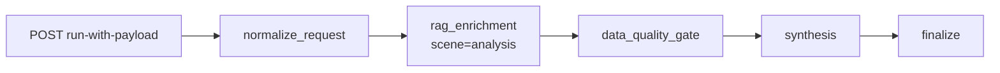
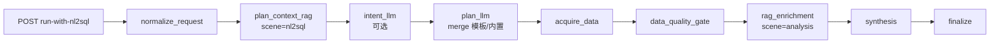

# 综合分析整体实现技术说明（LangGraph 方案）

> 本文是“综合分析”模块的详细设计说明，包含背景、方案取舍、接口与状态模型、编排细节、风险治理、测试验收与分阶段落地路径。  
> **实现状态**：双入口、`AnalysisGraphRunner` 内两套 LangGraph `StateGraph`（payload / nl2sql）、可选检查点与 NL2SQL 多阶段 LLM 计划已在仓库落地；下文流程图与节点名以当前代码为准。

---

## 1. 背景与问题定义

当前综合分析能力已具备基础链路（路由、会话、RAG、LLM 调用），但在面向“超温指导 / 检修策略”这类多数据源分析时，存在以下不足：

1. 入口单一：同时承载“用户已给数据”和“系统自动取数”两类场景，职责不清。
2. 数据规划不显式：分析前缺少结构化的数据需求计划，难以追踪“为何要查这批数据”。
3. NL2SQL 调用粒度偏粗：复杂分析通常需要多次分步取数，当前缺少统一编排规范。
4. RAG 上下文混用风险：数据库 schema 类知识与业务解释类知识未分层，容易相互污染。
5. 报告可复用性弱：输出偏文本，结构化报告（表格/图表配置）能力不足。

本方案解决上述问题，目标是建设可扩展的分析编排底座，为后续新增分析类型提供统一路径。

---

## 2. 方案总览（我们达成的一致）

### 2.1 目标

1. 提供双入口接口：
   - `POST /analysis/run-with-payload`（用户传入数据）
   - `POST /analysis/run-with-nl2sql`（系统自动取数）
2. 两入口共用同一 `AnalysisGraphRunner` 类，但 **编译为两套 `StateGraph`**（payload 与 nl2sql 节点边不同），避免在单图里塞满条件分支；语义上仍是「单编排内核、双 API 入口」。
3. 支持单次分析中多次 NL2SQL 调用，且调用轨迹可审计。
4. RAG 分层使用：
   - 查询规划类：`nl2sql_schema` / `nl2sql_biz_knowledge` / `nl2sql_qa_examples`
   - 业务解释类：全局知识库
5. 输出结构化报告，便于前端渲染表格/图表。

### 2.2 明确边界（本期不做）

1. 暂不接入 PMK 方程等机理模型数值计算引擎；
2. 暂不直接生成复杂二进制报告（PPT/PDF）；
3. 暂不改造已有 NL2SQL 核心实现，继续以“调用现有接口”为原则。

### 2.3 当前运行时编排形态（已实现）

1. **LangGraph**：`langgraph` 可用时，`compile(..., checkpointer=...)` 异步执行；`langgraph` 不可用时 **顺序回退** 同一套节点函数，并在 `execution_summary.graph_orchestrator` 中标记为 `sequential_fallback`。  
2. **检查点**：`ANALYSIS_CHECKPOINT_BACKEND=memory|redis` 时注入检查点器，`ainvoke` 使用 `configurable.thread_id`（默认 `session_id`）；`none` 时不注入。  
3. **NL2SQL 计划**：可选 `intent_llm` + `plan_llm`（`ANALYSIS_NL2SQL_LLM_PLANNER_ENABLED`），输出与 `analysis_plan_*` 模板合并；`analysis_report` 仍由 `synthesis` + `report_builder` 逻辑产出，**不是**独立 LLM 节点。  
4. **状态类型**：`analysis_graph_state.py` 中的 `AnalysisGraphState` 为文档化 TypedDict；运行时状态为 **plain dict**，由 runner 读写。

---

## 3. 架构设计与方案取舍

### 3.1 为什么是“双入口 + 单内核”

- 双入口是业务现实：有的上游能给完整数据，有的只能给分析问题。
- 单内核是工程约束：意图识别、RAG、报告生成不应重复开发两套。
- 结果：入口在 API 层分开，核心处理在 Graph 层统一。

### 3.2 为什么采用 LangGraph（而非单链）

- 综合分析天然是多步骤、有分支、有降级的流程；
- 需要可视化状态流、节点级可观测、可插拔扩展；
- 后续新增分析类型（如运行优化、故障诊断）时可复用节点与路由。

### 3.3 为什么 RAG 要双通道

- `nl2sql_*` 知识库用于“查什么表、用什么字段、怎么关联”；
- 全局知识库用于“为什么出现该现象、建议如何处置”；
- 将两类上下文分离可降低结论污染和幻觉风险。

---

## 4. 总体流程与时序

### 4.1 主流程（与代码节点名对齐）

**payload 模式（`StateGraph` 线性链；节点名与 trace 一致）**



**nl2sql 模式（计划检索 → 可选 LLM 意图/计划 → 取数 → 质量 → 业务 RAG → 综合）**



### 4.2 payload 模式时序（简化）

1. `normalize_request`：校验与默认值、`request_id`。  
2. `rag_enrichment`：业务解释类检索（`scene=analysis`），写入 `context_snippets` / `rag_sources`。  
3. `data_quality_gate`：对 `input_payload` 做质量闸门（strict 可失败返回）。  
4. `synthesis` → `finalize`：LLM 综合 + 结构化报告与 trace；无独立「意图/计划 LLM」阶段。

### 4.3 nl2sql 模式时序（简化）

1. `normalize_request`。  
2. `plan_context_rag`：按命名空间 `nl2sql_schema` / `nl2sql_biz_knowledge` / `nl2sql_qa_examples` 检索，**`scene=nl2sql`**，片段写入 `plan_context`，来源写入 `plan_rag_sources`。  
3. `intent_llm` / `plan_llm`（可关）：结构化 JSON + Pydantic 校验，与 `analysis_plan_<analysis_type>` 等 **合并** 得到 `plan_tasks`（模板同 `item_id` 优先、去重、依赖裁剪）。  
4. `acquire_data`：按 `plan_tasks` 调用 NL2SQL（依赖、重试、跳过见 §9）。  
5. `data_quality_gate` → `rag_enrichment`（`scene=analysis`）→ `synthesis`：若启用 LLM 计划，`synthesis` 将 `intent_llm_result` 的 JSON 字符串作为 `planning_context` 传入综合提示词。  
6. `finalize`：trace、`execution_summary`（含 `graph_nodes`、检查点与 orchestrator 元数据）。

---

## 5. 接口设计草案（可直接建模）

### 5.1 `POST /analysis/run-with-payload`

```json
{
  "user_id": "u_001",
  "session_id": "s_001",
  "analysis_type": "overheat_guidance",
  "query": "请分析近期第3受热面超温原因并给出调整建议",
  "payload": {
    "time_range": {"start": "2026-04-01T00:00:00Z", "end": "2026-04-14T00:00:00Z"},
    "sensor_points": [],
    "operation_params": [],
    "burner_status": [],
    "maintenance_records": [],
    "wall_thickness_records": []
  },
  "options": {
    "enable_rag": true,
    "enable_context": true,
    "report_style": "standard",
    "max_suggestions": 8
  }
}
```

### 5.2 `POST /analysis/run-with-nl2sql`

```json
{
  "user_id": "u_001",
  "session_id": "s_001",
  "analysis_type": "maintenance_strategy",
  "query": "请生成受热面检修分级建议",
  "data_requirements_hint": ["换管记录", "壁厚测量", "超温频次"],
  "options": {
    "enable_rag": true,
    "enable_context": true,
    "report_style": "strict",
    "max_nl2sql_calls": 6,
    "max_rows_per_query": 2000
  }
}
```

### 5.3 统一响应

```json
{
  "request_id": "anl_20260414_xxx",
  "analysis_type": "overheat_guidance",
  "summary": "结论摘要...",
  "structured_report": {
    "sections": [],
    "tables": [],
    "charts": [],
    "suggestions": [],
    "risks": []
  },
  "evidence": {
    "used_rag": true,
    "rag_sources": [],
    "nl2sql_calls": [],
    "data_coverage": {}
  },
  "trace": {
    "plan_id": "plan_xxx",
    "node_latency_ms": {},
    "template_versions": {}
  }
}
```

---

## 6. LangGraph 状态模型草案（核心）

```python
from typing import Any, Dict, List, Literal, Optional, TypedDict

AnalysisType = Literal["overheat_guidance", "maintenance_strategy", "custom"]
DataMode = Literal["payload", "nl2sql"]

class NL2SQLPlanItem(TypedDict, total=False):
    item_id: str
    purpose: str
    question: str
    expected_tables: List[str]
    expected_fields: List[str]
    namespace_hint: str
    max_rows: int
    status: Literal["pending", "success", "failed", "skipped"]
    sql: Optional[str]
    rows: Optional[List[Dict[str, Any]]]
    error: Optional[str]

class AnalysisState(TypedDict, total=False):
    request_id: str
    user_id: str
    session_id: str
    analysis_type: AnalysisType
    data_mode: DataMode
    query: str
    options: Dict[str, Any]

    input_payload: Dict[str, Any]
    intent_result: Dict[str, Any]
    analysis_plan: Dict[str, Any]
    data_plan: List[NL2SQLPlanItem]

    gathered_data: Dict[str, Any]
    data_quality_report: Dict[str, Any]
    data_coverage: Dict[str, Any]

    rag_plan_context: List[str]
    rag_business_context: List[str]
    rag_sources: List[Dict[str, Any]]

    summary: str
    structured_report: Dict[str, Any]
    suggestions: List[Dict[str, Any]]

    node_latency_ms: Dict[str, int]
    warnings: List[str]
    errors: List[str]
```

> **与仓库代码对齐**：运行期状态以 `app/llm/graphs/analysis_graph_state.py` 的 `AnalysisGraphState` 为准。上文草案中的 `rag_plan_context` / `rag_business_context` / `data_plan` 等在实现里对应 **`plan_context`**、**`context_snippets`**、**`plan_tasks`** 等；`intent_llm_result` 等为图状态中的可选字段。

---

## 7. 节点设计（详细）

### 7.1 `normalize_request_node`

- 统一字段：`analysis_type`、`data_mode`、`options` 默认值。
- 校验：`user_id/session_id`、必填字段、枚举值合法性。
- 产出：标准化 `AnalysisState` 与 `request_id`。

### 7.2 计划与意图（仅 nl2sql；payload 为桩数据）

- **`plan_context_rag`**：检索服务于后续 LLM 计划与模板合并；逐命名空间调用 RAG，**`scene=nl2sql`**，文本片段写入 `plan_context`，`plan_rag_sources` 记录证据。  
- **`intent_llm`**（`ANALYSIS_NL2SQL_LLM_PLANNER_ENABLED=true`）：调用 `analysis_intent` 提示词，解析为结构化 `intent_result`；失败则降级并追加 `warnings`。  
- **`plan_llm` + merge**：调用 `analysis_data_plan` 提示词得 LLM 任务列表，与 `analysis_plan_<type>` / `analysis_plan_generic` / 内置默认计划合并为最终 `data_plan`（模板同 `item_id` 覆盖 LLM、按问题 key 去重、依赖 id 过滤）。关闭 LLM 计划时跳过两节点，仅模板/内置。  
- **payload 模式**：无上述节点；分析意图字段在响应/trace 中由 runner 侧逻辑填充，不经 NL2SQL 计划链路。

### 7.3 `acquire_data_node`（图中名 `acquire_data`）

- `payload`：将 `input_payload` 写入 `gathered_data`（不经 NL2SQL）。
- `nl2sql`：按合并后的 `plan_tasks` 循环调用已有 NL2SQL 接口。
- 每次调用记录：`purpose`、`question`、`sql`、`rows`、`status/error`。

### 7.4 `data_quality_gate_node`

- 检查项：空结果、时间窗缺口、关键字段缺失、异常值比例。
- 结果写入：`data_quality_report` + `data_coverage`。
- 可配置：
  - `strict=false`：降级输出；
  - `strict=true`：关键数据缺失则失败返回。

### 7.5 `rag_enrichment_node`（图中名 `rag_enrichment`）

- **nl2sql**：在 `acquire_data` 之后执行，`scene=analysis`，结果写入 `context_snippets`；若本节点未启用业务 RAG，可能仍将 `plan_rag_sources` 挂入 `rag_sources` 供审计（`used_rag` 依实际命中而定）。  
- **payload**：在 `data_quality_gate` 之前执行同一节点，仍使用 `scene=analysis`。  
- 证据链：`rag_sources` 含 `namespace` / `doc_id` / `score`（受索引元数据完整度影响）。

### 7.6 `synthesis_node`

- 输入：`gathered_data`、`context_snippets`、合成提示模板；nl2sql 且启用 LLM 计划时附加 **`planning_context`**（`intent_llm_result` 的 JSON 文本）。  
- 输出：`summary`、`suggestions`、中间证据结构。
- 约束：必须引用事实数据，不得编造具体数值。

### 7.7 `report_builder_node`（逻辑在 `finalize` 前由同一 runner 完成）

- 输出标准结构：
  - `sections`（分节文本）
  - `tables`（可渲染表格数据）
  - `charts`（图表配置草案）
  - `suggestions`（建议清单）
  - `risks`（风险与限制）

### 7.8 `finalize_node`

- 汇总 `trace`（节点耗时、模板版本、NL2SQL 调用摘要、`graph_nodes`、`planner_warnings` 等）。
- 写会话（用户请求 + 结果摘要）。
- 返回统一响应。

---

## 8. RAG 双通道策略（详细规则）

1. RAG 分两阶段执行（nl2sql）：
   - 阶段 A：`plan_context_rag`，逐库 `scene=nl2sql` -> `plan_context` / `plan_rag_sources`，供 **意图/计划 LLM** 与模板合并。  
   - 阶段 B：`rag_enrichment`，`scene=analysis` -> `context_snippets`，供 **synthesis**。  
   payload 仅有阶段 B（在 `data_quality_gate` 前执行 `rag_enrichment`）。
2. 规划类检索命中 `nl2sql_*` namespaces，业务类检索命中全局库。
3. 提示词拼接时不得直接混合两类上下文，避免 schema 文本影响结论表达。
4. 记录每条检索片段来源，便于审计与回放。

---

## 9. NL2SQL 多次调用编排规范（详细规则）

1. 默认最多 `max_nl2sql_calls=6`，可按场景下调或上调。
2. 建议顺序：
   - 主事实（超温、壁厚）
   - 关联维度（设备、换管历史）
   - 口径补充（阈值、统计规则）
3. 每次调用必须记录：
   - 查询目的 `purpose`
   - 询问语句 `question`
   - 预期表字段 `expected_tables/expected_fields`
   - 实际 SQL 与执行状态
4. 失败处理：
   - 单步失败允许重试一次；
   - 超过重试后标记 warning，流程可降级继续（由 strict 控制）。

---

## 10. 模板与配置策略

建议在 `configs/prompts.yaml` 扩展以下分层键：

1. `analysis.intent.<analysis_type>`
2. `analysis.data_plan.<analysis_type>`
3. `analysis.synthesis.<analysis_type>`
4. `analysis.report.<analysis_type>`

建议同时引入 `analysis_type + version` 机制，支持灰度和回放。

---

## 11. 与现有代码的衔接关系

1. `app/api/analysis.py`
   - 企业版双入口（`/analysis/run-with-payload`、`/analysis/run-with-nl2sql`）及 trace 运维接口。
2. `app/models/analysis.py`
   - V2 请求/响应与 trace 模型。
3. `app/models/analysis_nl2sql_llm.py`
   - NL2SQL 计划相关 Pydantic 模型与 LLM 输出 JSON 抽取。
4. `app/services/analysis_service.py`
   - `run_analysis_payload` / `run_analysis_nl2sql`，组装 `AnalysisGraphRunner`、trace 持久化与检索。
5. `app/llm/graphs/`
   - `analysis_graph_state.py`、`analysis_graph_runner.py`（节点内嵌于 runner，无独立 `analysis_*_nodes.py` 文件）。
6. RAG 与 NL2SQL
   - RAG 复用现有服务；
   - NL2SQL 仅走现有接口调用链，不重复实现。

---

## 12. 错误处理与降级策略

1. 数据缺失：
   - `strict=false` 输出“信息不足+补采建议”；
   - `strict=true` 返回明确错误码与缺失清单。
2. NL2SQL 失败：
   - 单步重试；
   - 记录失败项并在报告中标注“数据覆盖不足”。
3. RAG 不可用：
   - 退化为纯数据驱动分析；
   - 在 `evidence.used_rag=false` 中显式标识。
4. LLM 失败：
   - 退化为模板化基础报告（含已取数据摘要）。

---

## 13. 可观测性与审计要求

每次请求应至少记录：

1. `request_id`、`analysis_type`、`data_mode`
2. 节点耗时 `node_latency_ms`
3. NL2SQL 调用轨迹（问题、SQL、状态、行数）
4. RAG 片段来源（namespace、文档 ID）
5. 模板版本（intent/data_plan/synthesis/report）

该信息用于线上排障、质量复盘与审计留痕。

---

## 14. 测试与验收建议

### 14.1 单元测试

1. 请求模型校验（枚举、必填、默认值）
2. `data_plan` 生成规则
3. 节点路由（payload 与 nl2sql 分支）
4. 数据质量判定规则

### 14.2 集成测试

1. payload 模式全链路通过
2. nl2sql 模式 2~3 次查询编排通过
3. RAG 双通道检索行为正确
4. 统一响应结构稳定

### 14.3 验收标准

1. 双接口可用且返回结构一致；
2. 单次分析支持多次 NL2SQL 调用并可追踪；
3. 报告输出具备可渲染的 tables/charts/suggestions；
4. 失败场景具备可解释降级结果；
5. 仅企业版 V2 入口对外提供服务（无旧链路依赖）。

---

## 15. 分阶段落地计划

### Phase 1（最小可用）

1. 新增双接口 + V2 模型 + Graph 状态模型；
2. payload 模式完整跑通；
3. nl2sql 模式支持 2~3 次查询；
4. 输出结构化报告 JSON。

### Phase 2（增强）

1. 多次编排增强（依赖顺序、重试、补查）；
2. RAG 双通道策略稳定化；
3. 模板版本化、灰度与回放。

### Phase 3（产品化）

1. 图表模板增强；
2. trace 检索与回放能力完善；
3. 新分析类型快速扩展（复用现有节点）。

---

## 16. 平台共用框架兼容清单（实现必须遵循）

本节用于确保综合分析新方案与当前平台通用框架保持一致，避免“功能可用但不合框架规范”的情况。

### 16.1 API 与鉴权兼容

1. 新增接口沿用统一鉴权：`Authorization: Bearer <SERVICE_API_KEY>`。
2. 路由注册与现有 `app/main.py` 方式一致，挂载在 `analysis` 分组下。
3. 错误响应遵循统一风格：
   - 参数校验失败：422；
   - 鉴权失败：401/403；
   - 业务失败：返回可解释错误信息与 request_id。

### 16.2 日志规范兼容（`app/core/logging.py`）

1. 所有节点日志通过统一 logger 输出，不引入自定义日志框架。
2. 关键日志字段建议固定：
   - `request_id`, `user_id`, `session_id`, `analysis_type`, `data_mode`
   - `node`, `latency_ms`, `status`
3. NL2SQL 与 RAG 日志应记录摘要，不直接打印敏感原始数据。
4. 异常日志使用统一异常栈记录方式，避免吞错。

### 16.3 监控指标兼容（`app/core/metrics.py`）

1. 复用现有 Prometheus 中间件能力（请求量、请求耗时）。
2. 建议补充 analysis 维度业务指标（不破坏现有指标体系）：
   - `analysis_requests_total{analysis_type,data_mode,status}`
   - `analysis_node_latency_seconds{node,analysis_type}`
   - `analysis_nl2sql_calls_total{analysis_type,status}`
   - `analysis_degrade_total{reason}`
   - `analysis_trace_queries_total{endpoint,status}`
   - `analysis_trace_query_latency_seconds{endpoint}`
   - `analysis_trace_trend_cache_hits_total`
   - `analysis_trace_trend_cache_miss_total`
   - `analysis_trace_index_cleanup_total{index_type}`
3. 指标命名与标签风格与现有模块保持一致，避免多套命名体系。

### 16.4 配置中心兼容（`app/core/config.py`）

1. 所有新开关进入统一配置中心，不在业务代码散落读取环境变量。
2. 建议新增 `AnalysisConfig`（或并入现有配置结构）管理：
   - 默认 `max_nl2sql_calls`、`max_rows_per_query`
   - strict 模式开关
   - 默认模板版本
   - 报告输出限制（sections/charts 上限）
3. 配置项命名风格与现有 `CHATBOT_*` / `RAG_*` 保持一致。

### 16.5 会话与 ID 规范兼容（`app/conversation/*`）

1. 会话读写统一走 `ConversationManager`，不直接写底层 store。
2. `user_id/session_id` 校验沿用 `app.conversation.ids`。
3. 保持与现有会话窗口策略兼容，避免 analysis 分支破坏全局会话行为。

### 16.6 RAG 与 NL2SQL 子系统兼容

1. RAG 复用现有服务与命名空间规范，不新增“平行 RAG 实现”。
2. NL2SQL 仅调用现有接口/服务链路，不重复实现 SQL 生成与安全校验。
3. 多次 NL2SQL 调用时，必须保留每次调用的 trace，便于与现有审计机制对齐。

### 16.7 可观测与回放兼容

1. `trace` 结构与现有可观测实践对齐，至少包含：
   - 节点耗时
   - 模板版本
   - NL2SQL 调用摘要
   - RAG 片段来源
2. 若启用 LangSmith，沿用 `app/llm/langsmith_tracker.py`，不引入新埋点体系。
3. 回放时可根据 request_id 还原关键决策链路（计划 -> 取数 -> 结论）。

### 16.8 兼容结论（当前文档评估）

1. 已覆盖：编排、状态模型、降级策略、可观测与审计主线。
2. 本次补齐后显式覆盖：鉴权、日志、监控、配置中心、会话与 ID、平台子系统复用约束。
3. 本节可作为发布前检查项；与代码不一致处以 `analysis_graph_runner.py` 与 `AnalysisConfig` 为准。

---

## 17. Phase 3 产品化落地进展（已实现）

### 17.1 能力范围（Batch 1 ~ Batch 7）

1. 结构化报告增强：图表数据支持按 `analysis_type` 与 `chart_mode` 自动聚合。  
2. **LangGraph**：payload / nl2sql 各一套 `StateGraph`，`execution_summary.graph_nodes` 记录节点级轨迹；无 `langgraph` 包时 **顺序回退** 并标记 `graph_orchestrator`。  
3. **检查点**：可选 `memory` / `redis`（`ANALYSIS_CHECKPOINT_*`），`thread_id` 默认取 `session_id`。  
4. **NL2SQL LLM 计划**：`ANALYSIS_NL2SQL_LLM_PLANNER_ENABLED` 控制 `intent_llm` / `plan_llm` 与模板合并。  
5. Trace 可回放：已支持 `request_id` 维度详情查询。  
6. Trace 可持久化：支持 **Redis**、**Elasticsearch / EasySearch 兼容归档（REST 同协议）**、**内存**后端；失败按策略回退。  
7. Trace 可检索：支持分页、按 `analysis_type`、`data_mode`、`request_id_like`、时间范围过滤。  
8. Trace 统计分析：支持总览统计、时间趋势、降级 TopN。  
9. Redis 索引优化：`analysis_type/data_mode` 二级索引 + 时间范围分数过滤下沉。  
10. 稳定性增强：索引惰性清理（过期孤儿 member 回收）与趋势查询缓存（TTL）已接入。

### 17.2 运维配置项（已落地）

1. `ANALYSIS_TRACE_BACKEND`：`redis`、`memory`、**`es`**（Elasticsearch 或 EasySearch，兼容 ES HTTP API）、**`easysearch`**（与 `es` 等价别名）。  
2. `ANALYSIS_TRACE_TTL_MINUTES`：trace 数据 TTL（Redis 为 key TTL；ES 归档为文档字段 `expires_at_ms` + 查询过滤）。  
3. `ANALYSIS_TRACE_MAX_ITEMS`：**仅 Redis** 侧 ZSET 裁剪上限；ES 归档不按该项自动裁剪。  
4. `ANALYSIS_TRACE_LAZY_CLEANUP_BATCH_SIZE`：单次惰性清理批量（Redis 索引孤儿回收）。  
5. `ANALYSIS_TRACE_TREND_CACHE_TTL_SECONDS`：趋势缓存 TTL。  
6. **ES / EasySearch 归档专用**（`trace_backend=es` 或 `easysearch` 时）：  
   - `ANALYSIS_TRACE_ES_HOSTS`（未配置时可回退复用 `RAG_ES_HOSTS`）；  
   - `ANALYSIS_TRACE_ES_INDEX`（默认 `analysis_trace_archive`，**必须与 RAG chunk 索引分离**）；  
   - `ANALYSIS_TRACE_ES_VERIFY_CERTS`、`ANALYSIS_TRACE_ES_TIMEOUT_SECONDS`；  
   - `ANALYSIS_TRACE_ES_USERNAME` / `ANALYSIS_TRACE_ES_PASSWORD` 或 `ANALYSIS_TRACE_ES_API_KEY`（可回退 `RAG_ES_*`）。  
   客户端认证与 `ElasticsearchVectorStore._create_client` 对齐：**7.x `http_auth`，8.x `basic_auth`**。  
7. **LangGraph 检查点**：`ANALYSIS_CHECKPOINT_BACKEND`（`none` / `memory` / `redis`）、`ANALYSIS_CHECKPOINT_REDIS_URL`（`redis` 时必填）、`ANALYSIS_CHECKPOINT_NAMESPACE`。  
8. **NL2SQL LLM 计划**：`ANALYSIS_NL2SQL_LLM_PLANNER_ENABLED`（默认 `true`）。  
9. **RAG 场景参数**：业务解释检索见 `app/app-deploy/.env.example` 中 `RAG_SCENE_ANALYSIS_*`；规划侧检索固定 `scene=nl2sql` 与 `nl2sql_*` 命名空间（与 NL2SQL 主链路 RAG 一致）。

### 17.3 监控面板建议（Prometheus / Grafana）

1. Trace 查询成功率：`sum(rate(analysis_trace_queries_total{status="success"}[5m])) / sum(rate(analysis_trace_queries_total[5m]))`。  
2. Trace 查询 P95：`histogram_quantile(0.95, sum(rate(analysis_trace_query_latency_seconds_bucket[5m])) by (le, endpoint))`。  
3. 趋势缓存命中率：`rate(analysis_trace_trend_cache_hits_total[5m]) / (rate(analysis_trace_trend_cache_hits_total[5m]) + rate(analysis_trace_trend_cache_miss_total[5m]))`。  
4. 索引清理速率：`sum(rate(analysis_trace_index_cleanup_total[5m])) by (index_type)`。  
5. 降级原因热度：`topk(5, sum(rate(analysis_degrade_total[5m])) by (reason))`。

### 17.4 告警规则建议（初版）

1. **Trace 查询可用性下降**：5 分钟成功率 < 99%，持续 10 分钟告警。  
2. **Trace 查询性能劣化**：任一 `endpoint` 的 P95 > 1.5s，持续 15 分钟告警。  
3. **缓存失效异常**：趋势缓存命中率 < 20%，持续 30 分钟告警（排查缓存 TTL / 键爆炸）。  
4. **索引异常膨胀信号**：`analysis_trace_index_cleanup_total` 速率突增（超过基线 3 倍）持续 15 分钟告警。  
5. **分析降级异常**：`analysis_degrade_total` 总速率超过基线阈值持续 10 分钟告警。

### 17.5 Trace 归档 + EasySearch（与 RAG 的关系）

**场景**：生产上 RAG 向量库已落在 **EasySearch**（兼容 Elasticsearch REST API）。综合分析的 trace 若需 **长期审计、跨实例检索**，可将 `ANALYSIS_TRACE_BACKEND` 设为 `es` 或 `easysearch`，把 trace 全文写入 EasySearch 中的**独立业务索引**。

**实现要点**（与 `enterprise-level_transformation_docs/企业级综合分析实现和使用说明.md` §4.4 一致）：

1. **同一套客户端、不同索引**  
   - 与 RAG 相同，使用官方 `elasticsearch` Python 客户端连接集群；EasySearch 走同一 HTTP 接口族。  
   - Trace 归档默认索引名为 **`analysis_trace_archive`**（`ANALYSIS_TRACE_ES_INDEX`）；RAG chunk 默认使用 **`RAG_ES_INDEX_NAME`**（如 `rag_knowledge_base`）及 alias/version 命名空间。二者 **索引名不同**，文档结构也不同（trace 为 `keyword/long/object` 扁平审计文档，RAG 为向量 + 文本 chunk）。

2. **不会影响 RAG 知识库检索的原因**  
   - **RAG 检索路径**（`RAGService` / `HybridRAGService` / `ElasticsearchVectorStore`）只向 **RAG 配置的索引别名或物理索引** 发起 `search`/`knn` 类查询，**不会读取** `ANALYSIS_TRACE_ES_INDEX`。  
   - **Trace 写入路径**（`ElasticsearchAnalysisTraceStore`）只对 trace 索引执行 `index/get/search`，**不参与** RAG 的 ingest 流水线与 chunk 写入。  
   - 因此即 trace 与 RAG **共用同一 EasySearch 集群**（复用 `RAG_ES_HOSTS` 与认证），只要 **不把 `ANALYSIS_TRACE_ES_INDEX` 错配成 RAG 的 chunk 索引名**，RAG 召回结果中 **不会混入** 综合分析 trace 文档。

3. **运维建议**  
   - 集群可共用，**索引务必分离**；必要时为 trace 索引单独设置 ILM/保留策略（与 RAG 分片策略解耦）。  
   - 自签名 HTTPS：与 RAG 一致将 `ANALYSIS_TRACE_ES_VERIFY_CERTS=false`（或正确挂载 CA）。  
   - 若需完全网络隔离，可为 trace 单独配置 `ANALYSIS_TRACE_ES_HOSTS`，与 RAG 集群解耦。

---

## 18. Grafana Dashboard 同文档实现（Phase 3 第九批）

> 本节直接给出可落地的 Dashboard 定义与查询，不单独维护独立 JSON 文件。  
> 若后续需要导入 Grafana，可从本节复制 JSON 片段到 Grafana Import 页面进行创建。

### 18.1 Dashboard 目标与范围

1. 面向对象：平台运维、分析模块研发、故障排查人员。  
2. 观察范围：Trace 查询链路、趋势统计链路、缓存命中、索引健康与降级风险。  
3. 数据源：Prometheus（默认数据源名示例：`Prometheus`）。

### 18.2 变量设计（Dashboard Variables）

1. `env`：运行环境（如 `dev/test/prod`），用于多环境切换。  
2. `endpoint`：trace 查询端点（`get/list/stats/trend/degrade_topn`）。  
3. `analysis_type`：分析类型（`overheat_guidance/maintenance_strategy/custom`）。  
4. `data_mode`：数据模式（`payload/nl2sql`）。

### 18.3 面板设计（推荐 8 个）

1. **Trace Query Success Rate**（Stat）  
   - PromQL：  
   `sum(rate(analysis_trace_queries_total{status="success",env=~"$env"}[5m])) / sum(rate(analysis_trace_queries_total{env=~"$env"}[5m]))`
2. **Trace Query QPS by Endpoint**（Time series）  
   - PromQL：  
   `sum(rate(analysis_trace_queries_total{env=~"$env"}[5m])) by (endpoint,status)`
3. **Trace Query P95 Latency**（Time series）  
   - PromQL：  
   `histogram_quantile(0.95, sum(rate(analysis_trace_query_latency_seconds_bucket{env=~"$env"}[5m])) by (le, endpoint))`
4. **Trend Cache Hit Ratio**（Gauge）  
   - PromQL：  
   `rate(analysis_trace_trend_cache_hits_total{env=~"$env"}[5m]) / (rate(analysis_trace_trend_cache_hits_total{env=~"$env"}[5m]) + rate(analysis_trace_trend_cache_miss_total{env=~"$env"}[5m]))`
5. **Trend Cache Hit/Miss QPS**（Time series）  
   - PromQL A：`rate(analysis_trace_trend_cache_hits_total{env=~"$env"}[5m])`  
   - PromQL B：`rate(analysis_trace_trend_cache_miss_total{env=~"$env"}[5m])`
6. **Trace Index Cleanup Rate**（Time series）  
   - PromQL：  
   `sum(rate(analysis_trace_index_cleanup_total{env=~"$env"}[5m])) by (index_type)`
7. **Analysis Degrade Top Reasons**（Bar chart）  
   - PromQL：  
   `topk(8, sum(rate(analysis_degrade_total{env=~"$env"}[10m])) by (reason))`
8. **Analysis Request Health**（Time series）  
   - PromQL：  
   `sum(rate(analysis_requests_total{env=~"$env"}[5m])) by (analysis_type,data_mode,status)`

### 18.4 阈值建议（与告警对齐）

1. 成功率面板阈值：`>=99%` 绿色，`95%~99%` 黄色，`<95%` 红色。  
2. P95 延迟阈值：`<=0.8s` 绿色，`0.8~1.5s` 黄色，`>1.5s` 红色。  
3. 缓存命中率阈值：`>=60%` 绿色，`20%~60%` 黄色，`<20%` 红色。  
4. 清理速率阈值：按历史基线配置动态阈值（建议 3 倍基线触发红色）。

### 18.5 可直接导入的 JSON 模板（同文档内）

> 说明：该模板为“最小可用”骨架，包含关键 panels；可在 Grafana Import 后按团队风格微调布局与样式。

```json
{
  "title": "Analysis Trace Observability",
  "timezone": "browser",
  "schemaVersion": 39,
  "version": 1,
  "refresh": "30s",
  "tags": ["analysis", "trace", "phase3"],
  "templating": {
    "list": [
      {
        "name": "env",
        "type": "query",
        "datasource": "Prometheus",
        "query": "label_values(analysis_trace_queries_total, env)",
        "includeAll": true,
        "multi": true
      }
    ]
  },
  "panels": [
    {
      "type": "stat",
      "title": "Trace Query Success Rate",
      "targets": [
        {
          "expr": "sum(rate(analysis_trace_queries_total{status=\"success\",env=~\"$env\"}[5m])) / sum(rate(analysis_trace_queries_total{env=~\"$env\"}[5m]))",
          "refId": "A"
        }
      ],
      "gridPos": {"h": 6, "w": 8, "x": 0, "y": 0}
    },
    {
      "type": "timeseries",
      "title": "Trace Query P95 Latency",
      "targets": [
        {
          "expr": "histogram_quantile(0.95, sum(rate(analysis_trace_query_latency_seconds_bucket{env=~\"$env\"}[5m])) by (le, endpoint))",
          "refId": "A"
        }
      ],
      "gridPos": {"h": 8, "w": 16, "x": 8, "y": 0}
    },
    {
      "type": "gauge",
      "title": "Trend Cache Hit Ratio",
      "targets": [
        {
          "expr": "rate(analysis_trace_trend_cache_hits_total{env=~\"$env\"}[5m]) / (rate(analysis_trace_trend_cache_hits_total{env=~\"$env\"}[5m]) + rate(analysis_trace_trend_cache_miss_total{env=~\"$env\"}[5m]))",
          "refId": "A"
        }
      ],
      "gridPos": {"h": 8, "w": 8, "x": 0, "y": 6}
    },
    {
      "type": "timeseries",
      "title": "Trace Index Cleanup Rate",
      "targets": [
        {
          "expr": "sum(rate(analysis_trace_index_cleanup_total{env=~\"$env\"}[5m])) by (index_type)",
          "refId": "A"
        }
      ],
      "gridPos": {"h": 8, "w": 16, "x": 8, "y": 8}
    }
  ]
}
```

### 18.6 导入与使用步骤

1. 打开 Grafana -> `Dashboards` -> `Import`。  
2. 粘贴本节 JSON 模板。  
3. 选择 Prometheus 数据源（与模板中的 `datasource` 对应）。  
4. 导入后先校验 5 个核心指标是否均有数据。  
5. 若无 `env` 标签，请将查询中的 `env=~"$env"` 去掉或改为你们现有标签（如 `namespace` / `instance`）。

### 18.7 告警规则文件落地（已实现）

1. 规则文件：`configs/monitoring/analysis-trace-alert-rules.yml`。  
2. 包含两类规则组：  
   - Recording Rules：成功率、P95、缓存命中率。  
   - Alert Rules：可用性、性能、缓存、索引清理、降级异常。  
3. 接入方式（Prometheus）：在主配置中增加 `rule_files` 引用该文件。  
4. 阈值策略：文件内给出默认值，生产请按近 2 周基线做二次调优。  
5. 变更原则：先放宽阈值观察 1~2 天，再逐步收紧，避免首日噪声告警。
