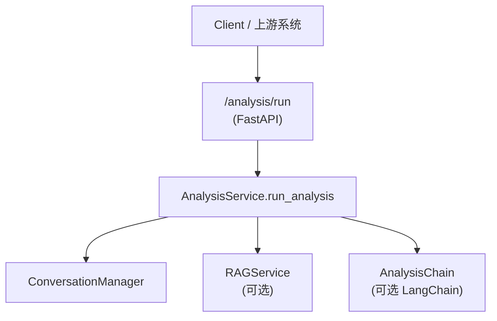

# 综合分析整体实现技术说明

> 本文描述 `/analysis/run` 综合分析链路在当前基座中的实现：如何处理“文本 + 多模态数据引用 ID”的请求，如何按配置集成 RAG 与会话上下文，以及未来通过 LangChain/LangGraph 接入真正的多模态 Agent 工作流。  
> RAG 细节请参考 `framework-guide/RAG整体实现技术说明.md`。

---

## 文档结构（阅读导航）

| 章节 | 内容 |
|------|------|
| **§1 从使用视角看整体流程** | `/analysis/run` → AnalysisService → RAG/会话 → 占位/Agent 结果 |
| **§2 模块与文件映射** | 路由、Service、AnalysisChain、RAG 与会话组件 |
| **§3 基础占位实现逻辑** | 无 LangChain 时如何结合 RAG 与多模态 ID 生成结果 |
| **§4 Agentic RAG + 多模态分析蓝图** | AnalysisChain 的预期职责与扩展方向 |
| **§5 配置与依赖** | 与 RAG/会话/多模态数据源相关的配置 |
| **§6 调用链示意图** | 从 HTTP 到分析结果的高层结构 |

---

## 1. 从使用视角看整体流程

### 1.1 `/analysis/run` 调用主线

1. **API 层：`/analysis/run`**  
   - 路由文件：`app/api/analysis.py`。  
   - 接口：`POST /analysis/run`。  
   - 请求/响应模型：`AnalysisInput` / `AnalysisResult`（`app/models/analysis.py`），支持：  
     - `user_id`、`session_id`；  
     - `query`：用户对综合分析需求的自然语言描述；  
     - `image_ids`、`video_clip_ids`、`gps_ids`、`sensor_data_ids`：多模态数据在外部系统中的引用 ID；  
     - `enable_rag`：是否启用基于文本知识库的检索；  
     - `enable_context`：是否启用会话上下文。  
   - API 实现：调用单例 `AnalysisService` 的 `run_analysis(data)`。

2. **Service 层：`AnalysisService.run_analysis`**  
   - 文件：`app/services/analysis_service.py`。  
   - 调用流程概览：  
     1. 使用 `ConversationManager.append_user_message` 记录用户请求；  
     2. 若 LangChain 可用并成功构造 `AnalysisChain`，则优先走链路 `_chain.run(data)`：  
        - 由链路内部处理 RAG 检索、多模态数据读取与 Agent 规划；  
        - 返回 `AnalysisResult`（summary + details + used_rag + context_snippets 等）；  
        - Service 在链路结束后，将 summary 记录为助手消息并直接返回结果。  
     3. 否则，走**基础占位实现**：  
        - 若 `enable_rag` 为真，则通过 `RAGService.retrieve_context(data.query)` 检索文本上下文；  
        - 若 `enable_context` 为真，则通过 `ConversationManager.get_recent_history` 打印历史条数；  
        - 构造 `summary` 与 `details` 两段文本：前者说明是占位结果，后者罗列 query 与多模态 ID 数量；  
        - 将 summary 作为助手消息写入会话，并返回 `AnalysisResult`。

> **当前状态**：AnalysisService 提供“占位结果 + RAG/会话打通 + LangChain 预留”的企业级骨架，实现对综合分析场景的统一入口。

---

## 2. 模块与文件映射

| 模块 | 路径 | 职责 |
|------|------|------|
| API 路由 | `app/api/analysis.py` | 定义 `/analysis/run` 接口，将请求交给 `AnalysisService.run_analysis`。 |
| Service | `app/services/analysis_service.py` | 综合分析主逻辑：会话记录、RAG 调用、占位结果构造与链路编排。 |
| RAG 基座 | `app/rag/rag_service.py` | `RAGService`，用于向量 RAG 检索；细节见 RAG 文档。 |
| 会话管理 | `app/conversation/manager.py` | `ConversationManager`，统一管理分析/Chatbot/NL2SQL 等场景的会话。 |
| LangChain AnalysisChain | `app/llm/chains/analysis_chain.py` | 若安装 LangChain，则用于构建多步 Agentic 综合分析链路（蓝图）。 |

---

## 3. 基础占位实现逻辑

当 LangChain 不可用时，`AnalysisService` 采用简化实现用于打通链路：

1. 会话记录：  
   - 将用户请求内容写入会话，便于后续查询与上下文拼接。  
2. 可选 RAG 检索：  
   - 若 `enable_rag` 为真，则基于 `data.query` 通过 `RAGService.retrieve_context` 检索文本上下文片段；  
   - 使用返回片段数量设置 `used_rag` 标记。  
3. 可选上下文日志输出：  
   - 若 `enable_context` 为真，则从 `ConversationManager` 中读取最近历史，并在日志中记录条数。  
4. 结果构造：  
   - `summary`：固定的占位说明“这是综合分析占位结果，后续会由 Agent + 大模型结合多模态数据生成正式报告。”；  
   - `details`：罗列当前 query 与多模态 ID 的数量，用于验证请求结构与前后端联调。  
5. 将 summary 写入会话，并返回 `AnalysisResult`。

---

## 4. Agentic RAG + 多模态分析蓝图

在未来版本中，`AnalysisChain` 预计承担以下职责（参考 `docs/Agentic-Workflow-设计蓝图.md` 与 RAG 文档）：

- 解析用户的综合分析需求，将其拆分为若干子任务（如“文本背景检索”“图像证据分析”“视频关键帧检测”“传感器异常检测”等）；  
- 为每个子任务选择合适的工具：  
  - 文本/结构化知识 → 通用 RAG（`RAGService` / `HybridRAGService`）；  
  - 图像/视频 → 小模型检测通道或外部多模态模型服务；  
  - GPS/传感器 → 时序/轨迹分析工具；  
- 统一整合各子任务结果，生成结构化中间表示与最终自然语言报告；  
- 根据 `enable_rag` / `enable_context` 等开关，动态调整检索与上下文注入策略。

> **与 RAG/NL2SQL 的关系**：综合分析共享同一套 RAG 向量库与会话管理，仅在 Agent 工程与多模态接入层有所不同。

---

## 5. 配置与依赖

- RAG 配置：  
  - 同通用 RAG 场景，主要通过 `RAGConfig` 及对应环境变量控制（索引目录、GraphRAG 开关等）。  
- 会话配置：  
  - 由 `ConversationManager` 与 Redis/内存存储配置决定，与 Chatbot/NL2SQL 共享。  
- 多模态数据访问：  
  - 当前实现仅接收多模态数据的引用 ID，未直接访问底层存储；  
  - 未来应通过统一的数据访问服务（或工具调用）拉取真实图像/视频/GPS/传感器数据进行分析。  
- 依赖管理：  
  - LangChain/LangGraph 与多模态相关依赖可按需加入 `requirements-大模型应用.txt` 与 `requirements-小模型应用.txt`。

---

## 6. 调用链示意图

> **说明**：AnalysisChain 负责真正的 Agentic RAG + 多模态编排；当前占位实现仅在 Service 层完成简单组合。

