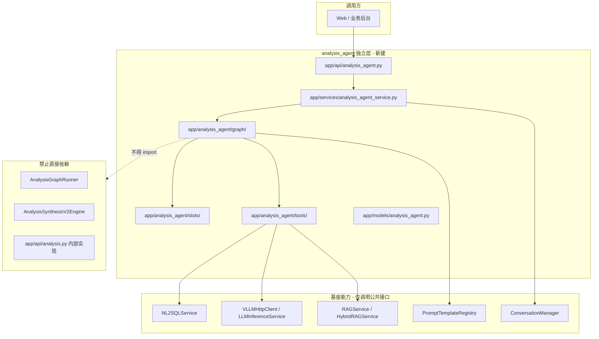
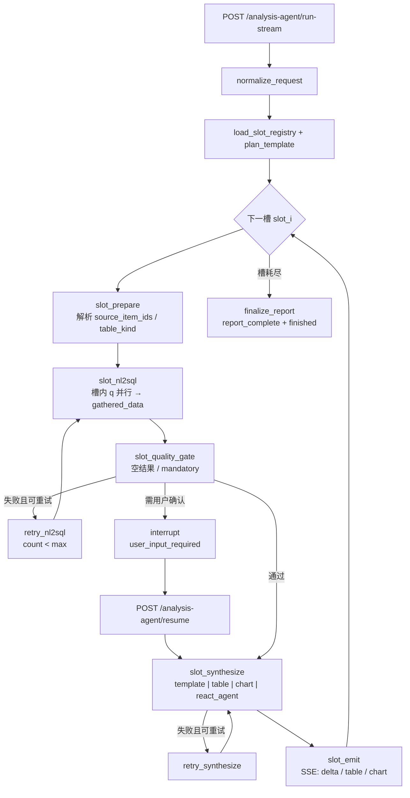

# 综合分析智能体（analysis_agent）实现方案及技术说明书

> **文档版本**：2026-05-28 v2.1  
> **状态**：**Phase 0～2 + 改造计划 T1～T5 已落地**（代码审计 2026-05-28）  
> **定位**：在既有 **LLM / RAG / NL2SQL 基座** 之上，新建 **与现网 `app/analysis`、`AnalysisGraphRunner` 无交叉 import 依赖** 的「按章节/槽：取数 → 分析 → 即时推送」分析智能体。业务上 **逐步替代** 现网综合分析编排（`AnalysisGraphRunner` + `AnalysisSynthesisV2Engine`），报告模板与章节结构 **以 `prompts.yaml` 为唯一事实源**，不再维护 Python 硬编码槽位表。  
> **关联文档**：  
> - 现网综合分析（对照，不直接复用代码）：`framework-guide/综合分析整体实现技术说明.md`  
> - NL2SQL 基座：`framework-guide/NL2SQL整体实现技术说明.md`  
> - 超温 v2 槽位与 plan 参考：`docs/综合分析优化版本实现方案(v2版本).md`、`enterprise-level_transformation_docs/系统整体技术实现-简版.md`  
> - 超温参考 SQL（运维/验收对照）：`docs/综合分析-超温分析 报告模板及查询数据逻辑/overheat_plan_v2_reference_sql.sql`

---

## 0. 可行性结论与方案决策摘要

### 0.1 可行性

**可行。** 工程已具备 LangGraph（`langgraph>=0.2.0`）、LangChain（`langchain>=0.2.0`）、`NL2SQLService`、`VLLMHttpClient`、业务 RAG、Prompt 注册表与 SSE 流式先例（`POST /analysis/run-with-nl2sql-stream`）。本方案将 **编排模型** 从「先批量取数、后批量合成」改为 **「按槽：取数 → 分析 → 即时推送」**，属于 **新管线**，不与现网 `AnalysisSynthesisV2Engine` 混用。

### 0.2 已采纳的默认推荐（实施基线 · 演进中）

| 编号 | 决策项 | 当前实现 | **目标态（改造后）** |
|------|--------|----------|----------------------|
| D1 | 业务范围 | 四类 `analysis_type`；超温仍 31 微槽 JSON | **全部类型**统一「章节级 `llm_section`」；超温收敛为 **6～8 章**（对齐九段语义，非 31 微槽） |
| D2 | 与现 API | `/analysis-agent/*` 与 `/analysis/*` 并存 | 新客户端 **仅走** `/analysis-agent/*`；现网 `/analysis/*` **冻结维护** |
| D3 | 编排形态 | LangGraph 按槽串行 + ReAct（`llm_section`） | 主图：**意图 RAG → 按章节循环（NL2SQL → 质量门 → ReAct 合成 → emit）** |
| D4 | 槽内多 q / 跨槽去重 | 槽间串行、槽内 `asyncio.gather`；**部分** `gathered_data` 命中（仅非空） | **会话级**按 `plan_item_id` 去重（成功/空/失败均缓存）；见 §7.6 |
| D5 | 配置事实源 | `analysis_agent_plan_*` + `configs/analysis_agent_slots/*.json` | **单一** `analysis_agent_report_{type}`：`plan.items[]` + `chapters[]`（含 `source_item_ids`、合成约束） |
| D6 | 表/图渲染 | 超温仍 `template_deterministic` / `overheat_core` | **仅 Agent 工具**：`emit_markdown_table` / `emit_chart`（禁止模板确定性渲染） |
| D7 | SSE | `analysis_agent_*` 前缀 | 不变 |
| D8 | HITL | interrupt + resume（memory/redis） | 不变；章节级 `allow_human_confirm` |
| D9 | NL2SQL | `analysis_type=analysis_agent`，**不传** `plan_item_id` | **公共基座全量能力**（见 §7）：真实 `analysis_type` + `plan_item_id` + `plan_template_version`；L1/L2 缓存；三库 RAG；`nl2sql_qa_examples` 自动写入 |
| D10 | 规划 | 模板 plan，无交互意图节点 | **可选**意图节点 + 交互式业务 RAG 片段注入章节 |
| D11 | 图表 | `table_kind` → bar/pie | 由 Agent 按章节 `allowed_outputs` 决定 |
| D12 | 终局报告 | `analysis_agent_report_complete` | 不变 |
| D13 | Trace | `analysis_agent_trace_store` | 不变 |
| D14 | 配置前缀 | `ANALYSIS_AGENT_*` | 不变 |

### 0.3 目标架构摘要（相对现实现）

```mermaid
flowchart LR
  subgraph prompts [prompts.yaml 唯一事实源]
    REP["analysis_agent_report_{type}<br/>plan.items + chapters[]"]
  end

  subgraph graph [LangGraph]
    RAG["intent_rag / 业务 RAG"]
    LOOP["for chapter in chapters"]
    NL["slot_nl2sql<br/>NL2SQLService 基座"]
    AG["section_agent<br/>create_react_agent + emit_*"]
    EM["slot_emit SSE"]
    RAG --> LOOP
    LOOP --> NL --> AG --> EM --> LOOP
  end

  subgraph base [NL2SQL 公共基座 - 仅调用]
    CACHE["L2/L1 SQL 缓存"]
    RAG3["nl2sql_schema / biz / qa RAG"]
    QA["nl2sql_qa_examples 自动写入"]
  end

  REP --> graph
  NL --> base
```

**实现状态（2026-05-28 代码审计后）：**

| 目标 | 状态 |
|------|------|
| 单一 `analysis_agent_report_{type}` | ✅ 四类均从 `configs/analysis_agent_reports/*.v1.json`（或 prompts 同 scene）加载；plan 可内嵌或回退 `analysis_agent_plan_*` |
| 无硬编码槽注册表 | ✅ `registry` 仅 `load_analysis_run_context`；已移除 Python 31 槽回退 |
| 全章节 Agent 渲染 | ✅ 超温 9 章均为 `llm_section` / `static_markdown` |
| NL2SQL 基座 + QA 沉淀 | ✅ 五元组对齐；`analysis_type` 为真实报告类型 |
| 跨槽 `plan_item_id` 去重 | ✅ `task_status` 会话缓存 + `cached` SSE / `cache_hit` trace |
| 意图 RAG | ✅ `intent_rag` 节点 + `intent_context` 注入章节 prompt |

---

## 1. 背景与问题定义

### 1.1 现网综合分析的不足（相对本需求）

现网 **`AnalysisGraphRunner` + `AnalysisSynthesisV2Engine`**（超温 v2）已实现：

- 多槽位报告、程序表/图、分章 LLM 叙述、按槽顺序 SSE；
- `acquire_data` 阶段 **批量并行** 执行 plan 中全部 NL2SQL（如 15 项），**全部完成后再进入 synthesis**。

与本需求差距：

| 维度 | 现网超温 v2 | 本方案 analysis_agent |
|------|-------------|------------------------|
| 模块边界 | `app/api/analysis.py`、`analysis_graph_runner.py` 等 | **独立** `analysis_agent_*` 命名空间，不 import 现 analysis 编排 |
| 取数时机 | 一次性 `acquire_data` | **每槽（或槽组）先 NL2SQL 再分析** |
| 用户感知 | 取数阶段无章节输出；synthesis 阶段才有 `summary_delta` | **问答式**：每槽完成即推送，可中途交互 |
| Agent 形态 | 无 `create_react_agent` | LangGraph 主图 + ReAct 子智能体（叙述槽） |
| NL2SQL 知识 | 超温 QA 五元组 strict replay（可选） | **同一 `NL2SQLService` 基座**：L1/L2 缓存 + 三库 RAG + **按 plan 子任务自动写入** `nl2sql_qa_examples`；**默认关闭** strict replay（仍走 LLM 生成） |
| 图表 | 以 line/bar 为主 | **分类表 → 柱状图；占比表 → 饼图**（显式规则） |

### 1.2 建设目标

1. **独立产品线**：API / Service / Graph / Models / Config / Trace 均以 `analysis_agent` 命名，代码目录与现 `analysis` 解耦。  
2. **业务对齐**：P0 输出与《锅炉管壁超温智能分析报告（多测点版）》九段结构一致（数据计划 q1～q6d、章节与表图语义对齐现网 v2）。  
3. **技术栈**：LangGraph 主编排；LangChain `create_react_agent` + Tool；槽级重试；可选人机协同。  
4. **交付形态**：流式问答 + 终局结构化报告（含图表 spec）。

### 1.3 明确边界（本期不做）

1. **不 fork** `app/nl2sql/chain.py` 核心算法；`analysis_agent` **仅通过** `NL2SQLService.query` 调用，并补齐五元组参数以启用基座缓存与 QA 沉淀（见 §7）。  
2. 不接入 PMK 机理计算、不生成 PDF/PPT 二进制。  
3. P0 不包含 `img_diag`（看图诊断编排模型差异大，单列 P2）。  
4. 不废弃、不修改现 `/analysis/*` 行为（仅文档说明并存）。

---

## 2. 架构总览

### 2.1 分层与依赖边界



**允许复用（建议拷贝逻辑，避免 import）：**

- Markdown 表渲染、图表 spec 构建的 **算法思想**（参考 `analysis_synthesis_v2.py` 中超温表/图 builder）。  
- SSE 编码模式（参考 `analysis_service.py` 流式方法）。  

**必须调用的基座入口：**

| 能力 | 入口 | 说明 |
|------|------|------|
| NL2SQL | `NL2SQLService.query(NL2SQLQueryRequest)` | **完整基座链路**（L1/L2、三库 RAG、校验执行、QA 自动写入）；见 §7 |
| LLM | `VLLMHttpClient.chat` / `stream_chat` | ReAct 章节 Agent |
| 业务 RAG | `RAGService` 等，`scene=analysis` | 意图/章节结论片段；**citations 排除** nl2sql 三库 |
| NL2SQL RAG | `NL2SQLChain` 内 `NL2SQLRAGService.retrieve` | `nl2sql_schema` / `nl2sql_biz_knowledge` / `nl2sql_qa_examples`（含历史 plan QA 召回） |
| Prompt | `PromptTemplateRegistry.get_template(scene=...)` | `analysis_agent_report_*`（目标）/ 过渡期 `analysis_agent_plan_*` |

### 2.2 与现网综合分析的关系

| 项目 | 现网 `/analysis/*` | 新 `/analysis-agent/*` |
|------|-------------------|------------------------|
| 路由前缀 | `/analysis` | `/analysis-agent` |
| 编排类 | `AnalysisGraphRunner` | `AnalysisAgentGraphRunner`（新） |
| 取数 | `acquire_data` 批量并行 | **按槽流水线** |
| 合成 | `AnalysisSynthesisV2Engine` | **槽节点内完成**（含 ReAct） |
| 配置 | `ANALYSIS_*` | `ANALYSIS_AGENT_*` |
| 提示词 scene | `analysis_plan_*` / `analysis_synthesis_*` | `analysis_agent_plan_*` / `analysis_agent_synthesis_*` |

---

## 3. 核心流程设计

### 3.1 主流程（按槽/章节串行）

> **目标态**：由 `analysis_agent_report_*` 的 `chapters[]` 驱动循环（见 §0.3、§15）；下图节点名在 T1 后可改为 `chapter_*`。



**与现网时序对比（文字）：**

```text
现网:  plan → [q1..q15 并行 NL2SQL] → quality → rag → [槽位并行生成] → 按序流式推送

analysis_agent:
  plan(模板) → for slot in slots:
                  [槽内 q* 并行 NL2SQL；plan_item_id 已在 gathered_data 则跳过]
                  → quality → (retry|hitl)?
                  → synthesize(slot) → 立即 SSE
                → finalize 全文 + structured_report
```

**跨槽重复 `plan_item_id`**：多章节 `source_item_ids` 重叠时，**同一 request 内** 只对每个 `item_id` 调用一次 `NL2SQLService`（会话缓存 `gathered_data`）；与 NL2SQL 基座 L1/L2 为两层机制（§7.6）。

### 3.2 LangGraph 主图节点清单

| 节点 ID | 职责 | 输入状态 | 输出状态 |
|---------|------|----------|----------|
| `normalize_request` | 校验 `user_id`/`session_id`/`analysis_type`/`query`，生成 `request_id` | 请求体 | `request_id`, `options` |
| `load_registry` | 加载 `analysis_type` 对应槽位表与 plan 模板版本 | `analysis_type` | `ordered_slots`, `plan_tasks` |
| `slot_prepare` | 当前槽元数据、`source_item_ids`、`table_kind`、`retry_count` | `slot_index` | `current_slot`, `pending_plan_items` |
| `slot_nl2sql` | 调用 Tool `nl2sql_query`，写入 `gathered_data[item_id]` | `pending_plan_items` | `nl2sql_calls[]`, `gathered_data` |
| `slot_quality_gate` | mandatory/空结果判定 | 本槽 rows | `slot_quality` |
| `slot_synthesize` | 按 `SlotKind` 分支渲染或 ReAct | `gathered_data` 切片 | `slot_output` |
| `slot_emit` | 推送 SSE，追加 `report_sections` | `slot_output` | `stream_cursor` |
| `slot_human` | `interrupt`，写 `awaiting_user_input` | 交互原因 | checkpoint |
| `advance_slot` | `slot_index += 1` | — | 下一槽或结束 |
| `finalize_report` | 拼接 `summary`，组装 `structured_report` | 全部槽输出 | 最终结果 |

**条件边：**

- `slot_quality_gate` → `retry_nl2sql` | `slot_human` | `slot_synthesize` | `failed`（strict）  
- `slot_synthesize` → `retry_synthesize` | `slot_emit`  
- `advance_slot` → `slot_prepare` | `finalize_report`

### 3.3 ReAct 子智能体（叙述槽）

仅 **`SlotKind.llm_narrative`**（及后续扩展的 `agent_reasoning`）使用 `create_react_agent`：

```text
Tools（示例）:
  - nl2sql_query      # 本槽已取数则只读 gathered_data；紧急补数需显式策略
  - rag_retrieve      # scene=analysis，top_k 可配置
  - get_slot_data     # 返回当前槽 q 切片 JSON
  - render_table      # 可选：由 agent 触发确定性表（仍走程序渲染）
  - render_chart      # 可选：按 table_kind 出 bar/pie spec

System: analysis_agent_synthesis_narrative（从超温 narrative 复制改写）
User:   用户问题 + 本章 narrative_instruction + gathered 切片 + RAG 片段

约束:
  - 主图槽序不可被 agent 打乱（ReAct 仅服务当前槽）
  - max_iterations 受 ANALYSIS_AGENT_REACT_MAX_ITERATIONS 限制
```

确定性槽 **不** 走 ReAct，直接调用 `app/analysis_agent/renderers/` 下函数，降低成本与幻觉。

---

## 4. 目录与模块结构（建议）

```text
app/
  api/
    analysis_agent.py                 # 路由：run-stream、resume、trace
  models/
    analysis_agent.py                 # 请求/响应/SSE/Trace Pydantic
  services/
    analysis_agent_service.py         # 门面、SSE 编码、trace 持久化
    analysis_agent_trace_store.py     # 可选独立 store
  analysis_agent/
    __init__.py
    config.py                         # AnalysisAgentConfig（或并入 core/config.py 一节）
    graph/
      state.py                        # AnalysisAgentState TypedDict
      builder.py                      # StateGraph 编译、checkpointer
      runner.py                       # AnalysisAgentGraphRunner
      nodes/
        normalize.py
        slot_nl2sql.py
        slot_synthesize.py
        slot_emit.py
        finalize.py
    slots/
      registry.py                     # SYNTHESIS_SLOT_REGISTRIES
      overheat_guidance.py              # P0 槽位表（从 v2 语义复制）
      kinds.py                        # SlotKind, SynthesisSlot dataclass
    plans/
      overheat_guidance_v2.py           # plan_item 列表（对齐 q1～q6d）
    tools/
      nl2sql_tool.py
      rag_tool.py
      render_tools.py
    renderers/
      markdown_table.py
      charts.py                       # bar / pie / line 构建
    agents/
      narrative_react.py              # create_react_agent 工厂
  core/
    config.py                         # 增加 AnalysisAgentConfig 段（ANALYSIS_AGENT_*）

configs/
  prompts.yaml                        # 新增 analysis_agent_* 段（或 analysis_agent_prompts.yaml）

framework-guide/
  综合分析智能体实现方案及技术说明书.md   # 本文

tests/
  test_analysis_agent_overheat.py
  web/
    analysis-agent-stream.html        # SSE 联调页
```

**`app/main.py` 挂载：**

```python
app.include_router(analysis_agent_router, prefix="/analysis-agent", tags=["analysis-agent"])
```

---

## 5. 槽位与数据计划模型

### 5.1 槽位类型（SlotKind）

| SlotKind | 说明 | 生成方式 | 流式 |
|----------|------|----------|------|
| `template_deterministic` | 模板填空（章一、基础信息等） | 程序 | 整块 delta |
| `static_markdown` | 固定标题/说明 | 程序 | 整块 delta |
| `table_deterministic` | 数据表 | `render_markdown_table` + `table_payload` | 表 + 可选图 |
| `chart_structured` | 趋势图等 | `renderers/charts.py` | `chart_payload` |
| `llm_narrative` | 分章叙述 | `create_react_agent` 或直调 `stream_chat` | 支持 token 流 |

### 5.2 槽位元数据（扩展）

```python
@dataclass
class AnalysisAgentSlot:
    id: str
    kind: SlotKind
    source_item_ids: list[str]          # 绑定的 plan item，如 ["q3a", "q3b"]
    narrative_instruction: str | None
    table_kind: Literal["raw", "classification", "proportion"] | None = None
    chart_when_table: bool = True       # 表完成后是否自动生成图
    mandatory_data: bool = False        # 本槽依赖数据缺失是否阻塞
    max_nl2sql_retries: int = 2
    max_synthesize_retries: int = 1
    allow_human_confirm: bool = False   # 空数据是否弹交互
```

**图表映射（强制）：**

| `table_kind` | 图表类型 | `chart_type` |
|--------------|----------|--------------|
| `classification` | 柱状图 | `bar` |
| `proportion` | 饼图 | `pie` |
| `raw` | 不自动出图（或由 `chart_structured` 槽单独定义） | — |

### 5.3 数据计划（P0 超温）

- **Scene**：`analysis_agent_plan_overheat_guidance` **v1**（统一多槽位数据计划，条目 `q1`, `q2a`～`q6d`）。  
- **参考 SQL**：`docs/综合分析-超温分析 报告模板及查询数据逻辑/overheat_plan_v2_reference_sql.sql`（运维对照，文件名保留历史命名）。  
- **槽与 q 绑定**：`configs/analysis_agent_slots/overheat_guidance.v1.json`（约 31 微槽 / 九段章节）。

### 5.4 槽间串行、槽内并行

```text
slot "overheat_q3_region":
  source_item_ids: [q3a, q3b]
  → asyncio.gather(
        nl2sql_query(q3a),
        nl2sql_query(q3b),
    )
  → quality_gate(合并判定)
  → synthesize(table + narrative if any)
  → emit SSE
```

---

## 6. LangGraph 状态模型

```python
from typing import Any, Dict, List, Literal, Optional, TypedDict

class AnalysisAgentState(TypedDict, total=False):
    # --- 请求上下文 ---
    request_id: str
    user_id: str
    session_id: str
    analysis_type: str                    # P0: overheat_guidance
    query: str
    options: Dict[str, Any]

    # --- 编排 ---
    ordered_slots: List[Dict[str, Any]]
    slot_index: int
    current_slot: Dict[str, Any]
    plan_tasks: List[Dict[str, Any]]      # 全量 plan，按槽取子集

    # --- 数据 ---
    gathered_data: Dict[str, List[Dict[str, Any]]]   # item_id -> rows
    nl2sql_calls: List[Dict[str, Any]]
    context_snippets: List[str]           # 业务 RAG，可在 normalize 后预取或按槽拉取

    # --- 槽执行 ---
    slot_retry_counts: Dict[str, int]     # slot_id -> count
    slot_outputs: List[Dict[str, Any]]  # 每槽 markdown / table / chart
    slot_quality: Dict[str, Any]

    # --- 人机协同 ---
    awaiting_user_input: bool
    human_prompt: Optional[str]
    human_response: Optional[Dict[str, Any]]
    resume_token: Optional[str]

    # --- 输出 ---
    summary_parts: List[str]
    structured_report: Dict[str, Any]
    trace: Dict[str, Any]
    error: Optional[str]
```

**Checkpoint：**

- `ANALYSIS_AGENT_CHECKPOINT_BACKEND=memory`（首期）。  
- `thread_id` 默认 `session_id` 或 `request_id`；resume 时带 `resume_token` 映射到同一 thread。

---

## 7. NL2SQL 公共基座集成约定（强制）

> **原则**：`analysis_agent` **不得**自研 SQL 生成/执行旁路；所有取数 **必须** 经 `NL2SQLService.query` → `NL2SQLChain`，与 `POST /nl2sql/query`、现网 `AnalysisGraphRunner._run_single_nl2sql_plan_task` **同链路**。  
> 详见：`framework-guide/NL2SQL整体实现技术说明.md`、`docs/NL2SQL缓存实现方案.md`、**`docs/NL2SQL自然语言时间和范围窗口解析&改写改造落地方案.md`**（问句时间/范围解析）。

### 7.1 调用契约（目标实现）

与现网综合分析数据计划子任务 **字段对齐**（参考 `analysis_graph_runner.py`）：

```python
from app.services.nl2sql_service import NL2SQLService
from app.models.nl2sql import NL2SQLQueryRequest

resp = await nl2sql.query(
    NL2SQLQueryRequest(
        user_id=state["user_id"],
        session_id=state["session_id"],
        question=plan_item["question"],
        analysis_type=state["analysis_type"],          # 真实类型，如 overheat_guidance
        analysis_request_id=state["request_id"],
        plan_item_id=plan_item["id"],                  # 如 q3a —— QA 五元组必需
        plan_template_version=state["plan_template_version"],  # 如 v1
        time_intent_text=(state.get("query") or "").strip(),
        max_rows=options.max_rows_per_query,
    ),
    record_conversation=False,
)
```

**五元组与 QA 自动写入**（`app/nl2sql/qa_feedback.py`）：

| 字段 | 说明 |
|------|------|
| `analysis_type` | 报告类型，**非**占位符 `analysis_agent` |
| `plan_item_id` | 数据计划条目 id（`q1`…`q6d`） |
| `plan_template_version` | 与 `prompts.yaml` / report spec 版本一致 |
| `namespace` / `ingest_source` | 由 chain 写入 QA 时自动填充 |

当 `NL2SQL_QA_FEEDBACK_ENABLED=true` 且 `analysis_type` + `plan_item_id` 均非空时，成功执行的 SQL 会 **首次** 写入 `nl2sql_qa_examples`，供后续同类问题 **RAG 召回**（非 strict replay）。

### 7.2 基座能力清单（须全部生效）

| 能力 | 机制 | 配置/代码入口 |
|------|------|----------------|
| **L2 缓存** | 完整问题文本键，命中后仍校验/改写 | `NL2SQL_CACHE_ENABLED` → `NL2SQLChain` |
| **L1 缓存** | 时间意图折叠键（`sql_skeleton`） | 同上 |
| **Schema RAG** | 表/字段/关系片段 | `nl2sql_schema` |
| **业务 RAG** | 业务规则、口径说明 | `nl2sql_biz_knowledge` |
| **QA RAG** | 历史问答对（含本模块沉淀） | `nl2sql_qa_examples` |
| **生成 Prompt** | `scene=nl2sql` 或 `analysis_agent_nl2sql`（仅编排差异） | `PromptTemplateRegistry` |
| **校验与执行** | `SQLValidator`、TiDB 过滤器、EXPLAIN、refine 闭环 | `NL2SQLChain` + `SQLExecutor` |
| **问句意图** | 时间程序规则 + 范围 rule/LLM；`time_intent_text=query`；SQL 后处理 `@t_*`/锅炉 | `resolve_question_intent`；`NL2SQL_INTENT_PARSE_MODE` 等 |
| **QA 自动写入** | 成功 SQL → 向量库 | `NL2SQL_QA_FEEDBACK_ENABLED` |

生成阶段数据流（与基座一致）：

```text
question + time_intent_text(=用户 query)
  → resolve_question_intent（时间/范围）
  → NL2SQLChain: L2 命中? → L1 命中?
  → NL2SQLRAGService.retrieve(schema, biz, qa)
  → Prompt + LLM → SQL → TiDB/时间/范围改写 → 校验
  → execute → (可选) QA feedback index
```

### 7.3 Strict Replay 与现网超温的差异

| 机制 | 行为 | analysis_agent 策略 |
|------|------|---------------------|
| **RAG 召回** `nl2sql_qa_examples` | 相似片段进入 Prompt，**仍经 LLM** | **启用**（基座默认） |
| **QA 自动写入** | 按五元组沉淀成功 SQL | **启用**（须传 `plan_item_id`） |
| **Strict slot replay** | 五元组精确命中则 **跳过 LLM** 直接回放 SQL | **默认关闭**（`NL2SQL_QA_SLOT_STRICT_REPLAY*=false`），避免与现网超温运维策略强绑定；可按环境对单类型开启 |

**禁止**：在 `analysis_agent` 内复制 SQL、绕过 `NL2SQLService`、或使用 `analysis_type=analysis_agent` 导致无法写入/召回 plan 级 QA。

### 7.4 实现落点与过渡期差异

| 模块 | 职责 |
|------|------|
| `app/analysis_agent/nl2sql_executor.py` | **改造**：传入真实 `analysis_type`、`plan_item_id`、`plan_template_version`、`analysis_request_id` |
| `app/analysis_agent/graph/nodes`（`slot_nl2sql`） | 按章节 `source_item_ids` 并行 `gather` |
| `app/analysis_agent/tools/agent_tools.py` | ReAct 补数时复用同一 executor（可选 `run_nl2sql` tool） |
| `configs/prompts.yaml` → `analysis_agent_nl2sql` | 与 `nl2sql` scene 对齐的生成规则（编排层可定制，**不**替换 chain） |

**已实现（T3）**：`nl2sql_executor.py` 传入真实 `analysis_type`、`plan_item_id`、`plan_template_version`、`analysis_request_id`、`time_intent_text`；`orchestrator._acquire_slot_data` 会话级 `plan_item_id` 去重（§7.6）。

### 7.5 Tool 封装（章节 Agent 可选）

```python
# tools/agent_tools.py 或 nl2sql_tool.py
@tool
async def run_nl2sql(question: str, plan_item_id: str) -> str:
    """委托 NL2SQLService，返回行数+样例 JSON。"""
```

`plan_item_id` **必须**传入 `NL2SQLQueryRequest`，仅用于 `gathered_data` 键名是不够的。

### 7.6 会话级 `plan_item_id` 去重（跨槽 NL2SQL 缓存）

多槽位/多章节报告中，不同章节常共用同一数据计划条目（如 `q1` 同时出现在 ch1、ch3 的 `source_item_ids`）。**应在编排层做会话级去重**，避免同一 `request_id` 内重复查库、重复走 LLM 生成 SQL。

#### 7.6.1 与 NL2SQL 基座缓存的分工

| 层级 | 存储 | 键 | 作用域 | 目的 |
|------|------|-----|--------|------|
| **会话级** | `state.gathered_data` + `task_status` | `plan_item_id` | 单次分析报告（`request_id`） | 槽位/章节循环间 **零重复调用** `NL2SQLService` |
| **基座 L2** | `NL2SQLChain` 进程内 | 完整 `question` 文本 | 可跨请求（同进程） | 减少 LLM 生成；**仍可能执行 SQL** |
| **基座 L1** | 同上 | 时间意图骨架 | 同上 | 相似时间表述复用 SQL 骨架 |

**结论**：两层都需要；会话级去重是 **多槽报告场景的必选项**，不能指望 L1/L2 替代（键不同、且未命中时仍有完整链路开销）。

#### 7.6.2 推荐语义（目标实现）

```text
_acquire_slot_data / slot_nl2sql:
  for task in slot_plan:
    if plan_item_id in gathered_data and not force_refresh:
      # 命中会话缓存：success / empty / failed 均不再调 NL2SQL
      可选: SSE analysis_agent_nl2sql_done { cached: true, item_id, row_count }
      continue
    else:
      await NL2SQLService.query(...)
      gathered_data[item_id] = rows
      task_status[item_id] = success | optional_empty | mandatory_empty | failed
```

| 结果类型 | 是否写入缓存 | 后续槽位行为 |
|----------|--------------|--------------|
| 成功且有行 | 是 | 直接复用 rows |
| 成功但 0 行 | **是**（目标） | 复用；mandatory 由 `slot_quality_gate` 处理 |
| 执行失败 | **是**（目标） | 复用失败态；仅 retry/HITL 时 `pop` 再查 |
| 强制刷新 | — | `gathered_data.pop(item_id)` 后重跑 |

**失效（须重新执行 NL2SQL）**：

- 槽级/章节级 **retry**（`slot_retry_nl2sql`）；  
- HITL **`widen_time_range` / `retry`**（对当前槽 `source_item_ids` 执行 `pop`）；  
- 用户修改 `query` / `options.time_range` 后显式清空相关 `item_id` 或整表 `gathered_data`。

#### 7.6.3 当前实现与差距

`orchestrator._acquire_slot_data` **已部分实现**：

```python
if item_id in gathered and gathered[item_id]:  # 仅非空列表跳过
    return
```

| 现状 | 目标（改造项 **T3-7**） |
|------|-------------------------|
| 仅有数据时跳过 | **任意已完成尝试**（含 `[]`、失败）均跳过 |
| 缓存命中无 SSE | 可选推送 `analysis_agent_nl2sql_done` + `cached: true` |
| 无 `nl2sql_call` 复用记录 | trace 中记录 `cache_hit: true`，便于统计节省次数 |

**可选增强（P2）**：在 `initialize` 后对 `plan.items` 按 `item_id` 去重 **预取**（一次 `gather` 全集），章节节点只读 `gathered_data`；与现网 `acquire_data` 批量并行类似，但保留「按槽即时推送」的流式体验。

---

## 8. 重试与人机协同

### 8.1 槽级重试

| 阶段 | 触发条件 | 默认次数 | 策略 |
|------|----------|----------|------|
| NL2SQL | executor 失败、0 行且 mandatory | `ANALYSIS_AGENT_SLOT_NL2SQL_MAX_RETRIES=2` | 改写 question 后缀（时间范围提示）/ 降 `max_rows` |
| Synthesize | LLM 空响应、超长截断 | `ANALYSIS_AGENT_SLOT_SYNTH_MAX_RETRIES=1` | 缩输入 JSON |
| 整槽 | 重试耗尽 | — | strict → 失败；非 strict → 槽内标注「数据缺失」并继续 |

### 8.2 人机协同（首期）

**触发场景（可配置 per-slot `allow_human_confirm`）：**

- 关键 mandatory 任务空结果；  
- 用户问题缺少时间范围/机组（规划规则检出）；  
- 连续 NL2SQL 重试失败。

**协议：**

1. 图在 `slot_human` **`interrupt`**，推送 SSE：

```json
{
  "event": "analysis_agent_user_input_required",
  "request_id": "aa_xxx",
  "resume_token": "rt_yyy",
  "slot_id": "overheat_ch3_narrative",
  "prompt": "未查询到 q3a 区域汇总数据，是否放宽时间范围？",
  "suggested_actions": ["widen_time_range", "skip_slot", "abort"]
}
```

2. 客户端 **`POST /analysis-agent/resume`**：

```json
{
  "resume_token": "rt_yyy",
  "user_id": "u_001",
  "session_id": "s_001",
  "action": "widen_time_range",
  "payload": {"time_range": {"start": "...", "end": "..."}}
}
```

3. Runner 注入 `human_response`，从 checkpoint **恢复** 到 `slot_nl2sql` 或 `slot_synthesize`。

---

## 9. API 与 SSE 契约

### 9.1 路由一览

| 方法 | 路径 | 说明 |
|------|------|------|
| `POST` | `/analysis-agent/run-stream` | 主入口，SSE 流式 |
| `POST` | `/analysis-agent/resume` | 人机协同恢复（可与 run-stream 同 session 关联） |
| `GET` | `/analysis-agent/trace/{request_id}` | 运维 trace（可选） |

鉴权：与现网一致，`Authorization: Bearer <SERVICE_API_KEY>`。

### 9.2 请求体（run-stream）

```json
{
  "user_id": "u_001",
  "session_id": "s_001",
  "analysis_type": "overheat_guidance",
  "query": "请分析近期 #2 炉超温情况并给出调整建议",
  "options": {
    "enable_rag": true,
    "strict": false,
    "max_rows_per_query": 2000,
    "chart_mode": "auto",
    "plan_template_version": "v1"
  }
}
```

**`AnalysisAgentOptions` 字段建议：**

| 字段 | 默认 | 说明 |
|------|------|------|
| `enable_rag` | `true` | 业务 RAG |
| `strict` | `false` | mandatory 数据缺失是否失败 |
| `max_rows_per_query` | `2000` | 单次 NL2SQL 行上限 |
| `chart_mode` | `auto` | `auto` / `minimal` / `off` |
| `plan_template_version` | `v1`（空则默认 v1；传 `v2` 兼容映射为 v1） | 统一多槽位模板版本 |
| `enable_human_in_the_loop` | `true` | 是否允许 interrupt |

### 9.3 SSE 事件（新前缀）

| event | 说明 |
|-------|------|
| `analysis_agent_meta` | `request_id`, `analysis_type`, `slot_total` |
| `analysis_agent_slot_start` | 当前槽 `slot_id`, `kind` |
| `analysis_agent_nl2sql_done` | `item_id`, `row_count`, `latency_ms` |
| `analysis_agent_summary_delta` | Markdown 增量 |
| `analysis_agent_table_payload` | `{id, title, columns, rows, table_kind}` |
| `analysis_agent_chart_payload` | `{id, chart_type, title, spec}` |
| `analysis_agent_user_input_required` | 见 §8.2 |
| `analysis_agent_slot_complete` | 单槽结束 |
| `analysis_agent_report_complete` | 全文 `summary` + `structured_report` 摘要 |
| `analysis_agent_finished` | 结束；附 trace 指针 |
| `analysis_agent_error` | 不可恢复错误 |

### 9.4 同步响应（resume / 可选 run 同步版）

`AnalysisAgentResult` 对齐现 `AnalysisV2Result` 字段子集：

- `request_id`, `analysis_type`, `summary`  
- `structured_report`: `{sections, tables, charts, suggestions}`  
- `evidence`: `{nl2sql_calls, data_coverage, rag_sources}`  
- `trace`

---

## 10. 配置项（环境变量）

建议在 `app/core/config.py` 增加 `AnalysisAgentConfig`，并在 `app/app-deploy/.env.example` 追加：

```bash
# --- 综合分析智能体 analysis_agent ---
ANALYSIS_AGENT_ENABLED=true
ANALYSIS_AGENT_CHECKPOINT_BACKEND=memory          # none | memory | redis
ANALYSIS_AGENT_SLOT_NL2SQL_MAX_RETRIES=2
ANALYSIS_AGENT_SLOT_SYNTH_MAX_RETRIES=1
ANALYSIS_AGENT_REACT_MAX_ITERATIONS=8
ANALYSIS_AGENT_STREAM_CHUNK_CHARS=256
ANALYSIS_AGENT_ENABLE_HUMAN_IN_THE_LOOP=true
ANALYSIS_AGENT_RAG_TOP_K=8
ANALYSIS_AGENT_GATHERED_JSON_MAX_CHARS=12000      # 单槽注入 LLM 的 JSON 上限
ANALYSIS_AGENT_NARRATIVE_MAX_TOKENS=4096
# NL2SQL QA：与基座共用 NL2SQL_QA_FEEDBACK_ENABLED；strict replay 用基座 NL2SQL_QA_SLOT_STRICT_REPLAY*
# 勿使用 analysis_type=analysis_agent 占位（已废弃）
```

---

## 11. 提示词与配置资产

### 11.1 Scene 命名规范

**目标态（单一报告规格）**：

| Scene | 用途 |
|-------|------|
| `analysis_agent_report_{analysis_type}` | **唯一入口**：内嵌 `plan.items[]`（NL2SQL 问题清单）+ `chapters[]`（章节 id、title、`source_item_ids`、outline、constraints、`allowed_outputs`） |
| `analysis_agent_nl2sql` | NL2SQL 生成 scene（与基座 `nl2sql` 规则一致，可附加分析域约束） |
| `analysis_agent_synthesis_{analysis_type}` | 可选：章节级 system 片段（由 report spec 引用） |

**过渡期（已实现，待合并）**：

| Scene / 文件 | 用途 |
|--------------|------|
| `analysis_agent_plan_{type}` | 仅数据计划 JSON |
| `analysis_agent_synthesis_*` | 分类型合成 prompt |
| `configs/analysis_agent_slots/{type}.v1.json` | 槽位表（超温 31 槽；其余为 `llm_section`） |

加载顺序（`slots/loader.py`）：`prompts.yaml` 中 `analysis_agent_slots_{type}` → JSON 文件 → 内置 fallback。

**禁止** 在运行时读取现网 `analysis_plan_*` / `analysis_synthesis_*`（与 `/analysis/*` 配置隔离）。

### 11.2 目标 `analysis_agent_report_*` 结构（示例片段）

```yaml
analysis_agent_report_overheat_guidance:
  version: v1
  title: 锅炉管壁超温智能分析报告
  plan:
    items:
      - id: q1
        question: "…"
        mandatory: true
      - id: q3a
        question: "…"
  chapters:
    - id: ch1_overview
      title: "一、概述"
      kind: llm_section
      source_item_ids: [q1, q2a]
      outline: ["…"]
      allowed_outputs: [paragraph, table, bar_chart]
      use_emit_tools: true
```

运行时：`load_report_spec(analysis_type)` → 展开 `ordered_chapters` + `plan_tasks`；**不再**维护 `SYNTHESIS_SLOT_REGISTRIES` Python 字典。

### 11.3 报告结构蓝本（超温）

- **目标**：九段语义由 `analysis_agent_report_overheat_guidance.chapters[]`（6～8 个 `llm_section`）保证；**不**将整篇 v2 synthesis 模板注入单次 LLM。  
- **过渡**：现仍由 31 微槽 + `static_markdown` 拼段；T2 完成后删除该路径。  
- 语义对照：现网 `analysis_synthesis_overheat_guidance` v2 章节标题与 q 绑定关系。

---

## 12. 图表规范（前端约定）

### 12.1 `chart_payload` 结构

```json
{
  "id": "overheat_q3_region_bar",
  "chart_type": "bar",
  "title": "区域超温次数",
  "spec": {
    "xField": "zone",
    "yField": "count",
    "data": [{"zone": "高温过热器", "count": 12}]
  }
}
```

饼图：

```json
{
  "chart_type": "pie",
  "spec": {
    "angleField": "value",
    "colorField": "category",
    "data": [{"category": "一级", "value": 0.35}]
  }
}
```

### 12.2 渲染职责

- **服务端**：产出 spec + 可选 Markdown 说明。  
- **客户端**：参考 `tests/web/analysis-nl2sql-stream-v2.html` 图表渲染逻辑，新建 `analysis-agent-stream.html` 解析 `analysis_agent_chart_payload`。

---

## 13. 可观测性与 Trace

### 13.1 Trace 字段

```json
{
  "request_id": "aa_20260528_xxx",
  "module": "analysis_agent",
  "analysis_type": "overheat_guidance",
  "orchestrator": "langgraph_slot_pipeline",
  "slot_trace": [
    {
      "slot_id": "overheat_q3_region",
      "nl2sql_item_ids": ["q3a", "q3b"],
      "nl2sql_retries": 1,
      "synthesize_ms": 3200,
      "emit_bytes": 4096
    }
  ],
  "nl2sql_calls": [],
  "node_latency_ms": {},
  "human_interactions": []
}
```

### 13.2 指标（建议）

- `analysis_agent_slot_duration_seconds{slot_id, kind}`  
- `analysis_agent_nl2sql_total{status}`  
- `analysis_agent_human_prompt_total`

---

## 14. 已交付能力（Phase 0～2 现状）

> 以下阶段 **已完成代码落地**；与 §0.3 目标态的差异见 **§15 改造计划**。

### Phase 0 — 框架 + 超温闭环（已完成）

| 任务 | 交付物 |
|------|--------|
| P0-1 | `models/analysis_agent.py`、`api/analysis_agent.py`、Service 骨架 |
| P0-2 | `AnalysisAgentState` + LangGraph builder（槽循环 + emit） |
| P0-3 | `plans/overheat_guidance_v2.py` + `analysis_agent_plan_*` yaml |
| P0-4 | `tools/nl2sql_tool` + 通用 NL2SQL 调用 + 槽内并行 |
| P0-5 | 确定性槽：template / static / table + `table_kind` → bar/pie |
| P0-6 | 叙述槽：`create_react_agent` 或 `stream_chat` + SSE delta |
| P0-7 | `tests/test_analysis_agent_overheat.py` + `web/analysis-agent-stream.html` |

**验收标准：**

- 与现网超温 v2 **同 query** 下，章节顺序、主要表格维度、q 绑定关系一致；  
- 流式过程 **每个槽结束** 至少 1 次 `analysis_agent_slot_complete`。  
- **已知差距**：NL2SQL 尚未按 §7 传入 plan 五元组（见 T3）。

### Phase 1 — 人机协同 + 硬化（已实现）

| 任务 | 交付物 |
|------|--------|
| P1-1 | LangGraph 多节点图：`initialize → slot_nl2sql → slot_quality → [slot_human] → slot_synthesize → slot_emit` 循环 |
| P1-2 | `langgraph.types.interrupt` + `Command(resume=…)`；`POST /analysis-agent/resume`、`/resume-stream` |
| P1-3 | `session_store.py`（memory/redis）+ `checkpoint.py`（memory/redis） |
| P1-4 | `agents/narrative_react.py` + `tools/agent_tools.py`（`create_react_agent` 优先，失败回退 `stream_chat`） |
| P1-5 | `tests/test_analysis_agent_phase1.py`；联调页支持 resume 按钮 |

**生产多 worker 配置：**

```bash
ANALYSIS_AGENT_CHECKPOINT_BACKEND=redis
ANALYSIS_AGENT_CHECKPOINT_REDIS_URL=redis://redis:6379/3
ANALYSIS_AGENT_SESSION_STORE_BACKEND=redis
```

**说明：** 未安装 `langgraph` 时自动降级 `sequential_fallback`（无 HITL）；HITL 必须 `checkpoint_backend≠none`。

### Phase 2 — 多分析类型（已实现）

| 项 | 说明 |
|------|------|
| P2-1 | `slots/specs.py` + `generic.py`：三类非超温槽位表（`maintenance_strategy` / `four_tube_health_interpretation` / `leakage_burst_analysis`） |
| P2-2 | `slots/registry.py` 注册四类 `analysis_type`；`AnalysisAgentType` 扩展 |
| P2-3 | `configs/prompts.yaml` 文件末尾独立配置 `analysis_agent_plan_*` / `analysis_agent_synthesis_*` / `analysis_agent_nl2sql`（不回退现网模板） |
| P2-4 | `plans/loader.py` 仅加载 `analysis_agent_*`；NL2SQL 子调用 **过渡期** `analysis_type=analysis_agent`（**T3 改为真实 analysis_type + 五元组**，见 §7） |
| P2-5 | Prometheus：`analysis_agent_requests_total`、`analysis_agent_nl2sql_calls_total`、`analysis_agent_slot_latency_seconds`、`analysis_agent_degrade_total` |
| P2-6 | `tests/test_analysis_agent_phase2.py`；可选 `scripts/merge_analysis_agent_prompts_phase2.py` 追加独立 `analysis_agent_*` 键（禁止整文件 `yaml.dump`） |
| P2-7 | **槽位配置化**：`analysis_agent_slots_{type}`（JSON）或 `configs/analysis_agent_slots/*.json`；`llm_section` + ReAct 工具 `emit_markdown_table` / `emit_chart` |

**提示词维护**：修改 `prompts.yaml` 末尾 `analysis_agent_*` 区块；重新从现网复制时执行 `python scripts/merge_analysis_agent_prompts_phase2.py`（仅追加/覆盖该区块，禁止整文件 `yaml.dump`）。

**槽位维护（配置化）**：

- 编辑 `configs/analysis_agent_slots/{analysis_type}.v1.json`（含 `slots[]`：`kind`、`source_item_ids`、`outline`、`constraints`、`field_hints`、`allowed_outputs`）；
- 或同步进 `prompts.yaml`：`python scripts/merge_analysis_agent_slots_to_prompts.py`；
- 加载：`app/analysis_agent/slots/loader.py` → `get_agent_slots()`；四类分析类型统一模板版本 **v1**（`normalize_template_version` 将历史 `v2` 映射为 v1）。
- `llm_section` 槽：Agent 通过 `get_slot_data` 取数，按需 `emit_markdown_table`（通用表）、`emit_chart`（bar/pie），程序发 SSE `table_payload` / `chart_payload`。

---

## 15. 架构演进与改造计划

> **目标**：抛弃现网 `AnalysisGraphRunner` 式「批量取数 + 批量合成」与 Python 硬编码槽位；以 **`prompts.yaml` 报告规格 + LangGraph 章节循环 + NL2SQL 公共基座** 为长期形态。

### 15.1 改造原则

1. **配置即产品**：`analysis_agent_report_{type}` 定义 plan + chapters；代码只负责解释执行。  
2. **渲染归 Agent**：表/图仅经 `emit_markdown_table` / `emit_chart`；删除对 `overheat_core` / `template_deterministic` 的运行时依赖。  
3. **NL2SQL 零分叉**：统一 `NL2SQLService`；启用 L1/L2、三库 RAG、QA 自动写入（§7）。  
4. **跨槽去重**：同一 `request_id` 内按 `plan_item_id` 会话缓存，禁止多章节重复查库（§7.6）。  
5. **渐进迁移**：先对齐 NL2SQL 与三类 `llm_section` 报告，再收敛超温章节数。

### 15.2 阶段总览

| 阶段 | 名称 | 核心交付 | 依赖 |
|------|------|----------|------|
| **T0** | 文档与契约冻结 | 本文 v2.0、`analysis_agent_report_*` JSON Schema 草案 | — |
| **T1** | 统一报告规格加载 | ✅ `report_spec` + `context_loader` + `configs/analysis_agent_reports/` | T0 |
| **T2** | 超温简化 + 去确定性渲染 | ✅ 9 章 `llm_section`；已删 `overheat_core.py`，逻辑迁至 `section_data` / `markdown_table` | T1 |
| **T3** | NL2SQL 基座 + 会话去重 | ✅ 五元组 + `gathered_data` 跨槽缓存 | T1 |
| **T4** | 意图 RAG | ✅ `intent_rag` 图节点 | T1, T3 |
| **T5** | 全类型 report spec | ✅ 四类 JSON；`/analysis/*` 退役与切流待运维 | T2, T3, T4 |

### 15.3 分阶段任务明细

#### T1 — 统一报告规格（1～2 迭代）

| 任务 | 说明 |
|------|------|
| T1-1 | 定义 `ReportSpec` Pydantic：`plan.items`、`chapters[]`（`source_item_ids`、`kind`、`outline`、`allowed_outputs`） |
| T1-2 | `slots/loader.py` → `load_report_spec(analysis_type, version)`，优先 `analysis_agent_report_{type}` |
| T1-3 | `orchestrator` / `builder` 从 `chapters` 驱动循环，替代 `get_agent_slots()` 硬编码顺序 |
| T1-4 | 脚本 `scripts/merge_analysis_agent_report_to_prompts.py`（**仅追加区块**，禁止整文件 dump） |
| T1-5 | 单测：`test_report_spec_loader.py` |

#### T2 — 超温章节简化（1～2 迭代）

| 任务 | 说明 |
|------|------|
| T2-1 | 将现 31 微槽合并为 **6～8 个 `llm_section`**（映射现九段：概述、基础信息、区域/管段、趋势、建议等） |
| T2-2 | 每章 `source_item_ids` 绑定 q1～q6d 子集；`field_hints` 迁入 chapter 配置 |
| T2-3 | 移除 `template_deterministic` / `table_deterministic` / `chart_structured` 分支 |
| T2-4 | 对照验收：章节标题、主要表维度与现网 v2 **语义一致**（允许版式由 Agent 生成） |

#### T3 — NL2SQL 公共基座对齐（**高优先级**，可与 T1 并行）

| 任务 | 说明 |
|------|------|
| T3-1 | **`nl2sql_executor.py`**：`analysis_type=state.analysis_type`；传入 `plan_item_id`、`plan_template_version`、`analysis_request_id`、`time_intent_text` |
| T3-2 | 删除 `NL2SQL_ANALYSIS_TYPE = "analysis_agent"` 占位常量 |
| T3-3 | `slot_nl2sql` / plan loader：从 report spec 解析 `plan.items`，保证 item id 与 executor 一致 |
| T3-4 | 集成测试：开启 `NL2SQL_QA_FEEDBACK_ENABLED` 后，同一 `(analysis_type, plan_item_id, v1)` **第二次**请求可从 `nl2sql_qa_examples` RAG 命中 |
| T3-5 | 集成测试：相同 question **L2 缓存**命中（`NL2SQL_CACHE_ENABLED=true`） |
| T3-6 | 文档/运维：说明 strict replay 与 QA 写入区别；生产默认 **不写** strict replay |
| T3-7 | **会话级 `plan_item_id` 去重**：`orchestrator._acquire_slot_data` 对 success/empty/failed 均命中 `gathered_data`；retry/HITL 时 `pop`；SSE/trace 可选 `cached: true` |
| T3-8 | 单测：两槽共用 `source_item_ids=["q1"]` 时 `NL2SQLService.query` **仅调用 1 次**；retry 后调用次数 +1 |

**改造后调用示例（与现网 runner 对齐）**：

```python
# app/analysis_agent/nl2sql_executor.py（目标）
async def run_nl2sql_for_plan_item(
    *,
    nl2sql: NL2SQLService,
    user_id: str,
    session_id: str,
    question: str,
    item_id: str,
    analysis_type: str,
    plan_template_version: str,
    analysis_request_id: str,
    query: str,
    max_rows: int,
) -> tuple[list[dict[str, Any]], dict[str, Any]]:
    resp = await nl2sql.query(
        NL2SQLQueryRequest(
            user_id=user_id,
            session_id=session_id,
            question=question,
            analysis_type=analysis_type,
            analysis_request_id=analysis_request_id,
            plan_item_id=item_id,
            plan_template_version=plan_template_version,
            time_intent_text=(query or "").strip(),
            max_rows=max_rows,
        ),
        record_conversation=False,
    )
    ...
```

#### T4 — 意图与交互 RAG（1 迭代）

| 任务 | 说明 |
|------|------|
| T4-1 | 新增图节点 `intent_rag`：`scene=analysis`，根据 `query` + `analysis_type` 拉取业务片段写入 state |
| T4-2 | `section_agent` system prompt 注入 `intent_context` + 章节 outline |
| T4-3 | 可选：缺时间范围时 `interrupt`（与 §8 HITL 复用） |

#### T5 — 全类型迁移与现网退役（2+ 迭代）

| 任务 | 说明 |
|------|------|
| T5-1 | `maintenance_strategy` / `four_tube_health_interpretation` / `leakage_burst_analysis` 迁入 `analysis_agent_report_*` |
| T5-2 | 删除 `configs/analysis_agent_slots/*.json` 运行时依赖（保留归档） |
| T5-3 | API 网关/文档标注 `/analysis/*` deprecated；监控切流至 `/analysis-agent/*` |
| T5-4 | Redis checkpoint 生产默认（多 worker resume） |

### 15.4 验收清单（改造完成定义）

- [x] 四类报告均从 `analysis_agent_report_{type}` 加载，无 Python 槽位注册表回退。  
- [x] 超温报告 ≤8 个 `llm_section` 章节，无 `overheat_core` 运行时调用。  
- [x] 每次 plan 子任务 NL2SQL 走 `NL2SQLService`，trace 含 `plan_item_id` / `plan_template_version`。  
- [x] 跨章节重复 `plan_item_id` 仅 **1 次** 真实 NL2SQL 调用；`cached` / `cache_hit` 可观测。  
- [ ] `NL2SQL_QA_FEEDBACK_ENABLED=true` 时成功 SQL 写入 `nl2sql_qa_examples`（需集成环境向量库验收）。  
- [x] 章节 Agent 通过 `emit_*` 出表图；SSE 契约不变。  
- [x] `tests/test_analysis_agent_*` 通过。

### 15.5 可选增强（原 Phase 3）

- Redis checkpoint 多 worker 生产默认；  
- `chart_mode` 扩展、服务端静态图导出；  
- 运维手册与 Cursor Skill 同步。

---

## 16. 测试策略

| 类型 | 内容 |
|------|------|
| 单元 | 槽位注册表顺序、`table_kind`→chart 映射、JSON 截断 |
| 集成 | Mock `NL2SQLService`，跑完整图 3～5 槽 |
| 契约 | SSE 事件序列：meta → slot_start → nl2sql_done → delta → slot_complete → finished |
| 对照 | 与 `tests/test_analysis_synthesis_v2.py` 中断言的章节/表 id 对齐（允许文案差异） |
| 手工 | `analysis-agent-stream.html` 联调 resume |

---

## 17. 风险与缓解

| 风险 | 影响 | 缓解 |
|------|------|------|
| 槽间串行 NL2SQL 总延迟高于现网批量并行 | 首字延迟下降，但总时长可能上升 | 槽内并行；**跨槽 `plan_item_id` 会话缓存**（§7.6）；非 mandatory 快速跳过 |
| ReAct 不稳定 | 章节文体漂移 | 主图固定槽序；ReAct 限定工具与 max_iterations |
| 与现网双轨维护 | 超温逻辑两份 | **T5 前** 并存；T2 后仅保留 report spec + Agent 渲染 |
| NL2SQL 五元组误配 | QA 写入污染 | `analysis_type` 与报告类型一致；运维 QA 清理走现有 RAG 管理接口 |
| Agent 表图不稳定 | 版式漂移 | `outline` / `constraints` / `field_hints` 写清；mandatory 数据门控 |
| 饼图 spec 与前端不一致 | 图不显示 | 本文 §12 + 联调页单测 |
| 人机协同多 worker | resume 丢失 | P1 仅 memory；生产切 redis |

---

## 18. 附录

### 18.1 现网模块对照表（开发时禁止 import）

| 现网 | analysis_agent 对应 |
|------|----------------------|
| `AnalysisGraphRunner` | `AnalysisAgentGraphRunner` |
| `AnalysisSynthesisV2Engine` | 槽节点 `slot_synthesize` + renderers |
| `AnalysisService.run_analysis_nl2sql_stream` | `AnalysisAgentService.run_stream` |
| `app/api/analysis.py` | `app/api/analysis_agent.py` |
| `SYNTHESIS_V2_SLOT_REGISTRIES` | `slots/registry.py` |
| `analysis_plan_overheat_guidance` | `analysis_agent_plan_overheat_guidance` |

### 18.2 参考实现片段索引（只读对照）

| 能力 | 参考文件 |
|------|----------|
| 超温槽位定义 | `app/llm/graphs/analysis_synthesis_v2.py` → `_overheat_v2_slots()` |
| SSE 编码 | `app/services/analysis_service.py` |
| NL2SQL plan 子任务（**应对齐的基座调用**） | `app/llm/graphs/analysis_graph_runner.py` → `_run_single_nl2sql_plan_task` |
| NL2SQL 批量取数（旧编排时序对照） | `analysis_graph_runner.py` → `_execute_data_plan` |
| QA 五元组 / 自动写入 | `app/nl2sql/qa_feedback.py` |
| analysis_agent 待改造 executor | `app/analysis_agent/nl2sql_executor.py` |
| 流式前端 | `tests/web/analysis-nl2sql-stream-v2.html` |

### 18.3 文档修订记录

| 日期 | 版本 | 说明 |
|------|------|------|
| 2026-05-28 | 0.1 | 初稿：基于可行性分析与默认推荐决策 |
| 2026-05-28 | 1.0 | Phase 0/1 代码落地：多节点 LangGraph、interrupt/resume、ReAct 叙述槽 |
| 2026-05-28 | 1.1 | Phase 2：四类 analysis_type、plan/synthesis 回退加载、Prometheus 指标 |
| 2026-05-28 | 2.0 | **架构演进**：目标态 `analysis_agent_report_*`、抛弃硬编码槽位与超温确定性渲染；**§7 NL2SQL 公共基座**（L1/L2、三库 RAG、QA 自动写入）；**§15 改造计划 T0～T5** |
| 2026-05-28 | 2.1 | **§7.6** 跨槽 `plan_item_id` 会话去重；改造计划 **T3-7/T3-8**、验收项与风险缓解 |

---

**下一步（实施顺序建议）**：**T3**（含 T3-7 会话去重）→ **T1** → **T2** → **T4** → **T5**。
